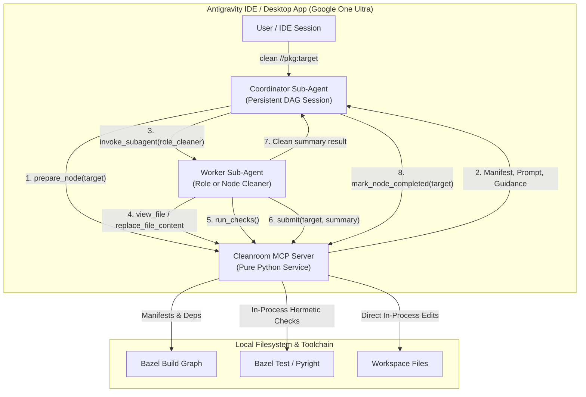
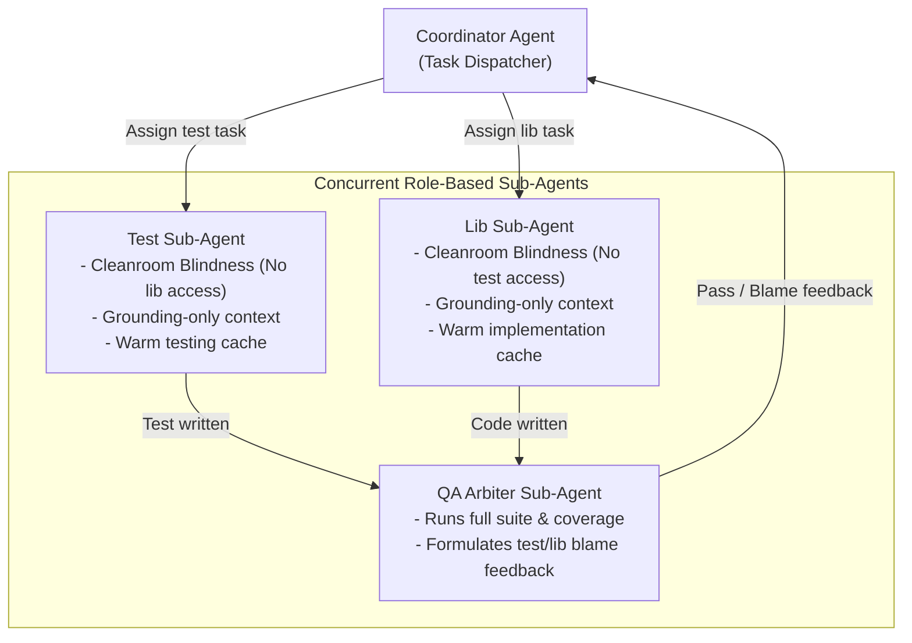
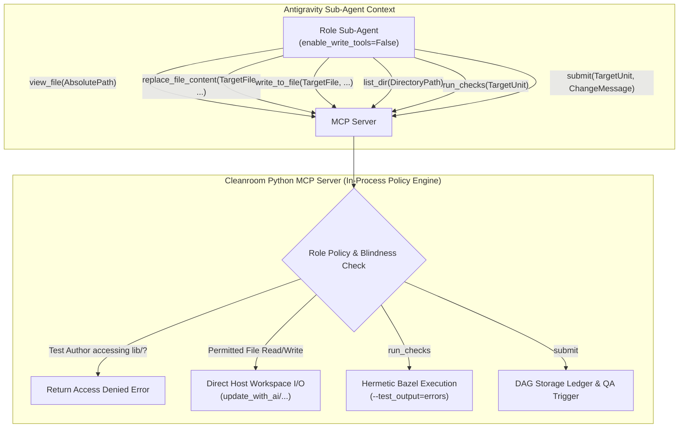
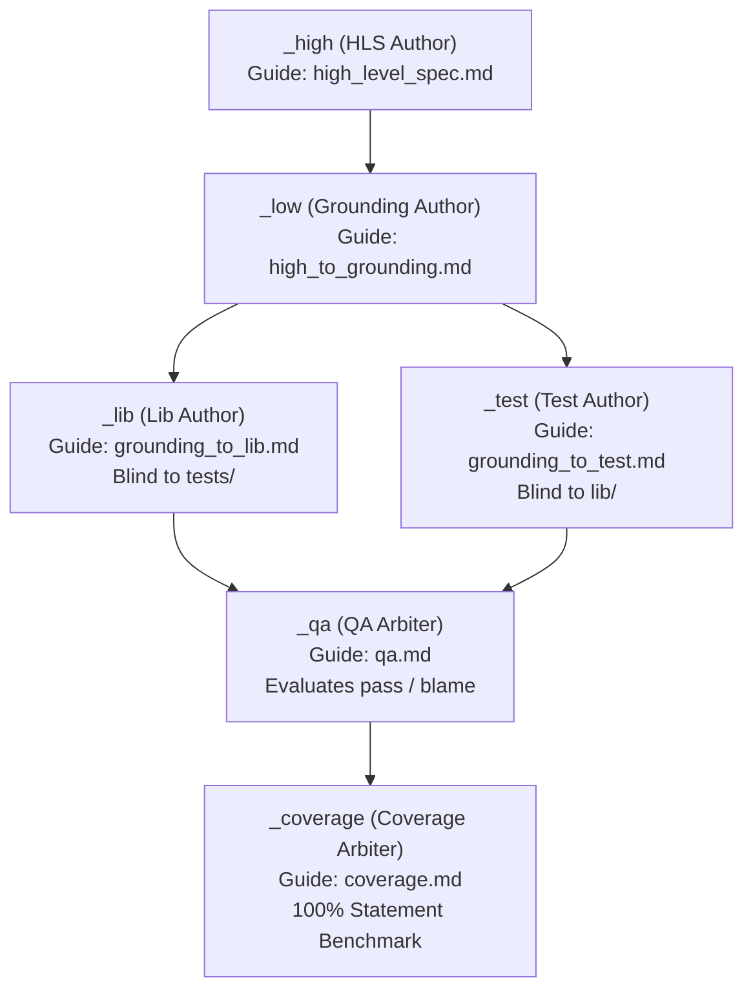
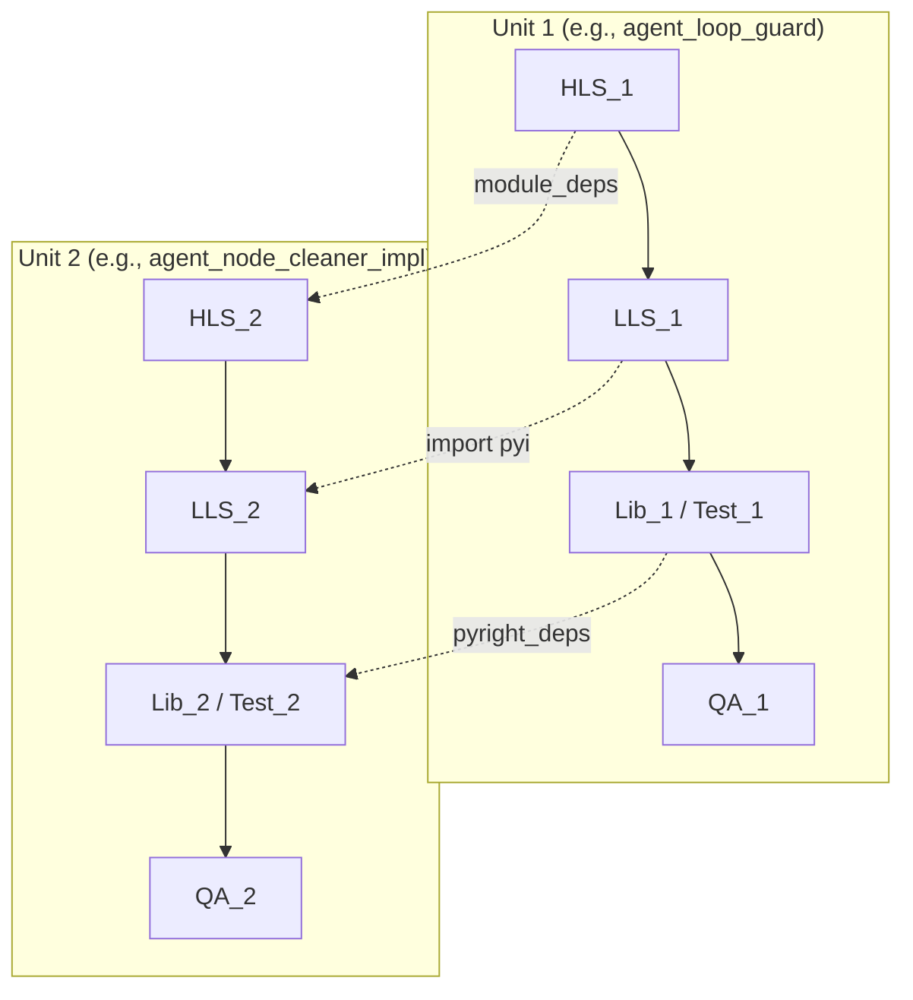
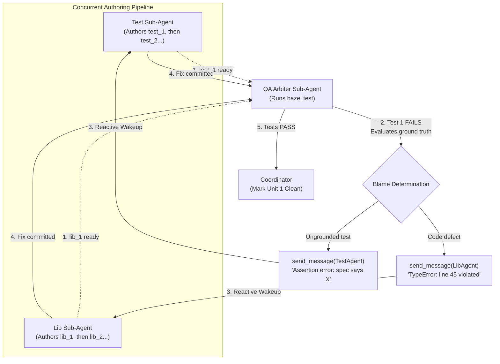
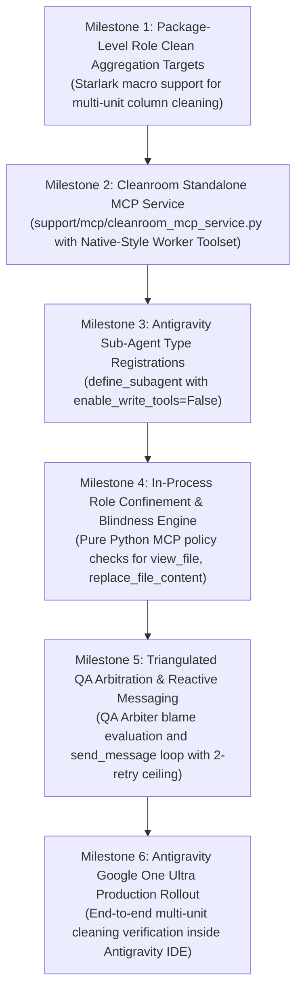

# Antigravity Tiered Sub-Agent Architecture & Integration Design

This document details the architecture, sandbox enforcement, and lifecycle mechanics for integrating Cleanroom with Google Antigravity using a **Tiered Sub-Agent Model** backed by a standalone Python Model Context Protocol (MCP) service.

---

## 1. Problem Statement & Motivation

Cleanroom is a literate, specification-driven system where software is constructed across a directed acyclic graph (DAG) of specification, implementation, and test nodes. In Cleanroom's canonical runtime (`update_with_ai`), each node is processed inside a hermetic Python sandbox with strict file aliasing, deterministic verification gating, stepped guide delivery, and process-level context isolation.

When integrating Cleanroom with Google Antigravity under a personal Google One Ultra subscription, two competing constraints arise:

1. **Quota & Environment Constraints**:
   - Google One Ultra provides interactive agent sessions in the Antigravity IDE and Desktop App without per-token cloud billing.
   - It does *not* provide a headless, raw API execution socket where custom in-process Python drivers can execute infinite unattended loops.
2. **Context Isolation vs. Confinement**:
   - An ambient, single-agent chat session in the IDE maintains continuous context across turns, leaking prompt history and tool outputs between unrelated DAG nodes.
   - An MCP server alone cannot modify the LLM's system prompt, message array, or transcript history.

To reconcile these constraints, this design proposes a **Tiered Sub-Agent Architecture** that decouples high-level DAG scheduling from hermetic node execution.

---

## 2. Tiered Sub-Agent Architecture Overview

The system divides responsibilities between two tiers of autonomous agents and an out-of-process Python MCP service:



### Components

1. **Coordinator Sub-Agent**:
   - Long-lived agent scoped to the overall DAG cleaning session.
   - Equipped with `cleanroom_coordinator_mcp` and Antigravity subagent management tools (`invoke_subagent`, `manage_subagents`, `send_message`).
   - Does *not* edit workspace files directly.
   - Requests the next dirty node or column in topological order from the MCP service, launches Worker Sub-Agents, receives completion summaries, and marks nodes complete.

2. **Worker Sub-Agent (`cleanroom_role_cleaner` / `cleanroom_node_cleaner`)**:
   - Subagent instantiated per engineering role or DAG node.
   - Configured with `enable_write_tools=False` to block native unconstrained file editing and shell execution (`run_command`).
   - Equipped exclusively with **Native-Style Cleanroom MCP Tools** (`view_file`, `replace_file_content`, `write_to_file`, `list_dir`, `run_checks`, `submit`, `blame`).
   - Operates in a **clean, isolated conversation context**. When it calls `submit` and terminates, its intermediate transcript (compiler errors, retry turns, thinking tokens) is closed and discarded.

3. **Cleanroom MCP Server (`cleanroom_mcp_service.py` / `bazel_antigravity_mcp_asm`)**:
   - Standalone Python service running over Stdio or HTTP, backed by Cleanroom's provider-agnostic subsystem assemblies (`bazel_asm`, `dag_asm`, `sandbox_asm`).
   - Reads Bazel target manifests (`*_manifest.json`), resolves dependency graphs, and tracks in-memory session state.
   - Executes deterministic Cleanroom invariants in-process: role blindness validation, direct in-place file editing with locking, diff tracking, and hermetic Bazel verification gating.
   - Completely independent of OpenAI drivers (`parts/openai`), conversation history formatting (`loop_conversation`), and the unattended in-process loop runner (`bazel_loop_impl`, `bazel_openai_loop_asm`). In the Antigravity integration, Antigravity itself drives the agent reasoning and turn loops.

---

## 3. Sub-Agent Configuration & Sandbox Hardening

To enforce Cleanroom's sandbox rules within Antigravity without virtual workspaces or native code overrides, worker subagent types are registered via Antigravity's `define_subagent` interface with restrictive capability flags and native-style MCP tool exposure:

```python
define_subagent(
    name="cleanroom_role_cleaner",
    description="Cleans Cleanroom units for a specific engineering role (test, lib, etc.).",
    system_prompt="""
You are an autonomous Cleanroom Role Cleaner. You operate strictly within the Cleanroom sandbox.
All file inspection, editing, and verification MUST be performed using your provided tools:
- Inspect files with view_file and list directories with list_dir.
- Modify files with replace_file_content or write_to_file.
- Verify your code using run_checks before submission.
- Submit completed units using submit with a concise change message.
You are subject to in-process Cleanroom Blindness and Confinement rules.
""",
    enable_mcp_tools=True,  # Exposes native-style Cleanroom MCP tools
    enable_write_tools=False,  # Hard block: disables native unconstrained write/bash tools
    enable_subagent_tools=False,  # Prevents runaway recursive subagent spawning
)
```

### Sandbox Hardening Guarantees

* **In-Process Confinement**: Because native write tools are disabled (`enable_write_tools=False`), the subagent cannot write to arbitrary disk paths or run arbitrary shell scripts. All modifications route through the MCP server's `replace_file_content` and `write_to_file`, which validate edits against the role's declared output files in-process.
* **Role Blindness Enforcement**: The MCP server intercepts `view_file` and `list_dir`. A Test Author requesting `lib/*.py` or a Lib Author requesting `tests/*_test.py` is immediately denied with an informative Cleanroom blindness error.
* **Hermetic Verification Gating**: The subagent cannot claim completion in chat text alone or run loose shell commands. It must invoke `run_checks`, which executes the node's verification target (`*_lint`, `type_check`, or unit tests) via Bazel on the host. The `submit` tool fails closed if `run_checks` has not passed for the active unit since its last modification.

---

## 4. MCP Protocol Specification

The MCP service exposes two distinct tool interfaces:

### A. Coordinator Toolset (`cleanroom_coordinator_mcp`)

| Tool Name | Parameters | Return Schema | Description |
| :--- | :--- | :--- | :--- |
| `get_dag_plan` | `root_target: string` | `List[NodePlan]` | Returns the topological sequence of dirty nodes or role columns requiring cleaning. |
| `prepare_node` | `unit: string, role: string` | `NodeContext` | Prepares node manifest, prompt, guidance, and verification commands. |
| `prepare_column` | `package: string, role: string` | `ColumnContext` | Prepares multi-unit sequence, role preamble, and grounding specifications. |
| `mark_node_completed` | `unit: string, role: string, outcome: string` | `Ack` | Records node cleaning status in the DAG storage ledger. |

### B. Role Sandbox Toolset (`cleanroom_role_mcp`) — Native Tool Parity

To eliminate cognitive friction and prompt-syntax hallucinations, tools exposed to worker sub-agents match the exact names, argument conventions, and behaviors of Antigravity's native tools:

| Tool Name | Parameters | Return Schema | Description & Confinement Enforcement | Cleanroom Internal Mapping |
| :--- | :--- | :--- | :--- | :--- |
| `view_file` | `AbsolutePath: string, StartLine?: int, EndLine?: int, ContentOffset?: int` | `FileContent` | Reads file lines with 1-indexed line numbers. Enforces Cleanroom Blindness in-process (e.g., denies `lib/` access to Test authors, denies `tests/` access to Lib authors). | `sandbox_file_reader_impl` (`ReadManager`, checks bound/unbound files and blindness). |
| `replace_file_content` | `TargetFile: string, TargetContent: string, ReplacementContent: string, StartLine?: int, EndLine?: int, AllowMultiple?: bool, Instruction?: string, Description?: string` | `EditResult` | Drops replacement content into target file. Validates in-process that `TargetFile` is the declared output file for the active unit/role. | `sandbox_file_editor_impl` (`EditManager`, verifies `locked_files` status and replaces text). |
| `write_to_file` | `TargetFile: string, CodeContent: string, Overwrite?: bool, Description?: string` | `WriteResult` | Creates or overwrites files. Enforces write confinement in-process, preventing modification to specs or undeclared files. | `sandbox_file_editor_impl` (`EditManager`, validates against declared `read_write_files`). |
| `list_dir` | `DirectoryPath: string` | `DirListing` | Lists directory contents. Redacts or flags blinded directories based on the subagent's role. | `file_paths_impl` & `alias_manager` (resolves paths within workspace root). |
| `run_checks` | `TargetUnit?: string` | `CheckResult` | Runs hermetic verification target (`lint`, `type_check`, unit test) via Bazel on the host. Tracks pass/fail status in memory. Replaces unconstrained shell access (`run_command`). | `sandbox_run_control_impl` (`RunController.check_file`, evaluates and caches verification checks). |
| `submit` | `TargetUnit: string, ChangeMessage: string` | `SubmitResult` | Gated by `run_checks` passing. Validates change message, commits changes to DAG storage, and notifies QA Arbiter or Coordinator. | `sandbox_run_control_impl` (`RunController.submit`, locks targets via `lock_node_files`). |
| `blame` | `BlameTarget: string, Diagnostics: string` | `BlameOutcome` | Attributes defect to an upstream unit or role and notifies the responsible agent or coordinator. | `sandbox_run_control_impl` (`RunController.blame`, routes feedback to upstream node). |
| `advance_step` | *none* *(Stepped Mode only)* | `MilestoneResponse` | Used in single-unit step mode: advances to the next guide milestone after verification passes. | `sandbox_run_control_impl` (`RunController.advance` & `sandbox_guide_delivery_impl`). |

---

## 5. Context Isolation Mechanics

True context isolation is achieved by exploiting Antigravity's lifecycle boundary between parent and child agents:

1. **Zero History Ingestion**: When the Coordinator calls `invoke_subagent`, Antigravity provisions a fresh session ID and an empty transcript for the Worker Sub-Agent. The worker has zero access to previous node transcripts or parent conversational history.
2. **Intermediate Token Evaporation**: During node execution, the worker may generate 10–20 turns containing large file listings, compiler error outputs, and reasoning steps. When `submit` succeeds, the worker returns a concise return payload (e.g. `Node //pkg:node cleaned; 1 file modified`) to the Coordinator. The worker's entire context window is closed, preventing context rot in subsequent nodes.
3. **Coordinator Token Economy**: Because the Coordinator only receives concise milestone completions from each worker, its context grows linearly at only ~50 tokens per node, easily supporting 20+ node pipelines without hitting model context limits.

---

## 6. Quota, Observability, and Efficiency Analysis

### A. Programmatic Quota Visibility
* **Server-Side Black Box**: Antigravity does **not** provide a programmatic API or MCP tool to query remaining Google One Ultra quota (e.g., sliding 5-hour burst window percentage or 7-day capacity limit).
* **Failure Signaling**: Quota limits manifest at runtime as:
  1. UI notifications / throttling toasts in the Antigravity desktop app.
  2. `RESOURCE_EXHAUSTED` (HTTP 429) errors returned when dispatching a turn.
* **Local Transcript Tracking**: The MCP service can read the generated JSONL transcripts in `<appDataDir>/brain/<conversation-id>/.system_generated/logs/transcript.jsonl` to sum token and thought metrics after the fact, but it cannot predict when Google's server-side rate limits will trigger.

### B. Efficiency Comparison: Tiered Sub-Agents vs. Direct Interactive Alignment

| Metric | Direct Interactive Alignment (Current UI) | Tiered Sub-Agent Architecture |
| :--- | :--- | :--- |
| **Model Context** | Hot / Cached across turns in same session | Cold start on every node worker |
| **Turn Overhead** | **Low** (2–4 turns per node with human in the loop) | **High** (8–15 turns: coordinator $\rightarrow$ launch $\rightarrow$ read $\rightarrow$ edit $\rightarrow$ verify $\rightarrow$ finish $\rightarrow$ summarize) |
| **Token Consumption** | Compact (user steers directly, short-circuiting dead ends) | **2.5x – 4x higher** due to subagent cold-start reasoning, role preamble, and summary turns |
| **Quota Risk** | Low (human pauses between tasks, natural pacing) | **High** (bursting 10+ subagents can rapidly exhaust the 5-hour rolling quota) |
| **Failure Recovery** | Instant human redirection | Requires coordinator timeout or retry logic |

### Assessment
The Tiered Sub-Agent architecture is **significantly less token-efficient** than direct interactive pair programming. It should not be used as a blunt replacement for day-to-day interactive refactoring. Instead, it is suited for **targeted autonomous batches** (e.g., cleaning 2 to 4 tightly coupled nodes after an upstream spec change) where hands-free execution outweighs token efficiency.

---

## 7. Implementation Roadmap & Evolution
 
Initially conceived as a 1:1 node-scoped sub-agent architecture, the integration has evolved into a **2D Unit $\times$ Role Product DAG** with **Role-Based Sub-Agents** (Sections 8, 13–18).

* **Foundational Phases Completed (Current State)**:
  - Unit and Role macro separation (`define_unit`, `define_role`, `define_node`).
  - Pass-through roles with component-type gating (`active_component_types`).
  - Direct CLI linters in role verification templates.
  - 2D node addressing (`unit#role`) and dynamic manifest synthesis.
  - Hardened sandbox file reading and editing tools.
* **Remaining Implementation Milestones**:
  - Package-level aggregation targets, MCP service with native tool parity, subagent registrations, in-process confinement, and QA blame loops (see **Section 19** for detailed progress and **Section 20** for remaining milestones).

---

## 8. Alternative & Refinement: Role-Based Sub-Agents (Test / Lib / QA Arbiter)

Rather than scoping ephemeral subagents per *node* (which incurs cold-start penalties and turns overhead on every node), an alternative model organizes subagents by **engineering role** across a subsystem or pipeline:



### A. The Three Specialized Roles

1. **Test Sub-Agent**:
   - **Enforces Cleanroom Blindness**: Mechanically denied access to `lib/*.py` files. It can only inspect grounding specifications (`.pyi`), high-level specifications (`.md`), and testing guides.
   - **Single-Turn Guide Delivery**: Receives the entire testing guide and node task directly without step-by-step advance friction, authoring test suites strictly from declarative requirements.
   - **Persistent Cache Warmth**: Because it stays alive across multiple test nodes, testing conventions, assertion patterns, and framework stubs remain warm in context.

2. **Lib Sub-Agent**:
   - **Independent Implementation**: Denied access to `tests/*_test.py`. Implements library code strictly against the `.pyi` contract.
   - **Implementation Cache Warmth**: Retains framework decorators (`@singleton_type`, `@poly_type`), project coding style, and sibling imports across related nodes.

3. **QA Arbiter Sub-Agent**:
   - Executes the complete test suite (`bazel test`) and coverage analysis (`evaluate_coverage.py`).
   - Acts as the impartial referee: if tests fail, it analyzes failure diagnostics to determine whether the test author misunderstood the specification or the library author introduced a defect, routing structured blame feedback accordingly.

### B. Prompt Caching & Concurrency Dynamics

* **Prefix Prompt Caching**: Modern frontier models (including Gemini) cache static prompt prefixes ($\ge 1024$ tokens). By keeping role subagents alive, their large static preambles (role instructions, framework stubs, domain guides) achieve high cache-hit ratios, reducing time-to-first-token (TTFT) and token consumption.
* **Parallel Execution**: Because the Test Sub-Agent and Lib Sub-Agent both depend only on the `.pyi` grounding specification, the Coordinator can invoke them **concurrently in parallel**, cutting wall-clock authoring latency in half.
* **Subsystem Lifecycles**: To prevent context rot from indefinite accumulation, role subagents are scoped to a **subsystem package** (e.g., `parts/agent`, `parts/sandbox`). They are initialized warm for that subsystem and recycled when moving to the next domain.

---

## 9. Architectural Evolution: Retiring Virtual Workspaces for Pure MCP

Initially, two sandbox isolation patterns were evaluated alongside custom RPC tools:
1. **In-Place Hook Interception (`hooks.json`)**: Intercepting native `view_file` calls via shell hooks and an active session JSON registry.
2. **Virtual Workspaces with Reactive Watchers**: Creating ephemeral staging directories (`/tmp/...`), symlinking specs, running background file watchers (`watchdog` / `fsevents`), and mirroring edits back to the host repository.

### Why Virtual Workspaces and Background Watchers Were Retired
While Virtual Workspaces promised physical isolation by omitting `lib/` from the staged directory, in practice they introduced substantial fragility and operational drag:
1. **Filesystem Duplication & Symlink Complexity**: Hard links and symlinks across OS boundaries (e.g. macOS APFS vs. Linux) cause edge cases with file attributes and in-place editor atomic renames.
2. **Reactive Sync Races**: File watchers operate asynchronously. When an agent rapidly edits a file and immediately requests verification, race conditions occur where the test runner evaluates stale host code before the watcher completes the copy.
3. **Dangling Daemon Processes**: Background file watcher daemons must be spawned, health-checked, and terminated cleanly across subagent crashes or timeouts.
4. **Monorepo Import & Bazel Disconnect**: Staged directories break relative paths, `MODULE.bazel` discovery, and Pyright configuration, requiring artificial path rewrites and symlink trees.

---

## 10. Pure MCP Architecture: Native Tool Parity & In-Process Confinement

The adopted design implements a **Pure MCP Tool Architecture** with **Native Tool Parity**. Instead of staging virtual directories or forcing models to learn custom, alien RPC interfaces (`cleanroom_read(alias='SRC')`), Cleanroom exposes MCP tools that mirror the exact signatures, parameter names, and behaviors of Antigravity's native tools:



### A. Native Tool Parity Eliminates Cognitive Friction
Frontier models are extensively pre-trained and instruction-tuned on standard file viewing and editing tools. Exposing tools that conform to standard Antigravity schemas eliminates prompt overhead and hallucination:

1. **`view_file`**:
   - Signature: `view_file(AbsolutePath: str, StartLine?: int, EndLine?: int, ContentOffset?: int)`
   - Operates on real repository paths (e.g., `/Users/.../update_with_ai/parts/agent/grounding/agent_node_cleaner_impl.pyi`).
   - Returns 1-indexed line numbers and content slices matching Antigravity native behavior.
2. **`replace_file_content`**:
   - Signature: `replace_file_content(TargetFile: str, TargetContent: str, ReplacementContent: str, StartLine?: int, EndLine?: int, AllowMultiple?: bool, Instruction?: str, Description?: str)`
   - Exact drop-in replacement for Antigravity's native editing tool.
   - Performs exact contiguous string chunk replacements in-place on the host repository.
3. **`write_to_file`**:
   - Signature: `write_to_file(TargetFile: str, CodeContent: str, Overwrite?: bool, Description?: str)`
   - Initializes new test or implementation files directly.
4. **`list_dir`**:
   - Signature: `list_dir(DirectoryPath: str)`
   - Explores directory hierarchies, returning children and directory sizes.
5. **`run_checks`**:
   - Signature: `run_checks(TargetUnit?: str)`
   - Replaces unconstrained terminal access (`run_command`) with deterministic verification execution.
6. **`submit`**:
   - Signature: `submit(TargetUnit: str, ChangeMessage: str)`
   - Atomically records the completed unit asset in DAG storage once verification checks have passed.

### B. In-Process Confinement & Blindness Enforcement
Because the subagent is registered with `enable_write_tools=False`, native write tools (`write_to_file`, `replace_file_content`) and terminal commands (`run_command`) are completely disabled by Antigravity. The subagent **cannot** bypass the MCP server.

The Python MCP server maintains active session context (subagent conversation ID $\to$ assigned role and active unit batch):

1. **Role Blindness**:
   - When a **Test Sub-Agent** calls `view_file` on any path under `/lib/` or ending in `_impl.py`:
     ```text
     Access Denied: Cleanroom Blindness Violation.
     Test authors are strictly barred from inspecting library implementation files under lib/.
     You must author test cases exclusively from grounding specifications (.pyi), specifications (.md), and testing guides.
     ```
   - When a **Lib Sub-Agent** calls `view_file` on any path under `/tests/` or ending in `_test.py`:
     ```text
     Access Denied: Cleanroom Blindness Violation.
     Library authors are strictly barred from inspecting test files under tests/.
     You must implement functionality strictly to satisfy the grounding specification contract (.pyi).
     ```
   - When `list_dir` is called, forbidden directories are either omitted or flagged as `[blinded/restricted]`.
2. **Write Confinement**:
   - When `replace_file_content` or `write_to_file` is invoked, the MCP server asserts that `TargetFile` matches the role's declared output file for the active unit:
     - Test Role: only allowed to edit `tests/{unit}_test.py` and `tests/BUILD.bazel`.
     - Lib Role: only allowed to edit `lib/{unit}.py` and `lib/BUILD.bazel`.
     - Spec Roles (`high`, `low`): only allowed to edit `high/{unit}.md` and `grounding/{unit}.pyi` respectively.
   - Any attempt to edit upstream specs, dependencies, or out-of-scope units is rejected immediately.
3. **Atomic Change Tracking**:
   - File edits modify the host workspace directly in-place. The MCP server records a dirty bit for that unit, requiring a clean pass of `run_checks` before `submit` will succeed.

---

## 11. Comparison of Sandbox Confinement Strategies

| Strategy | Blindness Guarantee | Model Affinity | Operational Overhead | Synchronization Latency | Verdict |
| :--- | :--- | :--- | :--- | :--- | :--- |
| **Pure MCP with Native Tool Parity** | **Absolute (In-Process)**: Enforced directly inside Python tool dispatch logic based on subagent role metadata. | **100% Native**: Exact same tool names, parameter schemas, and real paths as standard Antigravity tools. | **Minimal**: Operates in-place on host repository; no staging directories or daemons. | **Zero**: In-place edits are instantly visible to verification. | **Chosen Architecture** |
| **Virtual Workspace + Watcher** | **Physical**: Forbidden files omitted from staging directory. | **100% Native**: Real relative paths in staging root. | **High**: Staging directory materialization, symlink trees, background `watchdog`/`fsevents` daemons. | **High / Race-Prone**: File sync latency between staging and host monorepo. | Rejected (Too fragile, sync races) |
| **`hooks.json` PreToolUse Guard** | **Strong**: Intercepts native tool calls via external shell hook script. | **100% Native**: Native tools with hook gating. | **Moderate**: Requires workspace-global hook configuration and JSON state files. | **Low**: Operates in-place. | Deprecated in favor of Pure MCP |
| **Alien Shadow MCP Tools** | **Strong**: Custom RPC aliases (`cleanroom_read(alias=...)`). | **Degraded**: Model must learn non-standard schemas; high cognitive drag and hallucinations. | **Moderate**: Custom MCP implementation. | **Zero**: In-place. | Rejected (Model friction & hallucinations) |

### Key Takeaway
The **Pure MCP with Native Tool Parity** approach achieves the ideal sweet spot:
* It eliminates the operational complexity, disk copying, and sync races of Virtual Workspaces.
* It eliminates the cognitive drag, schema errors, and alias confusion of Alien MCP tools.
* It leverages Antigravity's built-in `enable_write_tools=False` to guarantee that all file modifications and verifications route through Cleanroom's Python policy engine.

---

## 12. Hermetic Verification and Shell Denial in Pure MCP

In standard Antigravity workflows, agents frequently attempt to run tests or build tools via bash commands (`run_command("pytest ...")` or `run_command("bazel test ...")`).

### A. Elimination of Shell Escape
By registering role subagents with `enable_write_tools=False`:
* Antigravity **does not equip the agent with `run_command`**.
* The agent cannot run unconstrained shell commands, bypass build rules, inspect unpermitted environment variables, or run non-hermetic scripts.
* All verification must route through the MCP tool: `run_checks(TargetUnit)`.

### B. In-Process Hermetic Bazel Execution
When `run_checks` is called:
1. The MCP server resolves the active unit and role from its in-memory session.
2. It fetches the parameterized `verify_template` from the synthesized role manifest (Section 19C).
3. It executes the verification command directly via a hermetic subprocess on the host repository:
   ```bash
   bazel test //update_with_ai/parts/agent/tests:agent_node_cleaner_impl_test \
       --test_output=errors --test_timeout=100 --noshow_progress --noshow_loading_progress
   ```
4. The output is filtered and sanitized:
   - On success: Returns `{"status": "PASS", "unit": target_unit, "summary": "All 12 unit tests passed."}`.
   - On failure: Returns `{"status": "FAIL", "diagnostics": "<compiler/test error snippet>"}`.
5. Pass/fail status is recorded in memory. The unit cannot be submitted via `submit` until `run_checks` reports `PASS`.

---

## 13. Formalizing Role vs. Unit in Cleanroom & Bazel

To enable Antigravity to run role-based sub-agents over multiple components simultaneously, Cleanroom's macro architecture formally decouples the concept of an **Engineering Role** from a modular **Unit** (component).

### A. Core Ontological Definitions

1. **Unit (Component)**:
   - A distinct functional module in the codebase (e.g., `dag_storage`, `dag_cleaner_impl`, `agent_node_cleaner_impl`).
   - Defined by its artifacts: High-Level Spec (`high/*.md`), Grounding Spec (`grounding/*.pyi`), Implementation (`lib/*.py`), Test Suite (`tests/*_test.py`), and verification logs.
   - **Unit Dependency Invariant**: A unit can **only** depend on other units (e.g. `unit_deps = [":dag_cleaner", ":dag_storage"]`). These unit dependencies are treated uniformly as `star_deps`.
   - Has its own address and emits a `<unit>_unit_manifest.json`.

2. **Role (Engineering Discipline)**:
   - An independent actor in Cleanroom's verification methodology (e.g., `high`, `low`, `lib`, `test`, `qa`, `coverage`).
   - Has its own address and emits a `<role>_role_manifest.json`.
   - Defined by:
     - **Role Dependencies**: Directed pipeline of roles ($D_{\text{roles}}$), where `low` depends on `high`, `lib` and `test` depend on `low`, `qa` depends on `test` and `lib`.
     - **Cross-Role Channels**: Feedback channels (e.g. `qa` blames `lib` and `test`) and silent dependencies (e.g. `test` treats `lib` as silent).
     - **Relative Source Pattern**: Specifies the source path pattern relative to the unit (e.g. `lib/{unit}.py`, `tests/{unit}_test.py`, `grounding/{unit}.pyi`, `high/{unit}.md`, `logs/{unit}_qa.log`).
     - **Guidance & Verification**: Authoritative guide document and parameterized verification template.
     - **Blindness Rules**: Mechanical confinement rules (e.g. Test Author denied access to `lib/`).

### B. The Canonical Role DAG

Every unit in Cleanroom is processed through an invariant virtual DAG of roles:



* **Parallelism**: `_lib` and `_test` run concurrently and in mutual blindness.
* **Refinement**: `_qa` arbitrates failures, formulating feedback targeted specifically to `_lib` or `_test`.

### C. Shifting from `1:1` to `1:N`: The Multi-Unit Role Execution Model

* **Cleanroom Model**: $\text{unit} \times \text{role} = \text{node}$ (`node = unit * role`)
  Each Bazel node represents exactly one role applied to one unit (e.g., `:agent_node_cleaner_impl_test`).
  By loading the manifests for the **unit** and the **role**, the runtime synthesizes all information previously baked into monolithic node manifests.
* **Antigravity Multi-Unit Model**: $\text{task} = \text{role} \times \text{List}[\text{unit}] \;(1:N)$
  A single persistent role sub-agent processes an entire batch of units (e.g., all units in `update_with_ai/parts/agent/`) under a single warm context.

### D. Prompt Stratification: Node-Specific vs. Multi-Unit Role Prompts

To support both execution paradigms, prompts are stratified into two layers:

1. **Static Role Preamble (Cache-Friendly)**:
   - Establishes the agent's persona, methodology, guide rules, and blindness constraints.
   - Identical across all tasks for that role, achieving near-100% prefix prompt cache hits.
   - Example (Test Role):
     ```markdown
     You are the Cleanroom Test Author for update_with_ai/parts/agent.
     You author unit test suites strictly from .pyi grounding specifications per grounding_to_test.md.
     You are blinded to library implementations in lib/.
     ```

2. **Dynamic Task Payload**:
   - **Single-Unit Mode (Current CLI / Local Runner)**:
     ```markdown
     Target Unit: agent_node_cleaner_impl
     Grounding Spec: grounding/agent_node_cleaner_impl.pyi
     Output File: tests/agent_node_cleaner_impl_test.py
     Verify Target: //update_with_ai/parts/agent/tests:agent_node_cleaner_impl_test
     ```
   - **Multi-Unit Mode (Antigravity Role Sub-Agent)**:
     ```markdown
     Target Package: update_with_ai/parts/agent
     Units in Topological Order:
       1. agent_loop_guard_impl
       2. agent_node_cleaner_impl
     Instructions: For each unit in sequence, inspect grounding/*.pyi, author tests/*_test.py, and verify via run_checks.
     ```

### E. Cleaning Mechanics & Required Starlark Refactoring

Cleaning requires specifying the role and node to clean up to via familiar target labels:
```bash
bazel run //update_with_ai/parts/dag:dag_cleaner_impl_lib_clean
```
Here, the unit is `dag_cleaner_impl` and the role is `lib`. The system loads the unit manifest and role manifest to ensure all prerequisites are clean.

1. **Separate Macros for Defining Roles and Units**:
   - Role macro: defines `HLS_ROLE`, `LLS_ROLE`, `LIB_ROLE`, `TEST_ROLE`, `QA_ROLE`, `COVERAGE_ROLE` in `update_python_with_ai`.
   - Unit macro: defines units (e.g. `dag_storage`, `dag_cleaner_impl`) and their `unit_deps` (treated as `star_deps`).
2. **Package-Level Role Targets**:
   In addition to generating individual `:unit_role_clean` nodes, the macro generates package-level role aggregation targets:
   - `//update_with_ai/parts/agent:tests_clean` (Runs test role across all units in `agent`)
   - `//update_with_ai/parts/agent:lib_clean` (Runs lib role across all units in `agent`)
   - `//update_with_ai/parts/agent:qa_clean` (Runs QA arbiter across all units in `agent`)
3. **Role & Unit Manifests**:
   Generate `_role_manifest.json` and `_unit_manifest.json` for consumption by both Cleanroom's Python runner and Antigravity's MCP server.

---

## 14. The 2D Product DAG: Reconciling Unit DAGs and Role DAGs

Cleanroom’s complete build graph is formally the **Tensor / Cartesian Product of two distinct DAGs**:
$$D_{\text{nodes}} = D_{\text{units}} \times D_{\text{roles}}$$

Where each node in the build graph is the product:
$$\text{unit} \times \text{role} = \text{node}$$

* **$D_{\text{units}}$ (Domain Architecture DAG)**: Directed dependencies between functional software modules (e.g., `agent_node_cleaner_impl` depends on `agent_loop_guard`, `agent_conversation`, and `agent_driver`).
* **$D_{\text{roles}}$ (Verification Methodology DAG)**: Directed pipeline of engineering roles (`_high` $\rightarrow$ `_low` $\rightarrow$ `[_lib, _test]` $\rightarrow$ `_qa` $\rightarrow$ `_coverage`).



### A. Two Strategies for Traversing the 2D Grid

#### 1. Diagonal / Unit-First Traversal (Legacy Cleanroom CLI)
- Finishes all roles for Unit 1, then moves to Unit 2.
- **Flaw**: Trashes the model's attention window by continuously alternating personas (`high` $\rightarrow$ `low` $\rightarrow$ `lib` $\rightarrow$ `test` $\rightarrow$ `qa`) on every single node, causing massive cache misses and cold-start reasoning churn.

#### 2. Columnar / Role-First Traversal (Antigravity Role Sub-Agents)
- Executes across units by **Role Column**:
  * **Stage 1 (HLS)**: Align all `high/*.md` files in the package.
  * **Stage 2 (Grounding)**: Align all `grounding/*.pyi` files in the package.
  * **Stage 3 (Concurrent Lib & Test)**:
    - **Test Sub-Agent**: Authors all `tests/*_test.py` across the package in parallel.
    - **Lib Sub-Agent**: Authors all `lib/*.py` across the package in parallel.
  * **Stage 4 (QA Arbiter)**: Runs full test suite and coverage across all units simultaneously.

### B. Why Role-First Traversal Naturally Enforces Unit Dependencies

When an agent operates in **Columnar / Role-First mode**, the orchestrator does not need to micromanage individual unit transitions because **the Unit DAG is already hard-encoded into the source artifacts**:

1. **Explicit Spec Declarations**:
   - In HLS: `imports: agent_loop_guard, agent_driver`
   - In Grounding: `from . import agent_loop_guard`
   - In Bazel: `deps = ["//update_with_ai/parts/agent:agent_loop_guard"]`
2. **Deterministic Compiler Gating**:
   - If a Lib Author attempts to import a sibling component that is present in the workspace but *not* a declared dependency of that specific unit:
     - The Pyright type checker and Cleanroom `lib_lint.py` immediately flag a compile/lint failure: `Import of undeclared dependency 'foo' not in target deps`.
   - The sub-agent receives the exact diagnostic via `run_checks` and corrects itself without the orchestrator needing to hold its hand.

### C. Benefits of Columnar Execution

1. **Harmonized Subsystem Ontologies**: Authoring all grounding `.pyi` specs for a subsystem together prevents symbol drift and interface mismatches between sibling components.
2. **Zero Role Context Thrashing**: The Test Agent only ever writes tests; the Lib Agent only ever writes implementations.
3. **Maximum Model Concurrency**: The entire Test column and entire Lib column execute concurrently in parallel across two sub-agents, cutting authoring time in half while preserving mutual blindness.

---

### D. The Two-Dimensional Dependency Invariant

Formally, for any unit $X$ and role $Y$, node $(X, Y) = X \times Y$ is gated by two orthogonal dependency invariants:

$$\text{Predecessors}((X, Y)) = \underbrace{\{(A, Y) \mid A \in \text{deps}_{\text{units}}(X)\}}_{\text{Unit-Level Invariant}} \;\cup\; \underbrace{\{(X, W) \mid W \in \text{deps}_{\text{roles}}(Y)\}}_{\text{Role-Level Invariant}}$$

1. **Unit-Level Dependency Invariant**:
   $$\forall A \in \text{deps}_{\text{units}}(X), \quad (A, Y) \prec (X, Y)$$
   *Rule*: The upstream unit dependencies $A$ of $X$ must complete role $Y$ before $X$ can complete role $Y$.
   *Example*: Before `agent_node_cleaner_impl` can finish its **Grounding** (`.pyi`), its prerequisite `agent_loop_guard` must have already finished its **Grounding** (`.pyi`), because the former imports symbols from the latter.

2. **Role-Level Dependency Invariant**:
   $$\forall W \in \text{deps}_{\text{roles}}(Y), \quad (X, W) \prec (X, Y)$$
   *Rule*: Unit $X$ must complete all upstream role prerequisites $W$ of $Y$ before $X$ can complete role $Y$.
   *Example*: Before `agent_node_cleaner_impl` can finish its **Grounding** (`.pyi`), `agent_node_cleaner_impl` must have already completed its **High-Level Spec** (`.md`).

### E. How Columnar Execution Satisfies Both Invariants

Columnar (Role-First) traversal satisfies this 2D dependency invariant with mathematical perfection:

1. **Role Invariant is Globally Satisfied**:
   Because column $W$ (e.g. HLS) is completed in its entirety before column $Y$ (e.g. LLS) begins, **every single unit has already satisfied its role prerequisites**.
2. **Unit Invariant is Satisfied via In-Column Topological Sorting**:
   Within the active role column $Y$, the sub-agent does not process units arbitrarily; it processes them in **topological order of the Unit DAG**:
   - Leaf units (with no unresolved dependencies) are processed first.
   - Downstream consumers are processed only after their imported dependencies are complete.
3. **Result**: The role sub-agent retains **100% prompt cache warmth** and persona focus throughout its entire run, while satisfying all structural build dependencies across both axes.

---

## 15. Asynchronous Feedback Loops & Inter-Agent Messaging

While the initial authoring of specifications and code follows topological ordering across columns, Cleanroom's real-world execution is **fundamentally non-sequential and reactive**:
* **Lib and Test roles run concurrently**.
* **QA Arbiter executes reactively** as soon as any unit's `(lib, test)` pair is materialized.
* **Test failures generate asynchronous feedback**, requiring sub-agents to interrupt or interleave fixes with subsequent authoring tasks.



### A. Sub-Agent Communication: The Native Antigravity Message Bus
Antigravity provides a built-in inter-agent messaging bus. Sub-agents do **not** need complex polling, file-drop signaling, or busy-waiting loops:

1. **Direct Point-to-Point Messaging (`send_message`)**:
   - Any agent can message another agent using its conversation UUID:
     `send_message(Recipient=lib_subagent_id, Message="Verification failure in lib_1.py: ...")`
2. **Reactive Wakeup (Zero Polling)**:
   - When a role sub-agent completes its immediate authoring pass, it simply stops calling tools and enters the `waiting_for_message` / `idle` lifecycle state.
   - When a message arrives from the QA Arbiter, Antigravity **automatically wakes the sub-agent up**, delivering the feedback payload into its context at the start of the next turn.
3. **Turn-Boundary Queueing During Active Execution**:
   - If the Lib Sub-Agent is actively writing `lib_2.py` when feedback arrives regarding `lib_1.py`, Antigravity safely queues the message.
   - At the completion of its active tool turn, the agent receives the feedback, applies a localized diff to `lib_1.py` using `replace_file_content`, replies to the QA Arbiter, and smoothly resumes `lib_2.py`.

### B. Triangulated Communication Topology (Preventing Agent Ping-Pong)
A known failure mode in multi-agent systems is circular argument loops, where the Test Agent blames the Lib Agent, and the Lib Agent blames the Test Agent.

Cleanroom prevents this by enforcing a **Triangulated Communication Topology**:
* **The Test Agent and Lib Agent NEVER communicate directly**. They remain mutually blind.
* **The QA Arbiter is the Sole Referee**:
  - The QA Arbiter evaluates failures against the **`.pyi` grounding specification as absolute ground truth**.
  - If the test asserts an expectation not justified by `.pyi` requirements: **Blame Test Sub-Agent**.
  - If the implementation fails to realize a `.pyi` requirement: **Blame Lib Sub-Agent**.
  - If the `.pyi` specification itself is contradictory or underspecified: **Escalate to Coordinator / Spec Author**.

### C. Quota Protection: Bounding Feedback Iterations
Every feedback loop consumes model turns under your Google One Ultra 5-hour quota. To prevent runaway diagnostic spiral:
1. **Feedback Iteration Ceiling**: A maximum of **2 feedback iterations** is permitted per unit.
2. **Escalation on Repeated Failure**: If a unit fails verification on the second retry:
   - The QA Arbiter halts the sub-agents for that unit.
   - The node is marked `DIRTY` in Cleanroom DAG storage.
   - The Coordinator alerts the human user in the primary IDE chat with compiler diagnostics, preserving quota and allowing manual steering.

---

## 16. Asset Submission Protocol (`submit`) & QA Reaction Loop

To decouple continuous authoring from verification gating in multi-unit role agents, the system introduces an **Asset-Level Submission Protocol**:

### A. The Verification & Submission Contract
Instead of a single monolithic `finish` tool, role sub-agents operate with two fine-grained primitives:

1. **`run_checks(target_node)`**:
   - Runs the local verification target for a specific unit (e.g. `agent_node_cleaner_impl_lib_type_check` or spec linter).
   - The verification engine tracks the verification status of each asset in memory alongside file revision hashes:
     `status[target_node] = "PASS" | "FAIL"`
2. **`submit(target_node, change_message)`**:
   - Gated by `run_checks`: If `run_checks` has not passed for `target_node` since its last file modification, `submit` **fails closed** and returns:
     `"Cannot submit asset: run_checks has not passed for target_node. Please run checks and fix diagnostics first."`
   - If passing, `submit` records the asset as ready and automatically emits a notification message to the **QA Arbiter Sub-Agent**.

### B. Message Delivery Timing: Turn Boundaries vs. Interruption
Sub-agents are **never interrupted midway through an active tool execution** or text generation:
* **While Actively Working**: Messages sent via `send_message` are buffered by Antigravity in the recipient's incoming queue. The agent completes its active file edit or check undisturbed.
* **At Turn Boundaries**: The buffered message is delivered into the agent's context at the start of its next turn.
* **While Idle**: If the agent has stopped calling tools (waiting for work), Antigravity **reactively wakes it up immediately**.

This ensures that files are never left in a half-written, corrupt state due to incoming feedback interrupts.

---

## 17. Multi-Model Portability: DeepSeek V4.1 Flash & Local Testing

Because this Role-First, Multi-Unit architecture is implemented as generic Cleanroom infrastructure, it is not coupled to Antigravity:

### A. Testing on DeepSeek V4.1 Flash & Local Models First
Before deploying multi-unit role pipelines to Antigravity (where mistakes consume Google One Ultra quota), the architecture can be staged, tested, and benchmarked on:
* **DeepSeek V4.1 Flash**: Fast, frontier-class code generation with extensive reasoning capabilities and low token costs.
* **Local Models (`localhost:8000`)**: Local quantization models (e.g. `qwen-moe-q4`, `coder-next`) via Cleanroom's existing `model_config.bzl`.

### B. Validation Objectives on Local / Flash Models
1. **Verify Role Manifest Schemas**: Validate that Starlark correctly emits `_role_manifest.json` for multi-unit batches.
2. **Benchmark Batching Efficiency**: Measure whether authoring 3–5 units in one session preserves cache warmth and reduces overall token consumption compared to 1:1 node runs.
3. **Validate Blame Attribution**: Confirm that the QA Arbiter reliably attributes test vs. lib blame without human intervention.

---

## 18. Single-Unit vs. Multi-Unit Duality & Stepped Guide Mode

The architecture unifies single-unit and multi-unit executions under a single mathematical model, with one key behavioral distinction: **Guide Section Stepping**.


### A. $N = 1$ is a Special Case of $1:N$
A single-unit run is simply a batch of size 1. All role preambles, `run_checks`, and `submit` protocols apply identically.

### B. Guide Section Stepping Duality
* **In Multi-Unit Mode ($N > 1$)**:
  - Stepping through micro-sections of a guide across multiple units simultaneously causes cognitive fragmentation.
  - The guide is delivered as a **whole reference specification** (e.g., the complete `grounding_to_lib.md` rules).
  - Stepping occurs **per unit** (author Unit 1 $\rightarrow$ `run_checks` $\rightarrow$ `submit` $\rightarrow$ author Unit 2...).
* **In Single-Unit Mode ($N = 1$)**:
  - Fine-grained **Guide Section Stepping** (`sandbox_guide_delivery_impl.md`) remains an active option via `allows_step_mode = True`.
  - For complex, difficult refactorings or initial implementations, the agent can be guided milestone-by-milestone through the task with gated verification checkpoints.

### C. Dynamic Escalation: Fallback to Dedicated Step-Mode Sub-Agent
If a specific unit struggles or fails repeated verification during multi-unit batch execution (even with a frontier model):
* The Coordinator can dynamically carve out the problematic unit from the batch.
* It spawns a dedicated single-unit sub-agent assigned exclusively to that unit in **Stepped Guide Mode** (`allows_step_mode = True`).
* This slows the agent down, forcing incremental, milestone-by-milestone verification checkpoints and concentrated reasoning on the difficult logic until tests pass, after which the unit is re-integrated into the main pipeline.

---

## 19. Implementation Status & Accomplishments (Current State)

The foundation for the 2D Product DAG and Role-Based Antigravity Integration is now fully implemented and verified in Cleanroom's canonical codebase (`update_with_ai` and `update_python_with_ai`), with 100% test passing and specification alignment:

### A. 2D Unit $\times$ Role Product DAG Ontology
* **Separation of Unit and Role**: Replaced legacy monolithic node macros with distinct, composable macros:
  - `define_unit(name, unit_deps, component_type)`: Defines functional units (`implementation`, `assembly`, `interface`, `external`), declares dependencies strictly between units (treated uniformly as `star_deps`), and generates `<unit>_unit_manifest.json`.
  - `define_role(...)`: Defines engineering disciplines (`high`, `low`, `lib`, `test`, `qa`, `coverage`), parameterized source patterns, prompts, verification commands, and 2D dependency channels (`role_deps`, `star_role_deps`, `silent_cross_role_deps`, `feedback_role_deps`), generating `<role>_role_manifest.json`.
  - `define_node(name, unit, role)`: Generates single-node convenience targets (`<unit>_<role>_clean`, `_feedback`, `_dirty`, `_change`, `_prompt`).
* **Flat Definition Loop**: Replaced complex conditional logic in `update_python_with_ai.bzl` with a single, uniform loop: one `define_unit` followed by six `define_node` invocations over all canonical roles.
* **Refactored Node Addressing**: Refactored `Node` in `dag_storage.py` from a single `address: str` to `(unit_address: str, role_address: str)`, serialized as `unit#role` (e.g. `//parts/dag:dag_cleaner_impl#//update_python_with_ai:lib`). Updated `NodeConfig`, `BazelStorage`, `BazelRunner`, and `BazelTarget` across the runtime.

### B. Pass-Through Roles & Component-Type Gating
* **Component-Type Activation**: Added `active_component_types` gating to `define_role`:
  - `high`, `low`: Active across all components (`implementation`, `assembly`, `interface`, `external`).
  - `lib`: Active for `implementation`, `assembly`, and `interface`.
  - `test`, `qa`, `coverage`: Active exclusively for `implementation`.
* **Pass-Through Node Synthesis**: When a unit's component type is inactive for a role:
  - Synthesized with empty `task_prompt`, `src`, and `verify` fields.
  - Generates zero change messages and triggers no LLM agent session.
  - Automatically bridges dependencies: cross-unit `(u_dep, role)` and intra-unit `(unit, r_dep)`. Cleaning a pass-through node transitively cleans its upstream dependencies while acting as a transparent dependency in the DAG.

### C. Direct CLI Linters in Role Verification Templates
* **Elimination of Utility Targets**: Removed intermediate lint test rules (`_hls_lint_test`, `_lls_lint_test`) that cluttered the package graph.
* **Direct Shell Verification Commands**: Integrated linters and type checkers directly into role `verify_template` attributes:
  - `high`: `cd $BUILD_WORKSPACE_DIRECTORY && python3 update_with_ai/support/lib/hls_lint.py {unit_dir}/high/{unit_name}.md`
  - `low`: `cd $BUILD_WORKSPACE_DIRECTORY && python3 update_with_ai/support/lib/grounding_tool.py --check {unit_dir}/grounding/{unit_name}.pyi`
  - `lib`: `cd $BUILD_WORKSPACE_DIRECTORY && python3 update_with_ai/support/lib/lib_lint.py {unit_dir}/lib/BUILD.bazel {unit_dir}/lib/{unit_name}.py --pyi {unit_dir}/grounding/{unit_name}.pyi && bazel test //{unit_dir}/lib:{unit_name}_type_check 2>&1`
  - `test`: `cd $BUILD_WORKSPACE_DIRECTORY && python3 update_with_ai/support/lib/test_lint.py {unit_dir}/tests/BUILD.bazel {unit_dir}/tests/{unit_name}_test.py --lib-pkg {unit_dir}/lib --pyi {unit_dir}/grounding/{unit_name}.pyi && bazel test //{unit_dir}/tests:{unit_name}_test_type_check 2>&1`
  - `qa`: `bazel test //{unit_dir}/tests:{unit_name}_test 2>&1`
  - `coverage`: `bazel test //{unit_dir}/tests:{unit_name}_test && python3 update_with_ai/support/lib/evaluate_coverage.py --lib-file {unit_dir}/lib/{unit_name}.py --test-file {unit_dir}/tests/{unit_name}_test.py 2>&1`

### D. Dynamic 2D Manifest Synthesis & Template Propagation
* **Runtime Manifest Synthesis**: `bazel_manifest_loader_impl.py` loads `_unit_manifest.json` and `_role_manifest.json` on-the-fly, synthesizing 2D dependencies (`deps`, `feedback_deps`, `silent_deps`, `star_deps`), templates, and parameterized variables (`unit_name`, `unit_dir`).
* **Role Templates**: Added `template` attribute to `define_role` and forwarded template files through Bazel runfiles. Wired starter templates (`empty`, `hls`, `lls`, `lib`, `test`) across all roles in `update_python_with_ai/BUILD.bazel`.

### E. Sandbox Edge Case Hardening
* **Missing File Resilience**:
  - `sandbox_file_reader_impl.py`: `ReadTool` treats missing read-write files as empty (`lines = []`) instead of raising an unhandled `FileNotFoundError`, and returns structured error guidance for missing read-only files.
  - `sandbox_file_editor_impl.py`: `TextReplacementTool` and `LineUpdateTool` treat missing read-write files as empty, create parent directories atomically on disk (`os.makedirs`), and track file revisions.

### F. Cleanroom Alignment & Test Validation
* **Strict Specification Alignment**: Updated High-Level Specs (`bazel_manifest_loader_impl.md`, `sandbox_file_reader_impl.md`, `sandbox_file_editor_impl.md`) and Grounding Specs (`.pyi`). Validated via `hls_lint.py` and `grounding_tool.py --check` with zero errors.
* **Comprehensive Test Suite**:
  - `//update_with_ai/...` and `//update_python_with_ai/...`: **106 / 106 tests passing**.
  - `//testing/...` (ephemeral test consumer workspace synced via updated `bin/sync_testing.sh`): **104 / 104 tests passing**.

### G. Multi-Node Batch Execution & Guide Harmonization
* **Multi-Node Submission Protocol**: Harmonized all canonical Cleanroom guides (`qa.md`, `coverage.md`, `grounding_to_lib.md`, `grounding_to_test.md`, `high_to_grounding.md`, `high_level_spec.md`) to natively support multi-node batch sessions (`batch_size > 1`).
* **Per-Target Submission & Blame**:
  - Each target file in a batch is identified by its file alias short name.
  - Workers and arbiters submit each completed target individually using `submit(target="<target_file>", change_summary="...")` (or `submit(target="<target_qa.log>")` for QA arbiters).
  - In multi-target sessions, defect attribution specifies both the reporting target and the upstream target: `blame(target="...", blame_target="...", explanation="...")`.

### H. QA Arbiter Scope & Separation of Concerns
* **Strict Test-Only Responsibility**: Updated `qa.md` to establish that the QA Arbiter's sole responsibility is auditing test execution and test assertion fidelity:
  - QA evaluates whether executed tests pass and assert declared requirements faithfully without unmandated or tautological assertions.
  - Requirement completeness and statement coverage belong exclusively to the Coverage Arbiter. Cataloged `# Untested requirements:` comment blocks in test files are expected and are never treated as defects or blamed by QA.
  - QA never audits or inspects library implementation code when tests pass; blame is attributed to the library module only when an executed test fails while faithfully asserting a mandated contract requirement.

### I. Template Pre-Population & Clean Start State
* **Turn 1 Dependency Injection**: Resolved the initial template dependency header gap in `sandbox_file_editor_impl.py`:
  - When missing read-write files are instantiated from templates via `materialize_templates()`, Cleanroom executes the node's verification check once on the initial content.
  - `generate_lib_skeleton` populates all standard dependency imports at Turn 1, ensuring the agent sees a clean, buildable module layout before making its first edit without restrictive DO NOT EDIT comment blocks.

### J. Smart Token-Truncation Recovery & Incremental Editing Mechanics
* **Actionable Driver Recovery**: Replaced the generic `"Response was truncated due to length"` continuation prompt in `openai_driver_impl.py` with an actionable, declarative recovery directive:
  - `"Generation limit reached: response was truncated due to length. Whole-file or monolithic replacements that exceed output token limits are prohibited. Make small, incremental edits to individual classes, methods, or sections using replace_file_content."`
* **Incremental Editing Guidance**: Updated `ReplaceFileContentTool.description` and the `## Summary` sections of `grounding_to_lib.md` and `grounding_to_test.md` to mandate small, contiguous, modular edits, preventing runaway reasoning loops and output token limit exhaustion.

### K. Empirical Multi-Target Batch Validation (`batch_size = 4`)
* **QA Arbitration Batch Validation**: Verified end-to-end multi-target QA arbitration (`sandbox_asm_qa_clean.py`) with 4 targets (`sandbox_guide_delivery_impl_qa.log`, `sandbox_change_summary_validator_impl_qa.log`, `sandbox_run_control_impl_qa.log`, `sandbox_impl_qa.log`). All 4 targets submitted cleanly with 100% test pass, zero length truncations, and 99.8% prompt prefix reuse.
* **Library Implementation Batch Validation**: Verified end-to-end multi-target library authoring (`sandbox_asm_lib_clean.py`) with 4 targets (`sandbox_file_editor_impl.py`, `sandbox_file_reader_impl.py`, `sandbox_guide_delivery_impl.py`, `sandbox_run_control_impl.py`). Observed smart recovery steering the agent from monolithic attempts into successful incremental edits, authoring ~60 KB of production code across 4 complex modules in a single continuous session with >95% prefix cache hit rates.
* **Test Suite Green**: All 106 / 106 workspace Bazel tests pass with 100% statement coverage on canonical implementations.

### L. Target Resolution File Locking & Reactive Feedback Unlocking
* **Completed Target Immutability**:
  - `EditManager` tracks locked read-write files (`locked_files: Set[str]`, `lock_file(path)`, `unlock_file(path)`).
  - In `sandbox_run_control_impl.py`, when a target is successfully resolved via `submit`, `fail`, or `blame` (for the submitted target of the blame attributing defect feedback, explicitly preserving the blamee as external), the run controller invokes `rc.lock_node_files(target)` to lock all associated `ReadWriteFile` targets.
  - `ReplaceFileContentTool.execute_tool` verifies target file lock status before any filesystem access or content matching. If the target file is locked, execution immediately aborts with: `"File '{target_file}' is completed and locked against further modification for this session."`
* **Multi-Target Batch Isolation**:
  - Prevents agents in multi-node batch sessions (`batch_size > 1`) from inadvertently modifying or clobbering previously resolved targets (files that were the target of a submit, fail, or blame) while iterating on remaining open targets.
* **Antigravity Reactive Feedback Bridge**:
  - In the current single-session agent loop, locked targets remain immutable for the remainder of the session.
  - For the Antigravity integration, `EditManager.unlock_file` provides the foundation for reactive message-driven workflows: when a QA Arbiter or reviewer dispatches reactive feedback or change messages via `send_message`, the coordinator selectively unlocks the target files, allowing the assigned worker sub-agent to resume iterative refinement.

### M. Subsystem Assembly Decoupling & Modular Runtime Architecture
* **Decoupling `bazel_asm` from Loop and Model Drivers**:
  - Renamed `bazel_impl` to `bazel_loop_impl` (specialized in coordinating in-process loop passes via `loop_cleaner` and `loop_node_cleaner`).
  - Renamed `bazel_model_config_impl` to `bazel_openai_config_impl` (specialized in binding OpenAI parameters from `model_config` targets and environment credentials).
  - Decoupled both from `bazel_asm`: `bazel_asm` is now a pure, provider-agnostic Bazel workspace assembly comprising `bazel_manifest_loader_impl`, `bazel_node_config_impl`, `bazel_storage_impl`, `bazel_target_impl`, and `file_paths_impl`.
* **Dedicated OpenAI System Assembly (`bazel_openai_loop_asm`)**:
  - Renamed `bazel_with_loop_asm` to `bazel_openai_loop_asm` in `parts/systems`, isolating the standalone, unattended OpenAI loop runner and its execution targets.
  - Updated all launcher macros in `update_with_ai.bzl`.
* **Enabling Antigravity MCP Service Architecture**:
  - This decoupling allows an Antigravity MCP assembly (or standalone service daemon) to directly assemble and reuse Cleanroom's core assemblies—`bazel_asm` (workspace manifests, storage, targets, paths), `dag_asm` (topological sorting, ready batch calculation), and `sandbox_asm` (guarded file I/O, diffs, locking, hermetic verification)—without linking or initializing `parts/openai`, `bazel_loop_impl`, or the unneeded in-process LLM turn loop.

---

## 20. Remaining Work & Implementation Roadmap (Next Steps)

With the underlying 2D Product DAG, pass-through roles, manifest loader, sandbox tool hardening, multi-target batch execution (`batch_size = 4`), and smart truncation recovery completed and empirically validated, the remaining work centers on deploying the Antigravity sub-agent orchestration layer and standalone MCP service:



### Milestone 1: Package-Level Role Clean Aggregation Targets
* **Objective**: Enable cleaning an entire role column across all units in a package with a single target (e.g. `bazel run //update_with_ai/parts/agent:tests_clean` or `:lib_clean`).
* **Implementation**:
  - Update `update_python_with_ai.bzl` or package-level macros to collect all units defined in the package and emit role aggregation runner targets.
  - Emit package-level multi-unit manifests specifying the topological sequence of units for that role column.

### Milestone 2: Cleanroom Standalone MCP Service (`update_with_ai/support/mcp`)
* **Objective**: Implement the standalone Python Model Context Protocol service that bridges Antigravity sub-agents to Cleanroom's runtime using native tool parity, backed directly by `bazel_asm`, `dag_asm`, and `sandbox_asm`.
* **Toolsets to Implement**:
  - **Coordinator Interface**:
    - `get_dag_plan(root_target: str) -> List[NodePlan]`: Uses `BazelManifestLoader` and `DagSubgraph` to return the topological sequence of dirty units and roles.
    - `prepare_node(unit: str, role: str) -> NodeContext`: Returns prompt, guidance, and verification commands from `AgentStorage`.
    - `prepare_column(package: str, role: str) -> ColumnContext`: Returns multi-unit batch sequence, role preamble, and grounding specifications.
    - `mark_node_completed(unit: str, role: str, outcome: str) -> Ack`: Updates Cleanroom `DagStorage` ledger and delivers change messages.
  - **Worker Interface (Native Tool Parity - Section 4B & 10)**:
    - `view_file(AbsolutePath: str, StartLine?: int, EndLine?: int, ContentOffset?: int) -> FileContent`: Reads lines with 1-indexed numbers via `sandbox_file_reader_impl`.
    - `replace_file_content(TargetFile: str, TargetContent: str, ReplacementContent: str, ...) -> EditResult`: Drops replacement chunks into target files via `sandbox_file_editor_impl`.
    - `write_to_file(TargetFile: str, CodeContent: str, Overwrite?: bool, Description?: str) -> WriteResult`: Writes or creates files via `sandbox_file_editor_impl`.
    - `list_dir(DirectoryPath: str) -> DirListing`: Lists files and subdirectories.
    - `run_checks(TargetUnit?: str) -> CheckResult`: Executes hermetic Bazel verification commands via `sandbox_run_control_impl` (`check_file`).
    - `submit(TargetUnit: str, ChangeMessage: str) -> SubmitResult`: Validates `run_checks` passed, records submission, locks target files, and signals QA Arbiter.
    - `blame(BlameTarget: str, Diagnostics: str) -> BlameOutcome`: Attributes defects to upstream units or roles via `sandbox_run_control_impl`.
    - `advance_step() -> MilestoneResponse`: Advances guide milestone in single-unit stepped mode via `sandbox_run_control_impl` (`advance`).
* **Bazel Entry Target**: Add `bazel run //update_with_ai:serve_mcp` to launch the Stdio/HTTP MCP daemon.

### Milestone 3: Antigravity Sub-Agent Type Registrations
* **Objective**: Define and register specialized subagent types in Antigravity via `define_subagent`:
  - `cleanroom_coordinator`: Long-lived coordinator subagent with access to `cleanroom_coordinator_mcp` and subagent management tools (`invoke_subagent`, `manage_subagents`, `send_message`).
  - `cleanroom_test_author`: Role subagent with `enable_write_tools=False`, dedicated to authoring tests from grounding specs.
  - `cleanroom_lib_author`: Role subagent with `enable_write_tools=False`, dedicated to authoring implementations from grounding specs, blinded to tests.
  - `cleanroom_qa_arbiter`: Role subagent that executes test suites and coverage benchmarks, arbitrating test vs. lib blame.
  - `cleanroom_node_cleaner`: Ephemeral single-unit fallback subagent with stepped guide mode enabled.

### Milestone 4: In-Process Role Confinement & Blindness Engine
* **Objective**: Enforce Cleanroom Blindness and Write Confinement directly in Python within the MCP server without virtual staging directories or external hook daemons.
* **Implementation Details**:
  - **Role Blindness Interceptor**: In `view_file` and `list_dir`, check the calling subagent's role against requested file paths. Hard-deny Test authors reading `lib/` and Lib authors reading `tests/` with clear, informative Cleanroom blindness error messages.
  - **Write Confinement Interceptor**: In `replace_file_content` and `write_to_file`, validate that `TargetFile` matches the role's declared output files for the active unit. Reject modifications to specifications, dependencies, or out-of-scope files.
  - **Hermetic Verification Gating**: Execute verification targets via Bazel on the host repository (`--test_output=errors --test_timeout=100 --noshow_progress --noshow_loading_progress`). Gate `submit` so assets cannot be submitted until `run_checks` reports a clean pass.

### Milestone 5: Triangulated QA Arbitration & Reactive Messaging Loop
* **Objective**: Enable non-sequential, parallel authoring with automated blame attribution and reactive wakeup.
* **Implementation**:
  - Wire QA Arbiter reaction logic: when `submit` is called for both `(unit, lib)` and `(unit, test)`, QA Arbiter runs `bazel test`.
  - On failure, compare failure trace against `.pyi` grounding requirements to identify whether the defect is ungrounded test logic or buggy implementation code.
  - Dispatch targeted blame messages via `send_message(Recipient=subagent_id, Message=diagnostics)` without cross-agent communication.
  - Enforce the 2-iteration feedback ceiling; escalate unresolvable failures to the human coordinator in the main chat.

### Milestone 6: Antigravity Google One Ultra Production Rollout
* **Objective**: Deploy the full multi-unit role pipeline inside the Antigravity IDE and Desktop App.
* **Implementation**:
  - Launch Cleanroom MCP service as a registered IDE tool server.
  - Launch `cleanroom_coordinator` in Antigravity chat to orchestrate subsystem cleaning sessions autonomously under personal Google One Ultra quota.
  - Monitor token consumption, turn count, and subagent handoffs.

---

## 21. Refactoring Assessment Prior to Antigravity Implementation

A crucial question before proceeding to implementation is: **Do we need to perform any further refactoring in `update_with_ai` or `update_python_with_ai` before starting to implement the Antigravity integration?**

### A. Architectural Readiness Analysis

| Architectural Dimension | Current State | Requirement for Antigravity | Assessment |
| :--- | :--- | :--- | :--- |
| **Workspace & Storage Core** | `bazel_asm` is pure infrastructure (`bazel_manifest_loader_impl`, `bazel_node_config_impl`, `bazel_storage_impl`, `bazel_target_impl`, `file_paths_impl`). | Independent manifest parsing, graph storage, label resolution, file alias management. | **Ready**: Zero coupling to loop or model providers. |
| **DAG Scheduling & Topological Sorting** | `dag_asm` (`dag_subgraph_impl`) resolves dependency-first subgraphs and calculates ready batches. | DAG plan generation (`get_dag_plan`) for Antigravity Coordinator. | **Ready**: Can be queried directly by the MCP coordinator service. |
| **Sandbox & Policy Enforcement** | `sandbox_asm` provides guarded file reading (`sandbox_file_reader_impl`), contiguous string replacement (`sandbox_file_editor_impl`), file locking (`locked_files`), hermetic verification execution (`sandbox_run_control_impl`), and guide delivery. | In-process confinement, blindness enforcement, and native-parity tool execution for Antigravity Worker sub-agents. | **Ready**: All confinement, locking, and verification mechanisms are implemented and validated. |
| **Model Driver Isolation** | `parts/openai` and `bazel_loop_impl` are isolated inside `bazel_openai_loop_asm`. | Antigravity runs externally in the IDE using Gemini via Google One Ultra; no in-process OpenAI driver needed. | **Ready**: Clean separation allows MCP daemon to run without `openai`. |
| **2D Product DAG & Manifests** | `define_unit`, `define_role`, `define_node`, pass-through roles, and synthesized 2D manifests are in production. | Role-based subagents processing multi-unit columns topologically. | **Ready**: 100% test pass rate across all workspace tests. |

### B. Examination of Non-Blocking Architectural Details

1. **`loop_node_cleaner.CleanedNodes` Dependency**:
   - `bazel_node_config_impl` imports `CleanedNodes` from `parts/loop/lib/loop_node_cleaner` to identify which nodes are being cleaned in the active `agent_session`.
   - *Impact*: `loop_node_cleaner` is a pure interface component with no runtime dependencies outside `dag_storage`. Importing it in `bazel_node_config_impl` or the MCP daemon introduces zero operational overhead or model coupling.
   - *Action*: Moving `CleanedNodes` into `parts/agent` (e.g. `agent_node_config`) would be a purely aesthetic cleanup and is **not required** for Antigravity.

2. **Configuration Interfaces (`agent_config`, `dag_config`)**:
   - `bazel_openai_config_impl` currently implements `agent_config`, `dag_config`, and `openai_config` for the OpenAI loop runner.
   - *Impact*: The Antigravity MCP service does not use `openai_config`. When initializing system singletons for the MCP service, it can provide a lightweight `mcp_config` singleton (or default `AgentConfig` and `DagConfig` instances) supplying parameters like `batch_size` and `is_step_mode`.
   - *Action*: This is a new component for the Antigravity integration, not a refactoring of existing code.

3. **Tool Parameter Translation Layer**:
   - Cleanroom's internal tools use parameters like `path`, `target_content`, `start_line`, `target`, `change_summary`.
   - Antigravity native tools use `AbsolutePath`, `TargetFile`, `Instruction`, `Description`, `TargetContent`, `ReplacementContent`, etc.
   - *Impact*: The MCP server acts as the translation adapter, converting Antigravity's parameter schemas to Cleanroom's internal `ReadManager`, `EditManager`, and `RunController` method calls.
   - *Action*: Belongs in the MCP server implementation (Milestone 2), requiring no changes to internal sandbox tools.

### C. Verdict

**No further refactoring is required before starting the Antigravity implementation.** 
The recent decoupling of `bazel_asm`, `bazel_loop_impl`, `bazel_openai_config_impl`, and `bazel_openai_loop_asm` has established the exact structural boundaries needed. The codebase is fully prepared for implementing Milestone 1 (package-level aggregation targets) and Milestone 2 (the standalone Cleanroom MCP service).

