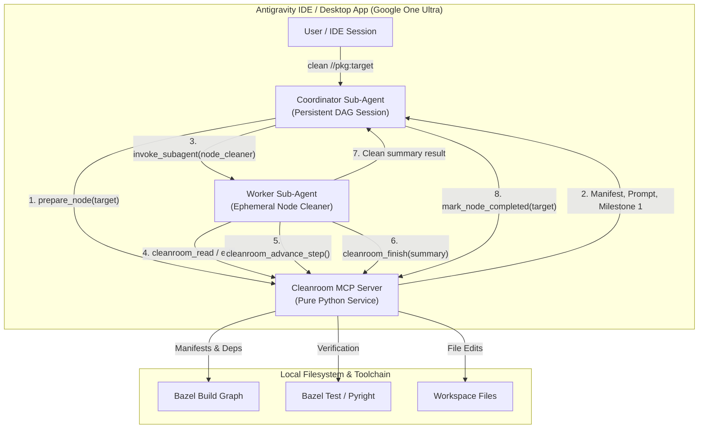
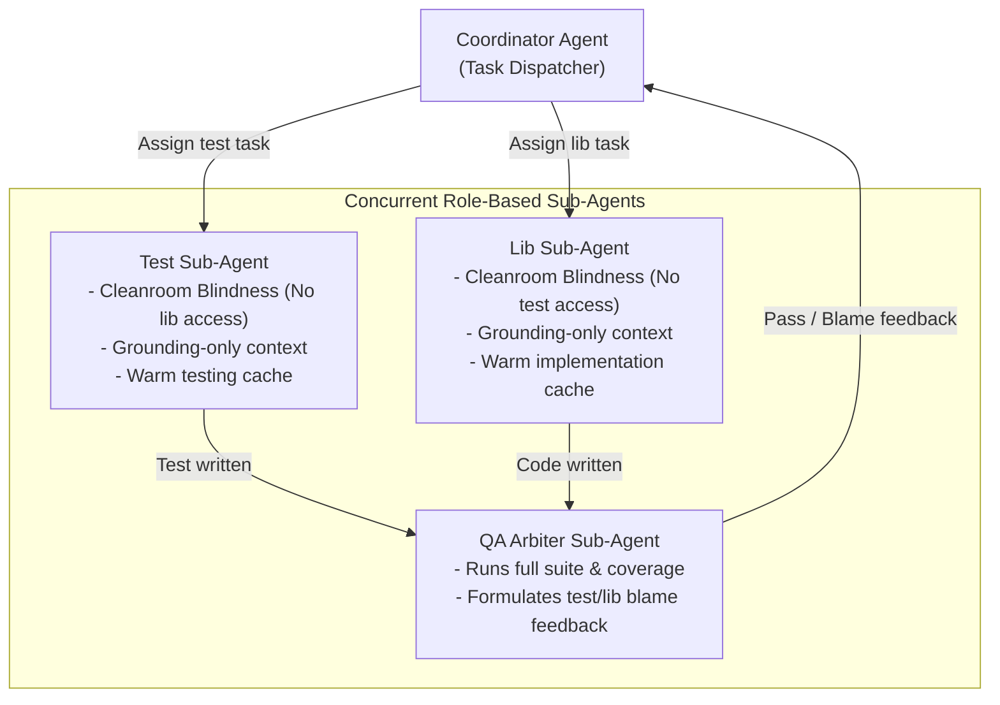
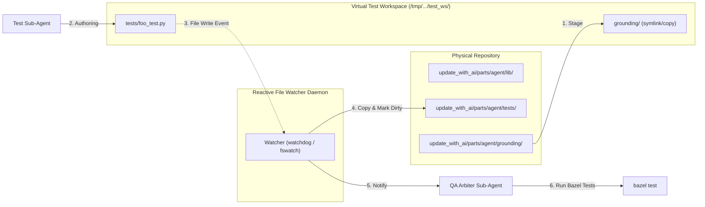
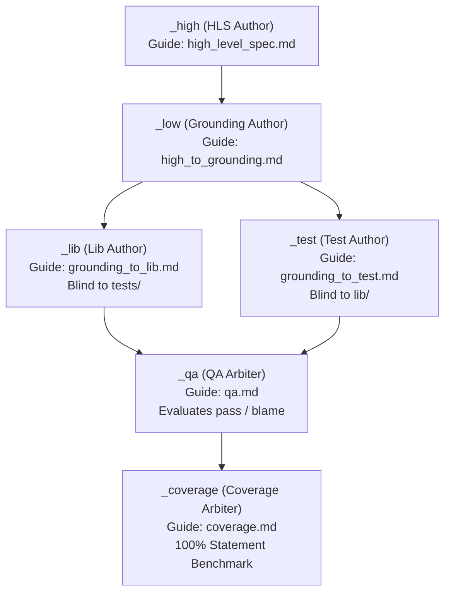
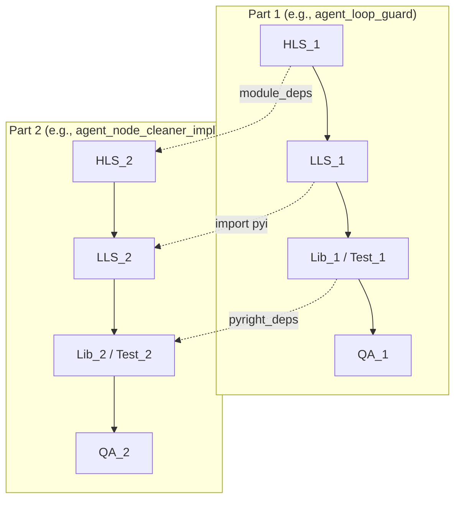
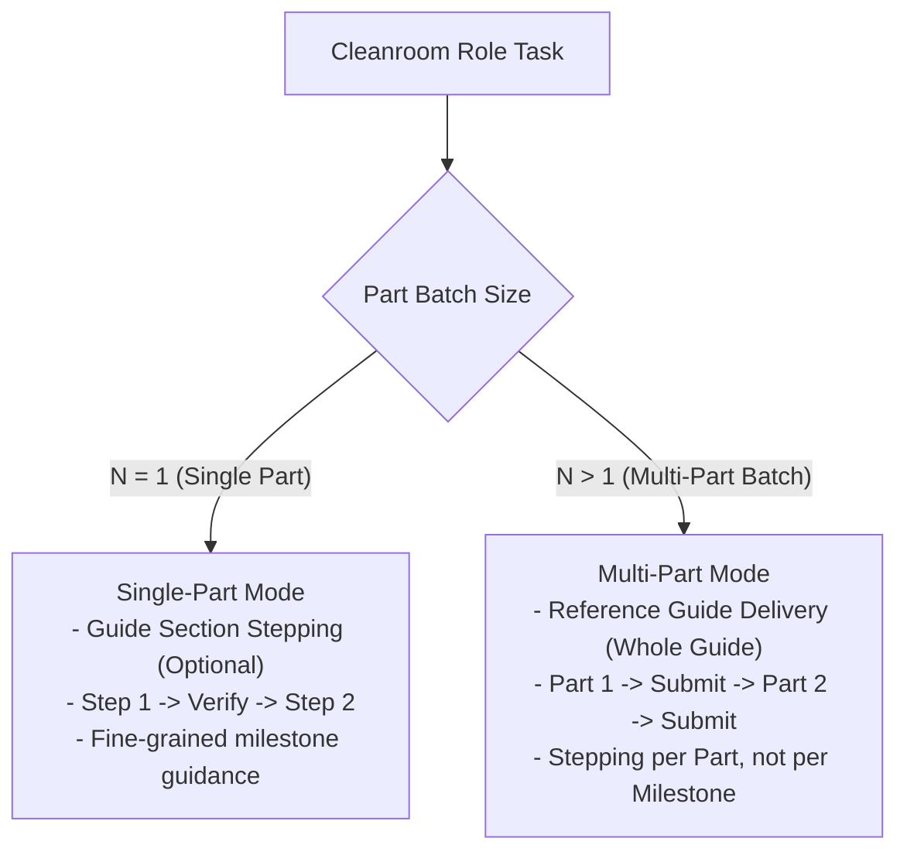

# Antigravity Tiered Sub-Agent Architecture & Integration Design

This document details the architecture, sandbox enforcement, and lifecycle mechanics for integrating Cleanroom with Google Antigravity using a **Tiered Sub-Agent Model** backed by a standalone Python Model Context Protocol (MCP) service.

---

## 1. Problem Statement & Motivation

Cleanroom is a literate, specification-driven system where software is constructed across a directed acyclic graph (DAG) of specification, implementation, and test nodes. In Cleanroom's canonical runtime (`update_with_ai`), each node is processed inside a hermetic Python sandbox with strict file aliasing, deterministic verification gating, stepped guide delivery, and process-level context isolation.

When integrating Cleanroom with Google Antigravity under a personal Google One Ultra subscription, two competing constraints arise:

1. **Quota & Environment Constraints**:
   - Google One Ultra provides interactive agent sessions in the Antigravity IDE and Desktop App without per-token cloud billing.
   - It does *not* provide a headless, raw API execution socket where custom in-process Python drivers can execute infinite unattended loops.
2. **Context Isolation vs. Confinement**:
   - An ambient, single-agent chat session in the IDE maintains continuous context across turns, leaking prompt history and tool outputs between unrelated DAG nodes.
   - An MCP server alone cannot modify the LLM's system prompt, message array, or transcript history.

To reconcile these constraints, this design proposes a **Tiered Sub-Agent Architecture** that decouples high-level DAG scheduling from hermetic node execution.

---

## 2. Tiered Sub-Agent Architecture Overview

The system divides responsibilities between two tiers of autonomous agents and an out-of-process Python MCP service:



### Components

1. **Coordinator Sub-Agent**:
   - Long-lived agent scoped to the overall DAG cleaning session.
   - Equipped with `cleanroom_coordinator_mcp` and Antigravity subagent management tools (`invoke_subagent`, `manage_subagents`).
   - Does *not* edit workspace files directly.
   - Requests the next dirty node in topological order from the MCP service, launches an ephemeral Worker Sub-Agent, receives the worker's completion summary, and marks the node complete.

2. **Worker Sub-Agent (`cleanroom_node_cleaner`)**:
   - Ephemeral subagent instantiated per DAG node.
   - Configured with `enable_write_tools=False` to block native file editing (`write_to_file`, `replace_file_content`) and terminal execution (`run_command`).
   - Equipped exclusively with `cleanroom_node_mcp` tools.
   - Operates in a **100% clean, freshly initialized conversation context**. When it calls `cleanroom_finish` and terminates, its entire intermediate transcript (compiler errors, retry turns, thinking tokens) is closed and discarded.

3. **Cleanroom MCP Server (`cleanroom_mcp_service.py`)**:
   - Standalone Python service running over Stdio or HTTP.
   - Reads Bazel target manifests (`*_manifest.json`), resolves dependency graphs, and tracks in-memory session state.
   - Executes deterministic Cleanroom invariants: file aliasing, diff tracking, stepped guide milestone advancement, and Bazel verification gating.

---

## 3. Sub-Agent Configuration & Sandbox Hardening

To enforce Cleanroom's sandbox rules within Antigravity without native code overrides, the worker subagent type is registered via Antigravity's `define_subagent` interface with restrictive capability flags:

```python
define_subagent(
    name="cleanroom_node_cleaner",
    description="Cleans an individual Cleanroom specification or implementation node.",
    system_prompt="""
You are an autonomous Cleanroom Node Cleaner. You operate strictly within the Cleanroom sandbox.
All file inspection, editing, and verification MUST be performed using the cleanroom_* tools.
You MUST follow stepped guides sequentially using cleanroom_advance_step.
You MUST conclude your task by calling cleanroom_finish with a valid change summary.
Do not attempt to modify files outside the declared node aliases.
""",
    enable_mcp_tools=True,  # Exposes cleanroom_node_mcp
    enable_write_tools=False,  # Hard block: disables native edit/write/bash tools
    enable_subagent_tools=False,  # Prevents runaway recursive subagent spawning
)
```

### Sandbox Hardening Guarantees

* **File Confinement**: Because native write tools are disabled, the subagent cannot write to arbitrary disk paths. All modifications must route through `cleanroom_edit`, which validates changes against the node's declared `src` file.
* **Verification Gating**: The subagent cannot claim completion in chat text alone. It must invoke `cleanroom_finish`. The Python MCP server executes the node's verification target (`*_lint`, `type_check`, or unit tests). If verification fails, the MCP tool returns failure diagnostics and rejects completion.
* **Stepped Milestone Delivery**: The subagent only receives Milestone 1 in its initial prompt. Subsequent milestones are delivered only through `cleanroom_advance_step` after current verification checks pass.

---

## 4. MCP Protocol Specification

The MCP service exposes two distinct tool interfaces:

### A. Coordinator Toolset (`cleanroom_coordinator_mcp`)

| Tool Name | Parameters | Return Schema | Description |
| :--- | :--- | :--- | :--- |
| `get_dag_plan` | `root_target: string` | `List[NodePlan]` | Returns the topological sequence of dirty nodes requiring cleaning. |
| `prepare_node` | `target: string` | `NodeContext` | Locks the node manifest and returns the prompt, file aliases, and Milestone 1. |
| `mark_node_completed` | `target: string, outcome: string` | `Ack` | Records node cleaning status in the DAG storage ledger. |

### B. Node Sandbox Toolset (`cleanroom_node_mcp`)

| Tool Name | Parameters | Return Schema | Description |
| :--- | :--- | :--- | :--- |
| `cleanroom_read` | `alias: string, start_line?: int, end_line?: int` | `FileContent` | Reads files by declared alias (`HLS`, `SRC`, `DEP1`), masking raw paths. |
| `cleanroom_edit` | `alias: string, target_content: string, replacement_content: string` | `EditResult` | Performs exact string chunk replacement on the declared `src` file. |
| `cleanroom_advance_step` | *none* | `MilestoneResponse` | Evaluates verification; returns next guide section if passing, or failure diagnostics if failing. |
| `cleanroom_verify` | *none* | `VerifyResult` | Runs Bazel verification checks for the active node and caches outcomes. |
| `cleanroom_finish` | `change_summary: string` | `FinishOutcome` | Validates change summary, runs final verification, commits edits, and marks node complete. |
| `cleanroom_blame` | `blame_alias: string, diagnostics: string` | `BlameOutcome` | Attributes defect to an upstream dependency node and halts the worker. |

---

## 5. Context Isolation Mechanics

True context isolation is achieved by exploiting Antigravity's lifecycle boundary between parent and child agents:

1. **Zero History Ingestion**: When the Coordinator calls `invoke_subagent`, Antigravity provisions a fresh session ID and an empty transcript for the Worker Sub-Agent. The worker has zero access to previous node transcripts or parent conversational history.
2. **Intermediate Token Evaporation**: During node execution, the worker may generate 10–20 turns containing large file listings, compiler error outputs, and reasoning steps. When `cleanroom_finish` succeeds, the worker returns a concise return payload (e.g. `Node //pkg:node cleaned; 1 file modified`) to the Coordinator. The worker's entire context window is closed, preventing context rot in subsequent nodes.
3. **Coordinator Token Economy**: Because the Coordinator only receives concise milestone completions from each worker, its context grows linearly at only ~50 tokens per node, easily supporting 20+ node pipelines without hitting model context limits.

---

## 6. Quota, Observability, and Efficiency Analysis

### A. Programmatic Quota Visibility
* **Server-Side Black Box**: Antigravity does **not** provide a programmatic API or MCP tool to query remaining Google One Ultra quota (e.g., sliding 5-hour burst window percentage or 7-day capacity limit).
* **Failure Signaling**: Quota limits manifest at runtime as:
  1. UI notifications / throttling toasts in the Antigravity desktop app.
  2. `RESOURCE_EXHAUSTED` (HTTP 429) errors returned when dispatching a turn.
* **Local Transcript Tracking**: The MCP service can read the generated JSONL transcripts in `<appDataDir>/brain/<conversation-id>/.system_generated/logs/transcript.jsonl` to sum token and thought metrics after the fact, but it cannot predict when Google's server-side rate limits will trigger.

### B. Efficiency Comparison: Tiered Sub-Agents vs. Direct Interactive Alignment

| Metric | Direct Interactive Alignment (Current UI) | Tiered Sub-Agent Architecture |
| :--- | :--- | :--- |
| **Model Context** | Hot / Cached across turns in same session | Cold start on every node worker |
| **Turn Overhead** | **Low** (2–4 turns per node with human in the loop) | **High** (8–15 turns: coordinator $\rightarrow$ launch $\rightarrow$ read $\rightarrow$ edit $\rightarrow$ verify $\rightarrow$ finish $\rightarrow$ summarize) |
| **Token Consumption** | Compact (user steers directly, short-circuiting dead ends) | **2.5x – 4x higher** due to subagent cold-start reasoning, role preamble, and summary turns |
| **Quota Risk** | Low (human pauses between tasks, natural pacing) | **High** (bursting 10+ subagents can rapidly exhaust the 5-hour rolling quota) |
| **Failure Recovery** | Instant human redirection | Requires coordinator timeout or retry logic |

### Assessment
The Tiered Sub-Agent architecture is **significantly less token-efficient** than direct interactive pair programming. It should not be used as a blunt replacement for day-to-day interactive refactoring. Instead, it is suited for **targeted autonomous batches** (e.g., cleaning 2 to 4 tightly coupled nodes after an upstream spec change) where hands-free execution outweighs token efficiency.

---

## 7. Implementation Roadmap

1. **Phase 1: Pure Python MCP Server (`//update_with_ai/support/mcp`)**:
   - Implement `cleanroom_mcp_service.py` using FastMCP / Stdio transport.
   - Wrap existing Cleanroom components: `BazelManifestLoader`, `DagStorage`, `GuideDelivery`, and `RunControl`.
2. **Phase 2: Sub-Agent Registration**:
   - Define `cleanroom_node_cleaner` subagent type with write tools disabled.
   - Register `cleanroom_coordinator` subagent type with MCP and subagent tools enabled.
3. **Phase 3: Bazel Entry Target**:
   - Create `bazel run //update_with_ai:serve_mcp` to launch the MCP daemon for the active workspace.

---

## 8. Alternative & Refinement: Role-Based Sub-Agents (Test / Lib / QA Arbiter)

Rather than scoping ephemeral subagents per *node* (which incurs cold-start penalties and turns overhead on every node), an alternative model organizes subagents by **engineering role** across a subsystem or pipeline:



### A. The Three Specialized Roles

1. **Test Sub-Agent**:
   - **Enforces Cleanroom Blindness**: Mechanically denied access to `lib/*.py` files. It can only inspect grounding specifications (`.pyi`), high-level specifications (`.md`), and testing guides.
   - **Single-Turn Guide Delivery**: Receives the entire testing guide and node task directly without step-by-step advance friction, authoring test suites strictly from declarative requirements.
   - **Persistent Cache Warmth**: Because it stays alive across multiple test nodes, testing conventions, assertion patterns, and framework stubs remain warm in context.

2. **Lib Sub-Agent**:
   - **Independent Implementation**: Denied access to `tests/*_test.py`. Implements library code strictly against the `.pyi` contract.
   - **Implementation Cache Warmth**: Retains framework decorators (`@singleton_type`, `@poly_type`), project coding style, and sibling imports across related nodes.

3. **QA Arbiter Sub-Agent**:
   - Executes the complete test suite (`bazel test`) and coverage analysis (`evaluate_coverage.py`).
   - Acts as the impartial referee: if tests fail, it analyzes failure diagnostics to determine whether the test author misunderstood the specification or the library author introduced a defect, routing structured blame feedback accordingly.

### B. Prompt Caching & Concurrency Dynamics

* **Prefix Prompt Caching**: Modern frontier models (including Gemini) cache static prompt prefixes ($\ge 1024$ tokens). By keeping role subagents alive, their large static preambles (role instructions, framework stubs, domain guides) achieve high cache-hit ratios, reducing time-to-first-token (TTFT) and token consumption.
* **Parallel Execution**: Because the Test Sub-Agent and Lib Sub-Agent both depend only on the `.pyi` grounding specification, the Coordinator can invoke them **concurrently in parallel**, cutting wall-clock authoring latency in half.
* **Subsystem Lifecycles**: To prevent context rot from indefinite accumulation, role subagents are scoped to a **subsystem part** (e.g., `parts/agent`, `parts/sandbox`). They are initialized warm for that subsystem and recycled when moving to the next domain.

---

## 9. Sub-Agent Identification in Hooks (`hooks.json`)

To implement **Approach 1** (dynamic argument-level tool filtering via `PreToolUse`), the guard script must determine *which* sub-agent is issuing a `view_file` or `replace_file_content` call.

### A. The Hook Payload Metadata
Antigravity's `PreToolUse` hook delivers system metadata on `stdin` for every tool invocation:

```json
{
  "conversationId": "4f9d2a1b-7c3e-48a0-9e2d-6b5f8c1a9e3d",
  "workspacePaths": ["/Users/seanmcdirmid/projects/cleanroom"],
  "transcriptPath": ".../brain/4f9d2a1b-7c3e-48a0-9e2d-6b5f8c1a9e3d/.../transcript.jsonl",
  "toolCall": {
    "name": "view_file",
    "args": {
      "AbsolutePath": "/Users/seanmcdirmid/projects/cleanroom/update_with_ai/parts/agent/lib/agent_node_cleaner_impl.py"
    }
  },
  "stepIdx": 14
}
```

Two fields provide unambiguous sub-agent identification:
1. **`conversationId`**: Every sub-agent is assigned a unique, immutable conversation UUID that persists for its entire lifecycle.
2. **`workspacePaths`**: When a sub-agent is launched with a specialized or branched workspace, its active root directory is passed directly.

### B. Sub-Agent Session Registry Pattern
Because `hooks.json` is a workspace-global hook, role-specific policies are enforced by maintaining a lightweight registry file (e.g., `.cleanroom/active_subagents.json` or in-memory SQLite):

1. **Registration on Launch**:
   When the Coordinator sub-agent launches a worker (e.g. via `invoke_subagent`), it records the subagent ID and its assigned role:
   ```json
   {
     "4f9d2a1b-7c3e-48a0-9e2d-6b5f8c1a9e3d": {
       "role": "test_author",
       "denied_patterns": ["/lib/", "_impl.py"],
       "allowed_write_patterns": ["/tests/", "_test.py"]
     }
   }
   ```
2. **Policy Evaluation in the Hook Script**:
   The Python hook script (`support/cleanroom_tool_guard.py`):
   - Reads `conversationId` from the input payload.
   - Looks up the subagent record in `active_subagents.json`.
   - If the conversation ID belongs to `test_author` and `args.AbsolutePath` matches `/lib/`:
     ```json
     {
       "decision": "deny",
       "reason": "Cleanroom Blindness Violation: Test sub-agents are strictly barred from reading implementation files."
     }
     ```
   - If the conversation ID belongs to the main user or coordinator, the hook defaults to `{"decision": "allow"}`.
3. **De-registration on Stop**:
   When the sub-agent terminates, the coordinator removes the conversation ID from the registry.

---

## 10. Virtual Workspaces, File Discovery, and Reactive Sync Watchers

### A. How Antigravity Discovers Workspace Files
Antigravity agents do not possess an omniscient or pre-indexed internal list of files. File discovery occurs dynamically via three mechanisms:

1. **System Prompt Seeding**: At session startup, Antigravity injects the active workspace roots from `workspacePaths` into the environment block.
2. **Tool-Driven Discovery**: When exploring files, the model explicitly invokes:
   - `list_dir(DirectoryPath)`: Lists children, directories, and file sizes.
   - `find_by_name(SearchDirectory, Pattern)`: Runs `fd` across the specified root.
   - `grep_search(SearchPath, Query)`: Runs `ripgrep` across paths.
3. **Physical Confinement**: All three tools are bounded by directory arguments. If an agent is assigned a virtual workspace root at `/tmp/cleanroom_sandbox/test/`, queries to `find_by_name` or `list_dir` physically cannot traverse into directories that do not exist within that tree.

### B. The Virtual Workspace Architecture (Approach 2)
Rather than relying on argument filtering or negative prompts, Approach 2 achieves **physical blindness**:



#### Step-by-Step Staging and Synchronization:
1. **Materialization**:
   The coordinator creates `/tmp/cleanroom_workspaces/<session_id>/test/`. It copies or hard-links `grounding/*.pyi` and `high/*.md`. It places an empty or starter `tests/foo_test.py`.
   `lib/` is completely omitted.
2. **Execution**:
   The Test Sub-Agent is launched with `Workspace: "/tmp/cleanroom_workspaces/<session_id>/test/"`. Native tools (`view_file`, `find_by_name`, `replace_file_content`) operate with zero friction.
3. **Reactive Watcher Sync**:
   A lightweight background watcher daemon (`watchdog` / `fsevents`) monitors the virtual workspace:
   - Upon any write event on `tests/foo_test.py`, the watcher mirrors the modified file back to the canonical repository path (`update_with_ai/parts/agent/tests/foo_test.py`).
   - The watcher flags the test node as dirty in DAG storage.
4. **Concurrent QA Evaluation**:
   If the QA Arbiter is running concurrently, it detects the dirty signal, pulls the newly mirrored test, and runs `bazel test //update_with_ai/parts/agent/tests:agent_node_cleaner_impl_test`.

### C. Eliminating File-Alias Confusion
In Cleanroom's legacy sandbox, files are referred to by abstract identifiers (`HLS`, `SRC`, `DEP1`). LLMs are pre-trained on millions of real code repositories with standard relative file paths (`tests/foo_test.py`, `grounding/foo.pyi`). 

By using Virtual Workspaces with real paths, the agent experiences **zero cognitive overhead**:
* Paths look completely standard to the model.
* Native IDE completions, syntax lenses, and lint feedback function without translation.
* Confinement is enforced by the filesystem hierarchy rather than artificial token mappings.

---

## 11. Comparison of Sandbox Confinement Strategies

| Strategy | Blindness Guarantee | Native Tool Affinity | Implementation Complexity | Sub-Agent Overhead |
| :--- | :--- | :--- | :--- | :--- |
| **Approach 1: `hooks.json` Guard** | **Strong (Programmatic)**: Intercepts `view_file` at runtime via `conversationId` registry. | **100% Native**: Uses standard `view_file` and `replace_file_content`. | Moderate (Python script + registry JSON). | Zero workspace copying; operates in-place. |
| **Approach 2: Virtual Workspace + Watcher** | **Absolute (Physical)**: `lib/` does not exist on disk in the sub-agent's root. | **100% Native**: Real paths, full IDE indexing, no model confusion. | Moderate (Staging directory setup + file watcher). | Requires symlinking/copying and background sync daemon. |
| **Approach 3: Shadow MCP Tools** | **Strong (Custom RPC)**: Tools only accept permitted operations. | **Low / Degraded**: Model must learn custom tool schemas; risk of syntax hallucinations. | High (Full MCP tool server implementation). | High cognitive drag on the model. |

### Architectural Recommendation
* **Primary Recommendation**: **Approach 2 (Virtual Workspace with Reactive Watcher)** provides the strongest isolation guarantee, complete physical blindness, and full native tool performance without risk of model leakage.
* **Secondary / In-Place Alternative**: **Approach 1 (`hooks.json` PreToolUse)** is ideal when avoiding filesystem staging is preferred, using `conversationId` mapping to enforce role-specific read/write gates in-place.

---

## 12. Workspace-Scoped Hooks & Restricting Verification to MCP

A critical architectural necessity in the Virtual Workspace model is cleanly separating **File I/O** (which happens inside the flat virtual workspace) from **Verification Execution** (which must run in the host Bazel workspace).

### A. Scoping Hooks to the Virtual Workspace
Antigravity discovers customizations by walking upward from the agent's CWD to the workspace root. By placing a `.agents/hooks.json` directly inside the virtual workspace:
`/tmp/cleanroom_workspaces/<session_id>/test/.agents/hooks.json`

The hook configuration is **automatically scoped** to that specific sub-agent session.

#### Does the Python Guard Script Have to Live in the Virtual Workspace?
**No.** In `hooks.json`, the `"command"` field accepts absolute paths:

```json
{
  "deny-shell-and-leakage": {
    "PreToolUse": [
      {
        "matcher": "run_command",
        "hooks": [
          {
            "command": "echo '{\"decision\": \"deny\", \"reason\": \"Shell command execution is disabled in Cleanroom sandboxes. You must run tests exclusively using the cleanroom_verify MCP tool.\"}'"
          }
        ]
      },
      {
        "matcher": "view_file|replace_file_content",
        "hooks": [
          {
            "command": "python3 /Users/seanmcdirmid/projects/cleanroom/support/cleanroom_path_guard.py"
          }
        ]
      }
    ]
  }
}
```
* The virtual workspace remains pristine, containing only the staged files (`grounding/`, `high/`, `tests/`).
* The hook script lives in the canonical host repository.
* No `conversationId` multiplexing is required, because this hook configuration only exists within the Test Sub-Agent's workspace.

### B. Why Verification Must Route Through MCP (Not Local Shell)
If a sub-agent were permitted to invoke shell commands (`run_command`), it would attempt to run tests locally inside its virtual workspace:
`run_command("pytest tests/foo_test.py")` or `run_command("bazel test ...")`

This fails immediately:
1. **Missing Environment**: The flat virtual staging directory does not contain `MODULE.bazel`, dependencies, `pyrightconfig.json`, or the host virtual environment.
2. **Loss of Hermeticity**: Bypassing Bazel breaks Cleanroom's deterministic test flags (`--test_output=errors --test_timeout=100 --noshow_progress`).
3. **Circular Feedback Blindness**: The sub-agent could accidentally run tests against uncommitted or dirty host states without coordination.

### C. The Dual-Channel Confinement Pattern
The final architecture establishes a clean, dual-channel boundary:

| Channel | Mechanism | Target Domain | Confinement Enforcement |
| :--- | :--- | :--- | :--- |
| **File Reading & Writing** | **Native Tools** (`view_file`, `replace_file_content`) | Flat Virtual Workspace (`/tmp/.../test_ws/`) | **Physical Confinement**: `lib/` physically does not exist in the staging directory. Model uses familiar native tools without cognitive alias translation. |
| **Verification & Testing** | **Cleanroom MCP** (`cleanroom_verify`) | Canonical Host Monorepo (`/Users/.../cleanroom/`) | **Hook Confinement**: `run_command` is hard-denied via `PreToolUse`. All verification calls route through MCP, which syncs the staged test and triggers hermetic Bazel runs. |

When the sub-agent attempts to run tests via bash, the hook intercepts the call and instructs the model:
`"Shell command execution is disabled. You must run tests exclusively using the cleanroom_verify MCP tool."`
The agent immediately pivots to invoking `cleanroom_verify`, maintaining 100% compliance with Cleanroom build standards.

---

## 13. Formalizing Role vs. Part in Cleanroom & Bazel

To enable Antigravity to run role-based sub-agents over multiple components simultaneously, Cleanroom's macro architecture must formally decouple the concept of an **Engineering Role** from a software **Part** (component).

### A. Core Ontological Definitions

1. **Part (Component)**:
   - A distinct functional module in the codebase (e.g., `agent_node_cleaner_impl`, `sandbox_guide_delivery_impl`).
   - Defined by its artifacts: High-Level Spec (`high/*.md`), Grounding Spec (`grounding/*.pyi`), Implementation (`lib/*.py`), Test Suite (`tests/*_test.py`), and verification metadata.
   - Relates to other parts via dependency edges (`module_deps`).

2. **Role (Engineering Discipline)**:
   - An independent actor in Cleanroom's verification methodology.
   - Defined by:
     - **Guidance**: The authoritative guide document (e.g. `grounding_to_test.md`).
     - **Context Boundaries**: Mechanical blindness rules (e.g. Test Author denied access to `lib/`).
     - **Tool Capabilities**: Allowed native tools and required MCP verification tools.
     - **Verification Invariant**: Gating criteria required to mark the task complete.

### B. The Canonical Role DAG

Every part in Cleanroom is processed through an invariant virtual DAG of roles:



* **Parallelism**: `_lib` and `_test` run concurrently and in mutual blindness.
* **Refinement**: `_qa` arbitrates failures, formulating feedback targeted specifically to `_lib` or `_test`.

### C. Shifting from `1:1` to `1:N`: The Multi-Part Role Execution Model

* **Current Model**: `Node = Role × Part (1:1)`
  Each Bazel node in `update_python_with_ai.bzl` represents exactly one role applied to one part (e.g., `:agent_node_cleaner_impl_test`).
* **Antigravity Multi-Part Model**: `Task = Role × List[Part] (1:N)`
  A single persistent role sub-agent processes an entire batch of parts (e.g., all 10 components in `update_with_ai/parts/agent/`) under a single warm context.

### D. Prompt Stratification: Node-Specific vs. Multi-Part Role Prompts

To support both execution paradigms, prompts must be stratified into two layers:

1. **Static Role Preamble (Cache-Friendly)**:
   - Establishes the agent's persona, methodology, guide rules, and blindness constraints.
   - Identical across all tasks for that role, achieving near-100% prefix prompt cache hits.
   - Example (Test Role):
     ```markdown
     You are the Cleanroom Test Author for update_with_ai/parts/agent.
     You author unit test suites strictly from .pyi grounding specifications per grounding_to_test.md.
     You are blinded to library implementations in lib/.
     ```

2. **Dynamic Task Payload**:
   - **Single-Part Mode (Current CLI / Local Runner)**:
     ```markdown
     Target Part: agent_node_cleaner_impl
     Grounding Spec: grounding/agent_node_cleaner_impl.pyi
     Output File: tests/agent_node_cleaner_impl_test.py
     Verify Target: //update_with_ai/parts/agent/tests:agent_node_cleaner_impl_test
     ```
   - **Multi-Part Mode (Antigravity Role Sub-Agent)**:
     ```markdown
     Target Package: update_with_ai/parts/agent
     Parts in Topological Order:
       1. agent_loop_guard_impl
       2. agent_node_cleaner_impl
     Instructions: For each part in sequence, inspect grounding/*.pyi, author tests/*_test.py, and verify via cleanroom_verify.
     ```

### E. Required Starlark & Bazel Refactoring (Pre-requisite Roadmap)

This work is generic Cleanroom infrastructure that can be implemented and validated in Bazel today before connecting to Antigravity:

1. **Formalize Role Definitions in Starlark**:
   Define declarative role structs in `update_python_with_ai.bzl` (`HLS_ROLE`, `LLS_ROLE`, `LIB_ROLE`, `TEST_ROLE`, `QA_ROLE`, `COVERAGE_ROLE`).
2. **Package-Level Role Targets**:
   In addition to generating individual `:name_test` and `:name_lib` nodes, the macro generates package-level role aggregation targets:
   - `//update_with_ai/parts/agent:tests_clean` (Runs test role across all parts in `agent`)
   - `//update_with_ai/parts/agent:lib_clean` (Runs lib role across all parts in `agent`)
   - `//update_with_ai/parts/agent:qa_clean` (Runs QA arbiter across all parts in `agent`)
3. **Role Manifests**:
   Generate `_role_manifest.json` bundling the list of part manifests, shared guides, and blindness rules for consumption by both Cleanroom's Python runner and Antigravity's MCP server.

---

## 14. The 2D Product DAG: Reconciling Part DAGs and Role DAGs

Cleanroom’s complete build graph is formally the **Tensor / Cartesian Product of two distinct DAGs**:
$$D_{\text{nodes}} = D_{\text{parts}} \times D_{\text{roles}}$$

Where:
* **$D_{\text{parts}}$ (Domain Architecture DAG)**: Directed dependencies between functional software modules (e.g., `agent_node_cleaner_impl` depends on `agent_loop_guard`, `agent_conversation`, and `agent_driver`).
* **$D_{\text{roles}}$ (Verification Methodology DAG)**: Directed pipeline of engineering roles (`_high` $\rightarrow$ `_low` $\rightarrow$ `[_lib, _test]` $\rightarrow$ `_qa` $\rightarrow$ `_coverage`).



### A. Two Strategies for Traversing the 2D Grid

#### 1. Diagonal / Part-First Traversal (Legacy Cleanroom CLI)
- Finishes all roles for Part 1, then moves to Part 2.
- **Flaw**: Trashes the model's attention window by continuously alternating personas (`high` $\rightarrow$ `low` $\rightarrow$ `lib` $\rightarrow$ `test` $\rightarrow$ `qa`) on every single node, causing massive cache misses and cold-start reasoning churn.

#### 2. Columnar / Role-First Traversal (Antigravity Role Sub-Agents)
- Executes across parts by **Role Column**:
  * **Stage 1 (HLS)**: Align all `high/*.md` files in the package.
  * **Stage 2 (Grounding)**: Align all `grounding/*.pyi` files in the package.
  * **Stage 3 (Concurrent Lib & Test)**:
    - **Test Sub-Agent**: Authors all `tests/*_test.py` across the package in parallel.
    - **Lib Sub-Agent**: Authors all `lib/*.py` across the package in parallel.
  * **Stage 4 (QA Arbiter)**: Runs full test suite and coverage across all parts simultaneously.

### B. Why Role-First Traversal Naturally Enforces Part Dependencies

When an agent operates in **Columnar / Role-First mode**, the orchestrator does not need to micromanage individual part transitions because **the Part DAG is already hard-encoded into the source artifacts**:

1. **Explicit Spec Declarations**:
   - In HLS: `imports: agent_loop_guard, agent_driver`
   - In Grounding: `from . import agent_loop_guard`
   - In Bazel: `deps = ["//update_with_ai/parts/agent:agent_loop_guard"]`
2. **Deterministic Compiler Gating**:
   - If a Lib Author attempts to import a sibling component that is present in the workspace but *not* a declared dependency of that specific part:
     - The Pyright type checker and Cleanroom `lib_lint.py` immediately flag a compile/lint failure: `Import of undeclared dependency 'foo' not in target deps`.
   - The sub-agent receives the exact diagnostic via `cleanroom_verify` and corrects itself without the orchestrator needing to hold its hand.

### C. Benefits of Columnar Execution

1. **Harmonized Subsystem Ontologies**: Authoring all grounding `.pyi` specs for a subsystem together prevents symbol drift and interface mismatches between sibling components.
2. **Zero Role Context Thrashing**: The Test Agent only ever writes tests; the Lib Agent only ever writes implementations.
3. **Maximum Model Concurrency**: The entire Test column and entire Lib column execute concurrently in parallel across two sub-agents, cutting authoring time in half while preserving mutual blindness.

---

### D. The Two-Dimensional Dependency Invariant

Formally, for any part $X$ and role $Y$, node $(X, Y)$ is gated by two orthogonal dependency invariants:

$$\text{Predecessors}((X, Y)) = \underbrace{\{(A, Y) \mid A \in \text{deps}_{\text{parts}}(X)\}}_{\text{Part-Level Invariant}} \;\cup\; \underbrace{\{(X, W) \mid W \in \text{deps}_{\text{roles}}(Y)\}}_{\text{Role-Level Invariant}}$$

1. **Part-Level Dependency Invariant**:
   $$\forall A \in \text{deps}_{\text{parts}}(X), \quad (A, Y) \prec (X, Y)$$
   *Rule*: The upstream part dependencies $A$ of $X$ must complete role $Y$ before $X$ can complete role $Y$.
   *Example*: Before `agent_node_cleaner_impl` can finish its **Grounding** (`.pyi`), its prerequisite `agent_loop_guard` must have already finished its **Grounding** (`.pyi`), because the former imports symbols from the latter.

2. **Role-Level Dependency Invariant**:
   $$\forall W \in \text{deps}_{\text{roles}}(Y), \quad (X, W) \prec (X, Y)$$
   *Rule*: Part $X$ must complete all upstream role prerequisites $W$ of $Y$ before $X$ can complete role $Y$.
   *Example*: Before `agent_node_cleaner_impl` can finish its **Grounding** (`.pyi`), `agent_node_cleaner_impl` must have already completed its **High-Level Spec** (`.md`).

### E. How Columnar Execution Satisfies Both Invariants

Columnar (Role-First) traversal satisfies this 2D dependency invariant with mathematical perfection:

1. **Role Invariant is Globally Satisfied**:
   Because column $W$ (e.g. HLS) is completed in its entirety before column $Y$ (e.g. LLS) begins, **every single part has already satisfied its role prerequisites**.
2. **Part Invariant is Satisfied via In-Column Topological Sorting**:
   Within the active role column $Y$, the sub-agent does not process parts arbitrarily; it processes them in **topological order of the Part DAG**:
   - Leaf parts (with no unresolved dependencies) are processed first.
   - Downstream consumers are processed only after their imported dependencies are complete.
3. **Result**: The role sub-agent retains **100% prompt cache warmth** and persona focus throughout its entire run, while satisfying all structural build dependencies across both axes.

---

## 15. Asynchronous Feedback Loops & Inter-Agent Messaging

While the initial authoring of specifications and code follows topological ordering across columns, Cleanroom's real-world execution is **fundamentally non-sequential and reactive**:
* **Lib and Test roles run concurrently**.
* **QA Arbiter executes reactively** as soon as any part's `(lib, test)` pair is materialized.
* **Test failures generate asynchronous feedback**, requiring sub-agents to interrupt or interleave fixes with subsequent authoring tasks.


### A. Sub-Agent Communication: The Native Antigravity Message Bus
Antigravity provides a built-in inter-agent messaging bus. Sub-agents do **not** need complex polling, file-drop signaling, or busy-waiting loops:

1. **Direct Point-to-Point Messaging (`send_message`)**:
   - Any agent can message another agent using its conversation UUID:
     `send_message(Recipient=lib_subagent_id, Message="Verification failure in lib_1.py: ...")`
2. **Reactive Wakeup (Zero Polling)**:
   - When a role sub-agent completes its immediate authoring pass, it simply stops calling tools and enters the `waiting_for_message` / `idle` lifecycle state.
   - When a message arrives from the QA Arbiter, Antigravity **automatically wakes the sub-agent up**, delivering the feedback payload into its context at the start of the next turn.
3. **Turn-Boundary Queueing During Active Execution**:
   - If the Lib Sub-Agent is actively writing `lib_2.py` when feedback arrives regarding `lib_1.py`, Antigravity safely queues the message.
   - At the completion of its active tool turn, the agent receives the feedback, applies a localized diff to `lib_1.py` using `replace_file_content`, replies to the QA Arbiter, and smoothly resumes `lib_2.py`.

### B. Triangulated Communication Topology (Preventing Agent Ping-Pong)
A known failure mode in multi-agent systems is circular argument loops, where the Test Agent blames the Lib Agent, and the Lib Agent blames the Test Agent.

Cleanroom prevents this by enforcing a **Triangulated Communication Topology**:
* **The Test Agent and Lib Agent NEVER communicate directly**. They remain mutually blind.
* **The QA Arbiter is the Sole Referee**:
  - The QA Arbiter evaluates failures against the **`.pyi` grounding specification as absolute ground truth**.
  - If the test asserts an expectation not justified by `.pyi` requirements: **Blame Test Sub-Agent**.
  - If the implementation fails to realize a `.pyi` requirement: **Blame Lib Sub-Agent**.
  - If the `.pyi` specification itself is contradictory or underspecified: **Escalate to Coordinator / Spec Author**.

### C. Quota Protection: Bounding Feedback Iterations
Every feedback loop consumes model turns under your Google One Ultra 5-hour quota. To prevent runaway diagnostic spiral:
1. **Feedback Iteration Ceiling**: A maximum of **2 feedback iterations** is permitted per part.
2. **Escalation on Repeated Failure**: If a part fails verification on the second retry:
   - The QA Arbiter halts the sub-agents for that part.
   - The node is marked `DIRTY` in Cleanroom DAG storage.
   - The Coordinator alerts the human user in the primary IDE chat with compiler diagnostics, preserving quota and allowing manual steering.

---

## 16. Asset Submission Protocol (`submit`) & QA Reaction Loop

To decouple continuous authoring from verification gating in multi-part role agents, the system introduces an **Asset-Level Submission Protocol**:

### A. The Verification & Submission Contract
Instead of a single monolithic `finish` tool, role sub-agents operate with two fine-grained primitives:

1. **`run_checks(target_node)`**:
   - Runs the local verification target for a specific part (e.g. `agent_node_cleaner_impl_lib_type_check` or spec linter).
   - The verification engine tracks the verification status of each asset in memory alongside file revision hashes:
     `status[target_node] = "PASS" | "FAIL"`
2. **`submit(target_node, change_message)`**:
   - Gated by `run_checks`: If `run_checks` has not passed for `target_node` since its last file modification, `submit` **fails closed** and returns:
     `"Cannot submit asset: run_checks has not passed for target_node. Please run checks and fix diagnostics first."`
   - If passing, `submit` records the asset as ready and automatically emits a notification message to the **QA Arbiter Sub-Agent**.

### B. Message Delivery Timing: Turn Boundaries vs. Interruption
Sub-agents are **never interrupted midway through an active tool execution** or text generation:
* **While Actively Working**: Messages sent via `send_message` are buffered by Antigravity in the recipient's incoming queue. The agent completes its active file edit or check undisturbed.
* **At Turn Boundaries**: The buffered message is delivered into the agent's context at the start of its next turn.
* **While Idle**: If the agent has stopped calling tools (waiting for work), Antigravity **reactively wakes it up immediately**.

This ensures that files are never left in a half-written, corrupt state due to incoming feedback interrupts.

---

## 17. Multi-Model Portability: DeepSeek V4.1 Flash & Local Testing

Because this Role-First, Multi-Part architecture is implemented as generic Cleanroom infrastructure, it is not coupled to Antigravity:

### A. Testing on DeepSeek V4.1 Flash & Local Models First
Before deploying multi-part role pipelines to Antigravity (where mistakes consume Google One Ultra quota), the architecture can be staged, tested, and benchmarked on:
* **DeepSeek V4.1 Flash**: Fast, frontier-class code generation with extensive reasoning capabilities and low token costs.
* **Local Models (`localhost:8000`)**: Local quantization models (e.g. `qwen-moe-q4`, `coder-next`) via Cleanroom's existing `model_config.bzl`.

### B. Validation Objectives on Local / Flash Models
1. **Verify Role Manifest Schemas**: Validate that Starlark correctly emits `_role_manifest.json` for multi-part batches.
2. **Benchmark Batching Efficiency**: Measure whether authoring 3–5 parts in one session preserves cache warmth and reduces overall token consumption compared to 1:1 node runs.
3. **Validate Blame Attribution**: Confirm that the QA Arbiter reliably attributes test vs. lib blame without human intervention.

---

## 18. Single-Part vs. Multi-Part Duality & Stepped Guide Mode

The architecture unifies single-part and multi-part executions under a single mathematical model, with one key behavioral distinction: **Guide Section Stepping**.



### A. $N = 1$ is a Special Case of $1:N$
A single-part run is simply a batch of size 1. All role preambles, `run_checks`, and `submit` protocols apply identically.

### B. Guide Section Stepping Duality
* **In Multi-Part Mode ($N > 1$)**:
  - Stepping through micro-sections of a guide across multiple parts simultaneously causes cognitive fragmentation.
  - The guide is delivered as a **whole reference specification** (e.g., the complete `grounding_to_lib.md` rules).
  - Stepping occurs **per part** (author Part 1 $\rightarrow$ `run_checks` $\rightarrow$ `submit` $\rightarrow$ author Part 2...).
* **In Single-Part Mode ($N = 1$)**:
  - Fine-grained **Guide Section Stepping** (`sandbox_guide_delivery_impl.md`) remains an active option via `allows_step_mode = True`.
  - For complex, difficult refactorings or initial implementations, the agent can be guided milestone-by-milestone through the task with gated verification checkpoints.

### C. Dynamic Escalation: Fallback to Dedicated Step-Mode Sub-Agent
If a specific part struggles or fails repeated verification during multi-part batch execution (even with a frontier model):
* The Coordinator can dynamically carve out the problematic part from the batch.
* It spawns a dedicated single-part sub-agent assigned exclusively to that part in **Stepped Guide Mode** (`allows_step_mode = True`).
* This slows the agent down, forcing incremental, milestone-by-milestone verification checkpoints and concentrated reasoning on the difficult logic until tests pass, after which the part is re-integrated into the main pipeline.


