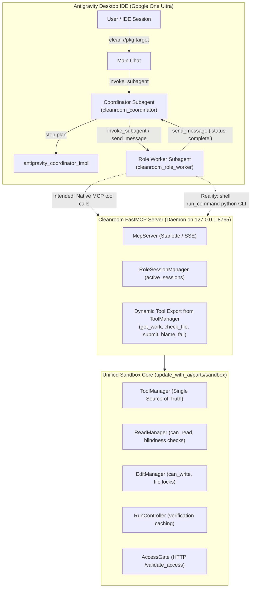

# Archived Design & Post-Mortem: Antigravity Subagents & MCP Server (Option 2)

> [!CAUTION]
> **Status: Failed & Turned Down (Historical Architecture)**
> This document archives the design, implementation, and post-mortem evaluation of **Option 2: Antigravity Tiered Sub-Agents and FastMCP Server**.
> 
> The codebase components implementing this architecture (`update_with_ai/parts/antigravity`, `update_with_ai/parts/mcp`, systems MCP runners, lifecycle hooks, and subagent boilerplate) have been decommissioned and removed.
> 
> **Superseded By**: Autonomous subagent workflows have been redesigned and superseded by [Subagent-Driven Cleanroom Workspaces](file:///Users/seanmcdirmid/projects/cleanroom/design-docs/subagent_driven_cleanroom_workspaces_todo.md), which drives Option 3's pre-confined workspaces via a zero-execution coordinator across Antigravity, DeepSeek Harness, and Goose.
> 
> Current active cleaning paradigms are documented in [Cleanroom Cleaning Paradigms](file:///Users/seanmcdirmid/projects/cleanroom/design-docs/cleaning_paradigms.md):
> - **Option 1 (Production Headless)**: Headless loop driving the OpenAI API (`update_with_ai/parts/loop`, `update_with_ai/parts/openai`).
> - **Option 3 (Production Interactive Antigravity)**: Subagentless Cleanroom Workspaces with separate conversational chats in isolated sibling directories (`design-docs/subagentless_cleanroom_workspaces.md`).
> - **Option 4 (Autonomous Multi-Harness Workspaces)**: Subagent-Driven Cleanroom Workspaces (`design-docs/subagent_driven_cleanroom_workspaces_todo.md`).

---

## 1. Executive Summary & Original Motivation

Cleanroom enforces mathematical, double-blind isolation across specification, implementation, test, and verification roles. When adapting Cleanroom to Google Antigravity under personal Google One Ultra subscriptions, two competing constraints drove the design:
1. **Subscription Model**: Google One Ultra provides interactive agent sessions in the Antigravity desktop IDE without per-token cloud API billing, but lacks a headless API execution socket for unattended in-process loops.
2. **Context Isolation**: Ambient, single-agent chats accumulate conversational history across turns, leaking prompt history and tool outputs between blinded engineering roles (e.g., test authors peeking at library code).

To reconcile these constraints, an ambitious **Tiered Sub-Agent Architecture** backed by a **FastMCP Server** was designed to execute Cleanroom workflows autonomously inside Antigravity.

---

## 2. The Original Architectural Design

### 2.1 Three-Tier Hierarchy
The system was designed across three tiers:
1. **Tier 1 (Main Chat / Supervisor)**: Received user commands (`/cleanroom clean <target>`), spawned the Coordinator subagent, and displayed high-level progress.
2. **Tier 2 (Cleanroom Coordinator Subagent)**: A zero-agency host bridge that ran `antigravity_coordinator_impl.py step "<target>"`, received deterministic execution plans from Python, and invoked or killed role workers.
3. **Tier 3 (Ephemeral Role Workers)**: Scoped subagents (`cleanroom_role_worker`) assigned to a specific role batch (`lib`, `test`, `qa`, etc.). Workers inspected grounding specs (`.pyi`), edited files, verified code, and submitted changes.



### 2.2 Intended FastMCP Protocol & Dynamic Tool Export
The server dynamically introspected domain tools registered in `ToolManager` (`tool_provider.ToolManager`) and exported them to FastMCP:
- **`register_role_agent(role, unit_root)`**: Created a session scope in `RoleSessionManager` tied to the subagent's `conversationId`.
- **`get_work()`**: Delivered task prompts with deterministic companion paths.
- **`check_file(path)`**: Executed hermetic Bazel verification commands.
- **`submit(target, change_summary)`**: Validated that verification passed and locked completed targets.
- **`blame(target, blame_target, explanation)`**: Routed defects to upstream dependencies.
- **`deregister_role_agent()`**: Closed session scopes and released memory singletons.

### 2.3 Confinement via Antigravity Lifecycle Hooks (`cleanroom_sandbox_hook.py`)
To prevent role workers from reading blinded files (e.g. Test author reading `lib/`), native file tools (`view_file`, `replace_file_content`, `write_to_file`) were intercepted on `PreToolUse`:
1. The hook checked if an ephemeral sentinel file (`.mcp.active`) existed at the repository root.
2. If `.mcp.active` was present and the caller's `conversationId` belonged to an active Cleanroom subagent, the hook issued an HTTP `POST /validate_access` to the FastMCP daemon.
3. The server activated the conversation's `agent_session` scope, queried `ReadManager.can_read` or `EditManager.can_write`, and returned `allow` or `deny`.
4. If the server crashed, the hook checked `os.kill(pid, 0)` and failed closed (`deny`), preventing subagents from running unconstrained across the repository.

---

## 3. Why It Failed: Implementation Reality & Post-Mortem

### 3.1 Failure Mode 1: The MCP Server Became a Python Exec Gateway
The primary technical assumption was that Antigravity subagents could dynamically discover and invoke native FastMCP tools directly through the model's function-calling interface.

In practice:
- Dynamic tool registration across subagent sessions was brittle, and subagents frequently failed to discover or call MCP tools reliably.
- To make the system function, the worker prompt was altered to instruct subagents to invoke terminal commands via `run_command` in a zsh shell:
  ```bash
  python3 -m update_with_ai.parts.antigravity.lib.antigravity_mcp_client_impl --session <session_id> register --role "<role>" --unit "<unit>"
  python3 -m update_with_ai.parts.antigravity.lib.antigravity_mcp_client_impl --session <session_id> get-work
  python3 -m update_with_ai.parts.antigravity.lib.antigravity_mcp_client_impl --session <session_id> check-files
  python3 -m update_with_ai.parts.antigravity.lib.antigravity_mcp_client_impl --session <session_id> submit --target <path> --change-summary "<summary>"
  ```
- **The Divergence**: Rather than being an intelligent MCP tool harness, the FastMCP server was reduced to a local HTTP service receiving requests spawned by shell subprocesses. The agent was using shell execution—the exact tool Cleanroom wanted to restrict—to communicate with an external daemon.

### 3.2 Failure Mode 2: Prohibitive Token Economics (The Subagent Tax)
Under Google One Ultra subscriptions, autonomous subagents proved economically unviable:
1. **The Subagent Instantiation Tax**:
   Every `invoke_subagent` call initialized a fresh context window. Antigravity injected massive preambles: system instructions, AGENTS.md rules, and tool descriptions. Spawning separate workers across a multi-role wave (`high` $\to$ `low` $\to$ `lib` $\to$ `test` $\to$ `qa` $\to$ `coverage`) burned tens of thousands of tokens per worker before any code editing began.
2. **Context Bloat from Sequential Shell Commands**:
   Because workers executed multi-step shell commands (`register` $\to$ `get-work` $\to$ `check-files` $\to$ `submit`), each turn accumulated previous shell outputs, Bazel test reports, and logs. Worker transcripts swelled to 60k–100k+ tokens within a few turns.
3. **Turn Multiplication & Reactive Wake Overhead**:
   The Coordinator subagent spent turns parsing worker wakeup messages, stepping the Python engine, and spawning subsequent workers. A simple 3-node change generated dozens of multi-agent turns.
4. **Quota Exhaustion**:
   Google One Ultra enforces a sliding 5-hour rolling burst limit. A single multi-node cleaning pass routinely burned through the entire 5-hour quota in under 30–45 minutes, disabling the IDE.

### 3.3 Failure Mode 3: The Fragility of Single-Directory In-Tree Confinement
Attempting to enforce double-blind isolation among multiple concurrent roles operating inside a **single working repository** introduced severe accidental complexity:
- **Hook Latency & Fragility**: Every file operation had to hit `cleanroom_sandbox_hook.py`, which parsed JSON from `stdin`, checked `.mcp.active`, and queried the server via HTTP. If the daemon crashed or lagged, IDE interactions froze or failed closed.
- **Sentinel Desynchronization**: `.mcp.active` required meticulous lifecycle management. Stale sentinels from aborted runs blocked subsequent developer edits, requiring manual cleanup.
- **IPC Race Conditions**: Managing asynchronous asyncio tasks against Cleanroom's synchronous thread-local `LifecycleScope` required complex scope activation gymnastics (`scope.activate()`).

---

## 4. Architectural Lessons Learned & Strategic Pivot

### 4.1 The Core Insight
> **Multi-role Cleanroom isolation cannot be enforced reliably through runtime software hooks inside a single shared directory. It must be enforced physically through the filesystem.**

Attempting to run a Test Engineer and a Lib Engineer in the same folder while pretending they cannot see each other's files requires constant policing (hook filters, process tables, artificial tool layers).

### 4.2 The Solution: Subagentless Cleanroom Workspaces (Option 3)
Instead of running subagents in a single folder with software guards, Cleanroom developed **Option 3**:
1. **Sibling Workspaces (`../role_workspaces/<workspace-name>_<role>/`)**:
   - `../role_workspaces/<workspace-name>_lib` physically contains only library files and specs. `tests/` does not exist.
   - `../role_workspaces/<workspace-name>_test` physically contains only test files and specs. Real `lib/*.py` files do not exist; they are replaced with read-only, non-implementing interface stubs derived from `.pyi` specs (`raise NotImplementedError`).
2. **Kernel-Level Immutability**:
   - All specifications and configs are set to `chmod 444`. The OS kernel rejects unauthorized writes.
3. **Conversational Chat Economics**:
   - Instead of autonomous subagent trees, the developer opens an interactive conversation chat in each role workspace.
   - Turns benefit from high KV prompt caching, standard subscription quotas, zero subagent overhead, and direct user oversight.
4. **Zero-Sync In-Band Coordination (`bin/cleanroom`)**:
   - Changes and state are tracked via in-band comment headers (`LAST_CLEANED`, `LAST_CHANGED`, `FEEDBACK:`), with direct Bazel submissions and self-synchronizing `bin/get_work` managed via `bin/cleanroom`.

### 4.3 Future Subagent Roadmap (Implemented & Superseded)
The future subagent roadmap articulated here has now been formally specified and adopted in [Subagent-Driven Cleanroom Workspaces](file:///Users/seanmcdirmid/projects/cleanroom/design-docs/subagent_driven_cleanroom_workspaces_todo.md):
- **We do NOT resurrect Option 2's in-tree FastMCP server or shell-exec Python wrappers.**
- **We dispatch subagents into Option 3's pre-confined sibling workspaces.**
- Subagents execute within `../role_workspaces/<workspace-name>_<role>_<dir>/`, where directory-level physical separation and `chmod 444` provide mathematical blindness naturally, without hooks, sentinels, or background daemons.
- Coordination is provided by a **Zero-Execution Coordinator** that never edits code or runs tests, supported across **Antigravity**, **DeepSeek Harness (`dsh`)**, and **Goose** with low-cost **DeepSeek-V4 Flash** economics.

---

## 5. Decommissioned Artifacts Ledger

The following components comprised Option 2 and have been removed from the repository:

| Component Path | Former Purpose | Reason for Removal |
| :--- | :--- | :--- |
| `update_with_ai/parts/antigravity/` | Coordinator and MCP client implementations (`antigravity_coordinator_impl.py`, `antigravity_mcp_client_impl.py`, telemetry, and tests) | Option 2 decommissioned; high token cost; replaced by `bin/cleanroom`. |
| `update_with_ai/parts/mcp/` | FastMCP server, access gate, role session manager, and cache arbiter | Option 2 decommissioned; daemon and dynamic MCP tool export abandoned. |
| `update_with_ai/parts/systems/lib/cleanroom_mcp_runner_impl.py` | Standalone FastMCP server daemon entrypoint | Option 2 daemon decommissioned. |
| `update_with_ai/parts/systems/lib/bazel_mcp_system_asm.py` | System assembly binding MCP and Bazel | Option 2 assembly decommissioned. |
| `update_with_ai/support/lib/cleanroom_mcp_client.py` | CLI wrapper calling FastMCP server | Obsolete client; subagent shell exec harness removed. |
| `update_with_ai/support/lib/cleanroom_sandbox_hook.py` | Antigravity PreToolUse hook script | In-tree hook interceptors removed in favor of OS workspace isolation. |
| `update_with_ai/support/lib/cleanroom_coordinator_engine.py` | Subagent coordinator turn planner | Obsolete subagent scheduler; superseded by `cleanroom_workspace_tool.py`. |
| `update_with_ai/support/lib/antigravity_token_stats.py` | Token stats parser from brain transcripts | Obsolete telemetry tool for Option 2. |
| `update_with_ai/support/lib/antigravity_run_monitor.py` | Out-of-band event timeline generator | Obsolete run monitor for Option 2. |
| `update_with_ai/support/lib/coordinator_config.py` | Coordinator configuration singleton | Obsolete configuration for Option 2. |
| `update_with_ai/agent_docs/` | Coordinator and role worker markdown instructions | Obsolete subagent prompt documentation. |
| `.agents/agents/cleanroom_coordinator/` | Subagent manifest for coordinator | Subagent registration removed. |
| `.agents/agents/cleanroom_role_worker/` | Subagent manifest for role worker | Subagent registration removed. |
| `.agents/hooks.json` | Hook configuration registering `cleanroom_sandbox_hook.py` | Hook interceptors removed. |
| `design-docs/antigravity_integration.md` | Original tiered subagent architecture design doc | Archived into this post-mortem document. |
| `design-docs/bazel_role_mcp_server.md` | Original FastMCP server design doc | Archived into this post-mortem document. |
