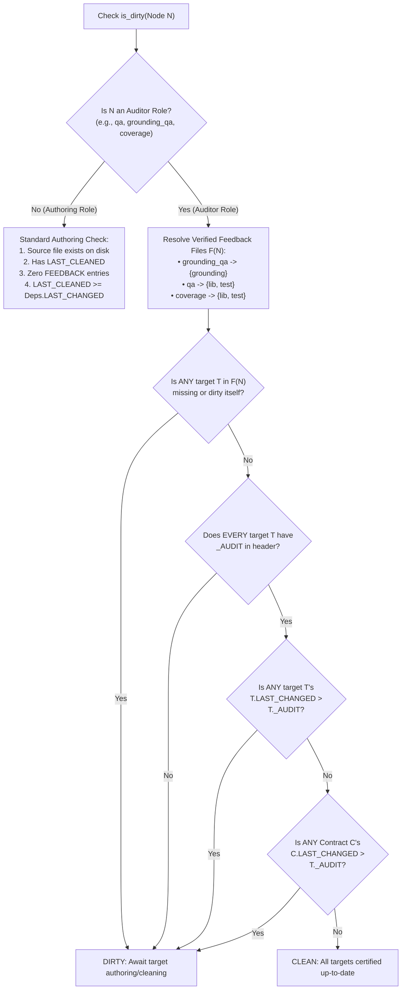

# Auditor Roles & Verification Dirtiness Architecture: Flat Audit Tags & Zero Dummy Logs

## 1. Executive Summary & Problem Statement

Cleanroom coordinates software specification, implementation, and verification as a directed acyclic graph (DAG) of autonomous roles. Historically, Cleanroom's DAG execution engine operated under a foundational assumption: **every role in the graph produces and owns a concrete file artifact on disk matching `src_pattern`**.

This assumption works cleanly for **Authoring Roles** (`high`, `planning`, `low`, `grounding`, `lib`, `test`), where the primary goal of the role is synthesizing or modifying a tangible code or specification file. However, it fails for **Auditor Roles** (`grounding_qa`, `qa`, `coverage`), whose purpose is not authoring files, but performing double-blind contract audits, running dynamic test suites, evaluating statement coverage, and attributing blame when defects arise.

### 1.1 The Legacy Approach: Ephemeral Dummy Files in `logs/`

To force auditor roles into the uniform artifact-producing DAG engine, Cleanroom introduced dummy log files under package `logs/` subdirectories:
- `grounding_qa`: `{unit_dir}/logs/{unit_name}_grounding_qa.log`
- `qa`: `{unit_dir}/logs/{unit_name}_qa.log`
- `coverage`: `{unit_dir}/logs/{unit_name}_coverage.log`

Under this convention:
1. When an audit passed, the auditor was required to **empty the log file to 0 bytes** ("delete all lines, remove any headers").
2. The role verification script asserted that the log file was empty using shell predicates:
   `if [ -s {unit_dir}/logs/{unit_name}_qa.log ]; then echo 'QA log is not empty: delete all lines (0 bytes, remove any headers).'; exit 1; fi`
3. If an audit found defects, the arbiter recorded diagnostic critique into the log file or called `blame`, leaving the log populated so verification would fail until the defect was addressed.

```
THE FLAWED DUMMY LOG ARCHITECTURE
┌────────────────────────────────────────────────────────────────────────────────────────┐
│  parts/agent/                                                                          │
│  ├── grounding/agent_config.py     (Authoring artifact)                                │
│  ├── lib/agent_config.py           (Authoring artifact)                                │
│  ├── tests/agent_config_test.py    (Authoring artifact)                                │
│  └── logs/                         ◄── ARTIFICIAL ARTIFACT SUBDIRECTORY                │
│      ├── agent_config_grounding_qa.log  (Empty 0-byte dummy file)                      │
│      ├── agent_config_qa.log            (Empty 0-byte dummy file)                      │
│      └── agent_config_coverage.log      (Empty 0-byte dummy file)                      │
└────────────────────────────────────────────────────────────────────────────────────────┘
  • Empty files (0 bytes) cannot store in-band metadata (LAST_CLEANED / LAST_CHANGED).
  • Stamping metadata makes files > 0 bytes, failing `[ -s log ]` verification.
  • Deleting metadata makes `is_dirty(node)` evaluate to True forever.
  • Spurious `logs/` directories pollute source trees and require special-cased sync hacks.
```

### 1.2 The Core Breakages

1. **The 0-Byte Inversion Paradox**:
   With the rollout of **In-Band Source Metadata** ([`in_band_source_metadata.md`](file:///Users/seanmcdirmid/projects/cleanroom/design-docs/in_band_source_metadata.md)), every tracked file requires an in-band header block (`LAST_CLEANED`, `LAST_CHANGED`, `CHANGE:`).
   - Stamping metadata into `logs/<name>_qa.log` gives the file a size $> 0$ bytes.
   - The verification script fails immediately: `QA log is not empty: delete all lines (0 bytes, remove any headers).`
   - If the agent empties the log to 0 bytes, `src_metadata.extract_metadata` finds no header. `bazel_storage_impl.is_dirty()` evaluates as **permanently dirty** (`meta is None or not meta.last_cleaned`).
2. **The Metadata Clearance Trap**:
   When told to "clear modification metadata when you have no more work to do", clearing the metadata deletes the timestamp evidence proving that the audit was executed *after* the upstream contracts or code files changed. On the next DAG pass, the cleaner observes missing timestamps and dispatches the auditor in an infinite re-cleaning loop.
3. **Ontological Distortion**:
   Authoring is an *Entity Generation* process ($X \to \text{File}$), whereas auditing is a *Relational Verification Predicate* over existing entities:
   $$\text{Audit}: (\text{Spec}, \text{Implementation}, \text{Tests}) \longrightarrow \{\text{PASS}, \text{BLAME}(\text{Culprit}, \text{Critique})\}$$
   Auditors produce **attestations of compliance** or **attributions of blame**, never new source files.

---

## 2. The New Architecture: Flat Audit Tags on Verified Target Files

Cleanroom eliminates dummy log files and the `logs/` directory entirely. Instead, audit passes are recorded directly inside the in-band metadata headers of the **feedback files being verified** using flat, single-line tags:

$$\texttt{<ROLE\_NAME\_IN\_CAPS>\_AUDIT: <UTC timestamp>}$$

### 2.1 Concrete Tag Conventions

| Auditor Role | Verified Target Files | Pipeline Gate | Audit Metadata Tag | Example Header Line |
| :--- | :--- | :--- | :--- | :--- |
| **`spec_qa`** | `planning/<unit>.md` | Gate 1 | `SPEC_QA_AUDIT` | `SPEC_QA_AUDIT: 2026-10-06T20:15:00Z` |
| **`low_qa`** | `low/<unit>.pyi` | Gate 2 | `LOW_QA_AUDIT` | `LOW_QA_AUDIT: 2026-10-06T20:16:00Z` |
| **`qa`** | `lib/<unit>.py`, `tests/<unit>_test.py` | Gate 3 | `QA_AUDIT` | `QA_AUDIT: 2026-10-06T20:18:00Z` |
| **`coverage`** | `lib/<unit>.py`, `tests/<unit>_test.py` | Gate 3 | `COVERAGE_AUDIT` | `COVERAGE_AUDIT: 2026-10-06T20:20:00Z` |

```
THE CLEAN ZERO-LOG IN-BAND AUDIT ARCHITECTURE
┌────────────────────────────────────────────────────────────────────────────────────────┐
│  parts/agent/                                                                          │
│  ├── planning/agent_config.md      ◄── SPEC_QA_AUDIT: 2026-10-06T20:15:00Z             │
│  ├── low/agent_config.pyi          ◄── LOW_QA_AUDIT: 2026-10-06T20:16:00Z              │
│  ├── lib/agent_config.py           ◄── QA_AUDIT: 2026-10-06T20:18:00Z                  │
│  │                                 ◄── COVERAGE_AUDIT: 2026-10-06T20:20:00Z            │
│  └── tests/agent_config_test.py    ◄── QA_AUDIT: 2026-10-06T20:18:00Z                  │
│                                    ◄── COVERAGE_AUDIT: 2026-10-06T20:20:00Z            │
└────────────────────────────────────────────────────────────────────────────────────────┘
  • Zero dummy log files on disk; package logs/ directories are permanently eliminated.
  • Audit tags are flat key-values, trivial to parse with simple line regex.
  • Stamped on all verified feedback files (both lib and test for qa/coverage).
  • Audit timestamps are updated ONLY when the audit phase PASSES.
  • In role workspaces, arbiters execute checks via bin/check_files and submit via bin/submit.
```

### 2.2 Why Flat Single Tags Beat Nested Lists

Earlier exploratory proposals considered a nested list under an `AUDITED:` section:
```yaml
# AVOID: COMPLEX NESTED STRUCTURE
AUDITED:
- [2026-10-03T20:18:00Z by qa]: PASS
```
Flat tags are vastly superior for production toolchains:
1. **Tooling Simplicity**: Parsed with a single regex matching `^([A-Z0-9_]+_AUDIT):\s*(\S+)`.
2. **Grammar Uniformity**: Exactly mirrors `LAST_CLEANED:` and `LAST_CHANGED:`.
3. **Atomic Key-Value Access**: The storage and dirty checking engine queries `meta.audits.get("QA_AUDIT")` in $O(1)$ time without parsing Markdown bullets or bracketed tuples.
4. **Git Conflict Reduction**: Separate lines for each audit role prevent merge conflict collisions when multiple arbiters certify files concurrently.

### 2.3 The Three Invariants of Audit Tags

1. **Pass-Only Stamp Invariant**:
   > **A role's audit timestamp (`<ROLE>_AUDIT`) is updated if and only if the audit phase passes 100% of its checks.**
   
   If an audit discovers any failure or contract breach, `<ROLE>_AUDIT` is **never updated**. The arbiter delivers defect critique via `FEEDBACK:` on the blamed file.

2. **The Non-Bump Invariant (No Downstream False Dirtiness)**:
   > **When an auditor certifies a file and updates its `<ROLE>_AUDIT` tag, `LAST_CHANGED` MUST NOT be modified.**

   Stamping an audit certifies that the *existing* code at timestamp `LAST_CHANGED` complies with contracts. Bumping `LAST_CHANGED` would signal that the code was modified, triggering unwarranted downstream cleaning cascades.

3. **Author Invalidation Invariant**:
   > **Whenever an authoring role updates a file and bumps `LAST_CHANGED`, all `<ROLE>_AUDIT` tags on that file are invalidated (removed or superseded).**

   If an engineer modifies `lib/agent_config.py`, its previous `QA_AUDIT` and `COVERAGE_AUDIT` timestamps become strictly older than its new `LAST_CHANGED`, immediately dirtying the `qa` and `coverage` auditors.

---

## 3. Concrete File Header Examples

### 3.1 Grounding Feasibility Specification (`grounding/agent_config.py`)

Certified by the Grounding QA Arbiter:

```python
# --- CLEANROOM METADATA ---
# LAST_CLEANED: 2026-10-03T20:10:00Z
# LAST_CHANGED: 2026-10-03T20:10:00Z
# CHANGE: Grounding feasibility proof for AgentSessionConfig resolution.
# GROUNDING_QA_AUDIT: 2026-10-03T20:15:00Z
# --- END CLEANROOM METADATA ---

from typing import Optional
from update_with_ai.parts.agent.low import agent_config

def ground_agent_config() -> None:
    cfg: agent_config.AgentConfig
    raise NotImplementedError
```

### 3.2 Library Implementation (`lib/agent_config.py`)

Certified by both `qa` and `coverage`:

```python
# --- CLEANROOM METADATA ---
# LAST_CLEANED: 2026-10-03T20:12:00Z
# LAST_CHANGED: 2026-10-03T20:12:00Z
# CHANGE: Implement environment variable fallback hierarchy.
# QA_AUDIT: 2026-10-03T20:18:00Z
# COVERAGE_AUDIT: 2026-10-03T20:20:00Z
# --- END CLEANROOM METADATA ---

from dataclasses import dataclass

@dataclass(frozen=True)
class AgentConfig:
    model_name: str
    temperature: float = 0.7
```

### 3.3 Test Suite (`tests/agent_config_test.py`)

Certified symmetrically alongside the library implementation:

```python
# --- CLEANROOM METADATA ---
# LAST_CLEANED: 2026-10-03T20:14:00Z
# LAST_CHANGED: 2026-10-03T20:14:00Z
# CHANGE: Unit tests for AgentConfig temperature bounds.
# QA_AUDIT: 2026-10-03T20:18:00Z
# COVERAGE_AUDIT: 2026-10-03T20:20:00Z
# --- END CLEANROOM METADATA ---

import unittest
from parts.agent.lib.agent_config import AgentConfig

class AgentConfigTest(unittest.TestCase):
    # Requirement: temperature parameter must accept float values between 0.0 and 2.0
    def test_temperature_bounds(self) -> None:
        cfg = AgentConfig(model_name="gemini-1.5-pro", temperature=1.5)
        self.assertEqual(cfg.temperature, 1.5)
```

### 3.4 Target with Defect Blame (`lib/agent_config.py`)

When `qa` fails, `QA_AUDIT` is **not** updated; instead, blame is injected into `FEEDBACK:`:

```python
# --- CLEANROOM METADATA ---
# LAST_CLEANED: 2026-10-03T20:12:00Z
# LAST_CHANGED: 2026-10-03T20:12:00Z
# CHANGE: Implement environment variable fallback hierarchy.
# COVERAGE_AUDIT: 2026-10-03T20:10:00Z
# FEEDBACK:
# - [2026-10-03T20:18:00Z from qa]: AgentConfig raises ValueError for float values >= 1.0; violates low/agent_config.pyi contract allowing bounds [0.0, 2.0].
# --- END CLEANROOM METADATA ---
```

---

## 4. The Formal `is_dirty` Algorithm for Audit Roles

The core dirty checking engine in [`bazel_storage_impl.py`](file:///Users/seanmcdirmid/projects/cleanroom/update_with_ai/parts/bazel/lib/bazel_storage_impl.py#L131) branches based on role type:
1. **Authoring Roles**: Check target source file existence, valid `LAST_CLEANED`, unacted feedback, and forward dependency timestamps ($N.\text{last\_cleaned} \ge D.\text{last\_changed}$).
2. **Auditor Roles**: Do **NOT** look for their own source file! Instead, they evaluate the verification status of their **audited feedback targets**.



### 4.1 Mathematical Formulation of Auditor Dirtiness

Let $A$ be an auditor role (with tag $T_{\text{tag}} = \text{UPPER}(A) + \text{"\_AUDIT"}$).
Let $\mathcal{F}(A)$ be the set of feedback target nodes verified by $A$:
- $\mathcal{F}(\text{grounding\_qa}) = \{\text{grounding}\}$
- $\mathcal{F}(\text{qa}) = \{\text{lib}, \text{test}\}$
- $\mathcal{F}(\text{coverage}) = \{\text{lib}, \text{test}\}$

Let $\mathcal{C}(A)$ be the set of contract specification dependencies that govern the audit (e.g. `low` for `grounding_qa`; `low` and `grounding` for `qa` and `coverage`).

$$\begin{aligned}
\text{is\_dirty}(A) \iff & \left(\exists F \in \mathcal{F}(A) \mid \text{src\_missing}(F) \lor \text{is\_dirty}(F)\right) \\
& \lor \left(\exists F \in \mathcal{F}(A) \mid F.T_{\text{tag}} \text{ is missing}\right) \\
& \lor \left(\exists F \in \mathcal{F}(A) \mid F.T_{\text{tag}} < F.\text{last\_changed}\right) \\
& \lor \left(\exists F \in \mathcal{F}(A), \exists C \in \mathcal{C}(A) \mid F.T_{\text{tag}} < C.\text{last\_changed}\right)
\end{aligned}$$

### 4.2 Symmetrical Evaluation for Dual Targets (`qa`, `coverage`)

For dual-target roles like `qa` and `coverage`, the auditor verifies **both** `lib` and `test`:
1. **If either file changed**: If an engineer modifies `lib/agent_config.py`, its `LAST_CHANGED` becomes $T_2$. Even if `tests/agent_config_test.py` was not touched, `lib.QA_AUDIT < lib.LAST_CHANGED` evaluates to **True**. The `qa` auditor immediately triggers as dirty!
2. **If test changed**: If an engineer modifies `tests/agent_config_test.py`, `test.QA_AUDIT < test.LAST_CHANGED` triggers, dirtying `qa` and `coverage`.
3. **If contract changed**: If `low/agent_config.pyi` is updated with a new postcondition, `C.LAST_CHANGED > lib.QA_AUDIT` triggers, forcing re-verification of the suite against the new contract.

Zero reverse dependencies are stored on disk. Dirty detection is purely forward-evaluating, dynamic, and mathematically airtight.

### 4.3 Concrete Implementation in `bazel_storage_impl.py`

```python
AUDITOR_ROLE_TAGS = {
    "grounding_qa": "GROUNDING_QA_AUDIT",
    "qa": "QA_AUDIT",
    "coverage": "COVERAGE_AUDIT",
}

def is_auditor_role(role_name: str) -> bool:
    return role_name in AUDITOR_ROLE_TAGS

class AgentStorage:
    ...
    def is_dirty(self, node: dag_storage.DagNode) -> bool:
        role_name = node.role_address.split(":")[-1]
        
        # --- AUDITOR ROLE EVALUATION ---
        if is_auditor_role(role_name):
            audit_tag = AUDITOR_ROLE_TAGS[role_name]
            feedback_deps = self.get_feedback_dependencies(node)
            if not feedback_deps:
                return False
            
            contract_deps = [d for d in self.get_dependencies(node) if not d.is_silent]
            
            for fb_dep in feedback_deps:
                fb_src = self._resolve_source_path(fb_dep.node)
                if fb_src is None or not fb_src.is_file():
                    return True
                
                # If target itself is dirty, auditor must run (or wait for target clean)
                if self.is_dirty(fb_dep.node):
                    return True
                
                meta = src_metadata.extract_metadata(fb_src)
                if meta is None or not meta.last_changed:
                    return True
                
                audit_ts = meta.audits.get(audit_tag)
                if not audit_ts:
                    return True # Never audited
                
                # Target modified after audit
                if audit_ts < meta.last_changed:
                    return True
                
                # Upstream contract modified after audit
                for c_dep in contract_deps:
                    c_src = self._resolve_source_path(c_dep.node)
                    if c_src is not None and c_src.is_file():
                        c_meta = src_metadata.extract_metadata(c_src)
                        if c_meta and c_meta.last_changed and audit_ts < c_meta.last_changed:
                            return True
            return False

        # --- AUTHORING ROLE EVALUATION (Existing Logic) ---
        src_path = self._resolve_source_path(node)
        if src_path is None or not src_path.is_file():
            return True
        meta = src_metadata.extract_metadata(src_path)
        if meta is None or not meta.last_cleaned:
            return True
        if meta.feedback:
            return True
        for dep in self.get_dependencies(node):
            if not dep.is_silent:
                dep_src = self._resolve_source_path(dep.node)
                if dep_src is None or not dep_src.is_file():
                    return True
                dep_meta = src_metadata.extract_metadata(dep_src)
                if dep_meta is None or not dep_meta.last_changed:
                    return True
                if meta.last_cleaned < dep_meta.last_changed:
                    return True
        return False
```

---

## 5. Bazel Role Declarations: Removing Dummy Log Patterns

In [`update_python_with_ai/BUILD.bazel`](file:///Users/seanmcdirmid/projects/cleanroom/update_python_with_ai/BUILD.bazel), the auditor roles are redefined to remove `src_pattern` pointing to `logs/` and remove shell predicates inspecting log size.

### 5.1 Updated `BUILD.bazel` Definitions

```python
define_role(
    name = "grounding_qa",
    persona = "Grounding QA Arbiter",
    src_pattern = "",  # Auditor roles have no primary output artifact file
    guide = "//update_python_with_ai/guides:grounding_qa",
    allows_step_mode = False,
    star_role_deps = [":low", ":grounding"],
    feedback_role_deps = [":grounding"],
    workspace_files = PYTHON_WORKSPACE_FILES,
    tools = [],
    active_component_types = ["implementation", "assembly", "interface"],
    verify_template = "cd $BUILD_WORKSPACE_DIRECTORY && python3 update_python_with_ai/support/lib/grounding_lint.py {unit_dir}/grounding/{unit_name}.py && bazel test //{unit_dir}/grounding:{unit_name}_type_check --test_output=errors --test_timeout=100 --noshow_progress --noshow_loading_progress 2>&1",
    verification_success_message = "Grounding specification verified for {unit_name}.",
    visibility = ["//visibility:public"],
)

define_role(
    name = "qa",
    persona = "QA Arbiter",
    src_pattern = "",
    guide = "//update_python_with_ai/guides:qa",
    allows_step_mode = False,
    star_role_deps = [":low", ":grounding"],
    feedback_role_deps = [":lib", ":test"],
    workspace_files = PYTHON_WORKSPACE_FILES,
    tools = [],
    active_component_types = ["implementation"],
    verify_template = "cd $BUILD_WORKSPACE_DIRECTORY && bazel test //{unit_dir}/tests:{unit_name}_test --test_output=errors --test_timeout=100 --noshow_progress --noshow_loading_progress 2>&1",
    verification_success_message = "Test {unit_name}_test.py passed.",
    visibility = ["//visibility:public"],
)

define_role(
    name = "coverage",
    persona = "Coverage Arbiter",
    src_pattern = "",
    guide = "//update_python_with_ai/guides:coverage",
    allows_step_mode = False,
    silent_role_deps = [":qa"],
    star_role_deps = [":low", ":grounding"],
    feedback_role_deps = [":lib", ":test"],
    workspace_files = PYTHON_WORKSPACE_FILES,
    tools = [
        "update_with_ai/support/lib/evaluate_coverage.py",
    ],
    active_component_types = ["implementation"],
    verify_template = "cd $BUILD_WORKSPACE_DIRECTORY && bazel test //{unit_dir}/tests:{unit_name}_test --test_output=errors --test_timeout=100 --noshow_progress --noshow_loading_progress 2>&1 && python3 update_with_ai/support/lib/evaluate_coverage.py --impl {unit_dir}/lib/{unit_name}.py --test {unit_dir}/tests/{unit_name}_test.py --threshold 100.0",
    verification_success_message = "All lines of {unit_name}.py are covered by {unit_name}_test.py.",
    visibility = ["//visibility:public"],
)
```

#### Key Improvements:
1. `src_pattern = ""` explicitly signifies that the auditor is an edge gate, not an artifact producer.
2. `template = ...` is eliminated. No template txt files are materialized.
3. The shell check `if [ -s ... ]; then exit 1; fi` is gone. The verification command succeeds or fails based on real linters and test execution return codes.

---

## 5.2 Tool Interactions & Target Disambiguation (`submit`, `fail`, `blame`, `get_work`)

Because auditor nodes have no primary source files (`src_pattern = ""`), they require streamlined target identification that prevents cognitive load and build leakage:

### 1. Target Identification Rules
- **Unique Unit Name**: When `unit_name` is unique among the units in the current session batch, the target is referenced simply as `<unit_name>` (e.g. `unit_foo`).
- **Relative Path Disambiguation**: When `unit_name` is ambiguous across the batch (e.g. two widgets in different packages), the target is referenced as `<relative_path>/<unit_name>` (e.g. `pkg_a/widget` vs `pkg_b/widget`).
- **Source File Alias**: For nodes with declared source files, the relative file path alias continues to be accepted.
- **Target Omission**: When only one unit is being processed in the session, the `target` parameter in `submit` and `fail` may be omitted entirely.
- **No Fully Qualified Build Addresses**: Fully qualified Bazel addresses (e.g. `//pkg:unit_qa`, `//pkg:unit`) are internal build addresses never communicated to the agent and are rejected by resolve tools.

### 2. Streamlined Blame Attribution
- Because active nodes never share feedback targets, the `blame` tool determines the attributing active node directly from `blame_target` (e.g. blaming `lib/widget.py` attributes blame from the active `widget` QA or coverage auditor). The agent only specifies `blame_target` and the single-paragraph `explanation`.

### 3. Dynamic Prompt Guidance via `get_work`
- When `get_work` assigns a batch, `format_task_prompt` inspects unit name uniqueness across the batch:
  - Formats alignment mappings using `unit_name` (if unique) or `relative_path/unit_name` (if ambiguous).
  - Appends actionable instructions:
    - Multi-node sessions: *"When submitting or failing completed units, specify target as `<unit_name>` (if unique among session units) or `<relative_path>/<unit_name>` (if ambiguous)."*
    - Single-node sessions: *"When calling submit or fail for a single unit, the target parameter may be omitted."*

### 4. Dirty & Clean Mechanics for Auditor Targets
- **Marking Dirty (`_dirty`)**: When an auditor node is marked dirty, tooling removes the auditor timestamp (`<ROLE>_AUDIT`) from all associated feedback files (`lib`, `test`, or `grounding`), restoring the node to an unverified state.
- **Marking Clean (`_make_clean`)**: When manually marking an auditor clean, tooling sets the `<ROLE>_AUDIT` timestamp to the current timestamp across all feedback files, satisfying `LAST_CHANGED <= <ROLE>_AUDIT` without modifying `LAST_CHANGED`.

---

## 6. Metadata Engine Updates (`src_metadata.py`)

[`update_python_with_ai/support/lib/src_metadata.py`](file:///Users/seanmcdirmid/projects/cleanroom/update_python_with_ai/support/lib/src_metadata.py) is updated to parse, format, and stamp flat audit tags.

### 6.1 Data Structure
```python
@dataclass(frozen=True)
class FileMetadata:
    last_cleaned: Optional[str]
    last_changed: Optional[str]
    change_summary: str
    feedback: List[str]
    audits: Dict[str, str]  # Tag name -> UTC timestamp, e.g. {"QA_AUDIT": "2026-10-03T20:18:00Z"}
```

### 6.2 Parsing Logic
In `parse_metadata_content(block_lines)`:
```python
audits: Dict[str, str] = {}
for line in block_lines:
    raw = line.strip().lstrip("#").strip()
    # Check for AUDIT tags: <ROLE>_AUDIT: <timestamp>
    if "_AUDIT:" in raw:
        key, val = raw.split(":", 1)
        key = key.strip()
        val = val.strip()
        if key.endswith("_AUDIT") and val:
            audits[key] = val
```

### 6.3 Stamping Logic
```python
def stamp_audit(file_path: Path | str, role_name: str) -> None:
    """Stamps <ROLE>_AUDIT = now into the file's in-band header without modifying LAST_CHANGED."""
    now = current_utc_timestamp()
    tag = f"{role_name.upper()}_AUDIT"
    p = Path(file_path)
    existing = extract_metadata(p)
    new_audits = dict(existing.audits) if existing else {}
    new_audits[tag] = now
    
    update_metadata(
        p,
        last_cleaned=now,
        last_changed=existing.last_changed if existing else now,
        change_summary=existing.change_summary if existing else "",
        audits=new_audits,
    )
```

---

## 7. Migration Plan & Deprecations

1. **Step 1: Extend `src_metadata.py`**:
   - Add parsing and formatting for flat `<ROLE>_AUDIT` tags.
   - Ensure `stamp_audit()` preserves `LAST_CHANGED`.
2. **Step 2: Update `bazel_storage_impl.py`**:
   - Replace the dummy log check in `is_dirty()` with the auditor dirty predicate comparing feedback target `<ROLE>_AUDIT` against `LAST_CHANGED`.
3. **Step 3: Update `update_python_with_ai/BUILD.bazel`**:
   - Remove `src_pattern` and `verify_template` shell checks from `grounding_qa`, `qa`, and `coverage`.
4. **Step 4: Cleanup**:
   - Delete dummy templates:
     - `update_python_with_ai/templates/grounding_qa_template.txt`
     - `update_python_with_ai/templates/qa_template.txt`
     - `update_python_with_ai/templates/coverage_template.txt`
   - Delete all `logs/` directories in package trees.
   - Update guides (`grounding_qa.md`, `qa.md`, `coverage.md`) to remove all references to 0-byte log files.

*(Note: Role workspaces and multi-workspace synchronization are decoupled from this specification and will be addressed in a separate dedicated architecture).*

---

## 8. Summary of Architectural Benefits

1. **Elimination of the 0-Byte Paradox**: No artificial conflict between comment headers and empty-file verification checks.
2. **Flat & Robust Metadata Grammar**: Single-line `<ROLE>_AUDIT: <timestamp>` tags are trivial to parse, manipulate, and track in Git diffs.
3. **Co-located Verification Provenance**: The source code itself records exactly which arbiters certified it and when.
4. **Zero Repository Clutter**: Ephemeral dummy log files and package `logs/` directories are permanently eliminated.
5. **Deterministic Dirty Tracking**: Forward evaluation between `LAST_CHANGED` and `<ROLE>_AUDIT` ensures that audits run only when needed and never loop indefinitely.
