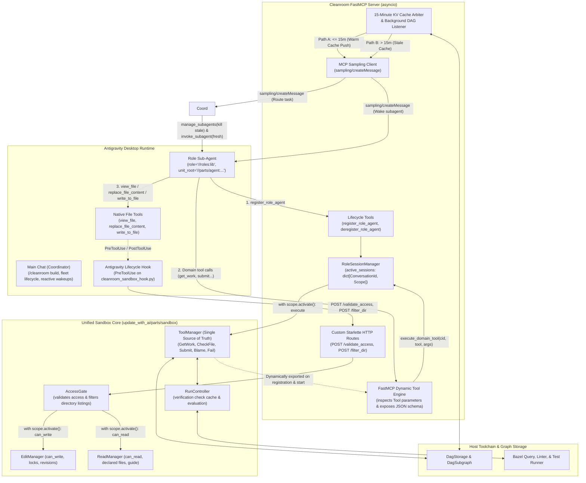
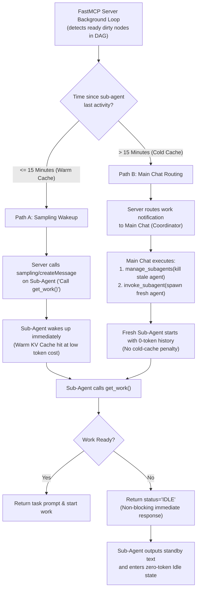

# Cleanroom Bazel Role Sub-Agent FastMCP Server & Unified Sandbox Architecture

This document specifies the design, lifecycle, and sandbox enforcement architecture for the Cleanroom Model Context Protocol (MCP) server supporting **Role Sub-Agents** within the Antigravity desktop orchestration harness, establishing a **unified "double-duty" sandbox core** that powers both desktop MCP sessions and headless in-process execution.

---

## 1. Executive Summary & Goals

In Cleanroom, software construction is modeled as a directed acyclic graph (DAG) of specification, implementation, and test nodes. To execute Cleanroom workflows autonomously in desktop agent environments (such as Antigravity under Google One Ultra subscriptions) without unbounded token consumption or process deadlocks, the orchestration loop is exposed through a centralized, standalone **FastMCP Server**.

Rather than building a disjoint MCP subsystem that duplicates verification caching, blame routing, and file locks, the existing Cleanroom **`sandbox` subsystem (`update_with_ai/parts/sandbox`) plays double duty**: it serves as the single authoritative domain core for both in-process headless runners and external MCP desktop clients.

### Key Architectural Tenets:
1. **Double-Duty Sandbox Core**: The `sandbox` subsystem is the single source of truth for verification caching, file lock tracking, blame routing, and role blindness. FastMCP, headless loop drivers, and lifecycle hooks are surface adapters around this shared core.
2. **Bazel Target Label Addressing**: Sub-agent roles and unit sub-graph roots are identified using standard Bazel target labels (e.g., `//roles:lib`, `//update_with_ai/parts/agent:agent_node_config`).
3. **Unified `conversationId` Identity**: Antigravity automatically provides `conversationId` for all MCP calls (accessible via MCP request context `ctx` or parameter injection) and lifecycle hook events. Using `conversationId` as the primary session key across both MCP tools and hooks guarantees 1:1 identity parity without custom ID tracking.
4. **`ToolManager` as Single Source of Truth & Dynamic FastMCP Export**:
   - `ToolManager` (`tool_provider.ToolManager`) in the `sandbox` subsystem is the **single source of truth** for all domain tools.
   - Any tool installed in `ToolManager` (`get_work`, `check_file`, `submit`, `blame`, `fail`) is **dynamically exported** into FastMCP by `McpServer`. No hardcoded domain tool lists or duplicated MCP tool classes exist. Adding a new tool to `ToolManager` automatically exposes it to MCP clients without server modifications.
   - FastMCP lifecycle tools (`register_role_agent`, `deregister_role_agent`) manage the agent session scope in `RoleSessionManager`.
5. **Unified Push/Single-Batch Prompt Model**: 
   - `get_work` generates a self-contained task prompt combining active source files, specifications, upstream changes, diagnostic feedback, and step-by-step tool instructions.
   - The prompt instructs the agent to **finish upon submission** rather than recursively calling `get_work`.
   - This resets the conversation context cleanly between nodes. Both the headless runner and the Antigravity desktop harness share this exact same push-style prompt model, completely preventing context contamination and transcript bloat.
6. **Client-Safe Non-Blocking Idling & 15-Minute KV Cache-Aware Sampling**:
   - Holding MCP tool calls open indefinitely triggers Antigravity's client-side safety timeouts (`Context deadline exceeded`). Therefore, `get_work` is **strictly non-blocking**: if no tasks are ready, it immediately returns `status: "IDLE"`, prompting the subagent to drop into an idle state.
   - The server acts as a non-blocking timekeeper, monitoring Google's **15-minute KV cache eviction window**.
   - **Path A (Warm Cache $\le 15$ min)**: Server pushes a tiny notification turn to the idle subagent via **MCP Sampling (`sampling/createMessage`)**, triggering an immediate warm-cache execution at heavy token discounts.
   - **Path B (Stale Cache $> 15$ min)**: Server routes the task notification via MCP Sampling to the **Parent Coordinator**, which terminates the stale subagent using `manage_subagents(kill)` and spawns a fresh 0-token instance using `invoke_subagent`.
7. **Native Antigravity File Tools Gated by Hooks & .mcp.active Sentinel**:
   - File inspection and edits use Antigravity's native tools (`view_file`, `replace_file_content`, `write_to_file`).
   - In MCP mode (`is_mcp_mode=True`), `ReadManager` and `EditManager` **do not install** `view_file` or `replace_file_content` into `ToolManager`.
   - File access validation (`can_read` and `can_write`) is implemented as **internal operations** on `ReadManager` and `EditManager` rather than MCP tools.
   - A root workspace sentinel (`.mcp.active`) tracks the server PID, port, and registered subagent conversation IDs.
   - An Antigravity `PreToolUse` lifecycle hook implements a two-tier fail-safe:
     - **Non-subagent sessions (pair programming / user)**: Fast-path bypass (`allow`) with zero network overhead.
     - **Registered Cleanroom subagents**: Gated against the MCP server (`POST /validate_access`). If the server crashes or terminates, the hook **fails closed (`deny`)**, preventing the subagent from running wild.
8. **Clean Tool Separation**:
   - In **headless mode**, only `ReplaceFileContentTool` exists for file editing (Cleanroom has no `WriteToFileTool` in headless mode; missing files are materialized from startup templates).
   - In **Antigravity desktop mode**, Antigravity provides both native `replace_file_content` and native `write_to_file`. The hook access gate validates both against `EditManager.can_write`.

---

## 2. System Architecture & Surface Adapters

The system architecture decouples the core domain logic from execution transports by placing `sandbox` at the center of surface adapters, coordinating with Antigravity desktop orchestration via FastMCP Dynamic Tools, MCP Sampling, and Lifecycle Hooks:



---

## 3. Tool Exposure & Cross-Mode Matrix

Because `ToolManager` manages domain tool definitions, and `is_mcp_mode` switches between native file tools and internal access operations:

| Tool / Capability | Headless Mode (CLI / CI) | Antigravity Desktop Mode (MCP) | Antigravity Hook Mode |
| :--- | :--- | :--- | :--- |
| `register_role_agent` | In-process lifecycle setup | **Exposed via FastMCP** | N/A |
| `deregister_role_agent`| In-process phase exit | **Exposed via FastMCP** | N/A |
| `get_work` | **Used to generate session prompt** | **Exposed via FastMCP** (dynamic export from `ToolManager`) | N/A |
| `check_file` | **Exposed** in `ToolManager` | **Exposed via FastMCP** (dynamic export from `ToolManager`) | N/A |
| `submit` | **Exposed** in `ToolManager` | **Exposed via FastMCP** (dynamic export from `ToolManager`) | N/A |
| `blame` | **Exposed** (if blame targets configured) | **Exposed via FastMCP** (dynamic export from `ToolManager`) | N/A |
| `fail` | **Exposed** in `ToolManager` | **Exposed via FastMCP** (dynamic export from `ToolManager`) | N/A |
| `can_read` | Internal operation on `ReadManager` | Internal operation on `ReadManager` | **Queried by AccessGate (`PreToolUse`, `PostToolUse`)** |
| `can_write` | Internal operation on `EditManager` | Internal operation on `EditManager` | **Queried by AccessGate (`PreToolUse`)** |
| `view_file` | **Installed in `ToolManager`** (`ViewFileTool`) | *Omitted from `ToolManager`* (uses Antigravity native) | **Gated by AccessGate (`PreToolUse`)** |
| `replace_file_content` | **Installed in `ToolManager`** (`ReplaceFileContentTool`) | *Omitted from `ToolManager`* (uses Antigravity native) | **Gated by AccessGate (`PreToolUse`)** |
| `write_to_file` | *Not Present* (uses template materialization) | *Not Present* (uses Antigravity native) | **Gated by AccessGate (`PreToolUse`)** |
| `list_dir` | **Installed in `ToolManager`** (`ListDirTool`) | *Omitted from `ToolManager`* (uses Antigravity native) | **Filtered by Hook (`PostToolUse`)** |

---

## 4. Addressing & Unified Identity Model

### 4.1 Bazel Target Label Addressing
All references to units, nodes, and engineering roles are expressed as canonical Bazel target labels:
- **Unit Root Label**: Specifies the root of the unit sub-graph to clean, e.g.:
  `//update_with_ai/parts/agent:agent_node_config`
- **Role Label**: Identifies the canonical engineering role target, e.g.:
  `//update_python_with_ai:lib`, `//update_python_with_ai:test`, `//update_python_with_ai:high`, `//update_python_with_ai:qa`, `//update_python_with_ai:coverage`
- **Node Address**: Every cleanable node in Cleanroom has a unique address composed of its unit address and role address:
  `Node(unit_address="//update_with_ai/parts/agent:agent_node_config", role_address="//update_python_with_ai:lib")`

Sub-agents are primed directly with a canonical role address (e.g., `//update_python_with_ai:lib`) and a root unit address (e.g., `//update_with_ai/parts/agent:agent_node_config`). Sub-agents and orchestration services do not depend on, compute, or resolve convenience `define_node` targets.

### 4.2 Unified Conversation Identity (`conversationId`)
Antigravity automatically provides `conversationId` for all MCP tool invocations and lifecycle hook events:
- **Zero-Config Identification**: Sub-agents do not need to invent, pass, or synchronize artificial `agent_id` strings.
- **FastMCP Request Context**: In FastMCP, tool handlers retrieve the Antigravity conversation ID directly from the request context (`ctx: Optional[Context] = None`, via `ctx.client_id` or `ctx.session_id`), defaulting to `"default"` if running outside Antigravity.
- **Unified Registry**: `RoleSessionManager` (`update_with_ai/parts/mcp/lib/mcp_session_impl.py`) indexes all active `RoleAgentSession` and `LifecycleScope` records directly by `ConversationId`.
- **Direct Hook Parity**: When Antigravity's `PreToolUse` or `PostToolUse` hook fires, it receives the exact same `conversationId` on `stdin`. The hook queries `POST /validate_access` with `conversation_id`, enabling instant $O(1)$ scope retrieval and verification without translation layers.

---

## 5. Dynamic Domain Tool Export Architecture

Cleanroom enforces **`ToolManager` as the single source of truth** for all domain tools. Instead of creating parallel MCP tool hierarchies or hardcoded server lists, `McpServer` dynamically introspects domain tools installed in `ToolManager` and exports them directly into FastMCP.

### 5.1 The Canonical `Tool` Protocol

All domain tools in Cleanroom implement the standard `Tool` protocol from `update_with_ai/parts/sandbox/lib/tool_provider.py`:

```python
class ParameterType(Enum):
    STRING = "string"
    INTEGER = "integer"
    BOOLEAN = "boolean"

class Parameter(Protocol):
    @property
    def name(self) -> str: ...
    @property
    def description(self) -> str: ...
    @property
    def type(self) -> ParameterType: ...
    @property
    def optional(self) -> bool: ...

class Tool(Protocol):
    @property
    def name(self) -> str: ...
    @property
    def description(self) -> str: ...
    @property
    def parameters(self) -> Sequence[Parameter]: ...
    def execute(self, **kwargs: Any) -> tool_provider.Response: ...
```

### 5.2 Dynamic FastMCP Callable Generation

In `McpServerImpl._create_fastmcp_tool_callable(tool: Tool)`:
1. **Signature Construction**:
   - Inspects `tool.parameters` and partitions them into required parameters first, followed by optional parameters with `default=None` and `Optional[wire_type]` annotations.
   - Appends a final dependency-injected parameter: `ctx: Optional[Context] = None`.
   - Creates an `inspect.Signature` with parameter metadata and `return_annotation=str`.
2. **FastMCP Registration**:
   - Attaches `__signature__`, `__annotations__`, `__doc__`, and `__name__` to the wrapper function.
   - Registers the wrapper with `app.add_tool(fn)`. FastMCP automatically inspects the function annotations to generate the JSON schema for MCP clients while hiding `ctx` from the public schema.
3. **Execution Routing**:
   ```python
   def dynamic_tool_handler(*args: Any, **kwargs: Any) -> str:
       bound = sig.bind(*args, **kwargs)
       bound.apply_defaults()
       arguments = dict(bound.arguments)
       ctx_val = arguments.pop("ctx", None)

       cid_str = "default"
       if ctx_val is not None and getattr(ctx_val, "client_id", None):
           cid_str = str(ctx_val.client_id)
       cid = mcp_session.ConversationId(cid_str)
       filtered_args = {k: v for k, v in arguments.items() if v is not None}
       return self.execute_domain_tool(cid, tool_name, filtered_args)
   ```

### 5.3 Execution Dispatch & Scope Activation

When `execute_domain_tool` is called:
```python
def execute_domain_tool(
    self,
    conversation_id: mcp_session.ConversationId,
    tool_name: str,
    arguments: Mapping[str, Any],
) -> str:
    session_mgr = get_singleton(mcp_session.RoleSessionManager)
    session = session_mgr.active_sessions.get(conversation_id)
    if session is None or session.scope is None:
        return f"Error: No active session for conversation '{conversation_id}'."

    session_mgr.touch_session(conversation_id)
    with session.scope.activate():
        tool_mgr = session.scope.get_singleton(tool_provider.ToolManager)
        resp = tool_mgr.execute_tool_with_arguments(tool_name, arguments)
        if resp.is_idle:
            session.status = mcp_session.RoleAgentStatus.IDLE
        return resp.content
```

Any tool registered in `ToolManager` (such as `GetWorkTool`, `CheckFileTool`, `SubmitTool`, `BlameTool`, `FailTool`, or any future domain tool) is automatically made available to the MCP agent without updating the MCP server implementation.

### 5.4 FastMCP Lifecycle Tools

FastMCP exposes two lifecycle tools directly to control session scopes:
- **`register_role_agent(role: str, unit_root: str, ctx: Optional[Context] = None) -> str`**:
  Resolves `conversation_id` from `ctx.client_id`, calls `session_mgr.register_session(conversation_id, role, unit_root)`, activates the scope, and dynamically exports any installed tools from `ToolManager` that have not yet been registered on FastMCP.
- **`deregister_role_agent(ctx: Optional[Context] = None) -> str`**:
  Resolves `conversation_id` from `ctx.client_id` and calls `session_mgr.deregister_session(conversation_id)`, closing the session scope and releasing held resources.

---

## 6. MCP Sampling & 15-Minute KV Cache Routing Architecture

### 6.1 The Safety Timeout Problem
In desktop environments like Google Antigravity, MCP tool calls are subject to hard client-side deadlines. If an MCP server handler suspends asynchronously on an event loop waiting for tasks for minutes, Antigravity's client wrapper severs the connection with:
```
Context deadline exceeded
```
This terminates the tool step in an error state and crashes the agent conversation loop.

Furthermore, waking an idle agent back up after its context window has been evicted from Google's server-side memory requires an expensive "cold" re-read of the entire transcript.

### 6.2 The Decoupled Idling & 15-Minute Cache Gate
To resolve this, the server never holds an MCP tool call open. Instead, it decouples work discovery using **MCP Sampling (`sampling/createMessage`)** and **Native Antigravity Orchestration**, gated by Google's **15-minute KV cache eviction window**:



### 6.3 Operational Mechanics of the Cache Gate

1. **Immediate Idling**:
   When `get_work()` finds no ready nodes, it returns:
   ```json
   {
     "status": "IDLE",
     "prompt": "No tasks are currently ready. Upstream dependencies are in-flight. Output a short standby message and drop to idle without calling further tools."
   }
   ```
   The subagent outputs `"Standing by for upstream tasks."` and cleanly finishes its turn, dropping to an idle state at zero token consumption.

2. **Server Timekeeper & Last-Active Timestamp**:
   The FastMCP server records `last_active_timestamp` for each registered `conversationId`. A background `asyncio` task continuously monitors `DagStorage` and `DagSubgraph` for unblocked dirty nodes.

3. **Path A: Warm Cache Push via MCP Sampling ($\le 15$ min)**:
   - When an upstream node is submitted, dependent nodes become ready.
   - If the idle role subagent's `current_time - last_active_timestamp <= 15 minutes`:
     The subagent's server-side prompt and system prefix remain cached in Google's high-speed memory.
   - The MCP server invokes `ctx.session.create_message(...)` (MCP Sampling) sending:
     `"New tasks are ready for your role. Please call get_work()."`
   - This triggers an immediate execution turn on the subagent. Because it hits the warm KV cache, the turn executes with minimal latency and high token savings.

4. **Path B: Stale Cache Elimination via Main Chat ($> 15$ min)**:
   - If work becomes ready after $> 15$ minutes of inactivity, Google has evicted the subagent's KV cache. Waking the subagent would force a full, expensive re-read of its entire history.
   - The MCP server routes the task notification to the **Main Chat (Coordinator)**:
     `"Role '//roles:lib' has new tasks ready, but subagent cache has expired. Please recycle worker."`
   - The Main Chat executes:
     ```python
     manage_subagents(Action="kill", ConversationIds=[stale_conversation_id])
     invoke_subagent(
         Subagents=[{
             "TypeName": "cleanroom_role_worker",
             "Role": "Lib Worker",
             "Prompt": "Call register_role_agent(role='//roles:lib', unit_root='//parts/agent:...'), then call get_work() to begin."
         }]
     )
     ```
   - The cold history is wiped from memory, and a fresh subagent starts with a 0-token baseline history.

---

## 7. Real-Time Confinement via Antigravity Hooks, .mcp.active Sentinel & Access Gate

### 7.1 Access Gate Architecture
In Antigravity Desktop mode, the model uses native `view_file`, `replace_file_content`, and `write_to_file`. The sandbox enforces confinement externally through Antigravity **Lifecycle Hooks** and direct queries to `ReadManager` and `EditManager`.

```python
@dataclass(frozen=True)
class AccessDecision:
    is_allowed: bool
    reason: str
    diagnostic_content: Optional[str] = None

class AccessGate(Protocol):
    def validate_access(
        self,
        conversation_id: mcp_session.ConversationId,
        tool_name: str,
        file_path: str,
    ) -> AccessDecision: ...
```

### 7.2 Workspace Sentinel (`.mcp.active`) Lifecycle & Session Tracking
To ensure that normal development, tests, and pair-programming sessions in the Cleanroom repository never suffer from network probes, process latency, or accidental lockouts, the MCP server manages an ephemeral sentinel file at the workspace root (`/.mcp.active`):

```json
{
  "pid": 54321,
  "port": 8765,
  "subagents": ["16bf1d15-6a0d-4acd-8fef-7e014940b4cf"]
}
```

1. **Startup**: When `cleanroom_mcp_server` starts up, it writes `.mcp.active` recording its process ID (`pid`), listening `port`, and an empty `subagents` list. `/.mcp.active` is added to `.gitignore`.
2. **Registration**: When a sub-agent executes `register_role_agent(role, unit_root)`, `McpServer` records the caller's `conversationId` into `subagents` in `.mcp.active`.
3. **Deregistration**: When `deregister_role_agent()` is called or a session scope closes, the `conversationId` is removed from `subagents`.
4. **Shutdown & Cleanup**: When the server cleanly stops (via `stop()`, `atexit`, or `SIGTERM`/`SIGINT` signal handlers), `.mcp.active` is deleted.

### 7.3 Two-Tier Fail-Safe Hook Logic (`cleanroom_sandbox_hook.py`)
Antigravity executes the hook script on `PreToolUse` for native file operations (`view_file`, `replace_file_content`, `write_to_file`), passing the tool call and caller metadata (including `conversationId`) via `stdin`.

The hook script implements a two-tier fail-safe that guarantees:
- **Zero disruption and zero network calls for pair programming / human use.**
- **Strict fail-closed confinement for subagents if the server crashes (preventing unconfined runs).**

```mermaid
flowchart TD
    Hook["PreToolUse Hook called (stdin)"] --> SentinelCheck{".mcp.active exists?"}
    SentinelCheck -->|No| AllowFast["Decision: ALLOW<br/>(Fast path: normal pair programming)"]
    SentinelCheck -->|Yes| ReadMeta["Read .mcp.active JSON (pid, port, subagents)"]
    
    ReadMeta --> SubagentCheck{"conversationId in subagents?"}
    SubagentCheck -->|No (Pair Programmer / User)| CheckPidDead{"Is PID dead?<br/>(os.kill(pid, 0))"}
    CheckPidDead -->|Yes| CleanStale["Delete stale .mcp.active"] --> AllowUser["Decision: ALLOW"]
    CheckPidDead -->|No| AllowUser
    
    SubagentCheck -->|Yes (Cleanroom Subagent)| CheckPidAlive{"Is MCP PID alive?<br/>(os.kill(pid, 0))"}
    CheckPidAlive -->|Dead / Crashed| DenyCrash["Decision: DENY (FAIL CLOSED)<br/>'Cleanroom MCP server crashed. Access locked down.'"]
    CheckPidAlive -->|Alive| QueryServer["POST /validate_access to 127.0.0.1:port"]
    QueryServer -->|HTTP 200| EnforceGate["Return AccessDecision (ALLOW or DENY)"]
    QueryServer -->|Network Timeout / Error| DenyNet["Decision: DENY (FAIL CLOSED)"]
```

#### The Subagent Crash Failure-Mode Solution:
If the MCP server crashes while a Cleanroom sub-agent is active:
- The caller's `conversationId` is matched in `.mcp.active.subagents`.
- The hook checks `os.kill(pid, 0)`: because the server is dead, the hook **immediately fails closed (`{"decision": "deny"}`)**.
- The subagent is halted immediately on its next file operation. It **never runs wild** across the repository and cannot violate cleanroom role blindness or touch forbidden files.

#### The Developer / Pair-Programmer Bypass:
- The pair-programming session's `conversationId` is never in `subagents`.
- The hook immediately returns `{"decision": "allow"}` without making any network calls.
- If the server has died, the pair-programmer's call cleans up the stale `.mcp.active` file so subsequent tool calls take the instant fast-path.

### 7.4 Gate Delegation to `ReadManager` and `EditManager`
Inside `AccessGateImpl` (on the running server):
1. Looks up the session scope in `RoleSessionManager` for `conversation_id` and activates it with `with scope.activate():`.
2. Normalizes `file_path` against workspace root. If the path attempts to traverse outside the workspace, it immediately denies access.
3. Dispatches directly to session singletons:
   - **For writes (`replace_file_content`, `write_to_file`)**:
     Calls `edit_mgr = scope.get_singleton(sandbox_file_editor.EditManager)`
     Invokes `resp = edit_mgr.can_write(rel_path)`
   - **For reads (`view_file`)**:
     Calls `read_mgr = scope.get_singleton(sandbox_file_reader.ReadManager)`
     Invokes `resp = read_mgr.can_read(rel_path)`

### 7.5 Hook Configuration (`.agents/hooks.json`)

```json
{
  "cleanroom-sandbox-guard": {
    "enabled": true,
    "PreToolUse": [
      {
        "matcher": "view_file|replace_file_content|write_to_file",
        "hooks": [
          {
            "type": "command",
            "command": "python3 update_with_ai/support/lib/cleanroom_sandbox_hook.py",
            "timeout": 5
          }
        ]
      }
    ]
  }
}
```

---

## 8. Critical Technical Considerations & Implementation Patterns

### 1. Lifecycle Scope Management across Asynchronous JSON-RPC Turns
- **The Problem**: Cleanroom's canonical `support/lib/lifecycle.py` traditionally used synchronous context managers (`with enter_phase(agent_session): ...`) that set a `ContextVar[Optional[LifecycleScope]]`. In an asynchronous MCP server, incoming JSON-RPC calls arrive as separate asyncio tasks. Exiting a tool handler exits the task context, which would prematurely tear down the session if wrapped in `with enter_phase`.
- **Implementation**:
  1. `LifecycleScope` provides:
     - `begin_phase(tier, registry, ...)`: Creates the unmanaged scope and initializes startup singletons without binding to a context manager.
     - `scope.activate()`: A lightweight context manager (`with scope.activate(): yield`) that temporarily sets `_active_scope` for the duration of a single MCP tool turn or hook evaluation, allowing `get_singleton(...)` to resolve session singletons for that conversation.
     - `scope.close()`: Explicitly executes singleton teardowns in reverse instantiation order (LIFO).
  2. `RoleSessionManager` maintains `active_sessions: dict[ConversationId, RoleAgentSession]`.
  3. `register_role_agent` calls `begin_phase(agent_session)` and stores the session.
  4. Each domain tool handler and access gate evaluation activates the scope for that conversation ID.
  5. `deregister_role_agent` (or `stop()`) calls `scope.close()` and evicts the entry from `active_sessions`.

### 2. Antigravity Hook Contract Immutability
- Antigravity's `PostToolUse` contract receives `{stepIdx, error}` and returns `{}` on `stdout`. It cannot rewrite or filter tool output (e.g., directory listings).
- Therefore, all access gating and containment occurs strictly in `PreToolUse` (`decision: "deny" | "allow"`).

### 3. Starlette Custom Routes for Dual-Transport Hook IPC
- Starlette custom route `/validate_access` is mounted directly on the FastMCP application via `@app.custom_route(...)`.
- When running in SSE mode or behind an ASGI server, the hook queries the same HTTP host and port used for MCP JSON-RPC.

### 4. Absolute Path Canonicalization & Symlink Resolution
- Antigravity native file tools pass host absolute paths. `AccessGate` canonicalizes paths using `os.path.relpath(os.path.abspath(path), workspace_root)`, rejecting any path that traverses outside the workspace boundary before evaluating `can_read` or `can_write`.

### 5. Startup Template Materialization Timing
- When `get_work` is called, `EditManager.materialize_templates()` formats and creates any missing source files on disk before returning the task prompt, ensuring files exist when the sub-agent calls native `view_file` or `replace_file_content`.

### 6. Microsecond Process Liveness & Two-Tier Fail-Safe
- Checking server liveness via `os.kill(pid, 0)` is an in-kernel process table lookup taking `< 5 microseconds`, avoiding network sockets or port probing when detecting whether a server has crashed.
- Hook timeout in `.agents/hooks.json` is budgeted tightly (3–5 seconds) to prevent freezing IDE interactions.
- Two-tier fail-safe: Fail-open for developer pair programming, fail-closed for registered role sub-agents.

### 7. Headless & Desktop Configuration Parity (`McpConfig`) & Batch Scaling
- `McpConfig` implements `agent_config.AgentConfig` and `dag_config.DagConfig`, defaulting `is_mcp_mode=True`, `startup_reads=False`, and `batch_size=10`.
- In headless execution, `agent_config` sets `is_mcp_mode=False`, causing `ReadManager` and `EditManager` to install `view_file` and `replace_file_content` into `ToolManager`.
- In desktop MCP execution, `is_mcp_mode=True` suppresses those file tools from `ToolManager`, delegating to Antigravity's native file tools gated by `AccessGate`.
- **Early Environment Extraction**: The MCP runner entrypoint (`cleanroom_mcp_runner_impl.py`) extracts `--batch-size` (defaulting to 10) directly into `os.environ["BATCH_SIZE"]` prior to system phase instantiation, ensuring `McpConfig` and `DagSubgraph` initialize with batch size 10.

### 8. Multi-Session Isolation & Conversation Routing (`--session <role>`)
- **The Problem**: When multiple sub-agents run concurrently within the same workspace, tool requests arriving without explicit session context collisioned on a single `"default"` session key, leading to registration errors (`Session 'default' already registered`).
- **Resolution**:
  - `McpServer` registers tools with an explicit `conversation_id: Optional[str] = None` parameter.
  - The CLI client (`cleanroom_mcp_client.py`) provides `--session <role>` across all commands, routing calls to isolated `RoleAgentSession` phase scopes.
  - Single-session fallback: When omitted, if exactly one active session is registered, the call resolves to that session automatically; otherwise, it requires `--session`.

### 9. DAG Target Preservation across Out-of-Order Role Registration
- **The Problem**: `DagSubgraph` is a system-tier singleton shared by all role sessions. In multi-role builds, downstream roles (e.g. `qa`) depend on upstream roles (`test`, `lib`, `low`, `high`). If upstream workers registered after downstream workers, calling `subgraph.set_target(upstream_node)` unconditionally truncated `subgraph._nodes` to only encompass nodes up to that upstream role, cutting off downstream nodes from the active graph.
- **Resolution**: In `mcp_session_impl.py`, `subgraph.set_target(root_node)` is guarded:
  ```python
  current_root = getattr(subgraph, "_root", getattr(subgraph, "target", None))
  current_nodes = getattr(subgraph, "_nodes", None)
  if current_root is None or current_nodes is None or root_node not in current_nodes:
      subgraph.set_target(root_node)
  ```
  If `root_node` is already in `subgraph._nodes` (an upstream dependency), the target is preserved, maintaining the full topological order across the entire 5-role pipeline.

### 10. Graceful Server Shutdown & Process Teardown (`shutdown` tool)
- The server exposes a `shutdown()` tool callable over MCP.
- Invoking `shutdown()` calls `self.stop()`, cancels background cache monitor tasks, removes `.mcp.active`, and triggers clean daemon process exit via a background timer thread (`time.sleep(0.5); os._exit(0)`).
- The orchestrator invokes `shutdown` as soon as the DAG converges, ensuring zero dangling background processes.

---

## 9. Top-Level Antigravity Skill Orchestration (`/cleanroom clean`) & Fleet Lifecycle

### 9.1 Main Chat as Native Coordinator
Rather than spawning an intermediate subagent to coordinate workers, the **Main Chat conversation serves as the primary coordinator**:
- **Zero Nested Overhead**: Avoids nested `invoke_subagent` layers, keeping token costs minimal.
- **Direct Workspace Visibility**: All role workers appear directly in Antigravity's subagent side panel, where their progress, tool steps, and transcripts can be inspected live.
- **Reactive Wakeups**: Antigravity automatically wakes up the Main Chat whenever a subagent finishes a turn or reports completion, eliminating busy-polling loops.

### 9.2 Command Syntax & Subgraph Role Resolution
The workflow uses the Cleanroom concept of **cleaning** nodes (transitioning nodes in the DAG from `dirty` to `clean` via specification, implementation, test, and verification):

#### A. Shortcut Target Form (`define_node` targets)
Users can specify a single `define_node` target shortcut, which automatically resolves to its constituent unit and role:
```
/cleanroom clean <define_node-target>
```
Example:
```
/cleanroom clean //testing/parts/sandbox:sandbox_asm_qa
```
*Resolution*:
- Target package and name `//testing/parts/sandbox:sandbox_asm_qa`
- Role suffix `_qa` resolves to role `//update_python_with_ai:qa`
- Base name resolves to unit `//testing/parts/sandbox:sandbox_asm`

#### B. Canonical Two-Argument Form
Alternatively, users can specify the target role address and unit address explicitly:
```
/cleanroom clean <role-address> <unit-address>
```
Example:
```
/cleanroom clean //update_python_with_ai:qa //testing/parts/sandbox:sandbox_asm
```
*(Accepts convenience labels such as `qa`, `:qa`, or full Bazel target `//update_python_with_ai:qa`).*

#### Execution Steps:
1. **Target & Role Resolution**:
   - Parses the input arguments (supporting either the single `define_node` target shortcut or the two-argument `(role, unit)` pair).
   - If needed, queries Bazel attributes (`labels(unit, target)`, `labels(role, target)`).
   - Resolves all upstream dependency roles in topological execution order:
     $$\text{Roles} = \{ n.\text{role\_address} \mid n \in \text{SubgraphNodes} \land n.\text{role\_address} \neq \emptyset \}$$
     *(e.g., for `qa`, discovering `high`, `low`, `lib`, `test`, and `qa`).*
2. **Server Liveness**: Checks `.mcp.active`. If absent or dead, launches the Cleanroom FastMCP server in the background:
   ```bash
   python3 update_with_ai/parts/systems/lib/cleanroom_mcp_runner_impl.py --transport sse --port 8765 --batch-size 10
   ```
3. **Subgraph Initialization**:
   - Initializes `root = Node(unit_address, role_address)` in `DagSubgraph.set_target(root)`.

### 9.3 Fleet Launch & Autonomous Idling Pipeline
4. **Fleet Launch**:
   The Main Chat invokes role workers concurrently via `invoke_subagent`:
   ```python
   invoke_subagent(
       Subagents=[
           {
               "TypeName": "cleanroom_role_worker",
               "Role": f"{role_name} Worker",
               "Prompt": (
                   f"You are the Cleanroom role worker for role '{role_addr}' at unit '{unit_addr}'.\n"
                   f"1. Register your session:\n"
                   f"   python3 update_with_ai/support/lib/cleanroom_mcp_client.py --session {role_short} register --role '{role_addr}' --unit '{unit_addr}'\n"
                   f"2. Work loop:\n"
                   f"   Call: python3 update_with_ai/support/lib/cleanroom_mcp_client.py --session {role_short} get-work\n"
                   f"   - If 'No dirty nodes are ready for cleaning': output 'Standing by for upstream tasks.' and finish turn.\n"
                   f"   - If work is assigned: inspect files, apply edits, run check-file, and call submit.\n"
                   f"     Repeat get-work until no dirty nodes remain.\n"
                   f"3. When no work remains: output completion summary and finish turn."
               )
           }
           for role_addr in discovered_roles
       ]
   )
   ```
5. **Multi-Node Batching (`batch_size = 10`)**:
   - `get_work` dispatches up to 10 ready dirty nodes to a worker in a single turn.
   - For multi-node batches, the prompt formats all open targets (`Process the following files: ...`).
   - The worker runs verification via `check-file --file <path>` and submits each target via `submit --target <path>`.
6. **Immediate Work vs. Staged Idling**:
   - Roles with ready dirty nodes immediately process their batch.
   - Roles whose upstream dependencies are dirty receive `"No dirty nodes are ready for cleaning."` and standby in a zero-token idle state.
7. **DAG Convergence & Complete Teardown**:
   - When all nodes in the target subgraph transition to clean, `cleanroom_dag_cli status` reports `"is_complete": true`.
   - The Main Chat terminates all worker subagents:
     ```python
     manage_subagents(Action="kill", ConversationIds=[...])
     ```
   - The Main Chat stops the server cleanly:
     ```bash
     python3 update_with_ai/support/lib/cleanroom_mcp_client.py shutdown
     ```

### 9.4 Change Injection & Incremental Re-dirtying (`/cleanroom change`)
To initiate work or trigger incremental refactors from the chat:
```
/cleanroom change <define_node-target> "<change description>"
# or
/cleanroom change <unit-address> <role-address> "<change description>"
```
- Attaches a `Change(content=...)` message to the target node in `DagStorage`.
- Automatically marks the node and all its downstream dependents dirty.
- When followed by `/cleanroom clean`, the fleet executes incremental updates strictly for the affected subgraph.

