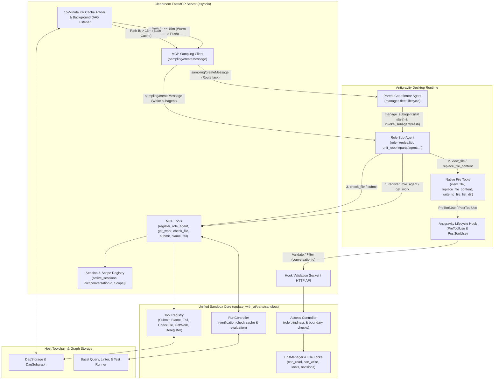
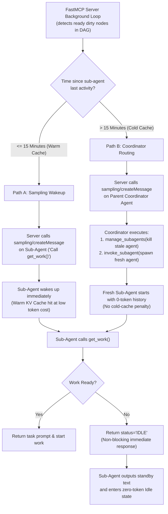

# Cleanroom Bazel Role Sub-Agent FastMCP Server & Unified Sandbox Architecture

This document specifies the design, lifecycle, and sandbox enforcement architecture for the Cleanroom Model Context Protocol (MCP) server supporting **Role Sub-Agents** within the Antigravity desktop orchestration harness, establishing a **unified "double-duty" sandbox core** that powers both desktop MCP sessions and headless in-process execution.

---

## 1. Executive Summary & Goals

In Cleanroom, software construction is modeled as a directed acyclic graph (DAG) of specification, implementation, and test nodes. To execute Cleanroom workflows autonomously in desktop agent environments (such as Antigravity under Google One Ultra subscriptions) without unbounded token consumption or process deadlocks, the orchestration loop is exposed through a centralized, standalone **FastMCP Server**.

Rather than building a disjoint MCP subsystem that duplicates verification caching, blame routing, and file locks, the existing Cleanroom **`sandbox` subsystem (`update_with_ai/parts/sandbox`) plays double duty**: it serves as the single authoritative domain core for both in-process headless runners and external MCP desktop clients.

### Key Architectural Tenets:
1. **Double-Duty Sandbox Core**: The `sandbox` subsystem is the single source of truth for verification caching, file lock tracking, blame routing, and role blindness. FastMCP, headless loop drivers, and lifecycle hooks are surface adapters around this shared core.
2. **Bazel Target Label Addressing**: Sub-agent roles and unit sub-graph roots are identified using standard Bazel target labels (e.g., `//roles:lib`, `//update_with_ai/parts/agent:agent_node_config`).
3. **Unified `conversationId` Identity**: Antigravity automatically provides `conversationId` for all MCP calls (accessible via MCP request context `ctx` or parameter injection) and lifecycle hook events. Using `conversationId` as the primary session key across both MCP tools and hooks guarantees 1:1 identity parity without custom ID tracking.
4. **Typed Tool-Like Objects**: MCP methods are designed as discrete, strongly-typed tool objects (`SubmitTool`, `GetWorkTool`, `CheckFileTool`, `DeregisterRoleAgentTool`) rather than a monolithic service or untyped wire bindings. This preserves Cleanroom's high-level specification modularity, enables dynamic tool discovery/gating, and supports isolated unit testing.
5. **Unified Push/Single-Batch Prompt Model**: 
   - `get_work` generates a self-contained task prompt combining active source files, specifications, upstream changes, diagnostic feedback, and step-by-step tool instructions.
   - The prompt instructs the agent to **finish upon submission** rather than recursively calling `get_work`.
   - This resets the conversation context cleanly between nodes. Both the headless runner and the Antigravity desktop harness share this exact same push-style prompt model, completely preventing context contamination and transcript bloat.
6. **Client-Safe Non-Blocking Idling & 15-Minute KV Cache-Aware Sampling**:
   - Holding MCP tool calls open indefinitely triggers Antigravity's client-side safety timeouts (`Context deadline exceeded`). Therefore, `get_work` is **strictly non-blocking**: if no tasks are ready, it immediately returns `status: "IDLE"`, prompting the subagent to drop into an idle state.
   - The server acts as a non-blocking timekeeper, monitoring Google's **15-minute KV cache eviction window**.
   - **Path A (Warm Cache $\le 15$ min)**: Server pushes a tiny notification turn to the idle subagent via **MCP Sampling (`sampling/createMessage`)**, triggering an immediate warm-cache execution at heavy token discounts.
   - **Path B (Stale Cache $> 15$ min)**: Server routes the task notification via MCP Sampling to the **Parent Coordinator**, which terminates the stale subagent using `manage_subagents(kill)` and spawns a fresh 0-token instance using `invoke_subagent`.
7. **Native Antigravity File Tools Gated by Hooks**: File inspection and edits use Antigravity's native tools (`view_file`, `replace_file_content`, `write_to_file`, `list_dir`). An Antigravity `PreToolUse` lifecycle hook queries the sandbox's access gate in real time using `conversationId` to enforce role blindness and file locks, while `PostToolUse` filters directory listings.
8. **Clean Tool Separation**:
   - In **headless mode**, only `ReplaceFileContentTool` exists for file editing (Cleanroom has no `WriteToFileTool` in headless mode; missing files are materialized from startup templates).
   - In **Antigravity desktop mode**, Antigravity provides both native `replace_file_content` and native `write_to_file`. The hook access gate must support and constrain both.

---

## 2. System Architecture & Surface Adapters

The system architecture decouples the core domain logic from execution transports by placing `sandbox` at the center of three surface adapters, coordinating with Antigravity desktop orchestration via MCP Sampling and Lifecycle Hooks:



---

## 3. Tool Exposure & Cross-Mode Matrix

Because `sandbox` manages all tool definitions and access policies, different adapters selectively expose or gate tools according to their execution context:

| Tool / Capability | Headless Mode (CLI / CI) | Antigravity Desktop Mode (MCP) | Antigravity Hook Mode |
| :--- | :--- | :--- | :--- |
| `register_role_agent` | In-process lifecycle setup | **Exposed via FastMCP** | N/A |
| `deregister_role_agent`| In-process phase exit | **Exposed via FastMCP** | N/A |
| `get_work` | **Used to generate session prompt** | **Exposed via FastMCP** (non-blocking fetch) | N/A |
| `check_file` | **Exposed** (`CheckFileTool`) | **Exposed via FastMCP** | N/A |
| `submit` | **Exposed** (`SubmitTool`) | **Exposed via FastMCP** | N/A |
| `blame` | **Exposed** (if blame targets configured) | **Exposed via FastMCP** (if blame targets configured) | N/A |
| `fail` | **Exposed** (`FailTool`) | **Exposed via FastMCP** | N/A |
| `advance` | **Exposed** (if step mode active) | **Exposed via FastMCP** (if step mode active) | N/A |
| `view_file` | **Exposed** (`ViewFileTool`) | *Hidden* (uses Antigravity native) | **Gated by AccessGate (`PreToolUse`)** |
| `replace_file_content` | **Exposed** (`ReplaceFileContentTool`) | *Hidden* (uses Antigravity native) | **Gated by AccessGate (`PreToolUse`)** |
| `write_to_file` | *Not Present* (uses template materialization) | *Hidden* (uses Antigravity native) | **Gated by AccessGate (`PreToolUse`)** |
| `list_dir` | **Exposed** (`ListDirTool`) | *Hidden* (uses Antigravity native) | **Filtered by Hook (`PostToolUse`)** |

---

## 4. Addressing & Unified Identity Model

### 4.1 Bazel Target Label Addressing
All references to units, nodes, and engineering roles are expressed as canonical Bazel target labels:
- **Unit Root Label**: Specifies the root of the unit sub-graph to clean, e.g.:
  `//update_with_ai/parts/agent:agent_node_config`
- **Role Label**: Identifies the engineering role, e.g.:
  `//update_with_ai/parts/agent:lib`, `//update_with_ai/parts/agent:tests`, or `//roles:grounding`
- **Node Address**: Every cleanable node in Cleanroom has a unique address composed of its unit address and role address:
  `Node(unit_address="//update_with_ai/parts/agent:agent_node_config", role_address="//update_with_ai/parts/agent:lib")`

### 4.2 Unified Conversation Identity (`conversationId`)
Antigravity automatically provides `conversationId` for all MCP tool invocations and lifecycle hook events:
- **Zero-Config Identification**: Sub-agents do not need to invent, pass, or synchronize artificial `agent_id` strings.
- **FastMCP Request Context**: In FastMCP, tool handlers retrieve the Antigravity conversation ID directly from the request context (`ctx: Context`, via `ctx.session_id` or `ctx.meta["conversationId"]`), with an optional explicit parameter fallback (`conversation_id: str | None = None`).
- **Unified Registry**: The sandbox server indexes all active `RoleAgentSession` and `LifecycleScope` records directly by `conversation_id`.
- **Direct Hook Parity**: When Antigravity's `PreToolUse` or `PostToolUse` hook fires, it receives the exact same `conversationId` on `stdin`. The hook queries `sandbox.validate_access` with `conversationId`, enabling instant $O(1)$ verification without translation layers.

---

## 5. Typed Tool-Like Object Pattern (`McpTool`)

Rather than defining a monolithic service interface with multiple methods or using untyped wire bindings (`ActualParameterBindings`), every MCP capability is specified as an independent **tool-like object** exposing a strongly-typed `execute(...)` method.

### 5.1 Base Protocol Definition

```python
class McpTool(Protocol):
    @property
    def name(self) -> str: ...

    @property
    def description(self) -> str: ...


class McpToolManager(Protocol):
    @property
    def installed_tools(self) -> Sequence[McpTool]: ...

    def install_tool(self, tool: McpTool) -> None: ...
```

### 5.2 Discrete Tool Specifications

#### `RegisterRoleAgentTool`
Binds the session (`conversationId`) to a unit sub-graph root and role, initializing the `agent_session` lifecycle scope.
```python
class RegisterRoleAgentTool(McpTool, Protocol):
    def execute(
        self,
        role: str,
        unit_root: str,
        conversation_id: Optional[str] = None,
        ctx: Optional[Context] = None,
    ) -> dict: ...
```

#### `DeregisterRoleAgentTool`
Explicitly tears down the agent's session lifecycle phase and releases all held file locks.
```python
class DeregisterRoleAgentTool(McpTool, Protocol):
    def execute(
        self,
        conversation_id: Optional[str] = None,
        ctx: Optional[Context] = None,
    ) -> dict: ...
```

#### `GetWorkTool` (Non-Blocking)
Checks for ready dirty nodes. If ready, materializes missing startup templates on disk, returns a self-contained task prompt, and activates confinement boundaries. If not ready, immediately returns `status: "IDLE"`.
```python
class GetWorkTool(McpTool, Protocol):
    def execute(
        self,
        max_batch_size: int = 1,
        conversation_id: Optional[str] = None,
        ctx: Optional[Context] = None,
    ) -> dict: ...
```

#### `CheckFileTool`
Evaluates static verification checks (lint, syntax, tests) using revision caching.
```python
class CheckFileTool(McpTool, Protocol):
    def execute(
        self,
        path: Optional[str] = None,
        conversation_id: Optional[str] = None,
        ctx: Optional[Context] = None,
    ) -> dict: ...
```

#### `SubmitTool`
Enforces verification and change documentation, locks files, marks nodes `SUBMITTED`, updates sub-graph dependencies, and triggers background task checks.
```python
class SubmitTool(McpTool, Protocol):
    def execute(
        self,
        target: Optional[str] = None,
        change_summary: str = "",
        conversation_id: Optional[str] = None,
        ctx: Optional[Context] = None,
    ) -> dict: ...
```

#### `BlameTool`
Attributes defects to upstream dependency nodes and marks them dirty with feedback.
```python
class BlameTool(McpTool, Protocol):
    def execute(
        self,
        target: Optional[str] = None,
        blame_target: str = "",
        explanation: str = "",
        conversation_id: Optional[str] = None,
        ctx: Optional[Context] = None,
    ) -> dict: ...
```

#### `FailTool`
Terminates work on a node with an unresolvable failure and blocks downstream dependents.
```python
class FailTool(McpTool, Protocol):
    def execute(
        self,
        target: Optional[str] = None,
        explanation: str = "",
        conversation_id: Optional[str] = None,
        ctx: Optional[Context] = None,
    ) -> dict: ...
```

---

## 6. MCP Sampling & 15-Minute KV Cache Routing Architecture

### 6.1 The Safety Timeout Problem
In desktop environments like Google Antigravity, MCP tool calls are subject to hard client-side deadlines. If an MCP server handler suspends asynchronously on an event loop waiting for tasks for minutes, Antigravity's client wrapper severs the connection with:
```
Context deadline exceeded
```
This terminates the tool step in an error state and crashes the agent conversation loop.

Furthermore, waking an idle agent back up after its context window has been evicted from Google's server-side memory requires an expensive "cold" re-read of the entire transcript.

### 6.2 The Decoupled Idling & 15-Minute Cache Gate
To resolve this, the server never holds an MCP tool call open. Instead, it decouples work discovery using **MCP Sampling (`sampling/createMessage`)** and **Native Antigravity Orchestration**, gated by Google's **15-minute KV cache eviction window**:



### 6.3 Operational Mechanics of the Cache Gate

1. **Immediate Idling**:
   When `get_work()` finds no ready nodes, it returns:
   ```json
   {
     "status": "IDLE",
     "prompt": "No tasks are currently ready. Upstream dependencies are in-flight. Output a short standby message and drop to idle without calling further tools."
   }
   ```
   The subagent outputs `"Standing by for upstream tasks."` and cleanly finishes its turn, dropping to an idle state at zero token consumption.

2. **Server Timekeeper & Last-Active Timestamp**:
   The FastMCP server records `last_active_timestamp` for each registered `conversationId`. A background `asyncio` task continuously monitors `DagStorage` and `DagSubgraph` for unblocked dirty nodes.

3. **Path A: Warm Cache Push via MCP Sampling ($\le 15$ min)**:
   - When an upstream node is submitted, dependent nodes become ready.
   - If the idle role subagent's `current_time - last_active_timestamp <= 15 minutes`:
     The subagent's server-side prompt and system prefix remain cached in Google's high-speed memory.
   - The MCP server invokes `ctx.session.create_message(...)` (MCP Sampling) sending:
     `"New tasks are ready for your role. Please call get_work()."`
   - This triggers an immediate execution turn on the subagent. Because it hits the warm KV cache, the turn executes with minimal latency and high token savings.

4. **Path B: Stale Cache Elimination via Coordinator ($> 15$ min)**:
   - If work becomes ready after $> 15$ minutes of inactivity, Google has evicted the subagent's KV cache. Waking the subagent would force a full, expensive re-read of its entire history.
   - The MCP server bypasses the cold subagent and sends an MCP Sampling notification to the **Parent Coordinator**:
     `"Role '//roles:lib' has new tasks ready, but subagent cache has expired. Please recycle worker."`
   - The Coordinator executes:
     ```python
     manage_subagents(Action="kill", ConversationIds=[stale_conversation_id])
     invoke_subagent(
         Subagents=[{
             "TypeName": "cleanroom_role_worker",
             "Role": "Lib Worker",
             "Prompt": "Call register_role_agent(role='//roles:lib', unit_root='//parts/agent:...'), then call get_work() to begin."
         }]
     )
     ```
   - The cold history is wiped from memory, and a fresh subagent starts with a 0-token baseline history.

---

## 7. Real-Time Confinement via Antigravity Hooks & Sandbox Access Gate

### 7.1 Access Gate Architecture
In Antigravity Desktop mode, the model uses native `view_file`, `replace_file_content`, `write_to_file`, and `list_dir`. The sandbox enforces confinement externally through Antigravity **Lifecycle Hooks**.

The sandbox exposes an internal `AccessGate` service:
```python
class AccessGate(Protocol):
    def validate_access(
        self,
        conversation_id: str,
        tool_name: str,
        target_path: str,
    ) -> Tuple[bool, str]: ...

    def filter_directory_listing(
        self,
        conversation_id: str,
        directory_path: str,
        entries: Sequence[str],
    ) -> Sequence[str]: ...
```

### 7.2 Hook Event Flow: PreToolUse & PostToolUse
1. **Write & Read Gating (`PreToolUse`)**:
   - Intercepts `replace_file_content`, `write_to_file`, and `view_file`.
   - The hook queries `POST /validate_access`.
   - The sandbox checks that `targetPath` is within `allowed_read_write_files` (and unlocked) for writes, or within `allowed_readable_files` $\cup$ `allowed_read_write_files` for reads.
   - If unauthorized, outputs `{"decision": "deny", "reason": "..."}`, immediately blocking execution.
2. **Directory Sanitation (`PostToolUse`)**:
   - Intercepts `list_dir` completions.
   - Filters output entries by delegating to `AccessGate.filter_directory_listing()`, stripping any filenames or directories that belong to blinded roles (e.g. hiding `tests/` from lib authors).

### 7.3 Hook Configuration (`.agents/hooks.json`)

```json
{
  "cleanroom-sandbox-guard": {
    "enabled": true,
    "PreToolUse": [
      {
        "matcher": "view_file|replace_file_content|write_to_file",
        "hooks": [
          {
            "type": "command",
            "command": "python3 ./support/hooks/cleanroom_sandbox_hook.py",
            "timeout": 5
          }
        ]
      }
    ],
    "PostToolUse": [
      {
        "matcher": "list_dir",
        "hooks": [
          {
            "type": "command",
            "command": "python3 ./support/hooks/cleanroom_sandbox_filter.py",
            "timeout": 5
          }
        ]
      }
    ]
  }
}
```

---

## 8. Critical Technical Considerations & Open Questions

### 1. Lifecycle Scope Management across Asynchronous JSON-RPC Turns
- **The Problem**: Cleanroom's canonical `support/lib/lifecycle.py` manages scopes using synchronous context managers (`with enter_phase(agent_session): ...`) that set a `ContextVar[Optional[LifecycleScope]]`. In an asynchronous MCP server, incoming JSON-RPC calls arrive as separate asynchronous tasks. Exiting a tool handler exits the task context, which would prematurely tear down the session if wrapped in `with enter_phase`.
- **Resolution**:
  1. Add discrete lifecycle management methods to `LifecycleScope`:
     - `scope.open()` / `begin_phase(tier, registry, ...)`: Creates the scope and runs startup initializations without binding to a context manager.
     - `scope.activate()`: A lightweight context manager (`with scope.activate(): yield`) that temporarily sets `_active_scope` for the duration of a single MCP tool call, allowing `get_singleton(...)` to resolve session singletons for that conversation.
     - `scope.close()`: Explicitly executes singleton teardowns in reverse instantiation order (LIFO).
  2. The FastMCP server maintains a dictionary `active_sessions: dict[str, LifecycleScope]` keyed by `conversationId`.
  3. `register_role_agent` calls `begin_phase(agent_session)` and stores the scope in the dictionary.
  4. Each MCP tool handler (`get_work`, `check_file`, `submit`, `blame`, `fail`) looks up `active_sessions[conversation_id]` and runs its body inside `with scope.activate(): ...`.
  5. `deregister_role_agent` (or node submission completion / timeout) calls `scope.close()` and evicts the entry from `active_sessions`.

### 2. Output Filtering vs. IDE File Caching in `PostToolUse`
- **The Problem**: Can `PostToolUse` be used for CommonMark macro expansion or template transformation on file reads?
- **Analysis & Trade-off**:
  - **Safe for `list_dir`**: Filtering directory entries in `PostToolUse` is completely safe because directory listings are transient tool outputs consumed solely by the model's text window.
  - **High Risk for `view_file`**: Altering file content in `PostToolUse` introduces severe synchronization hazards with IDE client-side file caching:
    - Antigravity and the host editor maintain local file buffers, diff views, and line-offset caches based on raw disk content.
    - If `PostToolUse` rewrites lines or inserts macro expansions, the line numbers seen by the model will no longer match the line numbers in the actual file on disk. When the model subsequent calls `replace_file_content` with `StartLine`/`EndLine`, the edits will target corrupted line ranges.
  - **Conclusion**: `PostToolUse` should be restricted to **filtering directory listings**. Source and specification files must remain 100% literal on disk, with template materialization occurring explicitly before agent startup.

### 3. Dual-Transport Hook IPC Daemon Topology
- **The Problem**: MCP servers in `mcp_config.json` typically run over **stdio**. An Antigravity lifecycle hook executes as an independent OS process (`python3 ./scripts/hook.py`) and cannot send messages over the Language Server's stdio pipe.
- **Resolution**: The FastMCP server process must expose a secondary local loopback listener:
  - Either run FastMCP natively as an **SSE server** (`http://127.0.0.1:8765/sse`), where both MCP tools and hook HTTP endpoints (`/validate_access`, `/filter_dir`) are served on the same port.
  - Or when running FastMCP over stdio, spawn a lightweight internal background thread hosting a local Unix domain socket (`/tmp/cleanroom_mcp.sock`) or HTTP server (`http://127.0.0.1:8765`) dedicated to hook IPC.

### 4. Absolute Path Canonicalization & Symlink Resolution
- **The Problem**: Antigravity native file tools pass host absolute paths (e.g., `/Users/seanmcdirmid/projects/cleanroom/update_with_ai/...`).
- **Resolution**: The hook script receives `workspacePaths` on `stdin`. The `AccessGate` must strip workspace prefixes, resolve symlinks, and canonicalize the path into Cleanroom's relative workspace path before validating against `allowed_read_write_files` and `allowed_readable_files`.

### 5. Startup Template Materialization Timing
- **The Problem**: If a target source file does not exist on disk yet, the sub-agent will fail when calling native `view_file` or `replace_file_content`.
- **Resolution**: When `get_work` is called, it must invoke `materialize_startup_templates()` on disk **before returning the task prompt**, ensuring the file exists on the filesystem when the sub-agent begins work.

### 6. Fail-Closed Hook Security & Latency Budget
- **The Problem**: If the hook script crashes or the MCP daemon is restarting, unconfined file operations could leak through if the hook defaults to allowing the action.
- **Resolution**: The hook script must fail closed (`{"decision": "deny"}`) if the server is unreachable. Keep the hook execution timeout tight in `.agents/hooks.json` (3–5 seconds) to avoid freezing IDE UI interactions.

### 7. Headless Restructuring for Single-Batch Push Parity
- By refactoring Cleanroom's headless `loop_driver` and `loop_node_cleaner_impl` to consume `GetWorkTool` during session phase initialization, the task prompt formatting logic is implemented once in `sandbox` and shared identically across both headless and desktop modes.
