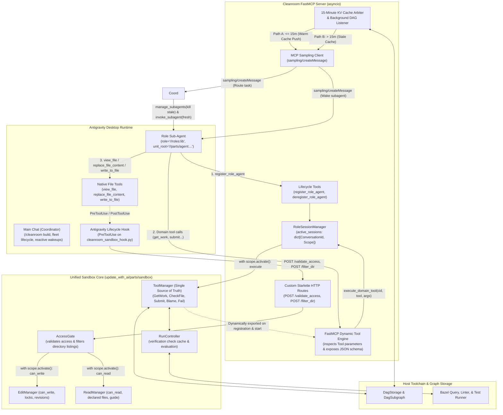
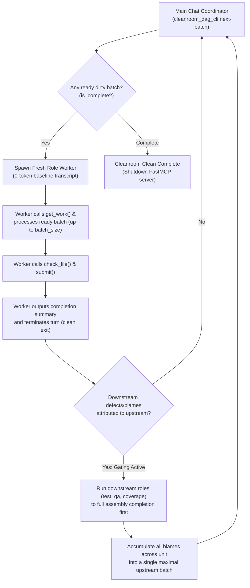

# Cleanroom Bazel Role Sub-Agent FastMCP Server & Unified Sandbox Architecture

This document specifies the design, lifecycle, and sandbox enforcement architecture for the Cleanroom Model Context Protocol (MCP) server supporting **Role Sub-Agents** within the Antigravity desktop orchestration harness, establishing a **unified "double-duty" sandbox core** that powers both desktop MCP sessions and headless in-process execution.

---

## 1. Executive Summary & Goals

In Cleanroom, software construction is modeled as a directed acyclic graph (DAG) of specification, implementation, and test nodes. To execute Cleanroom workflows autonomously in desktop agent environments (such as Antigravity under Google One Ultra subscriptions) without unbounded token consumption or process deadlocks, the orchestration loop is exposed through a centralized, standalone **FastMCP Server**.

Rather than building a disjoint MCP subsystem that duplicates verification caching, blame routing, and file locks, the existing Cleanroom **`sandbox` subsystem (`update_with_ai/parts/sandbox`) plays double duty**: it serves as the single authoritative domain core for both in-process headless runners and external MCP desktop clients.

### Key Architectural Tenets:
1. **Double-Duty Sandbox Core**: The `sandbox` subsystem is the single source of truth for verification caching, file lock tracking, blame routing, and role blindness. FastMCP, headless loop drivers, and lifecycle hooks are surface adapters around this shared core.
2. **Bazel Target Label Addressing**: Sub-agent roles and unit sub-graph roots are identified using standard Bazel target labels (e.g., `//roles:lib`, `//update_with_ai/parts/agent:agent_node_config`).
3. **Unified `conversationId` Identity**: Antigravity automatically provides `conversationId` for all MCP calls (accessible via MCP request context `ctx` or parameter injection) and lifecycle hook events. Using `conversationId` as the primary session key across both MCP tools and hooks guarantees 1:1 identity parity without custom ID tracking.
4. **`ToolManager` as Single Source of Truth & Dynamic FastMCP Export**:
   - `ToolManager` (`tool_provider.ToolManager`) in the `sandbox` subsystem is the **single source of truth** for all domain tools.
   - Any tool installed in `ToolManager` (`get_work`, `check_file`, `submit`, `blame`, `fail`) is **dynamically exported** into FastMCP by `McpServer`. No hardcoded domain tool lists or duplicated MCP tool classes exist. Adding a new tool to `ToolManager` automatically exposes it to MCP clients without server modifications.
   - FastMCP lifecycle tools (`register_role_agent`, `deregister_role_agent`) manage the agent session scope in `RoleSessionManager`.
5. **Topological Wave Batching & Downstream Completion Gating**:
   - The Main Chat coordinator inspects the DAG via `cleanroom_dag_cli next-batch` to discover ready dirty nodes.
   - Execution proceeds in topological wave order: `high` $\to$ `low` $\to$ `lib` $\to$ `test` $\to$ `qa` $\to$ `coverage`.
   - When defects or blame attributions occur, the Coordinator does not immediately restart the upstream role; instead, all downstream roles (`test`, `qa`, `coverage`) run to completion across the entire assembly, accumulating all blames into a single maximal batch before re-launching the upstream worker.
6. **Ephemeral Single-Wave Subagent Lifecycle & Idle Teardown**:
   - Subagents are task-scoped and ephemeral: they start with a 0-token baseline transcript, process a batch of ready files, submit, and terminate their turn.
   - Upon turn completion, Antigravity subagents transition to the `idle` lifecycle state (they do not self-destruct). The Coordinator explicitly deregisters the worker's session via `cleanroom_mcp_client.py deregister` and terminates the subagent process via `manage_subagents(Action="kill")` before launching the next wave.
   - Reusing long-lived subagent threads indefinitely leads to quadratic transcript growth ($O(N^2)$ tokens). Ephemeral workers eliminate this by resetting intermediate scratchpads between waves.
7. **Minimal 3-Tool Native Manifest & Hook Shell Defense**:
   - The worker subagent manifest ([`.agents/agents/cleanroom_role_worker/agent.md`](../.agents/agents/cleanroom_role_worker/agent.md)) strictly limits native tools to: `view_file`, `replace_file_content`, and `write_to_file`.
   - Shell execution (`run_command`) and exploratory search tools (`find_by_name`, `grep_search`, `list_dir`) are completely eliminated, preventing runaway token expenditure on subagent-driven REPL commands or unstructured file hunts.
   - Antigravity's `PreToolUse` lifecycle hook (`cleanroom_sandbox_hook.py`) includes `run_command` in its matcher to fail-close (`deny`) as defense-in-depth against unauthorized execution.
8. **Deterministic Companion Path Injection & Tool Output Compaction**:
   - `get_work` formats task prompts with explicit, deterministic companion paths (specification `.pyi`, implementation `.py`, test `_test.py`, and relevant guide), eliminating the need for directory searches.
   - `check_file` produces a compacted single-line confirmation on pass and isolates relevant compilation or test failures without noisy Bazel build cache or banner text.
9. **Clean Tool Separation**:
   - In **headless mode**, only `ReplaceFileContentTool` exists for file editing (Cleanroom has no `WriteToFileTool` in headless mode; missing files are materialized from startup templates).
   - In **Antigravity desktop mode**, Antigravity provides native `view_file`, `replace_file_content`, and `write_to_file`. The hook access gate validates each against `EditManager.can_write` and `ReadManager.can_read`.
10. **Subagent Discovery & PreToolUse Hook Security Gating**:
    - Antigravity subagent discovery requires subagent definition files (`agent.md`) without `hidden: true`, as setting `hidden: true` removes the subagent from the platform runtime registry, causing `invoke_subagent` to fail with `subagent not found or not allowed to be invoked`.
    - To prevent accidental direct invocations of low-level workers while keeping them discoverable, access control is enforced at runtime via `PreToolUse` on `invoke_subagent` in `cleanroom_sandbox_hook.py`. The hook validates the caller's metadata (`.system_generated/subagents/<conv_id>.json`) and strictly blocks any caller other than `cleanroom_coordinator` from spawning `cleanroom_role_worker`.
11. **Out-of-Band Run Observability, Live Event Timeline (`timeline.md`), and Semantic Transcripts**:
    - Cleanroom manages structured convergence runs under `.cleanroom/runs/<run_id>/`:
      - `timeline.md`: Live markdown table updated in real time by lifecycle hooks and FastMCP CLI operations, capturing every spawn, file read, edit, verification, and submission with zero LLM prompt token consumption.
      - `timeline.log`: Plain-text unbuffered event stream suitable for live console streaming (`tail -f`).
      - `transcripts/`: Semantic symlinks (`00_coordinator.jsonl`, `01_wave1_lib_worker.jsonl`, `02_wave2_qa_worker.jsonl`) pointing to underlying Antigravity brain transcripts, eliminating anonymous UUID confusion.
      - `summary.json`: Final turn counts, token metrics, wave timings, and convergence state.
12. **Three-Tier Autonomous Execution Model**:
    - **Tier 1 (Main Chat)**: User-facing assistant that receives `/cleanroom clean` or `/cleanroom change`, spawns the Cleanroom Coordinator, and displays high-level progress.
    - **Tier 2 (Cleanroom Coordinator)**: Scoped DAG orchestrator (`cleanroom_coordinator`) that runs the wave loop, manages worker lifecycles, and reports convergence without editing code.
    - **Tier 3 (Ephemeral Role Workers)**: Scoped macro-batching workers (`cleanroom_role_worker`) that implement or verify units in single passes and are killed upon wave completion.

---

## 2. System Architecture & Surface Adapters

The system architecture decouples the core domain logic from execution transports by placing `sandbox` at the center of surface adapters, coordinating with Antigravity desktop orchestration via FastMCP Dynamic Tools, MCP Sampling, and Lifecycle Hooks:



---

## 3. Tool Exposure & Cross-Mode Matrix

Because `ToolManager` manages domain tool definitions, and `is_mcp_mode` switches between native file tools and internal access operations:

| Tool / Capability | Headless Mode (CLI / CI) | Antigravity Desktop Mode (MCP) | Antigravity Hook Mode |
| :--- | :--- | :--- | :--- |
| `register_role_agent` | In-process lifecycle setup | **Exposed via FastMCP** | N/A |
| `deregister_role_agent`| In-process phase exit | **Exposed via FastMCP** | N/A |
| `get_work` | **Used to generate session prompt** | **Exposed via FastMCP** (dynamic export from `ToolManager`) | N/A |
| `check_file` | **Exposed** in `ToolManager` | **Exposed via FastMCP** (dynamic export from `ToolManager`) | N/A |
| `submit` | **Exposed** in `ToolManager` | **Exposed via FastMCP** (dynamic export from `ToolManager`) | N/A |
| `blame` | **Exposed** (if blame targets configured) | **Exposed via FastMCP** (dynamic export from `ToolManager`) | N/A |
| `fail` | **Exposed** in `ToolManager` | **Exposed via FastMCP** (dynamic export from `ToolManager`) | N/A |
| `can_read` | Internal operation on `ReadManager` | Internal operation on `ReadManager` | **Queried by AccessGate (`PreToolUse`, `PostToolUse`)** |
| `can_write` | Internal operation on `EditManager` | Internal operation on `EditManager` | **Queried by AccessGate (`PreToolUse`)** |
| `view_file` | **Installed in `ToolManager`** (`ViewFileTool`) | *Omitted from `ToolManager`* (uses Antigravity native) | **Gated by AccessGate (`PreToolUse`)** |
| `replace_file_content` | **Installed in `ToolManager`** (`ReplaceFileContentTool`) | *Omitted from `ToolManager`* (uses Antigravity native) | **Gated by AccessGate (`PreToolUse`)** |
| `write_to_file` | *Not Present* (uses template materialization) | *Not Present* (uses Antigravity native) | **Gated by AccessGate (`PreToolUse`)** |
| `run_command` | *Not Present* (strictly internal) | **Excluded from Subagent Manifest** | **Denied by Hook (`PreToolUse`)** |
| `find_by_name` / `grep_search` / `list_dir` | *Not Present* | **Excluded from Subagent Manifest** (companion paths injected) | **Bypassed / Not installed** |

#### Subagent Native Tool Manifest:
Role workers are governed by [`.agents/agents/cleanroom_role_worker/agent.md`](../.agents/agents/cleanroom_role_worker/agent.md), strictly pinning:
```yaml
tools:
  - view_file
  - replace_file_content
  - write_to_file
```
All other platform tools (`run_command`, `find_by_name`, `grep_search`, `list_dir`, `search_web`, `read_url_content`, `generate_image`, `schedule`, `manage_task`) are omitted from the agent manifest. In addition, `run_command` is explicitly matched in `.agents/hooks.json` to fail closed if invoked.

---

## 4. Addressing & Unified Identity Model

### 4.1 Bazel Target Label Addressing
All references to units, nodes, and engineering roles are expressed as canonical Bazel target labels:
- **Unit Root Label**: Specifies the root of the unit sub-graph to clean, e.g.:
  `//update_with_ai/parts/agent:agent_node_config`
- **Role Label**: Identifies the canonical engineering role target, e.g.:
  `//update_python_with_ai:lib`, `//update_python_with_ai:test`, `//update_python_with_ai:high`, `//update_python_with_ai:qa`, `//update_python_with_ai:coverage`
- **Node Address**: Every cleanable node in Cleanroom has a unique address composed of its unit address and role address:
  `Node(unit_address="//update_with_ai/parts/agent:agent_node_config", role_address="//update_python_with_ai:lib")`

Sub-agents are primed directly with a canonical role address (e.g., `//update_python_with_ai:lib`) and a root unit address (e.g., `//update_with_ai/parts/agent:agent_node_config`). Sub-agents and orchestration services do not depend on, compute, or resolve convenience `define_node` targets.

### 4.2 Unified Conversation Identity (`conversationId`)
Antigravity automatically provides `conversationId` for all MCP tool invocations and lifecycle hook events:
- **Zero-Config Identification**: Sub-agents do not need to invent, pass, or synchronize artificial `agent_id` strings.
- **FastMCP Request Context**: In FastMCP, tool handlers retrieve the Antigravity conversation ID directly from the request context (`ctx: Optional[Context] = None`, via `ctx.client_id` or `ctx.session_id`), defaulting to `"default"` if running outside Antigravity.
- **Unified Registry**: `RoleSessionManager` (`update_with_ai/parts/mcp/lib/mcp_session_impl.py`) indexes all active `RoleAgentSession` and `LifecycleScope` records directly by `ConversationId`.
- **Direct Hook Parity**: When Antigravity's `PreToolUse` or `PostToolUse` hook fires, it receives the exact same `conversationId` on `stdin`. The hook queries `POST /validate_access` with `conversation_id`, enabling instant $O(1)$ scope retrieval and verification without translation layers.

---

## 5. Dynamic Domain Tool Export Architecture

Cleanroom enforces **`ToolManager` as the single source of truth** for all domain tools. Instead of creating parallel MCP tool hierarchies or hardcoded server lists, `McpServer` dynamically introspects domain tools installed in `ToolManager` and exports them directly into FastMCP.

### 5.1 The Canonical `Tool` Protocol

All domain tools in Cleanroom implement the standard `Tool` protocol from `update_with_ai/parts/sandbox/lib/tool_provider.py`:

```python
class ParameterType(Enum):
    STRING = "string"
    INTEGER = "integer"
    BOOLEAN = "boolean"

class Parameter(Protocol):
    @property
    def name(self) -> str: ...
    @property
    def description(self) -> str: ...
    @property
    def type(self) -> ParameterType: ...
    @property
    def optional(self) -> bool: ...

class Tool(Protocol):
    @property
    def name(self) -> str: ...
    @property
    def description(self) -> str: ...
    @property
    def parameters(self) -> Sequence[Parameter]: ...
    def execute(self, **kwargs: Any) -> tool_provider.Response: ...
```

### 5.2 Dynamic FastMCP Callable Generation

In `McpServerImpl._create_fastmcp_tool_callable(tool: Tool)`:
1. **Signature Construction**:
   - Inspects `tool.parameters` and partitions them into required parameters first, followed by optional parameters with `default=None` and `Optional[wire_type]` annotations.
   - Appends a final dependency-injected parameter: `ctx: Optional[Context] = None`.
   - Creates an `inspect.Signature` with parameter metadata and `return_annotation=str`.
2. **FastMCP Registration**:
   - Attaches `__signature__`, `__annotations__`, `__doc__`, and `__name__` to the wrapper function.
   - Registers the wrapper with `app.add_tool(fn)`. FastMCP automatically inspects the function annotations to generate the JSON schema for MCP clients while hiding `ctx` from the public schema.
3. **Execution Routing**:
   ```python
   def dynamic_tool_handler(*args: Any, **kwargs: Any) -> str:
       bound = sig.bind(*args, **kwargs)
       bound.apply_defaults()
       arguments = dict(bound.arguments)
       ctx_val = arguments.pop("ctx", None)

       cid_str = "default"
       if ctx_val is not None and getattr(ctx_val, "client_id", None):
           cid_str = str(ctx_val.client_id)
       cid = mcp_session.ConversationId(cid_str)
       filtered_args = {k: v for k, v in arguments.items() if v is not None}
       return self.execute_domain_tool(cid, tool_name, filtered_args)
   ```

### 5.3 Execution Dispatch & Scope Activation

When `execute_domain_tool` is called:
```python
def execute_domain_tool(
    self,
    conversation_id: mcp_session.ConversationId,
    tool_name: str,
    arguments: Mapping[str, Any],
) -> str:
    session_mgr = get_singleton(mcp_session.RoleSessionManager)
    session = session_mgr.active_sessions.get(conversation_id)
    if session is None or session.scope is None:
        return f"Error: No active session for conversation '{conversation_id}'."

    session_mgr.touch_session(conversation_id)
    with session.scope.activate():
        tool_mgr = session.scope.get_singleton(tool_provider.ToolManager)
        resp = tool_mgr.execute_tool_with_arguments(tool_name, arguments)
        if resp.is_idle:
            session.status = mcp_session.RoleAgentStatus.IDLE
        return resp.content
```

Any tool registered in `ToolManager` (such as `GetWorkTool`, `CheckFileTool`, `SubmitTool`, `BlameTool`, `FailTool`, or any future domain tool) is automatically made available to the MCP agent without updating the MCP server implementation.

### 5.4 FastMCP Lifecycle Tools

FastMCP exposes two lifecycle tools directly to control session scopes:
- **`register_role_agent(role: str, unit_root: str, ctx: Optional[Context] = None) -> str`**:
  Resolves `conversation_id` from `ctx.client_id`, calls `session_mgr.register_session(conversation_id, role, unit_root)`, activates the scope, and dynamically exports any installed tools from `ToolManager` that have not yet been registered on FastMCP.
- **`deregister_role_agent(ctx: Optional[Context] = None) -> str`**:
  Resolves `conversation_id` from `ctx.client_id` and calls `session_mgr.deregister_session(conversation_id)`, closing the session scope and releasing held resources.

---

## 6. Topological Wave Batching, Downstream Completion Gating & Context Reset Architecture

### 6.1 The Long-Lived Transcript Explosion Problem
In early implementations, a fleet of role workers was spawned concurrently and maintained across the entire assembly convergence run. As workers completed turns, their Antigravity conversation transcripts accumulated every file inspection, test output, and intermediate thought.
Because LLM prompt generation resends the entire conversation history on every turn, turn costs scaled quadratically ($O(N^2)$ prompt tokens). In an assembly with 5 modules and 9 defect cycles, reusing long-lived subagent threads generated **~478 Million prompt tokens**, with a single worker accumulating over 1,000 turns and 800k tokens per prompt.

Furthermore, prefix caching provided diminishing returns: workers read files in differing orders and modified buffers, breaking prefix cache alignment, while the 20% uncached tail on an 800k token prompt cost 160k tokens per tool call.

### 6.2 Topological Wave Batching with Downstream Completion Gating
To eliminate quadratic context bloat while maximizing batch efficiency, Cleanroom uses a **Topological Wave Batching** model orchestrated by the Main Chat coordinator:



### 6.3 Operational Invariants of the Wave Batching Pipeline

1. **Topological Wave Scheduling**:
   - The coordinator executes roles in dependency order: `high` $\to$ `low` $\to$ `lib` $\to$ `test` $\to$ `qa` $\to$ `coverage`.
   - At each stage, the coordinator queries `cleanroom_dag_cli next-batch`. If nodes are ready for a role, the worker is spawned.
   - The worker executes its batch and **shuts down cleanly upon submission** (`finish your turn`), completely resetting transcript history.

2. **Downstream Completion Gating**:
   - When a downstream role (`qa` or `test`) blames an upstream dependency (`lib`), the coordinator does **not** immediately interrupt or re-launch the upstream role.
   - Instead, all downstream roles (`test`, `qa`, `coverage`) continue their full pass across the assembly.
   - All defects and blames across all files accumulate into `DagStorage`.
   - Once downstream roles complete their passes, the upstream role is re-launched with a fresh context, allowing it to fix all blamed targets in a single maximal batch.

3. **Mid-Session Token Ceiling Reset Guard (60k–80k Tokens)**:
   - For heavy refactoring workloads spanning many complex targets where no natural gap occurs:
   - Workers are instructed to process files in chunks of 2–3 modules.
   - If a worker's session approaches **60k–80k tokens** (monitored via transcript size $\approx 300\text{--}400\text{ KB}$ JSONL), the worker submits completed targets and exits.
   - The coordinator detects remaining dirty nodes and spawns a fresh subagent with a 0-token baseline transcript.

4. **Non-Blocking Idling Fallback & MCP Sampling**:
   - If a worker calls `get_work` when no nodes are ready, `get_work` returns `status: "IDLE"`.
   - The worker immediately outputs a short standby message and terminates its turn.
   - For environments using long-polling, the FastMCP background task continues to monitor `DagStorage` and can dispatch `sampling/createMessage` notifications, but the primary orchestration pattern relies on coordinator-driven wave dispatch.

---

## 7. Real-Time Confinement via Antigravity Hooks, .mcp.active Sentinel & Access Gate

### 7.1 Access Gate Architecture
In Antigravity Desktop mode, the model uses native `view_file`, `replace_file_content`, and `write_to_file`. The sandbox enforces confinement externally through Antigravity **Lifecycle Hooks** and direct queries to `ReadManager` and `EditManager`.

```python
@dataclass(frozen=True)
class AccessDecision:
    is_allowed: bool
    reason: str
    diagnostic_content: Optional[str] = None

class AccessGate(Protocol):
    def validate_access(
        self,
        conversation_id: mcp_session.ConversationId,
        tool_name: str,
        file_path: str,
    ) -> AccessDecision: ...
```

### 7.2 Workspace Sentinel (`.mcp.active`) Lifecycle & Session Tracking
To ensure that normal development, tests, and pair-programming sessions in the Cleanroom repository never suffer from network probes, process latency, or accidental lockouts, the MCP server manages an ephemeral sentinel file at the workspace root (`/.mcp.active`):

```json
{
  "pid": 54321,
  "port": 8765,
  "subagents": ["16bf1d15-6a0d-4acd-8fef-7e014940b4cf"]
}
```

1. **Startup**: When `cleanroom_mcp_server` starts up, it writes `.mcp.active` recording its process ID (`pid`), listening `port`, and an empty `subagents` list. `/.mcp.active` is added to `.gitignore`.
2. **Registration**: When a sub-agent executes `register_role_agent(role, unit_root)`, `McpServer` records the caller's `conversationId` into `subagents` in `.mcp.active`.
3. **Deregistration**: When `deregister_role_agent()` is called or a session scope closes, the `conversationId` is removed from `subagents`.
4. **Shutdown & Cleanup**: When the server cleanly stops (via `stop()`, `atexit`, or `SIGTERM`/`SIGINT` signal handlers), `.mcp.active` is deleted.

### 7.3 Two-Tier Fail-Safe Hook Logic (`cleanroom_sandbox_hook.py`)
Antigravity executes the hook script on `PreToolUse` for native file operations (`view_file`, `replace_file_content`, `write_to_file`), passing the tool call and caller metadata (including `conversationId`) via `stdin`.

The hook script implements a two-tier fail-safe that guarantees:
- **Zero disruption and zero network calls for pair programming / human use.**
- **Strict fail-closed confinement for subagents if the server crashes (preventing unconfined runs).**

```mermaid
flowchart TD
    Hook["PreToolUse Hook called (stdin)"] --> SentinelCheck{".mcp.active exists?"}
    SentinelCheck -->|No| AllowFast["Decision: ALLOW<br/>(Fast path: normal pair programming)"]
    SentinelCheck -->|Yes| ReadMeta["Read .mcp.active JSON (pid, port, subagents)"]
    
    ReadMeta --> SubagentCheck{"conversationId in subagents?"}
    SubagentCheck -->|No (Pair Programmer / User)| CheckPidDead{"Is PID dead?<br/>(os.kill(pid, 0))"}
    CheckPidDead -->|Yes| CleanStale["Delete stale .mcp.active"] --> AllowUser["Decision: ALLOW"]
    CheckPidDead -->|No| AllowUser
    
    SubagentCheck -->|Yes (Cleanroom Subagent)| CheckPidAlive{"Is MCP PID alive?<br/>(os.kill(pid, 0))"}
    CheckPidAlive -->|Dead / Crashed| DenyCrash["Decision: DENY (FAIL CLOSED)<br/>'Cleanroom MCP server crashed. Access locked down.'"]
    CheckPidAlive -->|Alive| QueryServer["POST /validate_access to 127.0.0.1:port"]
    QueryServer -->|HTTP 200| EnforceGate["Return AccessDecision (ALLOW or DENY)"]
    QueryServer -->|Network Timeout / Error| DenyNet["Decision: DENY (FAIL CLOSED)"]
```

#### The Subagent Crash Failure-Mode Solution:
If the MCP server crashes while a Cleanroom sub-agent is active:
- The caller's `conversationId` is matched in `.mcp.active.subagents`.
- The hook checks `os.kill(pid, 0)`: because the server is dead, the hook **immediately fails closed (`{"decision": "deny"}`)**.
- The subagent is halted immediately on its next file operation. It **never runs wild** across the repository and cannot violate cleanroom role blindness or touch forbidden files.

#### The Developer / Pair-Programmer Bypass:
- The pair-programming session's `conversationId` is never in `subagents`.
- The hook immediately returns `{"decision": "allow"}` without making any network calls.
- If the server has died, the pair-programmer's call cleans up the stale `.mcp.active` file so subsequent tool calls take the instant fast-path.

### 7.4 Gate Delegation to `ReadManager` and `EditManager`
Inside `AccessGateImpl` (on the running server):
1. Looks up the session scope in `RoleSessionManager` for `conversation_id` and activates it with `with scope.activate():`.
2. Normalizes `file_path` against workspace root. If the path attempts to traverse outside the workspace, it immediately denies access.
3. Dispatches directly to session singletons:
   - **For writes (`replace_file_content`, `write_to_file`)**:
     Calls `edit_mgr = scope.get_singleton(sandbox_file_editor.EditManager)`
     Invokes `resp = edit_mgr.can_write(rel_path)`
   - **For reads (`view_file`)**:
     Calls `read_mgr = scope.get_singleton(sandbox_file_reader.ReadManager)`
     Invokes `resp = read_mgr.can_read(rel_path)`

### 7.5 Hook Configuration (`.agents/hooks.json`)

```json
{
  "cleanroom-sandbox-guard": {
    "enabled": true,
    "PreToolUse": [
      {
        "matcher": "view_file|replace_file_content|write_to_file|run_command",
        "hooks": [
          {
            "type": "command",
            "command": "python3 update_with_ai/support/lib/cleanroom_sandbox_hook.py",
            "timeout": 5
          }
        ]
      }
    ]
  }
}
```

---

## 8. Critical Technical Considerations & Implementation Patterns

### 1. Lifecycle Scope Management across Asynchronous JSON-RPC Turns
- **The Problem**: Cleanroom's canonical `support/lib/lifecycle.py` traditionally used synchronous context managers (`with enter_phase(agent_session): ...`) that set a `ContextVar[Optional[LifecycleScope]]`. In an asynchronous MCP server, incoming JSON-RPC calls arrive as separate asyncio tasks. Exiting a tool handler exits the task context, which would prematurely tear down the session if wrapped in `with enter_phase`.
- **Implementation**:
  1. `LifecycleScope` provides:
     - `begin_phase(tier, registry, ...)`: Creates the unmanaged scope and initializes startup singletons without binding to a context manager.
     - `scope.activate()`: A lightweight context manager (`with scope.activate(): yield`) that temporarily sets `_active_scope` for the duration of a single MCP tool turn or hook evaluation, allowing `get_singleton(...)` to resolve session singletons for that conversation.
     - `scope.close()`: Explicitly executes singleton teardowns in reverse instantiation order (LIFO).
  2. `RoleSessionManager` maintains `active_sessions: dict[ConversationId, RoleAgentSession]`.
  3. `register_role_agent` calls `begin_phase(agent_session)` and stores the session.
  4. Each domain tool handler and access gate evaluation activates the scope for that conversation ID.
  5. `deregister_role_agent` (or `stop()`) calls `scope.close()` and evicts the entry from `active_sessions`.

### 2. Antigravity Hook Contract Immutability
- Antigravity's `PostToolUse` contract receives `{stepIdx, error}` and returns `{}` on `stdout`. It cannot rewrite or filter tool output (e.g., directory listings).
- Therefore, all access gating and containment occurs strictly in `PreToolUse` (`decision: "deny" | "allow"`).

### 3. Starlette Custom Routes for Dual-Transport Hook IPC
- Starlette custom route `/validate_access` is mounted directly on the FastMCP application via `@app.custom_route(...)`.
- When running in SSE mode or behind an ASGI server, the hook queries the same HTTP host and port used for MCP JSON-RPC.

### 4. Absolute Path Canonicalization & Symlink Resolution
- Antigravity native file tools pass host absolute paths. `AccessGate` canonicalizes paths using `os.path.relpath(os.path.abspath(path), workspace_root)`, rejecting any path that traverses outside the workspace boundary before evaluating `can_read` or `can_write`.

### 5. Startup Template Materialization Timing
- When `get_work` is called, `EditManager.materialize_templates()` formats and creates any missing source files on disk before returning the task prompt, ensuring files exist when the sub-agent calls native `view_file` or `replace_file_content`.

### 6. Microsecond Process Liveness & Two-Tier Fail-Safe
- Checking server liveness via `os.kill(pid, 0)` is an in-kernel process table lookup taking `< 5 microseconds`, avoiding network sockets or port probing when detecting whether a server has crashed.
- Hook timeout in `.agents/hooks.json` is budgeted tightly (3–5 seconds) to prevent freezing IDE interactions.
- Two-tier fail-safe: Fail-open for developer pair programming, fail-closed for registered role sub-agents.

### 7. Headless & Desktop Configuration Parity (`McpConfig`) & Batch Scaling
- `McpConfig` implements `agent_config.AgentConfig` and `dag_config.DagConfig`, defaulting `is_mcp_mode=True`, `startup_reads=False`, and `batch_size=10`.
- In headless execution, `agent_config` sets `is_mcp_mode=False`, causing `ReadManager` and `EditManager` to install `view_file` and `replace_file_content` into `ToolManager`.
- In desktop MCP execution, `is_mcp_mode=True` suppresses those file tools from `ToolManager`, delegating to Antigravity's native file tools gated by `AccessGate`.
- **Early Environment Extraction**: The MCP runner entrypoint (`cleanroom_mcp_runner_impl.py`) extracts `--batch-size` (defaulting to 10) directly into `os.environ["BATCH_SIZE"]` prior to system phase instantiation, ensuring `McpConfig` and `DagSubgraph` initialize with batch size 10.

### 8. Multi-Session Isolation & Conversation Routing (`--session <role>`)
- **The Problem**: When multiple sub-agents run concurrently within the same workspace, tool requests arriving without explicit session context collisioned on a single `"default"` session key, leading to registration errors (`Session 'default' already registered`).
- **Resolution**:
  - `McpServer` registers tools with an explicit `conversation_id: Optional[str] = None` parameter.
  - The CLI client (`cleanroom_mcp_client.py`) provides `--session <role>` across all commands, routing calls to isolated `RoleAgentSession` phase scopes.
  - Single-session fallback: When omitted, if exactly one active session is registered, the call resolves to that session automatically; otherwise, it requires `--session`.

### 9. DAG Target Preservation across Out-of-Order Role Registration
- **The Problem**: `DagSubgraph` is a system-tier singleton shared by all role sessions. In multi-role builds, downstream roles (e.g. `qa`) depend on upstream roles (`test`, `lib`, `low`, `high`). If upstream workers registered after downstream workers, calling `subgraph.set_target(upstream_node)` unconditionally truncated `subgraph._nodes` to only encompass nodes up to that upstream role, cutting off downstream nodes from the active graph.
- **Resolution**: In `mcp_session_impl.py`, `subgraph.set_target(root_node)` is guarded:
  ```python
  current_root = getattr(subgraph, "_root", getattr(subgraph, "target", None))
  current_nodes = getattr(subgraph, "_nodes", None)
  if current_root is None or current_nodes is None or root_node not in current_nodes:
      subgraph.set_target(root_node)
  ```
### 10. Graceful Server Shutdown & Process Teardown (`shutdown` tool)
- The server exposes a `shutdown()` tool callable over MCP.
- Invoking `shutdown()` calls `self.stop()`, cancels background cache monitor tasks, removes `.mcp.active`, and triggers clean daemon process exit via a background timer thread (`time.sleep(0.5); os._exit(0)`).
- The orchestrator invokes `shutdown` as soon as the DAG converges, ensuring zero dangling background processes.

### 11. Deterministic Companion Path Injection in `get_work`
- **The Problem**: Previously, `get_work` provided bare target addresses without companion paths, leading workers to call `find_by_name` (22 calls) and `grep_search` (72 calls) to locate relevant files or look for mock examples in forbidden directories (e.g. `testing/`).
- **Resolution**: In `sandbox_run_control_impl.py` (`format_task_prompt`), each assigned target is formatted with its exact, deterministic companion paths:
  - Unit specification: `grounding/<unit>.pyi`
  - Unit implementation: `lib/<unit>.py`
  - Unit tests: `tests/<unit>_test.py`
  - Unit guide: `update_python_with_ai/guides/<role_guide>.md`
- This completely eliminates the need for filesystem search tools and ensures strict compliance with workspace boundary rules.

### 12. Compact Verification Check Diagnostics
- **The Problem**: `check_file` previously returned voluminous Bazel build execution banners, cache notices, and toolchain logs even on successful checks, bloating the prompt context on every edit cycle.
- **Resolution**: In `sandbox_run_control_impl.py` (`CheckFileTool.execute_tool`), `check_file` returns a clean 1-line confirmation on pass (`Verification passed: All checks succeeded.`). On failure, it strips execution progress banners and isolates only relevant syntax/type errors or unittest tracebacks.

### 13. `DagStorage` & DAG CLI Topological Wave Integration (`next-batch`)
- **The Problem**: Orchestrators needed a fast, authoritative way to query ready dirty nodes and topological order without maintaining stateful in-memory graph walkers in the coordinator.
- **Resolution**: `cleanroom_dag_cli.py next-batch` uses `DagSubgraph.next_ready_batch()` and `DagStorage.is_dirty()` to inspect active subgraphs. Reverse dependencies and pending `Change`/`Feedback` messages persist in `.update_with_ai.textproto` via `BazelStorageImpl`, surviving ephemeral subagent shutdowns and enabling perfect coordination across successive wave launches.

---

## 9. Top-Level Antigravity Skill Orchestration (`/cleanroom clean`) & Fleet Lifecycle

### 9.1 Main Chat as Native Coordinator
Rather than spawning an intermediate subagent to coordinate workers, the **Main Chat conversation serves as the primary coordinator**:
- **Zero Nested Overhead**: Avoids nested `invoke_subagent` layers, keeping token costs minimal.
- **Direct Workspace Visibility**: All role workers appear directly in Antigravity's subagent side panel, where their progress, tool steps, and transcripts can be inspected live.
- **Reactive Wakeups**: Antigravity automatically wakes up the Main Chat whenever a subagent finishes a turn or reports completion, eliminating busy-polling loops.

### 9.2 Command Syntax & Subgraph Role Resolution
The workflow uses the Cleanroom concept of **cleaning** nodes (transitioning nodes in the DAG from `dirty` to `clean` via specification, implementation, test, and verification):

#### A. Shortcut Target Form (`define_node` targets)
Users can specify a single `define_node` target shortcut, which automatically resolves to its constituent unit and role:
```
/cleanroom clean <define_node-target>
```
Example:
```
/cleanroom clean //testing/parts/sandbox:sandbox_asm_qa
```
*Resolution*:
- Target package and name `//testing/parts/sandbox:sandbox_asm_qa`
- Role suffix `_qa` resolves to role `//update_python_with_ai:qa`
- Base name resolves to unit `//testing/parts/sandbox:sandbox_asm`

#### B. Canonical Two-Argument Form
Alternatively, users can specify the target role address and unit address explicitly:
```
/cleanroom clean <role-address> <unit-address>
```
Example:
```
/cleanroom clean //update_python_with_ai:qa //testing/parts/sandbox:sandbox_asm
```
*(Accepts convenience labels such as `qa`, `:qa`, or full Bazel target `//update_python_with_ai:qa`).*

#### Execution Steps:
1. **Target & Role Resolution**:
   - Parses the input arguments (supporting either the single `define_node` target shortcut or the two-argument `(role, unit)` pair).
   - If needed, queries Bazel attributes (`labels(unit, target)`, `labels(role, target)`).
   - Resolves all upstream dependency roles in topological execution order:
     $$\text{Roles} = \{ n.\text{role\_address} \mid n \in \text{SubgraphNodes} \land n.\text{role\_address} \neq \emptyset \}$$
     *(e.g., for `qa`, discovering `high`, `low`, `lib`, `test`, and `qa`).*
2. **Server Liveness**: Checks `.mcp.active`. If absent or dead, launches the Cleanroom FastMCP server in the background:
   ```bash
   python3 update_with_ai/parts/systems/lib/cleanroom_mcp_runner_impl.py --transport sse --port 8765 --batch-size 10
   ```
3. **Subgraph Initialization**:
   - Initializes `root = Node(unit_address, role_address)` in `DagSubgraph.set_target(root)`.

### 9.3 Topological Wave Batching & Ephemeral Worker Lifecycle
Rather than launching a long-lived fleet of workers that idle concurrently, the Coordinator executes tasks in **topological waves**:

#### The Wave Dispatch Loop:
1. **Query Next Ready Batch**:
   The Coordinator runs:
   ```bash
   python3 update_with_ai/support/lib/cleanroom_dag_cli.py next-batch <target>
   ```
   - If `"is_complete": true`: All nodes in the target subgraph are clean. Skip to **Teardown**.
   - If `"batch"` is non-empty: Identify the `ready_role` and the assigned nodes.

2. **Spawn Task-Scoped Ephemeral Worker**:
   The Coordinator spawns a single worker for `ready_role` using `invoke_subagent`:
   ```python
   invoke_subagent(
       Subagents=[
           {
               "TypeName": "cleanroom_role_worker",
               "Role": f"{role_name} Worker",
               "Prompt": (
                   f"You are the Cleanroom role worker for role '{role_addr}' at unit '{unit_addr}'.\n"
                   f"1. Register your session:\n"
                   f"   register_role_agent(role='{role_addr}', unit_root='{unit_addr}')\n"
                   f"2. Work loop:\n"
                   f"   Call get_work() to receive your assigned batch of files.\n"
                   f"   - For each file in the batch:\n"
                   f"     Inspect using view_file, apply edits using replace_file_content or write_to_file.\n"
                   f"     Verify using check_file(path='<file>').\n"
                   f"     Submit using submit(target='<file>', change_summary='<summary>').\n"
                   f"     If defects are found in upstream dependencies, attribute them using blame(target='<file>', blame_target='<dep_file>', explanation='<reason>').\n"
                   f"3. When you have submitted all targets in your batch:\n"
                   f"   Output a concise completion summary and finish your turn immediately."
               )
           }
       ]
   )
   ```

3. **Autonomous Execution & Clean Shutdown**:
   - The worker executes with a **0-token baseline history**.
   - Native file operations (`view_file`, `replace_file_content`, `write_to_file`) are validated by `cleanroom_sandbox_hook.py`.
   - Shell execution is denied by both the agent manifest and the lifecycle hook.
   - Upon submitting its assigned batch, the worker **terminates its turn**. No long-lived idle state is maintained.

4. **Downstream Completion Gating**:
   - If a downstream role (`qa` or `test`) blames an upstream dependency (`lib`), the Coordinator continues executing all remaining downstream checks across the unit before re-dispatching `lib`.
   - All blames accumulate in `DagStorage`. When `lib` is subsequently re-launched, it receives the complete batch of all blamed targets at once.

5. **DAG Convergence & Complete Teardown**:
   - When `next-batch` reports `"is_complete": true`, the Coordinator terminates any dangling subagents via `manage_subagents(Action="kill_all")`.
   - The Coordinator shuts down the server:
     ```bash
     python3 update_with_ai/support/lib/cleanroom_mcp_client.py shutdown
     ```

### 9.4 Change Injection & Incremental Re-dirtying (`/cleanroom change`)
To initiate work or trigger incremental refactors from the chat:
```
/cleanroom change <define_node-target> "<change description>"
# or
/cleanroom change <unit-address> <role-address> "<change description>"
```
- Attaches a `Change(content=...)` message to the target node in `DagStorage`.
- Persists to `.update_with_ai.textproto` in the target package directory.
- When followed by `/cleanroom clean`, the wave batching loop incrementally cleans strictly the dirty node and its affected downstream dependents.

---

## 10. Subagent Discovery, Access Gating, and Ephemeral Lifecycle Governance

### 10.1 Discovery vs. Confinement (`hidden: true` Antigravity Gotcha)
When integrating subagents into Antigravity via declarative manifests (`.agents/agents/<name>/agent.md`), setting `hidden: true` removes the agent from the platform's runtime subagent catalog. Consequently, `invoke_subagent(TypeName="cleanroom_role_worker")` fails unconditionally with:
```
subagent not found or not allowed to be invoked
```
To keep `cleanroom_role_worker` discoverable to the platform while strictly prohibiting developers, pair programmers, or unauthorized parent agents from bypassing the coordinator, Cleanroom employs **runtime hook gating**:
1. **Discoverable Worker Manifest**: `cleanroom_role_worker/agent.md` declares its role and tools without `hidden: true`.
2. **PreToolUse Hook Authorization**: In `cleanroom_sandbox_hook.py`, every `invoke_subagent` invocation is intercepted:
   - If `TypeName == "cleanroom_role_worker"`, the hook checks the caller's conversation metadata (`.system_generated/subagents/<conv_id>.json`).
   - If the caller's `typeName` is NOT `cleanroom_coordinator`, the hook issues `{"decision": "deny"}` with an explicit security violation message.
   - This fail-safe operates before the subagent process is ever spawned.

### 10.2 Idle State Management & Teardown
In Antigravity's runtime model, subagents that finish executing a turn transition to `state: "idle"`; they do not terminate automatically. Leaving idle subagents running leads to zombie processes, resource contention, and memory leaks.
The Cleanroom lifecycle mandates:
1. **Explicit Session Deregistration**: Before terminating a worker, the coordinator executes:
   ```bash
   python3 update_with_ai/support/lib/cleanroom_mcp_client.py --session <session_id> deregister
   ```
2. **Subagent Process Termination**: The coordinator terminates the worker:
   ```python
   manage_subagents(Action="kill", ConversationIds=[worker_conv_id])
   ```
3. **Consolidated Turnaround**: The coordinator combines deregistration, subagent termination, next batch query, and worker dispatch into a single model turn, minimizing orchestration latency.

---

## 11. Out-of-Band Run Observability, Live Event Timeline (`timeline.md`), and Semantic Transcripts

### 11.1 The Run Directory Layout (`.cleanroom/runs/<run_id>/`)
Every Cleanroom convergence run automatically provisions an isolated, structured run directory:
```text
.cleanroom/
├── active_run.json                 # Pointer to currently executing run
└── runs/
    ├── latest -> 20260922_120000_sandbox_asm_qa/
    └── 20260922_120000_sandbox_asm_qa/
        ├── timeline.md             # Formatted live Markdown table
        ├── timeline.log            # Plain-text unbuffered stream for tail -f
        ├── summary.json            # Final metrics: timings, turns, token savings
        └── transcripts/            # Semantic symlinks to Antigravity brain transcripts
            ├── 00_coordinator.jsonl        -> ~/.gemini/.../ebdea883.../transcript.jsonl
            ├── 01_wave1_lib_worker.jsonl   -> ~/.gemini/.../b76a484d.../transcript.jsonl
            └── 02_wave2_qa_worker.jsonl    -> ~/.gemini/.../f860b51b.../transcript.jsonl
```

### 11.2 Zero-Token Out-of-Band Event Logging
Logging is populated entirely out-of-band via **Antigravity Lifecycle Hooks** (`cleanroom_sandbox_hook.py`) and **FastMCP CLI Handlers** (`cleanroom_mcp_client.py`), consuming zero LLM prompt tokens or output turns:
- **FastMCP CLI Operations**: `cleanroom_mcp_client.py` logs high-level milestone events (`NEXT_BATCH`, `REGISTER`, `GET_WORK`, `CHECK_FILES`, `SUBMIT`, `BLAME`, `DEREGISTER`, `SHUTDOWN`).
- **Platform Lifecycle Hooks**: `cleanroom_sandbox_hook.py` logs tool-level operations (`SPAWN`, `READ`, `EDIT`) and creates semantic transcript symlinks dynamically as conversation IDs are first observed.

### 11.3 Live Monitoring
Developers can monitor live convergence without querying subagent APIs or parsing JSON:
```bash
# Watch live Cleanroom progress:
tail -f .cleanroom/runs/latest/timeline.log

# Or view formatted Markdown in the IDE:
# Open .cleanroom/runs/latest/timeline.md
```

