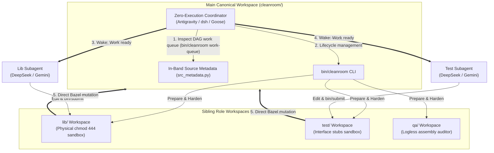

# Cleanroom Cleaning Paradigms: Architecture, Implementation Reality, and Evolution

This document specifies the three distinct paradigms implemented in Cleanroom for executing DAG node cleaning, evaluates their operational and token cost characteristics, details the turn-down rationale for the subagent-based approach (Option 2), and articulates the architectural roadmap for future multi-agent workflows.

---

## 1. Executive Summary & Paradigm Overview

In Cleanroom, software construction is modeled as a directed acyclic graph (DAG) of specification, implementation, test, and verification nodes. **Cleaning** refers to transitioning nodes from `dirty` (out of date, modified upstream, or failing verification) to `clean` (verified against specifications and compliant with all behavioral contracts).

Cleanroom has developed and evaluated three distinct cleaning paradigms:

```
┌───────────────────────────────────────────────────────────────────────────────────────────────────────────────────┐
│                                           Cleanroom Cleaning Paradigms                                            │
├───────────────────────────────┬─────────────────────────────────┬───────────────────────────────┬─────────────────┤
│ Option 1: Headless Loop       │ Option 2: Antigravity Subagents │ Option 3: Subagentless        │ Option 4:       │
│ (Custom OpenAI API Loop)      │ (Server + Python Exec)          │ Cleanroom Workspaces          │ Subagent-Driven │
├───────────────────────────────┼─────────────────────────────────┼───────────────────────────────┼─────────────────┤
│ • In-process Python engine    │ • In-tree Coordinator & Role    │ • Sibling isolated workspaces │ • Multi-harness │
│ • Direct OpenAI API calls     │   Worker subagents              │   (../role_workspaces/)       │   (Antigravity, │
│ • Completely headless / CI    │ • FastMCP / HTTP daemon         │ • Separate conversational     │   dsh, Goose)   │
│ • Custom turn & token guard   │ • Subagents execed Python CLI   │   chats per role in IDE       │ • Zero-exec     │
│ • Paid API token billing      │   commands into local server    │ • 4-tier OS & policy sandbox  │   coordinator   │
│                               │ • Extreme token bloat & quota   │ • Maximum prompt-cache hits   │ • DeepSeek-V4   │
│                               │   exhaustion under Google Ultra │ • Zero subagent tax           │   Flash & Gemini│
├───────────────────────────────┼─────────────────────────────────┼───────────────────────────────┼─────────────────┤
│ Status: Production (Headless) │ Status: Failed & Turned Down    │ Status: Primary (Interactive) │ Status: Designed│
└───────────────────────────────┴─────────────────────────────────┴───────────────────────────────┴─────────────────┘
```

### Strategic Decisions
1. **Option 2 is permanently turned down**: Decommissioned due to extreme token costs, quota exhaustion, and reliance on shell-exec HTTP client scripts (see [`antigravity_integration_failed.md`](file:///Users/seanmcdirmid/projects/cleanroom/design-docs/antigravity_integration_failed.md)).
2. **Option 3 is the primary interactive architecture**: Subagentless cleanroom workspaces with separate conversational chats provide strict multi-role double-blind isolation at a fraction of the token cost, leveraging standard IDE prompt caching and direct user oversight (see [`subagentless_cleanroom_workspaces.md`](file:///Users/seanmcdirmid/projects/cleanroom/design-docs/subagentless_cleanroom_workspaces.md)).
3. **Option 4 drives Option 3 workspaces via autonomous subagents**: Specified in [Subagent-Driven Cleanroom Workspaces](file:///Users/seanmcdirmid/projects/cleanroom/design-docs/subagent_driven_cleanroom_workspaces_todo.md), Option 4 layers a zero-execution coordinator on top of Option 3's pre-confined sibling workspaces, supporting **Google Antigravity**, **DeepSeek Harness (`dsh`)**, and **Goose**, leveraging low-cost **DeepSeek-V4 Flash** and enabling side-by-side model comparison.

---

## 2. Option 1: Headless Loop (Custom OpenAI API Loop)

### 2.1 Architectural Structure
Option 1 is Cleanroom's canonical headless runtime, designed for unattended batch execution, CI verification, and regression testing without requiring an IDE or GUI desktop client:

- **Loop Scheduling (`update_with_ai/parts/loop`)**:
  - `LoopCleaner` (`loop_cleaner_impl.py`): Walks the target `DagSubgraph` in dependency-first topological order, batching ready dirty nodes and halting if node cleaning fails.
  - `LoopNodeCleaner` (`loop_node_cleaner_impl.py`): Binds an `agent_session` for each node batch, delivers role-specific guidance, manages file aliasing, and evaluates convergence.
  - `LoopDriver` (`loop_driver.py`): Protocol defining autonomous turn execution.
  - `LoopGuard` (`loop_guard_impl.py`): Enforces conversation turn budgets and token limits, pruning old turns to keep context within model window thresholds.
- **Model Provider (`update_with_ai/parts/openai`)**:
  - `OpenAIDriver` (`openai_driver_impl.py`): Implements `LoopDriver` using the official `openai` Python SDK. Converts Cleanroom sandbox tools (`view_file`, `replace_file_content`, `check_file`, `submit`, `blame`) into OpenAI function schemas, executes LLM turns, repairs malformed tool call JSON, and maps tool outputs back into conversation history.
  - `OpenAIConversation` (`openai_conversation_impl.py`): Tracks message histories across system, user, assistant, and tool turns.
  - `OpenAIConfig` (`openai_config.py`): Supplies model parameters (`model_name`, temperature, token ceilings).
- **System Assemblies (`update_with_ai/parts/systems`)**:
  - `bazel_openai_loop_asm`: Assembles the complete headless pipeline with `bazel_asm`, `dag_asm`, `sandbox_asm`, `parts/loop`, and `parts/openai`.

### 2.2 Operational Characteristics
- **Execution**: Run directly via Bazel:
  ```bash
  bazel run //update_with_ai/parts/systems:sandbox_asm_openai_loop -- //staging/parts/sandbox:sandbox_asm_qa
  ```
- **Confinement**: In-process sandbox gating (`ReadManager.can_read`, `EditManager.can_write`). The agent cannot break out because it only has access to the tool functions passed to the OpenAI API socket.
- **Billing**: Billed directly per token via OpenAI API keys.
- **Role in Ecosystem**: Retained as the production headless driver for non-interactive automation and benchmark testing.

---

## 3. Option 2: Antigravity Subagents via Local Server & Python Exec

### 3.1 Design Intent vs. Implementation Reality

Option 2 was designed to bring autonomous Cleanroom convergence into Google Antigravity under personal Google One Ultra subscriptions, avoiding per-token cloud API billing by using the IDE's built-in Gemini execution environment.

#### The Intended Design (Native FastMCP Server):
As specified in [antigravity_integration.md](file:///Users/seanmcdirmid/projects/cleanroom/design-docs/antigravity_integration.md) and [bazel_role_mcp_server.md](file:///Users/seanmcdirmid/projects/cleanroom/design-docs/bazel_role_mcp_server.md):
- A centralized **FastMCP Server** (`cleanroom_mcp_runner_impl.py`) was intended to export dynamic MCP tools directly into Antigravity.
- The Main Chat or Coordinator Subagent would spawn ephemeral role workers (`cleanroom_role_worker`).
- Role workers would invoke native MCP tools (`get_work`, `check_file`, `submit`, `blame`, `fail`) directly through the platform MCP client, while file operations were intercepted and secured by Antigravity lifecycle hooks (`cleanroom_sandbox_hook.py`).

#### What Was Actually Implemented:
In practice, due to platform constraints around dynamic tool registration, permission scoping, and subagent tool manifests:
1. **Server Exists but Is Not Called Natively**: The FastMCP/HTTP server ran as an out-of-process daemon on `127.0.0.1:8765`.
2. **Subagents Executed Shell Commands**: Rather than calling MCP tools through the model's native function-calling interface, subagents were instructed via their prompts to run shell commands (`run_command`) that executed a Python client script:
   ```bash
   python3 -m update_with_ai.parts.antigravity.lib.antigravity_mcp_client_impl --session <session_id> register --role "<role>" --unit "<unit>"
   python3 -m update_with_ai.parts.antigravity.lib.antigravity_mcp_client_impl --session <session_id> get-work
   python3 -m update_with_ai.parts.antigravity.lib.antigravity_mcp_client_impl --session <session_id> check-files
   python3 -m update_with_ai.parts.antigravity.lib.antigravity_mcp_client_impl --session <session_id> submit --target <path> --change-summary "<summary>"
   ```
3. **The Server Became a Python Exec Gateway**: The FastMCP server effectively functioned as a local HTTP RPC endpoint for subprocess commands executed by the agent's shell tool, rather than an interactive tool provider for the LLM.

### 3.2 The Subagent Cost & Quota Crisis

Executing this architecture inside Antigravity revealed prohibitive token and quota costs under Google One Ultra plans:

1. **Subagent Instantiation Overhead (The Subagent Tax)**:
   Every `invoke_subagent` invocation provisions a brand-new conversation session. Antigravity injects the full system preamble, workspace instructions, AGENTS.md rules, and tool descriptions into every worker. Spawning workers across a multi-stage pipeline (`high` $\to$ `low` $\to$ `lib` $\to$ `test` $\to$ `qa` $\to$ `coverage`) repeatedly burns tens of thousands of tokens per worker on boilerplate setup.
2. **Prompt Repetition Across Turns**:
   Because workers ran sequential shell commands (`register` $\to$ `get-work` $\to$ `check-files` $\to$ `submit`), each intermediate turn accumulated prior shell outputs and logs. In multi-file refactoring runs, worker transcripts expanded rapidly to 60k–100k+ tokens.
3. **Coordinator Polling / Turn Multiplication**:
   The Coordinator subagent ran turns to parse worker status, execute step commands, spawn next workers, and handle wakes. This multi-agent hierarchy consumed multiples of the tokens required for the actual code editing.
4. **Quota Burnout**:
   Under Google One Ultra, high-tier models operate under a sliding 5-hour rolling limit and weekly quota buckets. A single multi-node cleaning session using tiered subagents could completely exhaust the 5-hour quota in under 30 minutes, locking the user out of the IDE.

### 3.3 Turn-Down Rationale for Option 2
Option 2 is a primary candidate for turn-down because:
- **Architectural Deviation**: It did not achieve seamless native MCP tool invocation; it became an indirect harness where subagents ran shell commands to execute Python scripts that made HTTP requests to a local daemon.
- **Prohibitive Cost**: Subagents are simply too expensive for Cleanroom's fine-grained, multi-role iterative DAG cleaning under current subscription models.
- **Superior Alternative Available**: Option 3 (Subagentless Cleanroom Workspaces) achieves complete multi-role isolation, stronger security guarantees, and dramatically lower token consumption without any background daemons or subagents.

---

## 4. Option 3: Subagentless Cleanroom Workspaces (Separate Workspaces & Chats)

### 4.1 Architectural Structure

Option 3 replaces subagents entirely by moving the isolation boundary from the **agent lifecycle** to the **filesystem and workspace environment**.

```
                           CANONICAL REPOSITORY
                     (/Users/.../projects/cleanroom)
                                   │
              bin/get_work (pull)  │   bin/submit (direct mutation)
         ┌─────────────────────────┴─────────────────────────┐
         ▼                                                   ▼
ROLE WORKSPACE: lib                                 ROLE WORKSPACE: test
(../role_workspaces/cleanroom_lib_<dir>)             (../role_workspaces/cleanroom_test_<dir>)
├── AGENTS.md (Lib Engineer)                        ├── AGENTS.md (Test Engineer)
├── .cleanroom_role.json (Pathless descriptor)      ├── .cleanroom_role.json (Pathless descriptor)
├── bin/get_work, bin/submit, bin/fail              ├── bin/get_work, bin/submit, bin/blame, bin/fail
├── parts/<unit>/lib/ (Read/Write, In-Band Meta)    ├── parts/<unit>/tests/ (Read/Write, In-Band Meta)
├── parts/<unit>/grounding/ (chmod 444)             ├── parts/<unit>/grounding/ (chmod 444)
└── (tests/ completely omitted)                     ├── parts/<unit>/lib/ (READ-ONLY STUBS, chmod 444)
                                                    └── (real lib/ code completely omitted)
          ▲                                                   ▲
          │                                                   │
Interactive Chat: Lib                               Interactive Chat: Test
(User/Agent pair session)                           (User/Agent pair session)
```

### 4.2 Core Confinement & Verification Mechanics

1. **Physical Directory Isolation (`../role_workspaces/<workspace-name>_<role>_<dir>/`)**:
   Workspaces are provisioned as visible sibling folders scoped strictly to a single directory. They contain no `.git` metadata and no paths back to the canonical repository, completely preventing git sniffing or shell traversal leaks. The canonical repository is resolved relatively via convention (`../../<workspace_name>`).
2. **Four-Tier Confinement Defense**:
   - *Tier 1 (Structural Oblivion)*: Unreferenced roles are not copied; real `lib` code never enters `test`, and `test` code never enters `lib`.
   - *Tier 2 (Antigravity Policy)*: `fileAccessPolicy: AGENT_SETTING_POLICY_DENY` blocks tool calls targeting paths outside the workspace.
   - *Tier 3 (OS Kernel Hardening)*: Specifications (`grounding/*.pyi`, `grounding/*.gt`), configs, and build files are set to `chmod 444`. Edits fail at the OS level.
   - *Tier 4 (AGENTS.md Invariants)*: Strict instructions forbid `chmod`, `git`, or parent directory traversal. Mandatory execution of `bin/get_work` ensures fresh contracts.
3. **Read-Only Interface Stubs for Double-Blind Testing**:
   To allow the Test role to compile and type-check tests (`bazel test ..._test_type_check`) without seeing the real implementation, the workspace generator derives pure interface stubs from `.pyi` grounding specifications (`raise NotImplementedError`). Symbols match exactly, but real code is completely absent.
4. **Stage 0 Hermetic Tool Bundles**:
   Meta-tools like `bin/grounding_tool` are packaged as frozen standalone zipapp bundles, decoupling verifier execution from mutable local workspace files.
5. **Zero-Sync Direct Bazel Mutations & Inbound Pull**:
   Operates via in-band comment headers (`LAST_CLEANED`, `LAST_CHANGED`, `<ROLE>_AUDIT`), direct-to-main Bazel submissions (`_submit`), and immediate blame injection (`_blame`), eliminating manual synchronization sweeps and intermediate buffer files. Managed via `bin/cleanroom`.

### 4.3 Why Option 3 is Dramatically More Cost-Efficient

| Factor | Option 2 (Antigravity Subagents) | Option 3 (Subagentless Workspaces) |
| :--- | :--- | :--- |
| **Session Model** | Autonomous subagents spawned in parent chat | Standard interactive chat per workspace |
| **Prefix Caching** | Low (workers read files in varied orders, short lifetimes) | **Very High** (persistent chat history caches static instructions & files) |
| **Initialization Cost** | Subagent tax on every spawn (full preamble + tool schema) | **Zero** (single conversational session per role) |
| **Turn Overhead** | High (coordinator wakes, polling, subagent coordination) | **Minimal** (direct user-steered or work-order-driven turns) |
| **Token Consumption** | Multiplied $3\times\text{--}5\times$ across agent tree | **Baseline $1\times$** (equivalent to standard pair programming) |
| **Quota Sustainability** | Depletes 5-hour quota rapidly on small batches | **Sustainable** for full days of active development |
| **Failure Recovery** | Complex autonomous retry/blame logic | Direct human inspection and interactive steering |

---

## 5. Option 4: Subagent-Driven Cleanroom Workspaces (Multi-Harness Autonomous Architecture)

A critical insight gained from implementing Options 2 and 3 is:

> **The failure of Option 2 was NOT the concept of subagents—it was attempting to enforce multi-role confinement and blindness within a single shared working directory.**

Trying to maintain double-blind isolation in a single working directory forced Option 2 to rely on:
- Fragile `PreToolUse` hook interceptors checking process PIDs.
- Ephemeral sentinel files (`.mcp.active`).
- Artificial tool translation layers that ended up executing shell commands.
- Long-lived daemon processes vulnerable to crashes and desynchronization.

### The Completed Architecture: Subagent-Driven Workspaces (Option 4)

Formally specified in [Subagent-Driven Cleanroom Workspaces](file:///Users/seanmcdirmid/projects/cleanroom/design-docs/subagent_driven_cleanroom_workspaces_todo.md), Option 4 permanently solves this problem by building directly on top of **Option 3's isolated workspaces**, driven by a **Zero-Execution Coordinator** across three major execution harnesses (**Google Antigravity**, **DeepSeek Harness (`dsh`)**, and **Goose**):



#### Why This Architecture is Superior:
1. **Natural OS Confinement**: The subagent runs inside `../role_workspaces/<workspace-name>_<role>_<dir>/`. The operating system and directory structure enforce Cleanroom blindness natively. No hook interceptors or daemon sentinels are required.
2. **Simplified Agent Tooling**: The subagent does not need special MCP tools or shell CLI wrappers. It uses standard native file tools (`view_file`, `replace_file_content`), inspects tasks with `bin/get_work`, and simply calls `bin/submit` when finished.
3. **No In-Tree Contamination**: The main repository remains completely untouched until verified changes are directly submitted via Bazel targets.
4. **Pluggable Low-Cost Models**: Enables headless, high-speed execution using **DeepSeek-V4 Flash** (`deepseek-flash` / V4.1-Flash) at ~\$0.18–\$0.45 per 5-node pass, slashing costs by ~98% compared to Option 2.
5. **Cross-Harness Flexibility**: Operates identically on **Antigravity**, **DeepSeek Harness (`dsh`)**, and **Goose**.

---

## 6. Comprehensive Paradigm Comparison Matrix

| Architectural Dimension | Option 1: Headless Loop | Option 2: Antigravity Subagents (FAILED) | Option 3: Subagentless Workspaces | Option 4: Subagent-Driven Workspaces |
| :--- | :--- | :--- | :--- | :--- |
| **Execution Environment** | Headless CLI / CI (Bazel) | Antigravity Desktop App / IDE | Antigravity Desktop App / IDE | **Antigravity, DeepSeek Harness (`dsh`), Goose** |
| **Model Driver** | Direct OpenAI API (`openai.OpenAI`) | Antigravity Gemini via Subagents | Antigravity Gemini via Interactive Chat | **DeepSeek-V4 Flash & Gemini Pro/Flash** |
| **Confinement Mechanism** | In-process Python sandbox (`sandbox_asm`) | In-tree Hooks + Daemon Sentinel (`.mcp.active`) | 4-Tier: Directory, Policy, `chmod 444`, `AGENTS.md` | **Native Directory & OS `chmod 444` in Sibling WS** |
| **Tool Interface for Agent** | OpenAI Function Tool Calling | Shell `run_command` calling Python CLI scripts | Native Antigravity tools + `bin/submit` helper | **Native host tools + `bin/submit` helper (No MCP)** |
| **Blindness Guarantee** | In-process file aliasing | Server access gate checks | Physical omission + Read-Only Interface Stubs | **Physical omission + Read-Only Interface Stubs** |
| **Token Cost Profile** | Pay-per-token (API rates) | **Extremely High** (Subagent tax, prompt repeats) | **Lowest / Most Efficient** (High KV cache hit rates) | **Ultra-Low on DeepSeek (\$0.18–\$0.45/run); High Cache** |
| **Quota Sustainability** | Depends on API credit balance | **Poor** (Bursts exhaust 5h Ultra quota in minutes) | **Excellent** (Runs comfortably within standard quota) | **Excellent (Uncapped via API or persistent sessions)** |
| **Verification Gate** | In-process Bazel check before submit | Python client calls server `check-files` | Local Bazel/linter check before `bin/submit` | **Local Bazel/linter check before `bin/submit`** |
| **Synchronization** | Direct in-band metadata updates | Server mutates memory (Decommissioned) | Zero-sync direct Bazel mutations & `bin/get_work` pull | **Zero-sync direct Bazel mutations & `bin/get_work` pull** |
| **Human Steerability** | None (Headless batch runner) | Low (Autonomous subagent tree) | **High** (Interactive conversational pair-programming) | **Full Autonomy with Zero-Exec Coordinator** |
| **Code Locations** | `parts/loop/`, `parts/openai/` | `parts/antigravity/`, `parts/mcp/` | `bin/cleanroom`, `src_metadata.py` | **`bin/cleanroom`, `cleanroom_workspace_tool.py`** |
| **Current Status** | **Production (Headless)** | **Failed & Turned Down** | **Primary (Interactive)** | **Authoritative Subagent Design** |

---

## 7. Migration & Turn-Down Steps for Option 2

To complete the turn-down of Option 2 and establish Option 3 as the definitive interactive standard:

1. **Documentation Updates**:
   - Update `design-docs/README.md` to establish the three paradigms and record the turn-down of Option 2.
   - Update `design-docs/antigravity_integration.md` and `design-docs/bazel_role_mcp_server.md` with implementation reality notes and deprecation notices.
   - Update `design-docs/subagentless_cleanroom_workspaces.md` as the primary reference for Antigravity workflows.
2. **Skill Streamlining**:
   - Deprecate or retire the tiered subagent orchestration in `.agents/skills/cleanroom/SKILL.md` in favor of workflows based on `bin/cleanroom` and workspace chat dispatch.
3. **Decommissioning In-Tree MCP Infrastructure**:
   - Retire the FastMCP runner daemon (`cleanroom_mcp_runner_impl.py`) and sentinel tracking (`.mcp.active`).
   - Deprecate shell-exec client wrappers (`antigravity_mcp_client_impl.py`, `cleanroom_mcp_client.py`).
4. **Preserving Reusable Domain Assets**:
   - Retain `sandbox_asm` (`ReadManager`, `EditManager`, `RunController`) as the shared verification and editing core.
   - Retain `cleanroom_workspace_tool.py` as the battle-tested workspace generator and synchronizer.
