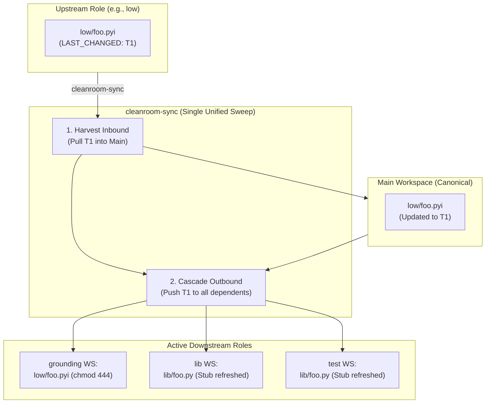

# Cleanroom-Sync Architecture: Declarative Multi-Workspace Synchronization via In-Band Source Metadata

## 1. Executive Summary & Problem Statement

Cleanroom isolates software authoring across specifications, implementations, and tests using independent, pre-confined filesystem workspaces (`../role_workspaces/`). Historically, synchronizing changes between the canonical repository (the **Main Workspace**) and active role workspaces was coordinated by `cleanroom_workspace_tool.py` (aliased as `bin/cleanroom-sync`).

### 1.1 The Pitfalls of Legacy Synchronization
The legacy implementation suffered from several architectural deficiencies:
1. **Flaky Filesystem Timestamps (`mtime`)**: File modification times on disk frequently drift during Git operations (`git checkout`, `git pull`), background tool caching, or file copying. Using `mtime > mtime` for dirty detection led to false positives, false negatives, and accidental file clobbering.
2. **Coupling to Out-of-Band Textprotos**: State tracking previously relied on `.update_with_ai.textproto` sidecars and `COMPLETED.md` mailboxes, creating brittle dual-state divergence whenever files were moved, renamed, or edited outside the mailbox protocol.
3. **Complex Multi-Step Sync Lifecycles**: Moving changes across multiple dependent roles required repeated manual sync calls (e.g., sync `low` $\to$ main, then sync main $\to$ `grounding`, then sync main $\to$ `lib`).
4. **Lack of Local Determinism for Role Agents**: Agents working inside isolated role workspaces had no deterministic tool to query which files were dirty or needed cleaning, relying instead on static `WORK_ORDER.md` files that could fall out of sync with actual file states.

### 1.2 The New Architecture: Embracing In-Band Metadata
With the successful rollout of **In-Band Source Metadata** ([in_band_source_metadata.md](file:///Users/seanmcdirmid/projects/cleanroom/design-docs/in_band_source_metadata.md)), all source files embed their state directly in comment headers:
- `LAST_CLEANED`: UTC timestamp of the last successful verification and submission.
- `LAST_CHANGED`: UTC timestamp of the last semantic modification.
- `CHANGE`: Single-line summary of the last modification.
- `FEEDBACK`: List of unacted peer/arbiter critique records.

The redesigned `cleanroom-sync` leverages these in-band headers as the single, authoritative source of truth. Synchronization decisions are governed by comparing embedded timestamps and change hashes rather than fragile filesystem attributes.



---

## 2. Simplified CLI Lifecycle & Operations

The `cleanroom-sync` interface is redesigned around three core lifecycle primitives:

```bash
# 1. Commission a new role workspace for a specific directory scope
bin/cleanroom-sync --commission <role> --dir <directory>

# 2. Decommission an active role workspace when work is finished
bin/cleanroom-sync --decommission <role> --dir <directory>

# 3. Omni-directional cascade synchronization (Default: zero arguments)
bin/cleanroom-sync
```

### 2.1 Workspace Commissioning (`--commission`)
Commissioning initializes a dedicated role workspace if it does not already exist:
- **Parameters**:
  - `--commission <role>`: The Cleanroom role to provision (e.g., `high`, `planning`, `low`, `grounding`, `lib`, `test`, `qa`).
  - `--dir <directory>`: The target package directory or parts scope (e.g., `staging`, `update_with_ai/parts/agent`). Exactly **one directory** can be specified per workspace.
- **Actions Performed**:
  1. Creates the container folder following the naming convention `../role_workspaces/<workspace>_<role>_<dir>`.
  2. Writes the persistent role configuration `.cleanroom_role.json`.
  3. Copies role-specific read-only tools and linters (`bin/cleanroom-dirty`, `bin/submit`, `bin/blame`, `bin/fail`).
  4. Generates a role-tailored `AGENTS.md` and hardened project configuration (`AGENT_SETTING_POLICY_DENY`).
  5. Materializes initial source files and read-only dependency contracts (`chmod 444`).

### 2.2 Workspace Decommissioning (`--decommission`)
Decommissioning retires an active role workspace:
- **Parameters**:
  - `--decommission <role>`: The role to decommission.
  - `--dir <directory>`: The specific directory scope to tear down.
- **Safety Checks**:
  1. Inspects the workspace for uncommitted or dirty files via in-band metadata.
  2. If unsubmitted changes exist, prompts the user or requires `--force`.
  3. Safely removes the workspace folder from `../role_workspaces/` and unregisters its project configuration in Antigravity.

### 2.3 Omni-Directional Cascading Sync (Default Execution)
Invoking `bin/cleanroom-sync` without arguments triggers a complete, bidirectional convergence sweep across all active commissioned role workspaces:
- Automatically discovers all existing workspaces under `../role_workspaces/` matching `<workspace>_*_*`.
- Pulls all verified submissions and upstream modifications from role workspaces into the Main Workspace.
- In the **same atomic execution**, pushes those updated files and synthesized contracts down into all dependent role workspaces!

---

## 3. Container Topology & Workspace Directory Naming

### 3.1 Strict Directory Scope Isolation
In previous iterations, role workspaces could span multiple disparate directories or the entire repository, leading to bloated file trees and potential context confusion. 

The redesigned architecture enforces a strict **single-directory rule**:
> **Each role workspace is scoped to exactly one directory.**

If a developer is working on `staging`, they commission workspaces specifically for `staging`. If working on `update_with_ai/parts/sandbox`, they commission workspaces specifically for that component.

### 3.2 Directory Naming Convention
Role workspaces are placed in the sibling `../role_workspaces/` container directory following a uniform, human-readable three-tuple pattern:

$$\text{Path} = \texttt{../role\_workspaces/}\langle\text{main-workspace-name}\rangle\_\langle\text{role-name}\rangle\_\langle\text{sanitized-dir-name}\rangle$$

Where:
- $\langle\text{main-workspace-name}\rangle$: Base name of the canonical repo (e.g., `cleanroom`).
- $\langle\text{role-name}\rangle$: The Cleanroom role (e.g., `low`, `grounding`, `lib`, `test`).
- $\langle\text{sanitized-dir-name}\rangle$: The directory scope with slashes replaced by underscores (e.g., `staging` or `update_with_ai_parts_agent`).

#### Concrete Examples:
| Main Workspace | Role | Directory Scope | Resulting Workspace Folder |
| :--- | :--- | :--- | :--- |
| `cleanroom` | `low` | `staging` | `../role_workspaces/cleanroom_low_staging` |
| `cleanroom` | `lib` | `staging` | `../role_workspaces/cleanroom_lib_staging` |
| `cleanroom` | `test` | `staging` | `../role_workspaces/cleanroom_test_staging` |
| `cleanroom` | `grounding` | `staging` | `../role_workspaces/cleanroom_grounding_staging` |
| `cleanroom` | `lib` | `update_with_ai/parts/agent` | `../role_workspaces/cleanroom_lib_update_with_ai_parts_agent` |

### 3.3 Workspace Metadata (`.cleanroom_role.json`)
The root of each role workspace stores an immutable configuration manifest:
```json
{
  "main_workspace": "cleanroom",
  "role_name": "lib",
  "parts_dir": "staging",
  "commissioned_at": "2026-10-03T18:30:00Z",
  "active_role_address": "//staging:lib"
}
```

---

## 4. Metadata-Driven Synchronization Semantics

Unlike legacy synchronization tools that rely on fragile filesystem modification timestamps (`mtime`), `cleanroom-sync` parses embedded headers via `src_metadata.py` to make mathematically deterministic decisions.

### 4.1 In-Band Header Extraction
Every synchronization comparison begins by parsing the in-band metadata block:
```python
@dataclass(frozen=True)
class FileMetadata:
    last_cleaned: Optional[datetime]
    last_changed: Optional[datetime]
    change: Optional[str]
    feedback: List[Tuple[datetime, str, str]]
```

### 4.2 Inbound Harvest (Role Workspace $\to$ Main Workspace)
When `cleanroom-sync` evaluates a file in an active role workspace against the canonical file in the Main Workspace:
1. **Change Inbound Condition**:
   - The role workspace file has a valid metadata block.
   - The role file's `LAST_CLEANED` or `LAST_CHANGED` is strictly newer than the canonical file's timestamp:
     $$T_{\text{role\_changed}} > T_{\text{canonical\_changed}} \quad \lor \quad T_{\text{role\_cleaned}} > T_{\text{canonical\_cleaned}}$$
   - Or the canonical file does not yet exist on disk (new unit creation).
2. **Action**:
   - Copies the file from `../role_workspaces/<ws>/<path>` to `<main_workspace>/<path>`.
   - Preserves all in-band metadata, change descriptions, and cleared feedback.

### 4.3 Deterministic Conflict Detection
If both the role workspace file and the canonical main workspace file have been modified independently:
$$\left(T_{\text{role\_changed}} > T_{\text{last\_sync}}\right) \land \left(T_{\text{canonical\_changed}} > T_{\text{last\_sync}}\right) \land \left(\text{Hash}_{\text{role}} \neq \text{Hash}_{\text{canonical}}\right)$$
The sync engine:
1. Halts the sync for that specific file.
2. Emits an actionable conflict diagnostic:
   ```
   CONFLICT: staging/lib/sandbox_cleanroom_impl.py
     Canonical changed at: 2026-10-03T19:15:00Z (Change: Updated timeout handler)
     Role changed at:      2026-10-03T19:20:00Z (Change: Factored session runner)
     Resolution required: Please resolve conflict before syncing.
   ```
3. Never blindly overwrites either file.

---

## 5. Omni-Directional Cascading Sync (The Single-Action Cascade)

A major breakthrough in the redesigned `cleanroom-sync` is the **Omni-Directional Single-Action Cascade**.

### 5.1 The Multi-Round Problem in Legacy Sync
In previous versions, an update to an upstream specification (such as a `.pyi` contract in `low`) required a tedious multi-step ceremony:
1. Engineer runs `cleanroom-sync --role low` to import the `.pyi` into main.
2. Engineer runs `cleanroom-sync --role grounding` to push the `.pyi` to grounding.
3. Engineer runs `cleanroom-sync --role lib` to push stubs to lib.
4. Engineer runs `cleanroom-sync --role test` to push stubs to test.

### 5.2 The Unified Cascade Execution
In the redesigned `cleanroom-sync`, a single parameterless invocation (`bin/cleanroom-sync`) executes a complete, topologically ordered sweep:

```
┌────────────────────────────────────────────────────────────────────────┐
│                        PHASE 1: INBOUND HARVEST                        │
│  Scan all active role workspaces from lowest to highest phase:         │
│  [high] -> [planning] -> [low] -> [grounding] -> [lib/test] -> [qa]    │
│  Pull any submitted/updated artifacts into the Main Workspace.         │
└──────────────────────────────────┬─────────────────────────────────────┘
                                   │
                                   ▼
┌────────────────────────────────────────────────────────────────────────┐
│                        PHASE 2: OUTBOUND CASCADE                       │
│  Push newly updated canonical files and specifications down into all   │
│  active dependent role workspaces:                                     │
│  • Spec roles receive updated upstream specs (chmod 444)               │
│  • Implementation roles receive updated contracts (chmod 444)          │
│  • Test roles receive synthesized read-only interface stubs           │
└──────────────────────────────────┬─────────────────────────────────────┘
                                   │
                                   ▼
┌────────────────────────────────────────────────────────────────────────┐
│                    PHASE 3: DIRTY STATE CONVERGENCE                    │
│  Each role workspace's in-band metadata now reflects current reality.  │
│  Downstream workspaces immediately detect that contracts changed!      │
└────────────────────────────────────────────────────────────────────────┘
```

### 5.3 Concrete Walkthrough: Updating a Contract
Consider an engineer working in `cleanroom_low_staging`:
1. The engineer edits `staging/parts/agent/low/agent_config.pyi` and runs `bin/submit`.
   - The file's `LAST_CHANGED` and `LAST_CLEANED` are stamped as `2026-10-03T20:00:00Z`.
2. The supervisor (or developer) runs `bin/cleanroom-sync` in the Main Workspace.
3. **Inbound**: The sync tool detects `agent_config.pyi` in `cleanroom_low_staging` is newer than canonical, and copies it to `cleanroom/staging/parts/agent/low/agent_config.pyi`.
4. **Outbound Cascade (Same Action)**:
   - Synchronizes `agent_config.pyi` into `cleanroom_grounding_staging` as read-only (`chmod 444`).
   - Synthesizes an updated implementation stub and writes it to `cleanroom_lib_staging/staging/parts/agent/lib/agent_config.py` (if uninitialized) or updates the companion specification.
   - Synthesizes the read-only test interface stub and writes it to `cleanroom_test_staging/staging/parts/agent/lib/agent_config.py` (`chmod 444`).
5. **Outcome**: In one single command, the entire multi-role cluster is fully synchronized and ready for the next authoring phase.

---

## 6. Deterministic Cleaning Tools inside Role Workspaces

To eliminate guesswork and make role agents fully self-directed, each role workspace is provisioned with a deterministic tool suite inside its `bin/` directory.

### 6.1 Deterministic Dirty Checker: `bin/cleanroom-dirty`
Every role workspace receives an executable `bin/cleanroom-dirty`. When invoked by an agent or developer inside the role workspace:
1. It reads the local `.cleanroom_role.json` to identify its assigned role and directory scope.
2. It parses the in-band metadata of all files belonging to that role in the directory.
3. For each file, it inspects its non-silent upstream dependencies:
   $$\text{is\_dirty}(N) \iff N.\text{last\_cleaned} < D.\text{last\_changed} \quad \lor \quad \text{has\_feedback}(N)$$
4. It outputs an exact, human-readable status report:
   ```
   === Cleanroom Dirty Status [Role: lib, Scope: staging] ===
   
   DIRTY UNITS (Requires Cleaning):
     [DIRTY] staging/parts/agent/lib/agent_config.py
       Reason: Upstream contract changed!
         Dependency: staging/parts/agent/low/agent_config.pyi
         Dep Last Changed:  2026-10-03T20:00:00Z (Change: Add model timeout field)
         Local Last Cleaned: 2026-10-03T18:30:00Z
   
     [DIRTY] staging/parts/agent/lib/agent_runner.py
       Reason: Unacted feedback attached!
         Feedback from //staging/parts/agent:agent_runner_test at 2026-10-03T19:45:00Z:
           "Runner fails to propagate cancellation signal to worker process."
   
   CLEAN UNITS:
     [CLEAN] staging/parts/agent/lib/agent_types.py (Cleaned: 2026-10-03T18:00:00Z)
   
   Summary: 2 units need cleaning, 1 unit clean.
   ```

### 6.2 Workspace Command Suite (`bin/submit`, `bin/blame`, `bin/fail`)

| Command | Usage | Behavior & In-Band Metadata Stamping |
| :--- | :--- | :--- |
| **`bin/cleanroom-dirty`** | `bin/cleanroom-dirty` | Deterministically lists all files in the workspace requiring cleaning, citing exact timestamps and feedback reasons. |
| **`bin/submit`** | `bin/submit <file> "<summary>"` | 1. Runs local verification (e.g. `pyright`, linters).<br/>2. Sets `LAST_CLEANED = T_now`.<br/>3. Sets `LAST_CHANGED = T_now`.<br/>4. Sets `CHANGE = "<summary>"`.<br/>5. Clears all resolved `FEEDBACK:` entries. |
| **`bin/blame`** | `bin/blame <file> <blame_dep> "<critique>"` | 1. Formats feedback record: `- [<timestamp> from <file>]: <critique>`.<br/>2. If `blame_dep` is local, appends directly to its header.<br/>3. If `blame_dep` is an upstream contract, writes to `FEEDBACK.md` mailbox for sync back to canonical main. |
| **`bin/fail`** | `bin/fail <file> "<reason>"` | Marks unit verification failed, retaining dirty state and recording diagnostics for supervisor review. |

---

## 7. Confinement Invariants & Anti-Cheating Guarantees

The redesigned `cleanroom-sync` maintains the rigorous four-tier confinement model:

1. **Physical Filesystem Isolation**: Workspaces live in `../role_workspaces/` outside the canonical repository, preventing relative directory sniffing.
2. **Zero In-Tree Git Metadata**: Role workspaces contain no `.git` repository, worktrees, or parent git links.
3. **OS-Level Immutability (`chmod 444`)**: Upstream specifications (`high/*.md`, `planning/*.md`, `low/*.pyi`, `grounding/*.py`) and build manifests (`BUILD.bazel`) are set to read-only mode upon creation and sync.
4. **Read-Only Interface Stubs**: Test authoring workspaces contain zero lines of real library code; all implementation targets are replaced by synthesized read-only stubs raising `NotImplementedError`.
5. **No Network or Inter-Process Tampering**: Role workspaces communicate strictly via filesystem synchronization orchestrated exclusively from the Main Workspace.

---

## 8. Summary of Architectural Improvements

| Feature | Legacy `cleanroom-sync` | Redesigned In-Band `cleanroom-sync` |
| :--- | :--- | :--- |
| **Dirty Tracking** | Filesystem `mtime` and sidecar textprotos | In-band metadata headers (`LAST_CLEANED`, `LAST_CHANGED`) |
| **CLI Ergonomics** | Multi-flag (`--role`, `--parts-dir`, `--all`) | 3 simple operations: `--commission`, `--decommission`, and default zero-arg cascade sync |
| **Multi-Role Propagation** | Manual multi-step sync cycles across roles | Omni-directional, single-action cascading sync |
| **Directory Scope** | Arbitrary, unconstrained repo paths | Strict 1-directory-per-workspace rule: `<ws>_<role>_<dir>` |
| **Role Agent Visibility** | Blind to dirty DAG; relied on static `WORK_ORDER.md` | Deterministic `bin/cleanroom-dirty` tool with full diagnostic explanations |
| **State Storage** | Fragmented across `.update_with_ai.textproto` files | 100% self-describing in-band source code comments |
