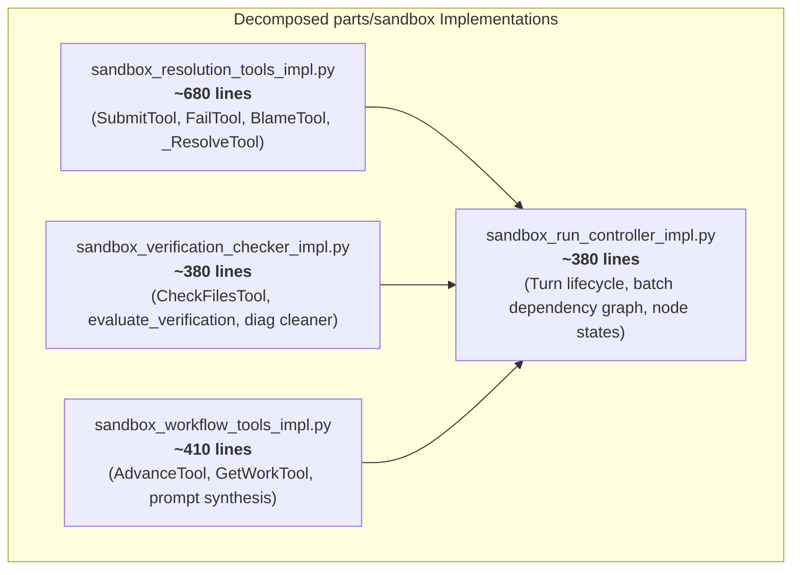
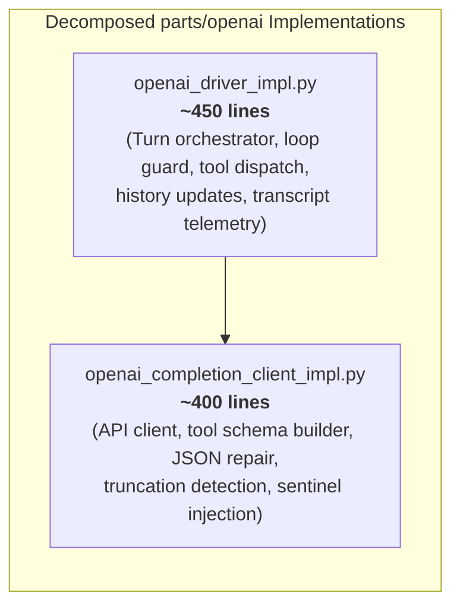
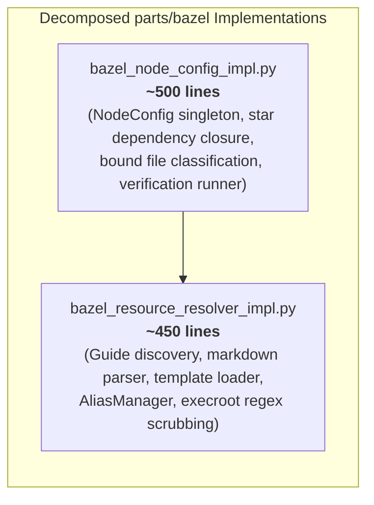
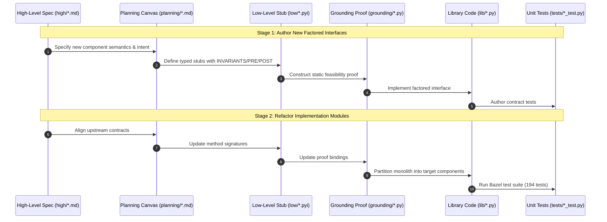

# Cleanroom Component Modularization Plan: Decomposing Large Components

This document specifies the architectural refactoring plan for decomposing the three largest library implementations in the Cleanroom codebase into focused, single-responsibility components with clean factored interfaces.

---

## 1. Executive Summary & Concrete Code Audits

The Cleanroom architecture enforces single-responsibility components whose behaviors are specified via literate High-Level Specifications (`high/*.md`), factored into Planning Canvases (`planning/*.md`), formalized in Low-Level typed stubs (`low/*.pyi`), proved through static Grounding (`grounding/*.py`), and implemented in Library code (`lib/*.py`).

A line-by-line audit of the three largest files reveals why previous rough estimates (such as factoring out only verification checks) would be ineffective, and defines the true architectural boundaries:

| Monolithic Component | Package | Lines | Core Subsystems Identified in Code Audit | Target Decomposed Components |
| :--- | :--- | :---: | :--- | :--- |
| [`sandbox_run_control_impl`](file:///Users/seanmcdirmid/projects/cleanroom/update_with_ai/parts/sandbox/lib/sandbox_run_control_impl.py) | `sandbox` | **1,865** | • Resolution triad (`submit`/`fail`/`blame`): **677 lines** • Verification evaluation & `CheckFilesTool`: **374 lines** • Workflow tools (`advance`/`get_work`) & prompts: **394 lines** • Turn lifecycle controller & batch dependencies: **420 lines** | **4 components** • `sandbox_resolution_tools_impl`: ~680 lines • `sandbox_verification_checker_impl`: ~380 lines • `sandbox_workflow_tools_impl`: ~410 lines • `sandbox_run_controller_impl`: ~380 lines |
| [`openai_driver_impl`](file:///Users/seanmcdirmid/projects/cleanroom/update_with_ai/parts/openai/lib/openai_driver_impl.py) | `openai` | **921** | • Truncation handling, JSON repair, & client: **~400 lines** • Turn orchestration, loop guard, & tool execution: **~450 lines** | **2 components** • `openai_completion_client_impl`: ~400 lines • `openai_driver_impl`: ~450 lines |
| [`bazel_node_config_impl`](file:///Users/seanmcdirmid/projects/cleanroom/update_with_ai/parts/bazel/lib/bazel_node_config_impl.py) | `bazel` | **983** | • Guide parsing & runfiles search: **267 lines** • `AliasManager` & execroot path scrubbing: **137 lines** • Verification check command runner: **only 28 lines!** • Dependency closure & `NodeConfig` singleton: **~500 lines** | **2 components** • `bazel_resource_resolver_impl`: ~450 lines • `bazel_node_config_impl`: ~500 lines |

---

## 2. Decomposing `sandbox_run_control_impl.py` (1,865 Lines $\to$ 4 Components)

### 2.1 Concrete Line Inventory
An audit of `sandbox_run_control_impl.py` reveals four distinct sub-modules currently bundled together:

1. **Resolution Triad Subsystem (Lines 1010–1686, 677 lines)**:
   - `_ResolveTool` base class (lines 1010–1041, 32 lines).
   - `SubmitTool` (lines 1042–1262, 221 lines): Evaluates verification prerequisites, stamps in-band metadata (`LAST_CLEANED`, `LAST_CHANGED`, `CHANGE`), clears `FEEDBACK:`, and marks node clean.
   - `FailTool` (lines 1263–1395, 133 lines): Records execution failure reasons, preserves dirty state, and emits failure diagnostics.
   - `BlameTool` (lines 1396–1686, 291 lines): Validates blame dependencies, enforces single-paragraph critique formatting, and injects in-band `FEEDBACK:` records into upstream specifications.
2. **Verification & Diagnostics Subsystem (Lines 464–691 & 785–930, 374 lines)**:
   - `RunController` verification evaluation methods (lines 464–691, 228 lines): `verification_checks`, `update_verification`, `get_blame_targets_for_node`, `evaluate_verification`, `evaluate_verification_for_node`, and `is_verification_up_to_date_and_passing`.
   - `CheckFilesTool` (lines 785–930, 146 lines): Tool execution, parameters schema, and compiler output cleaning (`_clean_diag_noise`).
3. **Workflow Tools & Task Prompt Subsystem (Lines 238–437, 692–708, 931–1009, 1690–1804, 394 lines)**:
   - Grounding resolution & prompt synthesis (lines 238–437, 200 lines): `_resolve_grounding_file`, `format_task_prompt`, `_msg_content`.
   - Open target reminder formatting (lines 692–708, 17 lines).
   - `AdvanceTool` (lines 931–1009, 79 lines): Progressive step disclosure tool.
   - `GetWorkTool` (lines 1690–1804, 115 lines): Batches dirty nodes from `DagStorage` and `DagSubgraph`.
4. **Core Run Controller Engine (Lines 44–237, 438–463, 709–784, ~420 lines)**:
   - Node state and alias maps (`_ensure_nodes`, `get_node_for_alias`, `get_node_state`, `open_nodes`).
   - Batch dependency checking (`get_in_batch_dependencies`, `check_in_batch_dependencies`).
   - Node file locking (`lock_node_files`).
   - Session turn initialization and lifecycle registration.

### 2.2 Target Factored Architecture

### 2.3 Component Responsibilities & Estimated Sizes
- **`sandbox_resolution_tools_impl` (~680 lines)**: Houses the complete resolution triad (`SubmitTool`, `FailTool`, `BlameTool`) and common resolution helpers.
- **`sandbox_verification_checker_impl` (~380 lines)**: Owns `CheckFilesTool`, verification check execution, diagnostic scrubbing, and passing-state verification.
- **`sandbox_workflow_tools_impl` (~410 lines)**: Owns `GetWorkTool`, `AdvanceTool`, grounding file resolution, and task prompt generation.
- **`sandbox_run_controller_impl` (~380 lines)**: Orchestrates turn progression, session node sets, in-batch dependency gates, and file locking.

---

## 3. Decomposing `openai_driver_impl.py` (921 Lines $\to$ 2 Components)

### 3.1 Concrete Line Inventory
An audit of `openai_driver_impl.py` shows that the component does **not** perform HTTP streaming; instead, it uses non-streaming `client.chat.completions.create(...)` and devotes massive code blocks to JSON repair, truncation recovery, and tool binding:

1. **Truncation Handling, JSON Repair & Completion Client (~400 lines)**:
   - `_repair_json` and `try_close` (lines 37–117, 81 lines): Algorithmic JSON repair of unclosed strings, brackets, and escapes from truncated tool call outputs.
   - Client initialization & tool parameter schemas generation (lines 293–336, 44 lines): Serializing `tool_provider.ToolManager` into OpenAI function definitions.
   - Request construction (lines 343–376, 34 lines): Converting `loop_conversation.Conversation` history into message payloads.
   - Incomplete tool call detection & server-side truncation retry loop (lines 404–489, 86 lines): Handles `incomplete_tool_call` and max-token boundary errors.
   - Length finish reason handling & sentinel replacement (lines 591–660, 70 lines): Inserts `raise NotImplementedError("TRUNCATED_...")` sentinels to allow recovery from truncated code edits.
   - Telemetry extraction (lines 490–510, 20 lines): Extracts prompt tokens and cached tokens.
2. **Turn Loop, Tool Execution & Safeguards (~450 lines)**:
   - Turn bounding & iteration control (lines 337–342, 891–914, 30 lines).
   - Tool call dispatch & argument deserialization (lines 512–589, 78 lines).
   - Tool execution, parameter conversion, & binding (lines 661–890, 230 lines): Evaluates against `loop_guard.can_execute`, executes tools via `tool_mgr`, and appends responses.
   - Telemetry logging & transcript formatting (lines 118–285, 168 lines): `_format_token_usage`, `_format_tool_log`, `_log_event`.

### 3.2 Target Factored Architecture

### 3.3 Component Responsibilities & Estimated Sizes
- **`openai_completion_client_impl` (~400 lines)**:
  - Manages `OpenAI` client configuration and completions invocations.
  - Builds OpenAI function schemas from `tool_provider.ToolManager`.
  - Executes heuristic `_repair_json` and truncations handling.
  - Injects `TRUNCATED` recovery sentinels into partial code edit arguments.
- **`openai_driver_impl` (~450 lines)**:
  - Executes the conversational turn loop (`turns < limit`).
  - Enforces `loop_guard` repetition limits.
  - Dispatches tool invocations to `tool_provider.ToolManager`.
  - Appends assistant/tool messages to `loop_conversation.Conversation`.
  - Formats run transcripts and determines final `LoopOutcome`.

---

## 4. Decomposing `bazel_node_config_impl.py` (983 Lines $\to$ 2 Components)

### 4.1 Concrete Line Inventory & The "Verification Check" Fallacy
A superficial inspection might suggest extracting verification checks. However, inspecting the actual code reveals:
- **`_CommandVerificationCheck` is ONLY 28 lines** (lines 27–55)!
- Its instantiation in `_load_per_node_info` is **only 11 lines** (lines 546–556)!
Factoring out verification checks alone would yield a trivial ~40-line component while leaving `bazel_node_config_impl.py` at **940+ lines**.

The actual line consumers in `bazel_node_config_impl.py` are:
1. **Guide & Template Discovery Engine (Lines 64–133 & 247–443, 267 lines)**:
   - `_parse_guide_markdown` (70 lines): Extracts sections, guidance text, and roles from guide markdown.
   - Multi-variant guide resolution (197 lines): Searches for role guides across `BUILD_WORKSPACE_DIRECTORY`, `RUNFILES_DIR`, `TEST_SRCDIR`, package variants, and `update_python_with_ai/guides/`.
   - Template content resolution (45 lines): Locates and loads template files across runfiles and workspace paths.
2. **File Alias & Execroot Path Scrubbing (Lines 830–966, 137 lines)**:
   - `AliasManager`: Maps `BoundFile` instances to package-relative aliases.
   - Regex-based path scrubber (`_EXECROOT_PATTERN`, `_WORKSPACE_PATTERN`): Strips Bazel execroot paths from compiler and linter outputs to maintain clean, reproducible diagnostics.
3. **Node Configuration & Dependency Graph Closure (Lines 134–246, 444–574, 575–829, ~500 lines)**:
   - `_load_per_node_info`: Reads `DagStorage` messages and resolves package paths.
   - Star dependencies transitive closure: Computes transitive dependencies across the graph.
   - Dependency classification: Separates `ReadOnlyFile` vs `ReadWriteFile`, binds `blame_targets`.
   - `NodeConfig` singleton (lines 575–829, 255 lines): Caches node manifests, filters active roles, and evaluates target bounds.

### 4.2 Target Factored Architecture

### 4.3 Component Responsibilities & Estimated Sizes
- **`bazel_resource_resolver_impl` (~450 lines)**:
  - `_parse_guide_markdown`: Parses guide markdown structure.
  - Guide file resolver: Searches runfiles, workspace, and guide directories.
  - Template content loader: Resolves template content from runfiles.
  - `AliasManager`: Manages file aliases, bound paths, and scrubs execroot paths from diagnostics.
- **`bazel_node_config_impl` (~500 lines)**:
  - `NodeConfig` singleton: Manages per-node caches, active units, and role queries.
  - Dependency traversal: Computes star dependency closures and blame targets.
  - Command verification: Runs subprocess verification checks under workspace environment.

---

## 5. Specification-First Execution Plan

Decomposition follows Cleanroom's **Mandatory Specification-First (HLS-First) Rule**:

### Phased Sequencing
1. **Phase 1: `bazel_node_config_impl` $\to$ 2 components (`bazel_resource_resolver_impl` + `bazel_node_config_impl`)**:
   - Extract `AliasManager`, guide parsing, runfiles search, and diagnostics scrubbing (~450 lines) into `bazel_resource_resolver_impl`.
   - Leaves `bazel_node_config_impl` at a focused ~500 lines.
2. **Phase 2: `openai_driver_impl` $\to$ 2 components (`openai_completion_client_impl` + `openai_driver_impl`)**:
   - Extract JSON repair, completion client, tool schema builder, and truncation recovery (~400 lines) into `openai_completion_client_impl`.
   - Leaves `openai_driver_impl` as a clean turn orchestrator (~450 lines).
3. **Phase 3: `sandbox_run_control_impl` $\to$ 4 components**:
   - Step 3.1: Extract resolution triad (`SubmitTool`, `FailTool`, `BlameTool`) $\to$ `sandbox_resolution_tools_impl` (~680 lines).
   - Step 3.2: Extract `CheckFilesTool` and verification evaluation $\to$ `sandbox_verification_checker_impl` (~380 lines).
   - Step 3.3: Extract `GetWorkTool`, `AdvanceTool`, and task prompt formatting $\to$ `sandbox_workflow_tools_impl` (~410 lines).
   - Step 3.4: Streamline `sandbox_run_controller_impl` (~380 lines).
4. **Phase 4: Full Verification**:
   - Update subsystem assemblies (`sandbox_asm`, `bazel_asm`, `loop_asm`).
   - Run `bazel test //update_with_ai/... //update_python_with_ai/...` to guarantee zero regressions.
