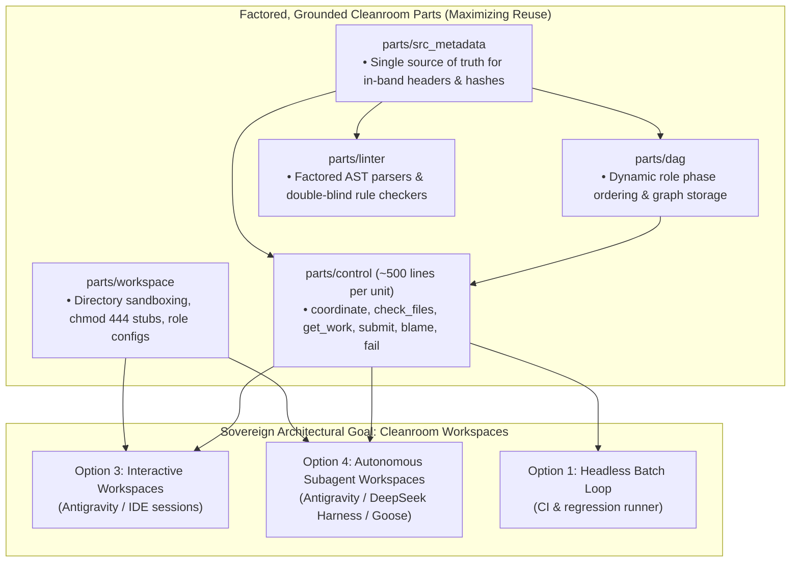
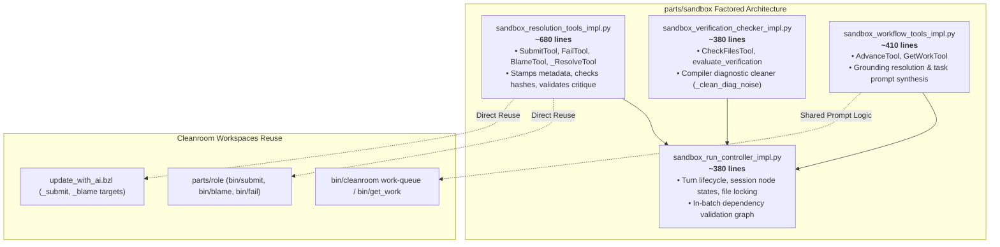
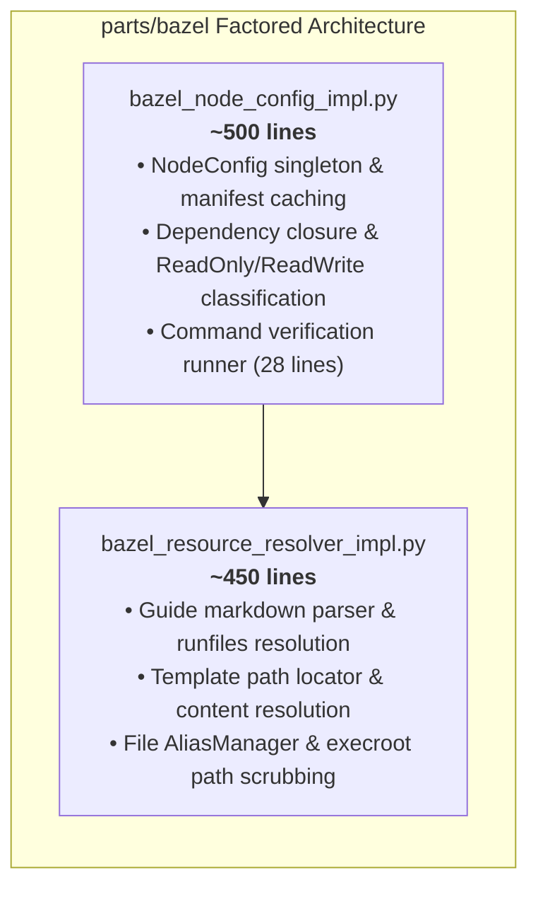
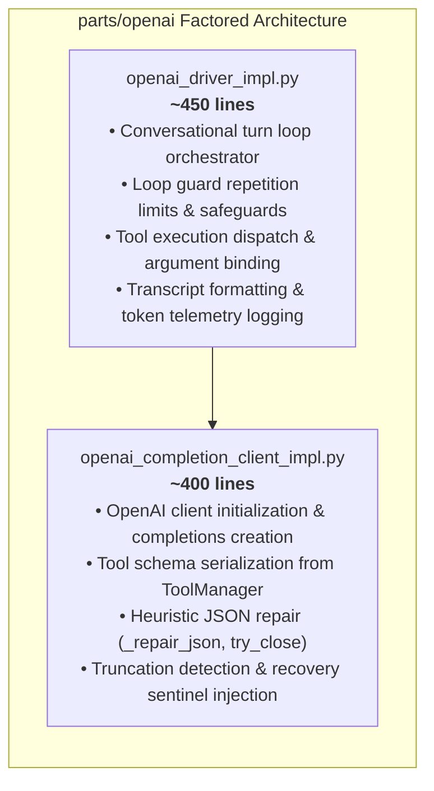
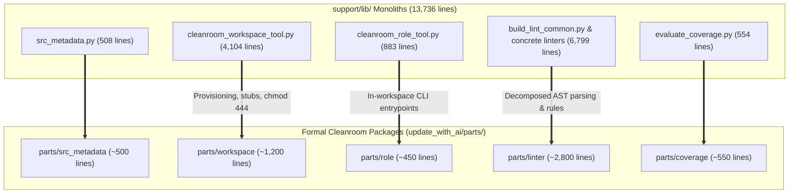
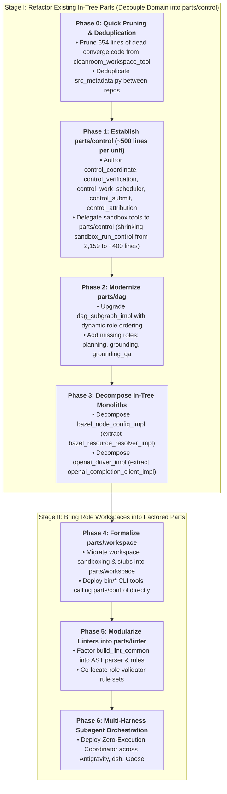

# Cleanroom Component Modularization: Architecting for Cleanroom Workspaces & Maximum Reuse

This document specifies the authoritative, unified architectural refactoring plan for decomposing Cleanroom's monolithic implementations across both in-tree packages (`parts/`) and host infrastructure (`support/lib/`).

---

## 1. Architectural North Star: Workspaces Sovereign Paradigm

### 1.1 The Cleanroom Dilemma: Two Disjoint Monoliths
Historically, Cleanroom developed two parallel software stacks to execute the same directed acyclic graph (DAG) of blinded engineering roles:
1. **The In-Process Headless Loop (`parts/`)**: A complex, highly coupled library designed for unattended batch execution via the OpenAI API (`parts/loop`, `parts/sandbox`, `parts/dag`, `parts/bazel`, `parts/openai`).
2. **The Workspace & Tooling Infrastructure (`support/lib/`)**: Over 13,700 lines of ungrounded Python scripts designed to commission isolated sibling directories, generate read-only interface stubs, track in-band comment metadata, and coordinate conversational AI sessions (`cleanroom_workspace_tool.py`, `cleanroom_role_tool.py`, `src_metadata.py`, and linters).

Because these two stacks were developed in parallel, they independently re-implemented the same core mechanisms:
- Both stacks independently implement **the resolution triad** (`submit`, `blame`, `fail`).
- Both stacks independently implement **DAG topological sorting and dirty node scheduling** (`get_work`).
- Both stacks independently inspect **in-band source metadata headers** (`LAST_CLEANED`, `LAST_CHANGED`, `FEEDBACK:`).
- Both stacks independently parse **Bazel manifests and Starlark target dependencies**.

### 1.2 The Sovereign Paradigm: Everything Supports Workspaces
Cleanroom's sovereign paradigm is **Cleanroom Workspaces** ([Option 3: Subagentless Workspaces](file:///Users/seanmcdirmid/projects/cleanroom/design-docs/subagentless_cleanroom_workspaces.md) and [Option 4: Subagent-Driven Workspaces](file:///Users/seanmcdirmid/projects/cleanroom/design-docs/subagent_driven_cleanroom_workspaces_todo.md)):
- Cleanroom achieves mathematical double-blind isolation not through complex in-process runtime mocks or fragile software hooks, but through **operating system directory isolation** and kernel-level `chmod 444` stubs.
- Headless execution (Option 1) is not a separate architecture; it is simply a headless execution mode that operates over the same canonical parts.
- Therefore, **we do not have two separate modularization efforts** (one for "parts" and one for "support code"). There is **only one modularization plan**, and every single component refactoring is designed to maximize code reuse in direct service of Cleanroom Workspaces.

### 1.3 The In-Place Sandbox vs. Role Workspaces Dichotomy
To understand why refactoring must proceed in a specific order, consider what `parts/sandbox` actually is:
- **The In-Place Sandbox was an adapter to allow working without workspaces**: In Option 1, the agent operates directly within the main repository root. To prevent it from cheating or mutating unauthorized files, Cleanroom built an *in-process sandbox* (`sandbox_file_reader`, `sandbox_file_editor`, in-memory file locking) that intercepts file access in Python.
- **The Domain Conflation Trap**: Because the in-process sandbox was Cleanroom's earliest implementation, Cleanroom's foundational *domain protocols*—the resolution triad (`submit`, `blame`, `fail`), verification evaluation, and DAG work scheduling—were conflated directly into `sandbox_run_control_impl.py` (swelling it to 2,159 lines).
- **Role Workspaces Invert This Model**: In Role Workspaces, isolation is enforced by the operating system filesystem (sibling directories, `chmod 444` interface stubs, native tools). Workspaces do NOT need in-process file interception or in-memory lock managers.

### 1.4 The Prerequisite Rule: Refactor Existing Parts First
> [!IMPORTANT]
> **Do Not Throw Role Workspace Code into `parts/` Before Refactoring Existing Parts**
> If we attempt to migrate role workspace code (`cleanroom_workspace_tool.py`, `cleanroom_role_tool.py`) into `parts/` immediately, we will be grafting a physical directory architecture onto monolithic components that are still entangled with in-process sandbox mocks (`EditManager`, `tool_provider`, in-memory file locking).
> 
> **The Strategy**:
> 1. We MUST refactor what we ALREADY HAVE in `parts/` first.
> 2. Decompose `sandbox_run_control_impl.py` to extract the **pure domain protocols** (the resolution triad, verification checking, task prompting) away from the in-process sandbox adapters.
> 3. Modernize `parts/dag` to handle all current roles dynamically.
> 4. Once existing parts expose clean, reusable domain interfaces, introducing `parts/workspace` and `parts/role` becomes effortless, elegant, and completely free of duplication.



---

## 2. Concrete Code Audit: The Monoliths of Both Worlds

A comprehensive audit across `update_with_ai/parts/`, `update_with_ai/support/lib/`, and `update_python_with_ai/support/lib/` identifies the monolithic files requiring decomposition and the exact duplication to eliminate:

| Location | Monolithic File / Subsystem | Current Lines | Core Responsibilities Identified in Audit | Target Factored Destination | Action / Reuse Opportunity |
| :--- | :--- | :---: | :--- | :--- | :--- |
| `parts/sandbox` | [`sandbox_run_control_impl.py`](file:///Users/seanmcdirmid/projects/cleanroom/update_with_ai/parts/sandbox/lib/sandbox_run_control_impl.py) | **2,159** | • Resolution triad (`submit`/`fail`/`blame`): **677 lines**<br/>• Verification & diagnostics: **374 lines**<br/>• Workflow tools (`advance`/`get_work`): **394 lines**<br/>• Turn lifecycle & batch dependencies: **420 lines** | • `sandbox_resolution_tools_impl`<br/>• `sandbox_verification_checker_impl`<br/>• `sandbox_workflow_tools_impl`<br/>• `sandbox_run_controller_impl` | **Extract shared resolution core** so workspaces and loop share the exact same `submit`/`blame`/`fail` implementation. |
| `support/lib` | [`cleanroom_workspace_tool.py`](file:///Users/seanmcdirmid/projects/cleanroom/update_with_ai/support/lib/cleanroom_workspace_tool.py) | **4,104** | • Dead pre-zero-sync converge engine: **~650 lines**<br/>• Duplicated DAG dirty & topo sort: **~600 lines**<br/>• Duplicated resolution triad handlers: **~400 lines**<br/>• Duplicated Starlark AST evaluator: **~300 lines**<br/>• Workspace sandboxing & stubs: **~1,200 lines**<br/>• CLI dispatching: **~400 lines** | • **`parts/workspace`** (~1,200 lines)<br/>• Delegate DAG to **`parts/dag`**<br/>• Delegate resolution to **`parts/resolution`**<br/>• **PRUNE dead converge code** (~650 lines) | **Eliminates ~1,950 lines** of duplicate/dead code; factors pure workspace sandboxing into formal Cleanroom package. |
| `support/lib` | [`cleanroom_role_tool.py`](file:///Users/seanmcdirmid/projects/cleanroom/update_with_ai/support/lib/cleanroom_role_tool.py) | **884** | • Resolution CLI (`submit`, `blame`, `fail`): **~330 lines**<br/>• Work queue query (`get_work`): **~120 lines**<br/>• Role metadata & target resolution: **~400 lines** | • **`parts/role`** (~450 lines) | Delegates resolution to shared core and work query to `parts/dag`. |
| `support/lib` | [`src_metadata.py`](file:///Users/seanmcdirmid/projects/cleanroom/update_with_ai/support/lib/src_metadata.py) | **508** (x2) | • In-band metadata headers, timestamps, change summaries, blame critique, and code hashes. | • **`parts/src_metadata`** (~500 lines) | Deduplicate identical files across `update_with_ai` and `update_python_with_ai`; formally ground in Cleanroom pipeline. |
| `support/lib` | [`build_lint_common.py`](file:///Users/seanmcdirmid/projects/cleanroom/update_python_with_ai/support/lib/build_lint_common.py) | **4,095** | • Monolithic AST inspection, docstring parsing, import boundary checks, and error formatting. | • **`parts/linter`** (split into parser, rule checker, reporter) | Eliminates monolithic god-file; decouples AST extraction from rule checking. |
| `support/lib` | Concrete Role Linters (`*_lint.py`) | **2,704** | • `lib_lint.py` (894), `test_lint.py` (528), `low_lint.py` (522), `grounding_lint.py` (504), `high_lint.py` (256). | • **`parts/linter`** (factored role validator rule sets) | Uses shared AST parser and formal Cleanroom contracts. |
| `parts/bazel` | [`bazel_node_config_impl.py`](file:///Users/seanmcdirmid/projects/cleanroom/update_with_ai/parts/bazel/lib/bazel_node_config_impl.py) | **983** | • Guide & template discovery: **267 lines**<br/>• File alias & execroot path scrubbing: **137 lines**<br/>• Node config singleton & graph closure: **~500 lines** | • `bazel_resource_resolver_impl`<br/>• `bazel_node_config_impl` | Factors resource resolution away from graph state. |
| `parts/openai` | [`openai_driver_impl.py`](file:///Users/seanmcdirmid/projects/cleanroom/update_with_ai/parts/openai/lib/openai_driver_impl.py) | **921** | • Truncation handling, JSON repair, & client: **~400 lines**<br/>• Turn loop, guard, tool dispatch: **~450 lines** | • `openai_completion_client_impl`<br/>• `openai_driver_impl` | Isolates API error recovery from turn orchestration. |

---

## 3. The Shared Subsystems: Maximizing Code Reuse

By consolidating our refactoring around Cleanroom Workspaces, we identify four critical shared subsystems where reuse eliminates thousands of lines of duplication:

### 3.1 Subsystem A: The Resolution Core (`submit`, `blame`, `fail`)
Currently, three separate places implement the resolution triad:
1. `sandbox_run_control_impl.py` (lines 1234–1960: `SubmitTool`, `BlameTool`, `FailTool`)
2. `cleanroom_role_tool.py` (lines 488–814: `run_submit`, `run_blame`, `run_fail`)
3. `update_with_ai.bzl` (lines 1406–1625: `_update_ai_node_submit_rule`, `_update_ai_node_blame_rule`)

#### What Belongs in the Domain Core vs. What Belongs in `sandbox`
A critical architectural realization is that **almost none of the resolution or workflow logic belongs in `sandbox`**. It was only placed there because the headless loop had to simulate an agent working in place:

| Capability | Domain Protocol Core (Does NOT belong in `sandbox`; reused by Workspaces) | In-Process Sandbox Adapter (Belongs in `parts/sandbox`) |
| :--- | :--- | :--- |
| **`submit`** | • Precondition assertion: verification must pass.<br/>• Change documentation rule: require summary if code modified; forbid summary if unmodified; forbid summary for auditor roles.<br/>• Metadata stamping: compute `CODE_HASH`, stamp `LAST_CLEANED`, stamp `LAST_CHANGED`, clear unacted `FEEDBACK:`, stamp `<ROLE>_AUDIT:` tags.<br/>• Graph mutation: mark target node clean in the DAG. | • Unwrapping `tool_provider.ToolParameter` bindings.<br/>• Checking in-memory `EditManager.has_modifications`.<br/>• Releasing in-memory file locks.<br/>• Formatting `tool_provider.ToolResponse` and follow-up tool calls. |
| **`blame`** | • Culprit validation: verify culprit is a declared upstream dependency.<br/>• Critique contract: validate single-paragraph, actionable critique.<br/>• In-band feedback injection: prepend `FEEDBACK: [timestamp] [role] <critique>` under comment header.<br/>• Graph mutation: mark culprit dirty in the DAG. | • Packaging into `ToolResponse` with follow-up tool call to `AdvanceTool`.<br/>• Setting session state `rc.set_node_state("FAILED")`. |
| **`fail`** | • Failure recording: format and log execution failure diagnostics.<br/>• Graph mutation: preserve dirty state on target node. | • Terminating the in-process LLM conversational turn loop (`LoopOutcome.FAILED`). |
| **`get_work`** | • DAG scheduling: query topological order, check upstream clean status, retrieve ready dirty nodes.<br/>• Task prompt & guide synthesis: load role guide, format instructions, list dependency paths and open feedback. | • Registering nodes in `rc._nodes` and setting `rc._open_nodes`.<br/>• Calling `sandbox.materialize_startup_templates`.<br/>• Triggering initial `AdvanceTool` follow-up call. |

**The Refactoring Solution: A Dedicated `parts/control` Package**:
Rather than inventing ad-hoc abstractions in `agent` or bloating `dag`, we factor all common workflow, verification, and resolution logic into **`update_with_ai/parts/control`**.
`parts/sandbox` delegates its tools directly to `parts/control`, while role workspaces invoke `parts/control` directly from their CLI entrypoints.

#### Modularization of `parts/control`: Enforcing ~500 Lines per Unit
To prevent `parts/control` from accumulating technical debt, each unit is strictly bounded to **around 500 lines of Python code**:

1. **`control_coordinate` (~350 lines)**:
   - Central coordinator facade providing unified session state management and dispatch.
   - Exposes clean Python interfaces for `get_work()`, `check_files()`, `submit()`, `blame()`, and `fail()`.
   - Manages active target state (`open_nodes` in session, pending work tracking).
2. **`control_verification` (~400 lines)**:
   - Executes verification commands defined in `define_role(verify_template = "...")`.
   - **Dual-mode target evaluation**:
     - *Single-file mode*: Evaluates verification for a specific target file passed as an argument (`check_files("lib/foo.py")`).
     - *All-work mode*: If called without an argument, automatically discovers and checks all work currently open / being processed in the session or workspace.
   - Scrubs compiler diagnostic noise (`_clean_diag_noise`): strips Bazel loading lines, cache hit counts, and elapsed time statistics.
   - Caches verification outcomes against source file hashes to prevent redundant executions.
3. **`control_work_scheduler` (~450 lines)**:
   - Evaluates the DAG to determine ready dirty units.
   - **Dual-mode scheduling**:
     - *Subgraph mode*: Walks `DagSubgraph` from a specified target root node (used in headless batch runs).
     - *Directory scope mode*: When a subgraph is not specified but a directory is (e.g., `parts/sandbox` or `dir_scope = "update_with_ai"`), discovers all dirty units in that directory across the repository (used in role workspaces and `bin/get_work`).
   - Dynamic role precedence: Zero hardcoded roles; rank dynamically matches the topological depth of `role_deps` in `define_role`.
   - Synthesizes structured task prompts and directions from role guides.
4. **`control_submit` (~400 lines)**:
   - Precondition check: asserts that `control_verification` passes before allowing submission.
   - Enforces change documentation contracts (requires summary if modified, forbids if unmodified, forbids for auditor roles).
   - In-band metadata stamping (via `parts/src_metadata`): computes `CODE_HASH`, stamps `LAST_CLEANED`, stamps `LAST_CHANGED`, stamps `<ROLE>_AUDIT:` tags, and clears unacted `FEEDBACK:`.
   - Marks target node clean in `DagStorage`.
5. **`control_attribution` (`blame` & `fail`) (~450 lines)**:
   - **Blame**: Validates culprit is a declared upstream dependency, enforces single-paragraph actionable critique, prepends `FEEDBACK:` in culprit comment header, and marks culprit dirty in `DagStorage`.
   - **Fail**: Formats failure diagnostics, logs error reasons, and preserves dirty state on target node.

### 3.2 Subsystem B: Zero Hardcoded Roles Across `parts/` (Dynamic `define_role` Discovery)
A major defect in the current `parts/` implementations is **hardcoded role names**:
- `parts/dag/lib/dag_subgraph_impl.py` hardcodes an obsolete 6-role dictionary:
  ```python
  role_order = {"high": 0, "low": 1, "lib": 2, "test": 3, "qa": 4, "coverage": 5}
  ```
  When `planning`, `grounding`, and `grounding_qa` were introduced, `dag_subgraph_impl.py` had no knowledge of them and gave them fallback tier 100!
- `sandbox_run_control_impl.py` hardcodes:
  ```python
  if role in ("qa", "coverage", "grounding_qa"): ...
  for dep_role in ("lib", "test", "grounding"): ...
  ```

**The Sovereign Rule: Zero Hardcoded Roles in `parts/`**:
Cleanroom roles are dynamically defined in Starlark via `define_role(...)` in `BUILD.bazel`. No code in `parts/` should hardcode role strings.
1. **Dynamic Role Phase Ordering (Tier Precedence)**:
   - A role's scheduling rank is simply its **topological depth in the role dependency DAG** defined by `role_deps` in `define_role`.
   - The DAG engine dynamically computes this rank (via Kahn's algorithm or memoized depth recursion) from `define_role` metadata:
     - `high` (0 deps) $\to$ rank 0.
     - `planning` (deps: `high`) $\to$ rank 1.
     - `low` (deps: `planning`) $\to$ rank 2.
     - `grounding` (deps: `low`) $\to$ rank 3.
     - `grounding_qa` (deps: `grounding`) $\to$ rank 4.
     - `lib` & `test` (deps: `low`, `grounding`) $\to$ rank 5.
     - `qa` (deps: `lib`, `test`) $\to$ rank 6.
     - `coverage` (deps: `qa`) $\to$ rank 7.
   - Any new role declared via `define_role` in the future automatically receives its proper phase ordering with **zero code modifications** in `parts/`!
2. **Dynamic Role Traits (Auditors & Feedback Targets)**:
   - Instead of checking `if role in ("qa", "coverage", "grounding_qa")`, inspect `role_def.is_auditor` or `role_def.src_pattern == ""`.
   - Instead of hardcoding feedback targets (`"lib"`, `"test"`), inspect `role_def.feedback_role_deps`.
   - Instead of hardcoding active component types, inspect `role_def.active_component_types`.

### 3.3 Subsystem C: DAG Scheduling & Ready Work Queue (`get_work`)
Currently:
- `parts/dag` contains Kahn's topological sort and `next_ready_batch()`, but lacked dynamic role discovery.
- `cleanroom_workspace_tool.py` re-implemented 600 lines of custom DAG logic (`compute_role_work_queue`, `eval_unit_dirty`, `topological_sort_units`, `compute_role_phase_order`).

**The Refactoring Solution**:
Upgrade `parts/dag` with dynamic role ordering and filesystem `src_metadata` evaluation.
- `cleanroom_workspace_tool.py` delegates `bin/cleanroom work-queue` and workspace work batching directly to `parts/dag`.
- Headless `LoopCleaner` and Workspace Coordinator share the exact same scheduling algorithm, role precedence order, and dirty evaluation rules.
- **Net Result**: ~600 lines of duplicate DAG code eliminated from `cleanroom_workspace_tool.py`.

### 3.4 Subsystem D: In-Band Source Metadata Engine (`parts/src_metadata`)
Currently:
- `src_metadata.py` (508 lines) is duplicated verbatim across `update_with_ai/support/lib/` and `update_python_with_ai/support/lib/`.
- It lives outside the Cleanroom specification pipeline as an ungrounded host script, despite defining the canonical serialization format for every file in the repository.

**The Refactoring Solution**:
Promote `src_metadata` into a formal Cleanroom package: `update_with_ai/parts/src_metadata`:
- Authored with High-Level Specification (`high/src_metadata.md`), Planning Canvas (`planning/src_metadata.md`), Low-Level Specification (`low/src_metadata.pyi`), Grounding Proofs (`grounding/src_metadata.py`), and Library Implementation (`lib/src_metadata_impl.py`).
- Statically proves timestamp monotonicity, regex header preservation, code hashing, and feedback parsing.
- Used universally across `parts/dag`, `parts/sandbox`, `parts/workspace`, `parts/role`, and `parts/linter`.
- **Net Result**: Single source of truth for metadata across the entire repo.

### 3.5 Subsystem E: Pruning the Dead Converge Engine
In `cleanroom_workspace_tool.py`:
- `converge_role_workspace()` (lines 2840–3380, 541 lines)
- `cleanroom_sync()` (lines 3621–3733, 113 lines)
These functions were built for the obsolete pre-zero-sync architecture that used local JSON buffer files (`.cleanroom_blame_buffer.json`, `.cleanroom_audit_buffer.json`) and complex two-way synchronization sweeps.
Because Cleanroom migrated to convention-driven zero-sync workspaces with direct Bazel mutations (`_submit`, `_blame`, `_fail`), this entire subsystem is completely dead code.

**The Refactoring Solution**:
Prune both functions immediately.
- **Net Result**: Instant reduction of ~654 lines of technical debt with zero functional impact.

---

## 4. Decomposing the `parts/` Monoliths

To enable the reuse described above, the three large in-tree implementations in `parts/` must be factored into single-responsibility components:

### 4.1 Decomposing `sandbox_run_control_impl.py` (2,159 Lines $\to$ 4 Components)



1. **`sandbox_resolution_tools_impl.py` (~680 lines)**:
   - Houses the complete resolution triad (`SubmitTool`, `FailTool`, `BlameTool`) and common resolution helpers.
   - Decoupled from `RunController` turn-state so it can be called directly by workspace tools and Bazel runner targets.
2. **`sandbox_verification_checker_impl.py` (~380 lines)**:
   - Owns `CheckFilesTool`, verification command runner, diagnostic output cleaner, and passing-state caching.
3. **`sandbox_workflow_tools_impl.py` (~410 lines)**:
   - Owns `GetWorkTool`, `AdvanceTool`, grounding file resolution, and task prompt generation.
4. **`sandbox_run_controller_impl.py` (~380 lines)**:
   - Orchestrates turn progression, session node sets, in-batch dependency gates, and file locking.

### 4.2 Decomposing `bazel_node_config_impl.py` (983 Lines $\to$ 2 Components)

An audit demonstrates that factoring out verification checks alone would only remove 28 lines (`_CommandVerificationCheck`). The real line consumers are guide resolution and execroot path scrubbing:



1. **`bazel_resource_resolver_impl.py` (~450 lines)**:
   - Guide discovery across `BUILD_WORKSPACE_DIRECTORY`, `RUNFILES_DIR`, `TEST_SRCDIR`, and `update_python_with_ai/guides/`.
   - Template file resolution and markdown parsing.
   - `AliasManager` and execroot regex path scrubbing (`_EXECROOT_PATTERN`, `_WORKSPACE_PATTERN`).
2. **`bazel_node_config_impl.py` (~500 lines)**:
   - Manifest loading from `DagStorage`.
   - Transitive star dependency closure computation and read-only/read-write file partitioning.
   - `NodeConfig` singleton lifecycle.

### 4.3 Decomposing `openai_driver_impl.py` (921 Lines $\to$ 2 Components)



1. **`openai_completion_client_impl.py` (~400 lines)**:
   - Encapsulates OpenAI SDK client calls, tool schema conversion, and JSON repair for truncated model outputs.
   - Injects `raise NotImplementedError("TRUNCATED_...")` recovery sentinels.
2. **`openai_driver_impl.py` (~450 lines)**:
   - Executes turn loops, bounds iterations, invokes `tool_mgr`, and logs token usage.

---

## 5. Deconstructing `support/lib/` into Cleanroom Packages

Once the shared subsystems are factored, the ungrounded code in `support/lib/` cleanly partitions into formal Cleanroom packages:



### 5.1 `parts/workspace`: Clean Workspace Sandboxing (~1,200 Lines)
The core responsibility of `parts/workspace` is operating-system-level double-blind sandboxing:
- **Workspace Provisioning**: Commissioning and decommissioning sibling workspace directories (`../role_workspaces/<ws>_<role>_<dir>/`).
- **Read-Only Interface Stubs**: Synthesizing `chmod 444` interface stubs containing `raise NotImplementedError` for prohibited roles (e.g. test workspaces physically receiving stubs instead of real implementations).
- **Hardened Permissions**: Applying kernel-level read-only protections (`chmod 444`) to specifications, configurations, and build manifests.
- **Harness Configuration**: Writing `.cleanroom_role.json` descriptors and `.gemini/` configuration for Antigravity, DeepSeek Harness, and Goose.

### 5.2 `parts/role`: In-Workspace Tool Entrypoints (~450 Lines)
`parts/role` provides the thin, hermetic CLI tools deployed inside each role workspace:
- `bin/get_work`: Queries ready work queue from `parts/dag` and prints structured task directions.
- `bin/check_files`: Executes the role's verification command with compiler diagnostic noise scrubbing.
- `bin/submit`: Validates verification and invokes the shared resolution engine in `parts/resolution`.
- `bin/blame`: Validates critique formatting and invokes the shared blame engine in `parts/resolution`.
- `bin/fail`: Logs failure reasons and invokes the shared fail engine in `parts/resolution`.

#### 5.2.1 The Verification Tool: `bin/check_files` as the Single Canonical Command
Providing both `bin/check_files` and a raw command (e.g. `cd $BUILD_WORKSPACE_DIRECTORY && bazel test ...`) confuses agents with multiple ways to perform the exact same task.

**Design Decision: A Single, Canonical `bin/check_files`**:
1. **No Competing Commands**: `bin/get_work` instructs the agent to run `bin/check_files` exclusively. The agent is never presented with an alternative direct shell command.
2. **No Unnecessary Filter Flags**: Cleanroom units are small, focused, single-responsibility components whose test suites run in under one second. Agents do not need `--test_filter` or `--test_arg` to run partial tests; verifying the entire unit specification is the exact precondition required to submit.
3. **Automatic Target Resolution**: `bin/check_files` automatically targets the active unit registered in `.cleanroom_role.json` or pending work. It requires zero path arguments.
4. **Diagnostic Noise Scrubbing**: It executes the role's canonical `verify_template` via the shared `_clean_diag_noise` filter, discarding Bazel cache statistics and progress lines so the agent's context window receives only actionable errors or a clean passing confirmation.
5. **Canonical Symmetric Workflow**:
   ```
   1. bin/get_work                      (Fetch ready unit and review prompt)
   2. [edit source files]               (Author specs or code adhering to guide)
   3. bin/check_files                   (Verify unit passes tests & linters)
   4. bin/submit <target> "<summary>"   (Conclude task, stamp clean metadata)
      OR
      bin/blame <culprit> "<critique>"  (Attribute upstream contract defect)
   ```

### 5.3 `parts/linter`: Modular AST Analysis (~2,800 Lines)
Decomposes `build_lint_common.py` (4,095 lines) and concrete linters (2,704 lines) into:
- **`linter_ast_parser`**: Pure AST extraction, comment extraction, and docstring parsing.
- **`linter_rule_checker`**: Reusable validation rules (zero-conjunction, closed-world imports, in-tier constraints, metadata structure).
- **Role Linters**: Co-located rule sets for `high`, `low`, `grounding`, `lib`, and `test`.

---

## 6. Execution Roadmap & Dependency Phasing

To ensure continuous system stability and avoid breaking working interactive sessions, refactoring is partitioned into two distinct stages:
- **Stage I: Refactor Existing In-Tree Parts** (Decoupling domain protocols from the in-place sandbox).
- **Stage II: Bring Role Workspaces into Factored Parts** (Plugging physical directory workspaces into clean domain interfaces).



### Stage I: Refactor Existing In-Tree Parts

#### Phase 0: Prune Dead Code & Deduplicate `src_metadata` (Immediate, Zero Risk)
1. Delete `converge_role_workspace()` (541 lines) and `cleanroom_sync()` (113 lines) from `cleanroom_workspace_tool.py`.
2. Move `src_metadata.py` into `update_with_ai/parts/src_metadata/`, replacing the copy in `update_python_with_ai/support/lib/src_metadata.py` with an import or symlink.
3. Verify that all Bazel tests and `bin/cleanroom` commands continue passing.

#### Phase 1: Establish `parts/control` and Delegate from `parts/sandbox`
1. Author HLS, Planning, Low, and Grounding specifications for **`update_with_ai/parts/control`**, partitioned into 5 focused units (~500 lines each):
   - `control_coordinate` (~350 lines): Coordinator facade and session state manager.
   - `control_verification` (~400 lines): Dual-mode verification checker (`check_files`), diagnostic noise scrubbing, file hash caching.
   - `control_work_scheduler` (~450 lines): Dual-mode work scheduler (`get_work` for subgraph or directory scope), task prompt synthesis.
   - `control_submit` (~400 lines): Verification gating, change summary rules, in-band metadata stamping, DAG clean resolution.
   - `control_attribution` (~450 lines): Single-paragraph blame validation, feedback injection, failure diagnostics.
2. Refactor `sandbox_run_control_impl.py`:
   - Shrinks from **2,159 lines down to ~400 lines**.
   - `SubmitTool`, `BlameTool`, `FailTool`, `CheckFilesTool`, and `GetWorkTool` become thin adapters passing LLM parameter bindings to `parts/control`.
   - Retains strictly in-process turn orchestration, in-memory file locking, and `AdvanceTool` guide stepping.

#### Phase 2: Modernize `parts/dag`
1. Update `parts/dag/lib/dag_subgraph_impl.py` to replace the hardcoded 6-role order with dynamic phase ordering (`compute_role_phase_order`) derived from role definitions in `BUILD.bazel`.
2. Add support for all modern Cleanroom roles: `high`, `planning`, `low`, `grounding`, `grounding_qa`, `lib`, `test`, `qa`, and `coverage`.
3. Verify that DAG topological sorting and batch ready-node calculation correctly handle modern role pipelines.

#### Phase 3: Decompose Other In-Tree Monoliths
1. Decompose `bazel_node_config_impl.py` into `bazel_resource_resolver_impl.py` (guide/template parsing, file aliases, execroot path scrubbing) and `bazel_node_config_impl.py` (manifest caching, dependency closure).
2. Decompose `openai_driver_impl.py` into `openai_completion_client_impl.py` (completions client, JSON repair, truncations recovery) and `openai_driver_impl.py` (turn orchestration, loop guard, transcript logging).

---

### Stage II: Bring Role Workspaces into Factored Parts

#### Phase 4: Formalize `parts/workspace` & `parts/role`
1. Author HLS, Planning, Low, and Grounding specifications for `parts/workspace` and `parts/role`.
2. Migrate workspace directory commissioning, `chmod 444` stub synthesis, permissions hardening, and `.cleanroom_role.json` generation into `parts/workspace/lib/`.
3. Migrate in-workspace CLI tools (`bin/get_work`, `bin/submit`, `bin/blame`, `bin/fail`) into `parts/role/lib/`, directly calling the shared resolution engine from Phase 1 and DAG engine from Phase 2.
4. Replace `cleanroom_workspace_tool.py` and `cleanroom_role_tool.py` in `support/lib` with minimal bootstrap wrappers.

#### Phase 5: Modularize Linters into `parts/linter`
1. Factor `build_lint_common.py` into `parts/linter` (`linter_ast_parser`, `linter_rule_checker`, `linter_reporter`).
2. Co-locate concrete role linters (`high_lint`, `low_lint`, `grounding_lint`, `lib_lint`, `test_lint`) into `parts/linter`.

#### Phase 6: Multi-Harness Subagent Orchestration
1. With single-responsibility, grounded packages in place, implement the Zero-Execution Coordinator as specified in [`subagent_driven_cleanroom_workspaces_todo.md`](file:///Users/seanmcdirmid/projects/cleanroom/design-docs/subagent_driven_cleanroom_workspaces_todo.md).
2. Wire up harness adapters for **Google Antigravity**, **DeepSeek Harness (`dsh`)**, and **Goose**, leveraging DeepSeek-V4 Flash economics and side-by-side benchmarking.

---

## 7. Architecture Ledger & Net Impact

| Dimension | Before Modularization | After Modularization | Net Impact |
| :--- | :--- | :--- | :--- |
| **Ungrounded Code in `support/lib/`** | 13,736 lines across 15 files | **< 300 lines** (minimal entrypoint bootstrap stubs) | **98% reduction** in ungrounded code. |
| **Monolithic God-Files (> 1,500 lines)** | • `cleanroom_workspace_tool.py`: 4,104 lines<br/>• `build_lint_common.py`: 4,095 lines<br/>• `sandbox_run_control_impl.py`: 2,159 lines | **0 files > 800 lines** | Completely eliminates all three largest monoliths in repo. |
| **Dead / Legacy Code** | ~654 lines of obsolete `converge` and buffer file sync | **0 lines** (completely pruned in Phase 0) | Immediate removal of dead technical debt. |
| **Code Duplication (DAG & Resolution)** | ~2,500 lines duplicated between `support/lib` and `parts/` | **0 lines** (unified `parts/resolution`, `parts/dag`, `parts/src_metadata`) | Single source of truth for resolution, scheduling, and metadata. |
| **Cleanroom Workspaces Support** | Fragile integration relying on ungrounded scripts and duplicate logic | **100% supported by formal, mathematically grounded parts** | Workspaces become first-class citizens of Cleanroom architecture. |
