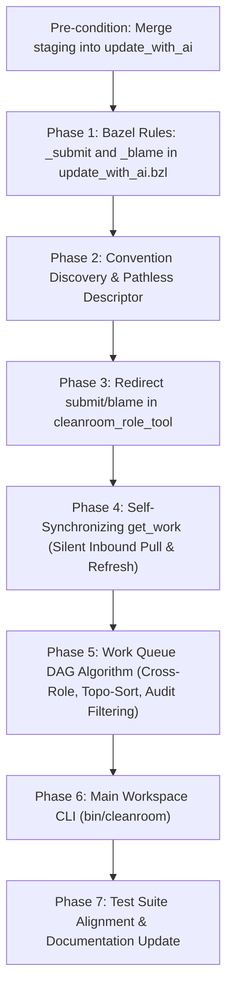

# Convention-Driven Zero-Sync Cleanroom Workspaces Plan

## 1. Executive Summary & Architectural Motivation

The subagentless Cleanroom workspace architecture separates AI pair-programming roles (e.g. `high`, `planning`, `low`, `grounding`, `lib`, `test`, `qa`, `coverage`) into isolated sibling workspaces (`../role_workspaces/<workspace_name>_<role_short>_<dir>`). In previous iterations, cross-workspace coordination relied on an external synchronization command (`bin/cleanroom-sync`), intermediate local JSON buffers (`.cleanroom_audit_buffer.json`, `.cleanroom_blame_buffer.json`), and an explicit metadata configuration file (`.cleanroom_role.json`) containing host path strings (`"main_workspace_root"`).

While functional, that architecture introduced several key frictions:
1. **Coordination Lag & Synchronization Fragility**: A separate `cleanroom-sync` command had to be executed between agent turns to harvest local buffers and redistribute updates. If omitted, role agents operated on stale or missing state.
2. **Main Workspace Path Exposure in Role Workspaces**: The legacy `.cleanroom_role.json` file in each role workspace contained `"main_workspace_root": "/path/to/main"`, exposing host repository paths to inspection by role agents.
3. **Implicit & Fragile Role Resolution**: Passing bare short names like `test` forced tools to hardcode or guess the defining package (`//update_python_with_ai:test`), which breaks when multiple language packages exist.
4. **Intermediate Buffer Overhead**: Maintaining `.cleanroom_audit_buffer.json` and `.cleanroom_blame_buffer.json` required double-write logic, harvest sweeps, reconciliation code, and deletion routines.
5. **Shallow Local Queue Evaluation**: Role workspaces lacked visibility into the full build graph, preventing `bin/get_work` from blocking units when cross-role dependencies were dirty, prompting auditors to audit units while unacted feedback was still pending, or failing to order intra-role work in logical topological sequence ($dependency \to dependent$).

### The Zero-Sync Paradigm
This design plan establishes a **Convention-Driven Zero-Sync Architecture with Bazel-Backed Mutations**:
- **Explicit Bazel Role Commissioning**: Workspaces are commissioned using full Bazel target labels (e.g. `bin/cleanroom commission //update_python_with_ai:test staging`), explicitly declaring the package and language suite defining the role.
- **Single-Language Directory Scopes**: Because each directory scope (e.g. `staging`, `update_with_ai/parts/agent`) is dedicated to a single language pipeline, workspace directories use the role's short name (`role_workspaces/<workspace_name>_<role_short>_<dir>`).
- **Pathless `.cleanroom_role.json` Descriptor**: The workspace maintains an explicit descriptor recording `"role_address": "//update_python_with_ai:test"`, `"role_name": "test"`, and `"parts_dir": "staging"`, with **all host path attributes removed**. The main workspace is resolved strictly via convention (`../../<workspace_name>`).
- **Bazel-Backed Direct Mutations (`_submit` and `_blame`)**:
  - `bin/submit` in role directories copies the modified file to the main workspace and delegates directly to `bazel run //pkg:unit_role_submit -- [message]`.
  - For auditor roles (`qa`, `coverage`, `grounding_qa`), `bin/submit` redirects directly to `bazel run //pkg:unit_qa_submit`.
  - `_submit` replaces the legacy `_change` target and enforces strict change message semantics (rejects message if unchanged; rejects empty message if changed).
  - `bin/blame` redirects directly to `bazel run //pkg:unit_blame -- <message>`, replacing the legacy `_feedback` target without needing file copies.
  - Submissions and critiques immediately mutate the canonical repository, returning console feedback directly to the role workspace terminal.
- **Self-Synchronizing `bin/get_work`**: When an agent executes `bin/get_work`, it silently pulls updated files and refreshes system files from the main workspace before determining work.
- **Global DAG Evaluation for Role Queues**: `bin/get_work` evaluates work from the main workspace perspective:
  - **Cross-Role Dependency Blocking**: A unit is blocked if any of its dependencies in *other* roles are dirty. Because unacted feedback makes nodes unconditionally dirty and audit nodes depend on their feedback nodes, the audit queue is automatically blocked without ad-hoc rules.
  - **Intra-Role Dependency Allowing**: A unit is eligible if its only dirty dependencies belong to the *same* role.
  - **Topological Ordering**: Multiple dirty units in the same role are returned in topological order ($dependency \to dependent$).
- **Dedicated Lifecycle Tooling**: `bin/cleanroom-sync` is retired in favor of focused main workspace commands: `bin/cleanroom commission`, `bin/cleanroom decommission`, and `bin/cleanroom refresh-sys`.

---

## 2. Directory Layout & Convention-Driven Discovery

### 2.1 Workspace Layout Convention

Role workspaces strictly follow the conventional sibling filesystem layout:

```text
<projects_root>/
├── <workspace_name>/                         # Canonical Main Workspace (e.g. cleanroom)
│   ├── bin/
│   │   └── cleanroom                         # Main lifecycle CLI (commission, decommission, refresh-sys)
│   ├── update_with_ai/                       # Canonical specs, tools, and libraries
│   ├── update_python_with_ai/                # Canonical Python guides and tools
│   └── staging/                              # Ephemeral testbed / target parts
└── role_workspaces/                          # Dedicated sibling directory for all role instances
    ├── <workspace_name>_<role_short>_<dir>/  # e.g. cleanroom_test_staging
    │   ├── bin/                              # Opaque zipapp binaries: get_work, submit, blame, fail
    │   ├── .cleanroom_role.json              # Pathless role descriptor (role_address, role_name, parts_dir)
    │   ├── AGENTS.md                         # Role-specific instructions and constraints
    │   └── staging/                          # Mirrored part files (read-only upstream, read-write targets)
    ├── <workspace_name>_<role_short>_<dir>/  # e.g. cleanroom_qa_staging
    └── ...
```

### 2.2 Pathless `.cleanroom_role.json` Specification

Unlike legacy `.cleanroom_role.json` which leaked `/Users/.../cleanroom`, the pathless descriptor stores strictly identity attributes:

```json
{
  "role_address": "//update_python_with_ai:test",
  "role_name": "test",
  "parts_dir": "staging"
}
```

**Security & Operational Benefits:**
- **Zero Host Path Exposure**: Contains no filesystem paths. If an agent inspects the file, no host locations or private directories are leaked.
- **Unambiguous Multi-Language Attribution**: Unambiguously identifies the Bazel target defining the role (`//update_python_with_ai:test`), pointing tools to the exact role definition, companion guide, and linters.

### 2.3 Relative Resolution Algorithm

Inside any role workspace, helper binaries resolve the canonical main workspace via convention:

```python
def resolve_main_workspace_from_convention(cwd: Optional[str] = None) -> Tuple[str, str, str, str]:
    """Resolves (main_workspace_root, workspace_name, role_address, dir_scope) from convention and descriptor."""
    curr = os.path.realpath(cwd or os.getcwd())
    
    # 1. Climb up to find the role workspace directory inside 'role_workspaces'
    role_ws_dir = curr
    while role_ws_dir and role_ws_dir != os.path.dirname(role_ws_dir):
        parent = os.path.dirname(role_ws_dir)
        if os.path.basename(parent) == "role_workspaces":
            break
        role_ws_dir = parent
    else:
        raise RuntimeError("Current workspace is not located inside a 'role_workspaces' directory.")

    role_ws_name = os.path.basename(role_ws_dir)
    projects_root = os.path.dirname(os.path.dirname(role_ws_dir))
    
    # 2. Read pathless descriptor if present
    cfg_file = os.path.join(role_ws_dir, ".cleanroom_role.json")
    role_address = ""
    dir_scope = ""
    if os.path.isfile(cfg_file):
        try:
            with open(cfg_file, "r", encoding="utf-8") as f:
                data = json.load(f)
                role_address = data.get("role_address", "")
                dir_scope = data.get("parts_dir", "")
        except Exception:
            pass

    # 3. Match candidate main workspace directories in projects_root
    for entry in os.listdir(projects_root):
        cand_main = os.path.join(projects_root, entry)
        if os.path.isdir(cand_main) and entry != "role_workspaces":
            prefix = f"{entry}_"
            if role_ws_name.startswith(prefix):
                main_root = cand_main
                workspace_name = entry
                remainder = role_ws_name[len(prefix):]
                break
    else:
        raise RuntimeError(f"Could not locate matching main workspace for '{role_ws_name}' in '{projects_root}'.")

    # 4. Fallback role parsing if descriptor was missing
    if not role_address:
        known_roles = get_registered_role_names(main_root)
        for r in sorted(known_roles, key=len, reverse=True):
            if remainder == r or remainder.startswith(f"{r}_"):
                role_address = r
                if not dir_scope:
                    dir_scope = remainder[len(r):].lstrip("_") or "staging"
                break

    return main_root, workspace_name, role_address, dir_scope or "staging"
```

---

## 3. Bazel-Backed Direct Mutation Architecture (`_submit` and `_blame`)

Instead of buffering submissions or critiques in local JSON files and waiting for a sync tool, role-local binaries delegate directly to canonical Bazel targets in the main workspace.

```
┌──────────────────────────────────────────────────────────────────────────────────┐
│                   BAZEL-BACKED DIRECT MUTATION ARCHITECTURE                      │
├──────────────────────────────────────────────────────────────────────────────────┤
│                                                                                  │
│  Role Workspace: cleanroom_lib_staging                                           │
│    bin/submit staging/parts/foo/lib/foo_impl.py "Refactor parser logic"          │
│         │                                                                        │
│         │  1. Copies modified foo_impl.py up to main workspace                   │
│         │  2. Resolves Bazel target //staging/parts/foo:foo_impl_lib_submit      │
│         │  3. Executes in main: bazel run //staging/parts/foo:foo_impl_lib_submit│
│         ▼                                                                        │
│  Main Workspace Target: //staging/parts/foo:foo_impl_lib_submit                  │
│    - Validates: File changed AND message provided                                │
│    - Stamps: LAST_CLEANED, LAST_CHANGED, CHANGE, CODE_HASH                       │
│    - Clears unacted feedback; broadcasts invalidation to dependents              │
│    - Outputs verification results directly back to role workspace terminal       │
│                                                                                  │
│  Role Workspace: cleanroom_qa_staging (Auditor)                                  │
│    bin/submit staging/parts/foo/lib/foo_impl.py                                  │
│         │                                                                        │
│         │  Redirects to audit target:                                            │
│         │  bazel run //staging/parts/foo:foo_impl_qa_submit                      │
│         ▼                                                                        │
│  Main Workspace Target: //staging/parts/foo:foo_impl_qa_submit                   │
│    - Stamps QA_AUDIT directly on canonical target and companion tests            │
│                                                                                  │
│  Role Workspace: Any Role                                                        │
│    bin/blame staging/parts/foo/lib/foo_impl.py "Contract violation in low spec"  │
│         │                                                                        │
│         │  No file copy needed; redirects directly to:                           │
│         │  bazel run //staging/parts/foo:foo_impl_blame -- "Contract violation"  │
│         ▼                                                                        │
│  Main Workspace Target: //staging/parts/foo:foo_impl_blame                       │
│    - Appends FEEDBACK:, marks DIRTY: True, advances LAST_CLEANED                 │
│                                                                                  │
└──────────────────────────────────────────────────────────────────────────────────┘
```

### 3.1 Producer Submissions: `_submit` Replacing `_change`

In `update_with_ai.bzl`, the legacy `_update_ai_node_change_rule` (`*_change`) is replaced by `_update_ai_node_submit_rule` (`*_submit`):
- For unit `foo_impl` and role `lib`, the generated target is `//staging/parts/foo:foo_impl_lib_submit`.
- When an engineer runs `bin/submit staging/parts/foo/lib/foo_impl.py ["<message>"]`:
  1. `bin/submit` checks if the local file exists and copies it to `main_workspace_root/staging/parts/foo/lib/foo_impl.py`.
  2. `bin/submit` runs `bazel run //staging/parts/foo:foo_impl_lib_submit -- ["<message>"]` within the main repository context.
  3. All stdout and stderr stream directly back to the role engineer's terminal.

### 3.2 Change Message Validation Rules

The `_submit` binary enforces strict consistency between file content modifications and the change summary:
- **Error on Spurious Message**: If `<message>` is provided, but the code body (excluding the metadata block) has **not** changed compared to its recorded `CODE_HASH`:
  ```text
  Error: Change message was provided ("..."), but the file code body has not changed.
  To submit an unmodified verification without changes, run: bin/submit <file>
  ```
- **Error on Missing Message**: If `<message>` is omitted, but the code body **has** changed compared to its recorded `CODE_HASH`:
  ```text
  Error: File code body has been modified, but no change message was provided.
  Please provide a change summary: bin/submit <file> "<concise change summary>"
  ```
- **Valid Modified Submit**: When the code body changed and `<message>` is provided:
  - Computes `new_hash = compute_code_hash(code_body)`.
  - Advances `LAST_CLEANED: <now>` and `LAST_CHANGED: <now>`.
  - Sets `CHANGE: <message>` and `CODE_HASH: <new_hash>`.
  - Clears acted feedback from `FEEDBACK:` and clears `DIRTY:`.
- **Valid Unmodified Submit**: When the code body is unchanged and no `<message>` is provided:
  - Advances `LAST_CLEANED: <now>` without modifying `LAST_CHANGED`, `CHANGE:`, or `CODE_HASH`.
  - Clears `DIRTY:`.

### 3.3 Auditor Submissions: Redirecting to `_qa_submit` / `_audit_submit`

Auditor roles (`qa`, `coverage`, `grounding_qa`) do not maintain mutable copies of source code. When an auditor runs `bin/submit staging/parts/foo/lib/foo_impl.py`:
1. `bin/submit` inspects `.cleanroom_role.json` and recognizes the workspace is an auditor role (e.g. `qa`).
2. It does **not** copy any file to `main`.
3. It resolves the target to the audit node:
   ```bash
   bazel run //staging/parts/foo:foo_impl_qa_submit
   ```
4. `foo_impl_qa_submit`:
   - Validates that the unit's verification suite passes.
   - Stamps `<ROLE>_AUDIT: <now>` directly on the canonical target file (`foo_impl.py`) and companion test files in `main`.
   - Clears `DIRTY:`.
   - Completely retires `.cleanroom_audit_buffer.json`.

### 3.4 Blame Mutations: `_blame` Replacing `_feedback`

In `update_with_ai.bzl`, the legacy `_update_ai_node_feedback_rule` (`*_feedback`) is replaced by `_update_ai_node_blame_rule` (`*_blame`):
- For unit `foo_impl`, the generated target is `//staging/parts/foo:foo_impl_blame`.
- When an engineer runs `bin/blame staging/parts/foo/lib/foo_impl.py "<message>"`:
  1. No file copy is performed.
  2. `bin/blame` invokes `bazel run //staging/parts/foo:foo_impl_blame -- "<message>"` in the main workspace.
  3. `_blame` target executes:
     - Directly appends `- [<now> from <caller>]: <message>` under `FEEDBACK:` on the canonical file in `main`.
     - Sets `DIRTY: True`.
     - Advances `LAST_CLEANED: <now>`.
  4. Returns confirmation to the role workspace terminal.
  5. Completely retires `.cleanroom_blame_buffer.json`.

---

## 4. Self-Synchronizing `bin/get_work`

Every call to `bin/get_work` in a role workspace performs three sequential phases:

```text
bin/get_work
  ├── 1. Inbound Pull from Main (Silent Sync)
  ├── 2. Non-Part / System File Refresh (Fast Mtime Sync)
  └── 3. Queue Computation from Main Workspace Perspective
```

### 4.1 Phase 1: Silent Inbound Pull from Main
- Scans all files in `dir_scope` between `main_workspace_root` and the local role workspace.
- For each file:
  - If `main_event > ws_event` or the file does not exist locally:
    - Copies the file from `main` to the role workspace.
    - If the file is owned by this role (matches `src_pattern`): sets permission to `0o644` (read-write).
    - If the file is an upstream contract, sibling implementation, or test: sets permission to `0o444` (read-only).
- **Leakage Prevention**:
  - All logs, file paths, and stdout/stderr output are redirected or suppressed (`silent=True`).
  - All exceptions during sync are caught and sanitized to prevent traceback path leakage.

### 4.2 Phase 2: System File Refresh
- Benchmarks show copying non-part files (configs, tools, guides, BUILD rules) takes ~76 milliseconds.
- `bin/get_work` verifies non-part files against `main_workspace_root` using fast `mtime` comparison:
  - If `mtime(main_file) > mtime(role_file)`: copies and sets permissions (`0o444` for configs/guides, `0o755` for opaque binaries).
- This guarantees role workspaces always have the latest linters, build rules, and guides without manual `--sys` sweeps.

### 4.3 Phase 3: Global DAG Work Queue Computation
Instead of evaluating dirtiness on local workspace files, `bin/get_work` inspects the build graph from the **main workspace perspective**.

---

## 5. Dependency-Aware Work Queue Algorithm

### 5.1 The Two Fundamental Dependency Rules

1. **Cross-Role Dependency Blocking**:
   If a dirty node $N$ in role $R$ depends on a node $D$ in a different role $R' \ne R$, and $D$ is dirty, then $N$ is **BLOCKED**.
   *Rationale*: A test engineer must not write tests against a low-level spec that is currently being edited or refuted. An implementer must not write library code against an ungrounded or dirty spec.
   $$\text{is\_ready}(N) = \forall D \in \text{deps}(N) \text{ where } \text{role}(D) \ne R \implies \text{is\_clean}(D)$$

   > [!NOTE]
   > **Emergent Audit Queue Blocking**:
   > In the Cleanroom build graph, audit nodes (`qa`, `coverage`, `grounding_qa`) have incoming dependency edges from their declared `feedback_role_deps` (e.g. `qa` depends on `lib` and `test`; `grounding_qa` depends on `grounding`). 
   > Furthermore, having unacted `FEEDBACK:` items makes any node **unconditionally dirty**.
   > Consequently, whenever an implementation or test node has pending feedback, it is dirty. Because the audit node depends on it across roles, **the audit queue is automatically blocked by Rule 1 without any special-case auditor logic**.

2. **Intra-Role Dependency Allowing**:
   If a dirty node $N$ in role $R$ depends on another dirty node $D$ in the *same* role $R$, node $N$ is **NOT** blocked from the work list. Both $D$ and $N$ can be tackled in this role's turn.
   *Rationale*: A library engineer authoring a module that depends on a helper module within the same library can implement both in sequence.

3. **Topological Order Requirement ($dependency \to dependent$)**:
   When multiple dirty nodes in role $R$ are ready, they must be sorted such that any prerequisite node $D$ appears **before** dependent node $N$:
   $$D \in \text{deps}(N) \implies \text{index}(D) < \text{index}(N)$$
   This ensures the agent's attention and context window focus on prerequisite units before dependent units.

### 5.2 Algorithmic Specification

```python
def compute_role_work_queue(
    role_name: str,
    dir_scope: str,
    main_repo_root: str,
) -> Tuple[List[Dict[str, Any]], List[Dict[str, Any]]]:
    """Computes ready and blocked dirty nodes for a role from main workspace graph."""
    # 1. Collect all nodes in scope from main repo
    all_dirty = find_all_dirty_in_scope(main_repo_root, dir_scope=dir_scope)
    dirty_by_target = {n["target_file"]: n for n in all_dirty}
    
    # 2. Filter to dirty nodes owned by this role
    role_dirty = [n for n in all_dirty if n["role"] == role_name]
    if not role_dirty:
        return [], []

    # 3. Build dependency graph for role dirty nodes
    graph = build_dependency_graph(main_repo_root, dir_scope=dir_scope)

    ready_candidates: List[Dict[str, Any]] = []
    blocked_candidates: List[Dict[str, Any]] = []

    for item in role_dirty:
        target = item["target_file"]
        deps = graph.get_dependencies(target)
        
        # Rule 1: Cross-role blocking (automatically blocks audit nodes if feedback deps are dirty)
        cross_role_dirty_deps = [
            d for d in deps
            if d["role"] != role_name and d["target_file"] in dirty_by_target
        ]
        
        if cross_role_dirty_deps:
            item["blocked_by"] = [d["target_file"] for d in cross_role_dirty_deps]
            item["blocked_reason"] = "Cross-role dependencies dirty"
            blocked_candidates.append(item)
        else:
            ready_candidates.append(item)

    # Rule 4: Topological Sort on ready_candidates (dependencies first)
    ready_targets = {item["target_file"]: item for item in ready_candidates}
    in_degree: Dict[str, int] = {t: 0 for t in ready_targets}
    adjacency: Dict[str, List[str]] = {t: [] for t in ready_targets}

    for t, item in ready_targets.items():
        for dep in graph.get_dependencies(t):
            dep_target = dep["target_file"]
            if dep_target in ready_targets:
                adjacency[dep_target].append(t)
                in_degree[t] += 1

    # Kahn's algorithm with stable sort tie-breaking
    queue = sorted([t for t, deg in in_degree.items() if deg == 0])
    sorted_targets: List[str] = []

    while queue:
        curr = queue.pop(0)
        sorted_targets.append(curr)
        newly_ready = []
        for dependent in adjacency[curr]:
            in_degree[dependent] -= 1
            if in_degree[dependent] == 0:
                newly_ready.append(dependent)
        queue.extend(sorted(newly_ready))

    for t in ready_targets:
        if t not in sorted_targets:
            sorted_targets.append(t)

    sorted_ready = [ready_targets[t] for t in sorted_targets]
    return sorted_ready, blocked_candidates
```

---

## 6. Lifecycle Tooling in Main Workspace

`bin/cleanroom-sync` is retired. In its place, the main workspace provides a clean, unified CLI: `bin/cleanroom`.

### 6.1 CLI Command Specification

```bash
# Commission a new role workspace using explicit Bazel target
bin/cleanroom commission //update_python_with_ai:test staging

# Decommission an active role workspace (supports target, short name, or directory)
bin/cleanroom decommission //update_python_with_ai:test staging
bin/cleanroom decommission test staging
bin/cleanroom decommission cleanroom_test_staging

# Refresh system files (tools, configs, guides, BUILD rules) across role workspaces
bin/cleanroom refresh-sys [ROLE] [DIR]

# Inspect dirty nodes and readiness from main workspace
bin/cleanroom dirty [DIR]
```

### 6.2 Behavior of `bin/cleanroom commission <ROLE_TARGET> <DIR>`
1. Validates that `<ROLE_TARGET>` (e.g. `//update_python_with_ai:test`) is defined in the package's `BUILD.bazel` and `<DIR>` exists.
2. Derives role short name from the target: `test`.
3. Derives role workspace path: `../role_workspaces/<workspace_name>_<role_short>_<DIR>`.
4. Creates destination directory structure.
5. Copies read-only system files, guides, configs, and build rules.
6. Deploys opaque zipapp binaries: `bin/get_work`, `bin/submit`, `bin/blame`, `bin/fail`.
7. Generates tailored `AGENTS.md` for the role.
8. Writes pathless descriptor `.cleanroom_role.json`:
   ```json
   {
     "role_address": "//update_python_with_ai:test",
     "role_name": "test",
     "parts_dir": "staging"
   }
   ```
9. Performs initial pull of mirrored files from `<DIR>` in the main workspace.

### 6.3 Behavior of `bin/cleanroom decommission <ROLE_TARGET> <DIR>`
1. Locates workspace via directory convention.
2. Checks for uncommitted or unsubmitted modifications (warns unless `--force` is provided).
3. Restores write permissions (`0o755`/`0o644`) on read-only upstreams.
4. Removes the workspace directory cleanly via `shutil.rmtree`.
5. Unregisters the workspace from `.cleanroom_workspaces.json`.

---

## 7. Security, Concurrency & Path Isolation

| Dimension | Risk Mitigation in Zero-Sync Architecture |
| :--- | :--- |
| **Static File Inspection** | Helper binaries in `bin/` are compiled zipapp archives (`unsupported mime type`). The `.cleanroom_role.json` file contains **no host paths** (`role_address`, `role_name`, `parts_dir` only). |
| **Output / Log Leakage** | All sync and pull routines executed during `bin/get_work` run with redirected/suppressed stdout/stderr. Only the cleanroom queue output is printed. Bazel mutations stream their execution summary cleanly back to the caller. |
| **Exception Sanitization** | `try...except` wrappers around internal convention resolution and sync catch exceptions and format clean errors (e.g. `Error: Main workspace synchronization failed`) rather than dumping stack traces with host paths. |
| **Advisory Mutation Locking** | A file-level mutex (`fcntl.flock` on `.cleanroom_lock` in `main_workspace_root`) synchronizes all mutations from `submit` and `blame` and atomic reads from `get_work`. |

---

## 8. Implementation & Migration Plan

> [!IMPORTANT]
> **Pre-Implementation Requirement**: Before starting code modifications for this plan, carefully copy all tested staging changes back into canonical `update_with_ai` and `update_python_with_ai` packages so the repository baseline is fully clean and aligned.

### Phase Breakdown



1. **Pre-condition: Canonical Staging Synchronization**:
   - Verify all unit tests pass in `update_with_ai`.
   - Copy validated staging changes back to canonical packages.
2. **Phase 1: Bazel Macro Targets (`_submit` and `_blame`)**:
   - In `update_with_ai.bzl`:
     - Implement `_update_ai_node_submit_rule` (`*_submit`), replacing `*_change`.
     - Implement change message validation (reject message if unchanged; reject empty message if changed).
     - Implement `_update_ai_node_blame_rule` (`*_blame`), replacing `*_feedback`.
     - Update `define_node` to expose `_submit` and `_blame` targets.
3. **Phase 2: Convention Discovery & Pathless Descriptor**:
   - Update commissioning to require explicit Bazel target label (e.g. `//update_python_with_ai:test`).
   - Implement `resolve_main_workspace_from_convention()`.
   - Update `.cleanroom_role.json` generation to be completely pathless.
4. **Phase 3: Redirect `submit` and `blame` in `cleanroom_role_tool.py`**:
   - Update `bin/submit`:
     - Producer: Copies file to main $\to$ executes `bazel run //pkg:unit_role_submit -- [message]`.
     - Auditor: Executes `bazel run //pkg:unit_qa_submit`.
   - Update `bin/blame`:
     - Executes `bazel run //pkg:unit_blame -- <message>`.
   - Retire `.cleanroom_audit_buffer.json` and `.cleanroom_blame_buffer.json`.
5. **Phase 4: Self-Synchronizing `get_work`**:
   - Implement silent inbound sync in `run_get_work`.
   - Implement fast mtime system file refresh in `run_get_work`.
   - Suppress stdout/stderr and sanitize exceptions.
6. **Phase 5: Global DAG Queue Algorithm & Audit Filtering**:
   - Enhance `get_ready_dirty_nodes` with cross-role dependency blocking.
   - Implement audit node suppression when feedback nodes have active `FEEDBACK:`.
   - Implement intra-role dependency inclusion and topological sorting ($dep \to dependent$).
7. **Phase 6: Main Workspace CLI**:
   - Implement `bin/cleanroom` supporting `commission`, `decommission`, `refresh-sys`, and `dirty`.
   - Deprecate/retire `cleanroom-sync`.
8. **Phase 7: Verification & Testing**:
   - Author end-to-end tests for Bazel `_submit` / `_blame` targets, change message validation, audit suppression, and topological ordering.
   - Run Bazel tests with mandatory flags: `--test_output=errors --test_timeout=100 --noshow_progress --noshow_loading_progress`.
