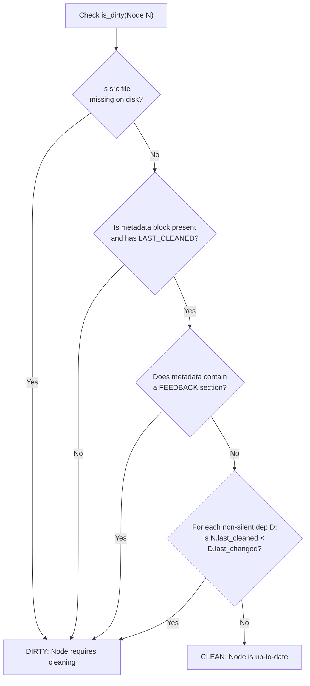
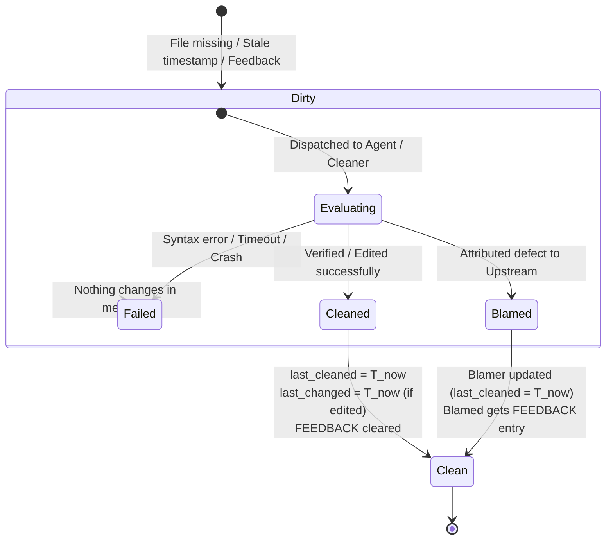
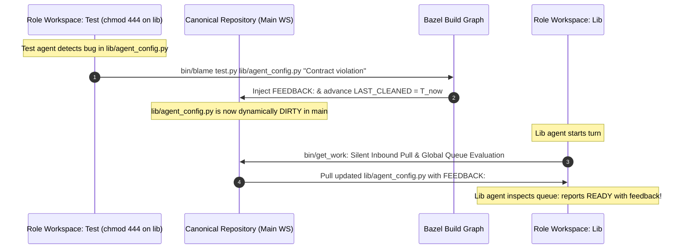
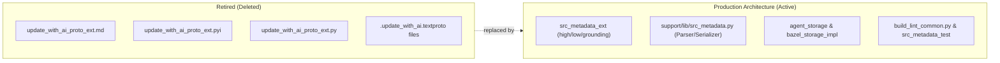

# In-Band Source File Metadata & State Persistence: Eliminating `.update_with_ai.textproto`

## 1. Executive Summary & Problem Statement

In the Cleanroom architecture, software construction is modeled as a directed acyclic graph (DAG) of specification, implementation, test, and verification nodes. A central requirement of this architecture is **dirty tracking**: determining whether a node requires cleaning (regeneration or re-verification) based on upstream modifications, missing artifacts, or peer feedback.

### 1.1 The Legacy Approach: Out-of-Band `.update_with_ai.textproto`
Historically, Cleanroom tracked dirty state and inter-node messaging through sidecar Protobuf text-format files named `.update_with_ai.textproto`, located in each package directory:
- Each package directory contained a single `.update_with_ai.textproto` tracking all nodes in that package.
- It stored pending messages (`ChangeMessage`, `FeedbackMessage`) and lists of `reverse_dependencies`.
- When an upstream node changed, the storage engine looked up its reverse dependencies and wrote a `ChangeMessage` into each downstream node's package textproto file.

```
LEGACY OUT-OF-BAND ARCHITECTURE (FLAWED)
┌────────────────────────────────────────┐       ┌────────────────────────────────────────┐
│             Package Folder             │       │             Package Folder             │
│  parts/agent/lib/                      │       │  parts/agent/tests/                    │
│  ├── agent_config.py                   │       │  ├── agent_config_test.py              │
│  └── .update_with_ai.textproto  ◄──────┼───────┼─ .update_with_ai.textproto             │
│      (tracks messages & rev_deps)      │       │  (tracks messages & rev_deps)          │
└────────────────────────────────────────┘       └────────────────────────────────────────┘
  • Multi-file sidecar state desynchronizes during file renames, branch merges, and moves.
  • Storing reverse dependencies on disk requires complex multi-package directory sweeps.
  • Agents inspecting source files cannot see provenance, clean status, or pending feedback.
```

### 1.2 Failure Modes of Out-of-Band Textprotos
1. **State Desynchronization & Ghost Records**: When source files were renamed, moved, or deleted, package `.update_with_ai.textproto` files retained stale entries, causing phantom dirty nodes and broken build passes.
2. **Brittle Reverse-Dependency Tracking**: Persisting reverse dependencies on disk required manual graph sweeps, registration steps (`register_dependent`), and global resets (`clear_dependents`, `batch_mark_clean`). A failure in one package corrupted graph traversals across unrelated packages.
3. **Repository Pollution & Git Conflict Hotspots**: Textproto files accumulated noisy merge conflicts whenever multiple branches touched the same package.
4. **LLM Context Blindness**: Agents operating inside role workspaces or sandboxes had to inspect out-of-band files or rely on synthetic injected prompts to understand why a node was dirty. The source file itself lacked self-describing provenance.

### 1.3 The Solution: In-Band Source File Metadata
Cleanroom eliminates `.update_with_ai.textproto` entirely. All node metadata—last cleaned timestamp, last change timestamp, change description, and unacted feedback—is embedded directly into each source file inside native comment blocks.

```
NEW IN-BAND SELF-DESCRIBING ARCHITECTURE
┌────────────────────────────────────────────────────────────────────────────────────────┐
│  parts/agent/lib/agent_config.py                                                       │
│  ┌──────────────────────────────────────────────────────────────────────────────────┐  │
│  │ # --- CLEANROOM METADATA ---                                                     │  │
│  │ # LAST_CLEANED: 2026-10-02T14:55:48Z                                             │  │
│  │ # LAST_CHANGED: 2026-10-02T14:50:12Z                                             │  │
│  │ # CHANGE: Factored configuration schema to support typed environment defaults.   │  │
│  │ # --- END CLEANROOM METADATA ---                                                 │  │
│  └──────────────────────────────────────────────────────────────────────────────────┘  │
│  class AgentConfig:                                                                    │
│      ...                                                                               │
└────────────────────────────────────────────────────────────────────────────────────────┘
  • Pure forward dependency checks: is_dirty compares node.last_cleaned < dep.last_changed.
  • Zero reverse-dependency state stored on disk: no sweep or registration needed.
  • Complete atomic synchronization: Git diffs and branch merges track code and state together.
```

---

## 2. In-Band Metadata Specification

### 2.1 Comment Conventions by File Type
Metadata is embedded using native comment syntax tailored to each file format in Cleanroom:

| File Types | File Extensions | Comment Syntax | Boundary Markers |
| :--- | :--- | :--- | :--- |
| **Specifications & Canvases** | `.md` | HTML comments | `<!-- CLEANROOM METADATA ... -->` |
| **Python Specs, Stubs & Implementations** | `.py`, `.pyi` | Line comments (`#`) | `# --- CLEANROOM METADATA --- ... # --- END CLEANROOM METADATA ---` |
| **Bazel & Starlark Rules** | `BUILD`, `BUILD.bazel`, `.bzl` | Line comments (`#`) | `# --- CLEANROOM METADATA --- ... # --- END CLEANROOM METADATA ---` |
| **Shell & Automation Scripts** | `.sh` | Line comments (`#`) | `# --- CLEANROOM METADATA --- ... # --- END CLEANROOM METADATA ---` |

### 2.2 Header Placement Rules
1. **Header Placement**: The metadata block must be located at the top of the file.
2. **Shebang & Encoding Preservation**: For executable scripts containing a shebang (`#!/usr/bin/env python3` or `#!/usr/bin/env bash`) or encoding declaration (`# -*- coding: utf-8 -*-`), the metadata block is placed immediately below those header directives.
3. **Markdown Frontmatter**: If a Markdown file contains YAML frontmatter (`---`), the metadata block is placed immediately after the frontmatter closing delimiter.

### 2.3 Field Definitions & Grammar
The metadata block contains three mandatory attributes and one conditional section:

```yaml
LAST_CLEANED: <UTC timestamp>
LAST_CHANGED: <UTC timestamp>
CHANGE: <Single-line change description>
FEEDBACK:  # CONDITIONAL: Present ONLY when there is unacted feedback
- [<UTC timestamp> from <agent_or_node_id>]: <Feedback explanation>
```

#### Timestamps
- **Timezone**: Must strictly be UTC.
- **Granularity**: Truncated to the nearest second (`YYYY-MM-DDTHH:MM:SSZ`). Subsecond fractions are omitted.
- **Monotonicity & String Comparison**: Standard ISO 8601 formatting with trailing `Z` guarantees that standard lexicographical string comparison is equivalent to chronological comparison:
  $$\text{"2026-10-02T14:50:12Z"} < \text{"2026-10-02T14:55:48Z"}$$

#### Change Description (`CHANGE`)
- **Single Change Guarantee**: Only one change message is supported at a time.
- **Replacement Semantics**: Whenever a node is modified during cleaning, the new change description replaces whatever was listed previously. Historical change accumulation is delegated to Git commit history rather than bloating file headers.

#### Feedback Section (`FEEDBACK`)
- **Omission When Clean**: If a node has no pending feedback, the `FEEDBACK:` section is completely omitted from the metadata block.
- **Accumulation of Unacted Feedback**: If multiple upstream nodes or verification agents report feedback against this node before it is cleaned, each blame event appends an entry to the `FEEDBACK` list:
  `- [<UTC timestamp> from <blaming_node>]: <explanation>`
- **Automatic Resolution**: When the node is cleaned or successfully blames an upstream node, the entire `FEEDBACK` section is removed.

---

## 3. Concrete Examples

### 3.1 Python Implementation File (`lib/agent_config.py`)
```python
# --- CLEANROOM METADATA ---
# LAST_CLEANED: 2026-10-02T14:55:48Z
# LAST_CHANGED: 2026-10-02T14:50:12Z
# CHANGE: Implement environment variable fallback for agent model configuration.
# --- END CLEANROOM METADATA ---

from dataclasses import dataclass
from typing import Optional

@dataclass(frozen=True)
class AgentConfig:
    model_name: str
    temperature: float = 0.7
```

### 3.2 High-Level Markdown Specification (`high/agent_config.md`)
```markdown
<!-- CLEANROOM METADATA
LAST_CLEANED: 2026-10-02T14:40:00Z
LAST_CHANGED: 2026-10-02T14:35:10Z
CHANGE: Define fallback hierarchy for agent session configurations.
-->

# agent_config specification

## Purpose
The *agent_config* component defines configuration parameters for autonomous sessions...
```

### 3.3 File with Pending Feedback (`low/agent_config.pyi`)
```python
# --- CLEANROOM METADATA ---
# LAST_CLEANED: 2026-10-02T14:30:00Z
# LAST_CHANGED: 2026-10-02T14:30:00Z
# CHANGE: Added AgentConfig protocol and runtime stubs.
# FEEDBACK:
# - [2026-10-02T14:52:10Z from //parts/agent:agent_config_test]: Contract violation: temperature parameter must accept float values between 0.0 and 2.0 inclusive.
# - [2026-10-02T14:54:05Z from //parts/agent:agent_session]: Missing optional timeout_seconds attribute in AgentConfig protocol.
# --- END CLEANROOM METADATA ---

from typing import Protocol

class AgentConfig(Protocol):
    model_name: str
    temperature: float
```

### 3.4 Python Grounding Feasibility Specification (`grounding/agent_config.py`)
```python
# --- CLEANROOM METADATA ---
# LAST_CLEANED: 2026-10-02T14:32:00Z
# LAST_CHANGED: 2026-10-02T14:32:00Z
# CHANGE: Grounding feasibility proof for agent configuration resolution.
# --- END CLEANROOM METADATA ---

from typing import Optional
from update_with_ai.parts.agent.low import agent_config

def ground_agent_config(model: str) -> None:
    cfg: agent_config.AgentConfig
    raise NotImplementedError
```

---

## 4. Formal Dirty Evaluation Semantics

### 4.1 The Dirty Node Invariant
A node $N$ in the DAG is considered **dirty** if and only if at least one of the following conditions holds:

$$\begin{aligned}
\text{is\_dirty}(N) \iff & \text{src\_file\_missing}(N) \\
& \lor \text{metadata\_invalid\_or\_missing}(N) \\
& \lor \text{has\_feedback}(N) \\
& \lor \left(\exists D \in \text{NonSilentDependencies}(N) \mid N.\text{last\_cleaned} < D.\text{last\_changed}\right)
\end{aligned}$$

- **`metadata_invalid_or_missing(N)`**: If the in-band metadata comment block is missing, unparseable, or its `LAST_CLEANED` attribute is missing, $N$ evaluates as **dirty**.



### 4.2 Explicit CLI Operations & State Transitions

Cleanroom provides dedicated CLI targets per node for manual lifecycle management:

1. **`_dirty` (`bazel run //pkg:target_dirty`)**:
   - Deletes the `LAST_CLEANED` field from the node's source file header in-place.
   - Retains `LAST_CHANGED` and `CHANGE:` descriptions without modification.
   - Because `LAST_CLEANED` is absent, the node immediately evaluates as **dirty** on the next check.

2. **`_mark_clean` (`bazel run //pkg:target_mark_clean`)**:
   - Traverses the entire acyclic subgraph rooted at `target`.
   - For every node in the subgraph:
     - **Template Materialization**: If the declared source file does not exist on disk, it is materialized from its declared template (or created as an empty file if no template is declared).
     - **Header Stamping**: Sets `LAST_CLEANED = T_now`. If `LAST_CHANGED` is missing, sets `LAST_CHANGED = T_now`. If `CHANGE:` is missing, sets `CHANGE: new file`.
     - **Feedback Clearance**: Strips any unacted `FEEDBACK:` section.
     - **In-Memory Clearance**: Clears pending in-memory messages for the node.
   - Used to prime existing codebases into a clean baseline state and reset subgraphs.

3. **`_change` (`bazel run //pkg:target_change -- "<change description>"`)**:
   - Updates **only the target node** (does not modify the rest of the subgraph):
     - Sets `LAST_CLEANED = T_now`.
     - Sets `LAST_CHANGED = T_now`.
     - Sets `CHANGE: <change description>`.
     - Strips any unacted `FEEDBACK:` section.
   - **Dynamic Downstream Invalidation**: All non-silent downstream dependents automatically evaluate as dirty dynamically on subsequent checks because their `LAST_CLEANED` is older than this node's new `LAST_CHANGED`.

4. **`_feedback` (`bazel run //pkg:target_feedback -- "<explanation>"`)**:
   - Appends an unacted feedback record to the target node's header:
     `- [<UTC timestamp> from user]: <explanation>`
   - The target node immediately evaluates as dirty because `has_feedback(N) == True`.

### 4.3 Non-Silent vs. Silent Dependencies
In Cleanroom, dependencies are declared as either propagating or silent:
- **Non-Silent Dependencies (`is_silent == False`)**: Standard behavioral contracts. When an upstream contract changes, its dependents must re-verify compliance against the new contract. If $D.\text{last\_changed} > N.\text{last\_cleaned}$, $N$ is dirty.
- **Silent Dependencies (`is_silent == True`)**: Reference material, meta-rules, or background utilities (e.g. `meta_guide.md`, static type definitions, formatting helpers). A modification to a silent dependency does **not** dirty dependent nodes.

### 4.4 Why Reverse Dependencies on Disk Are Obsolete
In the legacy `.update_with_ai.textproto` model:
- Modifying node $D$ required computing $\text{ReverseDependencies}(D)$ and mutating every dependent node's `.update_with_ai.textproto` file on disk.
- If reverse dependencies were incomplete or out of date, downstream nodes remained incorrectly marked clean.

In the new in-band model:
- Cleaning node $D$ touches **only** $D$'s own source file, updating $D.\text{last\_changed} = T_\text{now}$.
- When the build system or cleaner inspects dependent node $N$, it reads $N$'s declared forward dependencies ($\text{Dependencies}(N)$), which are static edges in the build manifest.
- Node $N$ queries the `LAST_CHANGED` timestamp of its forward dependencies. If any $D.\text{last\_changed} > N.\text{last\_cleaned}$, $N$ evaluates to dirty on the fly.
- **Result**: Zero reverse-dependency state is stored on disk. Dirty propagation is purely dynamic, mathematically deterministic, and completely immune to stale edge state.

---

## 5. Lifecycle State Transitions

The lifecycle of every node during a cleaning pass follows strict deterministic transition rules:



### 5.1 Scenario A: Node Cleaned Successfully With Changes
When an agent or cleaning pass modifies a source file to bring it into compliance:
1. `LAST_CLEANED` is set to $T_\text{now}$ (UTC).
2. `LAST_CHANGED` is set to $T_\text{now}$ (UTC).
3. `CHANGE` is updated with the new single-line change summary (replacing previous change text).
4. `FEEDBACK` section is completely removed (all pending feedback has been addressed).
5. **Downstream Effect**: Any non-silent downstream dependent $M$ where $M.\text{last\_cleaned} < T_\text{now}$ dynamically becomes dirty on its next evaluation.

### 5.2 Scenario B: Node Cleaned Successfully Without Changes (No-Op Clean)
When a dirty node is inspected (e.g. its upstream dependency was updated, or it had feedback), and the agent or verification tool proves that the existing code is already 100% compliant without requiring any edits:
1. `LAST_CLEANED` is set to $T_\text{now}$ (UTC).
2. `LAST_CHANGED` is **NOT** modified; it retains its previous timestamp $T_\text{prev}$.
3. `CHANGE` description is **NOT** modified.
4. `FEEDBACK` section is completely removed.
5. **Downstream Effect**: Downstream dependents whose $M.\text{last\_cleaned} \ge T_\text{prev}$ **remain clean**! Because `LAST_CHANGED` was not bumped, unnecessary ripple-effect invalidations across the repository are prevented.

### 5.3 Scenario C: Node Blames Upstream Node Successfully
When a node $A$ (e.g. a test suite or downstream consumer) discovers an unresolvable defect or contract breach caused by an upstream dependency $B$:
1. **For Blaming Node $A$**:
   - $A.\text{last\_cleaned}$ is set to $T_\text{now}$ (UTC).
   - If $A$ was modified (e.g. authored a new test asserting the contract), $A.\text{last\_changed} = T_\text{now}$ and `CHANGE` is updated. If $A$ was not modified, its `LAST_CHANGED` remains unchanged.
   - Any pending feedback on $A$ is cleared.
2. **For Blamed Node $B$**:
   - The source file of $B$ is opened.
   - If $B$ lacks a `FEEDBACK` section, the `FEEDBACK:` section is created.
   - A new feedback entry is appended:
     `- [T_now from A]: <explanation>`
   - $B.\text{last\_cleaned}$ and $B.\text{last\_changed}$ are **NOT** modified.
   - **Downstream Effect**: Node $B$ immediately evaluates as dirty because `has_feedback(B) == True`. Node $A$ is clean for this turn.

### 5.4 Scenario D: Processing Fails
When an agent encounters a fatal error, crashes, exceeds token/turn limits, or emits an unhandled exception:
- **Nothing changes**: Neither the source code nor the metadata comment block is touched.
- The node remains dirty and will be retried in the next batch or flagged for interactive user escalation.

---

## 6. Detailed Subsystem Impact & Architecture

### 6.1 Decommissioning `.update_with_ai.textproto` & Proto Extensions
The following components are retired and removed:
1. `update_with_ai/parts/core/high/update_with_ai_proto_ext.md`: Decommissioned.
2. `update_with_ai/parts/core/grounding/update_with_ai_proto_ext.py`: Decommissioned.
3. `update_with_ai/parts/core/low/update_with_ai_proto_ext.pyi`: Decommissioned.
4. `update_with_ai/support/lib/update_with_ai.bzl`:
   - Remove `batch_mark_clean` rule logic that scans for `.update_with_ai.textproto`.
   - Remove `.update_with_ai.textproto` from Bazel package glob patterns and `.gitignore`.

### 6.2 The File Metadata Engine: `src_metadata_ext`
A centralized, hermetic Python utility handles parsing, serialization, and header manipulation across all file types:

```python
# Conceptual interface for src_metadata_ext
@dataclass(frozen=True)
class FileMetadata:
    last_cleaned: Optional[str]  # ISO 8601 UTC
    last_changed: Optional[str]  # ISO 8601 UTC
    change_summary: str
    feedback: List[str]          # Unacted feedback strings

class FileMetadataService:
    def extract_metadata(self, file_path: Path) -> Optional[FileMetadata]:
        """Parses in-band metadata block based on file extension and comment syntax."""
        ...

    def update_metadata(
        self,
        file_path: Path,
        last_cleaned: Optional[str] = None,
        last_changed: Optional[str] = None,
        change_summary: Optional[str] = None,
        clear_feedback: bool = False,
        append_feedback: Optional[str] = None,
    ) -> None:
        """Rewrites file in-place, updating comment header while preserving exact code."""
        ...
```

### 6.3 Updating `bazel_storage_impl` (`update_with_ai/parts/bazel`)
The `AgentStorage` and `DagStorage` implementations in [`bazel_storage_impl.py`](file:///Users/seanmcdirmid/projects/cleanroom/update_with_ai/parts/bazel/lib/bazel_storage_impl.py) are radically simplified:

1. **Elimination of Package File I/O**:
   - Remove `_load_package_data()` and `_save_package_data()`.
   - Remove `.update_with_ai.textproto` path resolution.
2. **Dynamic `is_dirty(node)`**:
   ```python
   def is_dirty(self, node: DagNode) -> bool:
       src_path = self._resolve_source_path(node)
       if not src_path.is_file():
           return True
       meta = self._metadata_service.extract_metadata(src_path)
       if not meta or not meta.last_cleaned:
           return True
       if meta.feedback:
           return True
       for dep in self.get_dependencies(node):
           if not dep.is_silent:
               dep_src = self._resolve_source_path(dep.node)
               if not dep_src.is_file():
                   return True
               dep_meta = self._metadata_service.extract_metadata(dep_src)
               if not dep_meta or not dep_meta.last_changed:
                   return True
               if meta.last_cleaned < dep_meta.last_changed:
                   return True
       return False
   ```
3. **No-Op Reverse Dependency Methods**:
   - `register_dependent(node)` and `clear_dependents(node)` become in-memory queries against the Bazel DAG manifest or are retired entirely, since the storage layer no longer writes reverse dependencies to disk.

### 6.4 Subagentless Cleanroom Workspaces (`Option 3`) Integration

In Subagentless Cleanroom Workspaces ([`subagentless_cleanroom_workspaces.md`](file:///Users/seanmcdirmid/projects/cleanroom/design-docs/subagentless_cleanroom_workspaces.md)), execution is partitioned between the **Main Workspace** (interactive supervisor chat with full repository access) and **Sibling Role Workspaces** (e.g., `../role_workspaces/cleanroom_lib`, `cleanroom_test`) which operate under strict 4-tier OS sandboxing and double-blind isolation.

In-band source metadata integrates with role workspaces through two primary mechanisms:

#### 1. Dirty Target Compilation & `WORK_ORDER.md` Dispatch
Role workspaces contain only the files relevant to their specific role tier (`src_pattern`), accompanied by read-only stubs and specifications. A role agent lacks full-repository visibility and cannot traverse the entire DAG.
- **Supervisor Compilation**: The supervisor in the Main Workspace evaluates `is_dirty(node)` across the canonical repository using in-band source metadata.
- **Dispatching `WORK_ORDER.md`**: For each dirty node matching a role's target pattern, the supervisor writes an entry into that workspace's `WORK_ORDER.md`:
  ```markdown
  CLEAN parts/agent/lib/agent_config.py
  REASON: Upstream contract changed: parts/agent/grounding/agent_config.py (LAST_CHANGED: 2026-10-02T15:00:00Z)

  CLEAN parts/dag/lib/dag_storage.py
  FEEDBACK:
  - [2026-10-02T14:52:10Z from //parts/dag:dag_storage_test]: Contract violation: is_dirty must handle missing source files.
  ```
- **In-Band Consistency**: When the role workspace is provisioned or refreshed, the target file is copied from the canonical repo into the workspace with its embedded in-band metadata block (including any `FEEDBACK:` entries). The role agent sees the exact same context both in `WORK_ORDER.md` and when calling `view_file` on the source file itself.

#### 2. Direct-to-Main Submissions via Bazel Targets
Cleanroom does **not** use an intermediate submission mailbox or manual harvest sweeps. Instead:
- **Direct Workspace Submissions**: When a role engineer finishes authoring and verifying a target, they execute `bin/submit <file> "<summary>"`.
- **Bazel-Backed Macro Invocations**:
  - The modified writable target is copied directly to the canonical main workspace.
  - `bin/submit` delegates directly to `bazel run //pkg:unit_role_submit -- "[summary]"`.
  - Bazel validates the change summary, updates `LAST_CLEANED = T_now`, sets `LAST_CHANGED = T_now` (if code changed), updates `CODE_HASH`, and clears resolved `FEEDBACK:` and `DIRTY:` markers.
- For auditor roles, `bin/submit <file>` delegates to `bazel run //pkg:unit_qa_submit`, stamping `<ROLE>_AUDIT: T_now` into the target file header in main.

#### 3. Direct Upstream Blame via Bazel Targets
Because upstream specifications and implementations are mounted read-only (`chmod 444` or interface stubs) inside a role workspace, an agent cannot edit an upstream file directly:
- When an agent discovers an upstream specification defect, it executes:
  `bin/blame <culprit-file> "<actionable critique>"`
- `bin/blame` delegates directly to `bazel run //pkg:culprit_blame -- "<critique>"`.
- The Bazel target injects the critique directly into the culprit's in-band `FEEDBACK:` section in canonical main and advances its `LAST_CLEANED = T_now`.
- This immediately marks the culprit unit dirty across the repository without needing intermediate local JSON buffers.

#### 4. Automatic Inbound Synchronization via `bin/get_work`
State propagation between the canonical main repository and role workspaces is completely automated:
- When a role agent executes `bin/get_work` at the beginning of its turn:
  1. It silently pulls updated files, newly materialized templates, and blamed targets from canonical main.
  2. It evaluates the global dependency graph on main, reporting ready tasks with their exact critique reasons.
- No separate manual synchronization tool or multi-pass sweeps are required.



### 6.5 Transparent Linter & AST Compatibility
Because metadata is embedded strictly using standard comment syntax (`#` in Python, Python stubs, and Starlark; `<!-- -->` in Markdown), linters, verifiers, and compilers naturally ignore it:
- **Zero Linter Changes Required**: Linters perform AST analysis (via Python `ast`, Pyright, etc.). Standard language comments are treated purely as comments and do not appear in AST nodes or interfere with syntax verification.
- **AST Integrity**: Type checkers (Pyright) and structural linters (`high_lint.py`, `low_lint.py`, `lib_lint.py`, `test_lint.py`, `grounding_lint.py`) see comments as non-semantic trivia, preserving symbol positions, function signatures, and docstring contracts.
- **Coverage Arbiter (`evaluate_coverage.py`)**: Comment lines are never executable statements, so statement coverage calculations and line-level audits are completely unaffected.

---

## 7. Edge Cases & Robustness Analysis

### 7.1 Clock Skew & Distributed Timestamps
- **Standard**: All timestamps use system UTC (`datetime.now(timezone.utc)`).
- **Subsecond Truncation**: Seconds-level truncation avoids rounding mismatches between Python, Bazel, and Git file systems.
- **Monotonic Clocks**: In automated loops where multiple nodes are cleaned within the same second, the cleaner ensures strict monotonicity ($T_\text{next} \ge T_\text{prev} + 1\text{s}$) or sequences dependent timestamps to prevent race conditions.

### 7.2 Merge Conflicts & Git Cherry-Picking
Under `.update_with_ai.textproto`:
- Branch merges frequently triggered syntax conflicts inside multi-hundred-line protobuf files.
Under In-Band Comments:
- File metadata travels with the file itself.
- If two branches edit different parts of the codebase, their metadata comments do not collide.
- If two branches modify the same file, Git's 3-way merge highlights the conflict in the header alongside the code, allowing immediate resolution.

### 7.3 Virtual or Aggregate Nodes (No Source Files)
Certain nodes in a Bazel DAG represent virtual aggregates (e.g. a test suite bundling multiple tests or a package-level target without a single `.py` file):
- For targets with no 1:1 source file mapping, `is_dirty` defaults to checking the dirty states of all member dependencies.
- Alternatively, package-level aggregate targets can use their package's `BUILD.bazel` metadata header as their state record.

---

---

## 8. Completed Production Implementation & Verification

The transition from out-of-band `.update_with_ai.textproto` files to in-band source metadata has been fully implemented, verified, and committed into production (`main`):



### 8.1 Production Components Implemented
1. **External Boundary Specification (`src_metadata_ext`)**:
   - [`src_metadata_ext.md`](file:///Users/seanmcdirmid/projects/cleanroom/update_with_ai/parts/agent/high/src_metadata_ext.md): High-Level External Boundary component defining parser invariants.
   - [`src_metadata_ext.pyi`](file:///Users/seanmcdirmid/projects/cleanroom/update_with_ai/parts/agent/low/src_metadata_ext.pyi): Low-Level specification defining `FileMetadata` data type and `SourceMetadataService` interface.
   - [`src_metadata_ext.py`](file:///Users/seanmcdirmid/projects/cleanroom/update_with_ai/parts/agent/grounding/src_metadata_ext.py): Grounding specification module proving static reachability.

2. **Parser & Serializer Engine (`support/lib/src_metadata.py`)**:
   - Implemented regex-based extraction and formatting supporting:
     - HTML comments (`<!-- CLEANROOM METADATA ... -->`) for Markdown specifications and canvases (`.md`).
     - Line comments (`# --- CLEANROOM METADATA --- ... # --- END CLEANROOM METADATA ---`) for Python (`.py`, `.pyi`), Starlark (`BUILD`, `.bzl`), and shell scripts (`.sh`).
   - Handles `LAST_CLEANED`, `LAST_CHANGED`, single-line `CHANGE:`, and multi-entry `FEEDBACK:` lists.
   - Automatically preserves shebangs (`#!/usr/bin/env ...`) and file encoding headers.

3. **Storage Engine Integration**:
   - [`agent_storage.py`](file:///Users/seanmcdirmid/projects/cleanroom/update_with_ai/parts/agent/lib/agent_storage.py): Updated interfaces to query and stamp in-band metadata.
   - [`bazel_storage_impl.py`](file:///Users/seanmcdirmid/projects/cleanroom/update_with_ai/parts/bazel/lib/bazel_storage_impl.py): Evaluates `is_dirty(node)` dynamically using pure forward dependency checks (`node.last_cleaned < dep.last_changed` or `has_feedback(node)`).
   - [`dag_storage.py`](file:///Users/seanmcdirmid/projects/cleanroom/update_with_ai/parts/dag/lib/dag_storage.py): Decoupled from disk-persisted reverse dependencies.
   - [`loop_node_cleaner_impl.py`](file:///Users/seanmcdirmid/projects/cleanroom/update_with_ai/parts/loop/lib/loop_node_cleaner_impl.py): Stamping clean timestamps and clearing unacted feedback directly upon node completion.

4. **Linter & Verification Suite**:
   - [`build_lint_common.py`](file:///Users/seanmcdirmid/projects/cleanroom/update_python_with_ai/support/lib/build_lint_common.py): Integrated in-band metadata parsing into dependency and manifest validation passes.
   - [`src_metadata_test.py`](file:///Users/seanmcdirmid/projects/cleanroom/update_with_ai/support/tests/src_metadata_test.py): Hermetic unit test suite covering round-trip parsing, stamping, feedback insertion, and shebang preservation across all file extensions.
   - Hermetic validation: All 194 Bazel tests pass cleanly with zero `.update_with_ai.textproto` references remaining in the workspace.
