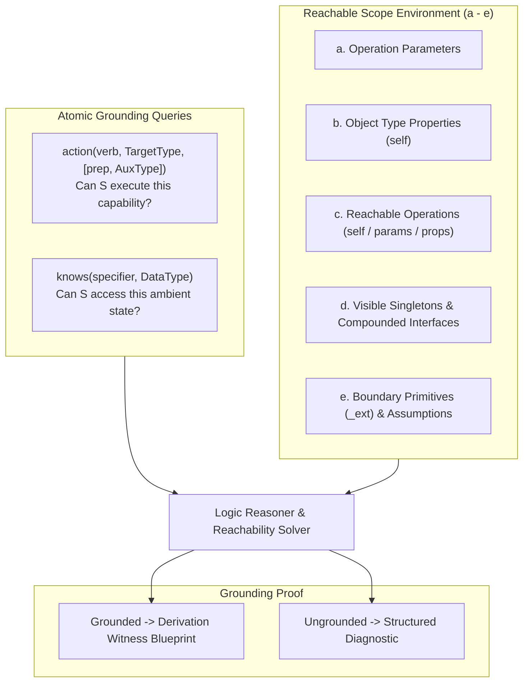
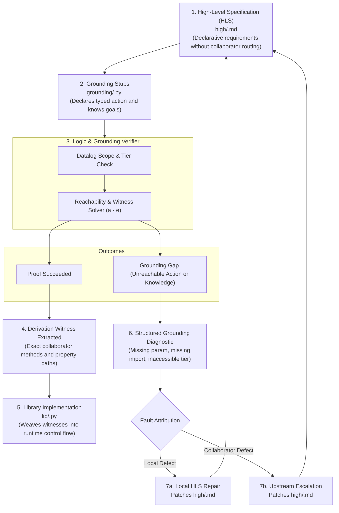

# Logic-Based Grounding Verification & Formal Specification

## 1. Executive Summary & Problem Statement

In the Cleanroom architecture, **Grounding** bridges literate High-Level Specifications (`high/*.md`) with structural Python interface stubs (`grounding/*.pyi`), which in turn guide the generation of executable library code (`lib/*.py`) and deterministic unit tests (`tests/*_test.py`).

Grounding is intended to guarantee that an implementation is **realizable** before any runtime code is authored:
- **Knowledge Custody**: Every input, configuration, and entity state has an unbroken derivation path from in-scope sources.
- **Operational Satisfiability**: All required capabilities and invariants can be achieved using accessible collaborator services and external primitives (`_ext`).
- **Absence of Floating Directives**: No component relies on ambient context, implicit global variables, or uncontracted behavior.

### 1.1 The Current Grounding Failure Mode
Today, structural AST rules (type annotations, decorators, MRO inheritance) are enforced deterministically by `grounding_tool.py`. However, semantic grounding itself—the proof that an operation can actually satisfy its requirements—relies on an unverified natural language block in implementation stubs:
```python
GROUNDING_ARGUMENT:
- Receives actual parameter bindings, resolves host paths using imported agent_file_alias.AliasManager workspace root in the same session lifecycle tier, resolves unbound .py and module requests...
```
Because `SpecLintVisitor` treats `GROUNDING_ARGUMENT:` as an opaque string, semantic grounding is an **unverifiable honor system**:
1. **LLM Hallucinations**: Models generate plausible-sounding narrative arguments that gloss over missing method arguments, inaccessible singleton collaborators, or unhandled branches.
2. **Delayed Error Discovery**: Grounding gaps are not detected at the specification stage. Instead, they manifest late during library code generation (`grounding_to_lib`) or unit testing, forcing emergency ad-hoc fixes or fabricated requirements.
3. **Premature Implementation Leaks**: Authors prematurely jump straight to concrete library APIs (e.g. hardcoding `tool_provider.ToolManager.install_tool(...)` into docstrings or requirements) instead of stating the high-level domain capability and letting grounding reason about how it is grounded.
4. **Lack of Falsifiability**: An agent or human cannot mechanically verify whether a proposed specification is sound without mentally executing the entire system.

### 1.2 Dual Objectives of Formal Grounding
Formalizing grounding is not merely a gatekeeping check. It serves two distinct generative and self-healing functions in the Cleanroom pipeline:
1. **Downstream Witness Generation (Code Generation Blueprint)**: When a grounding derivation is proven, the solver's proof tree serves as a concrete, step-by-step provenance guide for the AI agent generating library code (`lib/*_impl.py`), eliminating guesswork and hallucinated wiring.
2. **Upstream HLS Self-Healing (Specification Repair)**: When a grounding check fails due to an architectural mistake, omitted parameter, or missing collaborator in the High-Level Specification, the structured diagnostic (counterexample / unsatisfied derivation) is fed directly to an LLM to **repair the upstream HLS (`high/*.md`)**, automatically re-aligning the downstream pipeline.

---

## 2. Foundational Principles: Separating Grounding from Control Flow

### 2.1 The Two Orthogonal Functions in Grounding Stubs
Historically, `.pyi` grounding specifications have conflated two separate concerns:
1. **Presentation of Requirements**: A text-based organization of requirements under specific operations or types (`FRESH_REQUIREMENTS:`). This is an organizational convenience. It is orthogonal to semantic feasibility.
2. **Semantic Grounding Reasoning**: A formal proof establishing whether the requirements can be feasibly realized using accessible capabilities and state.

### 2.2 Eliminating Accidental Complexity
To make grounding mathematically verifiable, we discard two sources of accidental complexity:

1. **Control-Flow Conditions (`when`, `if/else`) are for Code Generation, NOT Grounding**:
   Grounding does not care whether a runtime branch evaluates to true or false. Grounding is strictly an **existential reachability problem**: can the component perform the required actions and observe the required information across all mandated behaviors? The runtime branching logic belongs strictly to library code generation (`grounding_to_lib`).
2. **Prohibitions (`prohibits`, "never do X") Do Not Require Grounding**:
   Doing nothing requires zero capability and zero state access. Prohibitions are safety invariants and unit test assertions, not grounding feasibility obligations.

### 2.3 The Reachable Scope Environment (a - e)
Every requirement has a scope to which it applies (an operation on an object type, or an invariant on an object type). For any given scope S, the accessible environment consists strictly of:
- **a. Parameters** of operation S (if an operation requirement).
- **b. Properties** of the enclosing object type (accessible via `self`).
- **c. Operations** accessible on the same type, or reachable by traversing properties or parameters.
- **d. Properties and operations** accessible via singleton objects visible from components imported into the local component, respecting lifecycle tier containment (child tiers can access ancestor tiers; ancestor tiers cannot access child tiers).
- **e. Assumptions and extension facts** in scope (`_ext`), which are taken as axioms.

### 2.4 Goal Extraction vs. Solver Inference

A core architectural principle of Cleanroom grounding is the strict separation between **Goal Extraction** (authoring specification obligations) and **Solver Inference** (proving reachability and synthesizing witnesses):

1. **Specification Extraction (Without Inference)**:
   - When extracting grounding requirements from High-Level Specifications (`high/*.md`), the author states **only direct domain obligations and explicit ambient observations**.
   - **No Manual Mental Execution**: Specification authors must never mentally execute the implementation or unroll internal assembly plumbing into docstrings (e.g. manually unrolling `action("read", BoundFile)` into `knows("workspace root")`, `knows("workspace path")`, and `filesystem_ext.read_text`).
   - **Compliance with HLS Rule 109**: High-level specifications must state capabilities and invariants declaratively around domain entities without micromanaging collaborator routing (e.g. stating "responses for read-only files mask host paths" rather than "sanitize host paths through the alias manager").

2. **Solver Inference (Reachability Proof & Witness Synthesis)**:
   - The automated reasoning engine (Datalog / Reachability solver) is responsible for determining *how* high-level domain actions reach concrete external boundary primitives (`_ext`) or collaborator methods.
   - The solver verifies that necessary context (e.g. `WorkspaceRoot` from `AliasManager`, `WorkspacePath` from `BoundFile`) is accessible in scope and proves the path to `filesystem_ext.read_text`.
   - The resulting proof tree forms the **derivation witness**, which guides downstream library code generation (`lib/*.py`) without hallucinated wiring.

3. **Interface Grounding Contracts and Compounding**:
   - Interface methods are abstract protocol stubs with ellipsis (`...`) bodies. They declare capability obligations and information guarantees that any conforming implementation must satisfy.
   - When an implementation accesses an interface type (via parameter `a`, property `b`, or imported singleton `d`), the interface's declared `GROUNDING_REQUIREMENTS:` compound into the implementation's accessible scope environment.

4. **Mandatory Numbered Requirements & Stable Citations**:
   - Requirements under `FRESH_REQUIREMENTS:` must be explicitly numbered (`1.`, `2.`, ...) to provide unambiguous, stable citation anchors for justifications under `GROUNDING_REQUIREMENTS:` and `GROUNDING_ASSUMPTIONS:`.

5. **Strongly Typed Domain Concepts**:
   - Grounding requires named types. Complex domain parameters and payloads must not degenerate into untyped generic primitives (`dict`, `Mapping[str, Any]`, `str`). Concepts passed across collaborators must be introduced as explicit named types (e.g. `@data_type class TemplateParameters(Mapping[str, Any]): ...`).

6. **Schema Properties Omit Grounding**:
   - Pure schema descriptors, constant identifiers, and parameter definitions (e.g. `name`, `description`, `path_parameter`) omit grounding blocks unless exercising an external capability.

7. **Elimination of Inherited Prose Duplication**:
   - Specifications using grounding contracts omit `INHERITED_REQUIREMENTS:` and `INHERITED_ASSUMPTIONS:`. Each type and operation declares its own fresh numbered requirements and justified grounding entries.

---

## 3. The Core Grounding Predicates: `action` and `knows`

All grounding obligations in scope S decompose into two typed predicates:

### 3.1 `action(...)` (Capability Feasibility)

Capabilities represent operations or state mutations invoked on domain entities or collaborators:

- **Unary Action**: `action(verb, TargetType): <justification>`
  - Examples: `action("read", agent_file_alias.BoundFile)`, `action("install", tool_provider.Tool)`
- **Relational Action**: `action(verb, TargetType, preposition, AuxType): <justification>`
  - Examples: `action("format", str, "with", template_format.TemplateParameters)`, `action("record", agent_file_alias.BoundFile, "in", sandbox_file_editor.EditManager)`

#### Subtyping and Subsumption
Action resolution natively respects object-oriented and structural subtyping:
- If a collaborator provides `action("install", tool_provider.Tool)`, an operation requiring `action("install", sandbox_file_reader.ViewFileTool)` is automatically proven grounded via covariance over the target type (`ViewFileTool <: Tool`).
- The author does not need to invent ad-hoc aliases; the solver leverages the declared type hierarchy in the `.pyi` AST.

### 3.2 `knows(...)` (Knowledge Custody)

`knows` is strictly reserved for **ambient contextual data or state observations** that a requirement explicitly demands inspecting as an end in itself:

- **Syntax**: `knows(specifier, DataType): <justification>`
  - Examples: `knows("guide file", Optional[agent_file_alias.UnboundFile])`, `knows("mcp mode", bool)`

#### What `knows` is NOT:
1. **Not Singletons**: Visible singletons in the same lifecycle tier are available by import. You never write `knows(AliasManager)` or `knows(NodeConfig)`.
2. **Not Properties of Arguments in Scope**: If an operation receives `target_file: BoundFile`, accessing `target_file.workspace_path` or `target_file.relative_path` is intrinsic to holding `BoundFile`. You never write `knows("workspace path")`.
3. **Not Internal Assembly Plumbing**: Intermediate variables needed only to fulfill an action (such as `workspace_root` needed to resolve a disk path for `action("read", BoundFile)`) are inferred by the solver, never declared as manual `knows` requirements.

---

## 4. Datalog and Reachability in Scoped Environments

### 4.1 Forward Reachability
For single-operation grounding, evaluation proceeds via forward reachability over the scoped environment:
1. **Base Facts**:
   ```
   Environment(S) = Params(S) U Props(Self) U ReachableOps(Self) U VisibleSingletons(Imports) U ExtFacts
   ```
2. Forward chaining computes the reachable closure of all values, types, and operational capabilities the scope can access or invoke.
3. For each required `action(...)` and `knows(...)`, the reasoner checks whether a provider exists in the reachable set (including via subtyping subsumption).
4. If provable, the derivation witness (the exact collaborator calls and access paths) is recorded for downstream code generation. If unprovable, the set difference pinpoints the exact grounding gap.

### 4.2 Transitive Closure & Lifecycle Tier Containment
Transitive component imports (`imports:`) and lifecycle tier hierarchies (`system` >= `agent_session`) form directed acyclic reachability graphs. Datalog computes these transitive closures natively and deterministically in polynomial time, guaranteeing that no cycle or recursion can cause non-termination.

---

## 5. The Grounding Architecture



### 5.1 Interface Contracts & Compounding Example: `sandbox_file_reader.pyi`

Interface specifications declare numbered domain requirements alongside capability obligations with explicit justifications:

```python
@singleton_type('agent_session')
class ReadManager(Protocol):
    """
    PURPOSE:
    Defined as an agent session service that manages inspection of workspace files

    FRESH_REQUIREMENTS:
    1. The read manager is an agent session service that manages inspection of workspace files.
    2. The read manager exposes the session read-only files and read-write files.
    3. When step mode is active, the read manager is configured with an unbound guide file.

    GROUNDING_REQUIREMENTS:
      - action("install", tool_provider.Tool): Installs workspace file inspection tools into the session environment to satisfy requirement 1.
    """

    @property
    def read_only_files(self) -> Set[agent_file_alias.ReadOnlyFile]:
        """
        PURPOSE:
        Exposes the agent session's set of read-only files to support session startup context injection

        FRESH_REQUIREMENTS:
        1. Exposes the agent session read-only files.
        """
        ...
```

Notice that the property `read_only_files` simply declares its domain requirement and return type without ritual grounding blocks, while `ReadManager` justifies its `action("install", tool_provider.Tool)` directly against requirement 1.

### 5.2 Implementation Reachability Example: `sandbox_file_reader_impl.pyi`

Implementation specifications are the target of reachability verification:

#### `ReadManager.initialize`
```python
    @operation
    def initialize(self) -> None:
        """
        PURPOSE:
        Provides that initialization unconditionally installs the view file tool, installs the can read tool when mcp mode is active, and never installs the search tool

        FRESH_REQUIREMENTS:
        1. Provides that initialization unconditionally installs the view file tool, installs the can read tool when mcp mode is active, and never installs the search tool.

        GROUNDING_REQUIREMENTS:
          - action("install", tool_provider.Tool): Installs the view file tool and can read tool into the tool provider registry to satisfy requirement 1.
        """
        ...
```
Resolution:
1. `action("install", tool_provider.Tool)`: Resolved via imported singleton `tool_provider.ToolManager.install_tool(tool: Tool)`. Covariance satisfies installing both `ViewFileTool` and `CanReadTool`.

#### `ViewFileTool.execute_tool`
```python
    @operation
    @override
    def execute_tool(self, actual_parameter_bindings: tool_provider.ActualParameterBindings) -> tool_provider.Response:
        """
        PURPOSE:
        Implements execute_tool on the view file tool to inspect file content with line number formatting and alias validation

        FRESH_REQUIREMENTS:
        1. Records the read file in the edit manager on successful execution.
        2. Reads file content of the bound file from the filesystem, returning the content formatted with one-indexed right-aligned line numbers followed by a colon and space, and formatting read-only markdown files ending with .md with session template parameters after filtering out paragraphs beginning with > META:.
        3. Treats a read-write file as having empty content when the target file does not exist on disk, and fails with a response guiding agent recovery when inspecting a missing read-only file.
        4. Resolves to that grounding specification file alias if the relative path or qualified path addresses a module name or ends with .py and matches a declared read-only grounding specification ending with .pyi, when an unbound file is supplied.
        5. Fails with a response explaining that test files are not inspectable and grounding specifications serve as the contract if the unbound file addresses a test file ending with _test.py.
        6. Fails with a response guiding agent recovery, reminding the agent that only declared files can be inspected, listing available readable file aliases, and, if the unbound file matches the guide file configured for step-mode, that advance must be called to read the guide instead, otherwise.
        7. View file tool responses for read-write files carry a suppression key matching the file's relative path, while responses for read-only files omit suppression keys and mask host paths.

        GROUNDING_REQUIREMENTS:
          - action("record", agent_file_alias.BoundFile, "in", sandbox_file_editor.EditManager): Records file inspection in the edit manager as required by requirement 1.
          - action("read", agent_file_alias.BoundFile): Reads file content from the filesystem as required by requirement 2.
          - action("format", str, "with", template_format.TemplateParameters): Formats markdown templates with session template parameters as required by requirement 2.
          - action("sanitize", str, "using", agent_file_alias.AliasManager): Masks host paths in output responses as required by requirement 7.
          - knows("guide file", Optional[agent_file_alias.UnboundFile]): Checks whether an unbound file matches the session guide file as required by requirement 6.
        """
        ...
```

Notice the stark contrast with old, procedural grounding annotations:
- **No manual unrolling**: The author never writes `knows("workspace root")` or `knows("workspace path")`. The author states the domain goal: `action("read", agent_file_alias.BoundFile)`.
- **Automatic Solver Inference**: The solver automatically unifies `action("read", BoundFile)` with `filesystem_ext.read_text(path: HostPath)` by finding `BoundFile.workspace_path` on the input entity and `AliasManager.workspace_root` on the visible session singleton, resolving them via `file_paths.resolve_path`.
- **Derivation Witness**: The solver synthesizes the complete witness blueprint for library generation:
  ```
  host_path = file_paths.resolve_path(AliasManager.workspace_root, target_file.workspace_path)
  content = filesystem_ext.read_text(host_path)
  ```

---

## 6. The Bidirectional Neuro-Symbolic Workflow



### 6.1 Downstream Witness Generation (Code Generation Blueprint)
When the grounding verifier succeeds, it outputs the **derivation witness**—the structured proof tree showing exactly which collaborator method produces each capability and which property path yields each value.

This witness is included directly in the prompt given to the AI agent authoring the library code (`update_python_with_ai/guides/grounding_to_lib.md`). The code generator takes the verified witnesses and weaves them into the required `if/else` control flow branches.

### 6.2 Upstream HLS Self-Healing & Fault Attribution
Cleanroom's foundational rule states: **Grounding problems must be resolved upstream at the specification level (HLS first), never downstream in code.**

When the grounding verifier detects an error, it generates an actionable, machine-readable diagnostic:
```json
{
  "error": "UNGROUNDED_ACTION",
  "component": "sandbox_file_reader_impl",
  "operation": "execute_tool",
  "missing_capability": "action('read', 'file')",
  "required_by": "Tool execution reads file content from the filesystem...",
  "reason": "Component 'sandbox_file_reader_impl' does not import 'filesystem_ext'."
}
```
Or for missing knowledge:
```json
{
  "error": "FLOATING_DIRECTIVE",
  "component": "runner_logger_impl",
  "operation": "log_turn",
  "missing_knowledge": "knows('session id')",
  "required_by": "The runner logger records the session identifier...",
  "reason": "RunnerLogger is a 'system' service and cannot access 'agent_session' context without an explicit operation parameter."
}
```

The fault router attributes the defect:
- **Local Defect**: The local specification omitted an import, dropped a parameter, or violated tier custody. Repaired in local HLS.
- **Collaborator Defect**: The collaborator legitimately needs to expose a capability or state, but its interface omits it. Escalated upstream to collaborator HLS and interface.

---

## 7. Comparative Evaluation

| Dimension | Current Cleanroom (`.pyi` NLP) | Classical FOL (Prolog) | Full Theorem Provers (Dafny / Lean) | Proposed Atomic Query + Reachability Solver |
| :--- | :--- | :--- | :--- | :--- |
| **Verification Reliability** | Low (LLM honor system) | Low–Medium (Cycles, non-termination) | Extremely High | **High (Deterministic proof)** |
| **Termination Guarantee** | N/A (Unchecked) | No (Infinite SLD loops possible) | Undecidable (Manual proof tactics) | **Guaranteed (Polynomial time)** |
| **Transitive Closure / Reachability**| Manual review | Cannot express finitely (Compactness) | Expressible via inductive proofs | **Native (Least Fixed Point)** |
| **Capability Matching** | Unchecked prose | Unification on predicates | Verified via Hoare logic | **Action & Knowledge Reachability** |
| **Witness Generation for Code Gen** | None (Guesses from stubs) | Poor | Manual extraction | **Automatic (Derivation witness blueprint)** |
| **Authoring Burden** | Low (Free-form English) | Very High (Prolog clauses) | Prohibitive (Proof proofs) | **Minimal (Atomic action/knows queries)** |

---

## 8. Practical Implementation Roadmap

### Phase 1: Datalog Scope & Import Verifier (Complete)
- Extract relational facts from `.pyi` AST: `service`, `tier`, `imports`, `operation`.
- Enforce strict tier containment (`system` >= `agent_session`) and imports completeness.

### Phase 2: Atomic Grounding Queries & Interface Compounding (Complete)
- Introduce atomic `action("verb", "object")` and `knows("<concept/value>")` queries.
- Support `GROUNDING:` and `GROUNDING_ASSUMPTIONS:` across both interface (`<name>.pyi`) and implementation (`*_impl.pyi`) specifications.
- Compound interface guarantees into the accessible scope environment for implementing and consuming components.
- Implement the reachability solver in `grounding_tool.py` to verify that every query in scope S unifies with a provider in the scope environment (a - e).
- Transitive dependency resolution: auto-index repository specifications and transitively resolve imports.
- Output derivation witnesses for downstream code generation.

### Phase 3: Automated Upstream HLS Repair Loop
- When an atomic query fails reachability, generate structured diagnostic JSON.
- Implement automated prompt feeding the diagnostic to an LLM to patch the upstream HLS (`high/<name>.md`).

---

## 9. Conclusion

By separating orthogonal requirement presentation from semantic feasibility, discarding runtime control-flow distractions, and focusing on atomic `action(...)` and `knows(...)` reachability queries:
- **The authoring burden is minimal**: The LLM transcribes atomic capability and knowledge phrases directly from HLS prose.
- **No premature API leaks**: Authors never hardcode collaborator method calls or internal storage mechanisms into docstrings.
- **The logic reasoner does the heavy lifting**: The engine deterministically solves reachability across the scope environment (a - e) and generates the execution blueprint for code generation.
