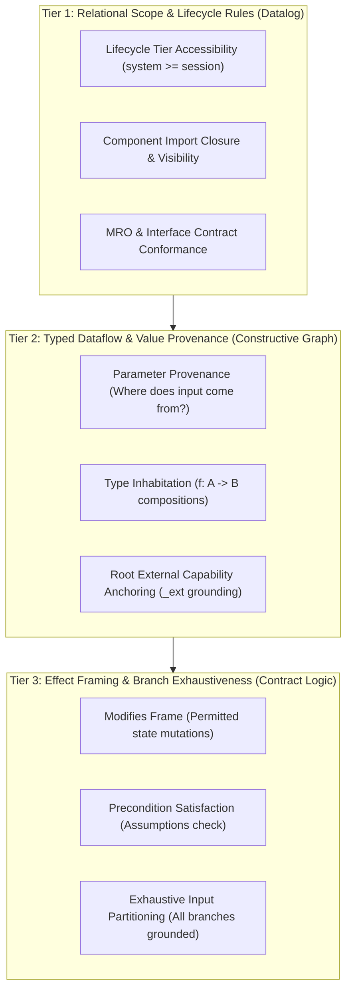
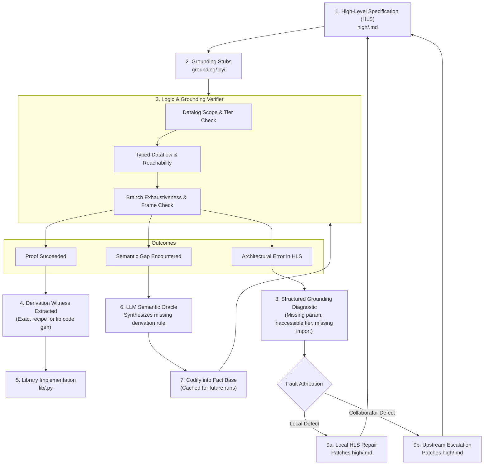

# Logic-Based Grounding Verification & Formal Specification

## 1. Executive Summary & Problem Statement

In the Cleanroom architecture, **Grounding** bridges literate High-Level Specifications (`high/*.md`) with structural Python interface stubs (`grounding/*.pyi`), which in turn guide the generation of executable library code (`lib/*.py`) and deterministic unit tests (`tests/*_test.py`).

Grounding is intended to guarantee that an implementation is **realizable** before any runtime code is authored:
- **Knowledge Custody**: Every input, configuration, and entity state has an unbroken derivation path from in-scope sources.
- **Operational Satisfiability**: All required capabilities and invariants can be achieved using accessible collaborator services and external primitives (`_ext`).
- **Absence of Floating Directives**: No component relies on ambient context, implicit global variables, or uncontracted behavior.

### 1.1 The Current Grounding Failure Mode
Today, structural AST rules (type annotations, decorators, MRO inheritance) are enforced deterministically by [`grounding_tool.py`](file:///Users/seanmcdirmid/projects/cleanroom/update_with_ai/support/lib/grounding_tool.py). However, semantic grounding itself—the proof that an operation can actually satisfy its requirements—relies on an unverified natural language block in implementation stubs:
```python
GROUNDING_ARGUMENT:
- Receives actual parameter bindings, resolves host paths using imported agent_file_alias.AliasManager workspace root in the same session lifecycle tier, resolves unbound .py and module requests...
```
Because `SpecLintVisitor` treats `GROUNDING_ARGUMENT:` as an opaque string, semantic grounding is an **unverifiable honor system**:
1. **LLM Hallucinations**: Models generate plausible-sounding narrative arguments that gloss over missing method arguments, inaccessible singleton collaborators, or unhandled branches.
2. **Delayed Error Discovery**: Grounding gaps are not detected at the specification stage. Instead, they manifest late during library code generation (`grounding_to_lib`) or unit testing, forcing emergency ad-hoc fixes or fabricated requirements.
3. **Lack of Falsifiability**: An agent or human cannot mechanically verify whether a proposed specification is sound without mentally executing the entire system.

### 1.2 Dual Objectives of Formal Grounding
Formalizing grounding is not merely a gatekeeping check. It serves two distinct generative and self-healing functions in the Cleanroom pipeline:
1. **Downstream Witness Generation (Code Generation Blueprint)**: When a grounding derivation is proven, the solver's proof tree serves as a concrete, step-by-step provenance guide for the AI agent generating library code (`lib/*_impl.py`), eliminating guesswork and hallucinated wiring.
2. **Upstream HLS Self-Healing (Specification Repair)**: When a grounding check fails due to an architectural mistake, omitted parameter, or missing collaborator in the High-Level Specification, the structured diagnostic (counterexample / unsatisfied derivation) is fed directly to an LLM to **repair the upstream HLS (`high/*.md`)**, automatically re-aligning the downstream pipeline.

---

## 2. Theoretical Foundations: FOL vs. Datalog

### 2.1 Why Classical First-Order Logic (FOL) Falls Short
The intuitive approach to formalizing grounding is:
> *"Represent each requirement as a first-order logic rule, and use backward chaining from the target requirement back to root axioms provided by external boundary specs (`_ext`)."*

While attractive, classical First-Order Logic (FOL) and Horn-clause backward chaining (e.g., standard Prolog) cannot adequately represent software specification dependencies for fundamental mathematical reasons:

1. **Monotonicity vs. State Mutation (The Frame Problem)**:
   Classical FOL is monotonic: if $P$ is proven, it remains true forever ($\Gamma \vdash P \implies \Gamma \cup \{A\} \vdash P$). Software requirements, however, describe destructive updates and state transitions (e.g., `EditManager.record_read`, `LoopGuard.record_progress`). In FOL, modeling transitions requires reifying states (Situation Calculus: $\text{Holds}(P, \text{do}(a, s))$), which immediately triggers the Frame Problem, causing proof searches to explode.
2. **Propositional Truth vs. Constructive Value Synthesis (Curry–Howard)**:
   FOL answers a boolean question: *"Is proposition $\phi$ true?"* Grounding asks whether a runtime value or transformation can be *constructed*:
   $$\text{actual\_parameter\_bindings} \xrightarrow{\text{extract}} \text{path} \xrightarrow{\text{AliasManager}} \text{host\_path} \xrightarrow{\text{filesystem\_ext}} \text{raw\_text} \xrightarrow{\text{TemplateFormatter}} \text{Response}$$
   Under the Curry–Howard isomorphism, this is **Type Inhabitation / Term Synthesis** in Constructive Logic, not classical truth evaluation.
3. **Scoping and Lifecycle Tiers as Epistemic Modalities**:
   Cleanroom enforces strict tier accessibility (`system` services cannot access `agent_session` services). In pure FOL, all terms share a flat universe. Grounding requires an **Object-Capability System** or **Epistemic Modal Logic** ($K_{\text{tier}} \phi$: "service at tier $T$ has access to $\phi$").
4. **Exhaustive Branch Coverage vs. Single Proof Search**:
   Backward chaining in Prolog stops at the *first* proof path. Software requirements mandate that *all* mutually exclusive input branches (e.g. bound file vs. unbound file vs. test file) are independently grounded.

### 2.2 How Datalog Goes Beyond First-Order Logic (The Transitive Closure Paradox)
It sounds paradoxical that Datalog—syntactically a restricted subset of FOL (function-free Horn clauses)—can express things FOL cannot.

The difference lies in **Least Fixed Point (LFP) Semantics vs. Classical Model Theory**:
- **The Transitive Closure Barrier**: By the *Compactness Theorem of First-Order Logic*, it is mathematically impossible to write a finite FOL sentence that expresses unbounded reachability ("there exists a path of arbitrary length from $A$ to $B$"). FOL can only state reachability up to a fixed constant length $k$.
- **Datalog's Recursive Power**: Datalog defines relations through recursion evaluated to a least fixed point:
  ```prolog
  reachable(X, Y) :- edge(X, Y).
  reachable(X, Y) :- reachable(X, Z), edge(Z, Y).
  ```
  By the Immerman–Vardi theorem, Datalog with stratified negation captures all polynomial-time relational queries ($P\text{TIME}$), strictly exceeding the expressive power of finite First-Order Logic on finite models.

In Cleanroom:
- Transitive component import closures (`imports:`),
- Lifecycle tier reachability graphs (`system` $\ge$ `agent_session`),
- Dependency cleaning graph traversals (`dag_subgraph`), and
- Multi-step requirement derivation chains back to `_ext` root axioms,
are all **transitive closures**. Datalog computes them natively and deterministically in polynomial time.

---

## 3. Datalog: Forward Chaining, Backward Queries, and Magic Sets

### 3.1 Bottom-Up (Forward Chaining) Evaluation
Standard Datalog engines (e.g. Soufflé, DDlog) evaluate rules **bottom-up (forward chaining)**:
1. Start with the Extensional Database (EDB): base facts (e.g. `service("ReadManager", "agent_session")`, `imports("sandbox_file_reader_impl", "filesystem_ext")`).
2. Iteratively apply Intensional Database (IDB) rules using **Semi-Naive Evaluation** to derive new facts until reaching a least fixed point.
3. Every derived fact is guaranteed to be a true consequence of the rules.
4. Because function symbols in recursive cycles are prohibited, evaluation **always terminates in polynomial time**.

### 3.2 Top-Down Queries via the Magic Sets Transformation
When querying whether a specific requirement is grounded:
`?- is_grounded("sandbox_file_reader_impl", "execute_tool", "Response").`

Evaluating raw forward chaining across the whole system would compute millions of irrelevant facts. The **Magic Sets Transformation** solves this:
1. The compiler statically analyzes the top-down goal query.
2. It introduces auxiliary "magic" filter predicates that restrict computation strictly to facts that are causally relevant to proving the goal.
3. The rewritten program is evaluated **bottom-up (forward chaining)**.

**Result**: Magic Sets provides the **goal-directed efficiency of top-down backward chaining** combined with the **termination guarantees, cycle safety, and set-at-a-time performance of bottom-up forward chaining**.

### 3.3 Forward Reachability in a Scoped Universe
For single-operation grounding, forward chaining is particularly natural:
1. Define the local universe for an operation:
   $$\text{Base Facts} = \{\text{Op Parameters}\} \cup \{\text{In-Scope Ancestor Singletons}\} \cup \{\text{Imported Collaborator Methods}\} \cup \{\text{\_ext Primitives}\}$$
2. Forward chaining computes the **forward reachable closure** of all values, types, and state capabilities the operation can generate.
3. If the required postconditions and return types belong to this reachable set, the operation is grounded. If not, the set difference $(\text{Required} \setminus \text{Reachable})$ pinpoints the exact grounding gap.

---

## 4. Complex Requirement Patterns: Beyond a Simple Predicate Set

While core architectural scope rules fit into a small relational metamodel, real-world specifications in Cleanroom feature complex behavioral patterns that exceed simple static predicates:

### 4.1 Temporal Delta State (Initial vs. Current)
In [`sandbox_file_editor_impl.md`](file:///Users/seanmcdirmid/projects/cleanroom/update_with_ai/parts/sandbox/high/sandbox_file_editor_impl.md#L18):
> *"The edit manager exposes whether workspace file modifications occurred during the session by comparing current workspace file content against initial content before editing..."*

This requires comparing two distinct temporal snapshots of the *same* physical resource: $Content(t_0)$ vs $Content(t_{\text{now}})$. A static property predicate cannot express "initial session snapshot" without an explicit state model.

### 4.2 Higher-Order Graph Quantification Across Execution Phases
In [`bazel_loop_impl.md`](file:///Users/seanmcdirmid/projects/cleanroom/update_with_ai/parts/bazel/high/bazel_loop_impl.md#L22):
> *"Cleaning halts immediately and produces a failing build result if node cleaning fails, if any reachable node in the target subgraph remains dirty after cleaning, or if an unexpected failure occurs..."*

This evaluates a second-order aggregation over a dynamic set: computing the transitive reachable subgraph from a target, filtering for nodes where `dirty == True`, and evaluating this predicate strictly *after* an iterative cleaning loop concludes.

### 4.3 Domain-Specific Algorithmic Synthesis
In [`openai_driver_impl.md`](file:///Users/seanmcdirmid/projects/cleanroom/update_with_ai/parts/openai/high/openai_driver_impl.md#L18):
> *"When a model response is truncated at the generation limit, the loop driver terminates any truncated tool invocation by repairing unclosed arguments into valid JSON and appending a tool failure response with the tool's suppression key..."*

Standard libraries do not provide "repair unclosed JSON". This requirement specifies an internal algorithmic transformation. It cannot be satisfied simply by delegating to an imported collaborator; it requires an explicit internal utility contract.

### 4.4 Multi-Way Fallback with Non-Failing Warning Payloads
In [`sandbox_file_editor_impl.md`](file:///Users/seanmcdirmid/projects/cleanroom/update_with_ai/parts/sandbox/high/sandbox_file_editor_impl.md#L34):
> *"Implicitly binds the target file to the last file read or edited in the edit manager if that file is a read-write file, informs the agent with a warning in the response content that the path was implicitly bound while allowing the tool execution to proceed, or fails if no file has been read or edited or if the last read or edited file is not a read-write file, when the path parameter is omitted."*

This branch ties parameter resolution directly to response payload mutation *without* failing execution, while branching to a fatal failure if the fallback condition is unmet.

---

## 5. The 3-Tier Formal Grounding Architecture

Cleanroom addresses these challenges by decomposing grounding into three distinct, verifiable tiers:



### Tier 1: Relational Scope & Lifecycle Verification (Datalog Engine)
Verifies systemic architectural rules across the whole corpus:
- **Child tiers access ancestor tiers; ancestor tiers never access child tiers.**
- **Components can only access singletons declared locally or in explicit `imports:`.**
- **All referenced interfaces must be implemented completely.**

### Tier 2: Typed Dataflow & Value Provenance (Constructive Graph)
Replaces unstructured English in `GROUNDING_ARGUMENT:` with structured derivation blocks in `.pyi` docstrings:
```python
@singleton_type('agent_session')
class ViewFileTool(sandbox_file_reader.ViewFileTool):

    @operation
    @override
    def execute_tool(
        self,
        actual_parameter_bindings: tool_provider.ActualParameterBindings
    ) -> tool_provider.Response:
        """
        PURPOSE:
        Inspects workspace file content with line numbering and sanitization.

        GROUNDING:
          collaborators:
            - agent_file_alias.AliasManager
            - filesystem_ext
            - sandbox_file_editor.EditManager
          derivation:
            alias = actual_parameter_bindings.get(self.path_parameter)
            host_path = AliasManager.resolve_host_path(alias)
            raw_text = filesystem_ext.read_text(host_path)
            numbered_text = self._format_lines(raw_text)
            sanitized_text = AliasManager.sanitize_text(numbered_text)
            out = tool_provider.Response(content=sanitized_text)
          effects:
            - EditManager.record_read(alias)
        """
        ...
```
The AST visitor type-checks every step against imported `.pyi` signatures and verifies that `filesystem_ext` anchors the root file-reading capability.

### Tier 3: Effect Framing & Branch Exhaustiveness
- **Frame Containment**: State mutations listed under `effects:` can only target services in the same lifecycle tier or registered stores.
- **Exhaustive Branching**: Verifies that conditional requirements (`branch: ...`) form an exhaustive partition over input variants (e.g. `BoundFile` vs `UnboundFile`).

---

## 6. The Bidirectional Neuro-Symbolic Workflow

Rather than treating grounding as an isolated verification pass, Cleanroom integrates grounding bidirectionally across the authoring lifecycle:



### 6.1 Downstream Witness Generation (Code Generation Blueprint)
When the grounding verifier succeeds, it outputs the **derivation witness**—the structured proof tree showing exactly which collaborator method produces each value and which effect updates which state.

This witness is included directly in the prompt given to the AI agent authoring the library code (`update_python_with_ai/guides/grounding_to_lib.md`). The agent is no longer forced to guess collaborator wiring; the verified proof provides the deterministic blueprint.

### 6.2 Upstream HLS Self-Healing & Fault Attribution
Cleanroom's foundational rule states: **Grounding problems must be resolved upstream at the specification level (HLS first), never downstream in code.**

When the grounding verifier detects an error, it performs **Fault Attribution** to distinguish between local defects and collaborator omissions:

1. **The Diagnostic**: The verifier generates an actionable, machine-readable diagnostic explaining the exact architectural gap:
   ```json
   {
     "error": "UNGROUNDED_REQUIREMENT",
     "component": "sandbox_file_reader_impl",
     "operation": "execute_tool",
     "missing_capability": "filesystem_ext.read_text",
     "required_by": "Tool execution reads file content from the filesystem at host path...",
     "reason": "Component 'sandbox_file_reader_impl' does not import 'filesystem_ext'."
   }
   ```
   Or for an ungrounded parameter:
   ```json
   {
     "error": "FLOATING_DIRECTIVE",
     "component": "runner_logger_impl",
     "operation": "log_turn",
     "missing_input": "session_id",
     "required_by": "The runner logger records the session identifier...",
     "reason": "RunnerLogger is a 'system' service and cannot access 'agent_session' context without an explicit operation parameter."
   }
   ```

2. **Fault Attribution: Local Defect vs. Upstream Collaborator Defect**:
   - **Case A: Local HLS Defect**: The required capability or value is already provided by an imported collaborator or `_ext` spec, but the local specification omitted an import, dropped an operation parameter, or violated tier custody.
     - *Action*: Dispatch an in-place repair prompt for the local HLS (`high/<name>.md`).
   - **Case B: Collaborator Interface Defect (Upstream Escalation)**: The local component legitimately requires a capability $C$ that conceptually belongs to a collaborator component $B$, but $B$'s interface does not expose it.
     - *Anti-Pattern Prevented*: Forcing local repair would compel Component $A$ to contort its prose, invent artificial workarounds, or drop a necessary requirement.
     - *Action*: The verifier pauses $A$'s alignment and **escalates an upstream repair request** to collaborator $B$'s HLS (`high/<collaborator>.md`) and interface stub (`grounding/<collaborator>.pyi`). Once $B$ exposes capability $C$, alignment cascades back down to $A$.

3. **LLM Specification Repair Prompt**:
   For local repairs, the diagnostic is supplied to an LLM repair prompt with the current `high/<name>.md` and the HLS guide:
   > *"The specification has a grounding gap: `RunnerLogger` attempts to log `session_id`, but as a system service it has no custody of session state. Refactor the `## Types and Behavior` prose in `high/runner_logger.md` to accept `session_id` as an operation parameter, or declare how the identity is bound."*

4. **Automated Re-Alignment Cascade**:
   The LLM patches the HLS prose. Tooling automatically cascades the update:
   $$\text{HLS (`high/*.md`)} \xrightarrow{\text{align}} \text{Grounding (`grounding/*.pyi`)} \xrightarrow{\text{verify}} \text{Verifier Passes} \xrightarrow{\text{cascade}} \text{Lib \& Tests}$$

This closes the loop: specifications become **self-healing** through automated grounding feedback.

### 6.3 Semantic Gap Plugging & The Closed-World Oracle Guardrail
When the verifier encounters a domain-specific requirement that does not immediately unify with standard predicates (such as comparing temporal snapshots or repairing JSON syntax):

1. **The LLM Semantic Oracle**: The verifier queries an LLM to explain the missing derivation path:
   > *"How does `EditManager` maintain custody of 'initial content' before editing?"*

2. **The Closed-World Guardrail (Preventing Self-Fulfilling Derivations)**:
   A major failure mode of unconstrained LLMs is fabricating "self-fulfilling" derivations—inventing phantom helpers (e.g. *"Calls `PathHelper.to_disk()`"*) out of thin air to make the proof pass on paper.
   - **The Strict Invariant**: The logic engine enforces a **Closed-World Constraint** on the Oracle. Every node and transition in the hypothesized derivation must strictly unify with:
     1. An existing symbol or method in declared, imported `.pyi` interface stubs,
     2. An in-scope parameter or declared internal state on `self`, or
     3. A physical capability anchored to an imported `_ext` boundary.
   - If the oracle claims that a capability requires a *new* collaborator operation, the system rejects the derivation as an ungrounded hallucination and diverts it to **Upstream Escalation (Section 6.2)**.

3. **LLM Explains & Formulates Rule**:
   Under the closed-world constraint, the LLM identifies how existing structures satisfy the requirement:
   > *"EditManager records `initial_content: Dict[FileAlias, str]` during materialization and evaluates current content against this store."*

4. **Codification**: The explanation is codified into the component's static grounding facts:
   ```prolog
   maintains_state("EditManager", "initial_content", "Dict[FileAlias, str]").
   derives_comparison("workspace_files_modified", "current_content", "initial_content").
   ```

5. **Permanent Regression Defense**: Once codified, this derivation is deterministic. Future verification runs check the rule statically without re-querying the LLM.

---

## 7. Comparative Evaluation

| Dimension | Current Cleanroom (`.pyi` NLP) | Classical FOL (Prolog) | Full Theorem Provers (Dafny / Lean) | Proposed Neuro-Symbolic Datalog + Graphs |
| :--- | :--- | :--- | :--- | :--- |
| **Verification Reliability** | Low (LLM honor system) | Low–Medium (Cycles, non-termination) | Extremely High | **High (Deterministic proof)** |
| **Termination Guarantee** | N/A (Unchecked) | No (Infinite SLD loops possible) | Undecidable (Manual proof tactics) | **Guaranteed (Polynomial time)** |
| **Transitive Closure / Reachability**| Manual review | Cannot express finitely (Compactness) | Expressible via inductive proofs | **Native (Least Fixed Point)** |
| **State Mutations & Effects** | Unchecked prose | Fails (Frame problem) | Verified via Hoare logic | **Verified via Effect Framing** |
| **Witness Generation for Code Gen** | None (Guesses from stubs) | Poor | Manual extraction | **Automatic (Derivation tree blueprint)** |
| **Upstream HLS Self-Healing** | Manual debugging | Manual | Complex error traces | **Automated (Diagnostic -> HLS patch)** |
| **Authoring Burden** | Low (Free-form English) | Very High (Prolog clauses) | Prohibitive (Proof proofs) | **Low–Medium (Structured annotations)** |

---

## 8. Practical Implementation Roadmap

### Phase 1: Datalog Scope & Import Verifier (Immediate)
- Extract relational facts from `.pyi` AST: `service`, `tier`, `imports`, `operation`.
- Implement a ~250-line semi-naive Datalog engine in Python (or run Soufflé via CLI).
- Enforce strict tier containment (`system` $\ge$ `agent_session`) and imports completeness on `bazel run //update_with_ai/support/lib:grounding_tool -- --check`.

### Phase 2: Structured Grounding Blocks & Derivation Type-Checking
- Introduce structured `GROUNDING:` blocks in implementation stubs specifying `collaborators:`, `derivation:`, and `effects:`.
- Extend AST visitor in `grounding_tool.py` to type-check derivation steps against imported `.pyi` signatures and anchor root capabilities to `_ext` components.
- Output derivation trees as witnesses for downstream code generation.

### Phase 3: Automated Upstream HLS Repair Loop
- When Phase 1 or Phase 2 flags an unsatisfied requirement or tier violation, generate a structured diagnostic JSON file.
- Implement an agent command / script (`repair_hls_from_grounding`) that feeds the diagnostic to an LLM with the target `high/<name>.md` and prompts an in-place prose repair.
- Re-run the grounding tool to verify that the repair resolved the gap.

### Phase 4: Neuro-Symbolic Rule Accumulation
- For ungrounded semantic gaps, provide an interactive/automated prompt that asks the LLM to hypothesize the derivation path.
- Validate and commit the resulting rule into a project-level fact ledger (`grounding_rules.dl`), growing the system's codified domain knowledge over time.

---

## 9. Conclusion

Formalizing grounding transforms it from a subjective, easily-hallucinated narrative into an **active architectural engine**:
- **Datalog** solves the transitive reachability and scope containment problem that First-Order Logic cannot finitely express.
- **Typed Dataflow Graphs** solve the constructive value synthesis problem, generating concrete implementation blueprints for code generation.
- **Upstream Diagnostic Feedback** enables AI agents to self-heal mistakes in High-Level Specifications before any implementation code is written.

By combining deterministic symbolic verification for architecture and LLM reasoning for semantic translation and repair, Cleanroom achieves a fully grounded, self-correcting specification lifecycle.
