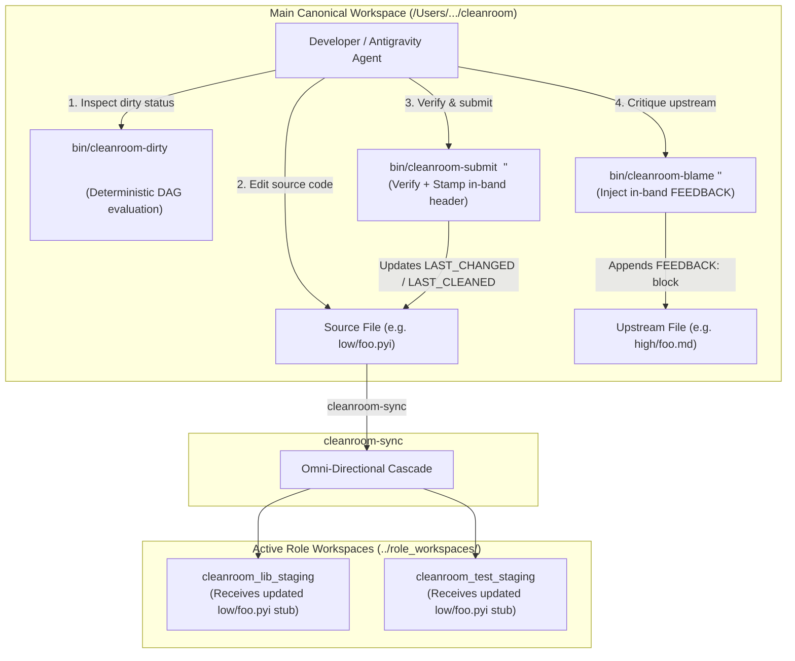
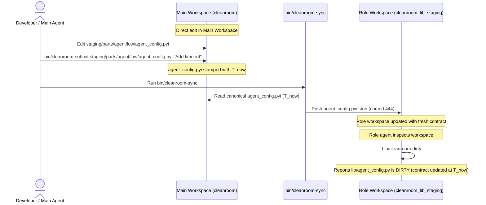

# In-Band Metadata Experience for the Main Canonical Workspace

## 1. Executive Summary & Problem Statement

Cleanroom software construction relies on strict directed acyclic graph (DAG) invariants across specification, planning, contract, grounding, implementation, and testing. While isolated role workspaces (`../role_workspaces/`) provide mathematical confinement for double-blind authoring, developers and AI pair programmers (such as Google Antigravity) also work **directly inside the Main Canonical Workspace**.

### 1.1 The Problem of Direct Main Workspace Modifications
When working directly in the main repository (e.g., editing files in `update_with_ai/` or `staging/`):
1. **Metadata Drift & Stale Headers**: Manual file editing often neglects comment header timestamps. If an engineer modifies `low/agent_config.pyi` without bumping `LAST_CHANGED`, downstream dependencies (`grounding`, `lib`, `test`) remain unaware that the contract has evolved.
2. **Missing Granular Dirty Visibility**: In the main workspace, developers previously had no fast, deterministic way to ask: *"What files are currently dirty in `update_with_ai`?"* or *"What needs to be cleaned in `staging`?"*
3. **Tool Inconsistency Between Environments**: Role workspaces provide helpful commands (`submit`, `blame`, `fail`), but the main workspace lacked an equivalent first-class toolset, forcing engineers to manually craft comments or run low-level Bazel targets.

### 1.2 The Objective: First-Class Main Workspace Experience
This design document establishes the architecture for bringing the complete Cleanroom in-band metadata experience directly into the Main Canonical Workspace:
- **Direct Authoring with Guaranteed Metadata Integrity**: Tooling ensures in-band comment headers remain synchronized, valid, and monotonically increasing during direct edits.
- **Deterministic Directory-Scoped Dirty Checking**: A powerful command (`bin/cleanroom-dirty <directory>`) evaluates the exact dependency DAG for any subtree (e.g., `update_with_ai`, `staging`), reporting which files need cleaning and why.
- **Unified Resolution Toolset**: Symmetrical commands (`cleanroom-submit`, `cleanroom-blame`, `cleanroom-fail`) allow developers and agents to verify, submit, and critique files directly in the main workspace with identical semantics to role workspaces.
- **Frictionless Synergy with `cleanroom-sync`**: Direct edits in the main repository automatically propagate to active role workspaces on the next sync sweep.



---

## 2. Direct Authoring & In-Band Metadata Integrity

### 2.1 The In-Band Source Header Standard
All source files, specifications, and scripts in the canonical workspace adhere to the in-band metadata standard specified in [in_band_source_metadata.md](file:///Users/seanmcdirmid/projects/cleanroom/design-docs/in_band_source_metadata.md):

```python
# --- CLEANROOM METADATA ---
# LAST_CLEANED: 2026-10-03T20:15:00Z
# LAST_CHANGED: 2026-10-03T20:15:00Z
# CHANGE: Added ModelSessionConfig protocol with explicit temperature bounds.
# --- END CLEANROOM METADATA ---
```

### 2.2 Preserving Header Integrity During Manual Edits
When modifying files directly:
1. **Preservation of Non-Code Directives**:
   - Executable scripts containing a shebang (`#!/usr/bin/env python3`) or encoding comment must retain them on line 1. The Cleanroom metadata block immediately follows.
   - Markdown documents retain YAML frontmatter (`---`) at the top, placing HTML metadata comments (`<!-- CLEANROOM METADATA ... -->`) directly beneath.
2. **Metadata Linter & Pre-Commit Enforcement**:
   - `build_lint_common.py` and file verifiers inspect the metadata block during test runs.
   - Files with missing, corrupted, or unparseable headers fail verification, alerting the author immediately before state drift occurs.
3. **Automated Header Stamping**:
   - Authors and coding assistants do not need to manually calculate UTC timestamps. Instead, they invoke `bin/cleanroom-submit` or automated IDE helpers that format the block via `src_metadata.py`.

---

## 3. Deterministic Directory-Scoped Dirty Checking (`bin/cleanroom-dirty`)

### 3.1 Command Overview
The primary diagnostic tool for the main workspace is `bin/cleanroom-dirty`:

```bash
# Check dirty status for a specific directory scope
bin/cleanroom-dirty <directory>

# Examples:
bin/cleanroom-dirty update_with_ai
bin/cleanroom-dirty staging
bin/cleanroom-dirty update_python_with_ai
bin/cleanroom-dirty update_with_ai/parts/sandbox
```

### 3.2 Evaluation Algorithm
`bin/cleanroom-dirty` executes a purely forward dependency evaluation over the designated directory subtree:

1. **File Discovery**: Recursively scans `<directory>` for Cleanroom-managed artifacts (`*.md`, `*.pyi`, `*.py`, `*.gt`, `BUILD.bazel`).
2. **Metadata Parsing**: Reads each file's in-band header using `support/lib/src_metadata.py`.
3. **Forward Dependency Resolution**: Queries declared forward dependencies for each unit from its package `BUILD.bazel`.
4. **Dirty Predicate**: Evaluates whether each node $N$ is dirty:
   $$\text{is\_dirty}(N) \iff \begin{cases}
   \text{True} & \text{if source file is missing on disk} \\
   \text{True} & \text{if header is missing or lacks } \texttt{LAST\_CLEANED} \\
   \text{True} & \text{if header contains an unacted } \texttt{FEEDBACK:} \text{ section} \\
   \text{True} & \text{if } \exists D \in \text{NonSilentDeps}(N) \text{ such that } N.\text{last\_cleaned} < D.\text{last\_changed} \\
   \text{False} & \text{otherwise (node is clean)}
   \end{cases}$$
5. **Phase-Ordered Topological Sorting**: Groups results according to Cleanroom's strict phase hierarchy:
   $$\text{High (Phase 0)} \longrightarrow \text{Planning (Phase 2)} \longrightarrow \text{Low (Phase 3)} \longrightarrow \text{Grounding (Phase 4)} \longrightarrow \text{Lib / Test (Phase 5)} \longrightarrow \text{QA (Phase 6)}$$

### 3.3 Diagnostic Output Format
The tool presents a clear, actionable summary explaining the exact reason each unit is dirty:

```
$ bin/cleanroom-dirty update_with_ai

=== Cleanroom Dirty Status [Scope: update_with_ai] ===

[PHASE 3: LOW CONTRACTS]
  • [DIRTY] update_with_ai/parts/agent/low/agent_config.pyi
    Reason: Unacted feedback from test!
      Feedback from //update_with_ai/parts/agent:agent_config_test at 2026-10-03T19:30:00Z:
        "Contract missing max_retry_count parameter."

[PHASE 4: GROUNDING SPECIFICATIONS]
  • [DIRTY] update_with_ai/parts/agent/grounding/agent_config.py
    Reason: Upstream contract changed!
      Dependency: update_with_ai/parts/agent/low/agent_config.pyi
      Dep Last Changed:  2026-10-03T19:30:00Z
      Local Last Cleaned: 2026-10-03T18:00:00Z

[PHASE 5: IMPLEMENTATIONS]
  • [DIRTY] update_with_ai/parts/agent/lib/agent_config.py
    Reason: Upstream contract changed!
      Dependency: update_with_ai/parts/agent/low/agent_config.pyi
      Dep Last Changed:  2026-10-03T19:30:00Z
      Local Last Cleaned: 2026-10-03T18:05:00Z

[PHASE 5: UNIT TESTS]
  • [DIRTY] update_with_ai/parts/agent/tests/agent_config_test.py
    Reason: Upstream contract changed!
      Dependency: update_with_ai/parts/agent/low/agent_config.pyi
      Dep Last Changed:  2026-10-03T19:30:00Z
      Local Last Cleaned: 2026-10-03T18:10:00Z

=== Summary ===
Total Units: 14 | Clean: 10 | Dirty: 4
ACTIONABLE NEXT STEP:
  Clean [Phase 3: Low]: update_with_ai/parts/agent/low/agent_config.pyi
  (Downstream phases are blocked until Phase 3 is clean)
```

---

## 4. Main Workspace Resolution Toolset (`cleanroom-submit`, `cleanroom-blame`, `cleanroom-fail`)

To ensure seamless parity with role workspaces, the Main Workspace provides a suite of CLI tools for resolving and managing dirty nodes.

### 4.1 Submitting Verified Changes (`bin/cleanroom-submit`)
When an engineer or agent completes editing a file:
```bash
bin/cleanroom-submit <file_path> "<change_summary>"
```

#### Lifecycle Execution:
1. **Verification Gating**: Detects the role tier of `<file_path>` and executes its mandatory local verification check:
   - `high/*.md`: Runs `hls_lint.py`.
   - `planning/*.md`: Runs `planning_lint.py`.
   - `low/*.pyi`: Runs `low_lint.py` and `pyright`.
   - `grounding/*.py`: Runs `grounding_lint.py` and `pyright`.
   - `lib/*.py`: Runs `lib_lint.py` and `pyright`.
   - `tests/*_test.py`: Runs `test_lint.py` and `bazel test`.
2. **Verification Gate**: If verification fails, the command exits immediately with code 1; the header is **not** updated.
3. **In-Band Header Stamping**:
   - `LAST_CLEANED`: Set to current UTC timestamp ($T_\text{now}$).
   - `LAST_CHANGED`: Set to current UTC timestamp ($T_\text{now}$).
   - `CHANGE`: Updated to `<change_summary>`.
   - `FEEDBACK`: All resolved feedback items are stripped.
4. **Result**: The file transitions to **CLEAN**. All downstream dependent units dynamically transition to **DIRTY** because their `LAST_CLEANED` is now older than this file's new `LAST_CHANGED`.

### 4.2 Critiquing Upstream Contracts (`bin/cleanroom-blame`)
If an engineer or agent working on an implementation or test discovers that an upstream specification is defective, incomplete, or contradictory:
```bash
bin/cleanroom-blame <local_file> <upstream_contract> "<explanation>"
```

#### Lifecycle Execution:
1. **Contract Validation**: Confirms that `<upstream_contract>` is indeed an upstream dependency of `<local_file>`.
2. **In-Band Feedback Insertion**: Appends an unacted feedback entry into `<upstream_contract>`'s header:
   ```yaml
   FEEDBACK:
   - [2026-10-03T20:45:00Z from <local_file>]: <explanation>
   ```
3. **Result**: The upstream contract immediately evaluates as **DIRTY** on all subsequent checks.

### 4.3 Recording Verification Failure (`bin/cleanroom-fail`)
When automated verification fails or unexpected regressions occur:
```bash
bin/cleanroom-fail <file_path> "<failure_reason>"
```
- Removes `LAST_CLEANED` from `<file_path>`'s header to enforce persistent dirty status.
- Appends the failure reason to the file's header or diagnostics log.

---

## 5. Interaction Between Main Workspace & Role Workspaces

A vital design goal is that direct modifications in the Main Workspace and work conducted in isolated role workspaces reinforce rather than collide with each other.



### 5.1 Propagation of Main Workspace Edits to Role Workspaces
1. **Developer Modifies Contract in Main**:
   - A developer edits `staging/parts/agent/low/agent_config.pyi` directly in the main workspace and runs `bin/cleanroom-submit`.
   - The file's `LAST_CHANGED` is updated to $T_1$.
2. **Developer Runs `cleanroom-sync`**:
   - During Phase 2 (Outbound Cascade) of `cleanroom-sync`, the sync engine detects that canonical `agent_config.pyi` has $T_{\text{canonical\_changed}} > T_{\text{role\_last\_sync}}$.
   - Sync pushes the updated `.pyi` contract to `cleanroom_grounding_staging` and pushes synthesized read-only stubs to `cleanroom_lib_staging` and `cleanroom_test_staging`.
3. **Role Workspaces Detect Upstream Invalidation**:
   - Inside `cleanroom_lib_staging`, the role agent runs `bin/cleanroom-dirty`.
   - The tool detects that `low/agent_config.pyi` has `LAST_CHANGED = T_1`, while local `lib/agent_config.py` was cleaned earlier ($T_0 < T_1$).
   - The role agent immediately receives an actionable directive to update the implementation.

---

## 6. Symmetrical Architecture: Main Workspace vs. Role Workspaces

By adopting identical command patterns and metadata grammar across both environments, cognitive friction is completely eliminated:

| Capability | In Confined Role Workspaces (`../role_workspaces/`) | In Main Canonical Workspace |
| :--- | :--- | :--- |
| **Workspace Scope** | Single role, single directory (`cleanroom_lib_staging`) | Full repository / multi-directory |
| **Inspection Tool** | `bin/cleanroom-dirty` (scoped to assigned role & dir) | `bin/cleanroom-dirty <dir>` (scoped to requested dir) |
| **Submission Tool** | `bin/submit <file> "<change>"` | `bin/cleanroom-submit <file> "<change>"` |
| **Blame Tool** | `bin/blame <file> <dep> "<msg>"` | `bin/cleanroom-blame <file> <dep> "<msg>"` |
| **Failure Tool** | `bin/fail <file> "<reason>"` | `bin/cleanroom-fail <file> "<reason>"` |
| **State Source of Truth** | In-band source metadata headers | In-band source metadata headers |
| **Synchronization** | Passive recipient/contributor via `cleanroom-sync` | Active orchestrator of `cleanroom-sync` |

---

## 7. Implementation Roadmap & Verification Plan

1. **`cleanroom-dirty` CLI (`update_with_ai/support/lib/cleanroom_dirty_tool.py`)**:
   - Implements directory-scoped recursive scanning.
   - Integrates with `src_metadata.py` for parsing in-band comment headers.
   - Reconstructs forward dependencies and evaluates phase ordering.
   - Symlinked or wrapped as `bin/cleanroom-dirty`.
2. **Main Workspace Command Shims (`cleanroom-submit`, `cleanroom-blame`, `cleanroom-fail`)**:
   - Wraps verification linters and invokes `src_metadata.py` serializer.
   - Deployed to `bin/`.
3. **Hermetic Test Suite**:
   - Tests directory-scoped dirty detection on synthetic file trees.
   - Validates that `cleanroom-submit` updates timestamps and clears feedback.
   - Validates that `cleanroom-blame` inserts feedback and triggers dirty evaluation in dependent nodes.
   - Ensures all 194 Bazel tests continue to pass.
