# Merged QA & Coverage Auditor Role: Per-Unit Dynamic Verification & Coverage Analysis Architecture

This document specifies the architecture and implementation roadmap for merging the **QA Arbiter (`qa`)** and **Coverage Arbiter (`coverage`)** roles into a single, unified dynamic verification auditor role in Cleanroom.

> [!NOTE]
> **Planning & Design Document (`_todo.md`)**
> This document specifies the architectural design, operational mechanics, unified guide specification, and phased migration checklist for consolidating Cleanroom's dynamic verification pipeline. No code or specification changes are implemented in this document.

---

## 1. Executive Summary & Architectural Motivation

Cleanroom coordinates software specification, implementation, and verification as a directed acyclic graph (DAG) of isolated roles:
- Implementers author library code (`lib/<name>.py`) against low-level specifications (`low/<name>_impl.pyi`) without peeking at tests.
- Test engineers author unit tests (`tests/<name>_test.py`) against specifications without peeking at implementation code.
- Verification arbiters audit code and test artifacts double-blind, attributing blame when contracts are violated.

Historically, Cleanroom divided dynamic post-implementation verification (Gate 3) into two separate, serialized auditor roles:
1. **QA Arbiter (`qa`)**: Runs the unit test suite (`pytest`). If any test fails, it diagnoses the failure against the specification contract closure and attributes blame to `lib/<name>.py` or `tests/<name>_test.py`. If all tests pass, QA does no inspection and immediately submits the target, stamping `QA_AUDIT`.
2. **Coverage Arbiter (`coverage`)**: Triggered only after `qa` passes. It re-runs the entire unit test suite under Python trace instrumentation (`tool_coverage`), measures statement coverage on `lib/<name>.py`, and attributes blame if coverage is below 100%. Once 100% statement coverage is achieved, it submits the target, stamping `COVERAGE_AUDIT`.

```
LEGACY SERIALIZED GATE 3 PIPELINE (TWO INDEPENDENT AUDITORS)
┌────────────────────────────────────────────────────────────────────────────────────────┐
│  lib/*.py (writable)       tests/*_test.py (writable)                                  │
│         │                             │                                                │
│         └──────────────┬──────────────┘                                                │
│                        ▼                                                               │
│          ┌───────────────────────────┐                                                 │
│          │   QA Arbiter (Role: qa)   │ ◄── Wakes up, provisions ws_qa, runs pytest     │
│          └─────────────┬─────────────┘                                                 │
│                        │ [PASS: Stamps QA_AUDIT]                                       │
│                        ▼                                                               │
│          ┌───────────────────────────┐                                                 │
│          │ Coverage Arbiter (cov)    │ ◄── Wakes up, provisions ws_coverage,           │
│          └─────────────┬─────────────┘     RE-RUNS pytest under trace!                 │
│                        │ [PASS: Stamps COVERAGE_AUDIT]                                 │
│                        ▼                                                               │
│                   GATE 3 PASS                                                          │
└────────────────────────────────────────────────────────────────────────────────────────┘
```

### 1.1 Inefficiencies of the Split Model

1. **Redundant Test Execution Penalty**:
   Every passing unit test suite is executed twice in succession: first by `qa` to check assertions, and then immediately by `coverage` to collect statement trace counters. For large test suites or test suites with mock initialization overhead, this doubles execution latency.
2. **Serialized DAG Turn Inflation & Token Waste**:
   Under autonomous subagent coordination ([`subagent_driven_cleanroom_workspaces_todo.md`](file:///Users/seanmcdirmid/projects/cleanroom/design-docs/subagent_driven_cleanroom_workspaces_todo.md)), every role transition requires a coordinator wake-up turn. Separating `qa` and `coverage` introduces two sequential agent sessions per unit. Even when code and tests are 100% correct and covered on the first attempt, the system burns two subagent prompt preambles and two turn cycles.
3. **Redundant Workspace Provisioning**:
   Option 3 Cleanroom Workspaces ([`subagentless_cleanroom_workspaces.md`](file:///Users/seanmcdirmid/projects/cleanroom/design-docs/subagentless_cleanroom_workspaces.md)) physically isolates roles into sibling directories (`../role_workspaces/<ws>_qa_<dir>/` and `../role_workspaces/<ws>_coverage_<dir>/`). Maintaining two distinct read-only auditor workspaces per package multiplies filesystem inodes, sync passes, and configuration files without providing distinct isolation benefits.
4. **Asymmetric Feedback Ping-Pong**:
   If a test suite passes `qa` but fails `coverage`, the coverage arbiter blames `tests/<name>_test.py` for missing assertions or `lib/<name>.py` for dead code. Once the test author adds tests, the DAG marks the unit dirty, forcing the cycle through `qa` again before `coverage` can re-verify.

### 1.2 The Breakthrough: Adding Coverage to the Test Command (`do_unit_tests && do_coverage`)

The core insight is that dynamic verification is fundamentally **one command** that the agent runs (via `bin/check_files`):
- Dynamic verification simply adds coverage to the test command if the unit test runs correctly.
- In `cleanroom_roles.toml`, this can be configured straightforwardly as:
  $$\texttt{do\_unit\_tests \&\& do\_coverage}$$
- If a unit test passes, **coverage can proceed for that unit immediately, even if other unit tests are failing**.
- If a unit test fails, the command short-circuits at `do_unit_tests`, and the arbiter diagnoses the test failure against specification contracts.
- In multi-target sessions, each unit test is evaluated independently: Unit A passing tests proceeds directly to coverage analysis, while Unit B failing tests halts at test failure diagnosis.
- The two separate guides ([`qa.md`](file:///Users/seanmcdirmid/projects/cleanroom/update_python_with_ai/guides/qa.md) and [`coverage.md`](file:///Users/seanmcdirmid/projects/cleanroom/update_python_with_ai/guides/coverage.md)) merge into a single unified guide ([`update_python_with_ai/guides/qa.md`](file:///Users/seanmcdirmid/projects/cleanroom/update_python_with_ai/guides/qa.md)).

```mermaid
flowchart TD
    subgraph MergedQARole ["Merged QA Arbiter (Role: qa, Workspace: <ws>_qa_<dir>)"]
        Start["bin/get_work"] --> CheckFiles["Run Single Command: bin/check_files\n(Configured as: do_unit_tests && do_coverage)"]
        CheckFiles --> TargetLoop{"For each active target unit"}

        subgraph UnitEvaluation ["Per-Unit Independent Evaluation"]
            TargetLoop --> RunTests["Run do_unit_tests for unit\n(e.g. uv run pytest tests/<unit>_test.py)"]
            RunTests --> TestStatus{"Did this unit's test pass?"}

            %% Test Failure Branch
            TestStatus -- "NO (Exit != 0)\n[&& short-circuits]" --> TestFailReport["Output Test Failure Diagnostics\n(AssertionError, Traceback, Exception)"]
            TestFailReport --> DiagnoseTest["Diagnose Test Failure against low/<unit>_impl.pyi\n• If unmandated behavior / wording -> blame tests/\n• If contract violated -> blame lib/"]
            DiagnoseTest --> BlameTestTurn["Deliver Blame via bin/blame"]

            %% Test Pass Branch -> Coverage Proceeds
            TestStatus -- "YES (Exit == 0)\n[&& proceeds]" --> RunCoverage["Run do_coverage for unit\n(e.g. cleanroom_role_tool coverage --impl ... --test ... --threshold 100.0)"]
            RunCoverage --> CovStatus{"Coverage == 100.0%?"}

            CovStatus -- "NO (Coverage Deficit)" --> CovReport["Output Coverage Deficit Report\n(Uncovered statement spans in lib/<unit>.py)"]
            CovReport --> DiagnoseCov["Diagnose Coverage Deficit\n• If missing spec coverage -> blame tests/\n• If unreachable dead code -> blame lib/ (or pragma)"]
            DiagnoseCov --> BlameCovTurn["Deliver Blame via bin/blame"]

            CovStatus -- "YES (100% Covered)" --> PassReport["[OK] All tests passed and 100% covered!"]
            PassReport --> SubmitTarget["Submit Target via bin/submit\n(Stamps QA_AUDIT on lib and tests)"]
        end

        BlameTestTurn --> NextAction{"All targets evaluated?"}
        BlameCovTurn --> NextAction
        SubmitTarget --> NextAction
        NextAction -- "Yes" --> ConcludeSession["Conclude Session Turn"]
    end
```



---

## 2. Behavioral Specification: Per-Unit Independent Verification

The unified verification model operates on a per-unit basis: **each target unit's execution is independent**.

### 2.1 Independent Progression in Multi-Target Sessions

In multi-node sessions (where multiple implementation units are audited in the same turn):
- **Unit A passes its unit tests**: Coverage proceeds immediately for Unit A. If Unit A has 100% coverage, it passes. If Unit A has 88% coverage, it reports an uncovered span report.
- **Unit B fails its unit tests**: The `&&` operator short-circuits. Coverage is not run for Unit B. Unit B outputs failing assertions and traceback diagnostics.
- **Simultaneous Actionable Feedback**: The agent receives both diagnoses in the same `bin/check_files` output:
  - For Unit B: The agent diagnoses the test failure and delivers blame to `tests/unit_b_test.py` or `lib/unit_b.py`.
  - For Unit A: The agent diagnoses the coverage deficit and delivers blame to `tests/unit_a_test.py` (missing requirement coverage) or `lib/unit_a.py` (unreachable code).
  - For Unit C (both tests and coverage pass): The agent submits `unit_c` via `bin/submit`.
- Neither unit blocks or suppresses the other's valid progress!

### 2.2 Operational Mechanics for Individual Units

#### When a Unit Test Fails:
1. **Short-Circuit**: The test runner exits non-zero, causing the shell `&&` chain to halt immediately before running the coverage tool.
2. **Defect Triage against Specification Closure**:
   The arbiter audits the failing assertion against the low-level contract closure: the component's implementation specification (`low/<name>_impl.pyi`) and imported boundary contracts (`module_deps`).
   - **Blame Assigned to `tests/<name>_test.py`**:
     - The test asserts unmandated behavior, partial representations, or unmandated constraints.
     - The test asserts exact error string phrasing, reminder wording, or whitespace formatting not quoted in the specification.
     - The test fails during module loading (`ImportError`, `ModuleNotFoundError`) or type checking due to uncontracted symbols or signatures.
     - The test's collaborator mocks fail to conform to contracted types or fail to mutate state inspected by iterative loops.
     - The test fails during fixture initialization (`setUp`, framework resolution) before the contracted operation executes.
     - The test asserts exception raising for an operation specified to 'halt' normally.
   - **Blame Assigned to `lib/<name>.py`**:
     - The test faithfully asserts a mandated contract requirement from `low/<name>_impl.pyi` or an imported contract that the library violates.
     - The library implementation raises an unexpected runtime exception during contracted operations.
   - **Multi-Role Defect Attribution**:
     - If failures reveal distinct defects across both modules, blame is attributed separately to each culprit file within the current turn.

#### When a Unit Test Passes:
1. **Coverage Proceeds**: Because the unit test succeeded (exit code 0), the command proceeds to execute statement coverage on that unit's implementation file (`lib/<name>.py`).
2. **Statement Coverage at 100.0%**:
   - Calling `bin/blame` is prohibited.
   - No code inspection or subjective style review is performed.
   - The arbiter invokes `bin/submit`, stamping `QA_AUDIT: <timestamp>` into the in-band metadata headers of both `lib/<name>.py` and `tests/<name>_test.py`.
3. **Statement Coverage Deficit (< 100.0%)**:
   - The coverage tool outputs the uncovered statement spans in `lib/<name>.py` with line numbers enabled.
   - **Blame Assigned to `tests/<name>_test.py`**:
     - The arbiter translates uncovered lines into missing specification requirements from `low/<name>_impl.pyi` and imported boundary contracts.
     - Blame feedback is strictly non-prescriptive, identifying only what behavioral aspects and contract requirements lack test coverage.
     - Feedback is formulated exclusively in specification terminology; it **never** cites library file names, file paths, line numbers, internal variables, or private helper functions.
   - **Blame Assigned to `lib/<name>.py`**:
     - If uncovered statements represent code that is unreachable under the contract closure (e.g., defensive checks for states made impossible by imported boundary types), the arbiter blames `lib/<name>.py`.
     - Feedback instructs the library module to either restructure the code to eliminate the dead code or annotate it with `# pragma: no cover (assumption: <reason>)`.
     - Blame feedback delivered to `lib/` never prescribes functional algorithm changes or diagnoses functional bugs (which belong exclusively to test failure diagnosis).
   - **Terminal Escalation**:
     - If 100% coverage cannot be achieved without violating specification contracts and the code cannot be eliminated or justified by a pragma, the session concludes via `bin/fail`.

---

## 3. Toolchain & Runtime Execution Architecture

The consolidated workflow requires zero new CLI tools for role subagents. Subagents interact exclusively through standard workspace tools: `bin/get_work`, `bin/check_files`, `bin/submit`, `bin/blame`, and `bin/fail`.

### 3.1 Role Verification Configuration (`cleanroom_roles.toml`)

In Cleanroom, `bin/check_files` invokes `workspace_tool_impl.run_check_files()`, which formats and executes `verify_template` from `cleanroom_roles.toml` for each open target.

By configuring `verify_template` as `do_unit_tests && do_coverage`, we leverage standard shell composition:

```toml
[roles.qa]
name = "qa"
persona = "QA Arbiter"
src_pattern = ""
guide = "update_python_with_ai/guides/qa.md"
prompt_template = "Files are aligned according to the guide."
allows_step_mode = false
role_deps = ["lib", "test"]
star_role_deps = ["low"]
feedback_role_deps = ["lib", "test"]
tools = [
    "update_with_ai.support.lib.cleanroom_role_tool",
]
active_component_types = ["implementation"]
verify_template = "uv run pytest {unit_dir}/tests/{unit_name}_test.py && uv run python -m update_with_ai.support.lib.cleanroom_role_tool coverage --impl {unit_dir}/lib/{unit_name}.py --test {unit_dir}/tests/{unit_name}_test.py --threshold 100.0"
verification_success_message = "All unit tests passed and 100% statement coverage verified for {unit_name}."
```

### 3.2 Why `do_unit_tests && do_coverage` is the Optimal Architecture

1. **Configurability**:
   `cleanroom_roles.toml` defines the test runner and coverage tool declaratively. If a project switches from `pytest` to another runner, or modifies coverage thresholds, it updates the TOML string without modifying Python orchestrators or Bazel rules.
2. **Native Short-Circuiting**:
   The shell `&&` operator natively handles short-circuiting:
   - If `pytest` fails (exit code $\neq 0$), the subshell terminates immediately. Coverage instrumentation never runs, preventing broken test traces or misleading coverage reports.
   - If `pytest` succeeds (exit code $0$), the coverage command runs immediately on the verified unit.
3. **Single Command for the Agent**:
   From the subagent's perspective, running verification is always a single call:
   ```bash
   bin/check_files
   ```
   The runner evaluates each target unit and outputs clear, sectioned results.

### 3.3 Diagnostic Output Examples

#### Scenario: Multi-Unit Check where Unit A Passes Tests (Coverage Deficit) and Unit B Fails Tests

When the agent runs `bin/check_files` on a multi-target session containing both `agent_config` and `agent_session`:

```text
=== Checking agent_config (role: qa, part: update_with_ai/parts/agent) ===
[FAIL] Verification failed for agent_config:
================================================================================
COVERAGE DEFICIT DETECTED: 88.5% (Threshold: 100.0%)
================================================================================
Test Suite:      tests/agent_config_test.py (ALL TESTS PASSED)
Implementation:  lib/agent_config.py
Statements:      26 executable, 23 covered, 3 missed
Total Spans:     1 span
--------------------------------------------------------------------------------
Uncovered statement spans in lib/agent_config.py:
  Span 1: lines 45-47
    45:         if timeout < 0:
    46:             raise ValueError("timeout must be non-negative")
    47:         self.timeout = timeout
--------------------------------------------------------------------------------
AGENT GUIDANCE:
1. Translate uncovered statements into missing specification requirements from low/agent_config_impl.pyi.
2. Deliver non-prescriptive blame to tests/agent_config_test.py to exercise the requirement.
   DO NOT cite library file names, file paths, or line numbers in test blame.
================================================================================

=== Checking agent_session (role: qa, part: update_with_ai/parts/agent) ===
[FAIL] Verification failed for agent_session:
================================================================================
UNIT TEST FAILURE in tests/agent_session_test.py
================================================================================
FAILED tests/agent_session_test.py::AgentSessionTest::test_session_resume - AssertionError: Expected SessionNotFound not raised

AGENT GUIDANCE:
1. Compare the failing assertion against low/agent_session_impl.pyi and imported contracts.
2. If the test asserts unmandated behavior, exact error wording, or uncontracted constraints, blame tests/agent_session_test.py.
3. If the library violates a mandated contract requirement, blame lib/agent_session.py.
4. Deliver blame via: bin/blame <culprit_file> "<single_paragraph_critique>"
================================================================================
```

Notice the crucial property:
- **`agent_config` passed unit tests**, so coverage proceeded and reported the uncovered lines, **even though `agent_session` failed its unit tests!**
- The agent has all the information needed to blame `tests/agent_config_test.py` for lacking coverage AND blame `lib/agent_session.py` or `tests/agent_session_test.py` for the test failure in the same turn.

---

## 4. In-Band Metadata & Audit Tag Strategy

Cleanroom tracks role verification status via in-band source metadata headers ([`in_band_source_metadata.md`](file:///Users/seanmcdirmid/projects/cleanroom/design-docs/in_band_source_metadata.md), [`auditor_roles_and_dirtiness_architecture.md`](file:///Users/seanmcdirmid/projects/cleanroom/design-docs/auditor_roles_and_dirtiness_architecture.md)).

### 4.1 Recommended Tag Approach: Consolidated `QA_AUDIT`

1. **Tag Semantics**:
   The `QA_AUDIT` tag denotes **complete Gate 3 attestation**: all unit tests have passed AND 100% statement coverage is achieved.
2. **Submission Behavior (`bin/submit`)**:
   When `bin/submit` executes in the `qa` role workspace:
   - Stamps `QA_AUDIT: <timestamp>` in both `lib/<name>.py` and `tests/<name>_test.py`.
   - Clears any obsolete `COVERAGE_AUDIT` lines from metadata headers during the write.
3. **Dirty-Checking Logic (`src_storage_impl.py` & `src_metadata.py`)**:
   - `AUDITOR_TAGS` in `update_with_ai.bzl` and `update_python_with_ai.bzl` drops `"coverage": "COVERAGE_AUDIT"`.
   - The DAG engine evaluates `lib` and `test` nodes as clean if:
     $$\texttt{QA\_AUDIT} \ge \max(\texttt{lib.last\_changed}, \texttt{test.last\_changed}, \texttt{low.last\_cleaned})$$

---

## 5. Specification of the Combined Guide: `update_python_with_ai/guides/qa.md`

In accordance with [`update_with_ai/guides/meta_guide.md`](file:///Users/seanmcdirmid/projects/cleanroom/update_with_ai/guides/meta_guide.md), guides must:
- Consist of `# Guide: <title>`, `## Summary`, optional `## Lint checks`, and fine-grained `## <checklist sections>` containing only `- [ ] <item>` lines.
- Exclude second-person pronouns ("you", "your") and directive framing ("ensure", "produce", "call advance").
- Use package-relative file paths (`low/<name>_impl.pyi`, `lib/<name>.py`, `tests/<name>_test.py`) rather than host paths.
- Restrict blame feedback to a single paragraph without newline characters.
- Maintain strict double-blind anti-contamination between implementation and test modules.
- Formulate per-target evaluation rules so that each target unit's test execution and coverage proceed independently.

Below is the complete text of the unified guide that will replace both `qa.md` and `coverage.md`:

```markdown
<!-- CLEANROOM METADATA
LAST_CLEANED: 2026-10-09T12:00:00Z
LAST_CHANGED: 2026-10-09T12:00:00Z
CHANGE: merge QA and coverage arbiter into unified dynamic verification guide
CODE_HASH: b2c3d4e5f6a1
-->

# Guide: QA Arbiter

## Summary

The verification targets are the library implementation (`lib/<name>.py`) and the test suite (`tests/<name>_test.py`) for the specified unit. In a multi-node session, multiple targets are evaluated together; each target is evaluated and submitted individually via the submission tool once all unit tests pass and 100% statement coverage is achieved, which stamps `QA_AUDIT: <timestamp>` into the in-band metadata headers of `lib/<name>.py` and `tests/<name>_test.py` without modifying their last changed timestamps. Running verification at the start of each cycle executes the configured verification command (running unit tests and, if tests pass, statement coverage) and returns fresh execution results across all open targets. All code files (both lib and test files) are strictly read-only for QA; using file editing tools on code files is prohibited, QA never edits `.py` files directly, and QA delivers defect attribution exclusively via the blame attribution tool with exactly two arguments: the culprit target file being blamed (`lib/<name>.py` or `tests/<name>_test.py`) and the actionable critique without newline characters. Delivering defect attribution records blame in the blamed file's in-band feedback metadata and marks the culprit node dirty in canonical main. When defects span multiple roles, the arbiter attributes blame to each culprit role within the current turn, invoking the blame tool separately for each culprit file. Defect and deficit diagnosis is concise (under 200 words); the arbiter pinpoints the failing assertion, contract discrepancy, or uncovered specification requirement directly and delivers blame attribution immediately without speculative monologues. The search tool is never installed.

The QA arbiter enforces independent per-target verification: if a target's unit tests pass, coverage proceeds on that target and informs on lacking coverage, even if other targets in the session have failing unit tests. When a target's unit test fails under verification, coverage is not evaluated for that target; the arbiter diagnoses the failing assertion against the low-level contract (`low/<name>_impl.pyi`) and imported boundary contracts to attribute blame to `tests/<name>_test.py` (for unmandated behavior, wording constraints, or uncontracted assumptions) or `lib/<name>.py` (for contract violations). Untested requirements cataloged under `# Untested requirements:` are never audited or blamed during test failure diagnosis. When a target's unit tests pass under verification, the arbiter evaluates statement coverage on `lib/<name>.py`: if coverage is below 100%, the arbiter translates uncovered statement spans into missing specification requirements to blame `tests/<name>_test.py`, or identifies unreachable code to blame `lib/<name>.py` to restructure or annotate with `# pragma: no cover (assumption: <reason>)`. Blame feedback is strictly a single paragraph containing no newline characters; multi-line formatting, line breaks, and bulleted lists in blame explanations are prohibited. Blame feedback delivered to the test module is strictly non-prescriptive and formulated exclusively in specification contract terms, never revealing library file names, file paths, line numbers, or internal variables. Blame feedback delivered to the library module for coverage deficits is strictly restricted to reporting unreachable code; diagnosing functional bugs or prescribing functional logic changes during coverage evaluation is prohibited. When all tests pass and 100% statement coverage is achieved, calling blame is prohibited, and the target concludes via the submission tool. When verification cannot be achieved without violating the contract and the code cannot be restructured or justified by an assumption pragma, the run fails via the fail tool instead.

> META: "The QA arbiter diagnoses active test failures against low-level contracts and evaluates statement coverage on passing unit tests without auditing passing code directly or modifying code files."

## Defect diagnosis and blame feedback

- [ ] In multi-node sessions, each target unit is evaluated independently: if a target's unit tests pass, coverage proceeds on that unit to evaluate statement coverage, even if other target units in the session have failing unit tests

- [ ] Running verification at the start of the QA session executes the configured verification command; active test failures and coverage status are determined exclusively from fresh verification output

- [ ] The QA arbiter diagnoses only active, unresolved problems identified in the current cycle's verification run; diagnosing, quoting, or attributing blame based on stale output without fresh verification confirmation is prohibited

- [ ] When a target's unit test fails, coverage is not evaluated for that unit and blame is determined exclusively by evaluating the failure against the low-level contract (`low/<name>_impl.pyi`) and imported interface/boundary contracts

- [ ] When a unit test fails, the asserted behavior is verified against the low-level contract (`low/<name>_impl.pyi`) and imported interface/boundary contracts before blaming the library: if the failing test asserts unmandated behavior, exact string wording, error phrasing, diagnostics, reminders, reasoning text, whitespace formatting, or constraints not explicitly justified by `low/<name>_impl.pyi` or an imported interface/boundary contract, blame is assigned to the test module, never the library module

- [ ] When an assertion fails and the test faithfully asserts a mandated requirement from `low/<name>_impl.pyi` or an imported interface/boundary contract, but the library implementation violates the contract or raises an unexpected failure, blame is assigned to the library module

- [ ] In multi-target sessions, delivering defect attribution passes exactly two arguments to the blame tool: the culprit target file receiving blame (`lib/<name>.py` or `tests/<name>_test.py`) and the actionable critique message

- [ ] Multi-role defect attribution: when verification reveals defects across multiple roles or multiple targets, blame is attributed to each culprit file (`lib/<name>.py` and `tests/<name>_test.py`) within the current turn, invoking the blame tool separately for each culprit role

- [ ] Delivering defect attribution automatically records blame in the blamed file's in-band metadata in canonical main, marking the culprit dirty; once blame is delivered for all identified defects in the target, the arbiter proceeds to the next target

- [ ] Blame feedback paragraph format: the blame explanation is strictly a single paragraph containing no newline characters; formatting blame explanations with line breaks, multi-paragraph markdown, or bulleted lists is prohibited

- [ ] Blame feedback is strictly diagnostic, expressing only the location of the problem within the blamed file (line number range and method or function name) and the specific requirement from `low/<name>_impl.pyi` or an imported interface/boundary contract not implemented correctly, explaining what required contract behavior was violated

- [ ] Comprehensive single-paragraph target blame: when multiple test cases fail for a target, the blame explanation catalogs all distinct contract discrepancies observed across all failing tests for that module within a single unbroken paragraph without newlines, preventing serial single-defect wave cascades

- [ ] Contract discrepancy specification: blame feedback states the exact observed behavior versus contracted requirement: for return values and outcome signals, the expected signal from `low/<name>_impl.pyi` or an imported interface/boundary contract versus the observed value; for exceptions, the expected exception type or normal return versus the observed unhandled exception; for missing attributes or exports, the missing symbol or property name

- [ ] Stating observed contract discrepancies against low-level contracts and imported interface/boundary contracts (expected contracted outcome versus observed outcome) is mandatory and does not constitute prohibited test code leakage, prescriptive implementation advice, or code suggestions

- [ ] String and message exactness: when a failing test asserts exact error phrasing, reminder wording, internal parameter attribute names, or whitespace formatting not explicitly quoted in the low-level contract (`low/<name>_impl.pyi`) or an imported interface/boundary contract, blame is assigned strictly to the test module for over-constraining unmandated behavior, never the library module

- [ ] Blame feedback is strictly non-prescriptive: it never tells the blamed node how to fix itself, and never offers suggestions, recommendations, advice, code snippets, or instructions on how to resolve the defect (such as suggesting mock return values, collaborator state mutations, or test scenario redesigns); the receiving node determines its code changes exclusively from its own specification

- [ ] Blame feedback formulation is restricted exclusively to the vocabulary, types, operations, postconditions, and failure signals of the low-level contract (`low/<name>_impl.pyi`) and imported interface/boundary contracts as the sole source of truth

- [ ] Blame feedback never provides coded instructions, implementation theories, or code-level explanations of what went wrong, and never mentions internal test fixture mechanics, setup variables, or framework details (such as `setUp`, `registry`, `scope`, or runtime tracebacks); the receiving node must diagnose its own code from the specification requirement discrepancy alone

- [ ] Anti-contamination: blame feedback delivered to the test module is derived strictly from comparing the failing test against the low-level contract (`low/<name>_impl.pyi`) and imported interface/boundary contracts, and never mentions, derives from, or is influenced by the library implementation's internal mechanisms, execution paths, branch conditions, helper methods, or variable values

- [ ] Blame feedback contains no cross-node leakage: feedback sent to the test module contains no line numbers, internal variables, or code excerpts from the library module, and feedback sent to the library module contains no line numbers or test assertions from the test module

- [ ] When test execution fails due to fixture setup errors, construction exceptions, or framework resolution errors before assertions execute, blame is assigned to the test module stating that the test encountered an unexpected exception during execution of the contracted operation, without analyzing, speculating on, or quoting the test's internal setup code or registry mechanics in the blame explanation

- [ ] When a test fails during module loading (such as ImportError or ModuleNotFoundError) or fails companion type checking due to importing or asserting symbols, attributes, or signatures not declared in the low-level specification (`low/<name>.pyi`), blame is assigned strictly to the test module for asserting an uncontracted interface

- [ ] Collaborator mock fidelity: when a test module mocks collaborator interfaces or configuration objects, mock properties and return values structurally conform to the contracted types defined in `low/<name>.pyi`; runtime exceptions (such as AttributeError) resulting from test mocks returning primitive types or non-conforming collections instead of contracted records or mappings are blamed on the test module, never the library module

- [ ] When tests fail with loop visit limits, timeouts, or recursion errors in an iterative orchestrator, collaborator mocks in the test module are evaluated for required state mutation: if a mock fails to mutate collaborator state inspected by the loop condition, blame is assigned to the test module, never the library module

- [ ] The library module is never blamed for omitting collaborator operations that are not specified in the library's low-level contract (`low/<name>_impl.pyi`) or an imported interface/boundary contract; when a contract delegates an operation to a collaborator, the test's mock collaborator simulates that operation's effects

- [ ] Normal halting vs unexpected failure: when a requirement in `low/<name>_impl.pyi` or an imported interface/boundary contract specifies that an operation 'halts' without explicitly specifying 'halts with an unexpected failure', halting means normal return; failing tests asserting `assertRaises` or exceptions for normal halting assert unmandated behavior and blame is assigned to the test module

- [ ] Numeric boundary semantics: 'exceeds limit' means strictly greater than the limit (`>`); when a failing test asserts an exception when visits equal the limit (`visits == limit`), the test asserts unmandated behavior and blame is assigned to the test module

- [ ] Mock target scopes: standard library mocks are patched on `lib.<target_module>.<symbol>`, not globally on stdlib modules

- [ ] Test fixture formatting conforms to low-level contracts and imported interface/boundary requirements (`low/<name>_impl.pyi` and imported boundary contracts): test fixture generators produce the exact structural delimiters required by the contract

## Coverage deficit diagnosis and blame feedback

- [ ] Statement coverage evaluation is performed for a target whenever that target's unit tests pass under fresh verification, even if other targets in the session have failing unit tests

- [ ] Uncovered statements are inspected by reading the library implementation file with line numbers enabled

- [ ] Coverage evaluation presents all uncovered statement spans per cycle without throttling, enabling the arbiter to diagnose all active deficits together

- [ ] Blame feedback delivered to the test module for coverage deficits is strictly non-prescriptive: it identifies only which specification requirements and behavioral aspects lack test coverage, leaving scenario design, fixture structure, graph topology, and assertion choices entirely to the test module

- [ ] Blame feedback delivered to the test module never prescribes test implementations, mock configurations, fixture designs, graph shapes, node counts, variable values, or assertion code snippets

- [ ] Anti-contamination: blame feedback delivered to the test module for coverage deficits is formulated exclusively in the language, types, and operations of the specification contract closure (`low/<name>_impl.pyi` and imported boundary contracts); it never mentions library file names, file paths, line numbers, internal variables, helper methods, or private execution branches

- [ ] Blame feedback delivered to the test module never instructs tests to assert unmandated behaviors, internal implementation artifacts, or fabricated requirements observed in uncovered library code

- [ ] Repeating identical blame feedback across cycles for an unyielding deficit is prohibited: when previous feedback fails to achieve coverage, the arbiter deepens analysis of the specification contract to formulate distinct requirement aspects or evaluates whether the code is unreachable

- [ ] Multi-role coverage attribution: when coverage deficits span both the test module and the library module, blame is attributed to each culprit file (`tests/<name>_test.py` and `lib/<name>.py`) within the current turn

- [ ] Blame feedback delivered to the library module for coverage deficits is strictly restricted to reporting that specific code is unreachable under the specification closure: the feedback instructs the library module only to either restructure the code to eliminate the unreachable code or annotate it with `# pragma: no cover (assumption: <reason>)` when the code represents an impossible branch or caller assumption guaranteed by the contract

- [ ] Blame feedback delivered to the library module never diagnoses functional bugs, contract deviations, or algorithmic logic errors, and never prescribes functional code fixes; functional defect arbitration belongs exclusively to test failure diagnosis

- [ ] Cataloged entries under `# Untested requirements:` in test modules are resolved by writing tests; if cataloged entries correspond to unexecuted library code, blame is assigned to the test module to exercise those requirements

- [ ] When coverage cannot be achieved without violating the specification contract and the code cannot be eliminated by restructuring or justified by an assumption pragma, the session concludes via the fail tool

- [ ] When all tests pass and 100% statement coverage is achieved, calling the blame tool is prohibited, and the target concludes via the submission tool

## Lint checks

- [ ] Applies only to implementation modules ending in `_impl`

- [ ] The verified target files (lib/<name>.py and tests/<name>\_test.py) contain valid QA_AUDIT metadata tags upon successful completion
```

---

## 6. DAG, Role Configuration & Build System Updates

Consolidating `qa` and `coverage` simplifies the DAG engine across Bazel rules, TOML configurations, and workspace provisioning.

### 6.1 `cleanroom_roles.toml` Changes

1. **Delete `roles.coverage`**:
   Remove the entire `[roles.coverage]` section from `update_python_with_ai/cleanroom_roles.toml`.
2. **Update `roles.qa`**:
   ```toml
   [roles.qa]
   name = "qa"
   persona = "QA Arbiter"
   src_pattern = ""
   guide = "update_python_with_ai/guides/qa.md"
   prompt_template = "Files are aligned according to the guide."
   allows_step_mode = false
   role_deps = ["lib", "test"]
   star_role_deps = ["low"]
   feedback_role_deps = ["lib", "test"]
   tools = [
       "update_with_ai.support.lib.cleanroom_role_tool",
   ]
   active_component_types = ["implementation"]
   verify_template = "uv run pytest {unit_dir}/tests/{unit_name}_test.py && uv run python -m update_with_ai.support.lib.cleanroom_role_tool coverage --impl {unit_dir}/lib/{unit_name}.py --test {unit_dir}/tests/{unit_name}_test.py --threshold 100.0"
   verification_success_message = "All unit tests passed and 100% statement coverage verified for {unit_name}."
   ```

### 6.2 Bazel & Runner Updates

1. **`update_python_with_ai/support/lib/update_python_with_ai.bzl`**:
   Update `PYTHON_ROLES` to remove `coverage`:
   ```python
   PYTHON_ROLES = ["high", "planning", "spec_qa", "low", "low_qa", "lib", "test", "qa"]
   ```
2. **`update_with_ai/support/lib/update_with_ai.bzl`**:
   - In `AUDITOR_TAGS`, remove `"coverage": "COVERAGE_AUDIT"`.
   - In `resolve_auditor_feedback_paths`, change `role in ("qa", "coverage")` to `role == "qa"`.
   - In `ORDERED_ROLES`, remove `"coverage"`.
3. **`update_with_ai/support/lib/cleanroom_uv_runner.py`**:
   - Remove `"coverage"` from `ORDERED_ROLES`.
   - The final tier in the scope graph resolution becomes `"qa"`.

### 6.3 Workspace Provisioning & Sibling Footprint

1. **Decommissioning `coverage` Workspaces**:
   - The sibling directory `../role_workspaces/<ws>_coverage_<dir>/` is permanently eliminated.
   - `workspace_provision_impl.py` and `workspace_registry_impl.py` drop `coverage` from default commissioned roles.
2. **Subagent Session Efficiency**:
   - Coordinator work queue evaluates `qa` as the sole gatekeeper for Gate 3.
   - Total auditor subagent turns per implementation unit decrease from 2 to 1 for clean builds, saving 50% on session startup tokens.

---

## 7. Actionable Implementation Roadmap (TODO Checklist)

The following checklist specifies the engineering tasks required to execute this consolidation when approved.

### Phase 1: Tooling & Verification Command Configuration
- [ ] Configure `roles.qa.verify_template` in `cleanroom_roles.toml` as `do_unit_tests && do_coverage`:
  `uv run pytest {unit_dir}/tests/{unit_name}_test.py && uv run python -m update_with_ai.support.lib.cleanroom_role_tool coverage --impl {unit_dir}/lib/{unit_name}.py --test {unit_dir}/tests/{unit_name}_test.py --threshold 100.0`
- [ ] Verify that `workspace_tool_impl.run_check_files()` executes targets independently so that if one target unit passes tests, its coverage command runs and reports results even if another target unit fails tests.
- [ ] Update guidance strings in `tool_coverage_impl.py` to replace legacy references to "grounding" with "low-level specification and imported interface/boundary contracts".
- [ ] Add unit tests in `update_with_ai/parts/workspace/tests/workspace_tool_impl_test.py` verifying independent per-target execution during multi-target checks.

### Phase 2: Consolidated Guide Authoring & Meta-Validation
- [ ] Overwrite `update_python_with_ai/guides/qa.md` with the unified specification drafted in Section 5 of this document.
- [ ] Verify that `update_python_with_ai/guides/qa.md` conforms to `update_with_ai/guides/meta_guide.md` (no 2nd-person pronouns, declarative impersonal tone, single-paragraph blame format, valid meta blockquote, package-relative file paths).
- [ ] Deprecate and remove `update_python_with_ai/guides/coverage.md`.
- [ ] Update `update_python_with_ai/guides/BUILD.bazel` to remove references to `coverage.md`.

### Phase 3: DAG Engine & Role Configuration Updates
- [ ] Update `update_python_with_ai/cleanroom_roles.toml`:
  - Remove `[roles.coverage]`.
  - Update `[roles.qa]` with `verify_template` pointing to `do_unit_tests && do_coverage` and add `cleanroom_role_tool` to `tools`.
- [ ] Update `update_python_with_ai/support/lib/update_python_with_ai.bzl`:
  - Remove `"coverage"` from `PYTHON_ROLES`.
- [ ] Update `update_with_ai/support/lib/update_with_ai.bzl`:
  - Remove `"coverage"` from `AUDITOR_TAGS`, `resolve_auditor_feedback_paths`, and `ORDERED_ROLES`.
  - Update auditor submission logic in `_submit` targets to stamp only `QA_AUDIT`.
- [ ] Update `update_with_ai/support/lib/cleanroom_uv_runner.py`:
  - Remove `"coverage"` from `ORDERED_ROLES`.

### Phase 4: Workspace Lifecycle & Provisioning Updates
- [ ] Update `update_with_ai/parts/workspace/lib/workspace_registry_impl.py` and its tests:
  - Remove `"coverage"` from standard role enumerations.
- [ ] Update `workspace_provision_impl.py` and `workspace_sync_impl.py`:
  - Remove commissioning support and synchronization hooks for the `coverage` role workspace.
- [ ] Decommission any existing `*_coverage_*` role workspace directories under `../role_workspaces/`.

### Phase 5: Existing Source Header Reconciliation
- [ ] Create a one-off utility or script to inspect tracked source files (`lib/*.py`, `tests/*_test.py`) in canonical main:
  - If a file contains `COVERAGE_AUDIT` but no `QA_AUDIT`, normalize it to `QA_AUDIT`.
  - If a file contains both `QA_AUDIT` and `COVERAGE_AUDIT`, retain `QA_AUDIT` and strip `COVERAGE_AUDIT`.
- [ ] Verify that `src_metadata.py` and `src_storage_impl.py` correctly identify clean nodes without expecting `COVERAGE_AUDIT`.

### Phase 6: Test Suite & Documentation Verification
- [ ] Run `bazel test //update_with_ai/support/tests:... --test_output=errors --test_timeout=100 --noshow_progress --noshow_loading_progress`.
- [ ] Run `bazel test //update_with_ai/parts/... --test_output=errors --test_timeout=100 --noshow_progress --noshow_loading_progress`.
- [ ] Update documentation references in `AGENTS.md`, `design-docs/README.md`, and `design-docs/auditor_roles_and_dirtiness_architecture.md` to reflect the consolidated 3-gate pipeline (`spec_qa`, `low_qa`, `qa`).
