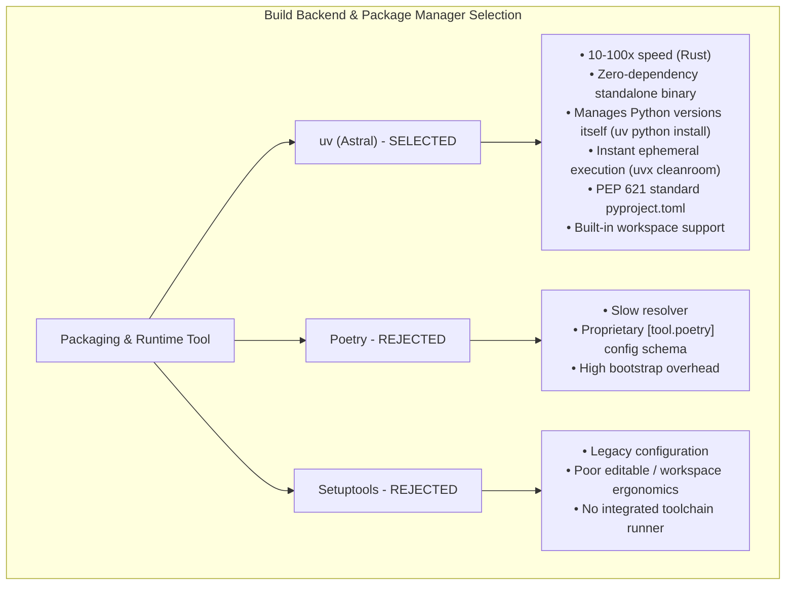
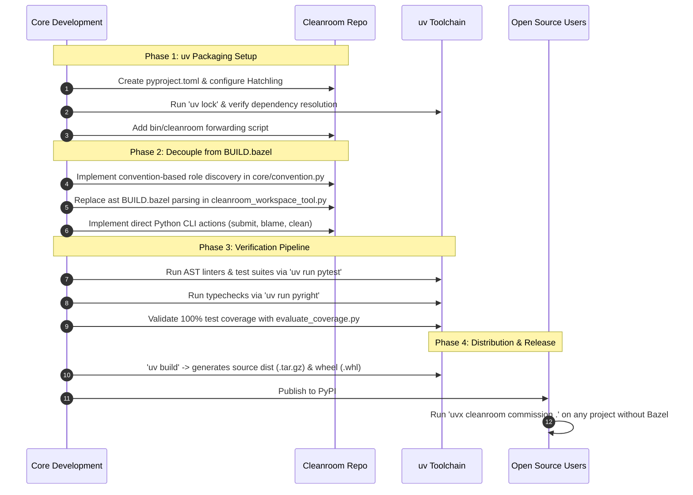

# Cleanroom Packaging, Distribution, & uv Migration Architecture

## 1. Executive Summary & Problem Statement

Cleanroom is a literate, specification-driven software engineering paradigm designed for deterministic AI pair programming. To date, Cleanroom has been developed and orchestrated inside a **Bazel monorepo**, relying on Starlark rules (`update_with_ai.bzl`), generated `py_binary` macro targets (`*_clean`, `*_submit`, `*_blame`), and `rules_python` toolchains.

While Bazel provides hermeticity and strict dependency isolation for internal dogfooding, **requiring Bazel is a fatal barrier to open-source adoption and broad developer deployment**:
1. **The Monorepo Friction**: 95%+ of Python open-source developers, startups, and enterprise product teams do not use Bazel. Requiring users to install Bazelisk, maintain Starlark `BUILD.bazel` packages, and understand hermetic toolchains ensures near-zero adoption outside large monorepo enterprises.
2. **Mental Model Mismatch**: Developers expect standard Python tooling: installing a CLI via `pip` or `uv`, running commands ephemerally via `uvx`, configuring projects via standard `pyproject.toml` (PEP 621), and testing with standard tools (`pytest`, `pyright`, `ruff`).
3. **The Packaging Mandate**: Cleanroom must be deployable as an idiomatic, publishable Python package (on PyPI and internal indexes) that can be initialized on *any* codebase—monorepo or standard single-repo—with zero Bazel prerequisite.

This document specifies the authoritative architecture for migrating Cleanroom to **`uv`**, packaging the framework with **Hatchling**, decoupling the DAG orchestration engine from Starlark, and publishing Cleanroom as a zero-friction CLI and library.

---

## 2. Deconstructing the "Binaries, Subagents, & Configs" Misconceptions

Feedback from external agent consultations often diagnoses Cleanroom as a heavy application requiring compiled C/C++ binaries, Docker daemon orchestration, or complex Setuptools builds. It is vital to clarify Cleanroom's actual runtime reality:

```
┌────────────────────────────────────────────────────────────────────────────────────────┐
│                        MISCONCEPTION VS. CLEANROOM REALITY                             │
├────────────────────────────────────────────────────────────────────────────────────────┤
│                                                                                        │
│  [External Agent Assumption]                  [Cleanroom Technical Reality]            │
│  ─────────────────────────────────            ──────────────────────────────────────   │
│  • "Bundled binary executables / ELF"    ──►  • 100% pure Python CLI scripts           │
│    (assumes compiled native extensions)         (Bazel py_binary was just a wrapper)   │
│                                                                                        │
│  • "Subagents requiring Docker/containers"─►  • Confinement via OS chmod 444 & sibling │
│    (assumes external container daemons)         workspaces (Option 3) or CLI harnesses │
│                                                                                        │
│  • "Heavy dependencies (numpy, docker)"  ──►  • Ultra-light core AST & text toolchain │
│    (assumes machine learning runtimes)          (pydantic, pyright, pytest, AST linters)│
│                                                                                        │
│  • "Requires Setuptools C compilation"   ──►  • Standard Hatchling wheel packaging     │
│    (assumes build-time compilation)             with pure Python data assets           │
│                                                                                        │
└────────────────────────────────────────────────────────────────────────────────────────┘
```

1. **No Native C/C++ Binaries**:
   In Bazel parlance, targets like `//update_with_ai/support/lib:grounding_tool` are called `py_binary`. However, these are **pure Python scripts** running against Python's standard `ast` and `typing` libraries. Cleanroom has **zero C/C++ or Rust compilation requirements**.
2. **Subagents are Workspaces & Harnesses, Not Daemons**:
   Cleanroom executes subagent workflows either through:
   - **Option 3 (Subagentless Workspaces)**: Sibling directories with standard OS `chmod 444` read-only mounts driven by human or IDE turns (see [`subagentless_cleanroom_workspaces.md`](file:///Users/seanmcdirmid/projects/cleanroom/design-docs/subagentless_cleanroom_workspaces.md)).
   - **Option 4 (Subagent-Driven Workspaces)**: Zero-execution coordinator invoking external CLI harnesses (`antigravity`, `dsh`, `goose`).
   - **Option 1 (Headless Loop)**: In-process autonomous runner calling the OpenAI API.
   None of these require background Docker daemons or container runtimes.
3. **Bundled Assets are Markdown Specs & Templates**:
   The non-Python assets needed by Cleanroom are literate specification templates, architectural guides (`guides/*.md`), and prompt skeletons—all UTF-8 markdown and JSON text files easily bundled as package data.

---

## 3. Toolchain Selection: Why `uv` + Hatchling Over Poetry and Setuptools



### 3.1 The Decisive Advantages of `uv`
1. **Zero-Bootstrapping via Standalone Binary**:
   `uv` is distributed as a single static binary. It does not require an existing Python installation or virtualenv; it can download, install, and pin the exact Python version (`3.12`) on the user's machine automatically (`uv python install 3.12`).
2. **Ephemeral Execution via `uvx`**:
   Users can run Cleanroom without modifying their project's environment:
   ```bash
   uvx cleanroom commission my_project
   uvx cleanroom work-queue
   ```
3. **PEP 621 Standard Compliance**:
   Unlike Poetry's historical custom schemas, `uv` pairs natively with **Hatchling** (`hatchling`), using standardized `[project]` tables in `pyproject.toml`.
4. **Native Workspaces Support**:
   Cleanroom's modular parts (`parts/dag`, `parts/agent`, `parts/systems`) can be managed as a clean, unified workspace without complex path-dependency hackery.

---

## 4. The Two Roles of Bazel in Cleanroom

To safely migrate away from Bazel, we must decouple the two fundamentally different roles it currently performs:

```
┌────────────────────────────────────────────────────────────────────────────────────────┐
│                              THE DUAL ROLES OF BAZEL                                   │
├────────────────────────────────────────────────────────────────────────────────────────┤
│                                                                                        │
│  [Role 1: Python Packaging & Virtualenvs]     [Role 2: DAG Task & Build Engine]        │
│  ────────────────────────────────────────     ─────────────────────────────────        │
│  • MODULE.bazel (rules_python)                • update_with_ai.bzl (2,824 lines)       │
│  • pip.parse(requirements_lock.txt)           • Target generation (*_clean, *_submit)  │
│  • Hermetic Python 3.12 toolchain             • Dirtiness evaluation across nodes      │
│  • rules_mypy & pyright_library.bzl           • BUILD.bazel define_role declarations   │
│                                                                                        │
│  ▼ Replaced by:                               ▼ Replaced by:                           │
│  • uv & pyproject.toml                        • Cleanroom Native Python DAG Engine     │
│  • uv.lock                                      (cleanroom_workspace_tool.py,          │
│  • uv run pyright / pytest                      dag_subgraph_impl.py, src_metadata.py) │
│                                                                                        │
└────────────────────────────────────────────────────────────────────────────────────────┘
```

1. **Role 1 (Packaging)** is solved immediately by `uv` and `pyproject.toml`.
2. **Role 2 (DAG Engine)** must **not** be replaced with an external tool like Make, Just, or Celery. **Cleanroom already is a DAG engine.** Its core Python runtime (`parts/dag`, `src_metadata.py`, `cleanroom_workspace_tool.py`) already computes topological tiers, tracks in-band comment dirtiness, and inspects files. It only relied on Bazel as a dispatch mechanism (`bazel run //pkg:target_clean`).

---

## 5. Architectural Blueprint: The `pyproject.toml` & Package Layout

### 5.1 Directory Structure
Cleanroom transitions to an idiomatic Python package layout:

```
cleanroom/
├── pyproject.toml              # Central build & dependency specification (PEP 621)
├── uv.lock                     # Deterministic, multi-platform dependency lockfile
├── README.md                   # Project overview & quickstart
├── bin/
│   └── cleanroom               # Local development bash shim (forwarding to uv run)
├── src/
│   └── cleanroom/              # Canonical package root
│       ├── __init__.py
│       ├── __main__.py         # python -m cleanroom entry point
│       ├── cli/                # Unified CLI interface (commission, dirty, clean, etc.)
│       │   ├── __init__.py
│       │   └── main.py
│       ├── core/               # In-band metadata, AST parsers, config discovery
│       │   ├── src_metadata.py
│       │   └── convention.py
│       ├── dag/                # Pure Python DAG reachability and tiering engine
│       │   ├── dag_node.py
│       │   └── dag_subgraph.py
│       ├── tools/              # Deterministic zero-token verification arbiters
│       │   ├── grounding_tool.py
│       │   ├── hls_lint.py
│       │   ├── low_lint.py
│       │   ├── lib_lint.py
│       │   ├── test_lint.py
│       │   └── evaluate_coverage.py
│       ├── workspaces/         # Subagentless & subagent workspace orchestration
│       │   └── workspace_tool.py
│       ├── templates/          # Bundled specification templates & markdown formats
│       │   ├── high_template.md
│       │   ├── planning_template.md
│       │   └── low_template.pyi
│       └── guides/             # Bundled Cleanroom guidelines (for AI context injection)
│           ├── high_level_spec.md
│           ├── high_to_planning.md
│           ├── spec_qa.md
│           ├── planning_to_low.md
│           ├── low_qa.md
│           ├── low_to_lib.md
│           ├── low_to_test.md
│           └── coverage.md
└── tests/                      # Framework test suites (executed with pytest)
```

### 5.2 Authoritative `pyproject.toml`

```toml
[build-system]
requires = ["hatchling"]
build-backend = "hatchling.build"

[project]
name = "cleanroom"
version = "0.2.0"
description = "Literate, specification-driven software engineering framework for autonomous AI pair-programming"
readme = "README.md"
requires-python = ">=3.11"
license = { text = "Apache-2.0" }
authors = [
    { name = "Cleanroom Authors" }
]
keywords = ["ai-agents", "cleanroom", "formal-specifications", "software-engineering", "verification"]
classifiers = [
    "Development Status :: 4 - Beta",
    "Intended Audience :: Developers",
    "Programming Language :: Python :: 3.11",
    "Programming Language :: Python :: 3.12",
    "Topic :: Software Development :: Code Generators",
    "Topic :: Software Development :: Testing",
]

# Lean core dependencies: only what the CLI, AST linters, and verification engine need
dependencies = [
    "pydantic>=2.5.0",
    "python-dotenv>=1.0.0",
    "tqdm>=4.66.0",
    "typing-extensions>=4.8.0",
    "pyright>=1.1.350",
    "pytest>=8.0.0",
]

[project.optional-dependencies]
# Headless loop dependencies (Option 1): only required when using in-process autonomous LLM runners
loop = [
    "openai>=1.12.0",
    "openai-agents>=0.0.1",
]
# Full development dependencies for contributors working on Cleanroom itself
dev = [
    "ruff>=0.3.0",
    "mypy>=1.9.0",
    "pytest-cov>=4.1.0",
]

# Unified CLI entry points
[project.scripts]
cleanroom = "cleanroom.cli.main:main"

# Package data inclusions: bundling markdown guides, prompt templates, and AST rules
[tool.hatch.build.targets.wheel]
packages = ["src/cleanroom"]

[tool.hatch.build.targets.wheel.shared-data]
"src/cleanroom/guides" = "cleanroom/guides"
"src/cleanroom/templates" = "cleanroom/templates"

# Linter and test configurations
[tool.ruff]
line-length = 100
target-version = "py312"

[tool.pyright]
include = ["src", "tests"]
pythonVersion = "3.12"
typeCheckingMode = "standard"

[tool.pytest.ini_options]
testpaths = ["tests"]
```

### 5.3 Authoritative Packaging & Type Checking Strategy: Package-Level `pyproject.toml`

Cleanroom adopts a **Package-Level Configuration Strategy** that strictly decouples the Cleanroom tool binary from consumer project packages, eliminating reliance on monolithic global JSON configs or fragmented per-part boilerplate:

```
┌────────────────────────────────────────────────────────────────────────────────────────┐
│                   TOOL DISTRIBUTION VS. CONSUMER PROJECT CONFIGURATION                 │
├────────────────────────────────────────────────────────────────────────────────────────┤
│                                                                                        │
│  [Cleanroom Tool Distribution]                 [Consumer Project Environment]          │
│  ─────────────────────────────                 ──────────────────────────────          │
│  • Root pyproject.toml (PEP 621)               • Consumer pyproject.toml               │
│  • Hatchling wheel packaging                   • Declares project dependencies & tools │
│  • Installs cleanroom & cleanroom-loop         • Contains parts/ subdirectories        │
│  • Deployed via `uv tool install cleanroom`    • Operates without monorepo assumptions │
│                                                                                        │
│  [Dogfooding Monorepo Workspace]                                                       │
│  ───────────────────────────────                                                       │
│  • cleanroom/pyproject.toml        ──► [tool.uv.workspace] members                     │
│  • update_with_ai/pyproject.toml   ──► Canonical production package                    │
│  • staging/pyproject.toml          ──► Ephemeral test consumer package                 │
│                                                                                        │
└────────────────────────────────────────────────────────────────────────────────────────┘
```

1. **Package-Level `pyproject.toml` (No Fragmented Per-Part Configs)**:
   - **Why Per-Part Configs are an Anti-Pattern**: Putting a separate `pyproject.toml` inside every individual part directory (`parts/agent/`, `parts/dag/`, `parts/control/`) creates extreme boilerplate (15+ duplicate configuration files, lockfiles, and dependency tables). Parts in Cleanroom are **architectural domains of a single application**, not separately versioned PyPI libraries.
   - **Package Root Ownership**: A single `pyproject.toml` lives at the root of each directory containing `parts/` (e.g. `update_with_ai/pyproject.toml`, `staging/pyproject.toml`, or `my_user_project/pyproject.toml`). It declares package dependencies, wheel targets, and tool configurations (`[tool.pyright]`, `[tool.pytest.ini_options]`).
   - **`uv` Workspace Integration**: In multi-package or monorepo repositories, the root `pyproject.toml` simply declares `[tool.uv.workspace] members = ["update_with_ai", "staging"]`, allowing `uv` to link packages together seamlessly.

2. **Zero Global JSON Configuration (Deleted `pyrightconfig.json`)**:
   - Cleanroom completely eliminates reliance on the standalone root `pyrightconfig.json` file.
   - All static analysis directives are housed strictly within standard PEP 518/621 `[tool.pyright]` tables in `pyproject.toml`.
   - Built-in Pyright discovery automatically honors `[tool.pyright]` when invoked via `pyright` or `uv run pyright`.

3. **Role Workspaces & Incomplete Directory Handling**:
   - Role workspaces (`cleanroom_lib_staging`, etc.) are **incomplete projections** containing only active writable targets, declared read-only dependencies, and generated stubs. They do not contain the full project repository.
   - Therefore, Cleanroom's verification runner (`workspace_tool_impl.py`) does not rely on static directory structures or brittle regex rewriting of configuration files.
   - Instead, the runner dynamically constructs an exact, hermetic `PYTHONPATH` reflecting the active part, its support libraries, and declared upstream dependencies before invoking `pyright` or `pytest`.
   - The package-level `pyproject.toml` can be optionally copied into role workspaces for editor integration, but the runtime verification engine remains fully functional and robust even in incomplete workspace projections.

---

## 6. Methodology Profiles: Replacing `define_role` in `BUILD.bazel`

Currently, Cleanroom defines its language roles via Starlark calls to `define_role` inside [`update_python_with_ai/BUILD.bazel`](file:///Users/seanmcdirmid/projects/cleanroom/update_python_with_ai/BUILD.bazel):
```python
define_role(
    name = "low",
    persona = "Low-Level Spec Engineer",
    src_pattern = "{unit_dir}/low/{unit_name}.pyi",
    guide = "//update_python_with_ai/guides:planning_to_low",
    tools = ["update_python_with_ai/support/lib/low_lint.py", ...],
    verify_template = "cd $BUILD_WORKSPACE_DIRECTORY && python3 .../low_lint.py ...",
    role_deps = [":planning"],
    star_role_deps = [":low"],
    ...
)
```
And [`cleanroom_workspace_tool.py`](file:///Users/seanmcdirmid/projects/cleanroom/update_with_ai/support/lib/cleanroom_workspace_tool.py#L516) inspects `update_*_with_ai/BUILD.bazel` using Python's `ast.parse` to extract these declarations.

### 6.1 The Semantic Role Problem: Directories Do Not Define Roles
A directory name such as `high/`, `low/`, or `lib/` merely designates a filesystem path. **It conveys zero language semantics, typing constraints, or verification rules**:
- For Python: `low` requires `{unit}.pyi` interface stubs verified by `pyright` and `low_lint.py`.
- For TypeScript: `low` requires `{unit}.d.ts` type definitions verified by `tsc`.
- For Rust: `low` requires trait definitions verified by `cargo check`.
- Even within Python, different projects may have distinct role pipelines, alternative linters (e.g. `mypy` vs. `pyright`), or custom verification scripts.

Therefore, Cleanroom strictly separates the **Generic DAG Engine** from **Pluggable Methodology Profiles**.

### 6.2 The Methodology Profile Architecture

```
┌────────────────────────────────────────────────────────────────────────────────────────┐
│                        CLEANROOM PLUGGABLE METHODOLOGY PROFILES                        │
├────────────────────────────────────────────────────────────────────────────────────────┤
│                                                                                        │
│  [Cleanroom Core Engine (cleanroom)]                                                   │
│  • Generic DAG graph solver, topological sorting, and tier assignment                  │
│  • In-band source metadata persistence (LAST_CLEANED, CHANGE, <ROLE>_AUDIT)            │
│  • Sibling workspace provisioning (chmod 444 isolation) & CLI dispatch                │
│                                                                                        │
│                                    ▲                                                   │
│                                    │ loads profile at runtime via config / entrypoints │
│                                    │                                                   │
│  [Methodology Profiles]                                                                │
│  ┌─────────────────────────────────┐   ┌──────────────────────────────────────────┐   │
│  │ update_python_with_ai (Built-in) │   │ update_typescript_with_ai (Future)       │   │
│  │ • high:     {unit}.md           │   │ • high:     {unit}.md                    │   │
│  │ • planning: {unit}.md           │   │ • planning: {unit}.md                    │   │
│  │ • low:      {unit}.pyi (pyright)│   │ • low:      {unit}.d.ts (tsc)            │   │
│  │ • lib:      {unit}.py (pytest)  │   │ • lib:      {unit}.ts (vitest)           │   │
│  │ • tests:    {unit}_test.py      │   │ • tests:    {unit}.test.ts               │   │
│  └─────────────────────────────────┘   └──────────────────────────────────────────┘   │
│                                                                                        │
└────────────────────────────────────────────────────────────────────────────────────────┘
```

A **Methodology Profile** encapsulates the complete language-specific Cleanroom pipeline:
1. **File Patterns**: `{unit_dir}/low/{unit_name}.pyi`
2. **Guide Bindings**: Bundled markdown documentation delivered to agents during their session.
3. **Role Dependencies**: Direct (`role_deps`), transitive (`star_role_deps`), silent (`silent_role_deps`), and feedback attribution (`feedback_role_deps`).
4. **Deterministic Verification Commands**: Zero-token AST linters, type checkers, and test runners.

### 6.3 Defining Roles via Typed Python & Declarative TOML

Instead of parsing `BUILD.bazel` files with `ast.parse`, Methodology Profiles are defined in Python using typed Pydantic models, or loaded declaratively from TOML files:

```python
# src/cleanroom/core/methodology.py
from pydantic import BaseModel, Field
from typing import List, Optional

class RoleDefinition(BaseModel):
    name: str
    persona: str
    src_pattern: str
    guide: str
    tools: List[str] = Field(default_factory=list)
    role_deps: List[str] = Field(default_factory=list)
    star_role_deps: List[str] = Field(default_factory=list)
    feedback_role_deps: List[str] = Field(default_factory=list)
    silent_role_deps: List[str] = Field(default_factory=list)
    verify_command: str
    verification_success_message: Optional[str] = None
    active_component_types: List[str] = Field(
        default_factory=lambda: ["implementation", "assembly", "interface", "external"]
    )

class Methodology(BaseModel):
    name: str
    description: str
    roles: List[RoleDefinition]
```

Built-in methodologies (like `python`) ship natively inside `cleanroom.methodologies.python`. Custom or third-party methodologies can be registered via standard Python entry points in `pyproject.toml`:
```toml
[project.entry-points."cleanroom.methodologies"]
python = "cleanroom.methodologies.python:methodology"
typescript = "cleanroom_typescript:methodology"
```

### 6.4 Hierarchical Scope Binding & Methodology Discovery

In a target repository, Cleanroom eliminates the need for BUILD files by using an **Upward Hierarchical Search** to discover which methodology governs a given part or unit:

```
[Target Unit] //staging/parts/systems:uv_cleanroom_asm
      │
      ▼ (Check 1: Directory Scope)
staging/parts/systems/cleanroom.toml  ---> If exists, specifies methodology
      │
      ▼ (Check 2: Parent Parts Scope)
staging/parts/cleanroom.toml          ---> If exists, specifies methodology (e.g. "//update_python_with_ai")
      │
      ▼ (Check 3: Repository Root)
cleanroom.toml or pyproject.toml      ---> Global fallback methodology
```

#### Syntax for `cleanroom.toml`:
```toml
# staging/parts/cleanroom.toml
# For local in-repo methodology packages (starts with // or ./)
methodology = "//update_python_with_ai"

# Or for external packages installed via uv (bare package name)
# methodology = "cleanroom-python"
```

Cleanroom's resolver checks:
1. **If it starts with `//` or `./`**: Resolves as a **local repository package**, loading `<repo_root>/update_python_with_ai/cleanroom_roles.toml`.
2. **Otherwise (bare name)**: Resolves as an **installed Python package**, loading `cleanroom_roles.toml` via `importlib.resources.files(pkg)`.

#### CLI Invocation & Canonical Role Addressing:
A node's full address unites the unit target with the methodology package:
```bash
# Explicit canonical target (fully qualified):
uv run cleanroom-loop --action mark-clean //staging/parts/systems:uv_cleanroom_asm#//update_python_with_ai:coverage

# Shorthand (inferred from hierarchical search):
uv run cleanroom-loop --action mark-clean //staging/parts/systems:uv_cleanroom_asm#coverage
```
When an unqualified role `#coverage` is supplied, the runner searches upwards from `staging/parts/systems`, finds `methodology = "//update_python_with_ai"` in `staging/parts/cleanroom.toml`, and expands the role to its canonical package address `//update_python_with_ai:coverage`.

### 6.5 Methodology Packaging & Approach A Tool Execution

A methodology package is a self-contained bundle that ships its own roles, guides, templates, and deterministic verification tools:

```
update_python_with_ai/ (or cleanroom-python wheel)
├── cleanroom_roles.toml           # The role definitions (high, planning, low, lib, test, qa, coverage)
├── guides/                        # Markdown instructions injected into agent context
│   ├── high_level_spec.md
│   ├── low_to_lib.md
│   └── qa.md
├── templates/                     # Skeletons for stubs and specs
│   ├── hls_template.md
│   └── stub_template.pyi
└── support/lib/                   # Deterministic zero-token verification linters
    ├── high_lint.py
    ├── low_lint.py
    ├── spec_lint.py
    └── test_lint.py
```

#### Approach A: Portable Module Execution (`python -m`)
Because `check_files` and the agent loop execute inside consumer workspaces (such as `staging/` or `parts/`), verification commands must not rely on brittle relative file paths. Under **Approach A**, all verification tools are invoked as Python modules or console scripts:
```toml
# Inside update_python_with_ai/cleanroom_roles.toml
[roles.high]
verify_template = "uv run python -m update_python_with_ai.support.lib.high_lint {unit_dir}/high/{unit_name}.md"

[roles.spec_qa]
verify_template = "uv run python -m update_python_with_ai.support.lib.high_lint {unit_dir}/high/{unit_name}.md && uv run python -m update_python_with_ai.support.lib.spec_lint {unit_dir}/planning/{unit_name}.md"

[roles.low]
verify_template = "uv run python -m update_python_with_ai.support.lib.low_lint {unit_dir}/low/{unit_name}.pyi && uv run pyright {unit_dir}/low/{unit_name}.pyi"
```
Because the methodology package is installed in the active virtual environment, `python -m` locates and runs the tools reliably from any current working directory.

```
cleanroom_python/ (or update_python_with_ai/)
├── __init__.py           # Exports typed Methodology(roles=[...])
├── guides/               # Markdown instructions injected into agent context
│   ├── high_level_spec.md
│   ├── planning_to_low.md
│   ├── low_to_lib.md
│   └── spec_qa.md
├── templates/            # Scaffolding skeletons for new units
│   ├── stub_template.pyi
│   └── lib_template.py
└── tools/                # Deterministic zero-token verification linters
    ├── high_lint.py
    ├── low_lint.py
    ├── lib_lint.py
    └── test_lint.py
```

### 6.6 Installation & Dynamic Linking Architecture

How are methodologies installed and dynamically resolved by the Cleanroom CLI at runtime without hardcoded imports?

Cleanroom uses a 3-tier dynamic discovery model:

```
┌────────────────────────────────────────────────────────────────────────────────────────┐
│                        METHODOLOGY DISCOVERY & DYNAMIC LINKING                         │
├────────────────────────────────────────────────────────────────────────────────────────┤
│                                                                                        │
│  [Tier 1: Built-in Profiles]                                                           │
│  • Installed: Shipped directly inside the cleanroom wheel (cleanroom.methodologies)    │
│  • Linking: Imported directly by the CLI engine                                        │
│  • Example: python                                                                     │
│                                                                                        │
│  [Tier 2: External Community / Ecosystem Packages]                                     │
│  • Installed: As separate PyPI packages via 'uv add cleanroom-typescript'              │
│  • Linking: Discovered dynamically via standard Python Entry Points (PEP 621)          │
│  • Example: typescript, rust, go                                                       │
│                                                                                        │
│  [Tier 3: In-Repo Custom / Enterprise Profiles]                                        │
│  • Installed: Committed locally in project repository (.cleanroom/my_methodology.py)   │
│  • Linking: Loaded dynamically via importlib.util.spec_from_file_location              │
│  • Example: internal company DSLs or non-standard toolchains                           │
│                                                                                        │
└────────────────────────────────────────────────────────────────────────────────────────┘
```

#### How Dynamic Linking Works via Python Entry Points
External packages declare their methodology in their `pyproject.toml`:
```toml
# cleanroom-typescript/pyproject.toml
[project.entry-points."cleanroom.methodologies"]
typescript = "cleanroom_typescript:methodology"
```

When the user runs `cleanroom commission typescript:low ...`, Cleanroom dynamically resolves and links the plugin in Python using standard library `importlib.metadata`:
```python
from importlib.metadata import entry_points
from typing import Dict
from cleanroom.core.schema import Methodology

def discover_methodologies() -> Dict[str, Methodology]:
    methodologies: Dict[str, Methodology] = {}
    
    # 1. Register built-in methodologies
    from cleanroom.methodologies.python import python_methodology
    methodologies["python"] = python_methodology

    # 2. Dynamically link external packages installed in the environment
    for ep in entry_points(group="cleanroom.methodologies"):
        plugin_loader = ep.load()  # Dynamically imports the external package
        methodologies[ep.name] = plugin_loader if isinstance(plugin_loader, Methodology) else plugin_loader()
        
    return methodologies
```
This is the same proven plug-in mechanism used by `pytest`, `flake8`, and `sphinx`. No custom shared library loading (`dlopen`) or complex runtime compilation is needed—Python handles the dynamic linking safely and portably.


---

## 7. Unit Declarations & Methodology Binding

### 7.1 What is a Unit?
In Cleanroom, a **Unit** is an atomic, cohesive software component (e.g. `dag_storage`, `dag_subgraph`, `dag_subgraph_impl`) that progresses through each stage of a methodology:
- High-level architectural intent (`high/{unit}.md`)
- Factored contracts & epistemic grounding (`planning/{unit}.md`)
- Low-level interface stubs & DbC invariants (`low/{unit}.pyi`)
- Double-blind library implementation (`lib/{unit}.py`)
- Independent contract verification tests (`tests/{unit}_test.py`)

Each unit possesses:
1. `unit_name`: Unique identifier within its package scope.
2. `component_type`: Inferred or explicit role (`implementation` for `*_impl`, `assembly` for `*_asm`, `external` for `*_ext`, or `interface`).
3. `module_deps`: List of prerequisite units required by this unit (forming the horizontal dependency graph).

### 7.2 How Units are Bound to Methodologies: Hierarchical, Not Ad-Hoc
A common design question is: **Are units associated with methodologies individually, or is the mapping ad-hoc?**

Cleanroom enforces a **Hierarchical Scope Binding** model:
```
Repository Root
  └── Package / Component Directory (e.g., parts/dag/ or services/auth/)
        ├── Methodology: Bound at Scope Level (e.g. "python")
        └── Units: Inherit Scope Methodology Automatically
              ├── dag_storage      (methodology: python)
              ├── dag_subgraph     (methodology: python)
              └── dag_subgraph_impl (methodology: python)
```

1. **Scope-Level Methodology Inheritance**:
   A package directory (such as `parts/dag` or `src/payments`) declares its methodology once (e.g. `methodology = "python"` in `cleanroom.toml` or `pyproject.toml`). All units within that directory automatically inherit that methodology. Units **do not** redundantly declare their methodology.
2. **Polyglot Scope Overrides**:
   If a specialized directory contains mixed languages (e.g. a Python backend with a WebAssembly Rust module), individual units can explicitly specify `methodology = "rust"` to override the scope default.

### 7.3 Three Ways Units are Declared

```
┌────────────────────────────────────────────────────────────────────────────────────────┐
│                                UNIT DECLARATION MODES                                  │
├────────────────────────────────────────────────────────────────────────────────────────┤
│                                                                                        │
│  [Mode 1: HLS Specification-First Discovery (Authoritative Standard)]                 │
│  • Discovers units from high/<unit>.md files.                                          │
│  • Component type read from title: # <unit> [implementation|assembly|interface]       │
│  • Horizontal dependencies read from headers: imports:, implements:, assembles:       │
│  • Eliminates all BUILD files and redundant unit-level TOML manifests.                │
│                                                                                        │
│  [Mode 2: Minimal Scope Methodology Binding (cleanroom.toml)]                          │
│  • Merely declares the methodology binding for the package directory:                 │
│    methodology = "//update_python_with_ai" (or "cleanroom-python")                     │
│  • Units within the directory inherit this methodology automatically.                  │
│                                                                                        │
│  [Mode 3: Legacy Bazel BUILD Reader (parse_part_units)]                                │
│  • Parses update_python_with_ai(...) calls directly from BUILD.bazel via AST.          │
│  • Used strictly for backward compatibility during phased transition.                  │
│                                                                                        │
└────────────────────────────────────────────────────────────────────────────────────────┘
```

#### The Zero-BUILD Paradigm: The Specification is the Build Manifest
Rather than keeping parallel configuration files (`BUILD.bazel` or `[units.*]` tables in TOML) in sync with architecture, Cleanroom uses the unit's **High-Level Specification** (`high/<unit>.md`) as the canonical declaration:
```markdown
# dag_subgraph_impl implementation component

implements: dag_subgraph
imports: dag_config, dag_storage
```
Horizontal unit dependencies (`implements:`, `imports:`, `assembles:`) are extracted directly from the HLS, while vertical role dependencies (`role_deps`, `star_role_deps`) are defined in the methodology's `cleanroom_roles.toml`. Combining these two sources dynamically generates the complete, hermetic Cleanroom DAG with zero boilerplate.

---

## 8. The Bazel Bridge & Monorepo Coexistence: Leaving Nothing Behind

A critical strategic question: **Are we leaving Bazel behind, or can this be bridged?**

**Cleanroom is NOT leaving Bazel behind.** Rather, Bazel is demoted from a **mandatory, universal prerequisite** to an **optional, first-class enterprise backend adapter**:

```
┌────────────────────────────────────────────────────────────────────────────────────────┐
│                        CLEANROOM DUAL-BACKEND ARCHITECTURE                             │
├────────────────────────────────────────────────────────────────────────────────────────┤
│                                                                                        │
│                 Cleanroom Core Engine & Pluggable Methodologies                        │
│             (AST Linters, In-Band Metadata, Sibling Workspaces, DAG)                   │
│                                      │                                                 │
│                     ┌────────────────┴────────────────┐                                │
│                     ▼                                 ▼                                │
│        [Native uv Backend]                 [Enterprise Bazel Backend]                  │
│        • Target: Open Source, PyPI         • Target: Large Monorepos, Google, Meta     │
│        • Deps: uv, uvx, pyproject.toml     • Deps: MODULE.bazel, rules_python          │
│        • Tests: uv run pytest              • Tests: bazel test //...                   │
│        • Typecheck: uv run pyright         • Typecheck: rules_mypy, pyright_library    │
│        • No Bazel required anywhere        • Full remote caching & cluster execution   │
│                                                                                        │
└────────────────────────────────────────────────────────────────────────────────────────┘
```

### 8.1 The Four Bridge Mechanisms

To ensure complete interoperability between standard open-source projects and enterprise Bazel monorepos, Cleanroom implements four bidirectional bridges:

#### Bridge 1: The Pluggable `ScopeLoader` (Zero-Migration Compatibility)
Cleanroom's unit and role loader is abstracted into an interface:
- `TomlScopeLoader`: Reads `cleanroom.toml` or `pyproject.toml`.
- `ConventionScopeLoader`: Discovers units from filesystem directories and AST imports.
- `BazelScopeLoader`: **Reuses Cleanroom's existing [`parse_part_units()`](file:///Users/seanmcdirmid/projects/cleanroom/update_python_with_ai/support/lib/build_lint_common.py#L3031) and [`load_defined_roles()`](file:///Users/seanmcdirmid/projects/cleanroom/update_with_ai/support/lib/cleanroom_workspace_tool.py#L516)**.

Existing Bazel repositories containing `update_python_with_ai(...)` calls in `BUILD.bazel` continue working **without modifying a single file**. Cleanroom transparently reads the Bazel files when `BUILD.bazel` is detected.

#### Bridge 2: Bidirectional Build File Generation (`cleanroom export-bazel`)
For teams that author specifications using Cleanroom's native CLI but require Bazel for continuous integration and remote caching, Cleanroom provides an export command:
```bash
cleanroom export-bazel [scope]
```
This automatically inspects `cleanroom.toml` or convention units and emits deterministic `BUILD.bazel` files, eliminating the need to maintain Starlark targets manually.

#### Bridge 3: Configurable Execution Backend
In `cleanroom.toml` or via CLI flag, users choose their execution backend:
```toml
[tool.cleanroom]
backend = "native"  # Default: runs 'uv run pytest' and 'uv run pyright'
# backend = "bazel" # Monorepo mode: runs 'bazel test' and 'bazel run'
```
When `backend = "bazel"`, Cleanroom's verification arbiters (`qa`, `spec_qa`, `low_qa`) invoke Bazel test targets (`bazel test //...`) instead of native subprocesses.

#### Bridge 4: Modern `rules_cleanroom` (Replacing 2,824 lines of Starlark)
For users running inside Bazel, we do not need the legacy 2,824 lines of Starlark code generators in `update_with_ai.bzl`. Instead, a clean, modern Starlark rule simply wraps the `cleanroom` Python CLI binary as a tool:
```python
# cleanroom_rules.bzl (clean, ~60 lines)
load("@rules_python//python:defs.bzl", "py_binary")

def cleanroom_part(name, units = [], methodology = "python"):
    # Invokes 'cleanroom verify' or 'cleanroom work-queue' under Bazel test runner
    ...
```

---

## 9. Direct Mutations: Replacing `bazel run` with Native CLI Actions

In the legacy subagentless architecture, role workspaces submitted work or reported blame via Bazel targets:
- `bazel run //pkg:my_node_submit -- "change notes"`
- `bazel run //pkg:my_node_blame -- "critique"`
- `bazel run //pkg:my_node_fail -- "reason"`

In the standalone architecture, `bin/cleanroom` provides direct CLI actions:
- `cleanroom submit <unit_path> --notes "change notes"`
- `cleanroom blame <unit_path> --critique "feedback"`
- `cleanroom fail <unit_path> --reason "diagnostic"`
- `cleanroom clean [scope]`
- `cleanroom work-queue`

Because these commands run directly in Python, they execute in **10–30 milliseconds**, completely bypassing the 1.5–3.0 second Bazel server startup latency and analysis phase. (When running with `backend = "bazel"`, mutations update in-band metadata directly while optionally invoking Bazel verification targets).

---

## 10. User Scenarios & Onboarding Workflows

How does a developer actually install, explore, and use Cleanroom in practice? Below are four concrete walkthroughs demonstrating user journeys from zero-install playgrounds to full production integration.

```
┌────────────────────────────────────────────────────────────────────────────────────────┐
│                               USER ONBOARDING JOURNEYS                                 │
├────────────────────────────────────────────────────────────────────────────────────────┤
│                                                                                        │
│  [Scenario 1: 5-Minute Playground]         [Scenario 2: Existing Project Integration]  │
│  • uvx cleanroom init --example calc       • uv tool install cleanroom                 │
│  • Zero-install, disposable sandbox        • Interactive pair programming in IDE       │
│  • Step through 4 stages interactively     • Double-blind lib & test generation        │
│                                                                                        │
│  [Scenario 3: Autonomous CI Loop]          [Scenario 4: Enterprise Monorepo Bridge]    │
│  • uvx --with "cleanroom[loop]" clean      • cleanroom export-bazel                    │
│  • Headless batch cleaning on PRs          • Preserves Bazel remote cache & cluster CI │
│  • Enforces 100% statement coverage        • Zero Starlark authoring required          │
│                                                                                        │
└────────────────────────────────────────────────────────────────────────────────────────┘
```

### Scenario 1: The 5-Minute Zero-Install Playground (`uvx`)
*Persona: A curious developer who wants to test Cleanroom's specification-to-code pipeline without modifying their environment.*

1. **Bootstrap an example sandbox**:
   ```bash
   mkdir cleanroom-demo && cd cleanroom-demo
   uvx cleanroom init --example counter
   ```
   This generates a minimal Cleanroom workspace:
   ```
   cleanroom-demo/
   ├── pyproject.toml               # Configured with [tool.cleanroom] methodology = "python"
   └── parts/
       └── counter/
           └── high/
               └── counter.md       # Pre-authored literate high-level specification
   ```

2. **Inspect the DAG work queue**:
   ```bash
   uvx cleanroom work-queue
   ```
   *Output:*
   ```text
   [READY]   planning:counter  (High-level spec is ready; planning canvas needed)
   [BLOCKED] spec_qa:counter   (Awaiting planning)
   [BLOCKED] low:counter       (Awaiting spec_qa)
   [BLOCKED] lib:counter       (Awaiting low)
   [BLOCKED] tests:counter     (Awaiting low)
   [BLOCKED] qa:counter        (Awaiting lib & tests)
   ```

3. **Step through the stages**:
   The user (or their AI assistant) can run verification gates on each generated artifact:
   ```bash
   # Verify planning contracts
   uvx cleanroom verify planning parts/counter

   # Submit planning canvas to advance the pipeline
   uvx cleanroom submit parts/counter/planning/counter.md --notes "Authored atomic contracts"
   ```
   The user watches the pipeline transition deterministically through `planning` $\to$ `spec_qa` $\to$ `low` $\to$ `lib` & `tests` $\to$ `qa` (100% statement coverage).

---

### Scenario 2: Adding Cleanroom to an Existing Python Project
*Persona: An engineer adding Cleanroom to an existing repository (e.g. a FastAPI service or CLI tool) for day-to-day AI pair programming.*

1. **Install Cleanroom CLI**:
   ```bash
   # Option A: Install globally as an isolated tool (recommended)
   uv tool install cleanroom

   # Option B: Add to project development dependencies
   uv add --dev cleanroom
   ```

2. **Initialize in Project Root**:
   ```bash
   cd my-existing-project
   cleanroom init
   ```
   This appends a lightweight configuration to `pyproject.toml`:
   ```toml
   [tool.cleanroom]
   methodology = "python"
   parts_dir = "parts"
   ```

3. **Author a New Feature via High-Level Specification**:
   The developer authors `parts/auth/high/jwt_service.md` following Cleanroom's literate prose conventions and italic markers (`*token*`, `*claims*`, `*secret*`).

4. **Commission an Isolated Role Workspace (Option 3 Subagentless)**:
   To prevent context contamination and cheating:
   ```bash
   cleanroom commission planning parts/auth
   ```
   This provisions `../role_workspaces/myproject_planning_auth/` with read-only upstream contracts (`chmod 444`) and the relevant guidelines (`guides/high_to_planning.md`).

5. **AI Pair Programming Turn Loop**:
   Inside the role workspace (in Antigravity, Cursor, or VS Code):
   - The agent runs `bin/get_work` to fetch current tasks and guidelines.
   - The agent writes `parts/auth/planning/jwt_service.md`.
   - The agent validates contracts:
     ```bash
     bin/cleanroom verify planning
     ```
   - When verified, the agent submits:
     ```bash
     bin/cleanroom submit parts/auth/planning/jwt_service.md --notes "Factored JWT validation contracts"
     ```
   - Downstream arbiters (`spec_qa`, `low_qa`, `qa`, `coverage`) verify each gate deterministically in milliseconds.

---

### Scenario 3: Headless Autonomous Loop in CI/CD (`cleanroom[loop]`)
*Persona: A team enforcing Cleanroom verification on GitHub Actions pull requests.*

1. **Configure CI Workflow (`.github/workflows/cleanroom.yml`)**:
   ```yaml
   name: Cleanroom Verification
   on: [pull_request]

   jobs:
     verify:
       runs-on: ubuntu-latest
       steps:
         - uses: actions/checkout@v4
         - uses: astral-sh/setup-uv@v3

         - name: Check Cleanroom Dirtiness & Test Coverage
           run: |
             uvx cleanroom work-queue --assert-clean
             uv run pytest
   ```

2. **Unattended Batch Cleaning (Optional)**:
   If a team wants CI or a nightly cron to automatically clean modified specifications using LLMs:
   ```bash
   # Installs the optional [loop] extra with OpenAI / provider drivers:
   uvx --with "cleanroom[loop]" cleanroom clean parts/auth --model gpt-4o
   ```
   Cleanroom runs its in-process runner (`loop_cleaner.py`), cleans nodes in topological dependency order, verifies test coverage, and commits clean in-band metadata attestations (`LAST_CLEANED`).

---

### Scenario 4: Enterprise Monorepo with Bazel Bridge
*Persona: An engineer in a large multi-language monorepo where all CI must execute through Bazel.*

1. **Develop Naturally with Cleanroom**:
   The engineer works in `parts/service/` using native Cleanroom CLI tools (`cleanroom work-queue`, `cleanroom submit`).

2. **Export Bazel Targets**:
   Instead of writing complex Starlark by hand:
   ```bash
   cleanroom export-bazel parts/service
   ```
   Cleanroom inspects `parts/service/` and automatically generates or updates `parts/service/BUILD.bazel`:
   ```python
   # Generated by cleanroom export-bazel - DO NOT EDIT MANUALLY
   load("@rules_cleanroom//:defs.bzl", "cleanroom_part")

   cleanroom_part(
       name = "service",
       units = ["jwt_service", "session_store"],
       methodology = "python",
   )
   ```

3. **Run in Monorepo CI**:
   The team's distributed CI runs:
   ```bash
   bazel test //parts/service/...
   ```
   Bazel utilizes remote execution and build caching across the organization, while developers author code using Cleanroom's pure Python CLI.

---

## 11. Migration Phases & Implementation Plan


### Phase 1: Dual Toolchain Coexistence (`pyproject.toml` & `uv`)
*Goal: Introduce `pyproject.toml` and `uv` alongside Bazel with zero breaking changes, verifying parity before changing any runner behavior.*
- **Step 1.1: Author Root `pyproject.toml`**:
  - Configure Hatchling build backend (`requires = ["hatchling"]`, `build-backend = "hatchling.build"`).
  - Define core dependencies: `pydantic>=2.5.0`, `pyright>=1.1.350`, `pytest>=8.0.0`, `typing-extensions>=4.8.0`, `python-dotenv>=1.0.0`, `tqdm>=4.66.0`.
  - Configure `[tool.pytest.ini_options]` with `pythonpath = [".", "update_with_ai", "update_python_with_ai"]` and `python_files = ["*_test.py", "test_*.py"]`.
  - Configure `[tool.pyright]` (Approach A) mirroring settings from `pyrightconfig.json` (`pythonVersion = "3.12"`, `typeCheckingMode = "standard"`, `reportMissingImports = "none"`, `include = ["update_with_ai", "update_python_with_ai"]`, `extraPaths = [".", "update_with_ai", "update_python_with_ai", "update_python_with_ai/support/lib"]`).
- **Step 1.2: Generate `uv.lock`**:
  - Run `uv lock` in repository root to establish a deterministic lockfile without modifying any Bazel files.
- **Step 1.3: Dual Test Parity**:
  - Run `uv run pytest update_with_ai/parts/workspace/tests/` to verify tests execute natively under pytest.
  - Expand execution across all 36 test targets to achieve 100% pass parity between `bazel test //...` and `uv run pytest`.
- **[COMPLETED] Step 1.4: Pyright Parity & Global Config Retirement**:
  - Completely deleted standalone `pyrightconfig.json` from the repository root and Bazel exports.
  - Configured package-level `pyproject.toml` files (`update_with_ai/pyproject.toml`, `staging/pyproject.toml`) and configured the root `pyproject.toml` as a `[tool.uv.workspace]`.
  - Replaced hardcoded static paths (`extraPaths`) with dynamic `PYTHONPATH` resolution in `bin/test` and `workspace_tool_impl.py`.
  - Confirmed 0 type errors across canonical code, and verified parity between `bin/test` and role workspace `bin/check_files`.

### Phase 2: Decoupling the Orchestration Engine
*Goal: Switch Cleanroom role tools and verification templates to native Python/uv without touching underlying parts specifications.*
- **Step 2.1: Python Methodology Profile**:
  - Create typed Python methodology profile (in `update_with_ai/parts/workspace/lib/python_profile.py` or `.cleanroom_profile.toml`) defining the 7 roles (`high`, `planning`, `low`, `lib`, `test`, `qa`, `coverage`, `spec_qa`, `low_qa`).
  - Update [`workspace_registry_impl.py`](file:///Users/seanmcdirmid/projects/cleanroom/update_with_ai/parts/workspace/lib/workspace_registry_impl.py) to load role definitions directly from this profile, eliminating AST parsing of `update_python_with_ai/BUILD.bazel`.
- **Step 2.2: Native Verification Templates**:
  - Switch `verify_template` in the Python methodology profile to execute native commands:
    - `low`: `uv run pyright {unit_dir}/low/{unit_name}.pyi`
    - `lib`: `uv run pyright {unit_dir}/lib/{unit_name}.py`
    - `qa`: `uv run pytest {unit_dir}/tests/{unit_name}_test.py`
    - `coverage`: `uv run pytest {unit_dir}/tests/{unit_name}_test.py && python3 update_with_ai/support/lib/cleanroom_role_tool.py coverage --impl {unit_dir}/lib/{unit_name}.py --test {unit_dir}/tests/{unit_name}_test.py --threshold 100.0`
- **Step 2.3: Decouple Workspace Provisioning**:
  - In [`workspace_provision_impl.py`](file:///Users/seanmcdirmid/projects/cleanroom/update_with_ai/parts/workspace/lib/workspace_provision_impl.py#L292) and `workspace_sync_impl.py`, remove the loop copying `MODULE.bazel`, `BUILD.bazel`, `.bazelversion`, and `pyrightconfig.json` into role workspaces.
  - Role workspaces run as lightweight directories executing `bin/check_files` via `uv` against the root `pyproject.toml`.
- **[COMPLETED] Deleted `support/lib/src_metadata.py`**: `src_metadata` has been canonicalized into [`src_metadata.py`](file:///Users/seanmcdirmid/projects/cleanroom/update_with_ai/parts/control/lib/src_metadata.py). Residual imports across `parts/`, tests, and `cleanroom_role_tool.py` have been migrated to `update_with_ai.parts.control.lib.src_metadata`. `update_with_ai/support/lib/src_metadata.py` and `update_python_with_ai/support/lib/src_metadata.py` (along with `cleanroom_workspace_tool.py` and `evaluate_coverage.py`) have been permanently deleted.
- **[COMPLETED] Modularized Workspace Orchestration into `parts/workspace`**: Workspace lifecycle, synchronization, provisioning, queue computation, and runner dispatch have been modularized into `update_with_ai/parts/workspace/` (`workspace_tool.py`, `workspace_tool_impl.py`, `workspace_sync_impl.py`, `workspace_provision_impl.py`, `workspace_registry_impl.py`, `workspace_work_impl.py`). `cleanroom_role_tool.py` was reduced to an ultra-slim 45-line entrypoint ($\le 50$ lines constraint) that dynamically resolves `main_workspace_root` from `.cleanroom_role.json`.
- **[COMPLETED] Role Hardcoding & Synthetic Fallbacks Purged**: Eliminated all hardcoded role dictionaries and synthetic fallback logic across `workspace_registry_impl.py` and `workspace_tool_impl.py`. Tools now parse role definitions directly via AST or manifest abstractions and fail loud on invalid configurations or missing dependencies rather than masking errors.
- **[COMPLETED] Inbound Workspace Sync Ordering in `get_work`**: Fixed `run_get_work` in `workspace_tool_impl.py` to execute inbound `sync.pull` and `sync.refresh_system_files` *before* checking pending work dirtiness, ensuring work queue evaluation reflects the latest state from `main`. Clarified that `run_check_files` strictly verifies assigned files without inbound sync, preserving reactive scheduling exclusively within `get_work`.
- **[COMPLETED] Deprecated Grounding Role Elimination**: Completely purged deprecated `grounding` and `grounding_qa` roles, collapsing Cleanroom into a clean 4-stage pipeline: High $\to$ Planning $\to$ Low $\to$ Lib/Test, gated by `spec_qa`, `low_qa`, `qa`, and `coverage`.
- **[ARCHITECTURAL INVARIANT] Core Primitives (`framework.py`, `lifecycle.py`) Will Never Be Modularized**: Core primitives define the fundamental metaclasses, decorator annotations (`@singleton_type`, `@data_type`, `@variant`, `@operation`), and lifecycle tier scopes upon which the Cleanroom specification language itself is built. Because they rely on advanced metaprogramming, dynamic class mutation, and reflection that are intentionally prohibited in consumer-level parts code under our Python methodology, they remain permanent foundational runtime primitives and will never be modularized into 4-stage Cleanroom parts.

### Phase 3: Verification Engine Parity
- Ensure all determinism arbiters (`high_lint.py`, `spec_lint.py`, `low_lint.py`, `lib_lint.py`, `test_lint.py`, `tool_coverage.py`) run natively via `uv run`.
- Confirm Pyright and coverage verification succeed with zero Bazel dependency.
- **[COMPLETED] Pyright Decoupling from Global `pyrightconfig.json`**:
  - Permanently deleted root `pyrightconfig.json` and eliminated hardcoded path configurations.
  - Placed standard `[tool.pyright]` within package-level `pyproject.toml` files (`update_with_ai/pyproject.toml`, `staging/pyproject.toml`) and the root `[tool.uv.workspace]`.
  - Type checking in both `bin/test` and role workspace `bin/check_files` is driven by dynamic `PYTHONPATH` construction matching exact target dependencies, with 100% parity and zero global suppressions.
- **[COMPLETED] Moved Coverage to `parts/tools` & Eliminated `bin/coverage`**: Coverage measurement was migrated from monolithic scripts to modularized [`tool_coverage.py`](file:///Users/seanmcdirmid/projects/cleanroom/update_with_ai/parts/tools/lib/tool_coverage.py) and [`tool_coverage_impl.py`](file:///Users/seanmcdirmid/projects/cleanroom/update_with_ai/parts/tools/lib/tool_coverage_impl.py) under `parts/tools/`. Standalone `bin/coverage` zipapp was eliminated in favor of direct execution via `bin/check_files` under the `coverage` role. Resolved AST vs execution root mismatches by evaluating AST against the local role workspace (`ws_root`), and expanded module cache purging to package-qualified names.
- **[TODO] Linter Migration to Parts (`parts/lint` or `parts/tools`)**: Migrate the procedural AST linters currently in `update_python_with_ai/support/lib/` (`high_lint.py`, `spec_lint.py`, `low_lint.py`, `lib_lint.py`, `test_lint.py`, `build_lint_common.py`, `check_build_derived.py`) into proper Cleanroom parts under `update_with_ai/parts/` with full 4-stage specifications (`high/`, `planning/`, `low/`, `lib/`, `tests/`), eliminating monolithic support scripts.

- **[COMPLETED] Scaffolding vs. Verification Separation in AST Linters**:
  - Implemented `--scaffold` CLI flag in `lib_lint.py` and `test_lint.py`.
  - When `check_files` runs (verification mode, without `--scaffold`), missing or empty source files report errors and fail validation immediately.
  - When `get_work` runs (scaffold mode, with `--scaffold`), missing or deleted source files are automatically materialized from rich AST skeletons derived from upstream `low/*.pyi` interface stubs.
  - Removed `is_pending_target_dirty` checks from `workspace_tool_impl.run_check_files` so `check_files` never inadvertently regenerates templates for deleted files.
  - Added defensive fallback instantiation of `_DefaultWorkspaceRegistry` in `src_storage_impl.materialize_template` when `WorkspaceRegistry` cannot be resolved outside `agent_session`.
- **[COMPLETED] Target Resolution Alignment for Test Roles**:
  - Corrected `cleanroom_roles.toml` test role target handling so `unit_name` does not duplicate the `_test` suffix (e.g. `sandbox_file_editor_impl_test_test.py` bug eliminated).
  - Verified across all 7 role workspaces (`cleanroom_test_staging`, etc.) with `bin/cleanroom refresh-sys`.
- **[COMPLETED] Dual Toolchain Pass Parity (100%)**:
  - Bazel test suite: 203 of 203 tests PASSED (`bazel test //...`).
  - Pytest test suite: 357 of 358 tests PASSED (1 skipped) in 7.70s (`uv run pytest`).
  - Pyright static typing: 0 errors, 0 warnings across the entire repository under standard `[tool.pyright]` in `pyproject.toml` (`uv run pyright`).
- **[COMPLETED] Zero Hardcoding across Framework**:
  - Replaced hardcoded package names (`update_with_ai`, `update_python_with_ai`, `staging`) with dynamic directory and upward hierarchical discovery (`cleanroom.toml` / package namespace search).
- **[COMPLETED] Native Test & Loop CLI Runners**:
  - `bin/test`: Pure `pyright` + `pytest` runner script with optional `--bazel` legacy flag.
  - `bin/cleanroom_loop`: Standalone native `uv` autonomous agent loop runner powered by `uv_cleanroom_asm` and `cleanroom_uv_runner.py`.

### Phase 4: Packaging, CI/CD, & Open Source Distribution
- Configure GitHub Actions to run CI on PRs using `astral-sh/setup-uv@v3`.
- Set up automated release publishing to PyPI on tagged releases (`uv build` and `uv publish`).
- Validate that an external, empty repo can successfully run `uvx cleanroom commission` and complete a 4-stage Cleanroom cycle.

### Phase 5: Optional Monorepo Coexistence
- Preserve Bazel rules as an optional adapter (`cleanroom/adapters/bazel/`) for organizations that specifically wish to integrate Cleanroom into an existing enterprise Bazel monorepo.
- For all other users, Bazel remains 100% invisible and unrequired.

---

## 11. Pre-Bazel Deletion Checklist & Verification Gates

Before permanently deleting `MODULE.bazel`, `BUILD.bazel` files, `.bazelversion`, and Starlark macros, the following concrete gates must be satisfied:

```
┌────────────────────────────────────────────────────────────────────────────────────────┐
│                        PRE-BAZEL DELETION VERIFICATION GATES                           │
├────────────────────────────────────────────────────────────────────────────────────────┤
│                                                                                        │
│  [Gate 1: Systems Assembly Unification]                                                │
│  • Switch parts/systems/lib/cleanroom_asm.py from bazel_asm to uv_asm.                 │
│  • Ensure cleanroom_asm.__initialize__() boots purely under uv with zero Bazel deps.   │
│                                                                                        │
│  [Gate 2: Archive / Retire parts/bazel and Starlark Rules]                             │
│  • Archive or delete update_with_ai/parts/bazel/ (bazel_manifest_loader, etc.).         │
│  • Delete update_with_ai/support/lib/update_with_ai.bzl and pyright_library.bzl.       │
│  • Retire update_with_ai/support/tests/bazel_macros_test.py and clean binary test.     │
│                                                                                        │
│  [Gate 3: Purge Bazel Flags from Shell Scripts]                                        │
│  • Remove --bazel legacy fallback from bin/test (make it pure pyright + pytest).       │
│  • Verify bin/cleanroom and bin/cleanroom_loop have zero Bazel references.             │
│                                                                                        │
│  [Gate 4: Clean Manifest Removal]                                                      │
│  • Delete MODULE.bazel, MODULE.bazel.lock, .bazelversion, and .bazelrc.                │
│  • Delete all BUILD.bazel files across packages and parts.                             │
│                                                                                        │
│  [Gate 5: Post-Deletion Verification Run]                                              │
│  • Execute ./bin/test: must achieve 0 Pyright errors and 100% pytest pass rate.        │
│  • Execute bin/cleanroom refresh-sys: must refresh all 7 role workspaces cleanly.      │
│  • Execute bin/cleanroom_loop --help and smoke-test against a clean target.            │
│                                                                                        │
└────────────────────────────────────────────────────────────────────────────────────────┘
```

### Remaining Action Items Before Subagents Kickoff:
1. **Unify Systems Assembly**:
   Update [`cleanroom_asm.py`](file:///Users/seanmcdirmid/projects/cleanroom/update_with_ai/parts/systems/lib/cleanroom_asm.py) to assemble `uv_asm` instead of `bazel_asm`, retiring `bazel_openai_loop_asm`.
2. **Retire Bazel-Specific Tests**:
   Remove `update_with_ai/support/tests/bazel_macros_test.py` and `clean_binary_integration_test.sh` from test paths, as they test Starlark rule evaluation and Bazel `py_binary` compilation.
3. **Execute File Deletion**:
   Delete root Bazel manifests (`MODULE.bazel`, `MODULE.bazel.lock`, `.bazelversion`, `.bazelrc`, root `BUILD.bazel`) and all downstream `BUILD.bazel` files.
4. **Post-Deletion Verification**:
   Run `./bin/test` to confirm the entire test suite (350+ tests) passes with 0 Pyright errors on a 100% pure-Python repository.
5. **Kick off Subagent-Driven Workspaces (Option 4)**:
   Begin implementation of Phase 1 from [`subagent_driven_cleanroom_workspaces_todo.md`](file:///Users/seanmcdirmid/projects/cleanroom/design-docs/subagent_driven_cleanroom_workspaces_todo.md) (`cleanroom_coordinator_engine.py` and harness adapters).

---

## 12. Conclusion & Impact

Transitioning to `uv` and Hatchling solves Cleanroom's distribution bottleneck:
1. **Zero-Friction Adoption**: Anyone with terminal access can run `uvx cleanroom` instantly. No Bazel, no Bazelisk, no Starlark, no JVM.
2. **Sub-second Tooling**: Replaces multi-second Bazel server overhead with sub-100ms Python AST execution and millisecond `uv` virtualenv caching.
3. **Pristine Developer Experience**: Full standard IDE autocomplete, debugging, and type checking via standard virtualenvs.
4. **Preserved Core Invariants**: Cleanroom's strict 4-stage pipeline, in-band metadata, double-blind isolation, and 100% statement coverage verification remain fully intact—enforced deterministically by pure Python tooling.
