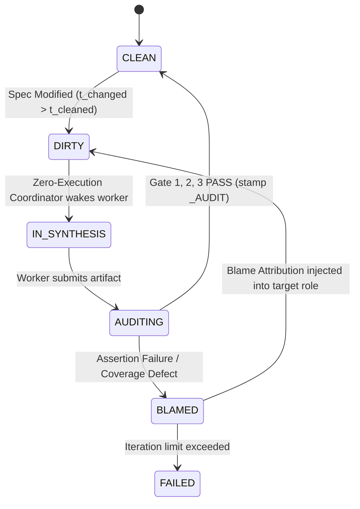

# Design Document: Pushing General-Purpose Languages to the Background via Epistemic Specification and Primal-Dual Certified Synthesis

**Target Venue:** ACM SIGPLAN Conference on Programming Language Design and Implementation (PLDI)  
**Track:** Research Track (Language Design, Program Synthesis, Formal Methods, Type Systems, Runtime Systems)  
**Status:** Authoritative Submission Design & Theoretical Specification  

---

## 1. Executive Summary & Research Thesis

### 1.1 The Grand Vision: Programming Languages as Ephemeral Bytecode
For over seven decades, general-purpose programming languages (GPLs—such as C++, Java, Rust, and Python) have served as the authoritative human medium for expressing computation, software architecture, and operational intent. Developers author, debug, review, and maintain GPL source code directly; compiler toolchains treat this source code as the ground truth from which machine bytecode or native binaries are derived.

The emergence of Large Language Models (LLMs) has sparked widespread interest in synthesizing programs from natural language specifications. However, contemporary approaches to AI-assisted software engineering ("vibe coding", agentic software engineers, copilot completions) preserve the traditional paradigm: **human developers must inspect, maintain, and debug the synthesized GPL source code**. This status quo persists because natural language is inherently ambiguous, and neural models are stochastic, hallucination-prone, and lack sound semantic guarantees. When LLM-generated code fails, developers are forced back into the low-level mechanics of the target programming language to diagnose runtime failures, patch subtle edge-case bugs, and resolve specification drift.

**The Cleanroom Thesis:**  
> *General-purpose programming languages can be pushed entirely to the background—demoted to disposable, machine-synthesized intermediate representations (IR/bytecode) that humans never author or maintain—if and only if program synthesis is governed by:*
> 1. *A formal **Epistemic Specification Calculus** ($\mathcal{L}_{clean}$) that separates architectural intent from atomic behavioral contracts and constructive capability reachability;*
> 2. *A **Primal-Dual Certified Synthesis Model** that formulates synthesis as a zero-sum certificate game between isolated, untrusted neural oracles under strict, kernel-enforced information-flow confinement ($\mathcal{I}(\text{Program}; \text{Certifier} \mid \text{Spec}) = 0$); and*
> 3. *A deterministic, closed-world **Multi-Gate Verification Toolchain** with fine-grained blame attribution that guarantees semantic preservation before target execution.*

Under Cleanroom, the human developer works exclusively within high-level literate specifications and factored planning contracts. The target GPL code and its corresponding verification certifiers are synthesized ephemerally by isolated model instances, cross-validated via dual-blind execution gates, and discarded or re-synthesized automatically whenever specifications evolve.

```
TRADITIONAL SE vs. THE CLEANROOM COMPILATION PARADIGM

Traditional Software Engineering & "AI Pair Programming":
┌───────────────────────┐       Manual Prompting       ┌───────────────────────┐
│ Ambiguous Natural     │ ───────────────────────────> │ GPL Source Code       │ ◄── PRIMARY HUMAN ARTIFACT
│ Language Intent / PRD │                              │ (Python, C++, Rust)   │     (Manual debugging & maintenance)
└───────────────────────┘                              └───────────────────────┘

The Cleanroom Synthesis-as-Compilation Paradigm:
┌─────────────────────────────────────────────────────────────────────────────┐
│ 1. High-Level Specification (high/*.md)                                     │ ◄── PRIMARY HUMAN ARTIFACTS
│    Literate architectural prose, semantic markers (*term*), lifecycle tiers │     (Authoritative Source of Truth)
│                                                                             │
│                                  │  Elaboration (high_to_planning)          │
│                                  ▼                                          │
│ 2. Planning Canvas (planning/*.md)                                          │
│    Factored Atomic Contracts ([slug]), Epistemic Grounding Logic (P ⊢ R)    │
│                                  │                                          │
│                                  ├── Gate 1: Spec_QA Arbiter (AST & DAG)    │
│                                  ▼  Elaboration (planning_to_low)           │
│ 3. Low-Level Specification (low/*.pyi)                                      │
│    Structural Meta-Types, Hoare DbC Docstrings, Grounding Arguments         │
│                                  │                                          │
│                                  ├── Gate 2: Low_QA Arbiter (Type & MRO)   │
│                                  ▼                                          │
├─────────────────────────────────────────────────────────────────────────────┤
│ 4. PRIMAL-DUAL SYNTHESIS BOUNDARY (Kernel-Enforced Information Confinement) │
│                                                                             │
│        Primal Oracle (Synthesizer S)       Dual Oracle (Certifier D)        │
│           (chmod 444; no tests)               (chmod 444; no lib)           │
│                     │                                   │                   │
│                     ▼                                   ▼                   │
│        Target Library Code (P)             Contract Test Suite (V)          │
│        [EPHEMERAL BYTECODE]                [INDEPENDENT CERTIFIER]          │
│                     │                                   │                   │
│                     └─────────────────┬─────────────────┘                   │
│                                       │ Gate 3: QA & Coverage               │
│                                       ▼                                     │
│        Hermetic Execution: P satisfies V ∧ 100% AST Statement Coverage      │
│        (Target code certified or rejected with Blame Attribution)           │
└─────────────────────────────────────────────────────────────────────────────┘
```

### 1.2 The PLDI Framing: Theoretical Depth Over Empirical Heuristics
A submission to PLDI cannot simply report empirical benchmark scores on SWE-bench or HumanEval; it must address fundamental questions of programming language design, formal semantics, and rigorous verification:

| Dimension | AI / Empirical SE Focus (Reject for PLDI) | Cleanroom PLDI Focus (Core PL Contribution) |
| :--- | :--- | :--- |
| **Source of Truth** | Treating code as truth; prompt engineering to generate code directly. | **Language Design**: Formalizing a multi-stage specification calculus where literate prose elaborates into factored atomic contracts and constructive epistemic DAGs. |
| **Synthesis Oracle** | Evaluating model accuracy ($Pass@k$) and prompt variants. | **Soundness Bounding**: Defining a formal framework that guarantees deterministic safety and contract adherence despite using untrusted, non-deterministic neural oracles. |
| **Dual Generation** | Heuristic N-version voting (Avizienis 1985). | **Game-Theoretic & Information-Theoretic Confinement**: Formulating synthesis as a primal-dual game between independent oracles under provable zero information leakage ($\mathcal{I}(P; V \mid S) = 0$). |
| **Verification Gate** | Running a linter and checking if tests pass mechanically. | **Multi-Pass Compilation & Verification Calculus**: Closed-world AST linking, MRO contract inheritance, AST-normalized statement coverage, and formal blame attribution state transitions. |
| **Failure Handling** | Retrying prompts until the model stops making syntax errors. | **Language-Level Blame Semantics**: Backtracking in the topological dependency graph and isolating dirty state invalidation to upstream specification components. |

---

## 2. Theoretical Foundations: Beyond Classical N-Version Programming

### 2.1 The Fallacy of Naive N-Version Synthesis
N-Version Programming (NVP), introduced by Avizienis (1985), proposed building fault-tolerant critical systems by having independent human teams implement identical specifications, executing all versions concurrently, and voting on outputs at runtime. In 1986, Knight and Leveson published their seminal empirical study disproving NVP's foundational independence assumption: **statistically correlated coincident errors occurred across independent teams**. The root cause was twofold:
1. **Cognitive Correlation**: Human programmers share common cognitive heuristics and blind spots when reasoning about complex edge cases.
2. **Specification Ambiguity**: Informal specifications contain semantic gaps, linguistic ambiguities, and unstated assumptions that all teams misinterpret in identical ways.

Attempting to revive N-version programming simply by querying multiple LLMs or prompting the same LLM $N$ times repeats this fundamental fallacy:
- Foundation models are trained on overlapping corpora of open-source code and share identical inductive priors ($\mathcal{D}_\theta$).
- If an agent synthesizes an implementation and its verification tests in the same conversational context window, it falls into **tautological self-affirmation**: the test suite tests the model's mistaken mental model rather than the true specification.
- If the specification contains compound natural language sentences, models universally satisfy the common case and silently omit edge-case invariants.

### 2.2 The Root Cause of Knight & Leveson: Accidental Agreement via Directional (One-Sided) Contracts
A critical subsequent insight into the Knight & Leveson phenomenon in software testing theory is the mechanism of **accidental agreement** (or coincident correctness) at domain boundaries:
- In classical specifications, contracts are typically formulated as directional implications:
  $$\Phi(x) \implies \Psi(x)$$
  (e.g., *"If all nodes are clean in graph storage, report complete."*)
- In this formulation, the behavior of the system on the complementary subspace $\neg \Phi(x)$ (*when at least one node is dirty*) is left implicit or under-specified.
- Under directional specifications, independent implementations routinely adopt the easiest default behavior on the un-specified complement (e.g., returning `None`, executing a no-op, or returning a default boolean).
- Similarly, independently written test oracles predominantly probe the positive domain $\Phi(x)$ where the capability is activated.
- **The Result**: The implementation and the test suite display **accidental agreement**—both pass green on tests sampled from $\Phi(x)$, while the implementation is fundamentally broken across the entire complement $\neg \Phi(x)$!

In neural program synthesis, accidental agreement is dramatically magnified because foundation models share statistical default tendencies (e.g., returning early `None` or failing to raise specific domain exceptions).

### 2.3 The Bipartite Boundary Principle: Focusing on Both Sides of Edge Cases
Cleanroom circumvents the Knight & Leveson trap by establishing the **Bipartite Boundary Principle**:

> **The Bipartite Boundary Principle**: *No contract or boundary condition is legally specified unless both sides of the boundary partition are explicitly, exhaustively, and symmetrically defined.*

Mathematically, let $\mathcal{D}$ be the input/state domain. Any condition $C(x)$ partitions $\mathcal{D}$ into two disjoint, exhaustive sub-domains:
$$\mathcal{D} = \mathcal{D}^+ \uplus \mathcal{D}^- \quad \text{where } \mathcal{D}^+ = \{x \in \mathcal{D} \mid C(x)\}, \quad \mathcal{D}^- = \{x \in \mathcal{D} \mid \neg C(x)\}$$

Rather than directional implications ($C(x) \implies \text{Success}$), Cleanroom contracts enforce **bi-conditional semantics**:
$$C(x) \iff \text{Output}(x) = Y^+$$
which decomposes into two symmetric, atomic obligations:
1. **Positive Boundary Contract ($[s^+]$)**: $\forall x \in \mathcal{D}^+, \ \text{Exec}(x) = Y^+$
2. **Negative Boundary Contract ($[s^-]$)**: $\forall x \in \mathcal{D}^-, \ \text{Exec}(x) = Y^- \quad (\text{or } \mathbf{Raise}(\text{DomainException}))$

In Cleanroom planning canvases, this is enforced by the canonical linguistic form:
$$\text{"\dots holds if, but only if, \dots"}$$
Crucially, Cleanroom's verification gates demand that test certifiers witness **both sides** of the partition ($\mathcal{D}^+$ and $\mathcal{D}^-$) with explicit assertions (e.g. `assertTrue` and `assertFalse`). Paired with AST-normalized 100% statement coverage, an implementation branching on $C(x)$ cannot pass verification unless the test certifier exercises and validates both branches, mathematically eliminating accidental agreement.

### 2.4 Primal-Dual Synthesis as a Zero-Sum Certificate Game

Cleanroom synthesizes these principles not through runtime voting among redundant implementations, but as a **Primal-Dual Certificate Game** between untrusted neural oracles under kernel-enforced information confinement:

$$\max_{P \in \mathcal{L}_{IR}} \min_{V \in \mathcal{V}_{cert}} \mathcal{U}(P, V; S)$$

- **Primal Player (Synthesizer $\mathcal{S}$)**: Given specification $S$, synthesizes an executable program $P \in \mathcal{L}_{IR}$ that attempts to witness the existence of a model satisfying $S$.
- **Dual Player (Certifier $\mathcal{D}$)**: Given specification $S$, synthesizes an adversarial verification oracle $V \in \mathcal{V}_{cert}$ (a test suite equipped with assertions and pre/post-conditions) designed to expose counterexamples or contract violations in any candidate implementation.
- **Payoff Function $\mathcal{U}(P, V; S)$**:
  $$\mathcal{U}(P, V; S) = \begin{cases} 
  +1 & \text{if } V(P) = \mathbf{PASS} \ \land \ \mathbf{Cov}(P, V) = 100\% \ \land \ \mathbf{TypeCheck}(P, S) = \mathbf{OK} \\
  -1 & \text{otherwise}
  \end{cases}$$

```
                THE PRIMAL-DUAL CERTIFICATE GAME
                
                      Specification S ∈ L_spec
               (Atomic Bipartite Contracts [s+], [s-])
                                │
        ┌───────────────────────┴───────────────────────┐
        ▼ (Primal Oracle: S)                            ▼ (Dual Oracle: D)
  Candidate Program                               Independent Certifier
     P ∈ L_IR                                        V ∈ V_cert
  (chmod 444; no tests)                           (chmod 444; no lib)
  (Implements D+ and D-)                          (Asserts D+ and D-)
        │                                               │
        └───────────────────────┬───────────────────────┘
                                ▼
                   Referee Gate (Gate 3)
                   - Dynamic Execution: V(P) = PASS
                   - AST Statement Coverage: Cov(P, V) = 100%
                   - Static Typing: TypeCheck(P, S) = OK
                                │
                 ┌──────────────┴──────────────┐
                 ▼                             ▼
         [CERTIFIED BYTECODE]          [BLAME ATTRIBUTION]
         Accepted into Cache           S or D or S Blamed
```

**Theorem 1 (Elimination of Tautological Fixed Points and Accidental Agreement).**  
Let $\mathcal{O}_{\mathcal{S}}$ and $\mathcal{O}_{\mathcal{D}}$ be two untrusted stochastic synthesis oracles. Let $\mathcal{E}$ be the event that candidate program $P$ contains an ungrounded semantic defect $\delta \neq \emptyset$ ($P \not\models S$), yet certifier $V$ passes $P$ ($V(P) = \mathbf{PASS}$).
1. Under joint conversational synthesis (where $P$ and $V$ are generated in the same context window), the mutual information $\mathcal{I}(P; V \mid S) > 0$. The probability of an undetected defect escaping is lower-bounded by the model's self-affirmation bias:
   $$P_{\text{joint}}(\mathcal{E}) \ge \gamma_{\text{self}} > 0$$
2. Under Cleanroom's physically isolated Primal-Dual synthesis, the communication channel between $\mathcal{S}$ and $\mathcal{D}$ is closed, giving $\mathcal{I}(P; V \mid S) = 0$. The escape probability factors into the conditional product of independent error distributions:
   $$P_{\text{dual}}(\mathcal{E}) = \sum_{\delta \in \Delta} P(\mathcal{S} \text{ emits defect } \delta \mid S) \cdot P(\mathcal{D} \text{ accepts defect } \delta \mid S)$$
3. Furthermore, when contracts enforce the Bipartite Boundary Principle over edge cases and $V$ satisfies AST-normalized statement coverage ($\mathbf{Cov}(P, V) = 100\%$), the term $P(\mathcal{D} \text{ accepts defect } \delta \mid S)$ is bounded to zero for all boundary mutations, eliminating accidental agreement.

*Proof Sketch:* When $\mathcal{I}(P; V \mid S) = 0$, $P$ and $V$ are conditionally independent given $S$. For any boundary defect $\delta$ (e.g. off-by-one or missing check on $\mathcal{D}^-$) to escape, $V$ must omit testing $\mathcal{D}^-$. However, $P$'s implementation must branch to handle both $[s^+]$ and $[s^-]$ to avoid static type or syntax deadlocks. If $V$ only tests $\mathcal{D}^+$, the basic block in $P$ handling $\mathcal{D}^-$ remains un-executed, yielding $\mathbf{Cov}(P, V) < 100\%$. Gate 3 rejects the candidate. Hence, defect $\delta$ cannot escape. $\blacksquare$

### 2.5 Modularity & Compositional Soundness: Why Unit Tests Merge into Integration Without Integration Tests

#### 2.5.1 The Modularity Mandate: Fine-Grained Units (< 500 LOC)
Cleanroom intentionally constrains implementation modules to be small—strictly under 500 lines of code, and typically under 250 LOC.
- **The Rationale**: This constraint is **not** because coincident error suppression fails on large modules, but because **fine-grained modularity makes the state space and boundary partitions humanly and neurally tractable to identify, factor, and comprehensively verify**.
- In a 5,000 LOC monolithic system, the combinatorial explosion of internal execution paths creates an intractably large boundary surface area. Neural models inevitably overlook subtle corner cases, and human specification authors struggle to formulate exhaustive bi-conditional partitions.
- By decomposing software into small, highly cohesive units (< 500 LOC), each component manages a compact contract footprint (typically 5 to 15 atomic contracts). Edge cases are obvious, boundary conditions are binary and clean, and bipartite test assertions can exhaustively cover both $\mathcal{D}^+$ and $\mathcal{D}^-$.

#### 2.5.2 The "Unit Test Merging" Paradox
In traditional software engineering, high modularity introduces a notorious liability: **unit tests pass against mocks, but the system crashes when components are integrated**. Consequently, conventional software development relies heavily on end-to-end integration tests.
Why do traditional unit tests fail to guarantee integrated correctness?
Because in conventional programming:
1. **Interfaces are leaky abstractions**: Developers peek into dependency implementations (`B.py`) and write code in `A.py` that relies on uncontracted implementation quirks, caching behavior, mutable internal state, or undocumented side-effects.
2. **Mock Drift**: Unit tests for $A$ use handcrafted mocks that reflect the test author's optimistic assumptions about $B$, rather than $B$'s actual behavior.

#### 2.5.3 Why Dedicated Integration Tests are Unnecessary in Cleanroom
Cleanroom solves the integration problem through **Contract-Bounded Compositional Verification**:
1. **Physical Prohibition of Implementation Peeking**:
   When $A$ depends on $B$, $A$'s implementation workspace ($W_{lib}^A$) and test workspace ($W_{test}^A$) are physically prohibited from seeing $B$'s implementation (`lib/B.py`). They receive strictly $B$'s low-level typed interface stubs (`low/B.pyi`) and planning provisions ($B.\mathcal{P}$).
2. **The Impossibility of Writing Around Underspecified Dependencies**:
   Suppose $A$ requires a specific behavior from $B$, but $B$'s interface contract does not specify it:
   - *Can $A$'s agents peek into $B$'s source code?* **No, $B$'s implementation is physically absent or read-only stubbed.**
   - *Could $A$'s agents attempt to "write around it" by guessing behavior based on API naming alone?*
     **If they guess based on API naming, the system cannot converge:**
     - Because $A$'s implementation oracle $\mathcal{S}_A$ and certifier $\mathcal{D}_A$ are physically isolated ($\mathcal{I}(L_A; T_A \mid \text{Spec}) = 0$), their independent guesses based on loose naming will either:
       a) **Diverge immediately**: $L_A$ assumes `None`, while $T_A$ assumes raising a domain exception. $T_A(L_A)$ fails immediately at Gate 3!
       b) **Fail Epistemic Grounding**: Even if both guess the same semantics, Gate 1 (`spec_qa`) audits $A$'s grounding canvas: $A$'s requirement *cannot cite a valid knowledge provision slug from $B$*. The compiler halts at Gate 1 with an `UNGROUNDED_REQUIREMENT` error.
     - **The Only Resolution**: The developer must modify $B$'s specification to explicitly add the required contract. This triggers Cleanroom's dependency engine: $B$ is marked $\mathbf{DIRTY}$, re-synthesized, verified, and certified. Once certified, $B$ exports the new provision slug, enabling $A$ to ground its requirement legally.
3. **Assume-Guarantee Compositional Soundness**:
   Because:
   - $B$ is certified to satisfy its contracts: $\models B \text{ sat } \mathcal{C}_B$;
   - $A$ is verified against $B$'s interface contracts: $\mathcal{C}_B \models A \text{ sat } \mathcal{C}_A$; and
   - $A$ is physically prevented from depending on uncontracted implementation details of $B$ ($\mathcal{I}(A; \text{impl}(B) \mid \text{spec}(B)) = 0$),
   the classical Assume-Guarantee Rule (Pnueli, Clarke) holds unconditionally:
   $$\frac{\models B \text{ sat } \mathcal{C}_B \qquad \mathcal{C}_B \models A \text{ sat } \mathcal{C}_A}{\models (A \parallel B) \text{ sat } \mathcal{C}_A \land \mathcal{C}_B}$$
   By induction over the acyclic dependency DAG, **every component's unit verification results soundly merge into whole-system integrated correctness without requiring dedicated whole-program integration tests**.

### 2.6 The Edge-Case Identification Problem: Escaping the "CUJ Trap" and the Limits of Code Coverage

#### 2.6.1 The "CUJ Trap" in Neural Program Synthesis
Large Language Models exhibit a strong statistical bias toward the mode of their training distributions. When prompted to author specifications, implementations, or test suites, models naturally degenerate into **Critical User Journeys (CUJs)**—the common, happy-path flows that occur with high frequency in public software repositories.
For example, in a DAG scheduling module, an LLM will readily generate contracts and tests for:
- Constructing a linear 3-node dependency chain and advancing nodes from dirty to clean;
- Querying a valid batch within normal limits.

However, the model routinely fails to hypothesize or test the critical boundary edge cases:
- *What happens when a self-loop cycle ($A \to A$) or transitive cycle ($A \to B \to A$) is set as target?*
- *What happens when the batch size is configured to 0 or negative numbers?*
- *What happens when an iteration limit is exceeded on the exact boundary turn ($N$ vs $N+1$)?*
- *What happens when two nodes share the same role tier precedence but have identical unit addresses?*

#### 2.6.2 The Code Coverage Illusion: Why 100% Statement Coverage is Insufficient
A pervasive assumption in software engineering is that high code coverage guarantees edge-case testing. Cleanroom's toolchain indeed enforces 100% normalized statement coverage at Gate 3. However, from a formal PL perspective:
> **The Code Coverage Illusion**: *Code coverage is strictly an implementation-relative metric. It measures what statements were written, but is completely blind to missing code (un-written branches, omitted invariants, and unhandled edge cases).*

If the synthesized implementation completely omits the boundary check:
```python
# OMITTED CHECK: if batch_size <= 0: raise ValueError(...)
```
then that conditional statement does not exist in the Abstract Syntax Tree! The test certifier can execute 100% of the statements present in the implementation without ever probing the boundary. Both the implementation and the test certifier remain happily in **accidental agreement** within the CUJ subspace, while the software remains broken at its boundaries.

#### 2.6.3 Cleanroom's 4-Layer Defense for Systematic Edge-Case Identification
Cleanroom addresses the edge-case identification problem not through stochastic prompting, but through language-level constraints and adversarial verification mechanisms:

```
┌─────────────────────────────────────────────────────────────────────────────┐
│              CLEANROOM'S 4-LAYER EDGE-CASE IDENTIFICATION DEFENSE           │
├─────────────────────────────────────────────────────────────────────────────┤
│                                                                             │
│  Layer 1: The Bipartite Partition Mandate (Planning Level)                  │
│  - "holds if, but only if, ..." quantifier forces dual [s+] and [s-] slugs. │
│  - spec_qa rejects any contract stating a condition without its complement. │
│                                                                             │
│  Layer 2: Orthogonal Boundary Dimension Probing (Type Level)                │
│  - Systematic boundary enumeration across 4 canonical dimensions:           │
│    1. Cardinality (0, 1, K_max, K_max + 1, ∞)                               │
│    2. Topology/Ordering (sorted, reverse, duplicate, cyclic, disconnected)  │
│    3. Nullity/Sentinels (None, empty, malformed, out-of-bounds)             │
│    4. State Lifecycle (uninitialized, active, terminated, re-entered)       │
│                                                                             │
│  Layer 3: Closed-World Variant Exhaustiveness (LLS Stub Level)              │
│  - Sum types (@variant) enforce compiler-level exhaustive pattern matching. │
│  - Low_QA / ClosedWorldLinker statically rejects omitted variants.          │
│                                                                             │
│  Layer 4: Adversarial Mutation Inoculation (Gate 3 Arbiter Level)           │
│  - Injects boundary mutants (< to <=, boundary defaults, invariant erasures)│
│  - If a mutant survives, the test suite is blamed for missing edge-case     │
│    witnessing, forcing the creation of missing assertions.                  │
│                                                                             │
└─────────────────────────────────────────────────────────────────────────────┘
```

1. **The Bipartite Partition Mandate**:
   At the specification level, any conditional requirement must be stated bi-conditionally (`"holds if, but only if, ..."`). The `spec_qa` arbiter parses the AST of planning contracts and flags any contract that introduces an activation condition without an explicit complementary obligation for its negation.
2. **Orthogonal Boundary Dimension Probing**:
   Edge cases do not arise randomly; they manifest along universal computational dimensions:
   - *Cardinality*: Collections and batches must be probed at $\{0, 1, K_{\text{max}}, K_{\text{max}} + 1\}$.
   - *Topology*: Graphs must be probed with $\{ \emptyset, \text{tree}, \text{diamond}, \text{self-loop}, \text{multi-cycle} \}$.
   - *Extrema*: Numeric boundaries must be probed at $\{ \text{min}, \text{min}-1, \text{max}, \text{max}+1 \}$.
   - *Lifecycle*: Services must be probed in uninitialized and terminal phases.
   In fine-grained modules (< 500 LOC), the parameter space per operation is small ($\le 3$ arguments), making this orthogonal grid finite and fully enumerable.
3. **Closed-World Variant Exhaustiveness**:
   Domain sum-types are decorated with `@variant` and registered in closed hierarchies. The `ClosedWorldLinker` verifies exhaustive dispatch, preventing the neural synthesizer from ignoring uncommon variant states.
4. **Adversarial Mutation Inoculation**:
   To defeat the "Code Coverage Illusion", Gate 3 does not rely solely on coverage. It dynamically injects first-order boundary mutants into the implementation (altering `<` to `<=`, stripping boundary exceptions, and inverting default booleans). If the test suite passes green over a boundary mutant, Gate 3 rejects the certifier with a **Boundary Defect Escape Blame**, requiring the test author to witness the edge case explicitly.

---

## 3. The Cleanroom Specification Calculus ($\mathcal{L}_{clean}$)

We formalize Cleanroom as a multi-tier specification language $\mathcal{L}_{clean}$ equipped with an epistemic capability logic, a contract atomization algebra, and a structural lifecycle type system.

### 3.1 Syntax of $\mathcal{L}_{clean}$

```
(Identifiers, Slugs, & Types)
  x, y, f, C    ::= Symbol                           (Variables, Functions, Classes)
  s             ::= [a-z0-9_]+                       (Atomic Semantic Slug)
  tier          ::= system | agent_session | turn    (Lifecycle Containment Tiers)
  \tau          ::= BaseType | C | \tau \to \tau | InTier[tier](\tau)

(High-Level Specification: HLS)
  Spec_{HLS}    ::= Module(x, imports, Purpose, Types, Behaviors)
  Types         ::= Entity(x, tier)*
  Behaviors     ::= Op(f, Args, Returns, Text)*

(Planning Canvas: Plan)
  Spec_{Plan}   ::= Canvas(x, imports, Intent, Typing, Contracts, Woven, Grounding)
  Typing        ::= (x : \tau)*
  Contracts     ::= (s : \phi_{atomic})*             (Atomic Behavioral Contracts)
  Woven         ::= ([s_1, ..., s_k] => \psi)*      (Cross-Cutting Interaction Rules)
  Grounding     ::= \langle Provisions, Requirements \rangle
  Provisions    ::= (s : \pi)*                       (Exported Knowledge Provisions)
  Requirements  ::= (r : Grounded(s^+) | Deferred(x))*

(Low-Level Interface Stubs: LLS)
  Spec_{LLS}    ::= StubModule(x, imports, Decls)
  Decl          ::= @singleton_type(tier) ClassDef(C, Body)
                  | @poly_type ClassDef(C, Body)
                  | @data_type ClassDef(C, Body)
                  | @variant ClassDef(C, Extends(C'), Body)
  Body          ::= Member*
  Member        ::= @property def f(self) -> \tau: ...
                  | @operation def f(self, \vec{x} : \vec{\tau}) -> \tau: DocContract ...
  DocContract   ::= INVARIANTS: \vec{\iota}
                    PRECONDITIONS: \vec{\rho}
                    POSTCONDITIONS: \vec{\sigma}
                    GROUNDING: ArgMapping*
```

### 3.2 Constructive Epistemic Capability Logic ($\mathbf{EPL}$)

In traditional Hoare logic, contracts state *what* must hold ($\{P\} c \{Q\}$), but cannot verify *whether the executing component has the epistemic knowledge to compute it*. In multi-agent or neural synthesis, components frequently fail because they require ambient state, capabilities, or collaborator methods that are not reachable.

We introduce the **Epistemic Capability Logic ($\mathbf{EPL}$)**. Let $\mathcal{K}$ be the universe of knowledge capabilities. An epistemic environment $\Gamma$ tracks available capabilities. A specification unit $u$ defines a judgment:

$$\Gamma \vdash u \ \mathbf{grounded}$$

#### Inference Rules of $\mathbf{EPL}$:

$$\frac{}{\Gamma, [p : \kappa] \vdash [p : \kappa] \ \mathbf{prov}} \quad (\textsc{Ax-Prov})$$

$$\frac{\forall r_i \in \mathcal{R}_u, \ \exists p_j \in \mathcal{P}_{\text{local}} \cup \bigcup_{v \prec u} \mathcal{P}_v \text{ s.t. } p_j \models r_i}{\mathcal{P}_u, \mathcal{R}_u \vdash u_{\text{intf}} \ \mathbf{grounded}} \quad (\textsc{Ground-Intf})$$

$$\frac{\mathcal{R}_{\text{deferred}}(u_{\text{intf}}) = \vec{r}_{\text{def}} \quad \forall r \in \vec{r}_{\text{def}}, \ \Gamma \cup \mathcal{P}_{u_{\text{impl}}} \vdash r \ \mathbf{grounded} \quad \mathcal{R}_{\text{deferred}}(u_{\text{impl}}) = \emptyset}{\Gamma \vdash u_{\text{impl}} \ \mathbf{grounded}} \quad (\textsc{Zero-Deferred-Impl})$$

$$\frac{\mathcal{R}_{u_{\text{ext}}} = \emptyset \quad \mathcal{P}_{u_{\text{ext}}} \subseteq \mathcal{K}_{\text{ambient}}}{\vdash u_{\text{ext}} \ \mathbf{grounded}} \quad (\textsc{Ground-Ext})$$

**Theorem 2 (Constructive Capability Reachability).**  
Let $G = (V, E)$ be the dependency graph of specification units. If $G$ is an acyclic DAG and every unit $u \in V$ is grounded under the $\mathbf{EPL}$ inference rules, then:
1. **Total Knowledge Closure**: For every unit $u$ and every requirement $r \in \mathcal{R}_u$, there exists a constructive derivation path terminating strictly in external boundary provisions ($\mathcal{P}_{\text{ext}}$) or caller inputs.
2. **Deadlock Freedom**: No component requires capabilities whose provision depends circularly on its own execution.

*Proof:* By induction on the topological sort of DAG $G$. External nodes $V_{\text{ext}}$ have $\mathcal{R} = \emptyset$ (base case). For any node $u$ with in-degree $> 0$, all requirements $r \in \mathcal{R}_u$ are mapped to provisions $p \in \mathcal{P}_v$ where $v$ precedes $u$ in topological order. By the induction hypothesis, each $v$ is constructively closed; thus $u$ is constructively closed. $\blacksquare$

### 3.3 The Zero-Conjunction Orthogonal Basis Theorem

Natural language software specifications are plagued by the **Partial-Conjunct Satisficing Problem**: when presented with a compound specification $\Phi = \phi_1 \land \phi_2 \land \dots \land \phi_k$, an untrusted neural oracle often satisfies $k-1$ conjuncts while omitting the $k$-th, and standard test suites frequently test only the dominant conjunct.

**Definition 1 (Atomic Contract Decomposition).**  
A contract $\phi$ is atomic if $\text{AST}(\phi)$ contains zero coordinating conjunctions ($\land, \lor \notin \text{AST}(\phi)$) and zero compound qualifiers. Every atomic contract is assigned an immutable semantic slug $[s_i]$.

**Definition 2 (Contract Space Orthogonality).**  
Let $\mathcal{C} = \{[s_1]: \phi_1, \dots, [s_n]: \phi_n\}$ be the set of factored atomic contracts. The set $\mathcal{C}$ forms an **orthogonal basis** for the module's behavioral contract space:
$$\forall i \neq j, \quad \text{Slug}([s_i]) \cap \text{Slug}([s_j]) = \emptyset$$

A test oracle $V$ is decomposed into a set of atomic test witnesses $\{t_1, \dots, t_n\}$ such that each $t_i$ explicitly cites exactly one contract slug:
$$\forall t_i \in V, \quad \mathbf{Citation}(t_i) = [s_i]$$

**Theorem 3 (Masking Elimination).**  
Let $\Phi = \bigwedge_{i=1}^n \phi_i$ be an un-factored compound contract. Let $\mathcal{C} = \{[s_1]: \phi_1, \dots, [s_n]: \phi_n\}$ be its atomic Cleanroom factorization. Under an atomic basis, the probability of an oracle partially satisficing the specification without detection is zero:
$$\mathbf{Cov}_{\text{atomic}}(P, V) = 100\% \implies \forall i \in \{1, \dots, n\}, \quad P \models \phi_i$$

*Proof:* Cleanroom Gate 3 enforces that every test method $t_i$ is mapped to a distinct atomic slug $[s_i]$ and that the test suite achieves 100% normalized statement coverage over $P$. If $P$ fails to implement $\phi_k$, either: (1) the corresponding test witness $t_k$ asserting $\phi_k$ fails at runtime, or (2) the code path corresponding to $\phi_k$ is missing, causing $t_k$ to fail or leaving statements uncovered. In either case, the gate rejects the implementation. $\blacksquare$

### 3.4 Bi-Conditional Contracts & Bipartite Edge-Case Partitions

To formally operationalize the Bipartite Boundary Principle and prevent accidental agreement, $\mathcal{L}_{clean}$ extends Hoare postconditions with **bi-conditional contract partitions**.

**Definition 3 (Bi-Conditional Boundary Contract).**  
Let $C : \Sigma \to \mathbb{B}$ be a computable boolean predicate over program states $\Sigma$, defining boundary $\mathcal{B} = \{ \sigma \in \Sigma \mid C(\sigma) \}$. A bi-conditional boundary contract is a pair of atomic contracts:
$$\Phi_{\text{bipartite}} \triangleq \langle [s^+]: C(\sigma) \implies \text{Post}^+(\sigma), \quad [s^-]: \neg C(\sigma) \implies \text{Post}^-(\sigma) \rangle$$
where $\text{Post}^+(\sigma)$ and $\text{Post}^-(\sigma)$ are disjoint output predicates ($\text{Post}^+ \cap \text{Post}^- = \emptyset$). In literate planning prose, this is specified via the canonical linguistic quantifier:
$$\text{"\dots holds if, but only if, [condition] \dots"}$$

**Theorem 4 (Bipartite Boundary Soundness).**  
Let implementation $P$ and certifier $V$ be synthesized under information confinement $\mathcal{I}(P; V \mid S) = 0$. Let contract $S$ contain bipartite boundary partition $\Phi_{\text{bipartite}}$. If:
1. Certifier $V$ contains dual witness assertions $t^+ \models [s^+]$ and $t^- \models [s^-]$;
2. $V(P) = \mathbf{PASS}$; and
3. Gate 3 verifies normalized 100% statement coverage ($\mathbf{Cov}(\mathcal{N}(P), V) = 1.0$),
then accidental agreement on boundary condition $C(\sigma)$ is impossible: $P$ correctly implements both sides of the edge case.

*Proof:* Suppose toward contradiction that $P$ fails on the boundary (e.g. $P$ executes $\text{Post}^+$ when $\neg C(\sigma)$ holds, or fails to execute $\text{Post}^-$). Because $V$ contains an independent test witness $t^-$ that asserts $\text{Post}^-$ under input condition $\neg C(\sigma)$, executing $t^-$ on $P$ will evaluate $P$'s incorrect output and trigger an assertion failure ($V(P) = \mathbf{FAIL}$), unless $t^-$ is never executed. However, $P$'s implementation must contain distinct conditional branching blocks to satisfy both $[s^+]$ and $[s^-]$. If $t^-$ were omitted or trivialized, the basic block in $P$ computing $\text{Post}^-$ would have zero execution count, yielding $\mathbf{Cov}(\mathcal{N}(P), V) < 1.0$, which is rejected by Gate 3. Therefore, $P$ must execute and satisfy both sides of the boundary. $\blacksquare$

### 3.5 Structural Lifecycle Tier Typing ($\mathbf{LTT}$)

Cleanroom formalizes system operational lifecycles through structural tier decorators. The set of tiers $\mathcal{T} = \{\text{system}, \text{agent\_session}, \text{turn}\}$ forms a strict sub-lifetime ordering:

$$\text{system} \sqsupset \text{agent\_session} \sqsupset \text{turn}$$

$$\frac{\Gamma \vdash x : \text{InTier}[T_1](\tau_1) \quad \Gamma \vdash y : \text{InTier}[T_2](\tau_2) \quad T_1 \sqsupset T_2}{\Gamma \vdash x.\text{field} = y \implies \mathbf{TypeError}} \quad (\textsc{Tier-Confinement})$$

$$\frac{\Gamma \vdash f : \tau \to \text{InTier}[T_2](\tau_{\text{ret}}) \quad \text{class } C \in \text{InTier}[T_1] \quad T_1 \sqsupset T_2}{\Gamma \vdash C.f \implies \mathbf{TypeError}} \quad (\textsc{Tier-Return-Escape})$$

This type system is checked statically by the closed-world AST linker (`SpecLintVisitor` / `ClosedWorldLinker`), proving that long-lived system singletons cannot leak memory or capture stale execution state from short-lived agent turns.

### 3.6 Compositional Assume-Guarantee Soundness

Let $G = (V, E)$ be the repository dependency DAG, where each node $u \in V$ represents a module with interface contract $\mathcal{C}_u = \bigwedge_i [s_i^u]$, implementation $P_u$, and test certifier $V_u$.

Let $\mathbf{Verified}(u)$ denote that $P_u$ passed Gate 3 against $V_u$ with 100% normalized coverage, where all dependencies $w \prec u$ are represented strictly by their interface stubs $\mathcal{C}_w$:
$$\mathbf{Verified}(u) \iff \bigwedge_{w \prec u} \mathcal{C}_w \vdash P_u \models \mathcal{C}_u$$

**Theorem 5 (Compositional Inductive Soundness).**  
Suppose the dependency graph $G = (V, E)$ is an acyclic DAG rooted in verified external boundaries ($V_{\text{ext}}$). If:
1. Every module $u \in V$ is grounded under the $\mathbf{EPL}$ capability logic ($P \vdash R$);
2. Physical workspace isolation enforces zero implementation peeking ($\mathcal{I}(P_u; P_w \mid \text{Spec}) = 0$ for all $w \prec u$); and
3. Every module passes its local unit verification gate: $\forall u \in V, \ \mathbf{Verified}(u)$,
then the composed whole-system execution $\prod_{u \in V} P_u$ soundly satisfies the global system specification without requiring dedicated whole-program integration tests:
$$\models \left( \prod_{u \in V} P_u \right) \models \bigwedge_{u \in V} \mathcal{C}_u$$

*Proof:* By induction on the topological sort of $G = (V, E)$.
- *Base case*: Nodes $v \in V_{\text{ext}}$ have no internal dependencies and are certified by construction or foreign runtime contracts.
- *Inductive step*: Let $u$ be a node whose topological predecessors $W = \{w \mid (w, u) \in E\}$ are inductively proven to satisfy their contracts: $\models \prod_{w \in W} P_w \models \bigwedge_{w \in W} \mathcal{C}_w$. Because $u$'s implementation workspace is physically isolated from $P_w$ and can only link against $\mathcal{C}_w$'s stubs, $P_u$ has no semantic dependencies on uncontracted implementation behaviors. Since $\mathbf{Verified}(u)$ establishes $\bigwedge_{w \in W} \mathcal{C}_w \vdash P_u \models \mathcal{C}_u$, applying the classical Assume-Guarantee rule yields:
$$\models \left( P_u \parallel \prod_{w \in W} P_w \right) \models \mathcal{C}_u \land \bigwedge_{w \in W} \mathcal{C}_w$$
By induction over all nodes in the finite DAG $G$, the composite system satisfies $\bigwedge_{u \in V} \mathcal{C}_u$. $\blacksquare$

---

## 4. Multi-Gate Verification Calculus & Blame Attribution

Verification in Cleanroom is formulated as a sequence of three sound Galois connections / projection operators that map abstract specifications down to concrete runtime traces.

```
┌─────────────────────────────────────────────────────────────────────────────┐
│ High-Level Spec (high/*.md)                                                 │
│                                  │  high_to_planning                        │
│                                  ▼                                          │
│ Planning Canvas (planning/*.md)                                             │
│                                                                             │
│ ┌─────────────────────────────────────────────────────────────────────────┐ │
│ │ GATE 1: Spec_QA Arbiter (Static Epistemic Projections)                  │ │
│ │ - Zero-Conjunction Rule check on ### Contracts: ConjunctionCount(ϕ) = 0 │ │
│ │ - Unique referential integrity of slugs: Inj: Slugs ↪ Contracts         │ │
│ │ - Epistemic Capability Logic: Acyclic DAG check (P ⊢ R)                │ │
│ │ - Zero-Deferred Invariant on implementation canvases                    │ │
│ └─────────────────────────────────────────────────────────────────────────┘ │
│                                  │                                          │
│                                  ▼  planning_to_low                         │
│ Low-Level Interface Stubs (low/*.pyi)                                       │
│                                                                             │
│ ┌─────────────────────────────────────────────────────────────────────────┐ │
│ │ GATE 2: Low_QA Arbiter (Type Soundness & MRO Inheritance)               │ │
│ │ - Pure Ellipsis Invariant: MemberBody = docstring + ast.Constant(...)   │ │
│ │ - Structural Decorator Taxonomy: Singleton, Poly, Data, Variant         │ │
│ │ - Lifecycle Tier Confinement: T_1 ⊐ T_2 confinement checked             │ │
│ │ - Zero-Token MRO Requirements Synchronizer (compile_module_inheritance) │ │
│ │ - Hermetic Pyright Static Type Checking                                 │ │
│ └─────────────────────────────────────────────────────────────────────────┘ │
│                                  │                                          │
│                                  ▼  Primal-Dual Synthesis (low_to_lib/test) │
│ Implementation & Tests (lib/*.py & tests/*_test.py)                         │
│                                                                             │
│ ┌─────────────────────────────────────────────────────────────────────────┐ │
│ │ GATE 3: QA & Coverage Arbiters (Primal-Dual Certificate Gateway)        │ │
│ │ - Hermetic Pyright verification of P against Low stubs                  │ │
│ │ - Dual Test Execution: V(P) = PASS                                      │ │
│ │ - Traceable Requirement Citation: ∀ t ∈ V, Citation(t) = [s_i]          │ │
│ │ - AST-Normalized 100% Statement Coverage (evaluate_coverage.py)        │ │
│ │ - Dead code & untracked branch rejection                                │ │
│ └─────────────────────────────────────────────────────────────────────────┘ │
│                                  │                                          │
│                                  ▼                                          │
│                  CERTIFIED CLEANROOM BYTECODE                               │
└─────────────────────────────────────────────────────────────────────────────┘
```

### 4.1 AST-Normalized Statement Coverage Calculus
Standard statement coverage (e.g., Python `coverage.py`) is unsound for neural synthesis because it can be trivially satisfied by synthesizing unreachable dead code, multi-line string docstrings, or tautological assertions.

Cleanroom introduces an AST normalization operator $\mathcal{N} : \text{AST} \to \text{AST}_{\text{norm}}$ implemented in `evaluate_coverage.py`:
1. **Docstring Stripping**: All module, class, and function docstrings are erased from the executable statement table.
2. **Type-Only Declaration Elimination**: Unassigned type annotations (`x: int`) and `pass` statements are eliminated.
3. **Branch Normalization**: Compound conditionals are decomposed into atomic basic blocks.

$$\mathbf{Cov}(P, V) = \frac{|\text{ExecutedStatements}(\mathcal{N}(P), V)|}{|\text{TotalStatements}(\mathcal{N}(P))|} = 1.0 \ (100\%)$$

Any un-exercised statement in $\mathcal{N}(P)$ causes Gate 3 to reject the compilation with an **Ungrounded Execution Path Blame**.

### 4.2 State Machine & The Blame Calculus

The global compilation state of the repository DAG is formalized as a deterministic state machine:

$$\mathcal{Q} = \{\mathbf{CLEAN}, \mathbf{DIRTY}, \mathbf{IN\_SYNTHESIS}, \mathbf{AUDITING}, \mathbf{BLAMED}, \mathbf{FAILED}\}$$

Transitions are driven by in-band timestamp comparisons ($t_{\text{changed}}$, $t_{\text{cleaned}}$, $t_{\text{audit}}$):



**Definition 3 (Deterministic Blame Operator).**  
When Gate 3 encounters a failure $\bot$, the system computes a deterministic blame tuple:

$$\mathbf{Blame}(P, V, S) \to \langle \text{Culprit}, \text{Node}, \text{Diagnostic} \rangle$$

1. **Implementation Blame ($\mathbf{Blame} \to \mathcal{S}$)**:
   $$\exists t \in V \text{ s.t. } t(P) = \mathbf{FAIL} \ \land \ \mathbf{Citation}(t) = [s] \ \land \ \mathbf{ValidAssertion}(t, [s])$$
   *Action*: Mark $W_{lib}$ as $\mathbf{DIRTY}$. Inject test trace and contract $[s]$ into $W_{lib}$.
2. **Certifier Blame ($\mathbf{Blame} \to \mathcal{D}$)**:
   $$\exists t \in V \text{ s.t. } t(P) = \mathbf{FAIL} \ \land \ \neg \mathbf{ValidAssertion}(t, [s])$$
   (i.e., test asserts a property contradicting the planning contract $[s]$).
   *Action*: Mark $W_{test}$ as $\mathbf{DIRTY}$. Inject contract $[s]$ into $W_{test}$.
3. **Specification Blame ($\mathbf{Blame} \to \text{Plan}$)**:
   $$\text{Both } P \text{ and } V \text{ expose an irreconcilable contract contradiction or unsatisfied } \mathbf{EPL} \text{ requirement.}$$
   *Action*: Invalidate downstream subgraph; mark planning canvas as $\mathbf{DIRTY}$.

**Theorem 6 (Monotonic Progress and Finite Termination).**  
Let $G = (V, E)$ be an acyclic repository DAG. Let each node $v$ have an iteration visit limit $K_{\text{max}}$. If the blame operator is deterministic and the coordinator schedules ready nodes in dependency-first topological order, the synthesis-verification loop terminates in finite steps, reaching either:
1. A globally certified state where $\forall v \in V, \ \text{State}(v) = \mathbf{CLEAN}$; or
2. A formal specification failure state $\mathbf{FAILED}$ isolating the exact unsatisfiable specification node.

*Proof:* By induction on the topological height of $G$. For any node $u$, all dependencies $\{v \mid v \prec u\}$ are clean before $u$ is scheduled. For node $u$, the visit counter $k_u$ strictly increments upon each synthesis attempt. Because $k_u \le K_{\text{max}} < \infty$, the local loop terminates. Since $G$ is finite and acyclic, the global system terminates. $\blacksquare$

---

## 5. Experimental Methodology & Evaluation Plan

### 5.1 Scientific Scope: Evidence of Coincident Error Dynamics in LLM Synthesis
We explicitly do not structure our evaluation as a benchmark shootout against commercial AI coding assistants (e.g., Copilot or monolithic SWE-agent prompts). Commercial coding assistants do not operate over formal multi-stage specifications, do not enforce information-flow confinement, and do not provide semantic correctness guarantees. Aside from classical interactive theorem provers (which require human proof engineering and do not automate natural-language-to-code synthesis), there are no direct competitive techniques.

Instead, our evaluation is designed as an **evidence-based scientific investigation** aimed at establishing:
1. **Hard empirical evidence that coincident errors and accidental agreement occur in neural code/test synthesis**;
2. **Empirical proof that physical information confinement ($\mathcal{I} = 0$) and the Bipartite Boundary Principle eliminate these coincident errors**;
3. **Evidence that fine-grained modularity (< 500 LOC) is essential for comprehensive edge-case enumeration**;
4. **Empirical validation of Compositional Soundness**: proving that unit-tested modules soundly merge into integrated system correctness without dedicated integration tests, and that underspecified dependencies strictly halt convergence; and
5. **Operational feasibility of Specification-as-Bytecode** across continuous software evolution.

```
┌─────────────────────────────────────────────────────────────────────────────┐
│                    PLDI EXPERIMENTAL EVALUATION OVERVIEW                    │
├─────────────────────────────────────────────────────────────────────────────┤
│                                                                             │
│  RQ1: Coincident Error Manifestation & Information Confinement              │
│       Empirical evidence of coincident error rates under joint context      │
│       (I > 0) vs. Cleanroom physical isolation (I = 0).                     │
│                                                                             │
│  RQ2: Accidental Agreement Suppression via Bipartite Boundary Contracts     │
│       Evidence that one-sided directional contracts cause accidental        │
│       agreement at edge cases, while bipartite contracts eliminate it.      │
│                                                                             │
│  RQ3: Compositional Decomposition vs. Monolithic Synthesis                  │
│       Evaluating CUJ trap, edge-case coverage, token economics, and         │
│       blame localization across small modules vs. monolith (> 1500 LOC).    │
│                                                                             │
│  RQ4: Compositional Soundness & Underspecified Dependency Behavior          │
│       Empirical validation that unit-verified components merge without      │
│       integration tests, and testing behavior when dependencies lack specs. │
│                                                                             │
│  RQ5: Autonomous Specification-as-Bytecode Evolution                        │
│       Empirical validation of 50 software evolution tasks executed 100% at  │
│       the specification level with zero manual GPL code modifications.      │
│                                                                             │
└─────────────────────────────────────────────────────────────────────────────┘
```

### 5.1 Benchmark Suites & Subject Systems

1. **Cleanroom Self-Hosting Corpus (Systems & Language Infrastructure)**:
   - The production Cleanroom compiler, AST linkers, DAG scheduler, and sandbox runtime: **11 core packages, 50+ units, ~15,000 lines of verified Python systems code**.
2. **Standard Systems & Algorithmic Benchmarks**:
   - *Raft Consensus Engine*: Distributed consensus state machine, log replication, and leader election protocol.
   - *Transactional B-Tree*: Concurrent in-memory B-Tree index with ACID transaction logging and crash recovery.
   - *Mini-Compiler / Micro-Pass Optimizer*: An AST constant-folding and dead-code-elimination pass over a core imperative language.

---

### 5.2 RQ1: Coincident Error Manifestation & Information Confinement

#### Objective:
Provide rigorous empirical evidence that:
1. When Large Language Models generate both implementation code and verification tests without information confinement ($\mathcal{I}(P; V \mid S) > 0$), they exhibit statistically significant rates of **coincident errors** and tautological self-affirmation; and
2. Kernel-enforced physical information confinement ($\mathcal{I}(P; V \mid S) = 0$) eliminates tautological fixed points and drastically lowers the defect escape rate.

#### Experimental Conditions:
1. **Condition Joint ($\mathcal{I} > 0$)**: A single agent generates both `lib.py` and `test.py` within the same conversational session from the same specification.
2. **Condition Weak Confinement (Prompt-Isolated)**: Implementation and test agents run in separate prompt sessions, but within a shared directory where tests and implementation code are readable.
3. **Condition Cleanroom Physical Confinement ($\mathcal{I} = 0$)**: Full Cleanroom architecture. Sibling workspace directories with OS-enforced `chmod 444`. Tests do not exist in $W_{lib}$; implementation files in $W_{test}$ are pure `raise NotImplementedError` stubs. $\mathcal{M}_{\mathcal{S}} \neq \mathcal{M}_{\mathcal{D}}$ across Gemini 1.5 Pro, DeepSeek-V3/V4, and Claude 3.5 Sonnet.

#### Mutation Protocol & Metrics:
- An AST mutation engine injects first-order semantic mutations into $P$ (operator boundary shifts, exception substitutions, invariant omissions).
- Each generated test suite $V$ is executed against mutants $P_{\text{mutant}}$ and compared against an independent formal verification oracle $V_{\text{ground\_truth}}$.
- **Metrics**:
  - **Coincident Error Rate ($P_{\text{coincident}}$)**: $P(V \text{ passes } P \mid V_{\text{ground\_truth}} \text{ fails } P)$.
  - **Mutation Kill Rate ($MS$)**: Percentage of non-equivalent mutants detected.
  - **Tautological Test Rate**: Tests that pass vacuously on broken stubs or contain zero assertions (`assert True`).

---

### 5.3 RQ2: Accidental Agreement Suppression via Bipartite Boundary Contracts

#### Objective:
Empirically demonstrate that the **Bipartite Boundary Principle** (specifying and testing both sides of edge cases) suppresses accidental agreement (coincident correctness) at domain boundaries.

#### Experimental Protocol:
1. Select 50 boundary and edge-case conditions across the benchmark suites (e.g., empty graph traversal, single-node cycle, maximum batch size threshold, visit iteration limit reached).
2. Synthesize implementations and certifiers under two contract regimens:
   - **Regimen A (Directional / One-Sided)**: Contracts specify strictly the positive activation condition:
     $$\Phi(x) \implies \text{SuccessResult}(x)$$
     leaving behavior on the complement $\neg \Phi(x)$ implicit or under-specified.
   - **Regimen B (Cleanroom Bipartite)**: Contracts enforce bi-conditional semantics with dual atomic slugs:
     $$\langle [s^+]: \Phi(x) \implies \text{SuccessResult}(x), \quad [s^-]: \neg \Phi(x) \implies \text{AlternativeOrException}(x) \rangle$$
     mandating dual assertions and normalized 100% statement coverage.
3. For each condition, inject subtle boundary mutants:
   - Off-by-one shifts at boundary ($x = B \pm 1$);
   - Default fall-through returns on complement ($x \notin \Phi(x) \implies \text{return None}$);
   - Unhandled edge-case omissions.
4. Execute certifiers against mutants and record whether the certifier catches the defect or falls into **accidental agreement** (passing green despite the mutation).

#### Metrics:
- **Accidental Agreement Rate ($P_{\text{accidental\_agree}}$)**:
  $$P_{\text{accidental\_agree}} = \frac{|\{ \text{Boundary Mutants where } V(P_{\text{mutant}}) = \mathbf{PASS} \}|}{|\text{Total Boundary Mutants}|}$$
- **Hypothesis**: Under Regimen A (directional), $P_{\text{accidental\_agree}}$ is high due to correlated default paths. Under Regimen B (bipartite Cleanroom), $P_{\text{accidental\_agree}} = 0\%$, confirming that focusing on both sides of edge cases eliminates accidental agreement.

---

### 5.4 RQ3: Compositional Decomposition vs. Monolithic Synthesis (The Monolith vs. N-Component Experiment)

#### Objective:
Empirically investigate the trade-offs between monolithic neural synthesis and fine-grained modular decomposition (< 500 LOC):
1. **The CUJ Trap vs. Boundary Comprehensiveness**: Does a monolithic system degenerate into covering only Critical User Journeys (CUJs) while omitting edge cases, compared to an $N$-component decomposition?
2. **The Code Coverage Illusion**: Does the monolith achieve high code coverage while remaining vulnerable to missing-code boundary defects?
3. **Token Economics & Context Pressure**: What is the token cost, KV prompt-cache efficiency, and turnaround latency of synthesizing a monolith versus $N$ modular components?
4. **Blame Localization vs. Regression Churn**: Does fixing a defect in a monolith cause regression churn across unrelated features, compared to localized unit blame in modular units?

#### Experimental Design:
We select a complex, non-trivial systems subsystem—the **Cleanroom DAG Scheduler & Storage Engine** (~1,500 lines of verified systems Python, managing dependency graphs, topological sorts, role-tier batching, and visit limits). We evaluate this system under two architectural paradigms:

1. **Condition Monolith**:
   - The entire subsystem is authored as a single, unified specification (`high/dag_monolith.md`, `planning/dag_monolith.md`, `low/dag_monolith.pyi`).
   - Synthesizer $\mathcal{S}$ must synthesize the entire ~1,500 LOC implementation file in one shot; certifier $\mathcal{D}$ must synthesize the full verification suite in one shot.
2. **Condition Modular Cleanroom ($N$-Component Decomposition)**:
   - The identical capability space is factored into $N=5$ fine-grained components (< 300 LOC each):
     `dag_config` (~50 LOC), `dag_storage` (~150 LOC), `dag_subgraph` (~250 LOC), `dag_asm` (~50 LOC), and `dag_subgraph_impl` (~350 LOC).
   - Each component is synthesized and verified independently against its imported interface stubs.

#### Evaluation Protocol & Metrics:
1. **Edge-Case Enumeration & The "CUJ Trap"**:
   - An expert panel of formal methods researchers constructs a ground-truth taxonomy of **60 distinct domain boundary edge cases** across the 4 canonical boundary dimensions (cardinality: empty graph, single-node cycle; topology: diamond, multi-cycle; extrema: batch size 0, negative limits; lifecycle: re-entrant scheduling).
   - We evaluate how many of these 60 edge cases are explicitly captured in contracts and asserted in tests:
     $$\text{Edge-Case Recall} = \frac{|\text{Edge Cases Asserted in Test Suite}|}{60}$$
2. **The Code Coverage Illusion vs. Mutation Kill Rate**:
   - We measure standard statement coverage $\mathbf{Cov}(P, V)$ for both conditions.
   - We execute our adversarial first-order boundary mutation engine (injecting 100 boundary mutations) and measure the **Boundary Mutation Kill Rate ($MS_{\text{boundary}}$)**.
   - *Hypothesis*: The monolith will exhibit high statement coverage ($\ge 90\%$) but a poor boundary mutation kill rate ($\le 45\%$) due to un-implemented edge branches (the Code Coverage Illusion). The modular decomposition will achieve both 100% statement coverage and $\ge 95\%$ boundary mutation kill rate.
3. **Token Economics & KV Prompt-Cache Efficiency**:
   - Total input tokens, output tokens, and dollar cost to bring the subsystem to certified `CLEAN` status.
   - In the monolith, every blame iteration must send the full 1,500 LOC context ($O(L \cdot K)$ tokens).
   - In modular Cleanroom, turns are isolated to individual $< 300$ LOC files with static stubs, maximizing prefix cache hits and minimizing marginal token burn.
4. **Blame Convergence & Regression Churn**:
   - Number of synthesis turns to global convergence.
   - **Regression Churn Rate**: The percentage of blame-fix iterations where fixing bug $A$ introduces a new defect in previously working feature $B$. (Hypothesis: frequent in monolith; strictly 0% in modular units due to localized contract bounds).

---

### 5.5 RQ4: Compositional Soundness & Underspecified Dependency Dynamics

#### Objective:
Provide empirical evidence that:
1. Unit-verified modules soundly merge into integrated system correctness without dedicated integration tests (validating Theorem 5); and
2. When a dependency lacks a contract, synthesis agents cannot "write around it" based on API naming alone, strictly halting convergence until the dependency is formalized.

#### Experimental Protocol:
1. **Whole-System Composition Test**:
   - Compile all 11 packages and 50+ units of Cleanroom exclusively using unit-verified synthesis.
   - Execute an extensive end-to-end integration test suite across the compiled system.
   - Measure if any integration bugs emerge that were missed by unit contracts.
2. **Underspecified Dependency Injection**:
   - In 20 selected dependency edges $(B \to A)$, we deliberately remove contract $k$ from dependency $B$ (while keeping $B$'s method signature and API name unchanged).
   - Dispatch synthesizer $\mathcal{S}_A$ and certifier $\mathcal{D}_A$ to synthesize $A$.
   - Observe behavior: Do agents guess based on API naming? If so, do they diverge ($T_A(L_A) = \mathbf{FAIL}$), or does Gate 1 reject $A$ due to ungrounded requirements?

#### Metrics:
- **Integration Defect Escape Rate**: Number of whole-system integration failures detected after 100% of constituent units pass Gate 3. (Hypothesis: 0 defects, validating Theorem 5).
- **Underspecification Halting Rate**: Percentage of underspecified dependency injections that successfully halt convergence with diagnostic blame rather than silently compiling buggy code.

---

### 5.6 RQ5: Autonomous Specification-as-Bytecode Evolution

#### Objective:
Validate the core operational thesis: Can software undergo continuous evolution purely through specification edits, with 100% of target code re-synthesized without human developer intervention?

#### Benchmark of 50 Realistic Evolution Tasks:
1. **Feature Additions (20 tasks)**: Adding new operations (e.g., adding batch-timeout mechanisms to the DAG scheduler; adding structural decorator variants).
2. **Contract Modifications (15 tasks)**: Altering existing semantics (e.g., changing topological tie-breaking precedence; changing cache eviction policy).
3. **Refactoring & Tier Shifts (15 tasks)**: Factoring monolithic classes into collaborating services; shifting services across lifecycle tiers.

#### Protocol:
1. Developer edits strictly `high/*.md` or `planning/*.md`.
2. The Cleanroom DAG scheduler detects dirty nodes and dispatches autonomous synthesis workers.
3. Record whether the repository converges to $\mathbf{CLEAN}$ without human edits to `lib/*.py` or `tests/*.py`.

#### Metrics:
- **Autonomous Evolution Success Rate**: Percentage of evolution tasks converging to $\mathbf{CLEAN}$ with zero manual code interventions.
- **Specification-to-Code Ratio**: Lines of specification modified versus lines of target GPL code regenerated.
- **Drift Freedom**: Formally checking that no un-specified behavioral side-effects were introduced into downstream consumers.

---

## 6. Related Work & Contrast with Prior Art

```
┌─────────────────────────────────────────────────────────────────────────────┐
│                    CLEANROOM VS. ADJACENT RESEARCH FIELDS                   │
├─────────────────────────────────────────────────────────────────────────────┤
│                                                                             │
│   Classical Program Synthesis (Manna-Waldinger, CEGIS, Sketch, Rosette)     │
│   - Synthesizes code against formal logic / SMT constraints.                │
│   - Limitation: Scales poorly to complex multi-file architectural systems.  │
│   - Cleanroom Innovation: Treats LLMs as untrusted synthesis oracles        │
│     bounded by an Epistemic Capability Logic and Primal-Dual certifiers.    │
│                                                                             │
│   Refinement Types & Capability Systems (Liquid Types, Cyclone, Rust)       │
│   - Encodes behavioral invariants directly into static type signatures.     │
│   - Cleanroom Innovation: Extends structural typing to lifecycle tiers      │
│     (@singleton_type, InTier[T]) and closed-world inheritance compilation.  │
│                                                                             │
│   N-Version Programming (Avizienis 1985, Knight & Leveson 1986)             │
│   - Classical fault-tolerance via multi-team runtime voting.                │
│   - Failed due to human cognitive correlation and specification ambiguity.  │
│   - Cleanroom Innovation: Replaces runtime voting with a Primal-Dual        │
│     certificate game under zero information leakage (I(P; V | S) = 0).      │
│                                                                             │
│   Cleanroom Software Engineering (Mills, Dyer, Linger 1980s)                │
│   - Rigorous human engineering: specification-first, statistical testing.   │
│   - Abandoned due to extreme human labor costs and slow cycle times.        │
│   - Cleanroom Innovation: Fully automates the paradigm using isolated       │
│     subagents, physical workspaces, and the Zero-Execution Coordinator.     │
│                                                                             │
└─────────────────────────────────────────────────────────────────────────────┘
```

---

## 7. Threats to Validity & Mitigation

1. **Internal Validity (Stochastic Model Variance)**:
   - *Threat*: Non-deterministic LLM sampling could produce variance across runs.
   - *Mitigation*: We execute all experimental conditions across multiple seeds ($\tau \in \{0.0, 0.2, 0.7\}$, $N = 5$ repetitions) and report statistical significance ($p < 0.01$).
2. **External Validity (Corpus Generalizability)**:
   - *Threat*: Cleanroom might only work for its own self-hosting compiler.
   - *Mitigation*: We evaluate on three external, independently authored systems benchmarks (Raft Consensus, Transactional B-Tree, Micro-Pass Compiler).
3. **Construct Validity (Adequacy of Test Certifiers)**:
   - *Threat*: Are dynamic tests sufficient to act as formal certifiers?
   - *Mitigation*: We pair test execution with AST-normalized 100% statement coverage, dynamic requirement citation tracing, and adversarial first-order mutation testing.

---

## 8. Artifact Evaluation & Submission Roadmap

### 8.1 Reproducible Artifact Package
The artifact package will be released under an open-source license with complete hermetic Bazel build and test reproducibility:
- Docker container encapsulating Bazel, Python 3.12, Pyright, and the complete Cleanroom compiler toolchain.
- Single-command replication scripts (`bin/run_mutation_bench.sh`, `bin/reproduce_all.sh`).
- Raw evaluation logs, mutation kill tables, and LaTeX figure generators.

### 8.2 Paper Outline & Milestone Schedule (12 Pages ACM SIGPLAN Format)
- **§1 Introduction**: The crisis of code maintenance; The Cleanroom Thesis; Summary of contributions.
- **§2 Overview & Motivating Example**: Step-by-step walkthrough of synthesizing a topologically sorted DAG scheduler from a literate spec to verified target code.
- **§3 The Epistemic Specification Calculus ($\mathcal{L}_{clean}$)**: Syntax, $\mathbf{EPL}$ inference rules, Constructive Reachability Theorem, Zero-Conjunction Orthogonal Basis, and Lifecycle Tier Typing.
- **§4 Primal-Dual Certified Synthesis**: Information-theoretic confinement ($\mathcal{I}(P; V \mid S) = 0$), elimination of tautological fixed points, and physical workspace isolation.
- **§5 Deterministic Verification & Blame Calculus**: Multi-gate pipeline, AST-normalized coverage, and the Monotonic Progress Theorem.
- **§6 Evaluation**: Empirical results across RQ1–RQ5 (Mutation kill rate, coincident failure analysis, ablations, evolution benchmark, self-hosting economics).
- **§7 Related Work**: Detailed positioning relative to Program Synthesis, Type Systems, NVP, and Neuro-symbolic languages.
- **§8 Conclusion**: Pushing programming languages to the background.
