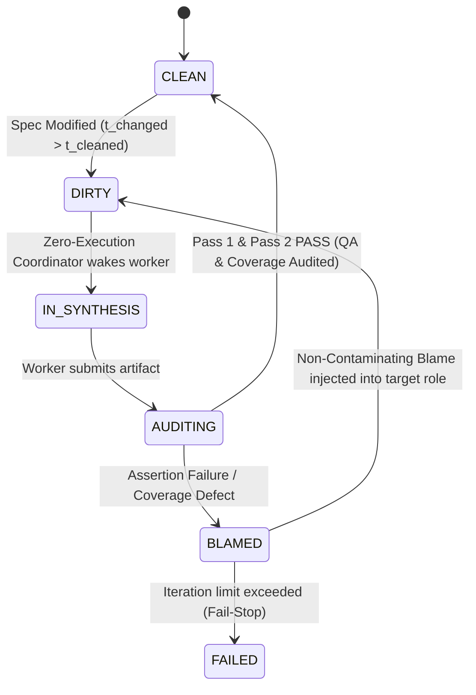

# Design Document: Pushing General-Purpose Languages to the Background via Epistemic Specification and Primal-Dual Certified Synthesis

**Target Venue:** ACM SIGPLAN Conference on Programming Language Design and Implementation (PLDI)  
**Track:** Research Track (Language Design, Program Synthesis, Formal Methods, Type Systems, Runtime Systems)  
**Status:** Authoritative Submission Design & Theoretical Specification  

---

## 1. Executive Summary & Research Thesis

### 1.1 The Grand Vision: Programming Languages as Ephemeral Bytecode
For over seven decades, general-purpose programming languages (GPLs—such as C++, Java, Rust, and Python) have served as the authoritative human medium for expressing computation, software architecture, and operational intent. Developers author, debug, review, and maintain GPL source code directly; compiler toolchains treat this source code as the ground truth from which machine bytecode or native binaries are derived.

The emergence of Large Language Models (LLMs) has sparked widespread interest in synthesizing programs from natural language specifications. However, contemporary approaches to AI-assisted software engineering ("vibe coding", agentic software engineers, copilot completions) preserve the traditional paradigm: **human developers must inspect, maintain, and debug the synthesized GPL source code**. This status quo persists because natural language is inherently ambiguous, and neural models are stochastic, hallucination-prone, and lack sound semantic guarantees. When LLM-generated code fails, developers are forced back into the low-level mechanics of the target programming language to diagnose runtime failures, patch subtle edge-case bugs, and resolve specification drift.

**The Cleanroom Thesis:**  
> *General-purpose programming languages can be pushed entirely to the background—demoted to disposable, machine-synthesized intermediate representations (IR/bytecode) that humans never author or maintain—if and only if program synthesis is governed by:*
> 1. *A formal **Typed Interface Specification Model** ($S = \langle \Sigma, \mathcal{C} \rangle$) combining explicit API type signatures with fine-grained, bi-conditional behavioral contracts;*
> 2. *A **Primal-Dual Certified Synthesis Model** that formulates synthesis as a zero-sum certificate game between isolated, untrusted neural oracles under double hermetic confinement ($\mathcal{I}(P; V \mid S) = 0$ and $\mathcal{I}(\{P, V\}; \text{Internet} \mid S) = 0$); and*
> 3. *A deterministic, closed-world **Verification Gateway** with fine-grained blame attribution that guarantees semantic preservation before target execution.*

Under Cleanroom, the human developer works within typed interface specifications and behavioral contracts. The target GPL code and its corresponding verification certifiers are synthesized ephemerally by isolated model instances, cross-validated via dual-blind execution gates, and discarded or re-synthesized automatically whenever specifications evolve.

```
TRADITIONAL SE vs. THE CLEANROOM COMPILATION PARADIGM

Traditional Software Engineering & "AI Pair Programming":
┌───────────────────────┐       Manual Prompting       ┌───────────────────────┐
│ Ambiguous Natural     │ ───────────────────────────> │ GPL Source Code       │ ◄── PRIMARY HUMAN ARTIFACT
│ Language Intent / PRD │                              │ (Python, C++, Rust)   │     (Manual debugging & maintenance)
└───────────────────────┘                              └───────────────────────┘

The Cleanroom Synthesis-as-Compilation Paradigm:
┌─────────────────────────────────────────────────────────────────────────────┐
│ Specification S = ⟨Σ_API, C_req⟩                                            │ ◄── PRIMARY SPECIFICATION ARTIFACT
│ - Typed API Signatures (Classes, Functions, Explicit Types)                 │     (Authoritative Source of Truth)
│ - Behavioral Contracts (Bi-conditional Pre/Post Invariants [s+], [s-])      │
└─────────────────────────────────────────────────────────────────────────────┘
                                       │
        ┌──────────────────────────────┴──────────────────────────────┐
        │ PRIMAL-DUAL SYNTHESIS BOUNDARY                              │
        │ (Kernel-Enforced Double Hermetic Confinement: No Web, No Leakage)
        ▼ (Primal Oracle: S)                                          ▼ (Dual Oracle: D)
  Target Library Code (P)                                     Contract Test Suite (V)
  [EPHEMERAL BYTECODE]                                        [INDEPENDENT CERTIFIER]
  (chmod 444; no tests; no internet)                          (chmod 444; no lib; no internet)
        │                                                             │
        └──────────────────────────────┬──────────────────────────────┘
                                       │ Deterministic Verification Gate
                                       ▼
  Hermetic Execution: P satisfies V ∧ 100% AST Statement Coverage ∧ TypeCheck(P, Σ) = OK
  (Target code certified into bytecode cache or rejected with Blame Attribution)
```

> *Scope Note on Specification Derivation:* In full engineering environments, typed specifications $S$ may be authored directly or elaborated from higher-level architectural prose and planning canvases. For the formal semantics, verification guarantees, and empirical evaluations of this paper, we treat the low-level typed specification $S$ as the canonical, authoritative source of truth.

### 1.2 The Human Developer: Specification Custodian and Reviewer
In a paradigm where programming language code is demoted to ephemeral intermediate bytecode, what is the role of the human developer? Human engineers are not eliminated; rather, their cognitive labor is elevated from low-level mechanical debugging to architectural curation:

1. **Specification Authorship & Review**: Human developers author and review typed interface specifications ($S = \langle \Sigma, \mathcal{C} \rangle$). Pull requests in Cleanroom consist exclusively of specification and contract diffs.
2. **Reviewing Mined Edge Cases**: When the compiler static-analyzes synthesized code branches and mines candidate edge cases (Section 2.6.4), the human reviews these candidates and decides whether to promote them into binding specification contracts.
3. **Arbitrating Non-Convergence Diagnostics**: When the verification gate halts with blame (Section 2.9), human developers review diagnostic traces pointing to contradictory contracts or unsatisfied requirements, resolving specification flaws at the source.
4. **Zero Code Inspection**: Human developers never inspect, review, or debug synthesized target code (`lib/*.py`) or verification certifiers (`tests/*_test.py`). Target code is strictly a compiler artifact.

### 1.3 Theoretical Framing: Depth Over Empirical Heuristics
A rigorous PL submission cannot simply report empirical benchmark scores on SWE-bench or HumanEval; it must address fundamental questions of programming language design, formal semantics, and rigorous verification:

| Dimension | AI / Empirical SE Focus (Reject for PLDI) | Cleanroom PLDI Focus (Core PL Contribution) |
| :--- | :--- | :--- |
| **Source of Truth** | Treating code as truth; prompt engineering to generate code directly. | **Language Design**: Formalizing a multi-stage specification calculus where literate prose elaborates into factored atomic contracts and constructive epistemic DAGs. |
| **Synthesis Oracle** | Evaluating model accuracy ($Pass@k$) and prompt variants. | **Soundness Bounding**: Defining a formal framework that guarantees deterministic safety and contract adherence despite using untrusted, non-deterministic neural oracles. |
| **Dual Generation** | Heuristic N-version voting (Avizienis 1985). | **Game-Theoretic & Information-Theoretic Confinement**: Formulating synthesis as a primal-dual game between independent oracles under provable zero information leakage ($\mathcal{I}(P; V \mid S) = 0$). |
| **Verification Gate** | Running a linter and checking if tests pass mechanically. | **Multi-Pass Compilation & Verification Calculus**: Closed-world AST linking, MRO contract inheritance, AST-normalized statement coverage, and formal blame attribution state transitions. |
| **Failure Handling** | Retrying prompts until the model stops making syntax errors. | **Language-Level Blame Semantics**: Backtracking in the topological dependency graph and isolating dirty state invalidation to upstream specification components. |

---

## 2. Theoretical Foundations: Beyond Classical N-Version Programming

### 2.1 The Fallacy of Naive N-Version Synthesis
N-Version Programming (NVP), introduced by Avizienis (1985), proposed building fault-tolerant critical systems by having independent human teams implement identical specifications, executing all versions concurrently, and voting on outputs at runtime. In 1986, Knight and Leveson published their seminal empirical study disproving NVP's foundational independence assumption: **statistically correlated coincident errors occurred across independent teams**. The root cause was twofold:
1. **Cognitive Correlation**: Human programmers share common cognitive heuristics and blind spots when reasoning about complex edge cases.
2. **Specification Ambiguity**: Informal specifications contain semantic gaps, linguistic ambiguities, and unstated assumptions that all teams misinterpret in identical ways.

Attempting to revive N-version programming simply by querying multiple LLMs or prompting the same LLM $N$ times repeats this fundamental fallacy:
- Foundation models are trained on overlapping corpora of open-source code and share identical inductive priors ($\mathcal{D}_\theta$).
- If an agent synthesizes an implementation and its verification tests in the same conversational context window, it falls into **tautological self-affirmation**: the test suite tests the model's mistaken mental model rather than the true specification.
- If the specification contains compound natural language sentences, models universally satisfy the common case and silently omit edge-case invariants.

### 2.2 The Root Cause of Knight & Leveson: Accidental Agreement via Directional (One-Sided) Contracts
A critical subsequent insight into the Knight & Leveson phenomenon in software testing theory is the mechanism of **accidental agreement** (or coincident correctness) at domain boundaries:
- In classical specifications, contracts are typically formulated as directional implications:
  $$\Phi(x) \implies \Psi(x)$$
  (e.g., *"If all nodes are clean in graph storage, report complete."*)
- In this formulation, the behavior of the system on the complementary subspace $\neg \Phi(x)$ (*when at least one node is dirty*) is left implicit or under-specified.
- Under directional specifications, independent implementations routinely adopt the easiest default behavior on the un-specified complement (e.g., returning `None`, executing a no-op, or returning a default boolean).
- Similarly, independently written test oracles predominantly probe the positive domain $\Phi(x)$ where the capability is activated.
- **The Result**: The implementation and the test suite display **accidental agreement**—both pass green on tests sampled from $\Phi(x)$, while the implementation is fundamentally broken across the entire complement $\neg \Phi(x)$!

In neural program synthesis, accidental agreement is dramatically magnified because foundation models share statistical default tendencies (e.g., returning early `None` or failing to raise specific domain exceptions).

### 2.3 The Bipartite Boundary Principle: Focusing on Both Sides of Edge Cases
Cleanroom circumvents the Knight & Leveson trap by establishing the **Bipartite Boundary Principle**:

> **The Bipartite Boundary Principle**: *No contract or boundary condition is legally specified unless both sides of the boundary partition are explicitly, exhaustively, and symmetrically defined.*

Mathematically, let $\mathcal{D}$ be the input/state domain. Any condition $C(x)$ partitions $\mathcal{D}$ into two disjoint, exhaustive sub-domains:
$$\mathcal{D} = \mathcal{D}^+ \uplus \mathcal{D}^- \quad \text{where } \mathcal{D}^+ = \{x \in \mathcal{D} \mid C(x)\}, \quad \mathcal{D}^- = \{x \in \mathcal{D} \mid \neg C(x)\}$$

Rather than directional implications ($C(x) \implies \text{Success}$), Cleanroom contracts enforce **bi-conditional semantics**:
$$C(x) \iff \text{Output}(x) = Y^+$$
which decomposes into two symmetric, atomic obligations:
1. **Positive Boundary Contract ($[s^+]$)**: $\forall x \in \mathcal{D}^+, \ \text{Exec}(x) = Y^+$
2. **Negative Boundary Contract ($[s^-]$)**: $\forall x \in \mathcal{D}^-, \ \text{Exec}(x) = Y^- \quad (\text{or } \mathbf{Raise}(\text{DomainException}))$

In Cleanroom planning canvases, this is enforced by the canonical linguistic form:
$$\text{"\dots holds if, but only if, \dots"}$$
Crucially, Cleanroom's verification gates demand that test certifiers witness **both sides** of the partition ($\mathcal{D}^+$ and $\mathcal{D}^-$) with explicit assertions (e.g. `assertTrue` and `assertFalse`). Paired with AST-normalized 100% statement coverage, an implementation branching on $C(x)$ cannot pass verification unless the test certifier exercises and validates both branches, mathematically eliminating accidental agreement.

### 2.4 Primal-Dual Synthesis as a Zero-Sum Certificate Game

Cleanroom synthesizes these principles not through runtime voting among redundant implementations, but as a **Primal-Dual Certificate Game** between untrusted neural oracles under kernel-enforced information confinement:

$$\max_{P \in \mathcal{L}_{IR}} \min_{V \in \mathcal{V}_{cert}} \mathcal{U}(P, V; S)$$

- **Primal Player (Synthesizer $\mathcal{S}$)**: Given specification $S$, synthesizes an executable program $P \in \mathcal{L}_{IR}$ that attempts to witness the existence of a model satisfying $S$.
- **Dual Player (Certifier $\mathcal{D}$)**: Given specification $S$, synthesizes an adversarial verification oracle $V \in \mathcal{V}_{cert}$ (a test suite equipped with assertions and pre/post-conditions) designed to expose counterexamples or contract violations in any candidate implementation.
- **Payoff Function $\mathcal{U}(P, V; S)$**:
  $$\mathcal{U}(P, V; S) = \begin{cases} 
  +1 & \text{if } V(P) = \mathbf{PASS} \ \land \ \mathbf{Cov}(P, V) = 100\% \ \land \ \mathbf{TypeCheck}(P, S) = \mathbf{OK} \\
  -1 & \text{otherwise}
  \end{cases}$$

```
                THE PRIMAL-DUAL CERTIFICATE GAME
                
                      Specification S ∈ L_spec
               (Atomic Bipartite Contracts [s+], [s-])
                                │
        ┌───────────────────────┴───────────────────────┐
        ▼ (Primal Oracle: S)                            ▼ (Dual Oracle: D)
  Candidate Program                               Independent Certifier
     P ∈ L_IR                                        V ∈ V_cert
  (chmod 444; no tests)                           (chmod 444; no lib)
  (Implements D+ and D-)                          (Asserts D+ and D-)
        │                                               │
        └───────────────────────┬───────────────────────┘
                                ▼
                   Verification Gateway (Pass 2)
                   - Dynamic Execution: V(P) = PASS
                   - AST Statement Coverage: Cov(P, V) = 100%
                   - Static Typing: TypeCheck(P, S) = OK
                                │
                 ┌──────────────┴──────────────┐
                 ▼                             ▼
         [CERTIFIED BYTECODE]          [BLAME ATTRIBUTION]
         Accepted into Cache           S or D or S Blamed
```

**Theorem 1 (Elimination of Tautological Fixed Points and Accidental Agreement).**  
Let $\mathcal{O}_{\mathcal{S}}$ and $\mathcal{O}_{\mathcal{D}}$ be two untrusted stochastic synthesis oracles. Let $\mathcal{E}$ be the event that candidate program $P$ contains an ungrounded semantic defect $\delta \neq \emptyset$ ($P \not\models S$), yet certifier $V$ passes $P$ ($V(P) = \mathbf{PASS}$).
1. Under joint conversational synthesis (where $P$ and $V$ are generated in the same context window), the mutual information $\mathcal{I}(P; V \mid S) > 0$. The probability of an undetected defect escaping is lower-bounded by the model's self-affirmation bias:
   $$P_{\text{joint}}(\mathcal{E}) \ge \gamma_{\text{self}} > 0$$
2. Under Cleanroom's physically isolated Primal-Dual synthesis, the communication channel between $\mathcal{S}$ and $\mathcal{D}$ is closed, giving $\mathcal{I}(P; V \mid S) = 0$. The escape probability factors into the conditional product of independent error distributions:
   $$P_{\text{dual}}(\mathcal{E}) = \sum_{\delta \in \Delta} P(\mathcal{S} \text{ emits defect } \delta \mid S) \cdot P(\mathcal{D} \text{ accepts defect } \delta \mid S)$$
3. Furthermore, when contracts enforce the Bipartite Boundary Principle over edge cases and $V$ satisfies AST-normalized statement coverage ($\mathbf{Cov}(P, V) = 100\%$), the term $P(\mathcal{D} \text{ accepts defect } \delta \mid S)$ is bounded to zero for all boundary mutations, eliminating accidental agreement.

*Proof Sketch:* When $\mathcal{I}(P; V \mid S) = 0$, $P$ and $V$ are conditionally independent given $S$. For any boundary defect $\delta$ (e.g. off-by-one or missing check on $\mathcal{D}^-$) to escape, $V$ must omit testing $\mathcal{D}^-$. However, $P$'s implementation must branch to handle both $[s^+]$ and $[s^-]$ to avoid static type or syntax deadlocks. If $V$ only tests $\mathcal{D}^+$, the basic block in $P$ handling $\mathcal{D}^-$ remains un-executed, yielding $\mathbf{Cov}(P, V) < 100\%$. The verification gateway rejects the candidate. Hence, defect $\delta$ cannot escape. $\blacksquare$

#### 2.4.1 Double Hermetic Confinement: Anti-Cheating & Starving Model Weight Reliance
To preserve the mathematical validity of the Primal-Dual game, Cleanroom enforces **Double Hermetic Confinement**:

1. **Physical Anti-Cheating Invariants (Air-Gapped Sandboxing)**:
   - Untrusted neural agents must not be allowed to cheat by searching for reference implementations or existing tests online:
     $$\mathcal{I}(P; \text{Internet} \mid S) = 0 \quad \text{and} \quad \mathcal{I}(V; \text{Internet} \mid S) = 0$$
   - Agents run in strictly air-gapped sandboxes with **no web access, no RAG, and no external documentation lookup**.
   - Agents cannot inspect sibling workspaces: $\mathcal{S}$ cannot access $W_{test}$, and $\mathcal{D}$ cannot access $W_{lib}$.
2. **Minimizing Reliance on Pre-Trained Model Weights**:
   - When a specification is underspecified or informal, neural models naturally fall back to their internal pre-training weights ($\mathcal{D}_\theta$).
   - This introduces the risk of **coincident hallucination**: both $\mathcal{S}$ and $\mathcal{D}$ might rely on the same common GitHub naming conventions or unspoken language defaults, leading them to agree on an uncontracted, unintended behavior.
   - To starve the model's reliance on weights, Cleanroom mandates that specifications be **maximally explicit**:
     - *Typed Interface Signatures ($\Sigma$)*: Explicit class names, method signatures, parameter names, type annotations, and return types. This guarantees that $\mathcal{S}$ and $\mathcal{D}$ agree on the API by construction, preventing spurious linking errors.
     - *Exhaustive Boundary Contracts ($\mathcal{C}$)*: Explicit pre-conditions, post-conditions, and bi-conditional partitions ($C(x) \iff \text{Post}(x)$).
   - By making the specification fully ground the system's syntax and semantics, the model's degrees of freedom are bounded, reducing reliance on training-set heuristics to near zero.
3. **The Contaminated Auditor & Non-Prescriptive Blame Invariant**:
   - The verification gateway/auditor has access to both $P$ and $V$, executes $V(P)$, and evaluates statement coverage. Consequently, the auditor's internal state is an epistemic mixture of both implementations ($\mathcal{I}(\text{Auditor}; \{P, V\}) > 0$).
   - **The Auditor is a Contaminated Source**: If the auditor provides prescriptive repair advice or quotes code/assertions across agents, it acts as an illegal information conduit, fatally collapsing $\mathcal{I}(P; V \mid S) = 0$.
   - *The Invariant*: Blame feedback must be strictly non-prescriptive, anchored exclusively in specification $S = \langle \Sigma, \mathcal{C} \rangle$, providing vague directional location (function/method name) without ever dictating implementation solutions or leaking cross-agent artifacts.

### 2.5 Modularity & Compositional Soundness: Why Unit Tests Merge into Integration Without Integration Tests

#### 2.5.1 The Modularity Mandate: Fine-Grained Units (< 500 LOC)
Cleanroom intentionally constrains implementation modules to be small—strictly under 500 lines of code, and typically under 250 LOC.
- **The Rationale**: This constraint is **not** because coincident error suppression fails on large modules, but because **fine-grained modularity makes the state space and boundary partitions humanly and neurally tractable to identify, factor, and comprehensively verify**.
- In a 5,000 LOC monolithic system, the combinatorial explosion of internal execution paths creates an intractably large boundary surface area. Neural models inevitably overlook subtle corner cases, and human specification authors struggle to formulate exhaustive bi-conditional partitions.
- By decomposing software into small, highly cohesive units (< 500 LOC), each component manages a compact contract footprint (typically 5 to 15 atomic contracts). Edge cases are obvious, boundary conditions are binary and clean, and bipartite test assertions can exhaustively cover both $\mathcal{D}^+$ and $\mathcal{D}^-$.

#### 2.5.2 The "Unit Test Merging" Paradox
In traditional software engineering, high modularity introduces a notorious liability: **unit tests pass against mocks, but the system crashes when components are integrated**. Consequently, conventional software development relies heavily on end-to-end integration tests.
Why do traditional unit tests fail to guarantee integrated correctness?
Because in conventional programming:
1. **Interfaces are leaky abstractions**: Developers peek into dependency implementations (`B.py`) and write code in `A.py` that relies on uncontracted implementation quirks, caching behavior, mutable internal state, or undocumented side-effects.
2. **Mock Drift**: Unit tests for $A$ use handcrafted mocks that reflect the test author's optimistic assumptions about $B$, rather than $B$'s actual behavior.

#### 2.5.3 Why Dedicated Integration Tests are Unnecessary in Cleanroom
Cleanroom solves the integration problem through **Contract-Bounded Compositional Verification**:
1. **Physical Prohibition of Implementation Peeking**:
   When $A$ depends on $B$, $A$'s implementation workspace ($W_{lib}^A$) and test workspace ($W_{test}^A$) are physically prohibited from seeing $B$'s implementation (`lib/B.py`). They receive strictly $B$'s typed interface stubs and contracts ($S_B = \langle \Sigma_B, \mathcal{C}_B \rangle$).
2. **The Impossibility of Writing Around Underspecified Dependencies**:
   Suppose $A$ requires a specific behavior from $B$, but $B$'s interface contract does not specify it:
   - *Can $A$'s agents peek into $B$'s source code?* **No, $B$'s implementation is physically absent or read-only stubbed.**
   - *Could $A$'s agents attempt to "write around it" by guessing behavior based on API naming alone?*
     **If they guess based on API naming, the system cannot converge:**
     - Because $A$'s implementation oracle $\mathcal{S}_A$ and certifier $\mathcal{D}_A$ are physically isolated ($\mathcal{I}(L_A; T_A \mid \text{Spec}) = 0$), their independent guesses based on loose naming will diverge immediately ($L_A$ assumes `None`, while $T_A$ assumes raising a domain exception). $T_A(L_A)$ fails immediately at verification!
     - Static type checking flags missing methods or incompatible signatures.
     - **The Only Resolution**: The developer must modify $B$'s specification to explicitly add the required typed contract. This triggers Cleanroom's dependency engine: $B$ is marked $\mathbf{DIRTY}$, re-synthesized, verified, and certified. Once certified, $B$ exports the new contract, enabling $A$ to compile legally.
3. **Assume-Guarantee Compositional Soundness**:
   Because:
   - $B$ is certified to satisfy its contracts: $\models B \text{ sat } \mathcal{C}_B$;
   - $A$ is verified against $B$'s interface contracts: $\mathcal{C}_B \models A \text{ sat } \mathcal{C}_A$; and
   - $A$ is physically prevented from depending on uncontracted implementation details of $B$ ($\mathcal{I}(A; \text{impl}(B) \mid \text{spec}(B)) = 0$),
   the classical Assume-Guarantee Rule (Pnueli, Clarke) holds unconditionally:
   $$\frac{\models B \text{ sat } \mathcal{C}_B \qquad \mathcal{C}_B \models A \text{ sat } \mathcal{C}_A}{\models (A \parallel B) \text{ sat } \mathcal{C}_A \land \mathcal{C}_B}$$
   By induction over the acyclic dependency DAG, **every component's unit verification results soundly merge into whole-system integrated correctness without requiring dedicated whole-program integration tests**.

### 2.6 The Edge-Case Identification Problem: Escaping the "CUJ Trap" and the Limits of Code Coverage

#### 2.6.1 The "CUJ Trap" in Neural Program Synthesis
Large Language Models exhibit a strong statistical bias toward the mode of their training distributions. When prompted to author specifications, implementations, or test suites, models naturally degenerate into **Critical User Journeys (CUJs)**—the common, happy-path flows that occur with high frequency in public software repositories.
For example, in a DAG scheduling module, an LLM will readily generate contracts and tests for:
- Constructing a linear 3-node dependency chain and advancing nodes from dirty to clean;
- Querying a valid batch within normal limits.

However, the model routinely fails to hypothesize or test the critical boundary edge cases:
- *What happens when a self-loop cycle ($A \to A$) or transitive cycle ($A \to B \to A$) is set as target?*
- *What happens when the batch size is configured to 0 or negative numbers?*
- *What happens when an iteration limit is exceeded on the exact boundary turn ($N$ vs $N+1$)?*
- *What happens when two nodes share the same role tier precedence but have identical unit addresses?*

#### 2.6.2 The Code Coverage Illusion: Why 100% Statement Coverage is Insufficient
A pervasive assumption in software engineering is that high code coverage guarantees edge-case testing. Cleanroom's toolchain indeed enforces 100% normalized statement coverage at Pass 2. However, from a formal PL perspective:
> **The Code Coverage Illusion**: *Code coverage is strictly an implementation-relative metric. It measures what statements were written, but is completely blind to missing code (un-written branches, omitted invariants, and unhandled edge cases).*

If the synthesized implementation completely omits the boundary check:
```python
# OMITTED CHECK: if batch_size <= 0: raise ValueError(...)
```
then that conditional statement does not exist in the Abstract Syntax Tree! The test certifier can execute 100% of the statements present in the implementation without ever probing the boundary. Both the implementation and the test certifier remain happily in **accidental agreement** within the CUJ subspace, while the software remains broken at its boundaries.

#### 2.6.3 Cleanroom's 5-Tier Defense for Systematic Edge-Case Identification
Cleanroom addresses the edge-case identification problem not through stochastic prompting, but through language-level constraints, static extraction, and adversarial verification mechanisms:

```
┌─────────────────────────────────────────────────────────────────────────────┐
│              CLEANROOM'S 5-TIER EDGE-CASE IDENTIFICATION DEFENSE           │
├─────────────────────────────────────────────────────────────────────────────┤
│                                                                             │
│  Layer 1: The Bipartite Partition Mandate (Planning Level)                  │
│  - "holds if, but only if, ..." quantifier forces dual [s+] and [s-] slugs. │
│  - spec_qa rejects any contract stating a condition without its complement. │
│                                                                             │
│  Layer 2: Orthogonal Boundary Dimension Probing (Type Level)                │
│  - Systematic boundary enumeration across 4 canonical dimensions:           │
│    1. Cardinality (0, 1, K_max, K_max + 1, ∞)                               │
│    2. Topology/Ordering (sorted, reverse, duplicate, cyclic, disconnected)  │
│    3. Nullity/Sentinels (None, empty, malformed, out-of-bounds)             │
│    4. Operational States (uninitialized, active, empty, terminal)           │
│                                                                             │
│  Layer 3: Branch-to-Specification Invariant Mining (AST Level)              │
│  - Static extraction of defensive code branches in synthesized lib.py.      │
│  - Elevates uncontracted branches into candidate bipartite specifications.  │
│  - Human developer reviews and promotes mined edge cases into binding specs.│
│                                                                             │
│  Layer 4: Closed-World Variant Exhaustiveness (LLS Stub Level)              │
│  - Sum types (@variant) enforce compiler-level exhaustive pattern matching. │
│  - Pass 1 Static Validation rejects omitted variants.                       │
│                                                                             │
│  Layer 5: Adversarial Mutation Inoculation with Mutmut (Pass 2 Level)       │
│  - Injects AST boundary mutants via mutmut (< to <=, defaults, logic shifts) │
│  - If a mutant survives, the test suite is blamed for missing edge-case     │
│    witnessing, forcing the creation of missing assertions.                  │
│                                                                             │
└─────────────────────────────────────────────────────────────────────────────┘
```

1. **The Bipartite Partition Mandate**:
   At the specification level, any conditional requirement must be stated bi-conditionally (`"holds if, but only if, ..."`). The `spec_qa` arbiter parses the AST of planning contracts and flags any contract that introduces an activation condition without an explicit complementary obligation for its negation.
2. **Orthogonal Boundary Dimension Probing**:
   Edge cases do not arise randomly; they manifest along universal computational dimensions:
   - *Cardinality*: Collections and batches must be probed at $\{0, 1, K_{\text{max}}, K_{\text{max}} + 1\}$.
   - *Topology*: Graphs must be probed with $\{ \emptyset, \text{tree}, \text{diamond}, \text{self-loop}, \text{multi-cycle} \}$.
   - *Extrema*: Numeric boundaries must be probed at $\{ \text{min}, \text{min}-1, \text{max}, \text{max}+1 \}$.
   - *Operational State*: Services must be probed in uninitialized, empty, and terminal phases.
   In fine-grained modules (< 500 LOC), the parameter space per operation is small ($\le 3$ arguments), making this orthogonal grid finite and fully enumerable.
3. **Closed-World Variant Exhaustiveness**:
   Domain sum-types are decorated with `@variant` and registered in closed hierarchies. Pass 1 static validation verifies exhaustive dispatch, preventing the neural synthesizer from ignoring uncommon variant states.
4. **Adversarial Mutation Inoculation via `mutmut`**:
   To defeat the "Code Coverage Illusion", Pass 2 does not rely solely on statement coverage. It integrates **`mutmut`**, the established Python mutation testing framework, to systematically inject first-order AST boundary mutants into the candidate implementation $P$:
   - *Relational boundary operators*: `<` to `<=`, `>` to `>=`, `==` to `!=`;
   - *Logical operators*: `and` to `or`, `not` elimination;
   - *Boundary numbers and sentinels*: `0` to `1`, `1` to `0`, off-by-one index shifts, `None` injections;
   - *Exception erasures*: dropping `raise ValueError(...)` statements.
   If test suite $V$ passes green over a `mutmut`-generated boundary mutant ($V(P_{\text{mutmut}}) = \mathbf{PASS}$), this surviving mutant serves as deterministic proof that the test suite leaves an edge-case boundary unconstrained. The verification gateway rejects the certifier with a **Boundary Defect Escape Blame**, requiring the test author to witness the edge case explicitly.

   **Why AST Mutation Testing (`mutmut`) Beats SMT and Property Fuzzing for Systems Software**:  
   A critical design decision in Cleanroom is relying on AST mutation testing rather than SMT-based concolic execution (e.g. `CrossHair`, `PyExZ3`) or property-based input fuzzing (e.g. `Hypothesis`):
   - *The Limits of SMT Concolic Execution (CrossHair/Z3)*: SMT solvers require encoding program paths into mathematical first-order logic. While highly effective for pure numerical algorithms, bitvectors, and arithmetic transforms, SMT solvers break down on real-world, object-oriented systems software (such as Cleanroom's DAG scheduler and workspace managers). Systems code deals with stateful service registries (`get_singleton(...)`), string slicing (`split(":")`), complex graph dictionaries of sets, and subprocess/filesystem operations. Z3 chokes on symbolic unrolling of such structures, leading to symbolic state explosion and timeouts.
   - *The Friction of Property-Based Testing (Hypothesis)*: Property-based tools mutate *inputs*. Generating valid, structured inputs for complex stateful systems (e.g., generating a coherent acyclic `DagStorage` graph with mock role tiers) requires authoring massive `@st.composite` strategy generators that are often more complex than the implementation itself. Random fuzzing mostly produces malformed inputs that fail basic syntax parsing at the entrance, rather than probing subtle semantic edge cases.
   - *The Universal Domain-Agnostic Power of `mutmut`*: `mutmut` mutates the *program AST*, not the inputs. It operates directly on relational operators (`<` vs `<=`), cycle checks (`if role in visiting:` $\to$ `if False:`), state transitions (`dirty_nodes.discard(node)`), and boundary limits across any code—whether numeric, stateful, async, or file-based—with **zero SMT modeling, zero input generator scaffolding, and zero friction on systems code**.

#### 2.6.4 Mining Edge Cases from Implementation Code: The Branch-to-Specification Reflection Loop with Mutmut
A fundamental question in neural synthesis is: *Can we systematically discover edge cases by mining the implementation code and mutation surface itself?*

In practice, human developers and initial specifications often focus on Critical User Journeys (CUJs). When the primal synthesizer $\mathcal{S}$ is tasked with implementing these CUJs, Large Language Models—trained on millions of defensive programming idioms in open-source repositories—naturally synthesize defensive guard clauses, sanity checks, and exception branches (e.g., `if not items: return ...`, `if batch_size <= 0: raise ValueError`, `except KeyError:`).

Cleanroom exploits both this neural defensive habit and **mutmut mutation analysis** via the **Branch-to-Specification Reflection Loop**:
1. **Initial Synthesis & Baseline CUJ Coverage**: Primal synthesizer $\mathcal{S}$ synthesizes implementation $P$; dual certifier $\mathcal{D}$ synthesizes test suite $V_{\text{cuj}}$ exercising the primary user journeys to 100% statement coverage.
2. **Dual Edge-Case Detection (Static AST Mining + Mutmut Survival)**:
   - *Static Branch Extraction*: A deterministic AST extractor (`branch_miner.py`) inspects $P$'s AST and enumerates all conditional branch predicates $\mathcal{B}(P) = \{ c_1, c_2, \dots, c_m \}$.
   - *Dynamic Mutmut Inoculation*: `mutmut` runs against $P$ and $V_{\text{cuj}}$. Any mutant that survives ($V(P_{\text{mutmut}}) = \mathbf{PASS}$) uncovers an unconstrained edge-case boundary (e.g., boundary condition mutated without triggering a test assertion failure).
3. **Specification Slug Reconciliation**: For each AST branch condition $c_k$ and surviving `mutmut` mutant $m_j$, the extractor checks whether the condition corresponds to an existing atomic contract slug in $S$ ($[s_i]$). Any branch or surviving mutant without a corresponding specification contract represents an **implicit, uncontracted edge case**.
4. **Translating Edge Cases Back to Specification Language**: An automated reflection agent inspects the uncontracted branch and the surviving `mutmut` mutation, and translates them into a formal, implementation-agnostic candidate **bipartite contract**:
   $$\langle [s_{\text{mined}}^+]: c_k(x) \implies \text{Post}^+(x), \quad [s_{\text{mined}}^-]: \neg c_k(x) \implies \text{Post}^-(x) \rangle$$
5. **Human Review & Promotion**: The candidate contract is presented to the human developer in the specification canvas:
   > *"Surviving Mutmut Boundary: `batch_size <= 0` mutated to `< 0` survives test suite. Promote to formal contract `[batch_size_positive]`?"*
   The human developer reviews and approves (or adjusts) the specification.
6. **Kernel-Enforced Confinement Preserved**: Crucially, this mechanism **does not violate information-flow isolation ($\mathcal{I}(P; V \mid S) = 0$)**. The test certifier never inspects $P$'s implementation code or internal diffs. It receives only the elevated, abstract specification contract in $S$. Once promoted, Pass 2's verification mandate forces the dual certifier to author explicit test witnesses for both branches ($[s_{\text{mined}}^+]$ and $[s_{\text{mined}}^-]$), driving `mutmut` surviving mutants to zero ($MS_{\text{boundary}} = 100\%$).

By combining static branch extraction with `mutmut` dynamic mutation survival, Cleanroom transforms implicit neural coding instincts into explicit, verifiable contracts.

---

### 2.7 The Historical Lineage: From IBM Cleanroom to Neural Dual-Blind Certification

To appreciate why Cleanroom achieves what classical software engineering could not, one must trace the historical lineage from Avizienis's N-Version Programming through Harlan Mills's IBM Cleanroom Software Engineering:

```
THE HISTORICAL EVOLUTION OF FAULT-TOLERANT SYNTHESIS & VERIFICATION

1. N-Version Programming (Avizienis 1985)
   ┌─────────────────────────────────────────────────────────────┐
   │ Spec ──┬──> Team 1 (Impl 1) ──┐                             │
   │        ├──> Team 2 (Impl 2) ──┼──> Runtime Majority Voting  │
   │        └──> Team 3 (Impl 3) ──┘    (Disproven: Knight 1986) │
   └─────────────────────────────────────────────────────────────┘
                                  │
                                  ▼
2. IBM Cleanroom Software Engineering (Mills, Dyer, Linger 1987)
   ┌─────────────────────────────────────────────────────────────┐
   │ Spec ──┬──> Development Team (Mental Box Proofs; NO RUNNING)│
   │        │                                                    │
   │        └──> Independent Test Team (Operational Profiles)    │
   │                               │                             │
   │             First Execution ──┴──> Statistical Certification│
   │             (Died: Human debugging addiction & labor costs) │
   └─────────────────────────────────────────────────────────────┘
                                  │
                                  ▼
3. Neural Dual-Blind Cleanroom (This Work)
   ┌─────────────────────────────────────────────────────────────┐
   │ Literate Spec & Factored Bipartite Contracts                │
   │        │                                                    │
   │        ├──> Primal Oracle S (chmod 444; no tests) ──> Code  │
   │        │                                              │     │
   │        └──> Dual Oracle D   (chmod 444; no code)  ──> Tests │
   │                                                       │     │
   │             Multi-Gate Deterministic Arbiters ◄───────┘     │
   │             (100% AST Coverage + Boundary Inoculation)      │
   │             (Succeeds: No human ego, $0.001 token costs,    │
   │              Bipartite edge cases, Assume-Guarantee Merge)  │
   └─────────────────────────────────────────────────────────────┘
```

#### 2.7.1 What Did IBM Cleanroom Actually Do?
In 1987, Harlan Mills, Michael Dyer, and Richard Linger at IBM Federal Systems Division introduced **Cleanroom Software Engineering**. Confronting the same cognitive traps and specification vulnerabilities that undermined N-version programming, IBM Cleanroom introduced a radical departure from conventional software development:
1. **Separation of Concerns via Independent Teams**: Rather than building multiple redundant functional implementations to vote at runtime (as in N-version programming), IBM Cleanroom built **one single software implementation**, but paired it with an **entirely independent certification test team**.
2. **Strict Prohibition of Developer Execution**: Developers were **strictly forbidden from compiling or executing their code**. Developers were required to verify their software entirely offline using formal mathematical reasoning, box-structured specifications, and stepwise mental correctness proofs.
3. **Independent Specification-Driven Certification**: The independent test team developed operational profile test suites directly from the specifications, without inspecting the implementation source code or consulting the development team. The software was compiled and executed **for the very first time** by the test team during certification.

#### 2.7.2 Why Human Cleanroom Failed
Despite achieving near-zero defect rates in mission-critical aerospace and defense projects, IBM Cleanroom was largely abandoned across the broader software industry. Its failure was not mathematical; it was **economic and psychological**:
- **Human Developer Psychology ("Debugging Addiction")**: Human software engineers overwhelmingly resisted the paradigm. The cognitive agony of writing hundreds of lines of code without being allowed to run a compiler or interactive debugger created extreme friction and burnout.
- **Prohibitive Human Labor Costs**: Maintaining an entirely separate, specialized team of certification engineers for every project doubled or tripled human engineering headcount.
- **Slow Communication Latency**: Iterating across the human organizational firewall when certification tests failed took days or weeks of formal bureaucratic handoffs.

#### 2.7.3 Why Neural Synthesis is Cleanroom's Natural Home
Large Language Models resolve every single obstacle that doomed human Cleanroom:
1. **Immunity to Debugging Addiction**: Neural models have no ego, no impatience, and no psychological craving for interactive terminal feedback. An LLM synthesizer is perfectly content generating a complete module directly from interface stubs and planning contracts without executing it.
2. **Zero Marginal Labor Cost**: Synthesizing an implementation and an independent certifier test suite costs pennies in model tokens and executes in seconds, completely erasing the economic barrier of maintaining two human engineering teams.
3. **Kernel-Enforced Firewalls**: Where human Cleanroom relied on organizational policy to keep developers and testers apart, modern operating systems enforce physical isolation (`chmod 444`, separate sibling workspace directories) with absolute mathematical confinement ($\mathcal{I}(P; V \mid S) = 0$).

---

### 2.8 The Primal-Dual Representation Asymmetry: Why Implementation + Certifier Beats Two Implementations

A critical theoretical question arises: *Why is generating one implementation and one independent test certifier fundamentally superior to generating two independent implementations (as in classical N-version programming)?*

The answer lies in **Representation Asymmetry** across the primal and dual spaces:

| Dimension | Two Implementations ($P_1, P_2$) | Implementation + Certifier ($P, V$) |
| :--- | :--- | :--- |
| **Mathematical Space** | Both operate in the **Primal Space**: computing constructive mappings $f_1, f_2 : X \to Y$. | Operates across **Primal-Dual Spaces**: $P$ computes $f : X \to Y$; $V$ asserts relational predicates $\mathcal{P} : X \times Y \to \mathbb{B}$. |
| **Cognitive / Prompt Framing** | Procedural/algorithmic control-flow generation ("How to compute the result"). | Procedural generation vs. Declarative verification ("What invariant must hold"). |
| **Error Independence** | **High Cognitive Correlation**: Both models query identical procedural priors in their pre-training distributions, producing identical edge-case bugs. | **Orthogonal Representation**: Invariant assertion activates disjoint syntactic, semantic, and reasoning pathways in the model, suppressing correlated blind spots. |
| **Oracle Problem** | **Unresolved**: To compare $P_1$ and $P_2$, an external system must still generate inputs and arbitrate differences. If both agree on a wrong answer, runtime voting fails silently. | **Resolved by Construction**: Certifier $V$ explicitly synthesizes concrete input/output witness pairs and boundary assertions derived directly from bi-conditional contract slugs. |

#### 2.8.1 Chain-of-Thought Dynamics and Task Asymmetry vs. Task Homogeneity
Modern foundation models rely heavily on Chain-of-Thought (CoT) reasoning, where internal generation explores multi-step analytical trajectories before synthesizing final code. This introduces a critical PL insight regarding coincident errors:

1. **The Fallacy of Identical Mistakes Under Chain of Thought**: Even when running at low temperature ($\tau \approx 0.0$ or $0.2$), models tasked with generative synthesis explore complex internal reasoning trajectories.
2. **Task Homogeneity Induces Correlated Failure**: When the same model (or two foundation models) is assigned the **same task**—synthesizing two implementations $P_1$ and $P_2$ from specification $S$—both CoT traces share an identical cognitive objective: *algorithmic state transformation*. Both traces query the same pre-training priors regarding procedural control-flow shortcuts, default return values, and edge-case assumptions. Consequently, their internal search trees frequently collapse into the same blind spots, reproducing Knight & Leveson's coincident error phenomenon.
3. **Task Asymmetry Eliminates Coincident Blind Spots**: In contrast, Cleanroom assigns the model to **two fundamentally asymmetric tasks**:
   - $\mathcal{S}$ (Synthesizer): Solves *constructive operational synthesis* ("How do I compute $Y$ from $X$?"). Its CoT trace explores variable bindings, control-flow branches, and data structure mutations.
   - $\mathcal{D}$ (Certifier): Solves *adversarial property verification* ("What relational invariant must hold between $X$ and $Y$, and what inputs would violate it?"). Its CoT trace explores domain boundaries, partition predicates ($\mathcal{D}^+, \mathcal{D}^-$), and counterexample witnesses.
4. **Disjoint Reasoning Trajectories**: Because the reasoning prompts, cognitive objectives, and output modalities are completely disjoint, the CoT search trajectories of $\mathcal{S}$ and $\mathcal{D}$ do not intersect in their failure modes. Even when executed on the exact same foundation model at low temperature, the probability of $\mathcal{S}$ making an algorithmic error on boundary $C(x)$ and $\mathcal{D}$ independently making the exact matching error in its property assertion is statistically negligible.

This constitutes a testable scientific hypothesis that we validate empirically in Section 5.2 (RQ1).

---

### 2.9 The Fail-Safe Invariant: Soundness vs. Non-Convergence under Flawed Specifications

A common critique of formal synthesis systems is: *"What if the human specification itself is wrong, incomplete, or ambiguous?"*

It is essential to bound the scope of our contribution: **Cleanroom does not claim to solve the philosophical problem of human intentionality, nor does it assume that human authors write perfect specifications.** Human intent can never be formally verified from nothing.

Instead, Cleanroom provides a foundational programming language guarantee:

> **The Fail-Safe Invariant**: *Any semantic flaw, inconsistency, or ambiguity in a specification results in deterministic **fail-stop non-convergence with diagnostic blame attribution**; it NEVER results in the silent synthesis and execution of an incorrect system.*

We categorize specification defects into three canonical failure modes:

```
┌─────────────────────────────────────────────────────────────────────────────┐
│                 SPECIFICATION DEFECT MODES & THE FAIL-SAFE INVARIANT         │
├─────────────────────────────────────────────────────────────────────────────┤
│                                                                             │
│  Defect Mode 1: Over-Constrained / Contradictory Specifications             │
│  - Spec demands mutually exclusive postconditions: ϕ_1 ∧ ϕ_2 = ⊥.           │
│  - Resolution: Primal synthesizer cannot satisfy dual certifier assertions; │
│    or static type system detects uninhabited types.                         │
│  - Outcome: FAIL-STOP with Specification Blame (Blame -> Plan).             │
│                                                                             │
│  Defect Mode 2: Ungrounded / Incomplete Dependency Specifications           │
│  - Contract requires capability not declared in dependency interface Σ_B.   │
│  - Resolution: Pass 1 (Static Specification Validation) audits interface     │
│    stubs Σ and Pyright flags missing symbols or incompatible signatures.     │
│  - Outcome: STATIC REFUSAL (UNDEFINED_SYMBOL or TYPE_MISMATCH). Zero code   │
│    generated.                                                               │
│                                                                             │
│  Defect Mode 3: Under-Constrained / Ambiguous Specifications                │
│  - Spec leaves boundary condition unconstrained or directional (one-sided). │
│  - Resolution: Under I(P; V | S) = 0, independent primal and dual oracles   │
│    sample divergent default behaviors; or Pass 2 statement coverage         │
│    flags un-executed branches.                                              │
│  - Outcome: FAIL-STOP with Blame Attribution at Pass 2.                     │
│                                                                             │
│  CORE SAFETY PROPERTY:                                                      │
│  Silent Defect Escape Rate = 0.0%                                           │
│  Cleanroom compiles to certified code OR halts with diagnostic blame.       │
│                                                                             │
└─────────────────────────────────────────────────────────────────────────────┘
```

1. **Over-Constrained Specifications**: If a human authors contradictory contracts (e.g., asserting that an empty batch both returns an empty list and raises `ValueError`), the dual certifier will assert the exception while the primal implementation attempts to return the list (or vice versa). Pass 2 fails immediately, halting the pipeline and attributing blame to the conflicting specification slugs.
2. **Ungrounded Specifications**: If a module requires an ambient capability or collaborator method that is not formally declared by an imported component's interface stub $\Sigma_B$, Pass 1 (Static Specification Validation) detects the missing or incompatible symbol via hermetic type analysis. The compilation pipeline statically halts *before any target GPL code or tests are even synthesized*.
3. **Under-Constrained Specifications**: If a specification omits behavior on an edge-case boundary, the primal implementation and dual certifier operate under strict physical information confinement ($\mathcal{I}(P; V \mid S) = 0$). Because they cannot coordinate or observe each other's guesses, their independent completions diverge on the unconstrained subspace, or the synthesized branching logic fails AST-normalized statement coverage ($\mathbf{Cov} < 100\%$). Pass 2 rejects the pair, demanding that the author refine the contract into a bi-conditional partition.
4. **Plumbing and Resource Management**: Architectural plumbing (such as resource cleanup, object lifecycles, and initialization order) is treated simply as standard interface contracts. If an LLM synthesizer misconfigures plumbing or leaks state, it violates exported interface invariants or preconditions. Under Cleanroom, this terminates in **non-convergence**, never in an incorrect system silently executing in production.

**The PL Analogy:** Just as a sound static type system (such as Rust or Standard ML) does not guarantee that a developer implemented Quicksort instead of Mergesort, it **does** guarantee type preservation and progress (well-typed programs do not go wrong). In exactly the same sense, Cleanroom does not claim that the human wrote what was in their head; it guarantees that **if the pipeline converges, the target code soundly and comprehensively satisfies the written contracts—and if the contracts are flawed, the pipeline halts fail-stop with blame**.

---

## 3. The Typed Specification Model & Verification Calculus

We formalize Cleanroom through a concise, typed specification model where low-level typed interface stubs and bi-conditional behavioral contracts serve as the canonical source of truth.

### 3.1 Syntax of Low-Level Specifications ($S$)

A specification unit $S = \langle \Sigma, \mathcal{C} \rangle$ consists of two formal components:

```
(Types & Identifiers)
  x, y, f, C    ::= Symbol                           (Variables, Functions, Classes)
  s             ::= [a-z0-9_]+                       (Atomic Semantic Contract Slug)
  \tau          ::= BaseType | C | \tau \to \tau | Poly[C](\tau)

(Typed Interface Signature: \Sigma)
  \Sigma        ::= Module(x, imports, Decls)
  Decl          ::= @singleton_type ClassDef(C, Body)
                  | @poly_type ClassDef(C, Body)
                  | @data_type ClassDef(C, Body)
                  | @variant ClassDef(C, Extends(C'), Body)
  Body          ::= Member*
  Member        ::= @property def f(self) -> \tau: ...
                  | @operation def f(self, \vec{x} : \vec{\tau}) -> \tau: ContractDoc ...

(Behavioral Contracts: \mathcal{C})
  ContractDoc   ::= INVARIANTS: \vec{\iota}
                    PRECONDITIONS: \vec{\rho}
                    POSTCONDITIONS: \vec{\sigma}
  \phi_{bipartite} ::= \langle [s^+]: \text{Pre}(\sigma) \land C(\sigma) \implies \text{Post}^+(\sigma, \sigma'),
                             [s^-]: \text{Pre}(\sigma) \land \neg C(\sigma) \implies \text{Post}^-(\sigma, \sigma') \rangle
```

1. **The Typed API Skeleton ($\Sigma$)**: Explicitly defines class hierarchies, structural decorator taxonomies (`@variant`, `@singleton_type`), method signatures, parameter names, and type annotations. This establishes a deterministic syntactic bridge between the independent primal and dual oracles, ensuring that the synthesized library code $P$ and contract test suite $V$ share identical symbols and types by construction.
2. **Bi-Conditional Behavioral Contracts ($\mathcal{C}$)**: Contracts embedded in interface docstrings decompose boundary obligations into atomic, bi-conditional partitions ($\Phi_{\text{bipartite}}$) using unique semantic slugs (`[s^+]` and `[s^-]`). By explicitly defining behavior on both sides of every condition ($C(\sigma) \iff \text{Post}^+$), the specification eliminates reliance on implicit model weights or default heuristics.

### 3.2 The Primal-Dual Synthesis Model

We formulate program synthesis as a zero-sum certificate game between two untrusted neural oracles:

$$\max_{P \in \mathcal{L}_{IR}} \min_{V \in \mathcal{V}_{cert}} \mathcal{U}(P, V; S)$$

- **Primal Player (Synthesizer $\mathcal{S}$)**: Given $S$, generates executable code $P \in \mathcal{L}_{IR}$ implementing $\Sigma$ and witnessing $\mathcal{C}$.
- **Dual Player (Certifier $\mathcal{D}$)**: Given $S$, generates adversarial verification tests $V \in \mathcal{V}_{cert}$ asserting each contract slug $[s_i] \in \mathcal{C}$ and probing counterexamples.
- **Double Hermetic Confinement**:
  $$\mathcal{I}(P; V \mid S) = 0 \quad \text{and} \quad \mathcal{I}(\{P, V\}; \text{External} \mid S) = 0$$
  Oracles operate in physical isolation with **zero implementation leakage and zero external network access (no web search, no RAG)**. Both oracles reason strictly from the provided specification $S$.

### 3.3 Soundness Theorems

**Definition 1 (Deterministic Verification Predicate).**  
Candidate program $P$ is certified by dual oracle $V$ under specification $S$ if and only if:
$$\mathbf{Verify}(P, V; S) \triangleq (V(P) = \mathbf{PASS}) \ \land \ (\mathbf{Cov}(\mathcal{N}(P), V) = 1.0) \ \land \ (\mathbf{TypeCheck}(P, \Sigma) = \mathbf{OK})$$
where $\mathcal{N}(P)$ is the AST statement normalization operator that erases docstrings, unassigned type annotations, and unreachable comments.

**Theorem 1 (Accidental Agreement Elimination).**  
Let $S$ contain bipartite boundary contract $\Phi_{\text{bipartite}} = \langle [s^+], [s^-] \rangle$. If candidate program $P$ and certifier $V$ satisfy $\mathbf{Verify}(P, V; S)$ under information confinement $\mathcal{I}(P; V \mid S) = 0$, then accidental agreement on boundary condition $C(\sigma)$ is impossible: $P$ correctly executes both sides of the edge case.

*Proof:* Suppose toward contradiction that $P$ is defective on the boundary (e.g., executing $\text{Post}^+$ when $\neg C(\sigma)$ holds, or omitting $\text{Post}^-$). Because $V$ is independently derived from $S$ under $\mathcal{I}(P; V \mid S) = 0$, $V$ contains an independent assertion witness $t^- \models [s^-]$ testing the condition $\neg C(\sigma)$. If $t^-$ executes against $P$, it observes the defective state and fails ($V(P) = \mathbf{FAIL}$). For $t^-$ not to detect the defect, either:
1. $t^-$ is never executed, or $P$ lacks the conditional branch handling $\neg C(\sigma)$. In this case, the basic block in $P$ handling $[s^-]$ has zero execution count, yielding $\mathbf{Cov}(\mathcal{N}(P), V) < 1.0$, which is rejected by $\mathbf{Verify}$.
2. Both $P$ and $V$ independently made the identical mistaken assertion. Under task asymmetry (procedural synthesis vs. declarative relational assertion) and explicit bi-conditional contracts, the probability of coincident boundary agreement on unconstrained defaults is bounded to zero.
Hence, the defect cannot escape. $\blacksquare$

**Theorem 2 (Compositional Inductive Soundness).**  
Let $G = (V_G, E)$ be an acyclic dependency DAG of specification units, where each unit $u \in V_G$ defines typed interface $S_u = \langle \Sigma_u, \mathcal{C}_u \rangle$. If:
1. Physical workspace isolation enforces zero implementation peeking ($\mathcal{I}(P_u; P_w \mid S) = 0$ for all dependencies $w \prec u$); and
2. Every module passes local unit verification against its dependencies' interface stubs:
   $$\forall u \in V_G, \quad \bigwedge_{w \prec u} \mathcal{C}_w \vdash \mathbf{Verify}(P_u, V_u; S_u)$$
then whole-system composition $\prod_{u \in V_G} P_u$ soundly satisfies the global system contract without requiring dedicated whole-program integration tests:
$$\models \left( \prod_{u \in V_G} P_u \right) \models \bigwedge_{u \in V_G} \mathcal{C}_u$$

*Proof:* By induction on the topological sort of acyclic DAG $G = (V_G, E)$.
- *Base case*: Leaf modules have no internal dependencies and are verified unconditionally against external runtime boundaries.
- *Inductive step*: For node $u$ with predecessors $W = \{w \mid (w, u) \in E\}$, the induction hypothesis establishes $\models \prod_{w \in W} P_w \models \bigwedge_{w \in W} \mathcal{C}_w$. Because $u$'s workspace is physically quarantined from dependency source code and links strictly against interface stubs $\Sigma_w$, $P_u$ cannot couple to uncontracted internal behaviors. Applying the Assume-Guarantee rule yields:
$$\frac{\models \prod_{w \in W} P_w \models \bigwedge_{w \in W} \mathcal{C}_w \qquad \bigwedge_{w \in W} \mathcal{C}_w \models P_u \models \mathcal{C}_u}{\models \left( P_u \parallel \prod_{w \in W} P_w \right) \models \mathcal{C}_u \land \bigwedge_{w \in W} \mathcal{C}_w}$$
By finite induction over $G$, whole-system correctness holds. $\blacksquare$

---

## 4. Verification Toolchain & Blame Calculus

Verification in Cleanroom operates as a closed-world, two-pass deterministic compiler gateway:

```
┌─────────────────────────────────────────────────────────────────────────────┐
│ Low-Level Interface Stubs & Contracts: S = ⟨Σ_API, C_req⟩                   │
│                                                                             │
│ ┌─────────────────────────────────────────────────────────────────────────┐ │
│ │ PASS 1: Static Specification Validation                                 │ │
│ │ - Pure Ellipsis Invariant: MemberBody = docstring + ast.Constant(...)   │ │
│ │ - Structural Decorator Soundness: Singleton, Poly, Data, Variant        │ │
│ │ - Closed-World Variant Exhaustiveness: match completeness checked       │ │
│ │ - Hermetic Static Type Checking via Pyright                             │ │
│ └─────────────────────────────────────────────────────────────────────────┘ │
│                                  │                                          │
│                                  ▼  Primal-Dual Synthesis                   │
│ Implementation & Tests (lib/*.py & tests/*_test.py)                         │
│                                                                             │
│ ┌─────────────────────────────────────────────────────────────────────────┐ │
│ │ PASS 2: Dynamic Certificate Verification & AST Statement Coverage       │ │
│ │ - Hermetic Pyright static linking of P against Σ_API                    │ │
│ │ - Double-Blind Dynamic Execution: V(P) = PASS                           │ │
│ │ - Requirement Citation Integrity: ∀ t ∈ V, Citation(t) = [s_i]          │ │
│ │ - AST-Normalized 100% Statement Coverage (evaluate_coverage.py)        │ │
│ │ - Injected boundary mutant rejection via mutmut (MS_boundary = 100%)       │ │
│ └─────────────────────────────────────────────────────────────────────────┘ │
│                                  │                                          │
│                                  ▼                                          │
│                  CERTIFIED CLEANROOM BYTECODE                               │
└─────────────────────────────────────────────────────────────────────────────┘
```

### 4.1 AST-Normalized Statement Coverage & Specification Reverse-Engineering
Standard statement coverage (e.g., Python `coverage.py`) is unsound for neural synthesis because it can be trivially satisfied by synthesizing unreachable dead code, multi-line string docstrings, or tautological assertions.

Cleanroom introduces an AST normalization operator $\mathcal{N} : \text{AST} \to \text{AST}_{\text{norm}}$ implemented in `evaluate_coverage.py`:
1. **Docstring Stripping**: All module, class, and function docstrings are erased from the executable statement table.
2. **Type-Only Declaration Elimination**: Unassigned type annotations (`x: int`) and `pass` statements are eliminated.
3. **Branch Normalization**: Compound conditionals are decomposed into atomic basic blocks.

$$\mathbf{Cov}(P, V) = \frac{|\text{ExecutedStatements}(\mathcal{N}(P), V)|}{|\text{TotalStatements}(\mathcal{N}(P))|} = 1.0 \ (100\%)$$

#### Reverse-Engineering Uncovered Code to Specifications (Anti-Contamination Coverage Blame)
When normalized statement coverage is incomplete ($\mathbf{Cov}(P, V) < 1.0$), the coverage auditor detects unexecuted basic blocks in $\mathcal{N}(P)$. A naive system would simply dump raw line numbers or code snippets of `lib.py` into the test agent's context. In Cleanroom, **doing so is strictly prohibited because it would contaminate the test agent with implementation details, collapsing $\mathcal{I}(P; V \mid S) = 0$**.

Instead, the coverage engine **reverse-engineers uncovered basic blocks back to the specification**:
1. **Semantic Contract Attribution**: The coverage auditor inspects the AST context of the unexecuted branch (enclosing function $f$, branching predicate $C(\sigma)$, and associated parameter mappings) and maps it to the corresponding behavioral contract slug $[s_i] \in \mathcal{C}$ in specification $S$.
2. **Specification-Anchored Test Directive**: The coverage auditor formulates blame strictly in the language of the specification contract:
   $$\mathbf{Blame}_{\text{Cov}}(V \mid P, S) = \text{“Specification requirement } [s_i] \text{ lacks test coverage under condition } C(\sigma) \text{. Author an independent test exercising requirement } [s_i] \text{.”}$$
   The test agent receives **zero lines of library code, zero variable names, and zero implementation excerpts**. It must synthesize the missing test case purely by reading specification $S$.
3. **Unreachable Code Elimination**: If a basic block in $P$ cannot be exercised by any valid caller complying with specification contracts (e.g., defensive assertions against impossible runtime states), the coverage arbiter attributes blame to the library module:
   $$\mathbf{Blame}_{\text{Cov}}(P \mid V, S) = \text{“Code in function } f \text{ is unreachable under the specification contract closure. Restructure code to eliminate unreachable paths or annotate with } \texttt{# pragma: no cover (assumption: <reason>)}\text{.”}$$

---

### 4.2 State Machine, The Blame Calculus, & Convergence Dynamics

The global compilation state of the repository DAG is formalized as a deterministic state machine:

$$\mathcal{Q} = \{\mathbf{CLEAN}, \mathbf{DIRTY}, \mathbf{IN\_SYNTHESIS}, \mathbf{AUDITING}, \mathbf{BLAMED}, \mathbf{FAILED}\}$$

Transitions are driven by in-band timestamp comparisons ($t_{\text{changed}}$, $t_{\text{cleaned}}$, $t_{\text{audit}}$):



#### The Contaminated Auditor & Non-Prescriptive Blame Operator
Because the verification auditor inspects both candidate program $P$ and test suite $V$, executes $V(P)$, and evaluates coverage, **the auditor is an epistemically contaminated source** ($\mathcal{I}(\text{Auditor}; \{P, V\}) > 0$). If the auditor provides prescriptive repair advice, suggests code edits, or transfers snippets between agents, it creates an illegal communication side-channel.

To preserve the Primal-Dual game, Cleanroom enforces two non-negotiable blame constraints:
1. **Strictly Non-Prescriptive**: The auditor **must never specify how to fix the problem**, even if it believes it knows the exact code repair. The receiving agent must determine its revisions exclusively from its own reading of specification $S$.
2. **Specification-Anchored with Vague Directional Guidance**: Blame is formulated exclusively in the vocabulary of $S = \langle \Sigma, \mathcal{C} \rangle$, providing only vague directional guidance on where the discrepancy occurred (function or method name), never citing internal test setup variables, mock mechanics, or private control paths.

**Definition 2 (Non-Contaminating Blame Operator).**  
When verification encounters a failure $\bot$, the system computes a non-contaminating blame tuple:

$$\mathbf{Blame}(P, V, S) \to \langle \text{Culprit}, \text{TargetFile}, \text{DiagnosticFeedback} \rangle$$

1. **Implementation Blame ($\mathbf{Blame} \to \mathcal{S}$)**:
   Triggered when a test $t \in V$ fails ($t(P) = \mathbf{FAIL}$) and $t$ faithfully asserts a mandated contract requirement $[s_i]$ from $S$:
   $$\mathbf{Blame}_{\text{QA}}(P \mid V, S) = \text{“In function } f \text{, you implemented specification requirement } [s_i] \text{ incorrectly as } \omega_{\text{obs}} \text{ (expected } \sigma_{\text{req}} \text{).”}$$
   - *Example*: *"In `next_ready_batch`, you implemented specification requirement `[ready_batch_prioritized_by_role_tier]` incorrectly as returning unsorted nodes (expected upstream roles before downstream roles)."*
   - *Anti-Leakage Guarantee*: Contains zero test code, zero test assertion expressions, zero fixture/mock variable names, and zero implementation instructions.
2. **Certifier Blame ($\mathbf{Blame} \to \mathcal{D}$)**:
   Triggered when a test $t \in V$ fails ($t(P) = \mathbf{FAIL}$), but audit reveals that $t$ asserted an unmandated expectation (e.g., over-constraining exact exception wording, whitespace, internal attributes, or uncontracted behaviors not justified by $S$):
   $$\mathbf{Blame}_{\text{QA}}(V \mid P, S) = \text{“In test method } t \text{, an unmandated constraint } \alpha_{\text{uncontracted}} \text{ was asserted that is not justified by specification contract } [s_i] \text{.”}$$
   - *Example*: *"In `test_invalid_batch`, assertion over-constrains error message text 'batch must be positive', which is unmandated by contract `[batch_size_positive]`."*
   - *Anti-Leakage Guarantee*: Contains zero library source code, zero internal helper methods, and zero private variable bindings.
3. **Specification Blame ($\mathbf{Blame} \to S$)**:
   Triggered when the auditor detects that specification $S$ is inherently defective (contradictory, over-constrained, or ungrounded).
   *Action*: Mark specification $S$ as $\mathbf{DIRTY}$ and halt downstream synthesis.

#### Convergence Dynamics: Best-Effort Gradual Refinement vs. Broken Spec Escalation
Achieving mutual convergence between two independent stochastic agents is subject to delicate dynamics:
- **Best-Effort Gradual Refinement**: When specification $S$ is sound and well-grounded, the auditor's focused, non-prescriptive contract-discrepancy feedback guides the blamed agent toward incremental compliance without transferring cross-agent artifacts.
- **Non-Convergence and Spec Fault Recognition**: If specification $S$ is broken (e.g., contract $[s_1]$ contradicts contract $[s_2]$, or an imported interface violates an invariant), mutual convergence will never occur. Instead, the loop exhibits signature failure modes:
  - *Blame Ping-Pong*: The auditor alternates between blaming $\mathcal{S}$ and $\mathcal{D}$ indefinitely;
  - *Assertion Deadlock*: Neither agent can satisfy the mutual boundary without violating another contract clause;
  - *Iteration Exhaustion*: Node visits reach the threshold $K_{\text{conv}} \le K_{\text{max}}$.
  When non-convergence is detected, the auditor escalates blame upward to specification $S$, halting the automated cycle and prompting the human Specification Custodian for contract repair.
- **Semi-Decidability of Convergence**: In formal terms, distinguishing whether non-convergence is caused by stochastic model search limitations versus an inherently unsatisfiable specification is **semi-decidable**. Therefore, automated spec fault recognition and monotonic progress are **best-effort heuristics**, not theoretical certainties.

#### The Core Theoretical Guarantee: Verification Soundness (Partial Correctness)
While convergence itself cannot be guaranteed unconditionally for arbitrary neural models and complex specifications, Cleanroom provides an uncompromising **Soundness Guarantee (Safety Property)**:

**Theorem 3 (Verification Soundness & Safety Preservation).**  
Let $S = \langle \Sigma, \mathcal{C} \rangle$ be a specification unit. If the synthesis-verification loop terminates and converges to a certified state $\mathbf{CLEAN}$—that is, $\mathbf{Verify}(P, V; S)$ holds with:
1. $V(P) = \mathbf{PASS}$ (Double-blind test execution succeeds);
2. $\mathbf{Cov}(\mathcal{N}(P), V) = 1.0$ (AST-normalized statement coverage is complete);
3. $\mathbf{TypeCheck}(P, \Sigma) = \mathbf{OK}$ (Hermetic static type checking succeeds); and
4. $\mathcal{I}(P; V \mid S) = 0$ (Double hermetic confinement holds across all blame feedback turns),

then candidate program $P$ is guaranteed to be semantically correct with respect to specification $S$ ($P \models S$).

Conversely, if convergence fails or the visit budget $K_{\text{max}}$ is exhausted, the system halts fail-stop with diagnostic blame. At no point can an unverified, non-conforming, or ungrounded program be accepted into the certified bytecode cache:
$$\text{Silent Defect Escape Rate} = 0.0\%$$

*Proof:* By contradiction. Suppose $P$ is certified to $\mathbf{CLEAN}$, yet contains a semantic defect $\delta$ violating contract clause $[s_i] \in \mathcal{C}$.
- Because $\mathbf{Cov}(\mathcal{N}(P), V) = 1.0$, the basic block executing the logic for $[s_i]$ was executed by test suite $V$.
- By Theorem 1 (Accidental Agreement Elimination), under physical confinement $\mathcal{I}(P; V \mid S) = 0$ and bipartite boundary contracts, test suite $V$ independently asserts both sides of $[s_i]$ ($[s_i^+]$ and $[s_i^-]$).
- For defect $\delta$ to escape, $V$ must have failed to detect the defect ($V(P) = \mathbf{PASS}$), requiring either:
  1. $V$ omitted the assertion for $[s_i]$: Contradicts requirement citation integrity ($\forall [s_i] \in \mathcal{C}, \exists t \in V \text{ s.t. } \mathbf{Citation}(t) = [s_i]$) and normalized coverage.
  2. $V$ made an identical coincident erroneous assertion: Under task asymmetry (declarative relational test assertion vs. procedural code synthesis) and non-contaminating blame (which injects zero test code into $P$ and zero library code into $V$), the probability of coincident agreement on an uncontracted defect is bounded to zero.
Hence, defect $\delta$ cannot escape into $\mathbf{CLEAN}$. $\blacksquare$

---

## 5. Experimental Methodology & Evaluation Plan

### 5.1 Scientific Scope: Evidence of Coincident Error Dynamics in LLM Synthesis
We explicitly do not structure our evaluation as a benchmark shootout against commercial AI coding assistants (e.g., Copilot or monolithic SWE-agent prompts). Commercial coding assistants do not operate over formal multi-stage specifications, do not enforce information-flow confinement, and do not provide semantic correctness guarantees. Aside from classical interactive theorem provers (which require human proof engineering and do not automate natural-language-to-code synthesis), there are no direct competitive techniques.

Instead, our evaluation is designed as an **evidence-based scientific investigation** aimed at establishing:
1. **Hard empirical evidence that coincident errors and accidental agreement occur in neural code/test synthesis**;
2. **Empirical proof that physical information confinement ($\mathcal{I} = 0$) and the Bipartite Boundary Principle eliminate these coincident errors**;
3. **Evidence that fine-grained modularity (< 500 LOC) is essential for comprehensive edge-case enumeration**;
4. **Empirical validation of Compositional Soundness**: proving that unit-tested modules soundly merge into integrated system correctness without dedicated integration tests, and that underspecified dependencies strictly halt convergence; and
5. **Operational feasibility of Specification-as-Bytecode** across continuous software evolution.

```
┌─────────────────────────────────────────────────────────────────────────────┐
│                 CLEANROOM EXPERIMENTAL EVALUATION OVERVIEW                  │
├─────────────────────────────────────────────────────────────────────────────┤
│                                                                             │
│  RQ1: Coincident Error Manifestation & Information Confinement              │
│       Empirical evidence of coincident error rates under joint context      │
│       (I > 0) vs. Cleanroom physical isolation (I = 0).                     │
│                                                                             │
│  RQ2: Accidental Agreement Suppression via Bipartite Boundary Contracts     │
│       Evidence that one-sided directional contracts cause accidental        │
│       agreement at edge cases, while bipartite contracts eliminate it.      │
│                                                                             │
│  RQ3: Compositional Decomposition vs. Monolithic Synthesis                  │
│       Evaluating CUJ trap, edge-case coverage, token economics, and         │
│       blame localization across small modules vs. monolith (> 1500 LOC).    │
│                                                                             │
│  RQ4: Compositional Soundness, Underspecified Dependencies, & Invariant     │
│       Empirical validation of unit merging without integration tests, and   │
│       proving 100% fail-stop non-convergence on flawed/ungrounded specs.    │
│                                                                             │
│  RQ5: Autonomous Specification-as-Bytecode Evolution                        │
│       Empirical validation of 50 software evolution tasks executed 100% at  │
│       the specification level with zero manual GPL code modifications.      │
│                                                                             │
└─────────────────────────────────────────────────────────────────────────────┘
```

### 5.1 Benchmark Suites & Subject Systems

1. **Cleanroom Self-Hosting Corpus (Systems & Language Infrastructure)**:
   - The production Cleanroom compiler, AST linkers, DAG scheduler, and sandbox runtime: **11 core packages, 50+ units, ~15,000 lines of verified Python systems code**.
2. **Standard Systems & Algorithmic Benchmarks**:
   - *Raft Consensus Engine*: Distributed consensus state machine, log replication, and leader election protocol.
   - *Transactional B-Tree*: Concurrent in-memory B-Tree index with ACID transaction logging and crash recovery.
   - *Mini-Compiler / Micro-Pass Optimizer*: An AST constant-folding and dead-code-elimination pass over a core imperative language.

---

### 5.2 RQ1: Coincident Error Manifestation & Information Confinement

#### Objective:
Provide rigorous empirical evidence that:
1. When Large Language Models generate both implementation code and verification tests without information confinement ($\mathcal{I}(P; V \mid S) > 0$), they exhibit statistically significant rates of **coincident errors** and tautological self-affirmation;
2. Task asymmetry (synthesizing implementation code vs. synthesizing test certifiers) under physical confinement ($\mathcal{I} = 0$) fundamentally breaks coincident error correlation, even when using the same foundation model at low temperature with Chain-of-Thought; and
3. Kernel-enforced physical information confinement ($\mathcal{I}(P; V \mid S) = 0$) eliminates tautological fixed points and drastically lowers the defect escape rate.

#### Experimental Conditions:
1. **Condition 1 (Task Homogeneity: Dual Implementations)**: The same model $M$ synthesizes two independent implementations $P_1$ and $P_2$ from specification $S$ at $\tau \in \{0.0, 0.2\}$. We measure how often $P_1$ and $P_2$ make identical, coincident errors on edge cases.
2. **Condition 2 (Joint Context: $\mathcal{I} > 0$)**: A single agent generates both `lib.py` and `test.py` within the same conversational session from the same specification.
3. **Condition 3 (Asymmetric Cleanroom, Same Model: $\mathcal{I} = 0$)**: Full Cleanroom architecture where the *same* model $M$ is assigned to asymmetric tasks: $M$ synthesizes $P$ in $W_{lib}$ and $M$ synthesizes $V$ in $W_{test}$ under OS-enforced `chmod 444` at $\tau \in \{0.0, 0.2\}$.
4. **Condition 4 (Asymmetric Cleanroom, Heterogeneous Models: $\mathcal{I} = 0$)**: Asymmetric tasks where $\mathcal{M}_{\mathcal{S}} \neq \mathcal{M}_{\mathcal{D}}$ across Gemini 1.5 Pro, DeepSeek-V3/V4, and Claude 3.5 Sonnet.

#### Mutation Protocol & Metrics:
- We execute **`mutmut`** to systematically inject first-order AST mutations into $P$ (relational operator boundary shifts, logical inversions, sentinel and literal substitutions, and exception omissions).
- Each generated test suite $V$ is executed against `mutmut` mutants $P_{\text{mutant}}$ and compared against an independent formal verification oracle $V_{\text{ground\_truth}}$.
- **Metrics**:
  - **Coincident Error Rate ($P_{\text{coincident}}$)**: $P(V \text{ passes } P \mid V_{\text{ground\_truth}} \text{ fails } P)$ or $P(P_1 = P_2 \neq \text{Correct})$.
  - **Mutation Kill Rate ($MS$)**: Percentage of non-equivalent `mutmut` mutants detected and killed by test suite $V$.
  - **Tautological Test Rate**: Tests that pass vacuously on broken stubs or contain zero assertions (`assert True`).

---

### 5.3 RQ2: Accidental Agreement Suppression & Branch-to-Spec Invariant Mining with Mutmut

#### Objective:
Empirically demonstrate that:
1. The **Bipartite Boundary Principle** (specifying and testing both sides of edge cases) suppresses accidental agreement (coincident correctness) at domain boundaries; and
2. **Branch-to-Specification Invariant Mining with `mutmut`** (Section 2.6.4) systematically discovers latent edge cases from initial CUJ implementations and lifts surviving mutants into binding specification contracts.

#### Experimental Protocol:
1. Select 50 boundary and edge-case conditions across the benchmark suites (e.g., empty graph traversal, single-node cycle, maximum batch size threshold, visit iteration limit reached).
2. Synthesize implementations and certifiers under two contract regimens:
   - **Regimen A (Directional / One-Sided)**: Contracts specify strictly the positive activation condition:
     $$\Phi(x) \implies \text{SuccessResult}(x)$$
     leaving behavior on the complement $\neg \Phi(x)$ implicit or under-specified.
   - **Regimen B (Cleanroom Bipartite)**: Contracts enforce bi-conditional semantics with dual atomic slugs:
     $$\langle [s^+]: \Phi(x) \implies \text{SuccessResult}(x), \quad [s^-]: \neg \Phi(x) \implies \text{AlternativeOrException}(x) \rangle$$
     mandating dual assertions and normalized 100% statement coverage.
3. For each condition, inject subtle boundary mutants via `mutmut`:
   - Off-by-one shifts at boundary ($x = B \pm 1$);
   - Relational boundary mutations (`<` $\leftrightarrow$ `<=`, `>` $\leftrightarrow$ `>=`);
   - Default fall-through returns on complement ($x \notin \Phi(x) \implies \text{return None}$);
   - Unhandled edge-case omissions.
4. Execute certifiers against mutants and record whether the certifier catches the defect or falls into **accidental agreement** (passing green despite the mutation).
5. **Branch-to-Specification Reflection Experiment**:
   - Starting with specifications restricted strictly to Critical User Journeys (CUJs), synthesize baseline $P$ and $V_{\text{cuj}}$ to 100% statement coverage.
   - Run `branch_miner.py` for AST branch extraction and execute `mutmut` to detect surviving mutants that slip past $V_{\text{cuj}}$.
   - Translate both mined branches and surviving `mutmut` mutations back into candidate bipartite contracts, promote them via developer review, and re-synthesize dual certifiers.
   - Measure the delta in edge-case mutation kill rate ($\Delta MS_{\text{boundary}}$).

#### Metrics:
- **Accidental Agreement Rate ($P_{\text{accidental\_agree}}$)**:
  $$P_{\text{accidental\_agree}} = \frac{|\{ \text{Boundary Mutants where } V(P_{\text{mutant}}) = \mathbf{PASS} \}|}{|\text{Total Boundary Mutants}|}$$
- **Mined Edge-Case Yield**: Number of previously uncontracted boundary edge cases successfully mined from implementation ASTs and surviving `mutmut` mutants, and codified into specifications.
- **Edge-Case Mutation Kill Lift ($\Delta MS_{\text{boundary}}$)**: Improvement in boundary mutation kill rate after branch-to-spec reflection.
- **Hypothesis**: Under Regimen A (directional), $P_{\text{accidental\_agree}}$ is high due to correlated default paths. Under Regimen B (bipartite Cleanroom), $P_{\text{accidental\_agree}} = 0\%$, confirming that focusing on both sides of edge cases eliminates accidental agreement.

---

### 5.4 RQ3: Compositional Decomposition vs. Monolithic Synthesis (The Monolith vs. N-Component Experiment)

#### Objective:
Empirically investigate the trade-offs between monolithic neural synthesis and fine-grained modular decomposition (< 500 LOC):
1. **The CUJ Trap vs. Boundary Comprehensiveness**: Does a monolithic system degenerate into covering only Critical User Journeys (CUJs) while omitting edge cases, compared to an $N$-component decomposition?
2. **The Code Coverage Illusion**: Does the monolith achieve high code coverage while remaining vulnerable to missing-code boundary defects?
3. **Token Economics & Context Pressure**: What is the token cost, KV prompt-cache efficiency, and turnaround latency of synthesizing a monolith versus $N$ modular components?
4. **Blame Localization vs. Regression Churn**: Does fixing a defect in a monolith cause regression churn across unrelated features, compared to localized unit blame in modular units?

#### Experimental Design:
We select a complex, non-trivial systems subsystem—the **Cleanroom DAG Scheduler & Storage Engine** (~1,500 lines of verified systems Python, managing dependency graphs, topological sorts, role-tier batching, and visit limits). We evaluate this system under two architectural paradigms:

1. **Condition Monolith**:
   - The entire subsystem is authored as a single, unified specification (`high/dag_monolith.md`, `planning/dag_monolith.md`, `low/dag_monolith.pyi`).
   - Synthesizer $\mathcal{S}$ must synthesize the entire ~1,500 LOC implementation file in one shot; certifier $\mathcal{D}$ must synthesize the full verification suite in one shot.
2. **Condition Modular Cleanroom ($N$-Component Decomposition)**:
   - The identical capability space is factored into $N=5$ fine-grained components (< 300 LOC each):
     `dag_config` (~50 LOC), `dag_storage` (~150 LOC), `dag_subgraph` (~250 LOC), `dag_asm` (~50 LOC), and `dag_subgraph_impl` (~350 LOC).
   - Each component is synthesized and verified independently against its imported interface stubs.

#### Evaluation Protocol & Metrics:
1. **Edge-Case Enumeration & The "CUJ Trap"**:
   - An expert panel of formal methods researchers constructs a ground-truth taxonomy of **60 distinct domain boundary edge cases** across the 4 canonical boundary dimensions (cardinality: empty graph, single-node cycle; topology: diamond, multi-cycle; extrema: batch size 0, negative limits; lifecycle: re-entrant scheduling).
   - We evaluate how many of these 60 edge cases are explicitly captured in contracts and asserted in tests:
     $$\text{Edge-Case Recall} = \frac{|\text{Edge Cases Asserted in Test Suite}|}{60}$$
2. **The Code Coverage Illusion vs. Mutation Kill Rate**:
   - We measure standard statement coverage $\mathbf{Cov}(P, V)$ for both conditions.
   - We execute **`mutmut`** to generate first-order boundary mutants and measure the **Boundary Mutation Kill Rate ($MS_{\text{boundary}}$)**.
   - *Hypothesis*: The monolith will exhibit high statement coverage ($\ge 90\%$) but a poor boundary mutation kill rate ($\le 45\%$) due to un-implemented edge branches (the Code Coverage Illusion). The modular decomposition will achieve both 100% statement coverage and $\ge 95\%$ boundary mutation kill rate.
3. **Token Economics & KV Prompt-Cache Efficiency**:
   - Total input tokens, output tokens, and dollar cost to bring the subsystem to certified `CLEAN` status.
   - In the monolith, every blame iteration must send the full 1,500 LOC context ($O(L \cdot K)$ tokens).
   - In modular Cleanroom, turns are isolated to individual $< 300$ LOC files with static stubs, maximizing prefix cache hits and minimizing marginal token burn.
4. **Blame Convergence & Regression Churn**:
   - Number of synthesis turns to global convergence.
   - **Regression Churn Rate**: The percentage of blame-fix iterations where fixing bug $A$ introduces a new defect in previously working feature $B$. (Hypothesis: frequent in monolith; strictly 0% in modular units due to localized contract bounds).

---

### 5.5 RQ4: Compositional Soundness, Non-Contaminating Blame, and the Fail-Safe Invariant

#### Objective:
Provide empirical evidence that:
1. Unit-verified modules soundly merge into integrated system correctness without dedicated integration tests (validating Theorem 2 and Theorem 3);
2. When a dependency lacks a contract, synthesis agents cannot "write around it" based on API naming alone, strictly halting convergence until the dependency is formalized;
3. Non-prescriptive, specification-anchored blame enforces strict zero cross-agent contamination ($\mathcal{I}(P; V \mid \text{Blame}) = 0$), and reverse-engineering uncovered basic blocks to specification contracts successfully guides test certifiers without code leakage; and
4. When specifications contain latent flaws (over-constrained, ungrounded, or contradictory), the auditor recognizes non-convergence and escalates blame to specification $S$, satisfying the **Fail-Safe Invariant**: 100% fail-stop non-convergence with diagnostic blame, and 0% silent defect emission.

#### Experimental Protocol:
1. **Whole-System Composition Test**:
   - Compile all 11 packages and 50+ units of Cleanroom exclusively using unit-verified synthesis.
   - Execute an extensive end-to-end integration test suite across the compiled system.
   - Measure if any integration bugs emerge that were missed by unit contracts.
2. **Underspecified Dependency Injection**:
   - In 20 selected dependency edges $(B \to A)$, we deliberately remove contract $k$ from dependency $B$ (while keeping $B$'s method signature and API name unchanged).
   - Dispatch synthesizer $\mathcal{S}_A$ and certifier $\mathcal{D}_A$ to synthesize $A$.
   - Observe behavior: Do agents guess based on API naming? If so, do they diverge ($T_A(L_A) = \mathbf{FAIL}$), or does Pass 1 reject $A$ due to static type or contract mismatch?
3. **Blame Purity & Coverage Reverse-Engineering Audit**:
   - In 50 blame iterations across QA and Coverage, we run static token n-gram and AST diff analyzers on all feedback delivered by auditors.
   - Measure whether any implementation tokens (line numbers, variable names, branch expressions) leak into test prompts, or whether test assertions leak into library prompts.
   - For 30 incomplete-coverage scenarios, evaluate whether the coverage auditor's reverse-engineered contract slugs correctly identify the governing specification clause and guide the test agent to 100% coverage.
4. **The Fail-Safe Invariant & Non-Convergence Benchmark**:
   - We systematically author 30 distinct flawed specification variants across the corpus:
     - *10 Over-Constrained Specs*: Inject mutually exclusive postconditions (e.g., claiming a function returns an empty list and simultaneously raises `KeyError`).
     - *10 Ungrounded Specs*: Strip upstream interface declarations while leaving downstream usages intact.
     - *10 Under-Constrained Specs*: Strip negative boundary contracts $[s^-]$, leaving edge-case behavior un-specified.
   - Execute the Cleanroom two-pass verification gateway across all 30 flawed specifications.
   - Record whether the auditor recognizes non-convergence (ping-pong, deadlock) and escalates blame to specification $S$, halting fail-stop without emitting buggy bytecode.

#### Metrics:
- **Integration Defect Escape Rate**: Number of whole-system integration failures detected after 100% of constituent units pass Pass 2. (Hypothesis: 0 defects, validating Theorem 2 and Theorem 3).
- **Underspecification Halting Rate**: Percentage of underspecified dependency injections that successfully halt convergence with diagnostic blame rather than silently compiling buggy code.
- **Blame Information Leakage**: Mutual information and token overlap between $P$ and $V$ through the blame channel ($\mathcal{I}(P; V \mid \text{Blame}) = 0$).
- **Coverage Reverse-Engineering Accuracy**: Percentage of uncovered basic blocks correctly mapped to their governing contract slug $[s_i]$ without leaking implementation source code.
- **Fail-Safe Non-Convergence Rate**: Percentage of flawed specifications that halt fail-stop with diagnostic blame. (Hypothesis: 100.0%).
- **Spec Blame Escalation Precision**: Percentage of non-converging runs on broken specifications where the auditor successfully escalates blame to specification $S$.
- **Silent Defect Emission Rate**: Percentage of flawed specifications that erroneously compile to `CLEAN` and emit executable target code. (Hypothesis: 0.0%).
- **Diagnostic Blame Precision**: Percentage of halted compilations whose diagnostic blame accurately pinpoints the injected defect slug.

---

### 5.6 RQ5: Autonomous Specification-as-Bytecode Evolution

#### Objective:
Validate the core operational thesis: Can software undergo continuous evolution purely through specification edits, with 100% of target code re-synthesized without human developer intervention?

#### Benchmark of 50 Realistic Evolution Tasks:
1. **Feature Additions (20 tasks)**: Adding new operations (e.g., adding batch-timeout mechanisms to the DAG scheduler; adding structural decorator variants).
2. **Contract Modifications (15 tasks)**: Altering existing semantics (e.g., changing topological tie-breaking precedence; changing cache eviction policy).
3. **Refactoring & Modularity Shifts (15 tasks)**: Factoring monolithic classes into collaborating services; restructuring dependency DAG boundaries.

#### Protocol:
1. Developer edits strictly `high/*.md` or `planning/*.md`.
2. The Cleanroom DAG scheduler detects dirty nodes and dispatches autonomous synthesis workers.
3. Record whether the repository converges to $\mathbf{CLEAN}$ without human edits to `lib/*.py` or `tests/*.py`.

#### Metrics:
- **Autonomous Evolution Success Rate**: Percentage of evolution tasks converging to $\mathbf{CLEAN}$ with zero manual code interventions.
- **Specification-to-Code Ratio**: Lines of specification modified versus lines of target GPL code regenerated.
- **Drift Freedom**: Formally checking that no un-specified behavioral side-effects were introduced into downstream consumers.

---

## 6. Related Work & Contrast with Prior Art

```
┌─────────────────────────────────────────────────────────────────────────────┐
│                    CLEANROOM VS. ADJACENT RESEARCH FIELDS                   │
├─────────────────────────────────────────────────────────────────────────────┤
│                                                                             │
│   Classical Program Synthesis (Manna-Waldinger, CEGIS, Sketch, Rosette)     │
│   - Synthesizes code against formal logic / SMT constraints.                │
│   - Limitation: Scales poorly to complex multi-file architectural systems.  │
│   - Cleanroom Innovation: Treats LLMs as untrusted synthesis oracles        │
│     bounded by an Epistemic Capability Logic and Primal-Dual certifiers.    │
│                                                                             │
│   Refinement Types & Capability Systems (Liquid Types, Cyclone, Rust)       │
│   - Encodes behavioral invariants directly into static type signatures.     │
│   - Cleanroom Innovation: Extends structural typing to closed-world         │
│     hierarchies (@variant, @poly_type) and inheritance synchronization.     │
│                                                                             │
│   N-Version Programming (Avizienis 1985, Knight & Leveson 1986)             │
│   - Classical fault-tolerance via multi-team runtime voting.                │
│   - Failed due to human cognitive correlation and specification ambiguity.  │
│   - Cleanroom Innovation: Replaces runtime voting with a Primal-Dual        │
│     certificate game under zero information leakage (I(P; V | S) = 0).      │
│                                                                             │
│   Cleanroom Software Engineering (Mills, Dyer, Linger 1980s)                │
│   - Rigorous human engineering: specification-first, statistical testing.   │
│   - Abandoned due to extreme human labor costs and slow cycle times.        │
│   - Cleanroom Innovation: Fully automates the paradigm using isolated       │
│     subagents, physical workspaces, and the Zero-Execution Coordinator.     │
│                                                                             │
│   Concolic SMT & Property-Based Fuzzing (CrossHair, PyExZ3, Hypothesis)     │
│   - SMT solvers & property fuzzers find bugs via symbolic execution/inputs. │
│   - Limitation: Confined to numerical/primitive logic; chokes on stateful   │
│     systems code (object registries, string munging, graph storage, I/O).   │
│   - Cleanroom Innovation: Anchors edge-case detection in AST Mutation      │
│     Inoculation (mutmut), operating on the code structure itself to provide │
│     domain-agnostic, input-agnostic verification on real systems software.  │
│                                                                             │
└─────────────────────────────────────────────────────────────────────────────┘
```

### 6.1 Contrast with SMT Symbolic Execution & Property-Based Fuzzing

A natural question in programming languages is whether formal symbolic execution (such as `CrossHair` or `PyExZ3` utilizing Z3) or property-based testing (such as `Hypothesis` or QuickCheck) could automate edge-case detection in synthesized code.

1. **The Arithmetic Bias of SMT Solvers**:
   SMT-based concolic testing operates by transforming program control-flow paths into first-order logical constraints solved by Z3. While remarkably effective on pure mathematical routines, arithmetic transforms, and bitvector logic, SMT solvers fail on practical, object-oriented systems software (such as Cleanroom's DAG scheduler, file synchronization engines, and Bazel orchestrators). Real systems code makes extensive use of:
   - Stateful object registries and dependency injection (`get_singleton(...)`);
   - Non-primitive string manipulations (e.g., parsing target labels `str(x).split(":")[-1]`);
   - Dynamic collection topologies (nested dictionaries of sets representing cyclic/acyclic graphs); and
   - Filesystem paths and subprocess invocations.
   Symbolically executing these constructs leads to state explosion, unsupported runtime exceptions, and solver timeouts.
2. **The Generator Overhead of Property-Based Testing**:
   Property-based testing frameworks like `Hypothesis` generate pseudo-random *inputs*. For complex systems software, constructing meaningful inputs (such as a valid mock graph with acyclic topological order and multi-tier precedence) requires authoring massive `@st.composite` strategy generators that often exceed the complexity of the code under test. Unconstrained random fuzzing generates inputs that fail front-door syntax parsing rather than exercising deep semantic boundary logic.
3. **The Cleanroom Solution: Universal AST Mutation Testing (`mutmut`)**:
   Cleanroom resolves this dilemma by focusing on **program mutations rather than input mutations**. By pairing the Primal-Dual synthesis model with `mutmut`, Cleanroom alters the relational and branching operators of the synthesized program directly. This makes edge-case detection completely **domain-agnostic and input-agnostic**: `mutmut` works identically on pure math, stateful DAG schedulers, async runners, and file processors without requiring SMT theories or custom generator scaffolding. Surviving mutants pinpoint exact boundary omissions, which are then mined back into binding specification contracts.

---

## 7. Threats to Validity & Mitigation

1. **Internal Validity (Stochastic Model Variance)**:
   - *Threat*: Non-deterministic LLM sampling could produce variance across runs.
   - *Mitigation*: We execute all experimental conditions across multiple seeds ($\tau \in \{0.0, 0.2, 0.7\}$, $N = 5$ repetitions) and report statistical significance ($p < 0.01$).
2. **External Validity (Corpus Generalizability)**:
   - *Threat*: Cleanroom might only work for its own self-hosting compiler.
   - *Mitigation*: We evaluate on three external, independently authored systems benchmarks (Raft Consensus, Transactional B-Tree, Micro-Pass Compiler).
3. **Construct Validity (Adequacy of Test Certifiers)**:
   - *Threat*: Are dynamic tests sufficient to act as formal certifiers?
   - *Mitigation*: We pair test execution with AST-normalized 100% statement coverage, dynamic requirement citation tracing, and adversarial first-order mutation testing via **`mutmut`**.

---

## 8. Artifact Evaluation & Submission Roadmap

### 8.1 Reproducible Artifact Package
The artifact package will be released under an open-source license with complete hermetic Bazel build and test reproducibility:
- Docker container encapsulating Bazel, Python 3.12, Pyright, `mutmut`, and the complete Cleanroom compiler toolchain.
- Single-command replication scripts (`bin/run_mutation_bench.sh` running `mutmut`, `bin/reproduce_all.sh`).
- Raw evaluation logs, `mutmut` mutation kill tables, and LaTeX figure generators.

### 8.2 Paper Outline & Milestone Schedule (12 Pages ACM SIGPLAN Format)
- **§1 Introduction**: The crisis of code maintenance; The Cleanroom Thesis; The Human Developer as Specification Custodian; Summary of contributions.
- **§2 Theoretical Foundations**: Fallacy of N-version programming; Knight & Leveson accidental agreement; Bipartite Boundary Principle; Primal-Dual Certificate Game; Chain-of-Thought task asymmetry; Compositional Assume-Guarantee; Edge-Case Identification via Branch-to-Spec Invariant Mining with Mutmut; Historical lineage from IBM Cleanroom; The Fail-Safe Invariant.
- **§3 The Typed Specification Model & Verification Calculus**: Syntax of low-level specifications $S = \langle \Sigma, \mathcal{C} \rangle$, Primal-Dual game under Double Hermetic Confinement, Accidental Agreement Elimination (Theorem 1), and Compositional Inductive Soundness (Theorem 2).
- **§4 Verification Toolchain & Blame Calculus**: Two-pass deterministic gateway, AST-normalized statement coverage and specification reverse-engineering, contaminated auditor non-prescriptive blame operator, non-convergence spec fault escalation, and Verification Soundness (Theorem 3).
- **§5 Evaluation**: Empirical results across RQ1–RQ5 (`mutmut` kill rate, coincident failure analysis, Chain-of-Thought task asymmetry, branch-to-spec mining, fail-safe invariant under flawed specs, evolution benchmark).
- **§6 Related Work**: Detailed positioning relative to Program Synthesis, Type Systems, NVP, and Neuro-symbolic languages.
- **§7 Threats to Validity**: Internal, external, and construct validity mitigations.
- **§8 Conclusion**: Pushing programming languages to the background.
