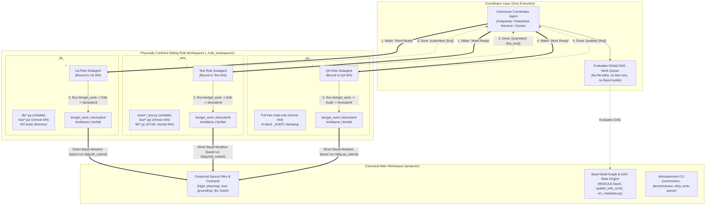
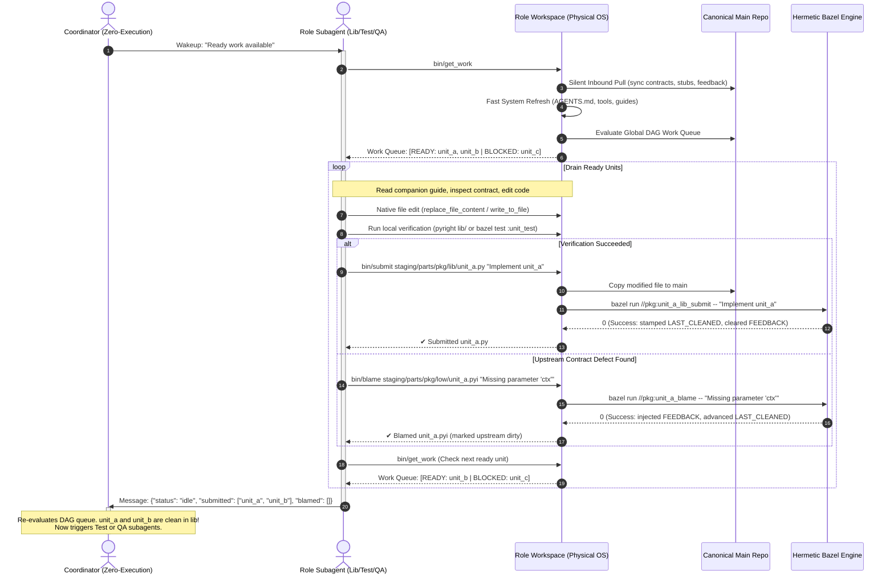
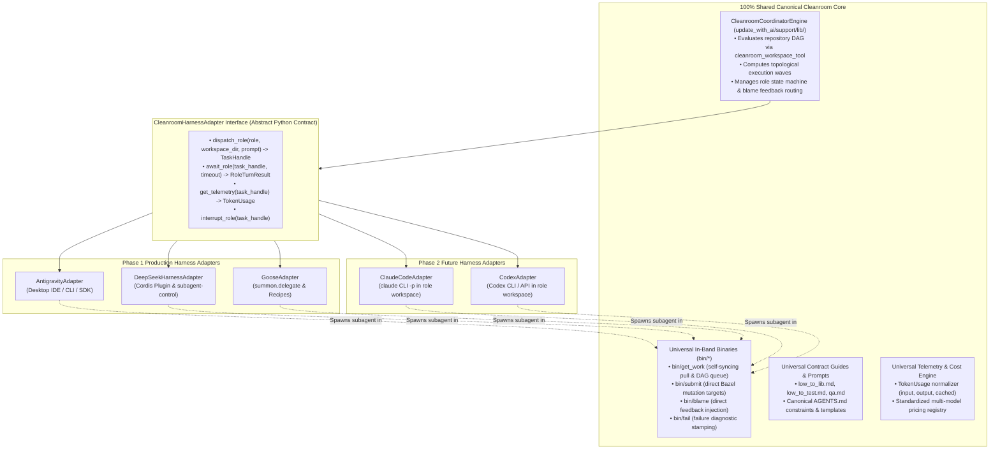
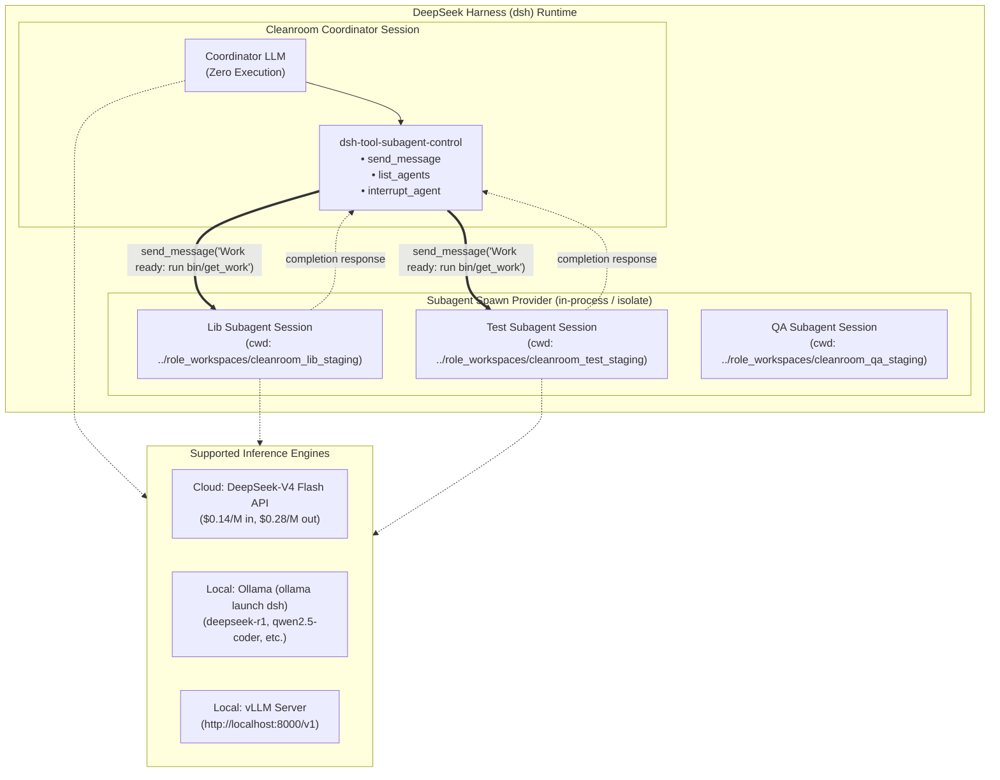
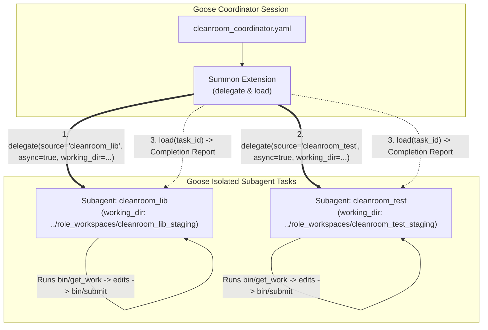
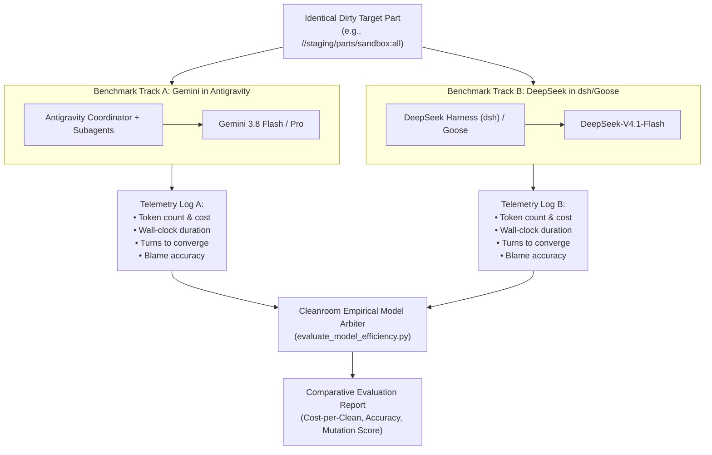
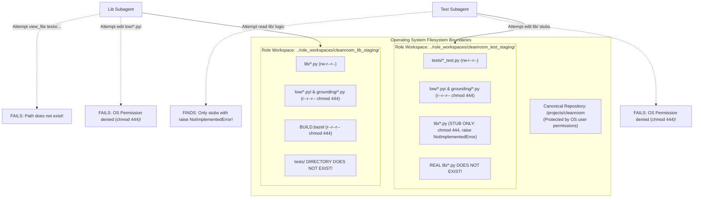
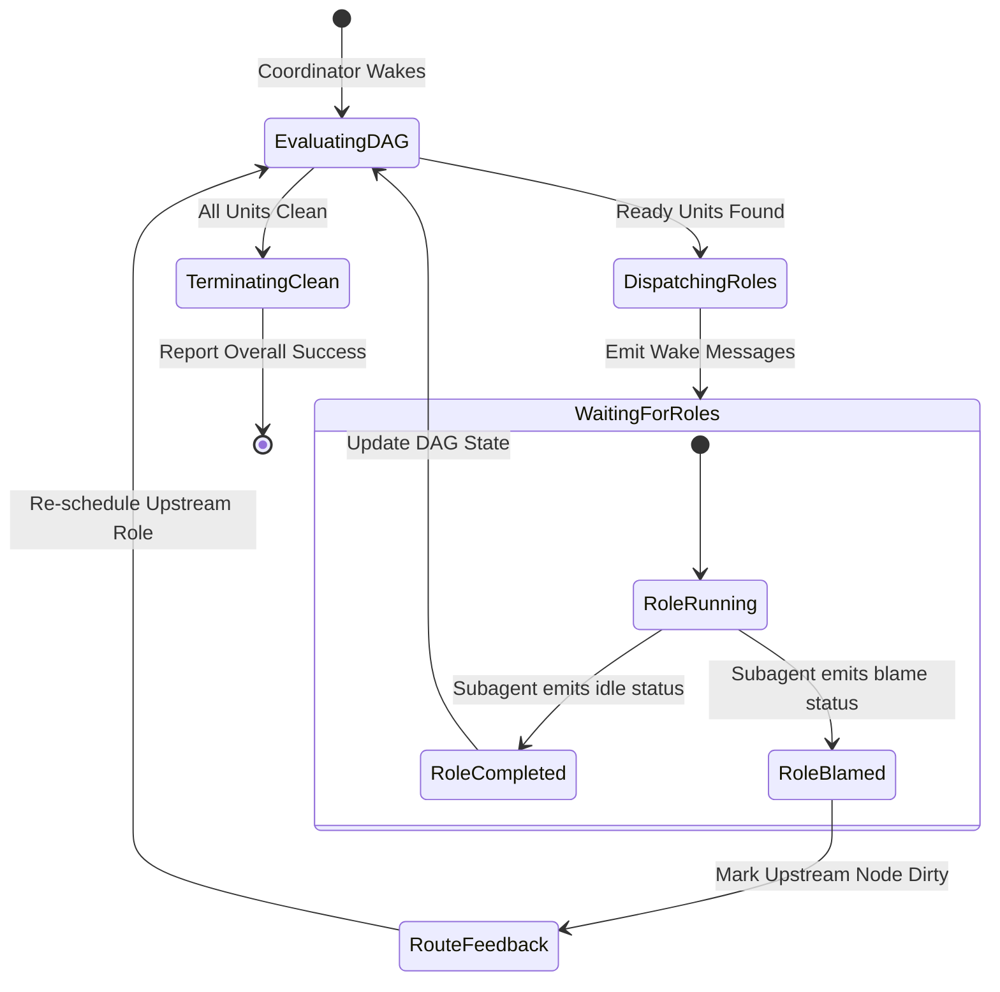

# Subagent-Driven Cleanroom Workspaces: Multi-Harness Autonomous Coordination Architecture

This document specifies the architecture for driving convention-based, isolated Cleanroom role workspaces autonomously via subagents across three major execution harnesses: **Google Antigravity**, **DeepSeek Harness (`dsh`)**, and **Goose**.

> [!NOTE]
> **Supercedes and Replaces [Archived Design: Antigravity Subagents & MCP Server](file:///Users/seanmcdirmid/projects/cleanroom/design-docs/antigravity_integration_failed.md)**
> This architecture formally supercedes the decommissioned Option 2 architecture. Instead of running fragile in-tree software hooks (`cleanroom_sandbox_hook.py`) and a dynamic FastMCP daemon that devolved into a shell-subprocess execution gateway, this design synthesizes the physical isolation of [Subagentless Cleanroom Workspaces (Option 3)](file:///Users/seanmcdirmid/projects/cleanroom/design-docs/subagentless_cleanroom_workspaces.md) with a **Zero-Execution Coordinator** and **Workspace-Bound Subagents**.
> 
> Furthermore, by decoupling Cleanroom orchestration from proprietary IDE environments, this design enables the use of cost-efficient, high-throughput models like **DeepSeek-V4 Flash** alongside **Google Gemini**, providing an empirical testbed for side-by-side model comparison.

---

## 1. Executive Summary & Architectural Motivation

### 1.1 The Cleanroom Dilemma: Autonomy vs. Double-Blind Isolation
Cleanroom enforces mathematical, double-blind isolation across software construction roles:
- **Specifications** (`high/*.md`, `planning/*.md`, `low/*.pyi`, `grounding/*.py`) must be authored without implementation shortcuts.
- **Implementations** (`lib/*.py`) must adhere strictly to typed specifications without peeking at unit tests.
- **Unit Tests** (`tests/*_test.py`) must be derived exclusively from specification contracts without overfitting to implementation code.

In the previous subagent integration attempt (**Option 2**), Cleanroom attempted to enforce these boundaries dynamically within a **single shared working directory** using an external FastMCP daemon and Antigravity `PreToolUse` lifecycle hooks. As detailed in the post-mortem ([`antigravity_integration_failed.md`](file:///Users/seanmcdirmid/projects/cleanroom/design-docs/antigravity_integration_failed.md)), this failed because:
1. Dynamic MCP tool registration was brittle, forcing subagents to invoke shell commands (`run_command`) executing Python CLI client scripts against a local HTTP daemon.
2. The subagent instantiation tax, prompt preamble injection, and turn multiplication under Google One Ultra subscription quotas burned through 5-hour burst limits in under 45 minutes ($30–$50 token equivalent per pass).
3. Software-based confinement inside a single folder required complex, fragile interceptors, sentinel files (`.mcp.active`), and concurrency locks.

### 1.2 The Breakthrough: Physical Workspaces + Zero-Execution Coordinator
To solve these challenges, Cleanroom established **Option 3: Subagentless Cleanroom Workspaces** ([`subagentless_cleanroom_workspaces.md`](file:///Users/seanmcdirmid/projects/cleanroom/design-docs/subagentless_cleanroom_workspaces.md)), which moved isolation from the software runtime to the operating system filesystem:
- Role workspaces live in isolated sibling directories (`../role_workspaces/<ws>_<role>_<dir>/`).
- Implementers physically have no `tests/` directory; test authors physically have no real `lib/*.py` (replaced with `chmod 444` interface stubs containing `raise NotImplementedError`).
- In-band source metadata headers (`LAST_CLEANED`, `LAST_CHANGED`, `FEEDBACK:`) and direct Bazel targets (`_submit`, `_blame`, `_fail`) eliminate synchronization daemons and buffer files.
- Role sessions run `bin/get_work`, edit files with native editor tools, and call `bin/submit`.

While Option 3 succeeded brilliantly for interactive, human-driven pair programming, it required a developer to manually switch between IDE chat tabs to prompt each role when upstream work was ready.

**The Subagent-Driven Cleanroom Workspaces Architecture** closes this loop:
1. **Zero-Execution Coordinator**: A central coordinator that **never** reads code, edits files, runs tests, or executes Bazel builds. Its sole responsibility is inspecting the global directed acyclic graph (DAG) work queue and waking up the subagent bound to an active role workspace when work is available.
2. **Workspace-Bound Subagents**: Subagents are persistently bound to their respective role workspace directories (`cwd = ../role_workspaces/<ws>_<role>_<dir>`). They possess standard native tools (read file, edit file, shell command) and **zero custom MCP or framework tools**.
3. **Self-Synchronizing In-Band Protocol**: Subagents communicate through existing workspace tools (`bin/get_work`, `bin/submit`, `bin/blame`, `bin/fail`). The subagent drains its role queue autonomously and sends a lean completion status back to the coordinator.
4. **Multi-Harness Flexibility**: The architecture runs identically across **Google Antigravity**, **DeepSeek Harness (`dsh`)**, and **Goose**, breaking vendor lock-in and slashing token costs via **DeepSeek-V4 Flash**.



---

## 2. Architectural Comparison: Why This Supercedes Failed Option 2

The table below contrasts the failed Option 2 architecture with Option 3 (Subagentless) and the new Subagent-Driven Workspaces architecture:

| Architectural Vector | Option 2: In-Tree Subagents & FastMCP (ARCHIVED FAILED) | Option 3: Subagentless Workspaces (BASELINE) | Subagent-Driven Workspaces (THIS ARCHITECTURE) |
| :--- | :--- | :--- | :--- |
| **Isolation Mechanism** | Software hooks (`cleanroom_sandbox_hook.py`) + HTTP AccessGate daemon in a single shared directory. | Physical OS filesystem separation (`../role_workspaces/`) + `chmod 444` kernel protection. | **Physical OS filesystem separation** (`../role_workspaces/`) + `chmod 444` kernel protection. |
| **Tool Infrastructure** | Complex FastMCP Starlette/SSE daemon (`127.0.0.1:8765`) + Dynamic tool export. | Zero custom tools. Standard host file editing tools + local shell binaries (`bin/get_work`, etc.). | **Zero custom tools**. Standard host file editing tools + local shell binaries (`bin/get_work`, etc.). |
| **Subagent Protocol** | Subagents executed shell subprocesses running Python CLI scripts (`python3 -m antigravity_mcp_client_impl`). | Interactive conversational human chat in each role workspace. | Host native inter-agent messaging (`send_message`, Cordis bus, or Goose CLI) without subprocess RPC daemons. |
| **Coordinator Role** | Complex scheduler running `antigravity_coordinator_impl.py`, executing step commands, parsing logs. | Human developer manually switching tabs and prompting roles. | **Zero-execution coordinator**: Evaluates DAG queue, wakes workspace-bound subagents, sleeps reactively. |
| **Subagent Lifespan** | Ephemeral: destroyed and respawned per unit batch, injecting massive system preambles repeatedly. | Persistent conversational chat tabs per role workspace. | **Persistent role sessions**: Initialized once per role workspace; context benefits from high KV prompt caching. |
| **Token Cost & Economics** | Extreme ($30–$50/pass); exhausted Google One Ultra 5-hour quota in 30–45 minutes. | Lowest for Gemini interactive chats, but requires constant human presence. | **Optimized for low-cost models**: Gemini Pro/Flash or **DeepSeek-V4 Flash** (~$0.15–$0.40/pass). |
| **Harness Portability** | Locked to Antigravity IDE and internal Google agent schemas. | Usable in any IDE (Antigravity, Cursor, VSCode) via manual chat. | **Portable across Antigravity, DeepSeek Harness (`dsh`), and Goose**. |

---

## 3. Core Principles & System Design

### 3.1 The Zero-Execution Coordinator
In traditional multi-agent systems, the supervisor agent frequently becomes a bottleneck: it reads source files, attempts to summarize diffs, runs test suites, and plans micro-steps. This burns exorbitant tokens and causes context degradation.

In this architecture, the Coordinator is strictly **zero-execution**:
1. **No Code Custody**: The coordinator never opens, reads, or edits a source file (`lib/`, `tests/`, `low/`, etc.).
2. **No Build/Test Execution**: The coordinator never runs `bazel test`, `pyright`, or test runners.
3. **Queue Evaluation Only**: The coordinator evaluates the repository DAG state by invoking `cleanroom_workspace_tool` (or reading `bin/cleanroom work-queue <role>`).
4. **Reactive Wakeup & Sleep**:
   - The coordinator identifies all roles with topologically unblocked, ready work.
   - It issues an asynchronous notification message to the subagents bound to those roles:
     ```json
     {
       "action": "wake",
       "role": "lib",
       "workspace": "cleanroom_lib_staging",
       "reason": "Ready units detected in global DAG"
     }
     ```
   - The coordinator enters an idle/sleep state, waiting for reactive wakeups from worker completions. It does **not** poll or loop.

### 3.2 Workspace-Bound Subagents
Subagents are not ephemeral workers dispatched arbitrarily into the repository; each subagent is permanently anchored to a commissioned role workspace:
- `LibSubagent` is anchored to `../role_workspaces/<ws>_lib_<dir>/`.
- `TestSubagent` is anchored to `../role_workspaces/<ws>_test_<dir>/`.
- `QASubagent` is anchored to `../role_workspaces/<ws>_qa_<dir>/`.

Because the workspace is physically isolated at the filesystem level:
- In `LibSubagent`'s workspace, `tests/` does not exist. There is no software filter to bypass; test files are physically absent.
- In `TestSubagent`'s workspace, `lib/*.py` files are read-only (`chmod 444`) interface stubs containing `raise NotImplementedError`. The test author cannot cheat or overfit to real implementation code.
- Upstream specifications (`high/*.md`, `planning/*.md`, `low/*.pyi`, `grounding/*.py`) and build manifests (`BUILD.bazel`) are set to `chmod 444`. Any unauthorized modification is rejected directly by the OS kernel with `Permission denied`.

### 3.3 The Autonomous Subagent Turn Loop
When woken by the coordinator, the workspace-bound subagent executes its standardized Cleanroom turn sequence:



### 3.4 Multi-Unit Processing Invariant
To prevent turn proliferation and conversational stalling, all subagents must adhere to the **Multi-Unit Processing Invariant**:
- A subagent does **not** stop after submitting a single unit to wait for coordinator approval.
- A subagent immediately calls `bin/get_work` after every submission or blame action.
- It continues processing ready units sequentially until `bin/get_work` confirms that all units in scope are clean or blocked on external roles.
- Only when zero ready units remain does the subagent emit its completion message and yield its turn.

---

## 4. Multi-Harness Integration & Common Code Architecture

### 4.1 Maximizing Common Code: The Core Cleanroom Abstraction

To avoid maintaining separate orchestration engines for each agent framework, Cleanroom enforces strict separation between **canonical business logic** (100% shared) and **harness adapters** (thin wrappers translating dispatch and telemetry).



#### What is 100% Common Across All Platforms:
1. **The Core Orchestrator Engine (`CleanroomCoordinatorEngine`)**:
   - Pure Python, zero external framework dependencies.
   - Evaluates the global build graph (`cleanroom_workspace_tool.py`), computes ready/blocked roles, groups parallel execution waves (e.g. `lib` and `test` running simultaneously), and updates in-band DAG state.
2. **The Universal In-Band Role Binaries (`bin/*`)**:
   - `bin/get_work`, `bin/submit`, `bin/blame`, `bin/fail` are compiled as self-contained executable zipapps or shell scripts.
   - Any agent harness that can execute terminal shell commands or edit files calls these tools identically.
3. **The Role Guides and Behavioral Invariants**:
   - Role contracts, Pyright configurations, and companion guides (`low_to_lib.md`, `low_to_test.md`, `qa.md`) are completely agnostic to the model or agent platform.
4. **The Telemetry & Cost Engine (`cleanroom_telemetry.py`)**:
   - Normalizes token counts and computes monetary costs using a uniform rate registry.

#### The Abstract Adapter Protocol (`CleanroomHarnessAdapter`):
```python
from abc import ABC, abstractmethod
from typing import List, Optional
from cleanroom_telemetry import TokenUsage, RoleTurnResult

class CleanroomHarnessAdapter(ABC):
    """Abstract interface implemented by each agent framework harness."""

    @abstractmethod
    def dispatch_role(
        self,
        role: str,
        workspace_dir: str,
        prompt: str,
        timeout_seconds: float = 300.0,
    ) -> str:
        """Dispatches work to a subagent bound to workspace_dir. Returns a task/session handle."""
        pass

    @abstractmethod
    def await_role(self, task_handle: str) -> RoleTurnResult:
        """Awaits subagent turn completion; returns submitted/blamed units and status."""
        pass

    @abstractmethod
    def get_token_usage(self, task_handle: str) -> TokenUsage:
        """Extracts normalized input, output, and cached token metrics for the turn."""
        pass

    @abstractmethod
    def interrupt_role(self, task_handle: str) -> None:
        """Immediately halts subagent if loop guards or budgets trigger."""
        pass
```

---

### 4.2 Harness 1: Google Antigravity

Google Antigravity provides an interactive desktop IDE environment powered by Gemini models, featuring hierarchical subagents and reactive messaging without polling loops.

#### Topology & Configuration
- **Supervisor Session**: The main conversational chat window initializes the Cleanroom Coordinator subagent (`cleanroom_coordinator`).
- **Role Worker Subagents**: Persistent subagents declared via `invoke_subagent` or subagent manifests, permanently mapped to role workspaces.

#### Project Policy Hardening (`~/.gemini/config/projects/<workspace_hash>.json`)
When `bin/cleanroom commission` provisions a role workspace, it writes an Antigravity project configuration enforcing strict workspace confinement:
```json
{
  "settings": {
    "fileAccessPolicy": "AGENT_SETTING_POLICY_DENY",
    "sandboxMode": false
  },
  "isWorkspaceOnly": true
}
```
Antigravity's internal tool dispatcher rejects any attempt by `view_file` or `write_to_file` to access paths outside the role workspace directory.

#### Subagent Invocation & Workspace Binding (Prohibiting `Workspace: inherit`)
> [!IMPORTANT]
> **Why `Workspace: inherit` is Strictly Prohibited**:
> In Antigravity, setting `Workspace: "inherit"` forces the child subagent to run in the parent's working directory—which for the Coordinator is the un-blinded canonical main workspace (`/projects/cleanroom`).
> 
> Doing so completely destroys Cleanroom's double-blind isolation! Subagents **must never** inherit the main workspace. Instead, each role worker must be explicitly dispatched with its execution context pinned strictly to its commissioned role workspace directory (`../role_workspaces/<ws>_<role>_<dir>/`).

Role worker subagents are bound to their respective role workspaces through two supported Antigravity dispatch modes:

1. **Programmatic Dispatch via Antigravity SDK (`antigravity-sdk` Python)**:
   The Coordinator instantiates or triggers persistent role sessions with `workspace_path` explicitly targeted to the commissioned role workspace:
   ```python
   # Coordinator dispatching to the role-confined workspace
   session = client.sessions.create(
       workspace_path=os.path.realpath(f"../role_workspaces/{ws_name}_{role}_{dir_scope}"),
       model="gemini-3.8-flash",
       system_instruction=open(f"../role_workspaces/{ws_name}_{role}_{dir_scope}/AGENTS.md").read(),
   )
   session.send_message("Work is available in scope. Run bin/get_work and drain ready units.")
   ```

2. **Antigravity CLI Session Binding (`agy --cwd`)**:
   When orchestrating via the command line or terminal tasks, the Coordinator launches the role agent process pinned to the role directory:
   ```bash
   agy --cwd "../role_workspaces/cleanroom_lib_staging" \
       --prompt "Execute Cleanroom turn: run bin/get_work, verify code, submit via bin/submit, and drain ready units."
   ```

#### Reactive Waking (No Polling)
The Coordinator never executes a busy-waiting loop or sleep timer to poll workers:
- When a role subagent sends a completion message or finishes its turn, Antigravity **reactively wakes** the Coordinator.
- The Coordinator parses the message, evaluates `bin/cleanroom work-queue`, and triggers downstream roles (e.g., waking `cleanroom_qa` once both `lib` and `test` have submitted).

---

### 4.3 Harness 2: DeepSeek Harness (`dsh`)

**DeepSeek Harness (`dsh`)** is the open-source, MIT-licensed agentic runtime framework released by DeepSeek AI, built on the **Cordis** modular plugin architecture. It provides an ideal execution environment for unattended, headless, and cost-effective Cleanroom cleaning, with first-class support for both **cloud models** (DeepSeek-V4 Flash) and **local models** (via Ollama and vLLM).

#### Native Subagent Control: `dsh-tool-subagent-control`
Rather than requiring bespoke communication scripts, DeepSeek Harness provides a dedicated, native subagent management subsystem:
- **`dsh-tool-subagent-control`**: The standard consumer toolset mounted by the parent Coordinator agent. It exposes global control functions directly to the LLM:
  - **`send_message(agent_id, message)`**: Dispatches follow-up instructions and wake notifications to active, running role subagents.
  - **`list_agents()`**: Discovers and inspects the live status of all active child agents.
  - **`interrupt_agent(agent_id)`**: Immediately halts a subagent's execution if an external loop guard or timeout triggers.
- **Provider Layer (`dsh-subagent-spawn-in-process` / `dsh-subagent-codex`)**: Spawns isolated role workers anchored in their pre-confined role workspace directories (`cwd = ../role_workspaces/<ws>_<role>_<dir>/`).



#### Dual Model Backends: Cloud API vs. 100% Local Inference
DeepSeek Harness is strictly model-agnostic via OpenAI-compatible API schemas. Cleanroom can be driven through:
1. **Cloud Hosted API (`deepseek-flash`)**: DeepSeek-V4.1-Flash for blazing fast cloud execution with 1M context.
2. **Local Ollama Inference**: Launchable via `ollama launch dsh` or by configuring the base URL to `http://127.0.0.1:11434/v1`. Enables running local weights (e.g. `deepseek-r1`, `qwen2.5-coder:32b`, `deepseek-coder-v2`) with **zero cloud egress and $0 token cost**.
3. **Local vLLM / SGLang Cluster**: High-throughput inference for enterprise CI/CD clusters (`vllm serve deepseek-ai/DeepSeek-R1` at `http://localhost:8000/v1`).

#### Plugin Configuration (`cordis.config.yml`)
```yaml
plugins:
  # Mount standard file and shell tools for role workers
  - name: "@deepseek-ai/dsh-core-tools"
    config:
      enable_shell: true
      enable_fs: true
      restrict_to_cwd: true

  # Mount subagent control tools for the Coordinator
  - name: "@deepseek-ai/dsh-tool-subagent-control"
  - name: "@deepseek-ai/dsh-subagent-spawn-in-process"

  # Cleanroom coordinator configuration
  - name: "@cleanroom/dsh-coordinator"
    config:
      canonical_root: "./"
      role_workspaces_dir: "../role_workspaces"
      # Provider can be cloud or local endpoint:
      # provider: "deepseek-cloud" # model: "deepseek-flash"
      provider: "ollama-local"
      base_url: "http://127.0.0.1:11434/v1"
      model: "deepseek-r1:32b"
      concurrency_limit: 4
```

#### Autonomous Headless Execution
Unlike desktop IDE sessions, `dsh` can be executed headlessly via CLI or CI/CD pipelines:
```bash
# Cloud execution with DeepSeek-V4 Flash
npx @deepseek-ai/dsh run --plugin @cleanroom/dsh-coordinator --clean //staging/parts/sandbox:all

# 100% local, air-gapped execution via Ollama
ollama launch dsh --config cordis.local.yml --clean //staging/parts/sandbox:all
```

---

### 4.4 Harness 3: Goose (Block / Linux Foundation AAIF)

**Goose** is the open-source, general-purpose autonomous developer agent built by Block (Square/Cash App) and hosted under the Linux Foundation's Agentic AI Foundation (AAIF). Goose natively supports subagents through its built-in platform extension **`summon`**, as well as through **Recipes** and **Named Sessions**.

#### Subagent Delegation via the `summon` Platform Extension
Goose provides subagent orchestration through the default `summon` extension, exposing two primary tools to the agent:
- **`delegate(source, parameters, working_dir, async)`**:
  - `source`: The recipe name or path defining the subagent persona and instructions (e.g., `update_with_ai/recipes/cleanroom_lib.yaml`).
  - `working_dir`: Directs the subagent to run strictly inside the specified directory (`../role_workspaces/<ws>_<role>_<dir>/`), maintaining physical OS confinement.
  - `parameters`: Key-value parameters passed into the subagent (e.g., `{"parts_dir": "staging"}`).
  - `async: true`: Spawns the subagent asynchronously in the background, returning a `task_id` immediately so the Coordinator can dispatch multiple role workers in parallel.
- **`load(task_id)`**:
  - Awaits and retrieves the completion status, tool activity summary, and submitted unit reports from the background subagent.



#### Architecture: Roles as Version-Controlled Recipes
In Goose, an entire agent persona, tool configuration, and system prompt is declared as a declarative YAML **Recipe**. Cleanroom provides standard recipes for the coordinator and each role under `update_with_ai/recipes/`:

##### Coordinator Recipe (`recipes/cleanroom_coordinator.yaml`):
```yaml
name: cleanroom-coordinator
version: 1.0.0
description: "Zero-execution coordinator evaluating Cleanroom DAG queues and delegating to role subagents."
model: "deepseek-flash"
instructions: |
  You are the Cleanroom Zero-Execution Coordinator.
  You NEVER read code, edit files, or execute tests.
  Your turns consist strictly of:
  1. Evaluate DAG work queue via `bin/cleanroom work-queue <role>`.
  2. For ready roles, call `delegate(source="cleanroom_<role>", working_dir="../role_workspaces/<ws>_<role>_<dir>", async=true)`.
  3. Await completions via `load(task_id)`.
  4. Repeat until all units across all roles are clean.
extensions:
  - developer
  - type: platform
    name: summon  # Mounts delegate and load tools
```

##### Lib Role Recipe (`recipes/cleanroom_lib.yaml`):
```yaml
name: cleanroom-lib
version: 1.0.0
description: "Confined Cleanroom implementation engineer for library code."
model: "deepseek-flash"
instructions: |
  You are the Cleanroom Library Engineer bound to your role workspace directory.
  You write production library code adhering strictly to `low/*.pyi` and `grounding/*.py`.
  You NEVER attempt to view `tests/`.
  Upon wakeup:
  1. Run `bin/get_work` to inspect ready units.
  2. Follow the role companion guide to implement target files.
  3. Verify with Pyright and `lib_lint.py`.
  4. Submit verified files via `bin/submit <file> "<summary>"`.
  5. Drain all ready units before finishing and report completed units.
extensions:
  - developer
```

#### Persistent Multi-Session Orchestration (CLI Mode)
In addition to in-process delegation via `summon`, Goose supports managing persistent named sessions anchored in distinct workspace directories:
```bash
# Initialize persistent role sessions bound to their respective role workspaces
goose session start --name cleanroom-lib --recipe update_with_ai/recipes/cleanroom_lib.yaml --cwd ../role_workspaces/cleanroom_lib_staging
goose session start --name cleanroom-test --recipe update_with_ai/recipes/cleanroom_test.yaml --cwd ../role_workspaces/cleanroom_test_staging

# The Coordinator dispatches tasks into active role sessions as work becomes ready
goose run --session cleanroom-lib -t "Work is available in scope 'staging'. Run bin/get_work and drain ready units."
```

---

### 4.5 Phase 2 Future Harnesses: Anthropic Claude Code & OpenAI Codex

Because Cleanroom decouples orchestration via the `CleanroomHarnessAdapter` interface and relies strictly on physical OS workspace confinement, adding new agent backends requires **zero changes** to Cleanroom's core build graph, Bazel rules, or role tools.

#### 1. Anthropic Claude Code (`ClaudeCodeAdapter`)
**Claude Code** is Anthropic's agentic CLI tool. It operates natively in a target directory with access to file viewing, file editing, and bash execution:
- **Workspace Binding**: The adapter spawns Claude Code in headless mode with `cwd` set strictly to the role workspace:
  ```bash
  claude -p "Work is available. Run bin/get_work, author code, verify, submit via bin/submit, and drain ready units." \
         --dangerously-skip-permissions \
         --output-format json
  ```
- **Confinement**: Claude Code cannot read counterpart files because `tests/` does not exist in `lib/`, real implementations do not exist in `test/`, and specs are `chmod 444`.
- **Telemetry Extraction**: Claude Code emits structured JSON execution summaries or logs into `~/.claude/projects/` containing exact token metrics:
  - `cache_read_input_tokens` $\to$ `TokenUsage.cached_tokens`
  - `input_tokens` $\to$ `TokenUsage.input_tokens`
  - `output_tokens` $\to$ `TokenUsage.output_tokens`

#### 2. OpenAI Codex / Canvas / Operator (`CodexAdapter`)
**OpenAI Codex** can be driven either through the standalone OpenAI Agent CLI / API or via DeepSeek Harness's built-in `dsh-subagent-codex` provider:
- **Workspace Binding**: Initialized with working directory set to `../role_workspaces/<ws>_<role>_<dir>/`.
- **Instruction Injection**: Ingests standard `AGENTS.md` and role companion guides as system preambles.
- **Telemetry Extraction**: Extracted directly from OpenAI API `completion.usage`:
  - `prompt_tokens_details.cached_tokens` $\to$ `TokenUsage.cached_tokens`
  - `prompt_tokens` - `cached_tokens` $\to$ `TokenUsage.input_tokens`
  - `completion_tokens` $\to$ `TokenUsage.output_tokens`

---

## 5. Universal Token Tracking, Cost Estimation, and Empirical Benchmarking

### 5.1 The Unified Token Telemetry Contract (`TokenUsage`)

To fairly and objectively compare performance and cost across all harnesses (Antigravity, DeepSeek Harness, Goose, Claude Code, Codex) and models (Gemini, DeepSeek, Claude, GPT, local models), Cleanroom defines a **Universal Telemetry Contract** in `update_with_ai/support/lib/cleanroom_telemetry.py`:

```python
from dataclasses import dataclass
from typing import List, Optional

@dataclass(frozen=True)
class TokenUsage:
    """Normalized token telemetry for a single turn or complete cleaning session."""
    input_tokens: int        # Uncached prompt tokens (cache miss)
    cached_tokens: int       # Cached prompt tokens (cache hit)
    output_tokens: int       # Generated completion tokens
    total_tokens: int        # input_tokens + cached_tokens + output_tokens
    cost_usd: float          # Standardized monetary expenditure in USD

@dataclass(frozen=True)
class RoleTurnResult:
    """Outcome of an autonomous role subagent turn."""
    role: str
    status: str              # "idle", "complete", "blamed", "failed"
    units_submitted: List[str]
    units_blamed: List[str]
    telemetry: TokenUsage
    wall_clock_seconds: float
```

### 5.2 Harvesting Telemetry Across Harnesses

Each harness adapter extracts raw token metrics from its native logging infrastructure and normalizes them into `TokenUsage`:

| Harness | Native Telemetry Source | Extraction Mechanism |
| :--- | :--- | :--- |
| **Google Antigravity** | `<appDataDir>/brain/<id>/.system_generated/logs/transcript.jsonl` | Parses `MODEL` and `PLANNER_RESPONSE` steps for token metadata fields (`input_tokens`, `output_tokens`, `cache_read_tokens`). |
| **DeepSeek Harness (`dsh`)** | Cordis LLM provider response objects | Inspects `usage.prompt_cache_hit_tokens` (cached), `usage.prompt_cache_miss_tokens` (input), and `usage.completion_tokens` (output). |
| **Goose** | Goose session database / `goose session info --json` | Reads `session.metrics.input_tokens`, `session.metrics.output_tokens`, and cache efficiency ratios. |
| **Claude Code** | CLI JSON stdout / `~/.claude/` session transcripts | Extracts `usage.cache_read_input_tokens`, `usage.input_tokens`, and `usage.output_tokens`. |
| **OpenAI Codex** | OpenAI API response payloads (`completion.usage`) | Maps `usage.prompt_tokens_details.cached_tokens`, `usage.prompt_tokens`, and `usage.completion_tokens`. |

### 5.3 Standardized Rate Card & Cost Calculation Formula

The cost in USD is calculated deterministically by `CleanroomTelemetry` using a centralized rate card:

$$\text{Cost} = \frac{(\text{input\_tokens} \times P_{\text{in}}) + (\text{cached\_tokens} \times P_{\text{cache}}) + (\text{output\_tokens} \times P_{\text{out}})}{1{,}000{,}000}$$

#### Canonical Pricing Table (per 1,000,000 Tokens)

| Model Identifier | Provider / Platform | Cached Input ($/1M) | Uncached Input ($/1M) | Output ($/1M) |
| :--- | :--- | :--- | :--- | :--- |
| **`deepseek-flash`** (V4.1-Flash) | DeepSeek API (`dsh` / Goose) | **\$0.014** | **\$0.14** | **\$0.28** |
| **`deepseek-r1-local`** | Ollama / vLLM (Local GPU) | **\$0.000** | **\$0.000** | **\$0.000** |
| **`gemini-3.8-flash`** | Google Cloud / Antigravity | **\$0.025** | **\$0.10** | **\$0.40** |
| **`gemini-3.8-pro`** | Google Cloud / Antigravity | **\$0.3125** | **\$1.25** | **\$5.00** |
| **`claude-3-7-sonnet`** | Anthropic API / Claude Code | **\$0.30** | **\$3.00** | **\$15.00** |
| **`gpt-4o`** | OpenAI API / Codex | **\$1.25** | **\$2.50** | **\$10.00** |

---

### 5.4 Comprehensive Paradigm Cost & Token Comparison

| Metric / Attribute | Option 1: Custom Loop (OpenAI API) | Option 2: In-Tree Subagents (ARCHIVED FAILED) | Option 3: Subagentless Workspaces (Gemini Ultra) | Subagent Workspaces (Gemini 3.8 Ultra/Pro) | Subagent Workspaces (DeepSeek-V4 Flash) | Subagent Workspaces (Local Ollama / vLLM in dsh) |
| :--- | :--- | :--- | :--- | :--- | :--- | :--- |
| **Model Backend** | GPT-4o / Claude 3.5 Sonnet | Gemini 1.5/2.0 Ultra (Antigravity) | Gemini 3.8 Ultra (Interactive Chat) | Gemini 3.8 Flash / Pro (Antigravity Subagents) | **DeepSeek-V4.1-Flash** (Cloud API via `dsh`) | **DeepSeek-R1 / Qwen2.5-Coder** (Local GPU) |
| **Preamble Overhead / Turn** | ~8k tokens (Injected per node session) | ~35k tokens (Injected per ephemeral subagent) | ~12k tokens (Cached in persistent tab) | ~12k tokens (High cache hit rate) | **~12k tokens (90% cached at \$0.014/M)** | **~12k tokens (Local KV cache)** |
| **Tool Definition Tokens** | ~4k tokens (OpenAI tool schemas) | ~15k tokens (FastMCP dynamic schemas + hooks) | 0 tokens (No custom tool schemas) | 0 tokens (Standard host tools only) | **0 tokens (Standard host tools only)** | **0 tokens (Standard host tools only)** |
| **Context Bloat Rate** | Moderate (Reset per DAG node) | Extreme (Sequential shell CLI logs up to 100k) | Low (Single role focus per tab) | Low (Single role focus per subagent) | **Ultra-Low (Asymmetric Causal KV cache)** | **Low (Bounded by role context)** |
| **Average Turns per Unit** | 3–5 turns | 8–14 turns (RPC handshakes) | 2–3 turns | 2–3 turns | **2–3 turns** | **2–4 turns** |
| **Est. Cost per 5-Node Pass**| \$12.00 – \$25.00 | \$35.00 – \$55.00 (or Quota Lockout) | Included in Google One Ultra (Manual) | Included in Google One Ultra (Autonomous) | **\$0.18 – \$0.45 (Total API expenditure)** | **\$0.00 (100% Local / Zero API Cost)** |
| **Human Labor Required** | Zero (Headless) | High (Babysitting socket crashes) | High (Manual prompt switching) | **Zero (Autonomous)** | **Zero (Autonomous & Scriptable)** | **Zero (Autonomous & Air-Gapped)** |

---

### 5.5 Side-by-Side Model Comparison Methodology

With support for both Google Gemini (in Antigravity) and DeepSeek-V4 Flash (in `dsh` / Goose), Cleanroom establishes an empirical, reproducible testbed to benchmark model performance on rigorous, double-blind software engineering.



#### Evaluation Metrics & Scoring
The comparison arbiter records six objective, deterministic dimensions:
1. **Total Monetary Cost**: Total expenditure in API tokens or quota fractions required to achieve clean state across all nodes.
2. **Convergence Speed (Turns & Wall-Clock)**: Number of model turns and elapsed seconds required to transition all units from dirty to clean.
3. **Double-Blind Contract Fidelity**:
   - Number of Pyright static type errors on first submission.
   - Number of Cleanroom linter violations (`lib_lint.py`, `grounding_lint.py`).
4. **Upstream Blame Precision**:
   - When given an intentionally incomplete or contradictory specification contract, does the model identify the exact requirement gap and issue a valid `bin/blame`, or does it hallucinate an ad-hoc local workaround?
5. **Test Mutation Resistance**:
   - For tests authored by `TestSubagent` (blind to implementation), what percentage of intentionally injected implementation mutations (via mutation testing) are caught by the generated test suite?
6. **Hallucination & Repetition Rate**:
   - Number of repetitive, non-progress turns intercepted by loop guardrails.

---

## 6. Confinement & Security Architecture

Because Cleanroom workspaces physically segregate code at the operating system level, double-blind confinement does not rely on model trustworthiness or complex interceptors.



### 6.1 Kernel-Enforced Immutability (`chmod 444`)
- All contract files (`low/*.pyi`, `grounding/*.py`, `high/*.md`, `planning/*.md`), guides, and build files (`BUILD.bazel`) are set to read-only mode (`chmod 444`) when copied into the role workspace.
- Any attempt by an LLM tool (`write_to_file`, `replace_file_content`) or shell redirection (`>`) to alter an upstream specification triggers an immediate OS-level `Permission denied` error.
- The `AGENTS.md` instruction file explicitly forbids running `chmod` or changing file permissions.
- Inbound pull routines verify the SHA-256 hashes of read-only files before each turn, terminating immediately if unauthorized tampering is detected.

### 6.2 Structural Non-Existence
- Rather than policing access to unauthorized files, Cleanroom ensures they do not exist:
  - **In Lib Workspaces**: The `tests/` directory is never created.
  - **In Test Workspaces**: Real implementation files (`lib/*.py`) are never copied. Instead, `cleanroom_workspace_tool.py` generates typed interface stubs where all method bodies contain `raise NotImplementedError("Cleanroom Test Stub")`.

### 6.3 Pathless Workspace Descriptors
Role workspaces store no absolute host paths:
```json
{
  "role_address": "//update_python_with_ai:lib",
  "role_name": "lib",
  "parts_dir": "staging"
}
```
All references to the canonical main workspace are resolved via relative convention (`../../<workspace_name>`), preventing directory path leakage into model context windows.

---

## 7. Lifecycle State Machine & Coordinator Logic

### 7.1 Global DAG Traversal
The Cleanroom build graph is a directed acyclic graph where nodes represent role artifacts:
$$\text{High} \longrightarrow \text{Planning} \longrightarrow \text{Low} \longrightarrow \text{Grounding} \longrightarrow \{\text{Lib}, \text{Test}\} \longrightarrow \text{QA} \longrightarrow \text{Coverage}$$

The Coordinator implements dependency-first topological scheduling:
1. **Producer Phases**:
   - `high`, `planning`, `low`, and `grounding` execute sequentially.
   - When `grounding` is clean, both `lib` and `test` become topologically eligible and can execute **in parallel** in their respective workspaces.
2. **Auditor Phases**:
   - `qa` is blocked until **both** `lib` and `test` have successfully submitted and their verification targets pass.
   - `coverage` is blocked until `qa` has successfully passed.

### 7.2 Blame & Defect Routing
When a downstream role identifies a specification ambiguity or contradiction:
1. The role agent executes `bin/blame <culprit_file> "<critique>"`.
2. The Bazel `_blame` target directly injects the critique into the culprit file's `FEEDBACK:` header in canonical main and advances its `LAST_CLEANED` timestamp.
3. The culprit file is immediately marked **dirty** in the global DAG.
4. The role agent reports `blamed` in its completion message to the Coordinator.
5. The Coordinator detects that an upstream role has become dirty, suspends execution of dependent roles, and re-wakes the upstream role subagent to address the feedback.



---

## 8. Implementation Roadmap

The implementation of Subagent-Driven Cleanroom Workspaces proceeds across four distinct phases:

### Phase 1: Shared Canonical Core & Telemetry Engine
- **`CleanroomCoordinatorEngine`** (`update_with_ai/support/lib/cleanroom_coordinator_engine.py`):
  - Headless, zero-execution DAG queue evaluator built on `cleanroom_workspace_tool.py`.
  - Exposes `CleanroomHarnessAdapter` abstract base class.
- **`CleanroomTelemetry`** (`update_with_ai/support/lib/cleanroom_telemetry.py`):
  - Normalizes token telemetry (`input_tokens`, `output_tokens`, `cached_tokens`) across all harnesses.
  - Implements the centralized pricing table and calculates exact USD costs.
- **Universal CLI Command**:
  - `bin/cleanroom orchestrate [dir_scope] [--harness=<antigravity|dsh|goose>]`.

### Phase 2: Phase 1 Production Harness Adapters
1. **Google Antigravity Adapter (`antigravity_adapter.py`)**:
   - Integrates with Antigravity Python SDK and `agy --cwd` session binding.
   - Enforces `fileAccessPolicy: AGENT_SETTING_POLICY_DENY` across all commissioned workspaces.
   - Parses `<appDataDir>/brain/<id>/.system_generated/logs/transcript.jsonl` for token usage.
2. **DeepSeek Harness Adapter (`dsh_adapter.py`)**:
   - Implements Cordis coordinator plugin `@cleanroom/dsh-coordinator`.
   - Utilizes `dsh-tool-subagent-control` (`send_message`, `list_agents`, `interrupt_agent`) for subagent steering.
   - Supports both cloud DeepSeek-V4.1-Flash API and 100% local air-gapped inference via Ollama / vLLM.
3. **Goose Adapter (`goose_adapter.py`)**:
   - Authors standard role recipes under `update_with_ai/recipes/`.
   - Dispatches tasks via `summon.delegate(working_dir=..., async=true)` and Named Sessions (`goose run --session`).
   - Extracts usage telemetry from `goose session info --json`.

### Phase 3: Phase 2 Harness Adapters (Anthropic Claude Code & OpenAI Codex)
1. **Anthropic Claude Code Adapter (`claude_code_adapter.py`)**:
   - Implements headless driver: `claude -p "..." --dangerously-skip-permissions` with `cwd` set to role workspace.
   - Harvests prompt caching and completion tokens from `.claude/` session records.
2. **OpenAI Codex Adapter (`codex_adapter.py`)**:
   - Implements dispatch via `dsh-subagent-codex` or standalone Codex CLI / API socket.
   - Maps `prompt_tokens_details.cached_tokens` and completion usage.

### Phase 4: Cross-Model Empirical Benchmarking Suite
- **Arbiter Engine (`evaluate_model_efficiency.py`)**:
  - Runs automated, identical cleaning passes across Gemini 3.8, DeepSeek-V4 Flash, DeepSeek-R1 (Local), Claude 3.7 Sonnet, and GPT-4o.
  - Records cost-per-clean, convergence turns, static typing violation counts, and test mutation kill rates.
  - Publishes comparative markdown evaluation reports.

---

## 9. Conclusion

The Subagent-Driven Cleanroom Workspaces architecture combines the best of both worlds:
1. **Impenetrable Double-Blind Isolation**: Enforced by physical OS directory separation and kernel `chmod 444` permissions, completely eliminating the brittle software hooks and HTTP daemons of Option 2.
2. **Autonomous Multi-Agent Velocity**: Driven by a zero-execution coordinator that schedules role subagents without bloating context or burning unnecessary tokens.
3. **Model & Harness Agnosticism**: Liberated from proprietary single-model dependencies, enabling seamless deployment across **Google Antigravity**, **DeepSeek Harness**, and **Goose**, and unleashing the dramatic cost efficiencies of **DeepSeek-V4 Flash**.
