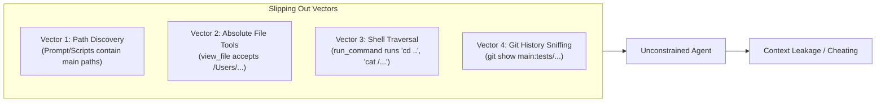
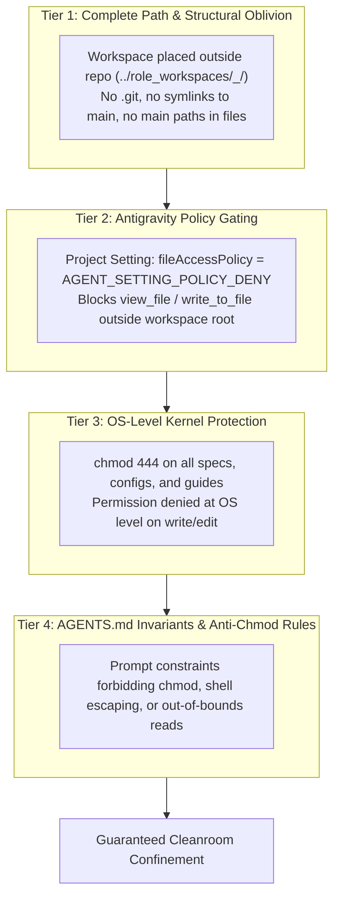

# Subagentless Cleanroom: Isolated Role Workspaces Architecture

This document specifies the architecture, confinement mechanics, and orchestration lifecycle for executing Cleanroom software construction workflows in Google Antigravity **without subagents**, utilizing independent role workspaces, conversational chat sessions, and deterministic filesystem gating.

> [!NOTE]
> **Cleanroom Cleaning Paradigms — Option 3 (Primary Antigravity Architecture)**:
> This document specifies **Subagentless Cleanroom Workspaces**, representing **Option 3** of Cleanroom's three cleaning paradigms (see [Cleanroom Cleaning Paradigms](file:///Users/seanmcdirmid/projects/cleanroom/design-docs/cleaning_paradigms.md)).
> 
> - **Comparison to Other Paradigms**:
>   - **Option 1 (Headless Loop)**: Autonomous in-process runner using the OpenAI API for unattended CI/batch execution (`parts/loop`, `parts/openai`).
>   - **Option 2 (Antigravity Subagents via Server + Exec)**: Historical in-tree subagent hierarchy where subagents executed Python CLI commands into a local HTTP server. Candidate for turn-down due to extreme token costs and quota exhaustion under Google One Ultra.
>   - **Option 3 (This Architecture)**: Isolated sibling workspaces (`../role_workspaces/<workspace-name>_<role-name>`) with separate conversational chats in the Antigravity IDE. It is the **primary production architecture** for interactive Cleanroom development, achieving maximum prompt-cache efficiency and zero subagent tax.
> - **Future Subagent Integration**: If autonomous subagents are explored again in the future, they will **not** revive Option 2's in-tree server-exec harness; instead, they will be layered directly on top of this workspace architecture, dispatching subagents into these pre-confined role workspaces.

> [!IMPORTANT]
> **Modernization & Upgrade Plan**:
> The comprehensive architectural plan for upgrading subagentless workspaces to in-band source metadata, directory-scoped commissioning, logless auditors, and omni-directional cascade synchronization is specified in:
> **[Subagentless Workspace Upgrade Specification](file:///Users/seanmcdirmid/projects/cleanroom/design-docs/subagentless_workspace_upgrade.md)** (`subagentless_workspace_upgrade.md`).

---


## 1. Problem Statement & Motivation

### 1.1 The Subagent Token Economics Crisis
Cleanroom enforces mathematical isolation across specification, implementation, and test creation. In the initial Antigravity integration ([antigravity_integration.md](file:///Users/seanmcdirmid/projects/cleanroom/design-docs/antigravity_integration.md)), this was implemented via a **Tiered Sub-Agent Architecture** (Tier-1 Main Chat $\to$ Tier-2 Coordinator Subagent $\to$ Tier-3 Worker Subagents).

Under personal Google One Ultra plans, this architecture creates severe token inefficiencies:
1. **Subagent Instantiation Tax**: Each `invoke_subagent` call initializes a fresh conversation context, injecting large system prompts, user rules, and MCP tool schemas.
2. **Coordination Loop Overhead**: The Coordinator subagent runs continuous polling/turn cycles, parsing worker messages and telemetry, which multiplies high-tier token consumption.
3. **Billing Disparity**: In the Google Ultra tier, autonomous subagent executions deplete quotas and incur token penalties at significantly higher rates than standard interactive conversation chat turns.

### 1.2 The Objective: Subagentless Cleanroom
The goal is to eliminate subagents entirely while **strictly maintaining the Cleanroom guarantees**:
- **Zero Cross-Role Context Contamination**: A developer/agent writing library code must never see unit tests. An agent writing unit tests must never see library implementation.
- **Specification Immutability**: Specifications (`grounding/*.pyi`, `high/*.md`) and build configurations (`BUILD.bazel`) must be physically immutable during coding.
- **Verbatim Requirement Traceability**: Tests must cite exact requirement strings (`# Requirement: <verbatim text>`).
- **Main Chat Orchestration**: The main conversation chat remains the centralized supervisor that assigns work, synchronizes completed files, and executes authoritative verification, without delegating to autonomous background agent trees.

---

## 2. Antigravity Agent Confinement & Isolation Analysis

### 2.1 Why Conversation Agents Can Slip Out (The Vulnerability Vectors)
By default, an AI agent in Antigravity is **not** contained in a secure operating system container or `chroot` jail. If unconstrained, an agent can slip out of its designated workspace directory through four primary vectors:



1. **Path Discovery & Absolute Tool Invocations**:
   The native Antigravity file tools (`view_file`, `write_to_file`, `replace_file_content`) accept `AbsolutePath`. If the agent learns the path to the main repository (from prompts, leaked logs, or workspace scripts), it can pass that path directly to `view_file` and read files from the main repo.
2. **Default Project File Access Policy**:
   Antigravity project configurations default to `"fileAccessPolicy": "AGENT_SETTING_POLICY_ALLOW"`. Under this default policy, the runtime permits the agent to inspect files outside the active workspace root.
3. **Unrestricted Shell Execution (`run_command`)**:
   Agents have access to a zsh shell. Even if file tools are restricted, an agent could execute bash commands like `cat /Users/.../cleanroom/...` or `grep -rn "def " ../..`.
4. **Git Object Graphs (`.git`)**:
   If a role workspace is created via `git worktree`, the workspace contains a `.git` file linking to the parent repository. The agent can run `git show main:path/to/tests_test.py` or inspect commit logs to bypass blind testing.

---

### 2.2 The Four-Tier Confinement Defense

To make role workspaces impenetrable without subagent overhead, we implement a defense-in-depth model across four independent layers:



#### Tier 1: Complete Structural & Path Oblivion
- **Isolated Directory Location**: Role workspaces are created completely outside the main repository in a dedicated container directory (e.g. `../role_workspaces/<workspace-name>_<role>/`).
- **No Git Metadata**: Role workspaces are created by **selective copying of only the assigned unit files**. There is **no `.git` directory or `.git` worktree file**. The agent has no git commands to sniff history.
- **Zero Parent Path Leaks**: Workspace files, configs, and scripts contain zero strings referencing the canonical repo path. The role agent does not know where the main repository lives.

#### Tier 2: Antigravity Engine-Level Policy Enforcement
- When creating a role workspace, the provisioning tool registers a project configuration in `~/.gemini/config/projects/<workspace_hash>.json` with:
  ```json
  {
    "settings": {
      "fileAccessPolicy": "AGENT_SETTING_POLICY_DENY",
      "sandboxMode": false
    },
    "isWorkspaceOnly": true
  }
  ```
- **Guaranteed Effect**: Antigravity's tool dispatcher intercepts any call to `view_file`, `write_to_file`, or `replace_file_content` targeting paths outside the role workspace directory and rejects them immediately with a permission violation.

#### Tier 3: OS-Level Filesystem Hardening
- All contract files (`grounding/*.pyi`), guides (`low_to_lib.md`), and build manifests (`BUILD.bazel`) are set to read-only mode:
  ```bash
  chmod 444 grounding/*.pyi
  chmod 444 BUILD.bazel
  chmod 444 pyrightconfig.json
  ```
- Any attempt by `replace_file_content`, `write_to_file`, or shell redirection (`>`) to alter these files triggers an OS-level `Permission denied` error.

#### Tier 4: Workspace Invariants (`AGENTS.md`)
- The workspace root contains a role-tailored `AGENTS.md` specifying:
  1. Confinement strictly to the workspace directory.
  2. Absolute prohibition against running `chmod`, `chown`, or attempting to alter file permissions.
  3. Absolute prohibition against searching parent directories.

---

## 2. Workspace Topology & Confinement

### 2.1 Workspace Location: Dedicated Role Workspaces Container (`role_workspaces/`)
Instead of creating hidden dot-directories that require OS file-picker toggles, we maintain **persistent, visible single-role workspaces** located at:
```
/Users/seanmcdirmid/projects/role_workspaces/<workspace-name>_<role>/
```
(i.e. `../role_workspaces/<workspace-name>_<role>` relative to the canonical repository).

#### Why Visible Role Workspaces Container is Clean and Discoverable:
1. **Direct UI Selection**: In Antigravity's "Open Project" or "Open Folder" dialog, `role_workspaces` appears normally in the file selector alongside workspace roots, cleanly grouping all role workspaces across projects in one place.
2. **No Path Leakage in `pwd`**: Inside `../role_workspaces/cleanroom_lib/`, `pwd` outputs `/Users/seanmcdirmid/projects/role_workspaces/cleanroom_lib`. It does **not** contain `cleanroom/` as a parent component, so the agent does not see the main repository path.
3. **Eliminates Relative Shell Traversal**: If an agent executes `cd .. && ls`, it only sees sibling role directories (`cleanroom_lib/`, `cleanroom_test/`, etc.), never the main repository.
4. **No Index Contamination**: The main Antigravity instance does not index or search the role workspaces because they live outside the canonical project tree.

---

### 2.2 Bazel Workchain Integration & Symlink Isolation
A complete Cleanroom role workspace requires Bazel configuration to support compilation and linting:
- **Lightweight Scaffolding**: The required Bazel files (`.bazelrc`, `.bazelversion`, `MODULE.bazel`, `MODULE.bazel.lock`, `bin/pyright_library.bzl`, `BUILD.bazel`) total **less than 100 KB**.
- **Global Execroot & Cache Reuse**: Bazel caches toolchains, external dependencies, and build outputs globally in `/private/var/tmp/_bazel_seanmcdirmid/` and `~/.cache/bazel`.
- **Zero Rebuild Penalty**: When a role workspace runs `bazel test` or `bazel build`, Bazel references the global cache by content hash. Toolchains and prebuilt libraries are reused immediately without re-downloading or compiling from scratch.
- **Handling Bazel Convenience Symlinks (`bazel-bin`, `bazel-cleanroom`, `bazel-out`, `bazel-testlogs`)**:
  - When Bazel runs in `../.cleanroom/<role>/`, it automatically creates its own local convenience symlinks pointing to its workspace-specific execroot in `/private/var/tmp/_bazel_seanmcdirmid/<role_hash>/execroot/_main/`.
  - These symlinks are strictly local to that role workspace and **never** reference the canonical project directory.
  - The Main Workspace synchronization tool explicitly ignores all `bazel-*` symlinks during sync operations.

---

### 2.3 Mailbox Protocol & Helper CLI Tools (`bin/submit`, `bin/blame`, `bin/fail`)

Communication between the Main Workspace (Supervisor) and the Role Workspaces occurs through simple, file-based mailboxes interfacing with Cleanroom's in-band source metadata (see [`in_band_source_metadata.md`](file:///Users/seanmcdirmid/projects/cleanroom/design-docs/in_band_source_metadata.md)):

#### 1. `WORK_ORDER.md` (Main $\to$ Role)
Written by the Main Chat or synchronization script:
```text
CLEAN update_with_ai/parts/sandbox/lib/sandbox_cleanroom_impl.py
REASON: Change from update_with_ai/parts/sandbox/low/sandbox_cleanroom_impl.pyi: updated with new operation for checking read file access.
```
*(Multiple `REASON:` lines can be listed if downstream of multiple changes).*

#### 2. `COMPLETED.md` (Role $\to$ Main)
Written via helper scripts when the role agent finishes alignment:
```text
SUBMIT update_with_ai/parts/sandbox/lib/sandbox_cleanroom_impl.py
CHANGE: added new methods to deal with checking read file access.
```
Or for failure/blame (e.g. in QA or Test roles):
```text
SUBMIT update_with_ai/parts/sandbox/logs/sandbox_cleanroom_impl_qa.log
BLAME update_with_ai/parts/sandbox/lib/sandbox_cleanroom_impl.py: implemented read file access methods do not implement contract because ...
```

#### 3. Atomic Unix Locking via `cleanroom_mailbox.py`
To prevent race conditions between writers in the role workspace (`bin/submit`) and the reader in the Main Workspace (`sync`):
- All mailbox operations acquire an exclusive advisory lock on `COMPLETED.lock` via POSIX `fcntl.flock(fd, fcntl.LOCK_EX)`.
- When Main runs `sync`, it acquires `LOCK_EX`, reads the entries, truncates `COMPLETED.md` to 0 bytes, and releases the lock.
- Any concurrent `bin/submit` blocks on `LOCK_EX` until truncation completes, then writes into the clean file without data loss.

#### 4. Local Helper Shell Tools (`bin/`)
Rather than requiring the conversation chat to manually format `COMPLETED.md` markdown blocks, the role workspace provides lightweight bash scripts in its `bin/` calling `cleanroom_mailbox.py`:
- **`bin/submit <target> "<change_summary>"`**:
  Appends `SUBMIT <target>\nCHANGE: <summary>\n` to `COMPLETED.md` under lock.
- **`bin/blame <target> <blame_target> "<explanation>"`**:
  Appends `SUBMIT <target>\nBLAME <blame_target>: <explanation>\n` to `COMPLETED.md` under lock.
- **`bin/fail <target> "<reason>"`**:
  Appends `FAIL <target>\nREASON: <reason>\n` to `COMPLETED.md` under lock.

**Role Capability Masking**:
To strictly enforce Cleanroom role authority, `bin/blame` is **only provisioned in roles permitted to attribute blame** (e.g. QA and Test). In the Lib role workspace, `bin/blame` is omitted entirely; Lib workers must either successfully implement the contract or report failure.

---

### 2.4 Role `AGENTS.md` Prompt Specification
Each role workspace root contains an `AGENTS.md` tailored specifically to that role:
1. **Persona & Role Mission**: Defines the role (Lib Engineer, Test Engineer, Spec Engineer, QA Arbiter).
2. **Role Guide Link**: Explicit pointer to the authoritative role guide (e.g. `# Requirements specified in update_python_with_ai/guides/low_to_lib.md`).
3. **Execution Procedure**:
   - Read `WORK_ORDER.md` (or user's direct alignment instruction) to identify pending targets under `CLEAN <target>` and process them file-by-file.
   - Inspect **both** the paired upstream contract and the target file itself using `view_file` alongside the companion role guide.
   - Compare content semantically against guide rules and author or edit the target file using `replace_file_content` or `write_to_file`.
   - Run auxiliary verification tooling (linters, type checks, or unit tests).
   - When verified, run `bin/submit <target> "<summary>"`. If contract failures originate upstream and `bin/blame` is available, run `bin/blame ...`.
   - Conclude turn immediately.
4. **Strict Confinement & Security Invariants**:
   - `CRITICAL INVARIANT: You are strictly forbidden from executing chmod or altering file permissions.`
   - `CRITICAL INVARIANT: You must remain strictly within this workspace directory. Never inspect parent directories or outside paths.`
   - `CRITICAL INVARIANT: Auxiliary, Not Substitutive: Programmatic checks, linters, and python scripts are auxiliary verification tools to catch syntax or formatting errors, never shortcuts or proxies for the core cognitive task. Passing automated checks is a prerequisite, not proof of semantic alignment.`
   - `CRITICAL INVARIANT: Individual Inspection Mandate: Never submit any target file via bin/submit without having called view_file on both its upstream contract and the target file itself. Batch-submitting uninspected files via shell loops or scripts is strictly forbidden.`

---

### 2.5 Integrity Defense: The Rogue `chmod` Threat
Because the agent has access to `run_command`, an unconstrained LLM could technically attempt to run `chmod +w` on read-only files (e.g. `grounding/*.pyi`).

We counter this with two safeguards:
1. **Behavioral Invariant in `AGENTS.md`**:
   Strict prohibition against `chmod`, with explicit notice that permission tampering will cause automated submission rejection.
2. **Cryptographic Hash Verification on Sync (The True Defense)**:
   The host synchronization script in the Main Workspace maintains SHA-256 hashes of all read-only files (`grounding/*.pyi`, `BUILD.bazel`, configs).
   When `sync` is executed:
   - The script verifies that **zero read-only files have altered hashes**.
   - If any spec or configuration was modified (even via `chmod`), the sync **aborts immediately**, flags the violation, and refuses to import any changes into the canonical repository.
   - Only the designated writable targets (`lib/*.py` for Lib, `tests/*_test.py` for Test) are ever copied back.

---

## 3. Declarative `define_role` Architecture & Zero Hardcoding

To enable programmatic, automated workspace generation directly from the Starlark build graph without hardcoding role logic, `define_role` declarations in `BUILD.bazel` serve as the single source of truth for workspace configuration:

```python
define_role(
    name = "grounding",
    persona = "Grounding Engineer",                               # Persona for AGENTS.md
    src_pattern = "{unit_dir}/grounding/{unit_name}.py",          # Active Python grounding feasibility proofs
    derive_build_template = "python3 update_python_with_ai/support/lib/check_build_derived.py --kind grounding --build-file {unit_dir}/grounding/BUILD.bazel --parent-build-file {unit_dir}/BUILD.bazel --update",
    prompt_template = "Files are aligned according to the guide.",
    guide = "//update_python_with_ai/guides:low_to_grounding",    # Grounding alignment guide
    allows_step_mode = True,
    node_deps = [                                                 # Extra read-only specification node dependencies
        "//update_python_with_ai/support/lib:framework_spec",
        "//update_python_with_ai/support/lib:lifecycle_spec",
    ],
    role_deps = [":low"],                                         # Low-level interface stubs ({unit_dir}/low/{unit_name}.pyi)
    star_role_deps = [":low", ":grounding"],                      # Transitive peer low and grounding specs for closed-world imports
    workspace_files = PYTHON_WORKSPACE_FILES,
    tools = [
        "update_python_with_ai/support/lib/check_build_derived.py",
        "update_python_with_ai/support/lib/build_lint_common.py",
        "update_python_with_ai/support/lib/build_derived_test.bzl",
        "update_python_with_ai/support/lib/grounding_lint.py",
        "update_python_with_ai/support/lib/grounding_support.py",
        "update_python_with_ai/support/lib/grounding_support.pyi",
    ],
    feedback_role_deps = [":low"],                                # Grounding can blame low
    active_component_types = ["implementation", "assembly", "interface", "external"],
    verify_template = "cd $BUILD_WORKSPACE_DIRECTORY && python3 update_python_with_ai/support/lib/grounding_lint.py {unit_dir}/grounding/{unit_name}.py && bazel test //{unit_dir}/grounding:{unit_name}_type_check --test_output=errors --test_timeout=100 --noshow_progress --noshow_loading_progress 2>&1",
    verification_success_message = "Grounding specification passed static lint and pyright type checking for {unit_name}.",
    visibility = ["//visibility:public"],
)

define_role(
    name = "test",
    persona = "Test Engineer",                                    # Persona for AGENTS.md
    src_pattern = "{unit_dir}/tests/{unit_name}_test.py",         # Identifies active directories and files
    template = "//update_python_with_ai/templates:test",
    prompt_template = "Files are aligned according to the guide.",
    guide = "//update_python_with_ai/guides:low_to_test",   # Markdown role guide copied to workspace
    allows_step_mode = True,
    star_role_deps = [":low", ":grounding"],                      # Read-only companion specifications
    silent_role_deps = [":lib"],
    stub_role_deps = [":lib"],                                    # Synthesized as read-only interface stubs
    silent_cross_role_deps = [":lib"],
    feedback_role_deps = [":low"],                                # Test can blame low contract
    tools = [                                                     # Specific linters/configs provisioned
        "update_with_ai/support/lib/test_lint.py",
        "update_with_ai/support/lib/build_lint_common.py",
        "bin/grounding_tool",
        "pyrightconfig.json",
    ],
    requires_bazel = True,                                        # Governs Bazel scaffolding installation
    active_component_types = ["implementation"],
    verify_template = "cd $BUILD_WORKSPACE_DIRECTORY && python3 update_with_ai/support/lib/test_lint.py {unit_dir}/tests/BUILD.bazel {unit_dir}/tests/{unit_name}_test.py --lib-pkg {unit_dir}/lib --pyi {unit_dir}/low/{unit_name}.pyi && bazel test //{unit_dir}/tests:{unit_name}_test_type_check --test_output=errors --test_timeout=100 --noshow_progress --noshow_loading_progress 2>&1",
    visibility = ["//visibility:public"],
)
```

### Declarative Manifest Fields

| Attribute | Type | Purpose | Example |
| :--- | :--- | :--- | :--- |
| **`persona`** | `string` | Human-readable role persona embedded in `AGENTS.md` instructions | `"High-Level Spec Engineer"` |
| **`src_pattern`** | `string` | Pattern defining the role's active directory and file extensions | `"{unit_dir}/high/{unit_name}.md"` |
| **`guide`** | `label` | Role guide markdown file copied as read-only into workspace | `"//update_python_with_ai/guides:high_level_spec"` |
| **`requires_bazel`** | `bool` | If `False`, excludes `MODULE.bazel`, `.bazelversion`, `bin/pyright_library.bzl`, etc. Spec roles remain clean. | `False` (for `high`, `requirements`, `grounding`) |
| **`tools`** | `string_list`| Specific linters, scripts, or config files copied into workspace | `["update_with_ai/support/lib/hls_lint.py"]` |
| **`feedback_role_deps`** | `string_list`| Upstream roles that this role can send feedback/blame to (governs provisioning of `bin/blame`) | `[":lib", ":test"]` |
| **`stub_role_deps`** | `string_list`| Role dependencies synthesized as **read-only interface stubs** from `.pyi` contracts | `[":lib"]` (for `test`) |
| **`verify_template`**| `string`| Shell command executed for local verification; referenced in `AGENTS.md` | `python3 update_with_ai/support/lib/hls_lint.py ...` |

### Semantics of Role Dependencies in Workspaces

| Dependency Type | Behavior in Role Workspace | Permission |
| :--- | :--- | :--- |
| **`role_deps` / `star_role_deps` / `feedback_role_deps`** | Copied verbatim from canonical repository (e.g. `grounding/*.pyi`, `grounding/*.gt`) | `chmod 444` (Read-Only) |
| **`stub_role_deps`** | Synthesized as **pure interface stubs** from companion `.pyi` contracts | `chmod 444` (Read-Only) |
| **Active Target Role** | Copied or initialized for active units matching `src_pattern` | `chmod 644` (Read/Write) |
| **Unreferenced Roles** | Excluded completely (double-blind separation) | Not present |

---

## 4. Compilation & Verification Without Context Leaks

A recurring challenge in blind testing is: **How can the Test agent verify tests compile if the library implementation is hidden?**

### 4.1 Read-Only Interface Template Stubs for Test Roles
When provisioning a **Test Role Workspace**:
1. The workspace generator reads `stub_role_deps = [":lib"]`.
2. For every active unit, instead of copying the real `lib/{unit_name}.py`, it synthesizes a **Read-Only Interface Stub** derived from `{unit_dir}/grounding/{unit_name}.pyi` using `generate_lib_skeleton` (from `lib_lint.py`).
3. The generated stub file:
   - Contains all imports, class declarations, method signatures, parameter names, and type annotations matching the contract.
   - Includes an explicit Cleanroom header:
     ```python
     # Requirements specified in {unit_name}.pyi
     # CLEANROOM TEST STUB: Implementation details omitted. Refer strictly to companion .pyi file.
     ```
   - Replaces method bodies with:
     ```python
     raise NotImplementedError("Cleanroom Test Stub: Behavior specified in .pyi")
     ```
   - Is written to `{unit_dir}/lib/{unit_name}.py` with **`chmod 444`**.
4. The companion `{unit_dir}/lib/BUILD.bazel` is copied with **`chmod 444`**.
5. **Outcome**:
   - `pyright` passes type checking because all symbols and type annotations exist.
   - Bazel target `:{unit_name}_test_type_check` succeeds.
   - The test authoring agent **cannot see a single line of real implementation code**, eliminating test-to-implementation overfitting.

### 4.2 Lib Verification Without Unit Tests
In Cleanroom, the implementer writes code against the **formal specification**, not to satisfy unit test cases:
1. The Lib agent runs `pyright lib/` to verify that all method signatures, parameter types, and return values strictly adhere to `low/*.pyi` or `grounding/*.pyi`.
2. The Lib agent runs Cleanroom code linters (`lib_lint.py`).
3. The Lib agent does **not** execute unit tests. Test verification is deferred to the QA phase in the Main Workspace.

### 4.3 Automated Template Materialization & BUILD.bazel Derivation for Lib Roles
Before copying files into the Lib role workspace, `cleanroom_workspace_tool.py` executes pre-flight convergence directly from `parts/<part>/BUILD.bazel`:
1. **Automated Template Materialization for Empty/Missing Files**:
   - For all units declared in `parts/<part>/BUILD.bazel`, if `{unit_dir}/lib/{unit_name}.py` does not exist on disk or is uninitialized (empty or stub placeholder):
     - For assemblies (`_asm`): generates constituent initialization assembly via `generate_asm_content`.
     - For implementations and interfaces: examines the corresponding specification (`grounding/{unit_name}.pyi` or `low/{unit_name}.pyi`) and synthesizes the implementation skeleton with all class definitions, type annotations, and method signatures via `generate_lib_skeleton`.
   - The materialized files are created with read-write permissions (`chmod 644`) so the Lib Engineer can immediately begin cognitive implementation without boilerplate friction.
2. **Deterministic `lib/BUILD.bazel` Derivation & Synchronization**:
   - The workspace generator verifies `lib/BUILD.bazel` against the parent `parts/<part>/BUILD.bazel` using `check_build_derived.py`.
   - If `lib/BUILD.bazel` does not exist or is out of date (due to added/renamed units or updated dependencies), it is regenerated directly from `parts/<part>/BUILD.bazel` with exact `pyright_library` targets and `targets_derived_test`.
   - It is then copied into the Lib role workspace as **`chmod 444` (read-only)**, ensuring the build graph remains immutable during editing while guaranteeing all required targets build and type-check cleanly.

### 4.4 Lib Role Alignment Conventions & Confined Build Handling

Because the Lib role workspace operates with immutable build graphs (`lib/BUILD.bazel` is `chmod 444`), implementation agents cannot modify build targets or append missing `pyright_deps`. During cross-package alignment, specific conventions prevent build breakages and type collisions:

1. **Undeclared Build Dependencies & Nominal Identity**:
   - When a low-level specification references a type from an external package not declared in `pyright_deps`, the Lib agent cannot modify `BUILD.bazel`.
   - The interface module defines a private fallback type container (`class _Types: Foo = NewType("Foo", str); pkg_name = _Types`).
   - To prevent nominal identity collisions where Pyright treats duplicate `NewType` calls across files as incompatible types, the paired implementation module must alias the exact container from the interface module (`pkg_name = interface_module.pkg_name`).
2. **Domain `NewType` Constructor Wrapping**:
   - Primitive literals and raw formatting expressions cannot be passed directly into dataclasses, messages, or collaborator methods expecting domain `NewType`s (such as `EventName`, `TargetIdentifier`, `BuildSummary`). The Lib agent must explicitly wrap primitives in their domain constructors.
3. **Subsystem Assembly Imports**:
   - In subsystem assemblies (`*_asm.py`), constituents within the local package use relative imports (`from . import ...`), while constituents in foreign packages use full package paths (`from parts.<pkg>.lib import ...`) to prevent import resolution failures.
4. **API Hygiene & Legacy Member Pruning**:
   - Surplus public types, legacy class properties, and obsolete configuration attributes not declared in `low/*.pyi` or `low/*_impl.pyi` must be pruned to maintain strict contract alignment and avoid public API pollution.

### 4.5 Hermetic Tool Packaging for Meta-Parts (The Groundtalk Bootstrap)

A core Cleanroom challenge arises when a Cleanroom part is simultaneously **the verification engine** for other parts. The `groundtalk` part (`update_with_ai/parts/groundtalk`) implements the Horn-clause reachability solver, AST parser, and verifier driving `grounding_tool`.

If tools are provisioned as raw scripts, three critical failure modes occur:
1. **Runtime Dependency Failure**: `grounding_tool.py` directly executes `import update_with_ai.parts.groundtalk.lib.*` and `import update_with_ai.parts.spec.lib.*`. In an isolated role workspace, `lib/` directories are intentionally excluded to enforce double-blind separation. Invoking an unbundled script crashes immediately with `ModuleNotFoundError: No module named 'update_with_ai.parts.groundtalk.lib'`.
2. **Double-Blind Isolation Breach**: If `groundtalk/lib/*.py` were copied as raw Python sources into role workspaces:
   - In the `grounding` workspace: A Grounding Engineer modifying `groundtalk`'s own grounding specifications (`groundtalk_engine_impl.gt`) could peek at `groundtalk/lib/*.py`, violating the specification-first constraint.
   - In the `test` workspace: The Test Engineer uses `grounding_tool --explain` to deduce mock blueprints. If `groundtalk/lib/*.py` were present as real code and the unit under test was `groundtalk`, the test author would see the full implementation, destroying double-blind testing.
3. **The Self-Hosting / Bootstrap Paradox (Stage 0 vs Stage 1)**: In Cleanroom phase ordering, `grounding` (Phase 4) precedes `lib` (Phase 5). When `groundtalk` itself evolves, its new specifications are authored before the corresponding implementation exists. If the verifier dynamically executed local working-tree files, it could never verify specs introducing new language semantics, and broken local edits in `lib/` would invalidate linters across all unrelated parts.

#### The Stage 0 Solution: Standalone Executable Tool Bundles
To solve this, Cleanroom workspaces treat `grounding_tool` the same way self-hosting compilers (such as `rustc` or `gcc`) treat their stage-zero compilers:
- **Hermetic Zipapp / Standalone Binary**: The host workspace management engine packages `grounding_tool.py`, `update_with_ai/parts/groundtalk/lib/`, and `update_with_ai/parts/spec/lib/` frozen from the canonical, verified repository into an executable bundle (`bin/grounding_tool`).
- **Forwarding Shims**: Workspaces also receive a lightweight forwarding wrapper at `update_with_ai/support/lib/grounding_tool.py` that delegates directly to `bin/grounding_tool`.
- **Zero Source Leakage**: No `groundtalk/lib/*.py` or `spec/lib/*.py` source files are exposed in the role workspace filesystem.
- **Stage 0 Stability**: The toolchain runs against the canonical, released engine, completely decoupling verifier execution from mutable local development files.
- **Safe Multi-Role Consumption**:
  - `grounding`: Runs `bin/grounding_tool --check {unit_dir}/grounding/{unit_name}.gt` to verify Horn clause reachability.
  - `lib`: Runs `bin/grounding_tool --explain {unit_dir}/grounding/{unit_name}.gt` to inspect collaborator wiring and call blueprints.
  - `test`: Runs `bin/grounding_tool --explain {unit_dir}/grounding/{unit_name}.gt` to derive mock requirements and call assertions without implementation overfitting.

### 4.6 Test Role Alignment Conventions & Confined Test Execution

The Test role workspace operates under strict double-blind constraints: `tests/BUILD.bazel` is read-only (`chmod 444`), implementation code is replaced by read-only stubs, and tests must satisfy Pyright without leaking out-of-band dependencies:

1. **Factory Helpers for Nominal `NewType`s**:
   - Because `NewType` is invariant over underlying primitives, passing bare `str` or `int` literals into dataclass fields and assertions triggers Pyright errors. Test authors establish module-level factory helpers (e.g. `_make_dag_node`, `_make_response`, `_make_msg`, `_make_tool_param`) to cleanly wrap primitives across multiple test cases.
2. **Container Type Invariance**:
   - When populating mutable collections of base types (such as `Set[DagMessage]`), assigning subtype instances directly triggers type mismatch errors due to container invariance. Test fixtures use explicit container annotations (`msgs: Set[DagMessage] = {...}`) or element casts.
3. **Undeclared Collaborator Types in Read-Only `BUILD.bazel`**:
   - `test_lint.py` enforces that tests only import modules declared in the target's `pyright_deps`. When constructing a test fixture that transitively references a type from an external package not in `pyright_deps`, test authors use `cast(Any, ...)` to avoid adding undeclared package imports.
4. **Mock Protocol Conformance & Phantom Type Elimination**:
   - Mock doubles must match property return types and method signatures exactly (e.g. `Tool.parameters` returning `Mapping[ParameterName, ToolParameter[Any, Any]]`). Phantom types not present in specifications and invalid `TypeAliasType` constructor calls are strictly avoided.
5. **Local Multi-Package `PYTHONPATH` for `test_lint.py`**:
   - Running `test_lint.py` outside of Bazel performs a dry-run import check (`check_test_dry_run`). To prevent cross-package import failures, `PYTHONPATH` must include `update_python_with_ai` and all constituent library directories (`update_with_ai/parts/*/lib`).

---

## 5. Main Workspace Coordination Lifecycle

The Main Workspace acts as the central coordinator. The coordination protocol is executed via `update_with_ai/support/lib/cleanroom_workspace_tool.py` (aliased as `bin/cleanroom-sync`).

> [!NOTE]
> **Operational Baseline vs. Planned Upgrade**:
> This section documents the **current operational baseline** implemented in `update_with_ai/support/lib/cleanroom_workspace_tool.py` (which uses `.update_with_ai.textproto` files, `WORK_ORDER.md` task dispatching, and `COMPLETED.md` submissions).
> 
> The comprehensive plan to replace `.update_with_ai.textproto` with **in-band source metadata**, dynamic forward dirtiness evaluation, directory-scoped role commissioning, logless auditors, and workspace-local deterministic dirty checking (`bin/cleanroom-dirty`) is fully specified in:
> **[Subagentless Workspace Upgrade Specification](file:///Users/seanmcdirmid/projects/cleanroom/design-docs/subagentless_workspace_upgrade.md)** (`subagentless_workspace_upgrade.md`).

### 5.1 Canonical Source of Truth: `.update_with_ai.textproto`
The system does not require manual `--target` flags. Instead, package-level `.update_with_ai.textproto` files are the canonical source of truth for what is dirty across the repository.
- A node is dirty if and only if `len(messages) > 0`.
- Each message contains a `kind` (`change` or `feedback`), `content`, and optional `sender`.
- Reverse dependencies (`reverse_dependencies`) register downstream nodes that must be notified when a node is cleaned.

### 5.2 Cleanroom Phase Ordering
Dirty nodes are filtered to ready nodes using Cleanroom phase ordering (`ROLE_PHASE_ORDER`):
1. `high` (Phase 0)
2. `requirements` (Phase 1)
3. `planning` (Phase 2)
4. `low` (Phase 3)
5. `grounding` (Phase 4)
6. `lib` and `test` (Phase 5, concurrent double-blind authoring)
7. `qa` (Phase 6, verification arbiter)
8. `coverage` (Phase 7, coverage arbiter)

For any unit, downstream roles wait until all upstream roles are clean.

### 5.3 Mailbox IPC Protocol (`fcntl.flock`)
Workspaces communicate using atomic POSIX `fcntl.flock` mailbox files:
- **`WORK_ORDER.md`**: Generated by the Main Workspace during `dispatch`. Lists pending tasks:
  ```markdown
  CLEAN update_with_ai/parts/sandbox/lib/sandbox_cleanroom_impl.py
  REASON: Change from update_with_ai/parts/sandbox/grounding/sandbox_cleanroom_impl.pyi: updated with new operation for checking read file access.
  ```
- **`COMPLETED.md`**: Written by role workers using workspace helper scripts:
  - `bin/submit <target> "<summary>"`:
    ```markdown
    SUBMIT update_with_ai/parts/sandbox/lib/sandbox_cleanroom_impl.py
    CHANGE: added new methods to deal with checking read file access.
    ```
  - `bin/blame <target> <blame_target> "<explanation>"`:
    ```markdown
    SUBMIT update_with_ai/parts/sandbox/logs/sandbox_cleanroom_impl_qa.log
    BLAME update_with_ai/parts/sandbox/lib/sandbox_cleanroom_impl.py: implemented read file access methods do not implement contract because ...
    ```
  - `bin/fail <target> "<reason>"`

### 5.4 The Unified Convergence Command (`bin/cleanroom-sync`)

To eliminate cognitive overhead and manual multi-command workflows (`setup`, `dispatch`, `sync`), all workspace lifecycle operations are collapsed into a single declarative command:

```bash
bin/cleanroom-sync [--role <role_address>] [--parts-dir <dir>] [--all]
```

#### Workspace Metadata & Role Discovery (`.cleanroom_role.json`)
Every role workspace persists its canonical role address and configuration in `.cleanroom_role.json` located at the workspace root:
```json
{
  "role_address": "//update_python_with_ai:low",
  "role_name": "low",
  "parts_dirs": ["staging"]
}
```
* **Explicit `--role`**: Provisions the workspace if it does not yet exist, persists/updates `.cleanroom_role.json`, and converges that role workspace.
* **Omitted `--role`**: **Does not create any new role workspaces**. Scans existing role workspaces in `../role_workspaces/` for `.cleanroom_role.json`, reads each role address, and synchronizes all existing role workspaces.

#### Modern Two-Phase "One and Done" Synchronization Protocol
All legacy mailboxes (`COMPLETED.md`, `WORK_ORDER.md`) and `.textproto` mutation targets have been permanently retired in favor of native in-band source metadata (`src_metadata.py`), lockless blame buffering (`.cleanroom_blame_buffer.json`), and a **two-phase "one and done" synchronization sweep**.

When `bin/cleanroom-sync` is executed without arguments, it sweeps all commissioned workspaces in two discrete, decoupled phases:

1. **Phase 1: Inbound Harvest Across ALL Workspaces**:
   - Sweeps every commissioned workspace in topological phase order.
   - Harvests `.cleanroom_blame_buffer.json` into canonical contracts in main, marking blamed targets `DIRTY:` and appending `FEEDBACK:`.
   - Harvests `.cleanroom_audit_buffer.json` into canonical contracts in main, updating `<ROLE>_AUDIT` timestamps.
   - For role-writable source files:
     - Collects newly created files into main.
     - Collects verified submissions ($T_{\text{ws\_event}} > T_{\text{main\_event}}$) into main.
     - Collects files cleaned locally ($T_{\text{ws\_event}} = T_{\text{main\_event}}$ with `DIRTY` cleared) into main.
     - Propagates local dirty flags into main.
   - Harvests local auditor timestamps ($T_{\text{ws\_audit}} > T_{\text{main\_audit}}$) into main.
   - Clears consumed blame and audit buffers in the role workspaces.
   - *Result*: Canonical main incorporates all work, blame, and audit attestations from all workspaces before any outbound cascade begins.

2. **Phase 2: Outbound Cascade Across ALL Workspaces ("One and Done")**:
   - Sweeps every commissioned workspace in topological phase order.
   - For every source file in scope:
     - Pushes new files created in main out to role workspaces.
     - For role-writable files: pushes updates from main if $T_{\text{main\_event}} > T_{\text{ws\_event}}$ (e.g. file was blamed, marked dirty, or updated in main) or if metadata differs. Because `append_feedback` advances `LAST_CLEANED` to $T_{\text{now}}$, blamed files are immediately pushed to their home workspace in this phase.
     - For read-only upstream contracts: pushes latest contracts (`chmod 444`) whenever main is newer or metadata differs.
   - Synchronizes audit certs: removes revoked audit tags and pushes fresh `<ROLE>_AUDIT` tags to all consumers.
   - Synthesizes fresh read-only interface stubs, copies build package files (`BUILD.bazel`), and updates `AGENTS.md`.
   - Re-records baseline hashes and saves `last_sync_timestamp = T_now`.
   - *Result*: Role workers (such as Lib) immediately see newly blamed units ready to fix in `bin/get_work` in a single invocation of `cleanroom-sync`.

#### Node Lifecycle Transitions via Bazel Targets

Nodes expose canonical Bazel targets to manage their DAG state transitions without manual `.update_with_ai.textproto` edits:

1. **`_change` Transition (`bazel run //pkg:my_node_change -- "<summary>"`)**:
   - Broadcasts caller-supplied change messages to all registered reverse dependencies (dependents) in graph storage.
   - Clears its own registered dependents (`storage.clear_dependents(origin)`), ensuring downstream nodes must re-register when transitioning back to dirty or clean.

2. **`_mark_dirty` Transition (`bazel run //pkg:my_node_mark_dirty -- "<change>"` / `_dirty`)**:
   - Registers the node as a reverse dependency on all of its non-silent upstream dependencies (`storage.register_dependent(target)`).
   - Injects a change message into the node's pending messages, transitioning it to dirty.

3. **`_mark_clean` Transition (`bazel run //pkg:my_node_mark_clean`)**:
   - Clears all pending messages for the node in `DagStorage` and updates `.update_with_ai.textproto`, transitioning the node to clean.

4. **Batch Mark Clean Targets (`bazel run //staging/parts:<role>_mark_clean [-- <pattern>]`)**:
   - Because `bazel run` does not permit wildcard target expansion (e.g. `bazel run //staging/parts/*:*_low_mark_clean` fails with Bazel CLI errors), Cleanroom provides dedicated aggregate targets defined via the `batch_mark_clean` rule in `//update_with_ai/support/lib:update_with_ai.bzl`.
   - Defined in `update_with_ai/parts/BUILD.bazel` and mirrored to `staging/parts/BUILD.bazel`:
     - `//staging/parts:all_mark_clean` (alias `:clean`): Marks all nodes across all roles clean and resets their reverse dependencies.
     - `//staging/parts:<role>_mark_clean` (and alias `all_<role>_mark_clean`): Marks all nodes matching the specified role clean (e.g. `low_mark_clean`, `high_mark_clean`, `lib_mark_clean`, etc.).
     - Supports optional runtime filter patterns (substring or glob):
       ```bash
       bazel run //staging/parts:low_mark_clean                   # Clean all low nodes across all parts
       bazel run //staging/parts:low_mark_clean -- sandbox       # Clean only low nodes matching 'sandbox'
       bazel run //staging/parts:low_mark_clean -- "*editor*"    # Clean using glob matching
       bazel run //staging/parts:all_mark_clean -- sandbox       # Clean all roles in sandbox
       bazel run //staging/parts:low_mark_clean -- --dry-run     # Preview without modifying files
       ```
     - Scans `.update_with_ai.textproto` files across the scope directory and resets both `messages = []` and `reverse_dependencies = []` for all matched nodes.

---

## 6. Threat Model & Verification Guarantees

| Threat Vector | Potential Agent Behavior | Cleanroom Defense Mechanism |
| :--- | :--- | :--- |
| **Reading Tests from Lib** | Agent attempts `view_file` on `tests/*_test.py` | `tests/` does not exist in the Lib workspace. Antigravity policy blocks access to paths outside workspace. |
| **Writing to Spec to Pass Tests** | Agent attempts to relax low `.pyi` or grounding `.gt` contract | File is `chmod 444`. OS returns `PermissionError`. `AGENTS.md` forbids `chmod`. |
| **Stealth Modifying BUILD** | Agent attempts to delete test targets from `BUILD.bazel` | `BUILD.bazel` is `chmod 444`. |
| **Tampering via chmod** | Agent runs `chmod +w` via `run_command` | `verify_integrity` checks SHA-256 baseline hashes on every `sync`; aborts immediately with `PermissionError`. |
| **Git Sniffing** | Agent runs `git log` or `git show` to read counterpart code | Role workspace has no `.git` directory; git commands fail with "fatal: not a git repository". |
| **Escaping via Shell Script** | Agent reads synchronization script to locate main workspace | The synchronization tool lives exclusively in the Main Workspace; zero sync scripts exist in the role workspace. |
| **Toolchain Implementation Leak** | Agent inspects `groundtalk/lib/*.py` via toolchain dependencies | `bin/grounding_tool` is provisioned as an immutable hermetic binary bundle. Raw `lib/*.py` sources are excluded from workspace. |
| **Self-Hosting Toolchain Invalidation** | Modifying `groundtalk` breaks the verifier while writing `groundtalk` grounding or lib | Tools execute the immutable Stage 0 verified binary snapshot from canonical release, decoupled from mutable local workspace files. |
| **Mechanical Shortcut / Script-Only Submission Bypass** | Agent runs linter or batch shell script to submit targets without reading source/target text | `AGENTS.md` mandates `view_file` on both upstream and target before `bin/submit`. Forbids batch-submit shell loops. Automated checks defined as prerequisite, not proof of alignment. |

---

## 7. Implementation Status & Artifacts

All core subagentless Cleanroom components are fully implemented, verified with Bazel, and operational:
1. `update_with_ai/support/lib/cleanroom_mailbox.py`: Process-safe, thread-safe mailbox with POSIX `fcntl.flock`.
2. `update_with_ai/support/lib/cleanroom_workspace_tool.py`: Complete workspace management, read-only stub generation, `.update_with_ai.textproto` discovery, zero-arg dispatch, and tamper verification.
3. `bin/cleanroom-sync`: Top-level unified convergence executable for developer and agent workflows.
4. `update_with_ai/support/tests/cleanroom_workspace_tool_test.py`: Comprehensive test suite passing in Bazel (`//update_with_ai/support/tests:cleanroom_workspace_tool_test PASSED in 0.4s`).

---

## 8. Strategic Roadmap: Foundation for Future Subagents

A foundational design insight emerged from comparing Option 2 (in-tree subagents with a local server daemon) and Option 3 (subagentless role workspaces):

> **Multi-agent autonomy fails when agents are forced into a single directory and guarded by complex runtime interceptors. It succeeds when each agent is given its own pre-confined filesystem workspace.**

If autonomous subagents are explored again in Antigravity:
1. **No In-Tree Server Daemon**: Cleanroom will not resurrect Option 2's FastMCP runner daemon or shell-exec Python wrappers.
2. **Workspace-Scoped Subagent Dispatch**:
   - The Main Workspace supervisor will assign work orders via `bin/cleanroom-sync assign` or `bin/cleanroom-sync`.
   - Subagents will be spawned directly into the isolated sibling workspace (`../role_workspaces/<workspace-name>_<role>`) using Antigravity's workspace configuration or subagent target directory parameter.
   - The subagent will read its workspace-local `AGENTS.md` and `WORK_ORDER.md`, edit files using standard native tools (`view_file`, `replace_file_content`), run verification, and call `bin/submit`.
3. **Double-Blind Protection Out of the Box**:
   - Because `../role_workspaces/<workspace-name>_test` physically lacks library implementation code and only possesses `chmod 444` interface stubs, a subagent running in that directory cannot cheat or overfit, regardless of model capability or prompt loopholes.
   - Synchronization remains entirely under the control of the Main Workspace via `cleanroom-sync`.


