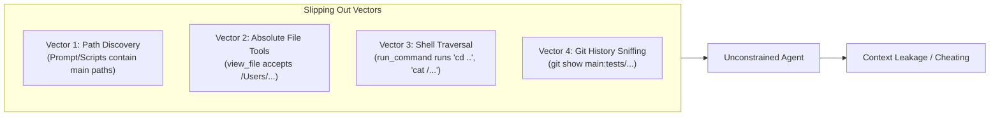
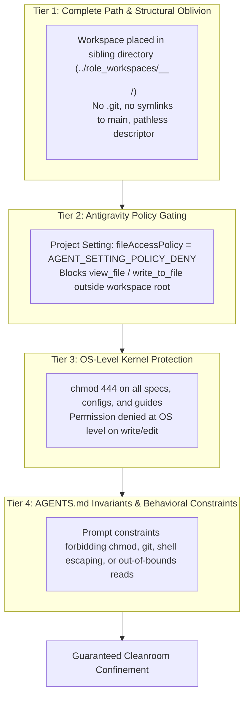
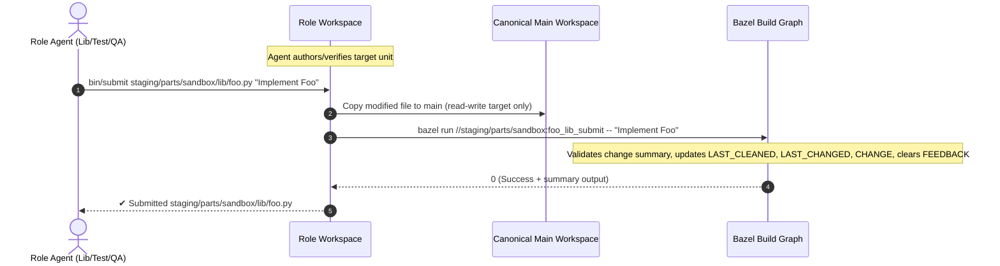
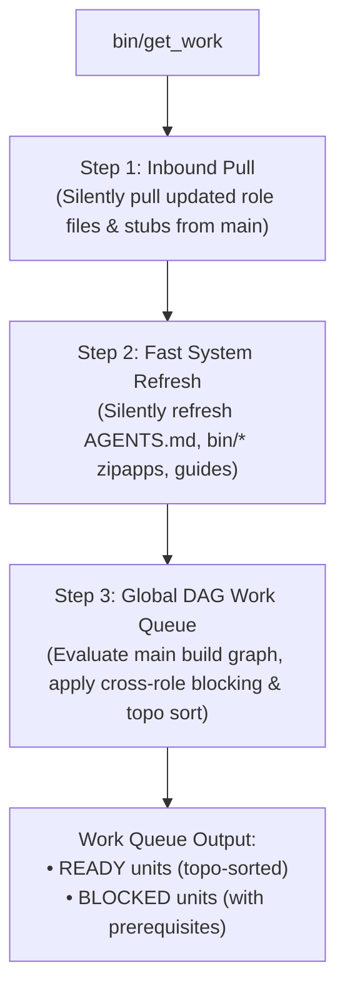
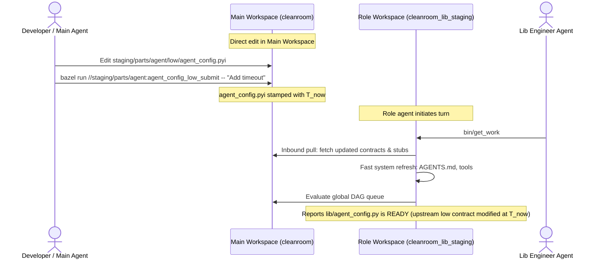

# Subagentless Cleanroom: Convention-Driven Zero-Sync Isolated Role Workspaces Architecture

This document specifies the permanent, production architecture for executing Cleanroom software construction workflows in Google Antigravity **without subagents**, utilizing convention-driven isolated role workspaces, conversational chat sessions, direct Bazel-backed mutations, in-band source metadata, and deterministic filesystem gating.

> [!NOTE]
> **Cleanroom Cleaning Paradigms — Option 3 (Primary Antigravity Architecture)**:
> This document specifies **Subagentless Cleanroom Workspaces**, representing **Option 3** of Cleanroom's three cleaning paradigms (see [Cleanroom Cleaning Paradigms](file:///Users/seanmcdirmid/projects/cleanroom/design-docs/cleaning_paradigms.md)).
> 
> - **Comparison to Other Paradigms**:
>   - **Option 1 (Headless Loop)**: Autonomous in-process runner using the OpenAI API for unattended CI/batch execution (`parts/loop`, `parts/openai`).
>   - **Option 2 (Antigravity Subagents via Server + Exec)**: Historical in-tree subagent hierarchy where subagents executed Python CLI commands into a local HTTP server. Decommissioned due to extreme token costs and quota exhaustion under Google One Ultra (see [Antigravity Integration Post-Mortem](file:///Users/seanmcdirmid/projects/cleanroom/design-docs/antigravity_integration_failed.md)).
>   - **Option 3 (This Architecture)**: Isolated sibling workspaces (`../role_workspaces/<workspace-name>_<role>_<sanitized-dir>`) with separate conversational chats in the Antigravity IDE. It is the **primary production architecture** for interactive Cleanroom development, achieving maximum prompt-cache efficiency, direct Bazel mutations, and zero subagent tax.

---

## 1. Executive Summary & Problem Statement

### 1.1 The Subagent Token Economics Crisis
Cleanroom enforces mathematical isolation across specification, implementation, and test creation. In the initial Antigravity integration, this was implemented via a **Tiered Sub-Agent Architecture** (Tier-1 Main Chat $\to$ Tier-2 Coordinator Subagent $\to$ Tier-3 Worker Subagents).

Under personal Google One Ultra plans, this architecture created severe token inefficiencies:
1. **Subagent Instantiation Tax**: Each `invoke_subagent` call initializes a fresh conversation context, injecting large system prompts, user rules, and MCP tool schemas.
2. **Coordination Loop Overhead**: The Coordinator subagent runs continuous polling/turn cycles, parsing worker messages and telemetry, which multiplies high-tier token consumption.
3. **Billing Disparity**: In the Google Ultra tier, autonomous subagent executions deplete quotas and incur token penalties at significantly higher rates than standard interactive conversation chat turns.

### 1.2 Evolution from External Sync to Zero-Sync
In earlier subagentless prototypes, cross-workspace coordination relied on an external synchronization command (`bin/cleanroom-sync`), intermediate local JSON buffers (`.cleanroom_audit_buffer.json`, `.cleanroom_blame_buffer.json`), and explicit configuration files (`.cleanroom_role.json`) containing host path strings (`"main_workspace_root"`).

While functional, that intermediate architecture introduced coordination lag, host path leakage, and buffer reconciliation overhead.

The **Convention-Driven Zero-Sync Architecture** permanently replaces external synchronization sweeps and local buffers with:
1. **Pathless Role Descriptors & Relative Convention Discovery**: No host paths are stored in role workspaces. The main workspace is resolved strictly via convention (`../../<workspace_name>`).
2. **Bazel-Backed Direct Mutations (`submit`, `blame`, `fail`)**: Role tool commands immediately mutate the canonical repository via Bazel macro targets (`*_submit`, `*_blame`, `*_fail`), returning instantaneous console feedback directly to the role agent.
3. **Self-Synchronizing `bin/get_work`**: Role agents run `bin/get_work` at the start of each turn, which silently pulls updated role files from `main`, refreshes system files, and evaluates the global DAG work queue from the main build graph.
4. **Multi-Unit Processing Loop**: Role agents work through and submit all ready units sequentially within their turn until all units in scope are clean.
5. **Unified Main Workspace Lifecycle CLI (`bin/cleanroom`)**: `cleanroom-sync` is permanently retired in favor of `bin/cleanroom` (`commission`, `decommission`, `refresh`, `refresh-sys`, `dirty`, `clean`, `work-queue`).

---

## 2. Antigravity Agent Confinement & Isolation Analysis

### 2.1 The Four Vulnerability Vectors
By default, an AI agent in Antigravity is not contained in a secure operating system container or `chroot` jail. If unconstrained, an agent can slip out of its designated workspace directory through four primary vectors:



1. **Path Discovery & Absolute Tool Invocations**: Native file tools (`view_file`, `write_to_file`, `replace_file_content`) accept `AbsolutePath`. If the agent learns the canonical repo path, it could attempt to read files from the main repo.
2. **Default Project File Access Policy**: Projects default to `"fileAccessPolicy": "AGENT_SETTING_POLICY_ALLOW"`, which permits accessing files outside the workspace root.
3. **Unrestricted Shell Execution (`run_command`)**: Agents have access to a zsh shell.
4. **Git Object Graphs (`.git`)**: If a workspace is a git clone or worktree, git history sniffs allow bypassing blind testing.

### 2.2 The Four-Tier Confinement Defense
To make role workspaces impenetrable without subagent overhead, Cleanroom implements a defense-in-depth model across four independent layers:



#### Tier 1: Complete Structural & Path Oblivion
- **Isolated Directory Location**: Role workspaces reside outside the main repository in a dedicated container directory (`../role_workspaces/<workspace-name>_<role>_<sanitized-dir>/`).
- **No Git Metadata**: Role workspaces contain **no `.git` directory or worktree link**.
- **Pathless Descriptor**: The workspace descriptor (`.cleanroom_role.json`) contains zero filesystem paths:
  ```json
  {
    "role_address": "//update_python_with_ai:lib",
    "role_name": "lib",
    "parts_dir": "staging"
  }
  ```

#### Tier 2: Antigravity Engine-Level Policy Enforcement
- Commissioning registers a project configuration in `~/.gemini/config/projects/<workspace_hash>.json` with:
  ```json
  {
    "settings": {
      "fileAccessPolicy": "AGENT_SETTING_POLICY_DENY",
      "sandboxMode": false
    },
    "isWorkspaceOnly": true
  }
  ```
- Antigravity's tool dispatcher intercepts any call to `view_file`, `write_to_file`, or `replace_file_content` targeting paths outside the role workspace and rejects them immediately.

#### Tier 3: OS-Level Filesystem Hardening
- All contract files (`grounding/*.pyi`, `low/*.pyi`), guides (`low_to_lib.md`), and build manifests (`BUILD.bazel`) are set to read-only mode (`chmod 444`).
- Any attempt by `replace_file_content`, `write_to_file`, or shell redirection (`>`) to alter these files triggers an OS-level `Permission denied` error.

#### Tier 4: Workspace Invariants (`AGENTS.md`)
- The workspace root contains a role-tailored `AGENTS.md` enforcing:
  1. Confinement strictly to the workspace directory.
  2. Absolute prohibition against running `chmod`, `chown`, or altering file permissions.
  3. Absolute prohibition against executing `git` commands (`git status`, `git diff`, etc.).
  4. Mandatory execution of `bin/get_work` before taking any other action.
  5. Mandatory processing and sequential submission of all ready units within the turn.

---

## 3. Directory Layout & Relative Convention Discovery

### 3.1 Sibling Workspace Layout
Role workspaces strictly follow the conventional sibling filesystem layout:

```text
<projects_root>/
├── <workspace_name>/                         # Canonical Main Workspace (e.g. cleanroom)
│   ├── bin/
│   │   └── cleanroom                         # Main lifecycle CLI (commission, decommission, refresh-sys)
│   ├── update_with_ai/                       # Canonical specs, tools, and libraries
│   ├── update_python_with_ai/                # Canonical Python guides and tools
│   └── staging/                              # Ephemeral testbed / target parts
└── role_workspaces/                          # Dedicated sibling directory for all role instances
    ├── <workspace_name>_<role_short>_<dir>/  # e.g. cleanroom_lib_staging
    │   ├── bin/                              # Opaque zipapp binaries: get_work, submit, blame, fail
    │   ├── .cleanroom_role.json              # Pathless role descriptor (role_address, role_name, parts_dir)
    │   ├── AGENTS.md                         # Role-specific instructions and constraints
    │   └── staging/                          # Mirrored part files (read-only upstream, read-write targets)
    ├── <workspace_name>_<role_short>_<dir>/  # e.g. cleanroom_test_staging
    └── ...
```

### 3.2 Relative Discovery Algorithm
Inside any role workspace, helper binaries resolve the canonical main workspace via convention:

```python
def resolve_main_workspace_from_convention(cwd: Optional[str] = None) -> Tuple[str, str, str, str]:
    """Resolves (main_workspace_root, workspace_name, role_address, dir_scope) from convention and descriptor."""
    curr = os.path.realpath(cwd or os.getcwd())
    
    role_ws_dir = curr
    while role_ws_dir and role_ws_dir != os.path.dirname(role_ws_dir):
        parent = os.path.dirname(role_ws_dir)
        if os.path.basename(parent) == "role_workspaces":
            break
        role_ws_dir = parent
    else:
        raise RuntimeError("Current workspace is not located inside a 'role_workspaces' directory.")

    role_ws_name = os.path.basename(role_ws_dir)
    projects_root = os.path.dirname(os.path.dirname(role_ws_dir))
    
    cfg_file = os.path.join(role_ws_dir, ".cleanroom_role.json")
    role_address = ""
    dir_scope = ""
    if os.path.isfile(cfg_file):
        try:
            with open(cfg_file, "r", encoding="utf-8") as f:
                data = json.load(f)
                role_address = data.get("role_address", "")
                dir_scope = data.get("parts_dir", "")
        except Exception:
            pass

    # Infer main workspace name by stripping the _<role>_<dir> suffix
    parts = role_ws_name.split("_")
    ws_name = parts[0]
    main_root = os.path.join(projects_root, ws_name)
    if not os.path.isdir(main_root):
        raise RuntimeError(f"Canonical main workspace not found at conventional path: {main_root}")

    return main_root, ws_name, role_address, dir_scope
```

---

## 4. Bazel-Backed Direct Mutations

In the zero-sync architecture, role workspaces do not buffer modifications or blame records. All state mutations execute directly against the canonical main workspace via hermetic Bazel targets.



### 4.1 Producer Submissions (`bin/submit <target_file> "[summary]"`)
For producer roles (`high`, `planning`, `low`, `grounding`, `lib`, `test`):
1. **Change Validation**:
   - Compares the workspace file against canonical main.
   - If code was modified: **requires** a non-empty change summary (rejects empty summary).
   - If code was not modified: **rejects** an unprompted change summary (verifies file is already clean).
2. **Atomic Main Copy**: Copies the modified file to the canonical path in main.
3. **Bazel Target Execution**: Delegates to `bazel run //pkg:unit_role_submit -- "[summary]"`.
4. **Header Stamping**: Advances `LAST_CLEANED` and `LAST_CHANGED` to UTC now, records `CHANGE:`, updates `CODE_HASH:`, and clears resolved `FEEDBACK:` and `DIRTY:` markers.

### 4.2 Auditor Submissions (`bin/submit <target_file>`)
For auditor roles (`spec_qa`, `low_qa`, `qa`, `coverage`):
1. Verifies verification pass criteria via `bin/check_files` (which executes role linters, tests, or statement coverage).
2. Delegates to submission coordinator to stamp `<ROLE>_AUDIT: <timestamp>` into the target file header in canonical main without altering `LAST_CHANGED` or code contents.

### 4.3 Direct Upstream Blame (`bin/blame <culprit-file> "<critique>"`)
When a defect in an upstream contract or dependency is discovered:
1. Resolves the culprit unit and role.
2. Directly executes `bazel run //pkg:culprit_blame -- "<critique>"`.
3. Injects the critique into the culprit's in-band `FEEDBACK:` section in canonical main and advances its `LAST_CLEANED` timestamp, immediately making the culprit unit dirty across the repository.
4. Requires zero local buffer files (`.cleanroom_blame_buffer.json` is completely eliminated).

### 4.4 Failure Diagnostics (`bin/fail <target_file> "<reason>"`)
When local verification cannot pass due to an unresolvable failure:
1. Executes `bazel run //pkg:unit_fail -- "<reason>"`.
2. Clears `LAST_CLEANED` from the target header in canonical main and stamps failure diagnostics, maintaining persistent dirty status until resolved.

---

## 5. Self-Synchronizing `bin/get_work` & Global DAG Queue

### 5.1 Three-Step Execution Flow
When a role agent runs `bin/get_work`:



1. **Step 1: Silent Inbound Pull**:
   - Pulls newly materialized templates, blamed files, and updated read-only contracts from `main` into the calling role workspace.
   - Preserves locally modified writable files that have not yet been submitted.
   - For `test` roles, ensures `lib/*.py` files are strictly synthesized as read-only interface stubs (`chmod 444`), never leaking implementation code.
2. **Step 2: Fast System Refresh**:
   - Checks modification timestamps of system files (`AGENTS.md`, `bin/*` tools, role guides) against canonical main.
   - Refreshes outdated system files automatically without requiring manual intervention.
3. **Step 3: Global DAG Queue Evaluation**:
   - Evaluates the repository build graph against canonical `main_root` where all roles' artifacts are present.
   - Prevents false-positive dirtiness caused by missing non-role directories in single-role workspaces.

### 5.2 Dependency-Aware Queue Rules
- **Cross-Role Dependency Blocking**: A unit is blocked if any of its upstream role dependencies (`role_deps`, `star_role_deps`, `feedback_role_deps`) are dirty.
- **Intra-Role Dependency Allowing**: A unit is eligible for work if its only dirty dependencies belong to the **same** role.
- **Auditor Feedback Blocking**: An auditor role (`spec_qa`, `low_qa`, `qa`, `coverage`) is blocked if any of its feedback targets are dirty or have unacted `FEEDBACK:`.
- **Topological Sorting**: Multiple ready units within the same role are returned in topological dependency order ($dependency \to dependent$).

### 5.3 Multi-Unit Processing Loop
In `AGENTS.md`, the prescribed tool sequence enforces draining the entire ready queue within the turn:

```markdown
## Prescribed Tool Sequence
Your turn should consist strictly of:
1. Run `bin/get_work` to synchronize with main, inspect dirty units requiring work, and check unacted feedback.
2. Select the target unit (either the first ready unit from `bin/get_work` or the specific unit requested out-of-band). Follow the companion guide to review upstream contracts and inspect or author the target file.
3. Author or update the target file using file editing tools (`replace_file_content` or `write_to_file`).
4. Run local verification suite.
5. Submit your verified work:
   - If workspace files were modified: `bin/submit <target_file> "<concise change summary>"`
   - If no workspace files were modified: `bin/submit <target_file>`
   (or run `bin/blame <culprit-file> "<critique>"` if an upstream specification defect is discovered)
   (or run `bin/fail <target_file> "<reason>"` if unresolved test failure)
6. Loop over remaining ready units:
   - After submitting or resolving the current unit, repeat steps 1–5 for each remaining ready unit returned by `bin/get_work`.
   - Re-run `bin/get_work` after each submission to inspect newly ready or remaining units.
   - Continue processing ready units until `bin/get_work` reports that all units in scope are clean (or no ready units remain), then report your completed work and terminate your turn.
```

---

## 6. Main Workspace Management CLI: `bin/cleanroom`

All workspace lifecycle, inspection, and dirtiness operations in the canonical main workspace are unified under `bin/cleanroom`:

```bash
# Commission a role workspace for a specific directory scope
bin/cleanroom commission <role_target> <dir_scope>
# Example: bin/cleanroom commission //update_python_with_ai:lib staging

# Decommission an active role workspace
bin/cleanroom decommission <role_target> <dir_scope> [--force]

# Inspect dirty status across all units in scope
bin/cleanroom dirty [dir_scope] [--role <role>]
# Example: bin/cleanroom dirty staging

# Refresh files across all commissioned role workspaces
bin/cleanroom refresh [dir_scope]

# Refresh system files (AGENTS.md, bin/*, configs) across all workspaces
bin/cleanroom refresh-sys [dir_scope]

# Inspect ready and blocked queue items for a specific role
bin/cleanroom work-queue <role> [dir_scope]

# Clean a specific unit or batch clean a directory scope
bin/cleanroom clean [target] [dir_scope]
```

### 6.1 Deterministic Scoped Dirty Inspection (`bin/cleanroom dirty`)

`bin/cleanroom dirty` evaluates the exact dependency DAG across any directory scope (e.g., `staging`, `update_with_ai`):

```text
=== Cleanroom Dirty Status [Scope: staging] ===
Found 2 dirty unit(s) across 1 part(s):

  • [DIRTY - LIB] staging/parts/sandbox/lib/sandbox_file_editor_impl.py
      - Upstream contract staging/parts/sandbox/low/sandbox_file_editor_impl.pyi modified after LAST_CLEANED

  • [DIRTY - TEST] staging/parts/sandbox/tests/sandbox_file_editor_impl_test.py
      - Header missing LAST_CLEANED in staging/parts/sandbox/tests/sandbox_file_editor_impl_test.py
```

If all units in scope are clean:
```text
=== Cleanroom Dirty Status [Scope: staging] ===
✔ CLEAN: All units in 'staging' are completely clean across all roles.
```

### 6.2 CLI Command Summary

| Command | Arguments | Behavior |
| :--- | :--- | :--- |
| **`commission`** | `<role_address> <dir>` | Creates `../role_workspaces/<ws>_<role>_<dir>`, configures pathless `.cleanroom_role.json`, registers AGY policy, copies read-only tools and specs (`chmod 444`), materializes templates, and performs initial pull. |
| **`decommission`** | `<role_address> <dir> [--force]` | Verifies workspace is clean (warns if unsubmitted edits exist), removes directory cleanly via `shutil.rmtree`, and unregisters workspace. |
| **`dirty`** | `[dir] [--role <role>]` | Recursively evaluates in-band comment headers across all parts in scope; reports dirty units and exact timestamp/feedback causes. |
| **`refresh`** | `[dir]` | One-way syncs canonical files, contracts, and templates into all commissioned workspaces in scope. |
| **`refresh-sys`** | `[dir]` | Fast-refreshes `AGENTS.md`, `bin/*` tool zipapps, and role guides across all commissioned workspaces without copying source trees. |
| **`work-queue`** | `<role> [dir]` | Evaluates the global DAG build graph and prints topologically sorted ready and blocked units for the specified role. |
| **`clean`** | `[target] [dir]` | Marks units clean directly in canonical main by updating `LAST_CLEANED` and clearing feedback. |

---

## 7. Canonical Main Workspace Operations & Symmetrical Architecture

Cleanroom software construction relies on strict directed acyclic graph (DAG) invariants across specification, planning, contract, grounding, implementation, and testing. While isolated role workspaces (`../role_workspaces/`) provide mathematical confinement for double-blind authoring, developers and AI pair programmers also work **directly inside the Main Canonical Workspace**.

### 7.1 Direct Main Workspace Operations & Header Stamping

When working directly in the main repository (e.g., editing files in `update_with_ai/` or `staging/`):
1. **Metadata Integrity & Header Stamping**: In-band comment headers remain synchronized, valid, and monotonically increasing during direct edits.
2. **Preservation of Non-Code Directives**: Executable scripts containing a shebang (`#!/usr/bin/env python3`) or encoding comment retain them on line 1. The Cleanroom metadata block immediately follows.
3. **Deterministic Metadata Parsing**: `src_metadata.py` extracts existing blocks with complete fidelity, ensuring comments, imports, and docstrings outside the metadata delimiters are untouched.
4. **Direct Canonical Resolution via Bazel**: Submissions, critiques, and failures execute directly against canonical files using Bazel macro targets with identical semantics to role workspace binaries:
   ```bash
   # Producer roles: stamps LAST_CLEANED, LAST_CHANGED, updates CHANGE, clears FEEDBACK
   bazel run //staging/parts/sandbox:sandbox_file_editor_impl_lib_submit -- "Implement EditManager"

   # Auditor roles: stamps QA_AUDIT or COVERAGE_AUDIT tag
   bazel run //staging/parts/sandbox:sandbox_file_editor_impl_qa_submit

   # Blame upstream contract: injects FEEDBACK into upstream contract and advances its LAST_CLEANED
   bazel run //staging/parts/sandbox:sandbox_file_editor_impl_blame -- "Contract missing parameter 'tier'"

   # Record verification failure: clears LAST_CLEANED to keep node persistently dirty
   bazel run //staging/parts/sandbox:sandbox_file_editor_impl_fail -- "Type check failed on abstract method resolution"
   ```

### 7.2 Main-to-Role Workspace State Flow

Direct modifications in the Main Workspace and work conducted in isolated role workspaces reinforce each other seamlessly:



1. **Propagation of Main Workspace Edits**:
   - A developer edits `low/agent_config.pyi` directly in main and submits it via Bazel.
   - When role agents execute `bin/get_work`, updated contracts and synthesized stubs are pulled silently into the role workspace.
   - `bin/get_work` detects that `low/agent_config.pyi` was modified after `lib/agent_config.py` was cleaned, returning `lib/agent_config.py` as a ready task.
2. **Propagation of Main Workspace Critique & Feedback**:
   - A developer blames a node in main: `bazel run //pkg:unit_blame -- "Missing error handling"`.
   - The Bazel target injects the critique into `FEEDBACK:` and advances `LAST_CLEANED = T_now`.
   - The next time the culprit role runs `bin/get_work`, the updated file with its embedded feedback is pulled in and flagged as ready. No manual synchronization commands are needed.

### 7.3 Symmetrical Architecture: Main Canonical Workspace vs. Confined Role Workspaces

| Capability | In Confined Role Workspaces (`../role_workspaces/`) | In Main Canonical Workspace |
| :--- | :--- | :--- |
| **Workspace Scope** | Single role, single directory (`cleanroom_lib_staging`) | Full repository / multi-directory |
| **Inspection Tool** | `bin/get_work` (self-syncing, global DAG evaluation) | `bin/cleanroom dirty [dir]` / `bin/cleanroom work-queue <role>` |
| **Submission Tool** | `bin/submit <file> "[summary]"` | `bazel run //pkg:unit_role_submit -- "[summary]"` |
| **Blame Tool** | `bin/blame <culprit-file> "<critique>"` | `bazel run //pkg:unit_blame -- "<critique>"` |
| **Failure Tool** | `bin/fail <file> "<reason>"` | `bazel run //pkg:unit_fail -- "<reason>"` |
| **State Source of Truth** | In-band source metadata headers | In-band source metadata headers |
| **Lifecycle Coordination** | Silent inbound pull on `bin/get_work` | `bin/cleanroom` CLI (`commission`, `decommission`, `refresh-sys`) |

---

## 8. Double-Blind Verification & Stub Synthesis

### 8.1 Test Role Stub Generation
When commissioning or synchronizing a **Test Role Workspace**:
1. The workspace generator reads `stub_role_deps = [":lib"]`.
2. For every active unit, instead of copying the real `lib/{unit_name}.py`, it synthesizes a **Read-Only Interface Stub** derived from `{unit_dir}/low/{unit_name}.pyi`.
3. The generated stub file:
   - Contains all imports, class declarations, method signatures, parameter names, and type annotations matching the contract.
   - Includes an explicit Cleanroom header:
     ```python
     # Requirements specified in {unit_name}.pyi
     # CLEANROOM TEST STUB: Implementation details omitted. Refer strictly to companion .pyi file.
     ```
   - Replaces method bodies with:
     ```python
     raise NotImplementedError("Cleanroom Test Stub: Behavior specified in .pyi")
     ```
   - Is written to `{unit_dir}/lib/{unit_name}.py` with **`chmod 444`**.
4. **Outcome**:
   - `pyright` passes type checking because all symbols and type annotations exist.
   - Bazel target `:{unit_name}_test_type_check` succeeds.
   - The test authoring agent **cannot see a single line of real implementation code**, eliminating test-to-implementation overfitting.

### 8.2 Lib Verification Without Unit Tests
In Cleanroom, the implementer writes code against the **formal specification**, not to satisfy unit test cases:
1. The Lib agent runs `pyright lib/` to verify that all method signatures, parameter types, and return values strictly adhere to `low/*.pyi` and `grounding/*.py`.
2. The Lib agent runs Cleanroom code linters (`lib_lint.py`).
3. The Lib agent does **not** execute unit tests. Test verification is deferred to the QA phase in the Main Workspace or QA role workspace.

---

## 9. Threat Model & Confinement Guarantees

| Threat Vector | Potential Agent Behavior | Cleanroom Defense Mechanism |
| :--- | :--- | :--- |
| **Reading Tests from Lib** | Agent attempts `view_file` on `tests/*_test.py` | `tests/` does not exist in the Lib workspace. Antigravity policy blocks access to paths outside workspace. |
| **Writing to Spec to Pass Tests** | Agent attempts to relax low `.pyi` or grounding `.py` contract | File is `chmod 444`. OS returns `PermissionError`. `AGENTS.md` forbids `chmod`. |
| **Stealth Modifying BUILD** | Agent attempts to delete test targets from `BUILD.bazel` | `BUILD.bazel` is `chmod 444`. |
| **Tampering via chmod** | Agent runs `chmod +w` via `run_command` | Host checks baseline SHA-256 hashes on inbound pull; aborts with error if read-only files were modified. |
| **Git Sniffing** | Agent runs `git log` or `git show` to read counterpart code | Role workspace has no `.git` directory; git commands fail with "fatal: not a git repository". |
| **Path Traversal via Configs** | Agent reads `.cleanroom_role.json` to find host paths | Descriptor is pathless; contains only `role_address`, `role_name`, `parts_dir`. |
| **Single-Unit Turn Stalling** | Agent cleans one unit and waits for user prompt | `AGENTS.md` mandates looping through and submitting all ready units sequentially within the turn until clean. |

---

## 10. Production Artifacts & Verified Status

All zero-sync Cleanroom workspace components are implemented, hermetically verified, and actively operational:
1. `update_with_ai/parts/workspace/`: Core workspace lifecycle engine (`workspace_tool.py`, `workspace_tool_impl.py`, `workspace_sync_impl.py`, `workspace_provision_impl.py`, `workspace_registry_impl.py`, `workspace_work_impl.py`).
2. `update_with_ai/parts/control/`: Canonical in-band metadata management (`src_metadata.py`), submission validation (`control_submit_impl.py`), and defect blame attribution (`control_attribution_impl.py`).
3. `update_with_ai/parts/tools/`: Deterministic statement test coverage evaluation (`tool_coverage.py`, `tool_coverage_impl.py`).
4. `update_with_ai/support/lib/cleanroom_role_tool.py`: Ultra-slim entrypoint shim ($\le 50$ lines, exactly 45 lines) executing role workspace binaries (`get_work`, `check_files`, `submit`, `blame`, `fail`) within the `agent_session` tier.
5. `bin/cleanroom`: Primary lifecycle CLI in the canonical main workspace.
6. `update_with_ai/parts/workspace/tests/`: Comprehensive test suites verifying provisioning, synchronizing, registry parsing, work queue computation, and tool execution (`bazel test //update_with_ai/parts/workspace/tests:all`).
7. `update_with_ai/parts/tools/tests/`: Unit test suite verifying AST statement filtering, trace instrumentation, span grouping, and coverage evaluation (`bazel test //update_with_ai/parts/tools/tests:all`).
8. `update_with_ai/parts/control/tests/`: Unit test suite verifying in-band metadata parsing, dirty evaluation, submission gating, and blame attribution (`bazel test //update_with_ai/parts/control/tests:all`).
