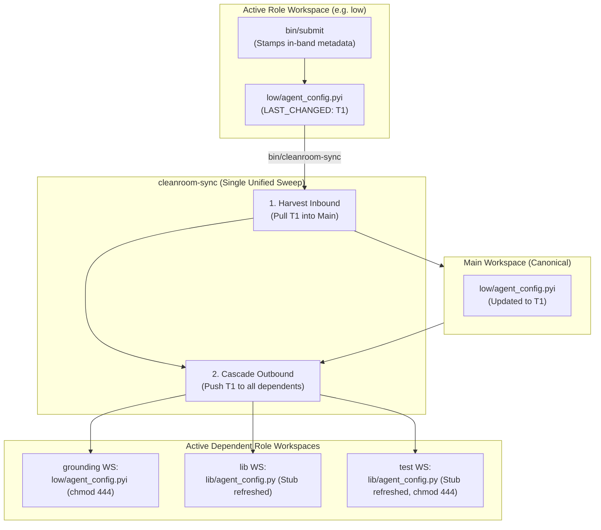

# Subagentless Workspace Upgrade: Declarative Multi-Workspace Synchronization via In-Band Source Metadata

> [!IMPORTANT]
> **Status: ARCHITECTURAL UPGRADE SPECIFICATION & ROADMAP**
> This document specifies the comprehensive upgrade plan for Cleanroom's primary interactive Antigravity architecture—**Subagentless Cleanroom Workspaces (Option 3)**.
> It completely supersedes and replaces `cleanroom_sync_metadata_architecture.md`. Once implemented, its changes will be merged back as the permanent baseline in [`subagentless_cleanroom_workspaces.md`](file:///Users/seanmcdirmid/projects/cleanroom/design-docs/subagentless_cleanroom_workspaces.md).

---

## 1. Executive Summary & Problem Statement

Cleanroom isolates software authoring across specifications, planning, low-level contracts, implementations, and tests using independent, pre-confined filesystem workspaces (`../role_workspaces/`). This **Subagentless Cleanroom Workspaces** architecture (Option 3 of [Cleanroom Cleaning Paradigms](file:///Users/seanmcdirmid/projects/cleanroom/design-docs/cleaning_paradigms.md)) is our primary production development model for interactive AI pair-programming in Google Antigravity.

### 1.1 The Disconnect Between Upstream Engine & Workspace Tooling
The Cleanroom core engine (`parts/loop`, `parts/dag`, `parts/bazel`) has completed three monumental architectural milestones:
1. **In-Band Source Metadata Migration**: All out-of-band `.update_with_ai.textproto` files have been removed from the repository. State is embedded directly into source headers via `src_metadata.py` ([`in_band_source_metadata.md`](file:///Users/seanmcdirmid/projects/cleanroom/design-docs/in_band_source_metadata.md)).
2. **Elimination of Reverse Dependencies**: Reverse dependency tracking (`reverse_dependencies`, `storage.clear_dependents`, `storage.register_dependent`) has been completely excised. Dirtiness is evaluated dynamically in the forward direction.
3. **Logless Auditor Architecture**: Auditor roles (`grounding_qa`, `qa`, `coverage`) operate with empty source patterns (`src_pattern = ""`), certifying upstream targets directly and stamping co-located `<ROLE>_AUDIT: <timestamp>` tags instead of producing synthetic 0-byte `.log` files in `logs/` directories ([`auditor_roles_and_dirtiness_architecture.md`](file:///Users/seanmcdirmid/projects/cleanroom/design-docs/auditor_roles_and_dirtiness_architecture.md)).

**However, the workspace synchronization tooling (`cleanroom_workspace_tool.py` and `bin/cleanroom-sync`) has not yet been upgraded**:
- It still attempts to load and write `.update_with_ai.textproto` files.
- It still relies on file-based mailbox queues (`WORK_ORDER.md` and `COMPLETED.md`) protected by POSIX `fcntl.flock`.
- It still supports a legacy `--all` mode relying on flaky filesystem modification times (`mtime`).
- It creates monolithic role workspaces (`../role_workspaces/<ws>_<role>`) rather than cleanly scoped, single-directory workspaces.
- Role agents inside role workspaces have no deterministic command to inspect dirty targets locally.

### 1.2 The Objective: The Subagentless Workspace Upgrade
This document specifies the end-to-end plan to upgrade `cleanroom_workspace_tool.py` and `bin/cleanroom-sync` to natively operate on in-band source metadata, directory-scoped workspace commissioning, logless auditors, and omni-directional cascade synchronization.



---

## 2. Target Workspace Topology & Naming

### 2.1 Strict Single-Directory Scoping
In the legacy tool, role workspaces could span arbitrary subtrees or the whole repository, leading to massive file copies and ambiguous context.

The upgraded architecture enforces a strict **single-directory rule**:
> **Each role workspace is provisioned for exactly one directory scope.**

If a developer or agent is working on `staging`, they commission workspaces specifically for `staging`. If working on `update_with_ai/parts/sandbox`, they commission workspaces specifically for that component.

### 2.2 Standardized Directory Naming Convention
Role workspaces are placed in the sibling `../role_workspaces/` container directory following a uniform, human-readable three-tuple pattern:

$$\text{Path} = \texttt{../role\_workspaces/}\langle\text{main-workspace-name}\rangle\_\langle\text{role-name}\rangle\_\langle\text{sanitized-dir-name}\rangle$$

Where:
- $\langle\text{main-workspace-name}\rangle$: Base name of the canonical repo (e.g., `cleanroom`).
- $\langle\text{role-name}\rangle$: The Cleanroom role (e.g., `low`, `grounding`, `lib`, `test`, `qa`).
- $\langle\text{sanitized-dir-name}\rangle$: The directory scope with slashes replaced by underscores (e.g., `staging` or `update_with_ai_parts_sandbox`).

#### Examples:
| Main Workspace | Role | Directory Scope | Resulting Workspace Folder |
| :--- | :--- | :--- | :--- |
| `cleanroom` | `low` | `staging` | `../role_workspaces/cleanroom_low_staging` |
| `cleanroom` | `grounding` | `staging` | `../role_workspaces/cleanroom_grounding_staging` |
| `cleanroom` | `lib` | `staging` | `../role_workspaces/cleanroom_lib_staging` |
| `cleanroom` | `test` | `staging` | `../role_workspaces/cleanroom_test_staging` |
| `cleanroom` | `qa` | `staging` | `../role_workspaces/cleanroom_qa_staging` |
| `cleanroom` | `lib` | `update_with_ai/parts/agent` | `../role_workspaces/cleanroom_lib_update_with_ai_parts_agent` |

### 2.3 Workspace Manifest (`.cleanroom_role.json`)
The root of each role workspace stores an immutable configuration manifest:
```json
{
  "main_workspace": "cleanroom",
  "role_name": "lib",
  "parts_dir": "staging",
  "role_address": "//update_python_with_ai:lib",
  "commissioned_at": "2026-10-04T12:00:00Z",
  "last_sync_timestamp": "2026-10-04T12:00:00Z"
}
```
Where `last_sync_timestamp` establishes the verified baseline for Phase 3 Conflict Detection across subsequent synchronization sweeps.

---

## 3. Simplified CLI Lifecycle (`bin/cleanroom-sync`)

The CLI is collapsed into three clear lifecycle primitives:

```bash
# 1. Commission a new role workspace for a specific directory scope
bin/cleanroom-sync commission <role> <directory>

# 2. Decommission an active role workspace when work is finished
bin/cleanroom-sync decommission <role> <directory> [--force]

# 3. Omni-directional cascade synchronization (Default: zero arguments or 'sync')
bin/cleanroom-sync
bin/cleanroom-sync sync
```

### 3.1 Workspace Commissioning (`commission`)
- **Positional Arguments**:
  - `ROLE`: The role to provision (`high`, `planning`, `low`, `grounding`, `lib`, `test`, `grounding_qa`, `qa`, `coverage`).
  - `DIR`: Target parts or package directory (e.g., `staging`, `update_with_ai/parts/sandbox`).
- **Actions Performed**:
  1. Creates container folder `../role_workspaces/<workspace>_<role>_<sanitized-dir>`.
  2. Writes persistent `.cleanroom_role.json` and records entry in `.cleanroom_workspaces.json`.
  3. Copies role-specific read-only tools and linters into role workspace `bin/` (`bin/get_work`, `bin/submit`, `bin/blame`, `bin/fail`, `bin/cleanroom-dirty`).
  4. Generates role-tailored `AGENTS.md` and Antigravity project configuration (`fileAccessPolicy: AGENT_SETTING_POLICY_DENY`).
  5. Copies read-only upstream specifications and contracts with `chmod 444`.
  6. Materializes initial writable source files (or read-only interface stubs for `test`).

### 3.2 Workspace Decommissioning (`decommission`)
- **Positional Arguments**:
  - `ROLE`: The role to retire.
  - `DIR`: Target directory scope.
  - `--force`: (Optional) Bypass dirty check warning.
- **Safety Checks**:
  1. Evaluates local in-band metadata via `bin/get_work`.
  2. If unsubmitted changes or unacted feedback exist, halts with dirty warning unless `--force` is supplied.
  3. Safely removes the workspace folder from `../role_workspaces/` and unregisters it from `.cleanroom_workspaces.json`.

### 3.3 Omni-Directional Cascading Sync (Default Execution)
Invoking `bin/cleanroom-sync` without arguments triggers a complete, topologically ordered sweep across all commissioned workspaces:
1. **Phase 1: Inbound Harvest**:
   - Compares in-band timestamps (`LAST_CLEANED`, `LAST_CHANGED`, `<ROLE>_AUDIT`) across all active role workspaces against canonical main.
   - Copies newer verified files into the canonical repository.
2. **Phase 2: Outbound Cascade (In the same atomic pass)**:
   - Pushes newly updated canonical files and specifications down into all active dependent role workspaces:
     - Spec roles receive updated upstream specs (`chmod 444`).
     - Implementation roles receive updated contracts (`chmod 444`).
     - Test roles receive regenerated read-only interface stubs (`chmod 444`).
3. **Phase 3: Conflict Detection**:
   - If both the role file and the canonical file were modified independently after the last sync ($T_{\text{role}} > T_{\text{last\_sync}} \land T_{\text{canonical}} > T_{\text{last\_sync}} \land \text{Hash}_{\text{role}} \neq \text{Hash}_{\text{canonical}}$), halts synchronization for that unit with actionable conflict diagnostics.

---

## 4. In-Band Metadata Stamping & Local Toolsuite

All mailbox files (`WORK_ORDER.md`, `COMPLETED.md`) and POSIX file locking (`fcntl.flock`) are permanently eliminated. Instead, role workers and agents interact directly with in-band source headers via dedicated helper tools in `bin/`:

### 4.1 Local Deterministic Dirty Checker: `bin/get_work` (`bin/cleanroom-dirty`)
When invoked inside a role workspace:
1. Reads `.cleanroom_role.json` to identify its assigned role and directory scope.
2. Parses in-band headers of all files matching that role in the directory scope.
3. Evaluates forward dependency dirtiness:
   $$\text{is\_dirty}(N) \iff (\exists D \in \text{ForwardDeps}(N) : N.\text{last\_cleaned} < D.\text{last\_changed}) \quad \lor \quad \text{has\_feedback}(N)$$
4. For auditor roles, evaluates verification dirtiness:
   $$\text{is\_auditor\_dirty}(T) \iff T.\text{last\_changed} > T.\text{<ROLE>\_AUDIT} \quad \lor \quad T.\text{<ROLE>\_AUDIT is None}$$
5. Outputs an actionable queue listing ready units for the role, or indicates cleanly that all units are clean.
6. Returns exit code 1 if dirty tasks are pending, or 0 if all units are clean.

### 4.2 Workspace Commands (`bin/get_work`, `bin/submit`, `bin/blame`, `bin/fail`)

| Command | Usage | Behavior & In-Band Metadata Stamping |
| :--- | :--- | :--- |
| **`bin/get_work`** / **`bin/cleanroom-dirty`** | `bin/get_work [dir]` | Deterministically lists all ready dirty units in the workspace requiring cleaning, citing exact timestamps and feedback reasons. |
| **`bin/submit`** | `bin/submit <file_or_target> "<summary>"` | **Producer Roles** (`high`, `planning`, `low`, `grounding`, `lib`, `test`):<br/>Stamps `LAST_CLEANED = T_now`, `LAST_CHANGED = T_now`, `CHANGE = "<summary>"`, and clears resolved `FEEDBACK:` entries.<br/><br/>**Auditor Roles** (`grounding_qa`, `qa`, `coverage`):<br/>Stamps `<ROLE>_AUDIT: T_now` into the target file header (temporarily elevating read-only permissions if needed) without altering `LAST_CHANGED`. |
| **`bin/blame`** | `bin/blame <file> <blame_dep> "<critique>"` | 1. If `blame_dep` is writable, appends `- [<timestamp> from <file>]: <critique>` to its `FEEDBACK:` section.<br/>2. If `blame_dep` is an immutable upstream contract (`chmod 444`), appends to `.cleanroom_blame_buffer.json` at the role workspace root. |
| **`bin/fail`** | `bin/fail <file> "<reason>"` | Clears `LAST_CLEANED` from the file's in-band header (forcing persistent dirty status) and appends failure diagnostics. |

#### 4.2.1 The Read-Only Blame Buffer (`.cleanroom_blame_buffer.json`)
Because upstream contracts and specifications are mounted read-only (`chmod 444`) inside role workspaces, agents cannot directly mutate upstream headers. When `bin/blame` targets an immutable file, it appends the critique entry to `.cleanroom_blame_buffer.json`:
```json
[
  {
    "target": "staging/parts/agent/low/agent_config.pyi",
    "blamed_by": "staging/parts/agent/tests/agent_config_test.py",
    "explanation": "Contract missing max_retry_count parameter.",
    "timestamp": "2026-10-04T12:00:00Z"
  }
]
```
During **Phase 1 (Harvest Inbound)** of `bin/cleanroom-sync`:
1. The sync engine checks for `.cleanroom_blame_buffer.json` across active role workspaces.
2. For each entry, it appends the feedback directly into the canonical file header in the main workspace via `src_metadata.append_feedback()`.
3. The buffer file in the role workspace is cleared.
This guarantees robust defect attribution without requiring file mailbox queues or POSIX file locks.


## 5. Logless Auditor Role Workspaces

In previous designs, QA and Coverage workspaces were expected to generate and submit synthetic `.log` files (e.g. `logs/sandbox_cleanroom_impl_qa.log`).

Under this upgrade:
1. **Empty Source Pattern (`src_pattern = ""`)**:
   Auditor roles declare `src_pattern = ""` in `define_role`. They do not create or own target files.
2. **Target File Attestation**:
   The auditor workspace is provisioned with all read-only files needed to run tests or checks (`tests/*_test.py`, `lib/*.py`, `grounding/*.py`).
3. **Stamping In-Band Audit Tags**:
   When QA verification succeeds, `bin/submit` stamps:
   ```python
   # QA_AUDIT: 2026-10-04T12:05:00Z
   ```
   directly into the target file header in the workspace.
4. **Harvest & Cascade**:
   `bin/cleanroom-sync` detects $T_{\text{role\_audit}} > T_{\text{canonical\_audit}}$, harvests the audited file back into canonical main, and cascades it to downstream workspaces.

---

## 6. Symmetrical Synergy with the Main Workspace

Developers and AI pair programmers also work directly inside the Main Canonical Workspace. The upgrade ensures that the tools and concepts in role workspaces match the main workspace symmetrically (see [`main_workspace_metadata_experience.md`](file:///Users/seanmcdirmid/projects/cleanroom/design-docs/main_workspace_metadata_experience.md)):
- `bin/cleanroom-dirty <dir>` works identically in the main workspace to inspect any subtree (e.g. `update_with_ai`, `staging`).
- `bin/cleanroom-submit`, `bin/cleanroom-blame`, and `bin/cleanroom-fail` are available in the main workspace for direct edits.
- Direct edits in the main repository automatically cascade down into active role workspaces on the next `bin/cleanroom-sync`.

---

## 7. Step-by-Step Implementation Roadmap

The modernization of `cleanroom_workspace_tool.py` and `bin/cleanroom-sync` will be executed across seven distinct stages:

```
┌─────────────────────────────────────────────────────────────────────────────┐
│                       SUBAGENTLESS WORKSPACE UPGRADE ROADMAP                 │
├─────────────────────────────────────────────────────────────────────────────┤
│                                                                             │
│  [Stage 1: Core Header Engine Integration]                                  │
│  - Replace textproto parser with src_metadata.py in cleanroom_workspace_tool│
│  - Implement dynamic forward dirtiness evaluator                            │
│  - Remove all reverse dependency bookkeeping                                │
│                                                                             │
│  [Stage 2: Directory-Scoped Topology & Manifests]                           │
│  - Implement ../role_workspaces/<ws>_<role>_<sanitized-dir> naming          │
│  - Generate and validate .cleanroom_role.json manifests                     │
│                                                                             │
│  [Stage 3: Commissioning & Decommissioning CLI]                             │
│  - Implement --commission <role> --dir <directory>                          │
│  - Implement --decommission <role> --dir <directory> with safety dirty check │
│                                                                             │
│  [Stage 4: Omni-Directional Cascading Sync]                                 │
│  - Implement parameterless bin/cleanroom-sync                               │
│  - Phase 1 (Harvest Inbound) -> Phase 2 (Cascade Outbound)                  │
│  - Add dual-modification conflict detection diagnostics                     │
│                                                                             │
│  [Stage 5: Role-Local Deterministic Toolsuite]                              │
│  - Provision bin/cleanroom-dirty into role workspaces                       │
│  - Provision bin/submit, bin/blame, bin/fail with in-band stamping          │
│  - Deprecate cleanroom_mailbox.py and delete COMPLETED.md / WORK_ORDER.md   │
│                                                                             │
│  [Stage 6: Logless Auditor Workspace Integration]                           │
│  - Support src_pattern = "" in workspace provisioning                       │
│  - Support <ROLE>_AUDIT stamping in bin/submit and inbound sync             │
│                                                                             │
│  [Stage 7: Test Suite Alignment & Baseline Documentation Merge]             │
│  - Update cleanroom_workspace_tool_test.py to validate full lifecycle      │
│  - Merge permanent baseline into subagentless_cleanroom_workspaces.md       │
│                                                                             │
└─────────────────────────────────────────────────────────────────────────────┘
```

### Stage 1: Port Workspace Tool to `src_metadata.py`
- Remove `load_package_textproto`, `save_package_textproto`, `find_all_textprotos` from `cleanroom_workspace_tool.py`.
- Integrate `update_with_ai/support/lib/src_metadata.py` (`extract_metadata`, `format_metadata`, `stamp_audit`).
- Implement forward dirty evaluation:
  $$\text{is\_dirty}(N) \iff (\exists D \in \text{ForwardDeps}(N) : N.\text{last\_cleaned} < D.\text{last\_changed}) \quad \lor \quad \text{has\_feedback}(N)$$

### Stage 2: Implement Directory-Scoped Workspace Layout
- Update workspace path calculation to `<main-ws>_<role>_<sanitized-dir>`.
- Generate `.cleanroom_role.json` during setup/commissioning.
- Enforce strict 1-directory-per-workspace rule.

### Stage 3: Implement Commissioning & Decommissioning Lifecycle
- Add `--commission <role> --dir <directory>`:
  - Validates role and directory.
  - Provisions container directory, copies read-only tools, specs, and stubs.
  - Generates role-tailored `AGENTS.md` and project settings (`fileAccessPolicy: AGENT_SETTING_POLICY_DENY`).
  - Writes `.cleanroom_role.json` with `commissioned_at` and `last_sync_timestamp`.
- Add `--decommission <role> --dir <directory>`:
  - Runs dirty check; refuses deletion if uncommitted/dirty files exist unless `--force` is supplied.
  - Removes directory and unregisters project.
- Add `--status`:
  - Lists all active commissioned role workspaces, directory scopes, and their dirty/clean state.

### Stage 4: Implement Omni-Directional Cascading Sync
- Implement default zero-argument `bin/cleanroom-sync`:
  - Discovers all workspaces matching `<main-ws>_*_*`.
  - Phase 1 (Harvest Inbound):
    - Harvester flushes any `.cleanroom_blame_buffer.json` entries directly into canonical headers via `src_metadata.append_feedback()`.
    - Scans active workspaces, compares in-band timestamps (`LAST_CLEANED`, `LAST_CHANGED`, `<ROLE>_AUDIT`), and copies newer files into canonical main.
  - Phase 2 (Cascade Outbound): Copies updated specs (`chmod 444`), contracts, and synthesized stubs down to all dependent role workspaces.
  - Phase 3 (Conflict Detection): Compares edit times against `last_sync_timestamp` and emits actionable conflict warnings if both sides changed.
  - Updates `last_sync_timestamp` in `.cleanroom_role.json`.

### Stage 5: Deploy Workspace-Local & Main Toolsuites
- Deploy executable `bin/cleanroom-dirty` into role workspace `bin/` directories (evaluates local scope).
- Deploy `bin/submit`, `bin/blame`, `bin/fail` with verification gating and in-band stamping directly via `src_metadata.py`.
- Deploy main workspace command shims in repo `bin/`: `bin/cleanroom-sync`, `bin/cleanroom-dirty`, `bin/cleanroom-submit`, `bin/cleanroom-blame`, `bin/cleanroom-fail`.
- Retire `cleanroom_mailbox.py` and delete `COMPLETED.md` and `WORK_ORDER.md` queues.

### Stage 6: Logless Auditor Workspace Support
- Update workspace provisioning to handle auditor roles with `src_pattern = ""`.
- Configure `bin/submit` in auditor workspaces to stamp `<ROLE>_AUDIT` directly into targets.

### Stage 7: Test Suite Alignment & Baseline Documentation Update
- Update `cleanroom_workspace_tool_test.py` to cover the complete in-band lifecycle (`--commission`, `--decommission`, cascading sync, conflict handling).
- Merge the implemented state back into `subagentless_cleanroom_workspaces.md` as the permanent baseline.
