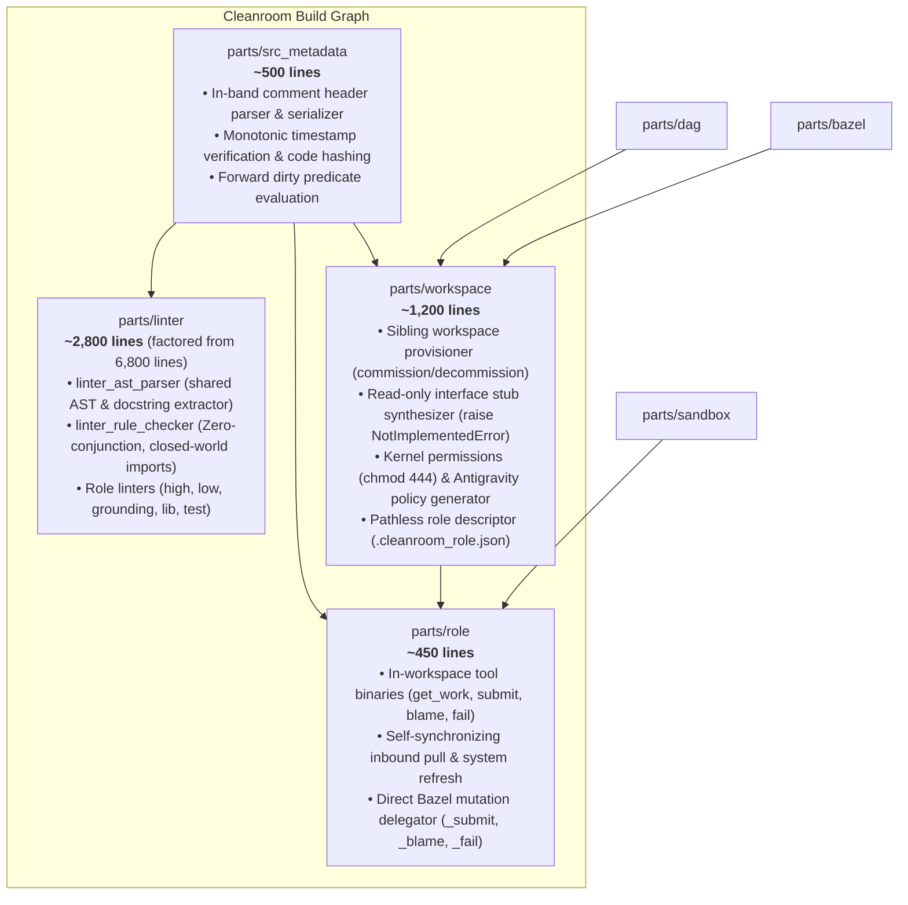
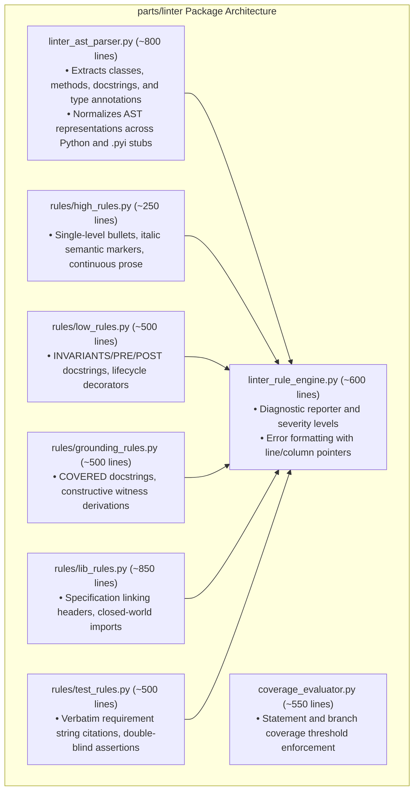
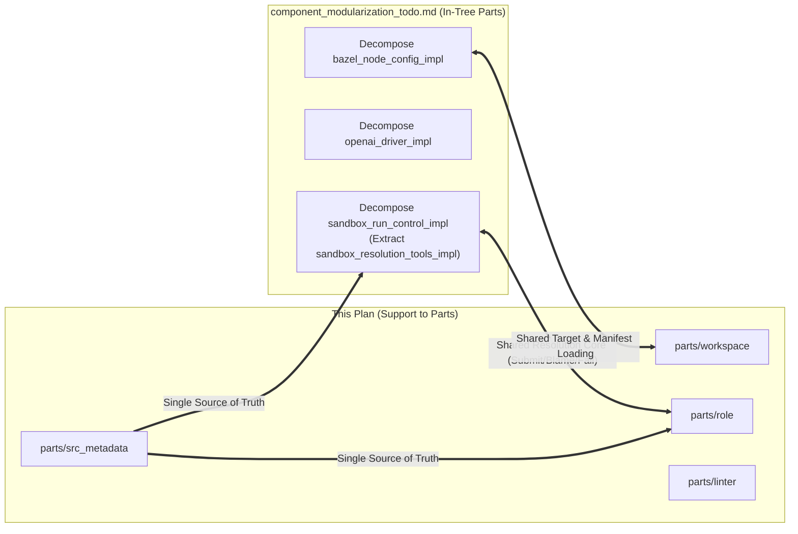
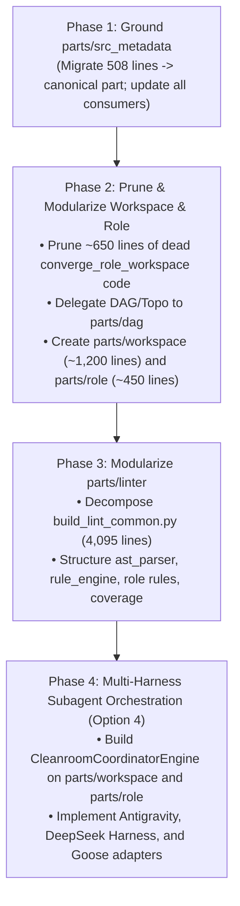

# Cleanroom Support Code Modularization Plan: Migrating Workspace, Role, Metadata, and Linters into Parts

This document specifies the architectural plan for modularizing Cleanroom's ungrounded host infrastructure (`support/lib/`) into formal Cleanroom packages (`parts/`) adhering to the 5-stage specification pipeline (`high/` $\to$ `planning/` $\to$ `low/` $\to$ `grounding/` $\to$ `lib/` $\to$ `tests/`).

> [!IMPORTANT]
> **Prerequisite to Autonomous Subagent Orchestration**
> This modularization work MUST precede the implementation of the multi-harness subagent orchestration layer documented in [Subagent-Driven Cleanroom Workspaces](file:///Users/seanmcdirmid/projects/cleanroom/design-docs/subagent_driven_cleanroom_workspaces_todo.md). Driving an ungrounded 4,104-line monolithic "god file" with autonomous subagents would compound technical debt. Grounding and modularizing this code establishes clean, single-responsibility APIs for subagent harnesses to control.

---

## 1. Executive Summary & The "Ungrounded Infrastructure" Problem

### 1.1 The Cleanroom Paradox
Cleanroom enforces strict, formal mathematical contracts for domain software:
- Every library function must have a typed low-level interface (`low/*.pyi`).
- Every postcondition must be discharged by a static Python grounding proof (`grounding/*.py`).
- Every test must be derived double-blind from specifications.

Yet, Cleanroom's own vital execution infrastructure—its workspace provisioner, role binaries, build graph evaluator, in-band metadata parser, and linters—lives **outside** this pipeline as ungrounded host utility scripts in `update_with_ai/support/lib/` and `update_python_with_ai/support/lib/`.

### 1.2 Concrete Code Audit of `support/lib/`
An audit reveals **over 13,500 lines of Python code** currently living in `support/lib/`:

| Subsystem / Component | Current Location | Lines | Core Responsibilities | Target Decomposed Part |
| :--- | :--- | :---: | :--- | :--- |
| **Workspace Engine** (`cleanroom_workspace_tool.py`) | `update_with_ai/support/lib/` | **4,104** | Provisioning, stubs, DAG evaluation, dead converge engine, Antigravity config, CLI. | **`parts/workspace`** (~1,200 lines after pruning & delegation). |
| **Role In-Workspace CLI** (`cleanroom_role_tool.py`) | `update_with_ai/support/lib/` | **883** | `bin/get_work`, `bin/submit`, `bin/blame`, `bin/fail` dispatchers. | **`parts/role`** (~450 lines). |
| **In-Band Metadata Engine** (`src_metadata.py`) | `update_with_ai/support/lib/` & `update_python_with_ai/` | **508** | In-band comment header parsing, formatting, code hashing, and forward dirty predicates. | **`parts/src_metadata`** (~500 lines). |
| **Shared Linter Framework** (`build_lint_common.py`) | `update_python_with_ai/support/lib/` | **4,095** | Monolithic AST parsing, docstring extraction, import boundary validation, and error formatting. | **`parts/linter`** (decomposed into parser, checker, and rule sets). |
| **Concrete Role Linters** | `update_python_with_ai/support/lib/` | **2,704** | • `lib_lint.py`: 894 lines<br/>• `test_lint.py`: 528 lines<br/>• `low_lint.py`: 522 lines<br/>• `grounding_lint.py`: 504 lines<br/>• `high_lint.py`: 256 lines | **`parts/linter`** (co-located role validator rules). |
| **Test Coverage Arbiter** (`evaluate_coverage.py`) | `update_with_ai/support/lib/` | **554** | Hermetic statement coverage evaluation and threshold enforcement. | **`parts/coverage`** (~550 lines). |
| **Lifecycle & Framework** (`lifecycle.py`, `framework.py`) | `update_python_with_ai/support/lib/` | **888** | Dependency injection registry, singleton management, tier scoping. | Retained as minimal bootstrap runtime or moved to **`parts/core`**. |
| **Total Ungrounded Code** | | **13,736** | | |

---

## 2. Deconstruction & Overlap Analysis with Existing `parts/`

### 2.1 The "God-File" Problem in `cleanroom_workspace_tool.py` (4,104 Lines)
A detailed architectural breakdown reveals that `cleanroom_workspace_tool.py` contains **6 distinct subsystems**, with massive duplication against existing canonical Cleanroom packages:

```mermaid
flowchart TD
    subgraph SupportMonolith ["cleanroom_workspace_tool.py (4,104 lines)"]
        DeadSync["Dead Pre-Zero-Sync Code (541 lines converge + 113 lines sync)"]
        DupDAG["DAG Dirtiness & Topo Sorting (600 lines)"]
        DupTriad["Submit/Blame/Fail Handlers (400 lines)"]
        DupAST["Starlark AST Evaluator (300 lines)"]
        NovelProv["Workspace Provisioning & Hardening (800 lines)"]
        NovelStubs["Read-Only Interface Stub Synthesizer (250 lines)"]
        NovelPolicy["Antigravity / Harness Policy Config (150 lines)"]
        NovelPull["Inbound Pull & Hash Verification (250 lines)"]
        CLIArg["CLI Argument Parser (400 lines)"]
    end

    subgraph Actions ["Refactoring Action"]
        Prune["1. PRUNE (~650 lines dead code)"]
        DelegateDAG["2. DELEGATE to parts/dag (~600 lines eliminated)"]
        DelegateSandbox["3. DELEGATE to parts/sandbox (~400 lines eliminated)"]
        DelegateBazel["4. DELEGATE to parts/bazel (~300 lines eliminated)"]
        NewWorkspace["5. FACTOR into parts/workspace (~1,200 lines)"]
        NewRole["6. FACTOR into parts/role (~450 lines)"]
    end

    DeadSync --> Prune
    DupDAG --> DelegateDAG
    DupTriad --> DelegateSandbox
    DupAST --> DelegateBazel
    NovelProv --> NewWorkspace
    NovelStubs --> NewWorkspace
    NovelPolicy --> NewWorkspace
    NovelPull --> NewRole
    CLIArg --> NewRole
```



1. **Dead Pre-Zero-Sync Engine (~650 lines to PRUNE)**:
   - `converge_role_workspace()` (541 lines) and `cleanroom_sync()` (113 lines) were designed for the obsolete architecture that used local JSON buffer files (`.cleanroom_blame_buffer.json`, `.cleanroom_audit_buffer.json`) and complex two-way synchronization sweeps.
   - Because Cleanroom migrated to zero-sync direct Bazel mutations, this entire subsystem is obsolete and will be deleted.
2. **Duplication of `parts/dag` (~600 lines to DELEGATE)**:
   - `cleanroom_workspace_tool.py` re-implements `compute_role_work_queue()`, `eval_unit_dirty()`, and `topological_sort_units()`.
   - `update_with_ai/parts/dag/` (`dag_subgraph_impl.py`, `dag_storage.py`) *already* implements Kahn's topological sort, `_role_tier()` phase ordering, and dependency traversal.
3. **Duplication of `parts/sandbox` (~400 lines to DELEGATE)**:
   - `cleanroom_role_tool.py` duplicates the resolution triad (`submit`, `blame`, `fail`).
   - `update_with_ai/parts/sandbox/` (`sandbox_run_control_impl.py`) *already* defines `SubmitTool`, `BlameTool`, and `FailTool`. Factoring these tools as planned in [`component_modularization_todo.md`](file:///Users/seanmcdirmid/projects/cleanroom/design-docs/component_modularization_todo.md) creates a single shared resolution engine for both Option 1 (headless loop) and Option 3/4 (workspaces).
4. **Duplication of `parts/bazel` (~300 lines to DELEGATE)**:
   - `cleanroom_workspace_tool.py` has a 61-line custom Python AST evaluator (`_eval_ast_node`) to parse `roles.bzl`.
   - `update_with_ai/parts/bazel/` (`bazel_manifest_loader_impl.py`) already loads and parses Bazel packages, targets, and manifests.

---

## 3. The Target Modular Parts Architecture

The support infrastructure will be migrated into **four formal Cleanroom packages** under `update_with_ai/parts/`:

```
update_with_ai/parts/
├── src_metadata/       # The canonical in-band source state engine
├── workspace/          # Sibling workspace provisioning, stubs, and hardening
├── role/               # In-workspace role execution loop (get_work, submit, blame, fail)
└── linter/             # Factored specification and code alignment linters
```



---

### 3.1 Part 1: `parts/src_metadata` (The State Engine)

`src_metadata` is the fundamental state substrate of Cleanroom. It must be formalized as a first-class grounded part before any other component.

#### Responsibilities
1. **Comment Header Extraction & Stamping**:
   - Parses `LAST_CLEANED`, `LAST_CHANGED`, `CHANGE:`, `CODE_HASH:`, `FEEDBACK:`, and `<ROLE>_AUDIT:` metadata blocks.
   - Preserves line 1 non-code directives (shebang `#!/usr/bin/env python3` and encoding comments).
2. **Forward Dirtiness Evaluation**:
   - Evaluates whether an implementation or contract file is dirty relative to its upstream dependencies without requiring external databases.
3. **Monotonicity & Invariants**:
   - Validates that `LAST_CLEANED` and `LAST_CHANGED` timestamps are monotonically non-decreasing UTC timestamps.
   - Computes deterministic SHA-256 hashes of code bodies (ignoring metadata comments).

#### Specification Artifacts
- `parts/src_metadata/high/src_metadata.md`
- `parts/src_metadata/planning/src_metadata.md`
- `parts/src_metadata/low/src_metadata.pyi`
- `parts/src_metadata/grounding/src_metadata.py`
- `parts/src_metadata/lib/src_metadata_impl.py`
- `parts/src_metadata/tests/src_metadata_impl_test.py`

---

### 3.2 Part 2: `parts/workspace` (Workspace Provisioning & Stub Synthesis)

Owns the lifecycle and security confinement of role workspaces outside the canonical repository.

#### Responsibilities
1. **Sibling Workspace Lifecycle**:
   - `commission`: Creates `../role_workspaces/<ws>_<role>_<dir>/`, copies relevant files, sets permissions, and deploys `bin/` tools.
   - `decommission`: Verifies workspace is clean and removes directory cleanly.
2. **Double-Blind Interface Stub Synthesizer**:
   - Inspects companion specification `low/*.pyi`.
   - Synthesizes a non-implementing interface stub in `lib/*.py` containing all class declarations, method signatures, parameter names, and type annotations, with bodies replaced by:
     ```python
     raise NotImplementedError("Cleanroom Test Stub: Behavior specified in .pyi")
     ```
   - Sets file permissions to `chmod 444`.
3. **Kernel Hardening & Confinement Policy**:
   - Enforces read-only permissions (`chmod 444`) on all specification files, guides, and build files.
   - Generates Antigravity project configuration in `~/.gemini/config/projects/<hash>.json` with:
     ```json
     {
       "settings": {
         "fileAccessPolicy": "AGENT_SETTING_POLICY_DENY",
         "sandboxMode": false
       },
       "isWorkspaceOnly": true
     }
     ```
4. **Pathless Descriptors & Convention Discovery**:
   - Writes pathless `.cleanroom_role.json`.
   - Implements `resolve_main_workspace_from_convention()` resolving `../../<ws_name>`.

---

### 3.3 Part 3: `parts/role` (In-Workspace Execution & Mutation Triad)

Owns the commands executed by agents inside a commissioned role workspace.

#### Responsibilities
1. **Self-Synchronizing Inbound Pull (`bin/get_work`)**:
   - Silently pulls updated read-only contracts and stubs from canonical main.
   - Refreshes `AGENTS.md` and bin tools.
   - Evaluates the global work queue using `parts/dag` and returns topologically sorted ready units.
2. **Direct Bazel Mutation Execution (`bin/submit`, `bin/blame`, `bin/fail`)**:
   - `submit`: Validates change summary requirements, copies modified file to canonical main, and delegates to `bazel run //pkg:unit_role_submit`.
   - `blame`: Injects critique into upstream contract's `FEEDBACK:` and executes `bazel run //pkg:culprit_blame`.
   - `fail`: Records failure diagnostics via `bazel run //pkg:unit_fail`.
3. **Multi-Unit Processing Driver**:
   - Enforces loop invariants so subagents drain all ready units sequentially within a single turn.

---

### 3.4 Part 4: `parts/linter` (Factored Linter Suite)

Currently, [`build_lint_common.py`](file:///Users/seanmcdirmid/projects/cleanroom/update_python_with_ai/support/lib/build_lint_common.py) is a massive 4,095-line monolith containing parser logic, rule checkers, ast visitors, and reporting routines.

`parts/linter` will decompose this monolith into clean, single-responsibility components:



1. **`linter_ast_parser`**: Pure AST extraction engine. Reads source files and builds clean semantic models (functions, contracts, parameters, type annotations, and docstrings).
2. **`linter_rule_engine`**: Shared evaluation harness that matches AST nodes against declared rules and emits structured diagnostics.
3. **Role Rule Modules**: Focused rule definitions for each stage of the Cleanroom pipeline:
   - `high_rules`: Validates continuous prose, single-level standalone bullets, and italic semantic markers (`*term*`).
   - `low_rules`: Validates pure ellipsis interfaces (`...`), Design-by-Contract docstrings (`INVARIANTS:`, `PRECONDITIONS:`, `POSTCONDITIONS:`), and lifecycle decorators.
   - `grounding_rules`: Validates straight-line feasibility proofs, parameter reachability, and `COVERED:` docstrings.
   - `lib_rules`: Validates specification header links and forbids specification-only imports (`:framework`).
   - `test_rules`: Validates exact requirement string citations (`# Requirement: <verbatim>`).
4. **`coverage_evaluator`**: Migrates `evaluate_coverage.py` into a grounded part with formal contracts.

---

## 4. Integration with `component_modularization_todo.md`

This plan directly dovetails with the existing [`design-docs/component_modularization_todo.md`](file:///Users/seanmcdirmid/projects/cleanroom/design-docs/component_modularization_todo.md):



- When `sandbox_run_control_impl.py` factors out its **Resolution Triad Subsystem** (lines 1010–1686, 677 lines) into `sandbox_resolution_tools_impl.py`, both `parts/role` and the in-process headless loop will import and execute the **exact same resolution domain logic**.
- When `bazel_node_config_impl.py` factors out `bazel_resource_resolver_impl.py` (~450 lines), `parts/workspace` will share the same manifest loading logic, eliminating `cleanroom_workspace_tool`'s custom AST evaluator.

---

## 5. Strategic Execution Roadmap: Sequence Before Subagents

To ensure zero instability, the modularization work proceeds in four strict sequential phases **before** subagent orchestration begins:



### Phase 1: Formalize `parts/src_metadata`
1. Author HLS, Planning, LLS, and Grounding specs for `parts/src_metadata`.
2. Move implementation from `support/lib/src_metadata.py` to `parts/src_metadata/lib/src_metadata_impl.py`.
3. Point existing tools (`cleanroom_workspace_tool`, `cleanroom_role_tool`, linters) to `parts/src_metadata`.
4. Run `bazel test //...` to verify zero regression.

### Phase 2: Prune Legacy Code & Create `parts/workspace` and `parts/role`
1. Delete obsolete `converge_role_workspace()` and `cleanroom_sync()` code (~650 lines pruned).
2. Wire DAG queue evaluation to `parts/dag` (`DagSubgraph`).
3. Author formal specs for `parts/workspace`:
   - Sibling directory provisioning, `chmod 444` kernel locks, pathless descriptors, and test stub synthesis.
4. Author formal specs for `parts/role`:
   - `bin/get_work` inbound pull, `bin/submit`, `bin/blame`, `bin/fail`.
5. Update `bin/cleanroom` CLI to delegate to the new grounded parts.

### Phase 3: Decompose `build_lint_common.py` and Formalize `parts/linter`
1. Deconstruct `build_lint_common.py` into `linter_ast_parser` and `linter_rule_engine`.
2. Package role linters (`high_lint`, `low_lint`, `grounding_lint`, `lib_lint`, `test_lint`) into `parts/linter`.
3. Migrate `evaluate_coverage.py` into `parts/linter/lib/coverage_evaluator_impl.py`.
4. Run all linter test suites under Bazel.

### Phase 4: Build Subagent Orchestration Layer (Option 4)
1. Implement `CleanroomCoordinatorEngine` in `parts/workspace/lib/cleanroom_coordinator_engine.py`.
2. Implement Phase 1 adapters for **Google Antigravity**, **DeepSeek Harness (`dsh`)**, and **Goose** as specified in [`design-docs/subagent_driven_cleanroom_workspaces_todo.md`](file:///Users/seanmcdirmid/projects/cleanroom/design-docs/subagent_driven_cleanroom_workspaces_todo.md).
3. Connect `CleanroomTelemetry` and run empirical multi-model benchmark passes.

---

## 6. Architecture Ledger & Net Impact

| Dimension | Before Modularization | After Modularization | Net Impact |
| :--- | :--- | :--- | :--- |
| **Ungrounded Code in `support/lib/`** | 13,736 lines across 15 files | **< 300 lines** (minimal entrypoint bootstrap stubs) | **98% reduction** in ungrounded code. |
| **Monolithic God-Files** | • `cleanroom_workspace_tool.py`: 4,104 lines<br/>• `build_lint_common.py`: 4,095 lines | Eliminated; partitioned into focused components (< 800 lines each). | Eliminates both largest files in repo. |
| **Dead / Legacy Code** | ~650 lines of obsolete `converge` and buffer file sync | **0 lines** (completely pruned). | Permanent cleanup of tech debt. |
| **Code Duplication** | ~2,000 lines duplicated with `parts/dag`, `parts/bazel`, `parts/sandbox` | **0 lines** (direct reuse across packages). | Single source of truth for DAG and resolution. |
| **Cleanroom Pipeline Compliance** | Workspace tools and linters had **zero** specs or proofs | **100% compliant** with `high/`, `planning/`, `low/`, and `grounding/`. | **Complete dogfooding of Cleanroom on itself.** |
